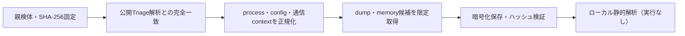

# Triage公開解析・後段取得証跡

## 完全ハッシュ一致

- [260923-yl3mzasy7n](https://tria.ge/260923-yl3mzasy7n): ファミリー候補 `stealc`、評価score `10`

## プロセス・通信

- 観測process: `AutoIt3.exe, Firstrunner.exe, at.exe, chrome.exe, elevation_service.exe, msedge.exe`
- raw commandは保存せず、command SHA-256と処理patternだけをJSONへ保持します。
- sandbox background trafficは`context_only`であり、C2へ自動昇格しません。

- `http://193.148.56.160/`（sandbox config候補）

## 後段取得物

- `17749d48907fafceae0b3eba8998a0f236758b82848d53b4476e7f76303a3582` / `memory_image` / 745472 bytes / 親と同一: `false` / 静的解析: `partial`
- `86abf1f936b8e47f9df53eeda1b2b83d587e7c2d41fead0bbf25caec792538d9` / `memory_image` / 2052096 bytes / 親と同一: `false` / 静的解析: `partial`

## 判定境界

Triage由来のfamily、process、config、通信は外部sandbox証跡です。Config extractorが返したendpointはC2候補として扱いますが、静的設定復元またはprocess帰属とprotocol応答が揃うまでは確認済みC2とはしません。取得成果物と検体は実行していません。
