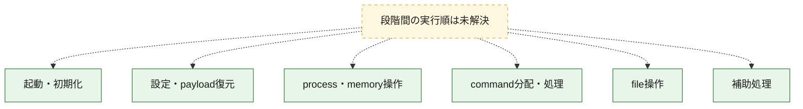
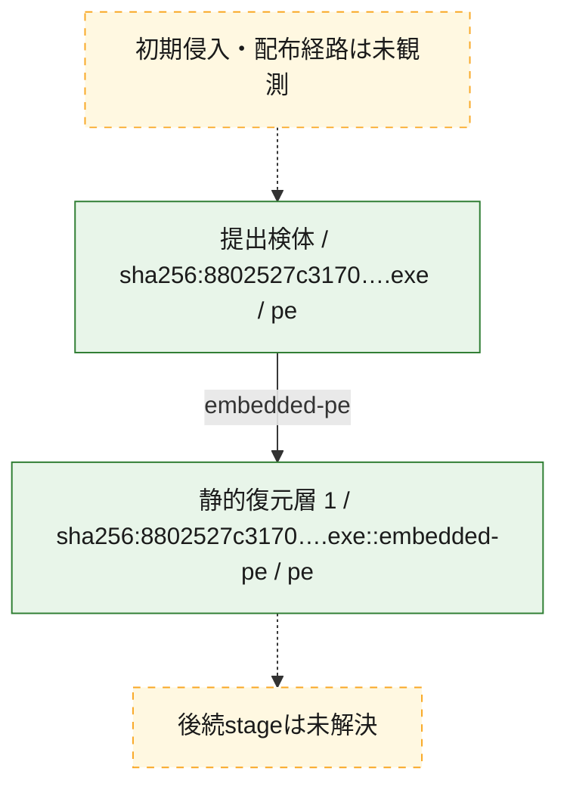
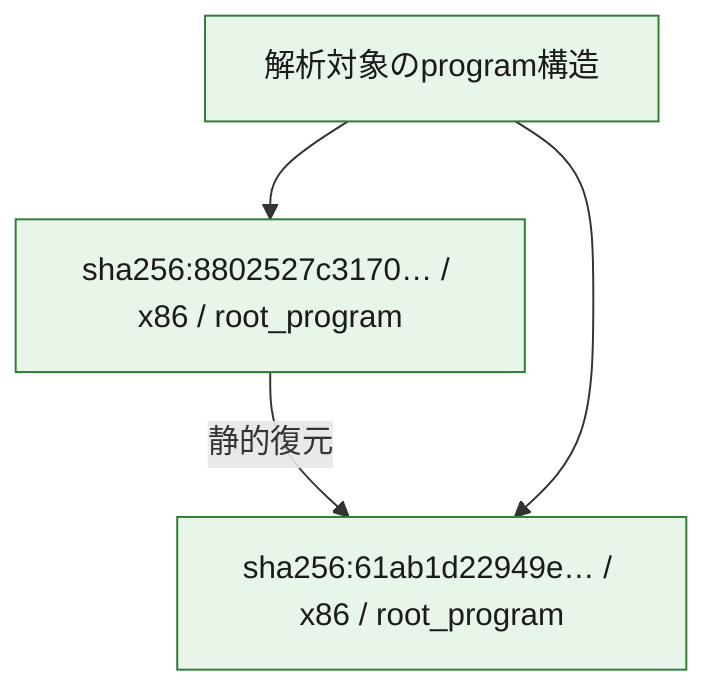

# 全体ロジック：8802527c317068b4b824d7bc1843dee0e52e047c7fae4997d577c11349c1ef01

代表関数の静的証跡から、起動・初期化、設定・payload復元、process・memory操作、command分配・処理、file操作の処理群を確認しました。

## 読み方

- phaseの掲載順は解析上の整理順です。observed_call_edgesがない段階間の実行順を断定しません。
- 図の実線は静的に観測した関係、点線と黄色のノードは未観測・未解決の関係を示します。
- 図は静的な要約であり、動的実行を再現するものではありません。
- 詳細な関数解説とfingerprintは[STATIC-LOGIC.md](STATIC-LOGIC.md)を参照してください。

## 静的可視化

### 実行フロー

### 感染チェーン

### モジュール関係

## 処理段階

### 1. 起動・初期化

entry pointから初期化と後続処理への移行を確認します。
確度: `confirmed_static_function_evidence`

- `61ab1d22949eac0582e989ae065ec4caee9ac99998276317edda96735cd311fb:ghidra:140002dac` — 初期化と主要処理への分岐を行う入口関数です。 状態: `succeeded`、選定理由: `entry_point`, `meaningful_symbol_name`, `reviewed_call_centrality:22`, `role:entrypoint`

### 2. 設定・payload復元

設定、resource、payload、暗号化データの復元・変換を確認します。
確度: `confirmed_static_function_evidence`

- `8802527c317068b4b824d7bc1843dee0e52e047c7fae4997d577c11349c1ef01:ghidra:140007814` — 暗号、hash、encoding、または復号処理に関係する関数です。 状態: `succeeded`、選定理由: `context_representative`, `reviewed_call_centrality:1`, `role:cryptographic_transform`

### 3. process・memory操作

process、thread、module、memory操作と実行移行を確認します。
確度: `confirmed_static_function_evidence`

- `61ab1d22949eac0582e989ae065ec4caee9ac99998276317edda96735cd311fb:ghidra:14000148c` — process、thread、module、またはmemory操作に関係する関数です。 状態: `succeeded`、選定理由: `context_representative`, `reviewed_call_centrality:37`, `role:process_or_memory_operation`
- `61ab1d22949eac0582e989ae065ec4caee9ac99998276317edda96735cd311fb:ghidra:140002940` — process、thread、module、またはmemory操作に関係する関数です。 状態: `succeeded`、選定理由: `context_representative`, `reviewed_call_centrality:11`, `role:process_or_memory_operation`

### 4. command分配・処理

受信commandやtaskの解釈、分配、個別handlerへの移行を確認します。
確度: `confirmed_static_function_evidence_with_limits`

- `61ab1d22949eac0582e989ae065ec4caee9ac99998276317edda96735cd311fb:ghidra:140014310` — commandの解釈、分配、または個別処理を担当する関数です。 状態: `limited_bad_instruction_or_flow`、選定理由: `meaningful_symbol_name`, `reviewed_call_centrality:1`, `role:command_dispatch_or_handler`

### 5. file操作

fileやdirectoryの作成、読書き、削除を確認します。
確度: `confirmed_static_function_evidence`

- `61ab1d22949eac0582e989ae065ec4caee9ac99998276317edda96735cd311fb:ghidra:140001170` — fileまたはdirectoryの読書き・管理に関係する関数です。 状態: `succeeded`、選定理由: `context_representative`, `reviewed_call_centrality:17`, `role:file_operation`
- `61ab1d22949eac0582e989ae065ec4caee9ac99998276317edda96735cd311fb:ghidra:1400013c0` — fileまたはdirectoryの読書き・管理に関係する関数です。 状態: `succeeded`、選定理由: `context_representative`, `reviewed_call_centrality:11`, `role:file_operation`
- `61ab1d22949eac0582e989ae065ec4caee9ac99998276317edda96735cd311fb:ghidra:140002614` — fileまたはdirectoryの読書き・管理に関係する関数です。 状態: `succeeded`、選定理由: `context_representative`, `reviewed_call_centrality:10`, `role:file_operation`

### 6. 補助処理

主要処理を支える一般内部関数またはlibrary処理を確認します。
確度: `confirmed_static_function_evidence_with_limits`

- `61ab1d22949eac0582e989ae065ec4caee9ac99998276317edda96735cd311fb:ghidra:140001000` — 検体内部の一般処理を実装する関数です。 状態: `succeeded`、選定理由: `context_representative`, `reviewed_call_centrality:1`
- `61ab1d22949eac0582e989ae065ec4caee9ac99998276317edda96735cd311fb:ghidra:140001048` — 検体内部の一般処理を実装する関数です。 状態: `succeeded`、選定理由: `context_representative`, `reviewed_call_centrality:2`
- `61ab1d22949eac0582e989ae065ec4caee9ac99998276317edda96735cd311fb:ghidra:1400010c4` — 検体内部の一般処理を実装する関数です。 状態: `succeeded`、選定理由: `context_representative`, `reviewed_call_centrality:6`
- `61ab1d22949eac0582e989ae065ec4caee9ac99998276317edda96735cd311fb:ghidra:1400010e4` — 検体内部の一般処理を実装する関数です。 状態: `succeeded`、選定理由: `context_representative`, `reviewed_call_centrality:1`
- `61ab1d22949eac0582e989ae065ec4caee9ac99998276317edda96735cd311fb:ghidra:140001120` — 検体内部の一般処理を実装する関数です。 状態: `succeeded`、選定理由: `context_representative`, `reviewed_call_centrality:1`
- `61ab1d22949eac0582e989ae065ec4caee9ac99998276317edda96735cd311fb:ghidra:14000115c` — 検体内部の一般処理を実装する関数です。 状態: `succeeded`、選定理由: `context_representative`, `reviewed_call_centrality:6`
- `61ab1d22949eac0582e989ae065ec4caee9ac99998276317edda96735cd311fb:ghidra:140001cbc` — 検体内部の一般処理を実装する関数です。 状態: `succeeded`、選定理由: `context_representative`, `reviewed_call_centrality:3`
- `61ab1d22949eac0582e989ae065ec4caee9ac99998276317edda96735cd311fb:ghidra:140001dcc` — 検体内部の一般処理を実装する関数です。 状態: `succeeded`、選定理由: `context_representative`, `reviewed_call_centrality:2`
- `61ab1d22949eac0582e989ae065ec4caee9ac99998276317edda96735cd311fb:ghidra:140001e64` — 検体内部の一般処理を実装する関数です。 状態: `succeeded`、選定理由: `context_representative`, `reviewed_call_centrality:4`
- `61ab1d22949eac0582e989ae065ec4caee9ac99998276317edda96735cd311fb:ghidra:140001ed8` — 検体内部の一般処理を実装する関数です。 状態: `succeeded`、選定理由: `context_representative`, `reviewed_call_centrality:7`
- `61ab1d22949eac0582e989ae065ec4caee9ac99998276317edda96735cd311fb:ghidra:14000201c` — 検体内部の一般処理を実装する関数です。 状態: `succeeded`、選定理由: `context_representative`, `reviewed_call_centrality:4`
- `61ab1d22949eac0582e989ae065ec4caee9ac99998276317edda96735cd311fb:ghidra:140002090` — 検体内部の一般処理を実装する関数です。 状態: `succeeded`、選定理由: `context_representative`, `reviewed_call_centrality:5`
- `61ab1d22949eac0582e989ae065ec4caee9ac99998276317edda96735cd311fb:ghidra:14000215c` — 検体内部の一般処理を実装する関数です。 状態: `succeeded`、選定理由: `context_representative`, `reviewed_call_centrality:7`
- `61ab1d22949eac0582e989ae065ec4caee9ac99998276317edda96735cd311fb:ghidra:1400021d8` — 検体内部の一般処理を実装する関数です。 状態: `succeeded`、選定理由: `context_representative`, `reviewed_call_centrality:7`
- `61ab1d22949eac0582e989ae065ec4caee9ac99998276317edda96735cd311fb:ghidra:140002328` — 検体内部の一般処理を実装する関数です。 状態: `succeeded`、選定理由: `context_representative`, `reviewed_call_centrality:7`
- `61ab1d22949eac0582e989ae065ec4caee9ac99998276317edda96735cd311fb:ghidra:14000245c` — 検体内部の一般処理を実装する関数です。 状態: `succeeded`、選定理由: `context_representative`, `reviewed_call_centrality:6`
- `61ab1d22949eac0582e989ae065ec4caee9ac99998276317edda96735cd311fb:ghidra:1400025b4` — 検体内部の一般処理を実装する関数です。 状態: `succeeded`、選定理由: `context_representative`, `reviewed_call_centrality:3`
- `61ab1d22949eac0582e989ae065ec4caee9ac99998276317edda96735cd311fb:ghidra:1400027c4` — 検体内部の一般処理を実装する関数です。 状態: `succeeded`、選定理由: `context_representative`, `reviewed_call_centrality:3`
- `61ab1d22949eac0582e989ae065ec4caee9ac99998276317edda96735cd311fb:ghidra:14000284c` — 検体内部の一般処理を実装する関数です。 状態: `succeeded`、選定理由: `context_representative`, `reviewed_call_centrality:1`
- `61ab1d22949eac0582e989ae065ec4caee9ac99998276317edda96735cd311fb:ghidra:140002888` — 検体内部の一般処理を実装する関数です。 状態: `succeeded`、選定理由: `context_representative`, `reviewed_call_centrality:2`
- `61ab1d22949eac0582e989ae065ec4caee9ac99998276317edda96735cd311fb:ghidra:1400028d0` — 検体内部の一般処理を実装する関数です。 状態: `succeeded`、選定理由: `context_representative`, `reviewed_call_centrality:1`
- `61ab1d22949eac0582e989ae065ec4caee9ac99998276317edda96735cd311fb:ghidra:14000290c` — 検体内部の一般処理を実装する関数です。 状態: `succeeded`、選定理由: `context_representative`, `reviewed_call_centrality:4`
- `61ab1d22949eac0582e989ae065ec4caee9ac99998276317edda96735cd311fb:ghidra:140002960` — 検体内部の一般処理を実装する関数です。 状態: `succeeded`、選定理由: `context_representative`, `reviewed_call_centrality:7`
- `61ab1d22949eac0582e989ae065ec4caee9ac99998276317edda96735cd311fb:ghidra:1400029ac` — 検体内部の一般処理を実装する関数です。 状態: `succeeded`、選定理由: `context_representative`, `reviewed_call_centrality:1`
- `61ab1d22949eac0582e989ae065ec4caee9ac99998276317edda96735cd311fb:ghidra:140003100` — 検体内部の一般処理を実装する関数です。 状態: `succeeded`、選定理由: `meaningful_symbol_name`
- `8802527c317068b4b824d7bc1843dee0e52e047c7fae4997d577c11349c1ef01:ghidra:140001ca0` — 検体内部の一般処理を実装する関数です。 状態: `succeeded`、選定理由: `context_representative`, `reviewed_call_centrality:5`
- `8802527c317068b4b824d7bc1843dee0e52e047c7fae4997d577c11349c1ef01:ghidra:140001d20` — 検体内部の一般処理を実装する関数です。 状態: `succeeded`、選定理由: `context_representative`, `reviewed_call_centrality:3`
- `8802527c317068b4b824d7bc1843dee0e52e047c7fae4997d577c11349c1ef01:ghidra:140001d40` — 検体内部の一般処理を実装する関数です。 状態: `succeeded`、選定理由: `context_representative`, `reviewed_call_centrality:1`
- `8802527c317068b4b824d7bc1843dee0e52e047c7fae4997d577c11349c1ef01:ghidra:140001d90` — 検体内部の一般処理を実装する関数です。 状態: `succeeded`、選定理由: `context_representative`, `reviewed_call_centrality:2`
- `8802527c317068b4b824d7bc1843dee0e52e047c7fae4997d577c11349c1ef01:ghidra:140001e20` — 検体内部の一般処理を実装する関数です。 状態: `succeeded`、選定理由: `context_representative`, `reviewed_call_centrality:4`
- `8802527c317068b4b824d7bc1843dee0e52e047c7fae4997d577c11349c1ef01:ghidra:140001e40` — 検体内部の一般処理を実装する関数です。 状態: `succeeded`、選定理由: `context_representative`, `reviewed_call_centrality:1`
- `8802527c317068b4b824d7bc1843dee0e52e047c7fae4997d577c11349c1ef01:ghidra:140001e7c` — 検体内部の一般処理を実装する関数です。 状態: `succeeded`、選定理由: `context_representative`, `reviewed_call_centrality:1`
- `8802527c317068b4b824d7bc1843dee0e52e047c7fae4997d577c11349c1ef01:ghidra:140001eb8` — 検体内部の一般処理を実装する関数です。 状態: `succeeded`、選定理由: `context_representative`, `reviewed_call_centrality:11`
- `8802527c317068b4b824d7bc1843dee0e52e047c7fae4997d577c11349c1ef01:ghidra:140001ecc` — 検体内部の一般処理を実装する関数です。 状態: `succeeded`、選定理由: `context_representative`, `reviewed_call_centrality:8`
- `8802527c317068b4b824d7bc1843dee0e52e047c7fae4997d577c11349c1ef01:ghidra:140002ae0` — 検体内部の一般処理を実装する関数です。 状態: `succeeded`、選定理由: `context_representative`, `reviewed_call_centrality:9`
- `8802527c317068b4b824d7bc1843dee0e52e047c7fae4997d577c11349c1ef01:ghidra:1400078a8` — 検体内部の一般処理を実装する関数です。 状態: `succeeded`、選定理由: `context_representative`, `reviewed_call_centrality:7`
- `8802527c317068b4b824d7bc1843dee0e52e047c7fae4997d577c11349c1ef01:ghidra:140007900` — 検体内部の一般処理を実装する関数です。 状態: `succeeded`、選定理由: `context_representative`, `reviewed_call_centrality:6`
- `8802527c317068b4b824d7bc1843dee0e52e047c7fae4997d577c11349c1ef01:ghidra:1400079dc` — 検体内部の一般処理を実装する関数です。 状態: `succeeded`、選定理由: `context_representative`, `reviewed_call_centrality:3`
- `8802527c317068b4b824d7bc1843dee0e52e047c7fae4997d577c11349c1ef01:ghidra:140007a40` — 検体内部の一般処理を実装する関数です。 状態: `succeeded`、選定理由: `context_representative`, `reviewed_call_centrality:3`
- `8802527c317068b4b824d7bc1843dee0e52e047c7fae4997d577c11349c1ef01:ghidra:140007a8c` — 検体内部の一般処理を実装する関数です。 状態: `succeeded`、選定理由: `context_representative`, `reviewed_call_centrality:3`
- `8802527c317068b4b824d7bc1843dee0e52e047c7fae4997d577c11349c1ef01:ghidra:140007ad8` — 検体内部の一般処理を実装する関数です。 状態: `succeeded`、選定理由: `context_representative`, `reviewed_call_centrality:12`
- `8802527c317068b4b824d7bc1843dee0e52e047c7fae4997d577c11349c1ef01:ghidra:140007b98` — 検体内部の一般処理を実装する関数です。 状態: `succeeded`、選定理由: `context_representative`, `reviewed_call_centrality:11`
- `8802527c317068b4b824d7bc1843dee0e52e047c7fae4997d577c11349c1ef01:ghidra:140007c00` — 検体内部の一般処理を実装する関数です。 状態: `succeeded`、選定理由: `context_representative`, `reviewed_call_centrality:8`
- `8802527c317068b4b824d7bc1843dee0e52e047c7fae4997d577c11349c1ef01:ghidra:140007cfc` — 検体内部の一般処理を実装する関数です。 状態: `succeeded`、選定理由: `context_representative`, `reviewed_call_centrality:8`
- `8802527c317068b4b824d7bc1843dee0e52e047c7fae4997d577c11349c1ef01:ghidra:140007d38` — 検体内部の一般処理を実装する関数です。 状態: `succeeded`、選定理由: `context_representative`, `reviewed_call_centrality:14`
- `8802527c317068b4b824d7bc1843dee0e52e047c7fae4997d577c11349c1ef01:ghidra:140008520` — 検体内部の一般処理を実装する関数です。 状態: `succeeded`、選定理由: `context_representative`, `reviewed_call_centrality:9`
- `8802527c317068b4b824d7bc1843dee0e52e047c7fae4997d577c11349c1ef01:ghidra:140008704` — 検体内部の一般処理を実装する関数です。 状態: `succeeded`、選定理由: `context_representative`, `reviewed_call_centrality:1`
- `8802527c317068b4b824d7bc1843dee0e52e047c7fae4997d577c11349c1ef01:ghidra:1400087cc` — 検体内部の一般処理を実装する関数です。 状態: `succeeded`、選定理由: `context_representative`, `reviewed_call_centrality:5`
- `8802527c317068b4b824d7bc1843dee0e52e047c7fae4997d577c11349c1ef01:ghidra:140008844` — 検体内部の一般処理を実装する関数です。 状態: `limited_bad_instruction_or_flow`、選定理由: `context_representative`, `reviewed_call_centrality:8`
- `8802527c317068b4b824d7bc1843dee0e52e047c7fae4997d577c11349c1ef01:ghidra:1400088f4` — 検体内部の一般処理を実装する関数です。 状態: `succeeded`、選定理由: `context_representative`, `reviewed_call_centrality:7`
- `8802527c317068b4b824d7bc1843dee0e52e047c7fae4997d577c11349c1ef01:ghidra:140008a38` — 検体内部の一般処理を実装する関数です。 状態: `succeeded`、選定理由: `context_representative`, `reviewed_call_centrality:17`
- `8802527c317068b4b824d7bc1843dee0e52e047c7fae4997d577c11349c1ef01:ghidra:140009200` — 検体内部の一般処理を実装する関数です。 状態: `succeeded`、選定理由: `context_representative`, `reviewed_call_centrality:7`
- `8802527c317068b4b824d7bc1843dee0e52e047c7fae4997d577c11349c1ef01:ghidra:140009478` — 検体内部の一般処理を実装する関数です。 状態: `succeeded`、選定理由: `context_representative`, `reviewed_call_centrality:19`
- `8802527c317068b4b824d7bc1843dee0e52e047c7fae4997d577c11349c1ef01:ghidra:140009af4` — 検体内部の一般処理を実装する関数です。 状態: `succeeded`、選定理由: `context_representative`, `reviewed_call_centrality:4`
- `8802527c317068b4b824d7bc1843dee0e52e047c7fae4997d577c11349c1ef01:ghidra:140009b5c` — 検体内部の一般処理を実装する関数です。 状態: `succeeded`、選定理由: `context_representative`, `reviewed_call_centrality:5`
- `8802527c317068b4b824d7bc1843dee0e52e047c7fae4997d577c11349c1ef01:ghidra:14001c5e0` — 検体内部の一般処理を実装する関数です。 状態: `succeeded`、選定理由: `meaningful_symbol_name`

## 観測したcall関係

- 代表関数間で直接解決できた呼出関係はありません。

## 解析範囲と制約

- 選定外関数は全体inventoryへ残しますが、関数本体の個別解説対象にはしていません。
- indirect call、難読化、packer、VM、壊れたcontrol flowによりcall関係が欠落する場合があります。
- 文書は静的解析に基づき、検体実行や外部通信による動的確認は行っていません。
