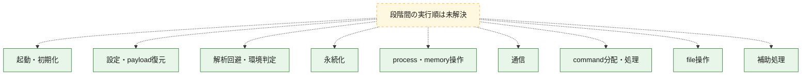
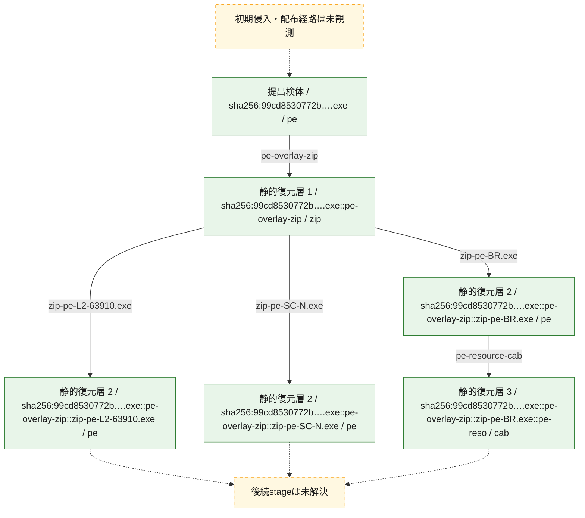
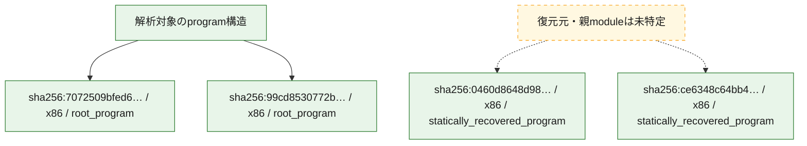

# 全体ロジック：99cd8530772b5bb986883ebfd09410bfd5328581a3e993472826eda78d6e3405

代表関数の静的証跡から、起動・初期化、設定・payload復元、解析回避・環境判定、永続化、process・memory操作、通信、command分配・処理、file操作の処理群を確認しました。

## 読み方

- phaseの掲載順は解析上の整理順です。observed_call_edgesがない段階間の実行順を断定しません。
- 図の実線は静的に観測した関係、点線と黄色のノードは未観測・未解決の関係を示します。
- 図は静的な要約であり、動的実行を再現するものではありません。
- 詳細な関数解説とfingerprintは[STATIC-LOGIC.md](STATIC-LOGIC.md)を参照してください。

## 静的可視化

### 実行フロー

### 感染チェーン

### モジュール関係

## 処理段階

### 1. 起動・初期化

entry pointから初期化と後続処理への移行を確認します。
確度: `confirmed_static_function_evidence`

- `7072509bfed6050e7f498f78adbb2fa8dd6b3ffb5ac71c2a3dff942bd484b413:ghidra:1400080c0` — 初期化と主要処理への分岐を行う入口関数です。 状態: `succeeded`、選定理由: `entry_point`, `meaningful_symbol_name`, `reviewed_call_centrality:18`, `role:entrypoint`

### 2. 設定・payload復元

設定、resource、payload、暗号化データの復元・変換を確認します。
確度: `confirmed_static_function_evidence`

- `7072509bfed6050e7f498f78adbb2fa8dd6b3ffb5ac71c2a3dff942bd484b413:ghidra:1400030a4` — 設定、resource、payloadなどの解析・変換を行う関数です。 状態: `succeeded`、選定理由: `context_representative`, `reviewed_call_centrality:27`, `role:config_or_data_transform`
- `ce6348c64bb4f9678e6626699097be83b1ba5911cb8779eb8f9e95dd03453fd8:ghidra:1400048a0` — 暗号、hash、encoding、または復号処理に関係する関数です。 状態: `succeeded`、選定理由: `meaningful_symbol_name`, `reviewed_call_centrality:4`, `role:cryptographic_transform`
- `ce6348c64bb4f9678e6626699097be83b1ba5911cb8779eb8f9e95dd03453fd8:ghidra:1400066a0` — 暗号、hash、encoding、または復号処理に関係する関数です。 状態: `succeeded`、選定理由: `meaningful_symbol_name`, `reviewed_call_centrality:4`, `role:cryptographic_transform`
- `ce6348c64bb4f9678e6626699097be83b1ba5911cb8779eb8f9e95dd03453fd8:ghidra:1400093e0` — 暗号、hash、encoding、または復号処理に関係する関数です。 状態: `succeeded`、選定理由: `meaningful_symbol_name`, `reviewed_call_centrality:5`, `role:cryptographic_transform`
- `ce6348c64bb4f9678e6626699097be83b1ba5911cb8779eb8f9e95dd03453fd8:ghidra:140009e20` — 暗号、hash、encoding、または復号処理に関係する関数です。 状態: `succeeded`、選定理由: `meaningful_symbol_name`, `reviewed_call_centrality:6`, `role:cryptographic_transform`
- `ce6348c64bb4f9678e6626699097be83b1ba5911cb8779eb8f9e95dd03453fd8:ghidra:14000a300` — 暗号、hash、encoding、または復号処理に関係する関数です。 状態: `succeeded`、選定理由: `meaningful_symbol_name`, `reviewed_call_centrality:3`, `role:cryptographic_transform`
- `ce6348c64bb4f9678e6626699097be83b1ba5911cb8779eb8f9e95dd03453fd8:ghidra:14000a3a0` — 暗号、hash、encoding、または復号処理に関係する関数です。 状態: `succeeded`、選定理由: `meaningful_symbol_name`, `reviewed_call_centrality:3`, `role:cryptographic_transform`
- `ce6348c64bb4f9678e6626699097be83b1ba5911cb8779eb8f9e95dd03453fd8:ghidra:14000a480` — 暗号、hash、encoding、または復号処理に関係する関数です。 状態: `succeeded`、選定理由: `meaningful_symbol_name`, `reviewed_call_centrality:4`, `role:cryptographic_transform`
- `ce6348c64bb4f9678e6626699097be83b1ba5911cb8779eb8f9e95dd03453fd8:ghidra:14000a580` — 暗号、hash、encoding、または復号処理に関係する関数です。 状態: `succeeded`、選定理由: `meaningful_symbol_name`, `reviewed_call_centrality:1`, `role:cryptographic_transform`
- `ce6348c64bb4f9678e6626699097be83b1ba5911cb8779eb8f9e95dd03453fd8:ghidra:14000ab40` — 暗号、hash、encoding、または復号処理に関係する関数です。 状態: `succeeded`、選定理由: `meaningful_symbol_name`, `reviewed_call_centrality:3`, `role:cryptographic_transform`
- `ce6348c64bb4f9678e6626699097be83b1ba5911cb8779eb8f9e95dd03453fd8:ghidra:14000ad20` — 暗号、hash、encoding、または復号処理に関係する関数です。 状態: `succeeded`、選定理由: `meaningful_symbol_name`, `reviewed_call_centrality:3`, `role:cryptographic_transform`
- `ce6348c64bb4f9678e6626699097be83b1ba5911cb8779eb8f9e95dd03453fd8:ghidra:14000ad60` — 暗号、hash、encoding、または復号処理に関係する関数です。 状態: `succeeded`、選定理由: `meaningful_symbol_name`, `reviewed_call_centrality:3`, `role:cryptographic_transform`
- `ce6348c64bb4f9678e6626699097be83b1ba5911cb8779eb8f9e95dd03453fd8:ghidra:14000ada0` — 暗号、hash、encoding、または復号処理に関係する関数です。 状態: `succeeded`、選定理由: `meaningful_symbol_name`, `reviewed_call_centrality:5`, `role:cryptographic_transform`
- `ce6348c64bb4f9678e6626699097be83b1ba5911cb8779eb8f9e95dd03453fd8:ghidra:14000ae60` — 暗号、hash、encoding、または復号処理に関係する関数です。 状態: `succeeded`、選定理由: `meaningful_symbol_name`, `reviewed_call_centrality:5`, `role:cryptographic_transform`
- `ce6348c64bb4f9678e6626699097be83b1ba5911cb8779eb8f9e95dd03453fd8:ghidra:14000af20` — 暗号、hash、encoding、または復号処理に関係する関数です。 状態: `succeeded`、選定理由: `meaningful_symbol_name`, `reviewed_call_centrality:3`, `role:cryptographic_transform`
- `ce6348c64bb4f9678e6626699097be83b1ba5911cb8779eb8f9e95dd03453fd8:ghidra:14000af80` — 暗号、hash、encoding、または復号処理に関係する関数です。 状態: `succeeded`、選定理由: `meaningful_symbol_name`, `reviewed_call_centrality:3`, `role:cryptographic_transform`
- `ce6348c64bb4f9678e6626699097be83b1ba5911cb8779eb8f9e95dd03453fd8:ghidra:14000afe0` — 暗号、hash、encoding、または復号処理に関係する関数です。 状態: `succeeded`、選定理由: `meaningful_symbol_name`, `reviewed_call_centrality:8`, `role:cryptographic_transform`

### 3. 解析回避・環境判定

debugger、sandbox、仮想環境、時間差などの判定を確認します。
確度: `confirmed_static_function_evidence`

- `ce6348c64bb4f9678e6626699097be83b1ba5911cb8779eb8f9e95dd03453fd8:ghidra:140009520` — debugger、仮想環境、sandbox、または時間差の確認に関係する関数です。 状態: `succeeded`、選定理由: `meaningful_symbol_name`, `reviewed_call_centrality:3`, `role:anti_analysis`

### 4. 永続化

自動起動や永続化に関係する設定変更を確認します。
確度: `confirmed_static_function_evidence`

- `7072509bfed6050e7f498f78adbb2fa8dd6b3ffb5ac71c2a3dff942bd484b413:ghidra:140004360` — 自動起動または永続化に関係する処理を含む関数です。 状態: `succeeded`、選定理由: `context_representative`, `reviewed_call_centrality:32`, `role:persistence`
- `ce6348c64bb4f9678e6626699097be83b1ba5911cb8779eb8f9e95dd03453fd8:ghidra:140015680` — 自動起動または永続化に関係する処理を含む関数です。 状態: `succeeded`、選定理由: `meaningful_symbol_name`, `reviewed_call_centrality:2`, `role:persistence`

### 5. process・memory操作

process、thread、module、memory操作と実行移行を確認します。
確度: `confirmed_static_function_evidence`

- `7072509bfed6050e7f498f78adbb2fa8dd6b3ffb5ac71c2a3dff942bd484b413:ghidra:14000163c` — process、thread、module、またはmemory操作に関係する関数です。 状態: `succeeded`、選定理由: `context_representative`, `reviewed_call_centrality:13`, `role:process_or_memory_operation`
- `7072509bfed6050e7f498f78adbb2fa8dd6b3ffb5ac71c2a3dff942bd484b413:ghidra:14000173c` — process、thread、module、またはmemory操作に関係する関数です。 状態: `succeeded`、選定理由: `context_representative`, `reviewed_call_centrality:23`, `role:process_or_memory_operation`
- `7072509bfed6050e7f498f78adbb2fa8dd6b3ffb5ac71c2a3dff942bd484b413:ghidra:140001ff4` — process、thread、module、またはmemory操作に関係する関数です。 状態: `succeeded`、選定理由: `context_representative`, `reviewed_call_centrality:16`, `role:process_or_memory_operation`
- `7072509bfed6050e7f498f78adbb2fa8dd6b3ffb5ac71c2a3dff942bd484b413:ghidra:1400020e8` — process、thread、module、またはmemory操作に関係する関数です。 状態: `succeeded`、選定理由: `context_representative`, `reviewed_call_centrality:28`, `role:process_or_memory_operation`
- `7072509bfed6050e7f498f78adbb2fa8dd6b3ffb5ac71c2a3dff942bd484b413:ghidra:1400033a8` — process、thread、module、またはmemory操作に関係する関数です。 状態: `succeeded`、選定理由: `context_representative`, `reviewed_call_centrality:31`, `role:process_or_memory_operation`
- `ce6348c64bb4f9678e6626699097be83b1ba5911cb8779eb8f9e95dd03453fd8:ghidra:140001b00` — process、thread、module、またはmemory操作に関係する関数です。 状態: `succeeded`、選定理由: `meaningful_symbol_name`, `reviewed_call_centrality:11`, `role:process_or_memory_operation`

### 6. 通信

通信初期化、endpoint処理、送受信の役割を確認します。
確度: `confirmed_static_function_evidence`

- `7072509bfed6050e7f498f78adbb2fa8dd6b3ffb5ac71c2a3dff942bd484b413:ghidra:140003830` — 通信初期化、送受信、またはendpoint処理に関係する関数です。 状態: `succeeded`、選定理由: `context_representative`, `reviewed_call_centrality:19`, `role:network_communication`
- `7072509bfed6050e7f498f78adbb2fa8dd6b3ffb5ac71c2a3dff942bd484b413:ghidra:140003940` — 通信初期化、送受信、またはendpoint処理に関係する関数です。 状態: `succeeded`、選定理由: `context_representative`, `reviewed_call_centrality:29`, `role:network_communication`
- `7072509bfed6050e7f498f78adbb2fa8dd6b3ffb5ac71c2a3dff942bd484b413:ghidra:140003c80` — 通信初期化、送受信、またはendpoint処理に関係する関数です。 状態: `succeeded`、選定理由: `context_representative`, `reviewed_call_centrality:22`, `role:network_communication`
- `ce6348c64bb4f9678e6626699097be83b1ba5911cb8779eb8f9e95dd03453fd8:ghidra:14000c2e0` — 通信初期化、送受信、またはendpoint処理に関係する関数です。 状態: `succeeded`、選定理由: `meaningful_symbol_name`, `reviewed_call_centrality:2`, `role:network_communication`
- `ce6348c64bb4f9678e6626699097be83b1ba5911cb8779eb8f9e95dd03453fd8:ghidra:14000c300` — 通信初期化、送受信、またはendpoint処理に関係する関数です。 状態: `succeeded`、選定理由: `meaningful_symbol_name`, `reviewed_call_centrality:23`, `role:network_communication`
- `ce6348c64bb4f9678e6626699097be83b1ba5911cb8779eb8f9e95dd03453fd8:ghidra:14000c8e0` — 通信初期化、送受信、またはendpoint処理に関係する関数です。 状態: `succeeded`、選定理由: `meaningful_symbol_name`, `reviewed_call_centrality:3`, `role:network_communication`
- `ce6348c64bb4f9678e6626699097be83b1ba5911cb8779eb8f9e95dd03453fd8:ghidra:14000c920` — 通信初期化、送受信、またはendpoint処理に関係する関数です。 状態: `succeeded`、選定理由: `meaningful_symbol_name`, `reviewed_call_centrality:8`, `role:network_communication`
- `ce6348c64bb4f9678e6626699097be83b1ba5911cb8779eb8f9e95dd03453fd8:ghidra:14000cae0` — 通信初期化、送受信、またはendpoint処理に関係する関数です。 状態: `succeeded`、選定理由: `meaningful_symbol_name`, `reviewed_call_centrality:3`, `role:network_communication`
- `ce6348c64bb4f9678e6626699097be83b1ba5911cb8779eb8f9e95dd03453fd8:ghidra:14000cbe0` — 通信初期化、送受信、またはendpoint処理に関係する関数です。 状態: `succeeded`、選定理由: `meaningful_symbol_name`, `reviewed_call_centrality:4`, `role:network_communication`
- `ce6348c64bb4f9678e6626699097be83b1ba5911cb8779eb8f9e95dd03453fd8:ghidra:14000cc60` — 通信初期化、送受信、またはendpoint処理に関係する関数です。 状態: `succeeded`、選定理由: `meaningful_symbol_name`, `reviewed_call_centrality:4`, `role:network_communication`
- `ce6348c64bb4f9678e6626699097be83b1ba5911cb8779eb8f9e95dd03453fd8:ghidra:14000d220` — 通信初期化、送受信、またはendpoint処理に関係する関数です。 状態: `succeeded`、選定理由: `meaningful_symbol_name`, `reviewed_call_centrality:2`, `role:network_communication`
- `ce6348c64bb4f9678e6626699097be83b1ba5911cb8779eb8f9e95dd03453fd8:ghidra:14000d240` — 通信初期化、送受信、またはendpoint処理に関係する関数です。 状態: `succeeded`、選定理由: `meaningful_symbol_name`, `reviewed_call_centrality:28`, `role:network_communication`
- `ce6348c64bb4f9678e6626699097be83b1ba5911cb8779eb8f9e95dd03453fd8:ghidra:14000d8e0` — 通信初期化、送受信、またはendpoint処理に関係する関数です。 状態: `succeeded`、選定理由: `meaningful_symbol_name`, `reviewed_call_centrality:3`, `role:network_communication`
- `ce6348c64bb4f9678e6626699097be83b1ba5911cb8779eb8f9e95dd03453fd8:ghidra:14000d920` — 通信初期化、送受信、またはendpoint処理に関係する関数です。 状態: `succeeded`、選定理由: `meaningful_symbol_name`, `reviewed_call_centrality:9`, `role:network_communication`

### 7. command分配・処理

受信commandやtaskの解釈、分配、個別handlerへの移行を確認します。
確度: `confirmed_static_function_evidence`

- `7072509bfed6050e7f498f78adbb2fa8dd6b3ffb5ac71c2a3dff942bd484b413:ghidra:140003e64` — commandの解釈、分配、または個別処理を担当する関数です。 状態: `succeeded`、選定理由: `context_representative`, `reviewed_call_centrality:7`, `role:command_dispatch_or_handler`
- `99cd8530772b5bb986883ebfd09410bfd5328581a3e993472826eda78d6e3405:ghidra:140001a44` — commandの解釈、分配、または個別処理を担当する関数です。 状態: `succeeded`、選定理由: `context_representative`, `reviewed_call_centrality:7`, `role:command_dispatch_or_handler`

### 8. file操作

fileやdirectoryの作成、読書き、削除を確認します。
確度: `confirmed_static_function_evidence`

- `7072509bfed6050e7f498f78adbb2fa8dd6b3ffb5ac71c2a3dff942bd484b413:ghidra:140001a74` — fileまたはdirectoryの読書き・管理に関係する関数です。 状態: `succeeded`、選定理由: `context_representative`, `reviewed_call_centrality:22`, `role:file_operation`
- `7072509bfed6050e7f498f78adbb2fa8dd6b3ffb5ac71c2a3dff942bd484b413:ghidra:1400023bc` — fileまたはdirectoryの読書き・管理に関係する関数です。 状態: `succeeded`、選定理由: `context_representative`, `reviewed_call_centrality:19`, `role:file_operation`
- `7072509bfed6050e7f498f78adbb2fa8dd6b3ffb5ac71c2a3dff942bd484b413:ghidra:140002580` — fileまたはdirectoryの読書き・管理に関係する関数です。 状態: `succeeded`、選定理由: `context_representative`, `reviewed_call_centrality:13`, `role:file_operation`
- `7072509bfed6050e7f498f78adbb2fa8dd6b3ffb5ac71c2a3dff942bd484b413:ghidra:140002758` — fileまたはdirectoryの読書き・管理に関係する関数です。 状態: `succeeded`、選定理由: `context_representative`, `reviewed_call_centrality:4`, `role:file_operation`
- `7072509bfed6050e7f498f78adbb2fa8dd6b3ffb5ac71c2a3dff942bd484b413:ghidra:140002904` — fileまたはdirectoryの読書き・管理に関係する関数です。 状態: `succeeded`、選定理由: `context_representative`, `reviewed_call_centrality:19`, `role:file_operation`
- `7072509bfed6050e7f498f78adbb2fa8dd6b3ffb5ac71c2a3dff942bd484b413:ghidra:140002b08` — fileまたはdirectoryの読書き・管理に関係する関数です。 状態: `succeeded`、選定理由: `context_representative`, `reviewed_call_centrality:16`, `role:file_operation`
- `7072509bfed6050e7f498f78adbb2fa8dd6b3ffb5ac71c2a3dff942bd484b413:ghidra:140002d10` — fileまたはdirectoryの読書き・管理に関係する関数です。 状態: `succeeded`、選定理由: `context_representative`, `reviewed_call_centrality:13`, `role:file_operation`
- `7072509bfed6050e7f498f78adbb2fa8dd6b3ffb5ac71c2a3dff942bd484b413:ghidra:140003644` — fileまたはdirectoryの読書き・管理に関係する関数です。 状態: `succeeded`、選定理由: `context_representative`, `reviewed_call_centrality:18`, `role:file_operation`
- `ce6348c64bb4f9678e6626699097be83b1ba5911cb8779eb8f9e95dd03453fd8:ghidra:140015480` — fileまたはdirectoryの読書き・管理に関係する関数です。 状態: `succeeded`、選定理由: `meaningful_symbol_name`, `reviewed_call_centrality:5`, `role:file_operation`

### 9. 補助処理

主要処理を支える一般内部関数またはlibrary処理を確認します。
確度: `confirmed_static_function_evidence`

- `7072509bfed6050e7f498f78adbb2fa8dd6b3ffb5ac71c2a3dff942bd484b413:ghidra:140001508` — 検体内部の一般処理を実装する関数です。 状態: `succeeded`、選定理由: `context_representative`, `reviewed_call_centrality:2`
- `7072509bfed6050e7f498f78adbb2fa8dd6b3ffb5ac71c2a3dff942bd484b413:ghidra:1400015c0` — 検体内部の一般処理を実装する関数です。 状態: `succeeded`、選定理由: `context_representative`, `reviewed_call_centrality:6`
- `7072509bfed6050e7f498f78adbb2fa8dd6b3ffb5ac71c2a3dff942bd484b413:ghidra:140001910` — 検体内部の一般処理を実装する関数です。 状態: `succeeded`、選定理由: `context_representative`, `reviewed_call_centrality:12`
- `7072509bfed6050e7f498f78adbb2fa8dd6b3ffb5ac71c2a3dff942bd484b413:ghidra:1400019d8` — 検体内部の一般処理を実装する関数です。 状態: `succeeded`、選定理由: `context_representative`, `reviewed_call_centrality:2`
- `7072509bfed6050e7f498f78adbb2fa8dd6b3ffb5ac71c2a3dff942bd484b413:ghidra:140002634` — 検体内部の一般処理を実装する関数です。 状態: `succeeded`、選定理由: `context_representative`, `reviewed_call_centrality:11`
- `7072509bfed6050e7f498f78adbb2fa8dd6b3ffb5ac71c2a3dff942bd484b413:ghidra:1400027e0` — 検体内部の一般処理を実装する関数です。 状態: `succeeded`、選定理由: `context_representative`, `reviewed_call_centrality:3`
- `7072509bfed6050e7f498f78adbb2fa8dd6b3ffb5ac71c2a3dff942bd484b413:ghidra:140002f54` — 検体内部の一般処理を実装する関数です。 状態: `succeeded`、選定理由: `context_representative`, `reviewed_call_centrality:18`
- `7072509bfed6050e7f498f78adbb2fa8dd6b3ffb5ac71c2a3dff942bd484b413:ghidra:1400037e0` — 検体内部の一般処理を実装する関数です。 状態: `succeeded`、選定理由: `context_representative`, `reviewed_call_centrality:2`
- `7072509bfed6050e7f498f78adbb2fa8dd6b3ffb5ac71c2a3dff942bd484b413:ghidra:140003be0` — 検体内部の一般処理を実装する関数です。 状態: `succeeded`、選定理由: `context_representative`, `reviewed_call_centrality:11`
- `7072509bfed6050e7f498f78adbb2fa8dd6b3ffb5ac71c2a3dff942bd484b413:ghidra:140003efc` — 検体内部の一般処理を実装する関数です。 状態: `succeeded`、選定理由: `context_representative`, `reviewed_call_centrality:12`
- `7072509bfed6050e7f498f78adbb2fa8dd6b3ffb5ac71c2a3dff942bd484b413:ghidra:140004220` — 検体内部の一般処理を実装する関数です。 状態: `succeeded`、選定理由: `context_representative`, `reviewed_call_centrality:13`
- `7072509bfed6050e7f498f78adbb2fa8dd6b3ffb5ac71c2a3dff942bd484b413:ghidra:140008b40` — 検体内部の一般処理を実装する関数です。 状態: `succeeded`、選定理由: `meaningful_symbol_name`, `reviewed_call_centrality:5`
- `ce6348c64bb4f9678e6626699097be83b1ba5911cb8779eb8f9e95dd03453fd8:ghidra:1400010a0` — 検体内部の一般処理を実装する関数です。 状態: `succeeded`、選定理由: `meaningful_symbol_name`, `reviewed_call_centrality:3`
- `99cd8530772b5bb986883ebfd09410bfd5328581a3e993472826eda78d6e3405:ghidra:140001000` — 検体内部の一般処理を実装する関数です。 状態: `succeeded`、選定理由: `context_representative`
- `99cd8530772b5bb986883ebfd09410bfd5328581a3e993472826eda78d6e3405:ghidra:140001010` — 検体内部の一般処理を実装する関数です。 状態: `succeeded`、選定理由: `context_representative`, `reviewed_call_centrality:1`
- `99cd8530772b5bb986883ebfd09410bfd5328581a3e993472826eda78d6e3405:ghidra:140001020` — 検体内部の一般処理を実装する関数です。 状態: `succeeded`、選定理由: `context_representative`, `reviewed_call_centrality:1`
- `99cd8530772b5bb986883ebfd09410bfd5328581a3e993472826eda78d6e3405:ghidra:140001040` — 検体内部の一般処理を実装する関数です。 状態: `succeeded`、選定理由: `context_representative`, `reviewed_call_centrality:5`
- `99cd8530772b5bb986883ebfd09410bfd5328581a3e993472826eda78d6e3405:ghidra:140001050` — 検体内部の一般処理を実装する関数です。 状態: `succeeded`、選定理由: `context_representative`, `reviewed_call_centrality:3`
- `99cd8530772b5bb986883ebfd09410bfd5328581a3e993472826eda78d6e3405:ghidra:140001080` — 検体内部の一般処理を実装する関数です。 状態: `succeeded`、選定理由: `context_representative`, `reviewed_call_centrality:1`
- `99cd8530772b5bb986883ebfd09410bfd5328581a3e993472826eda78d6e3405:ghidra:140001090` — 検体内部の一般処理を実装する関数です。 状態: `succeeded`、選定理由: `context_representative`, `reviewed_call_centrality:1`
- `99cd8530772b5bb986883ebfd09410bfd5328581a3e993472826eda78d6e3405:ghidra:1400010a0` — 検体内部の一般処理を実装する関数です。 状態: `succeeded`、選定理由: `context_representative`, `reviewed_call_centrality:2`
- `99cd8530772b5bb986883ebfd09410bfd5328581a3e993472826eda78d6e3405:ghidra:1400010c0` — 検体内部の一般処理を実装する関数です。 状態: `succeeded`、選定理由: `context_representative`, `reviewed_call_centrality:1`
- `99cd8530772b5bb986883ebfd09410bfd5328581a3e993472826eda78d6e3405:ghidra:1400010d0` — 検体内部の一般処理を実装する関数です。 状態: `succeeded`、選定理由: `context_representative`, `reviewed_call_centrality:1`
- `99cd8530772b5bb986883ebfd09410bfd5328581a3e993472826eda78d6e3405:ghidra:1400010e0` — 検体内部の一般処理を実装する関数です。 状態: `succeeded`、選定理由: `context_representative`, `reviewed_call_centrality:1`
- `99cd8530772b5bb986883ebfd09410bfd5328581a3e993472826eda78d6e3405:ghidra:1400010f0` — 検体内部の一般処理を実装する関数です。 状態: `succeeded`、選定理由: `context_representative`, `reviewed_call_centrality:2`
- `99cd8530772b5bb986883ebfd09410bfd5328581a3e993472826eda78d6e3405:ghidra:140001110` — 検体内部の一般処理を実装する関数です。 状態: `succeeded`、選定理由: `context_representative`, `reviewed_call_centrality:1`
- `99cd8530772b5bb986883ebfd09410bfd5328581a3e993472826eda78d6e3405:ghidra:140001120` — 検体内部の一般処理を実装する関数です。 状態: `succeeded`、選定理由: `context_representative`, `reviewed_call_centrality:1`
- `99cd8530772b5bb986883ebfd09410bfd5328581a3e993472826eda78d6e3405:ghidra:140001130` — 検体内部の一般処理を実装する関数です。 状態: `succeeded`、選定理由: `context_representative`, `reviewed_call_centrality:1`
- `99cd8530772b5bb986883ebfd09410bfd5328581a3e993472826eda78d6e3405:ghidra:140001140` — 検体内部の一般処理を実装する関数です。 状態: `succeeded`、選定理由: `context_representative`
- `99cd8530772b5bb986883ebfd09410bfd5328581a3e993472826eda78d6e3405:ghidra:140001150` — 検体内部の一般処理を実装する関数です。 状態: `succeeded`、選定理由: `context_representative`, `reviewed_call_centrality:2`
- `99cd8530772b5bb986883ebfd09410bfd5328581a3e993472826eda78d6e3405:ghidra:140001170` — 検体内部の一般処理を実装する関数です。 状態: `succeeded`、選定理由: `context_representative`, `reviewed_call_centrality:2`
- `99cd8530772b5bb986883ebfd09410bfd5328581a3e993472826eda78d6e3405:ghidra:140001190` — 検体内部の一般処理を実装する関数です。 状態: `succeeded`、選定理由: `context_representative`, `reviewed_call_centrality:3`
- `99cd8530772b5bb986883ebfd09410bfd5328581a3e993472826eda78d6e3405:ghidra:14000120c` — 検体内部の一般処理を実装する関数です。 状態: `succeeded`、選定理由: `context_representative`, `reviewed_call_centrality:2`
- `99cd8530772b5bb986883ebfd09410bfd5328581a3e993472826eda78d6e3405:ghidra:1400012a8` — 検体内部の一般処理を実装する関数です。 状態: `succeeded`、選定理由: `context_representative`, `reviewed_call_centrality:9`
- `99cd8530772b5bb986883ebfd09410bfd5328581a3e993472826eda78d6e3405:ghidra:1400012f8` — 検体内部の一般処理を実装する関数です。 状態: `succeeded`、選定理由: `context_representative`, `reviewed_call_centrality:6`
- `99cd8530772b5bb986883ebfd09410bfd5328581a3e993472826eda78d6e3405:ghidra:1400013fc` — 検体内部の一般処理を実装する関数です。 状態: `succeeded`、選定理由: `context_representative`, `reviewed_call_centrality:5`
- `99cd8530772b5bb986883ebfd09410bfd5328581a3e993472826eda78d6e3405:ghidra:140001484` — 検体内部の一般処理を実装する関数です。 状態: `succeeded`、選定理由: `context_representative`, `reviewed_call_centrality:1`
- `99cd8530772b5bb986883ebfd09410bfd5328581a3e993472826eda78d6e3405:ghidra:1400014b4` — 検体内部の一般処理を実装する関数です。 状態: `succeeded`、選定理由: `context_representative`, `reviewed_call_centrality:8`
- `99cd8530772b5bb986883ebfd09410bfd5328581a3e993472826eda78d6e3405:ghidra:140001600` — 検体内部の一般処理を実装する関数です。 状態: `succeeded`、選定理由: `context_representative`, `reviewed_call_centrality:8`
- `99cd8530772b5bb986883ebfd09410bfd5328581a3e993472826eda78d6e3405:ghidra:140001798` — 検体内部の一般処理を実装する関数です。 状態: `succeeded`、選定理由: `context_representative`, `reviewed_call_centrality:9`
- `99cd8530772b5bb986883ebfd09410bfd5328581a3e993472826eda78d6e3405:ghidra:14000190c` — 検体内部の一般処理を実装する関数です。 状態: `succeeded`、選定理由: `context_representative`, `reviewed_call_centrality:1`
- `99cd8530772b5bb986883ebfd09410bfd5328581a3e993472826eda78d6e3405:ghidra:140001948` — 検体内部の一般処理を実装する関数です。 状態: `succeeded`、選定理由: `context_representative`, `reviewed_call_centrality:1`
- `99cd8530772b5bb986883ebfd09410bfd5328581a3e993472826eda78d6e3405:ghidra:1400019a8` — 検体内部の一般処理を実装する関数です。 状態: `succeeded`、選定理由: `context_representative`, `reviewed_call_centrality:1`
- `99cd8530772b5bb986883ebfd09410bfd5328581a3e993472826eda78d6e3405:ghidra:140001a00` — 検体内部の一般処理を実装する関数です。 状態: `succeeded`、選定理由: `context_representative`, `reviewed_call_centrality:2`

## 観測したcall関係

- 代表関数間で直接解決できた呼出関係はありません。

## 解析範囲と制約

- 選定外関数は全体inventoryへ残しますが、関数本体の個別解説対象にはしていません。
- indirect call、難読化、packer、VM、壊れたcontrol flowによりcall関係が欠落する場合があります。
- 文書は静的解析に基づき、検体実行や外部通信による動的確認は行っていません。
