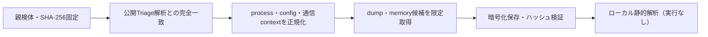

# Triage公開解析・後段取得証跡

## 完全ハッシュ一致

- [260923-w5b81shd88](https://tria.ge/260923-w5b81shd88): ファミリー候補 `stealc`、評価score `10`
- [260923-w49sws1t2p](https://tria.ge/260923-w49sws1t2p): ファミリー候補 `stealc`、評価score `10`
- [260922-g5zlzswsev](https://tria.ge/260922-g5zlzswsev): ファミリー候補 `stealc`、評価score `10`

## プロセス・通信

- 観測process: `jhgkuyyg.exe`
- raw commandは保存せず、command SHA-256と処理patternだけをJSONへ保持します。
- sandbox background trafficは`context_only`であり、C2へ自動昇格しません。

- `http://downloadfreemanager.com/`（sandbox config候補）

## 後段取得物

- 取得できませんでした。

## 判定境界

Triage由来のfamily、process、config、通信は外部sandbox証跡です。Config extractorが返したendpointはC2候補として扱いますが、静的設定復元またはprocess帰属とprotocol応答が揃うまでは確認済みC2とはしません。取得成果物と検体は実行していません。
