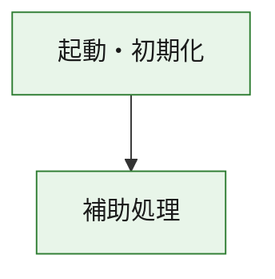
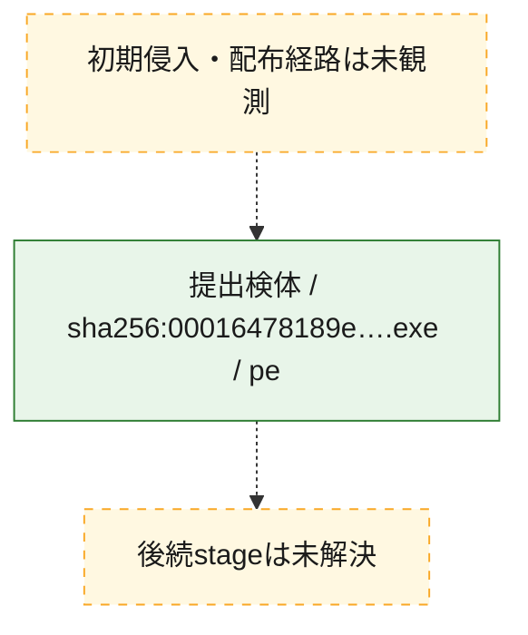
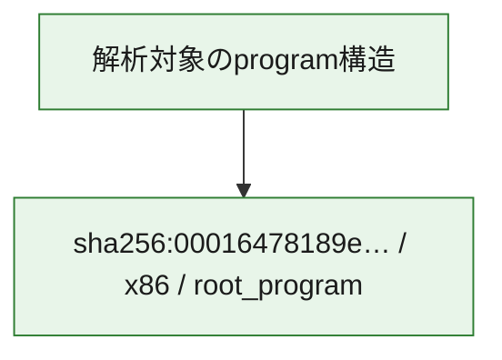

# 全体ロジック：00016478189eadd22a98d8839c685bff5958721101ad08dedfe53bdeb5f826b4

代表関数の静的証跡から、起動・初期化の処理群を確認しました。

## 読み方

- phaseの掲載順は解析上の整理順です。observed_call_edgesがない段階間の実行順を断定しません。
- 図の実線は静的に観測した関係、点線と黄色のノードは未観測・未解決の関係を示します。
- 図は静的な要約であり、動的実行を再現するものではありません。
- 詳細な関数解説とfingerprintは[STATIC-LOGIC.md](STATIC-LOGIC.md)を参照してください。

## 静的可視化

### 実行フロー

### 感染チェーン

### モジュール関係

## 処理段階

### 1. 起動・初期化

entry pointから初期化と後続処理への移行を確認します。
確度: `confirmed_static_function_evidence`

- `00016478189eadd22a98d8839c685bff5958721101ad08dedfe53bdeb5f826b4:ghidra:180001010` — 初期化と主要処理への分岐を行う入口関数です。 状態: `succeeded`、選定理由: `entry_point`, `meaningful_symbol_name`, `reviewed_call_centrality:22`, `role:entrypoint`, `small_program_complete_context`

### 2. 補助処理

主要処理を支える一般内部関数またはlibrary処理を確認します。
確度: `confirmed_static_function_evidence`

- `00016478189eadd22a98d8839c685bff5958721101ad08dedfe53bdeb5f826b4:ghidra:180001240` — 検体内部の一般処理を実装する関数です。 状態: `succeeded`、選定理由: `context_representative`, `reviewed_call_centrality:2`, `small_program_complete_context`
- `00016478189eadd22a98d8839c685bff5958721101ad08dedfe53bdeb5f826b4:ghidra:180001350` — 検体内部の一般処理を実装する関数です。 状態: `succeeded`、選定理由: `context_representative`, `reviewed_call_centrality:25`, `small_program_complete_context`
- `00016478189eadd22a98d8839c685bff5958721101ad08dedfe53bdeb5f826b4:ghidra:180003780` — 検体内部の一般処理を実装する関数です。 状態: `succeeded`、選定理由: `context_representative`, `reviewed_call_centrality:2`, `small_program_complete_context`
- `00016478189eadd22a98d8839c685bff5958721101ad08dedfe53bdeb5f826b4:ghidra:1800038e0` — 検体内部の一般処理を実装する関数です。 状態: `succeeded`、選定理由: `context_representative`, `reviewed_call_centrality:2`, `small_program_complete_context`

## 観測したcall関係

- `00016478189eadd22a98d8839c685bff5958721101ad08dedfe53bdeb5f826b4:ghidra:180001010` → `00016478189eadd22a98d8839c685bff5958721101ad08dedfe53bdeb5f826b4:ghidra:180001240` （`startup` → `support`）
- `00016478189eadd22a98d8839c685bff5958721101ad08dedfe53bdeb5f826b4:ghidra:180001010` → `00016478189eadd22a98d8839c685bff5958721101ad08dedfe53bdeb5f826b4:ghidra:180001350` （`startup` → `support`）
- `00016478189eadd22a98d8839c685bff5958721101ad08dedfe53bdeb5f826b4:ghidra:180001350` → `00016478189eadd22a98d8839c685bff5958721101ad08dedfe53bdeb5f826b4:ghidra:180001240` （`support` → `support`）
- `00016478189eadd22a98d8839c685bff5958721101ad08dedfe53bdeb5f826b4:ghidra:180001350` → `00016478189eadd22a98d8839c685bff5958721101ad08dedfe53bdeb5f826b4:ghidra:180003780` （`support` → `support`）
- `00016478189eadd22a98d8839c685bff5958721101ad08dedfe53bdeb5f826b4:ghidra:180001350` → `00016478189eadd22a98d8839c685bff5958721101ad08dedfe53bdeb5f826b4:ghidra:1800038e0` （`support` → `support`）
- `00016478189eadd22a98d8839c685bff5958721101ad08dedfe53bdeb5f826b4:ghidra:180003780` → `00016478189eadd22a98d8839c685bff5958721101ad08dedfe53bdeb5f826b4:ghidra:1800038e0` （`support` → `support`）
- `ghidra-function:594006a66e0cd133d17b54ef` → `ghidra-function:99b892b0b1ff4565e696fce7` （`unclassified` → `unclassified`）
- `ghidra-function:c9250319b8128d574642a3e7` → `ghidra-function:09afc02b3127cd822b1313a9` （`unclassified` → `unclassified`）
- `ghidra-function:c9250319b8128d574642a3e7` → `ghidra-function:1495461f25ecec4a62bd28d2` （`unclassified` → `unclassified`）
- `ghidra-function:c9250319b8128d574642a3e7` → `ghidra-function:3e5695071aca7642b789e941` （`unclassified` → `unclassified`）
- `ghidra-function:c9250319b8128d574642a3e7` → `ghidra-function:42ab0d538dd64a0e108a4e6c` （`unclassified` → `unclassified`）
- `ghidra-function:c9250319b8128d574642a3e7` → `ghidra-function:62ee1fa60c32fbda6aae4a3b` （`unclassified` → `unclassified`）
- `ghidra-function:c9250319b8128d574642a3e7` → `ghidra-function:6c55bc5b74954c8908321f67` （`unclassified` → `unclassified`）
- `ghidra-function:c9250319b8128d574642a3e7` → `ghidra-function:7a5738c46b6d1dd921994180` （`unclassified` → `unclassified`）
- `ghidra-function:c9250319b8128d574642a3e7` → `ghidra-function:a06c183a3c2ff8dc24f44997` （`unclassified` → `unclassified`）
- `ghidra-function:c9250319b8128d574642a3e7` → `ghidra-function:bcbc6258da6e699dd96431e3` （`unclassified` → `unclassified`）
- `ghidra-function:c9250319b8128d574642a3e7` → `ghidra-function:e849b9c4386739e1e0c6b6e5` （`unclassified` → `unclassified`）
- `ghidra-function:c9250319b8128d574642a3e7` → `ghidra-function:f2c615840106e9e68650d053` （`unclassified` → `unclassified`）
- `ghidra-function:c9250319b8128d574642a3e7` → `ghidra-function:faa490ccfdc1e8f8c6d50c15` （`unclassified` → `unclassified`）
- `ghidra-function:f2c615840106e9e68650d053` → `ghidra-external:10fdd1bb874caef944008629` （`unclassified` → `unclassified`）
- `ghidra-function:f2c615840106e9e68650d053` → `ghidra-external:274377f35fddf0259f7904ca` （`unclassified` → `unclassified`）
- `ghidra-function:f2c615840106e9e68650d053` → `ghidra-external:32347df4302898fce5483cc0` （`unclassified` → `unclassified`）
- `ghidra-function:f2c615840106e9e68650d053` → `ghidra-external:335061a6c07478d1d774f4da` （`unclassified` → `unclassified`）
- `ghidra-function:f2c615840106e9e68650d053` → `ghidra-external:412ea7f96718edb7f22e7f8f` （`unclassified` → `unclassified`）
- `ghidra-function:f2c615840106e9e68650d053` → `ghidra-external:465c8b4f86db4e7f4ecc0ea1` （`unclassified` → `unclassified`）
- `ghidra-function:f2c615840106e9e68650d053` → `ghidra-external:4b1312fc0b539ec70a32875a` （`unclassified` → `unclassified`）
- `ghidra-function:f2c615840106e9e68650d053` → `ghidra-external:525961de1118b330ed5f720c` （`unclassified` → `unclassified`）
- `ghidra-function:f2c615840106e9e68650d053` → `ghidra-external:5fbac2fe71ec1fb8e34085b9` （`unclassified` → `unclassified`）
- `ghidra-function:f2c615840106e9e68650d053` → `ghidra-external:6b95657083212aba516f70ef` （`unclassified` → `unclassified`）
- `ghidra-function:f2c615840106e9e68650d053` → `ghidra-external:74bdf6d5c21bbe92a903638a` （`unclassified` → `unclassified`）
- `ghidra-function:f2c615840106e9e68650d053` → `ghidra-external:793d0a44fb39cf8dae6c3f43` （`unclassified` → `unclassified`）
- `ghidra-function:f2c615840106e9e68650d053` → `ghidra-external:9253555e357d69ba6b3545ae` （`unclassified` → `unclassified`）
- `ghidra-function:f2c615840106e9e68650d053` → `ghidra-external:abe50873c57227752c478290` （`unclassified` → `unclassified`）
- `ghidra-function:f2c615840106e9e68650d053` → `ghidra-external:b1b20f1e435b4c6dcc415778` （`unclassified` → `unclassified`）
- `ghidra-function:f2c615840106e9e68650d053` → `ghidra-external:c93451f1b567f905dee55b6a` （`unclassified` → `unclassified`）
- `ghidra-function:f2c615840106e9e68650d053` → `ghidra-external:da7e3d04394e36b76a695ac7` （`unclassified` → `unclassified`）
- `ghidra-function:f2c615840106e9e68650d053` → `ghidra-external:df89905c3f910a5bb185285e` （`unclassified` → `unclassified`）
- `ghidra-function:f2c615840106e9e68650d053` → `ghidra-external:e91cdd771e07856f6506b884` （`unclassified` → `unclassified`）
- `ghidra-function:f2c615840106e9e68650d053` → `ghidra-external:eb25114924fa6ee3d55884cf` （`unclassified` → `unclassified`）
- `ghidra-function:f2c615840106e9e68650d053` → `ghidra-external:ed3d70c108008038f28c2b67` （`unclassified` → `unclassified`）
- `ghidra-function:f2c615840106e9e68650d053` → `ghidra-function:594006a66e0cd133d17b54ef` （`unclassified` → `unclassified`）
- `ghidra-function:f2c615840106e9e68650d053` → `ghidra-function:99b892b0b1ff4565e696fce7` （`unclassified` → `unclassified`）
- `ghidra-function:f2c615840106e9e68650d053` → `ghidra-function:e849b9c4386739e1e0c6b6e5` （`unclassified` → `unclassified`）

## 解析範囲と制約

- 選定外関数は全体inventoryへ残しますが、関数本体の個別解説対象にはしていません。
- indirect call、難読化、packer、VM、壊れたcontrol flowによりcall関係が欠落する場合があります。
- 文書は静的解析に基づき、検体実行や外部通信による動的確認は行っていません。
