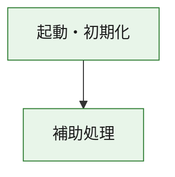
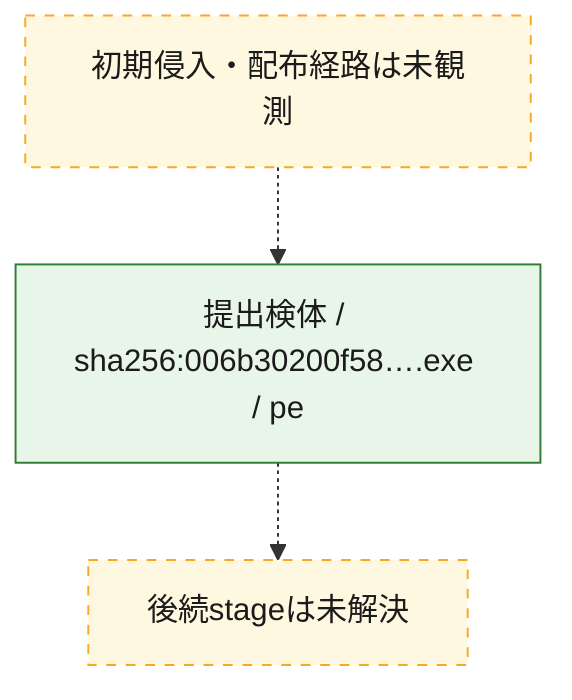
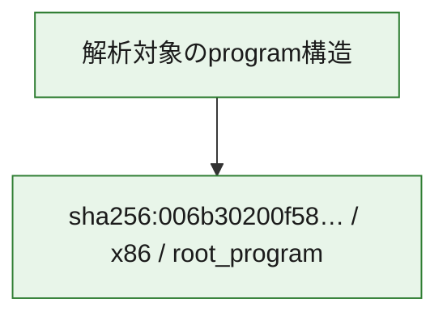

# 全体ロジック：006b30200f58480dd8544c3cdfce87421507844711349b18eb81ddf9e75b454b

代表関数の静的証跡から、起動・初期化の処理群を確認しました。

## 読み方

- phaseの掲載順は解析上の整理順です。observed_call_edgesがない段階間の実行順を断定しません。
- 図の実線は静的に観測した関係、点線と黄色のノードは未観測・未解決の関係を示します。
- 図は静的な要約であり、動的実行を再現するものではありません。
- 詳細な関数解説とfingerprintは[STATIC-LOGIC.md](STATIC-LOGIC.md)を参照してください。

## 静的可視化

### 実行フロー

### 感染チェーン

### モジュール関係

## 処理段階

### 1. 起動・初期化

entry pointから初期化と後続処理への移行を確認します。
確度: `confirmed_static_function_evidence`

- `006b30200f58480dd8544c3cdfce87421507844711349b18eb81ddf9e75b454b:ghidra:180001010` — 初期化と主要処理への分岐を行う入口関数です。 状態: `succeeded`、選定理由: `entry_point`, `meaningful_symbol_name`, `reviewed_call_centrality:22`, `role:entrypoint`, `small_program_complete_context`

### 2. 補助処理

主要処理を支える一般内部関数またはlibrary処理を確認します。
確度: `confirmed_static_function_evidence`

- `006b30200f58480dd8544c3cdfce87421507844711349b18eb81ddf9e75b454b:ghidra:180001240` — 検体内部の一般処理を実装する関数です。 状態: `succeeded`、選定理由: `context_representative`, `reviewed_call_centrality:2`, `small_program_complete_context`
- `006b30200f58480dd8544c3cdfce87421507844711349b18eb81ddf9e75b454b:ghidra:180001350` — 検体内部の一般処理を実装する関数です。 状態: `succeeded`、選定理由: `context_representative`, `reviewed_call_centrality:25`, `small_program_complete_context`
- `006b30200f58480dd8544c3cdfce87421507844711349b18eb81ddf9e75b454b:ghidra:180003780` — 検体内部の一般処理を実装する関数です。 状態: `succeeded`、選定理由: `context_representative`, `reviewed_call_centrality:2`, `small_program_complete_context`
- `006b30200f58480dd8544c3cdfce87421507844711349b18eb81ddf9e75b454b:ghidra:1800038e0` — 検体内部の一般処理を実装する関数です。 状態: `succeeded`、選定理由: `context_representative`, `reviewed_call_centrality:2`, `small_program_complete_context`

## 観測したcall関係

- `006b30200f58480dd8544c3cdfce87421507844711349b18eb81ddf9e75b454b:ghidra:180001010` → `006b30200f58480dd8544c3cdfce87421507844711349b18eb81ddf9e75b454b:ghidra:180001240` （`startup` → `support`）
- `006b30200f58480dd8544c3cdfce87421507844711349b18eb81ddf9e75b454b:ghidra:180001010` → `006b30200f58480dd8544c3cdfce87421507844711349b18eb81ddf9e75b454b:ghidra:180001350` （`startup` → `support`）
- `006b30200f58480dd8544c3cdfce87421507844711349b18eb81ddf9e75b454b:ghidra:180001350` → `006b30200f58480dd8544c3cdfce87421507844711349b18eb81ddf9e75b454b:ghidra:180001240` （`support` → `support`）
- `006b30200f58480dd8544c3cdfce87421507844711349b18eb81ddf9e75b454b:ghidra:180001350` → `006b30200f58480dd8544c3cdfce87421507844711349b18eb81ddf9e75b454b:ghidra:180003780` （`support` → `support`）
- `006b30200f58480dd8544c3cdfce87421507844711349b18eb81ddf9e75b454b:ghidra:180001350` → `006b30200f58480dd8544c3cdfce87421507844711349b18eb81ddf9e75b454b:ghidra:1800038e0` （`support` → `support`）
- `006b30200f58480dd8544c3cdfce87421507844711349b18eb81ddf9e75b454b:ghidra:180003780` → `006b30200f58480dd8544c3cdfce87421507844711349b18eb81ddf9e75b454b:ghidra:1800038e0` （`support` → `support`）
- `ghidra-function:0255678ebfd03c18b8ecc404` → `ghidra-function:01e048fc00d7cabaf52ab95b` （`unclassified` → `unclassified`）
- `ghidra-function:0255678ebfd03c18b8ecc404` → `ghidra-function:2595125bdad9706537ebd759` （`unclassified` → `unclassified`）
- `ghidra-function:0255678ebfd03c18b8ecc404` → `ghidra-function:4523381b0ca6db88c907b77d` （`unclassified` → `unclassified`）
- `ghidra-function:0255678ebfd03c18b8ecc404` → `ghidra-function:45c5124fa67ef9443855f86e` （`unclassified` → `unclassified`）
- `ghidra-function:0255678ebfd03c18b8ecc404` → `ghidra-function:6c891f313400a6e3bc0a9fdc` （`unclassified` → `unclassified`）
- `ghidra-function:0255678ebfd03c18b8ecc404` → `ghidra-function:7f55ef2ba5f1921311a196b8` （`unclassified` → `unclassified`）
- `ghidra-function:0255678ebfd03c18b8ecc404` → `ghidra-function:84da04763bde34c9e75e99f7` （`unclassified` → `unclassified`）
- `ghidra-function:0255678ebfd03c18b8ecc404` → `ghidra-function:9963627203014b92a527eb4a` （`unclassified` → `unclassified`）
- `ghidra-function:0255678ebfd03c18b8ecc404` → `ghidra-function:9ccec3dff94292b4c9a1c30c` （`unclassified` → `unclassified`）
- `ghidra-function:0255678ebfd03c18b8ecc404` → `ghidra-function:9f3e4ea6b1d2e9de32343069` （`unclassified` → `unclassified`）
- `ghidra-function:0255678ebfd03c18b8ecc404` → `ghidra-function:d9242f3eef79fe25e4899578` （`unclassified` → `unclassified`）
- `ghidra-function:0255678ebfd03c18b8ecc404` → `ghidra-function:f1cc5dbb4c78b9ba2d588f89` （`unclassified` → `unclassified`）
- `ghidra-function:34b77a10c1ba64339a2330c9` → `ghidra-function:cdefd30c1441404f96e1e57e` （`unclassified` → `unclassified`）
- `ghidra-function:9963627203014b92a527eb4a` → `ghidra-external:0a28e3e93a3f1f04043fa392` （`unclassified` → `unclassified`）
- `ghidra-function:9963627203014b92a527eb4a` → `ghidra-external:1286f9f45e07ec6c409d950e` （`unclassified` → `unclassified`）
- `ghidra-function:9963627203014b92a527eb4a` → `ghidra-external:164076a2fe8015a797d3136c` （`unclassified` → `unclassified`）
- `ghidra-function:9963627203014b92a527eb4a` → `ghidra-external:1d5298004de5c48492c7b29b` （`unclassified` → `unclassified`）
- `ghidra-function:9963627203014b92a527eb4a` → `ghidra-external:1debcb1d7fea7cc29d6f9121` （`unclassified` → `unclassified`）
- `ghidra-function:9963627203014b92a527eb4a` → `ghidra-external:2798204f7be1093df2f553be` （`unclassified` → `unclassified`）
- `ghidra-function:9963627203014b92a527eb4a` → `ghidra-external:3f81592f9b7b7c1f6af4c496` （`unclassified` → `unclassified`）
- `ghidra-function:9963627203014b92a527eb4a` → `ghidra-external:413edcdddfe06ee0e3c12df8` （`unclassified` → `unclassified`）
- `ghidra-function:9963627203014b92a527eb4a` → `ghidra-external:5aba142c4d93a85ac1a8905b` （`unclassified` → `unclassified`）
- `ghidra-function:9963627203014b92a527eb4a` → `ghidra-external:6f0e070129a00de8fba7688e` （`unclassified` → `unclassified`）
- `ghidra-function:9963627203014b92a527eb4a` → `ghidra-external:96cb15c0ecd3589d05d29e61` （`unclassified` → `unclassified`）
- `ghidra-function:9963627203014b92a527eb4a` → `ghidra-external:97550c4002d5d05d98f5eb90` （`unclassified` → `unclassified`）
- `ghidra-function:9963627203014b92a527eb4a` → `ghidra-external:a92ec7c0b3c59ea4dbd0450a` （`unclassified` → `unclassified`）
- `ghidra-function:9963627203014b92a527eb4a` → `ghidra-external:ac3f9eb3b8d5e0545dd82a5d` （`unclassified` → `unclassified`）
- `ghidra-function:9963627203014b92a527eb4a` → `ghidra-external:b1848203f5200fb6217928dd` （`unclassified` → `unclassified`）
- `ghidra-function:9963627203014b92a527eb4a` → `ghidra-external:b782d80e74b0c6deb3a50e05` （`unclassified` → `unclassified`）
- `ghidra-function:9963627203014b92a527eb4a` → `ghidra-external:be0b43f6b64ca2a053378262` （`unclassified` → `unclassified`）
- `ghidra-function:9963627203014b92a527eb4a` → `ghidra-external:ca47ddec791bcc38742a538e` （`unclassified` → `unclassified`）
- `ghidra-function:9963627203014b92a527eb4a` → `ghidra-external:cd504a0b465a228afc638f10` （`unclassified` → `unclassified`）
- `ghidra-function:9963627203014b92a527eb4a` → `ghidra-external:da2e217de07c7d2493f07dfb` （`unclassified` → `unclassified`）
- `ghidra-function:9963627203014b92a527eb4a` → `ghidra-external:f5f9f5124256140477d4968d` （`unclassified` → `unclassified`）
- `ghidra-function:9963627203014b92a527eb4a` → `ghidra-function:34b77a10c1ba64339a2330c9` （`unclassified` → `unclassified`）
- `ghidra-function:9963627203014b92a527eb4a` → `ghidra-function:cdefd30c1441404f96e1e57e` （`unclassified` → `unclassified`）
- `ghidra-function:9963627203014b92a527eb4a` → `ghidra-function:f1cc5dbb4c78b9ba2d588f89` （`unclassified` → `unclassified`）

## 解析範囲と制約

- 選定外関数は全体inventoryへ残しますが、関数本体の個別解説対象にはしていません。
- indirect call、難読化、packer、VM、壊れたcontrol flowによりcall関係が欠落する場合があります。
- 文書は静的解析に基づき、検体実行や外部通信による動的確認は行っていません。
