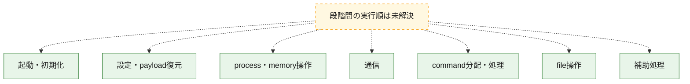
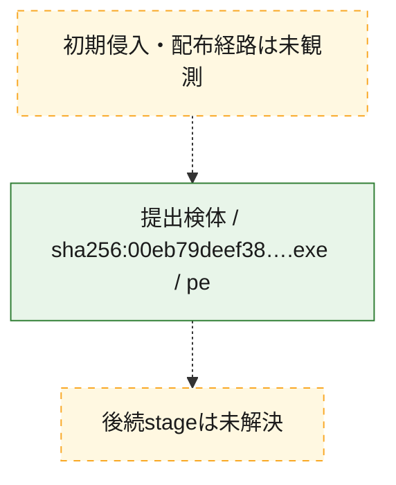
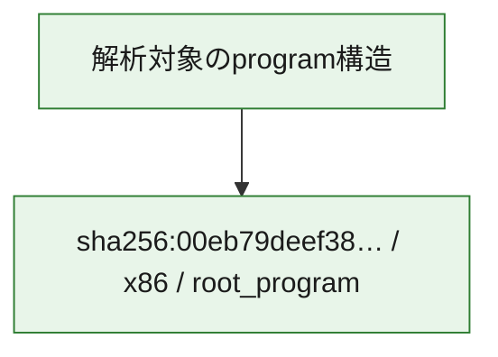

# 全体ロジック：00eb79deef3898e0883b69e62a81751933eb1363d655eb04b2f0ab743570067b

代表関数の静的証跡から、起動・初期化、設定・payload復元、process・memory操作、通信、command分配・処理、file操作の処理群を確認しました。

## 読み方

- phaseの掲載順は解析上の整理順です。observed_call_edgesがない段階間の実行順を断定しません。
- 図の実線は静的に観測した関係、点線と黄色のノードは未観測・未解決の関係を示します。
- 図は静的な要約であり、動的実行を再現するものではありません。
- 詳細な関数解説とfingerprintは[STATIC-LOGIC.md](STATIC-LOGIC.md)を参照してください。

## 静的可視化

### 実行フロー

### 感染チェーン

### モジュール関係

## 処理段階

### 1. 起動・初期化

entry pointから初期化と後続処理への移行を確認します。
確度: `confirmed_static_function_evidence`

- `00eb79deef3898e0883b69e62a81751933eb1363d655eb04b2f0ab743570067b:ghidra:00489920` — 初期化と主要処理への分岐を行う入口関数です。 状態: `succeeded`、選定理由: `entry_point`, `meaningful_symbol_name`, `probable_go_main_user_code`, `reviewed_call_centrality:21`, `role:entrypoint`
- `00eb79deef3898e0883b69e62a81751933eb1363d655eb04b2f0ab743570067b:ghidra:0048dae0` — 初期化と主要処理への分岐を行う入口関数です。 状態: `succeeded`、選定理由: `entry_point`, `meaningful_symbol_name`, `probable_go_main_user_code`, `reviewed_call_centrality:19`, `role:entrypoint`
- `00eb79deef3898e0883b69e62a81751933eb1363d655eb04b2f0ab743570067b:ghidra:00493280` — 初期化と主要処理への分岐を行う入口関数です。 状態: `succeeded`、選定理由: `entry_point`, `meaningful_symbol_name`, `probable_go_main_user_code`, `reviewed_call_centrality:18`, `role:entrypoint`
- `00eb79deef3898e0883b69e62a81751933eb1363d655eb04b2f0ab743570067b:ghidra:00493d60` — 初期化と主要処理への分岐を行う入口関数です。 状態: `succeeded`、選定理由: `entry_point`, `meaningful_symbol_name`, `probable_go_main_user_code`, `reviewed_call_centrality:19`, `role:entrypoint`
- `00eb79deef3898e0883b69e62a81751933eb1363d655eb04b2f0ab743570067b:ghidra:00495ea0` — 初期化と主要処理への分岐を行う入口関数です。 状態: `succeeded`、選定理由: `entry_point`, `meaningful_symbol_name`, `probable_go_main_user_code`, `reviewed_call_centrality:21`, `role:entrypoint`
- `00eb79deef3898e0883b69e62a81751933eb1363d655eb04b2f0ab743570067b:ghidra:0049cbc0` — 初期化と主要処理への分岐を行う入口関数です。 状態: `succeeded`、選定理由: `entry_point`, `meaningful_symbol_name`, `probable_go_main_user_code`, `reviewed_call_centrality:19`, `role:entrypoint`
- `00eb79deef3898e0883b69e62a81751933eb1363d655eb04b2f0ab743570067b:ghidra:0049f880` — 初期化と主要処理への分岐を行う入口関数です。 状態: `succeeded`、選定理由: `entry_point`, `meaningful_symbol_name`, `probable_go_main_user_code`, `reviewed_call_centrality:22`, `role:entrypoint`
- `00eb79deef3898e0883b69e62a81751933eb1363d655eb04b2f0ab743570067b:ghidra:004a3ac0` — 初期化と主要処理への分岐を行う入口関数です。 状態: `succeeded`、選定理由: `entry_point`, `meaningful_symbol_name`, `probable_go_main_user_code`, `reviewed_call_centrality:21`, `role:entrypoint`
- `00eb79deef3898e0883b69e62a81751933eb1363d655eb04b2f0ab743570067b:ghidra:004acb00` — 初期化と主要処理への分岐を行う入口関数です。 状態: `succeeded`、選定理由: `entry_point`, `meaningful_symbol_name`, `probable_go_main_user_code`, `reviewed_call_centrality:18`, `role:entrypoint`
- `00eb79deef3898e0883b69e62a81751933eb1363d655eb04b2f0ab743570067b:ghidra:004b2c80` — 初期化と主要処理への分岐を行う入口関数です。 状態: `succeeded`、選定理由: `entry_point`, `meaningful_symbol_name`, `probable_go_main_user_code`, `reviewed_call_centrality:21`, `role:entrypoint`
- `00eb79deef3898e0883b69e62a81751933eb1363d655eb04b2f0ab743570067b:ghidra:004b91a0` — 初期化と主要処理への分岐を行う入口関数です。 状態: `succeeded`、選定理由: `entry_point`, `meaningful_symbol_name`, `probable_go_main_user_code`, `reviewed_call_centrality:21`, `role:entrypoint`
- `00eb79deef3898e0883b69e62a81751933eb1363d655eb04b2f0ab743570067b:ghidra:004be060` — 初期化と主要処理への分岐を行う入口関数です。 状態: `succeeded`、選定理由: `entry_point`, `meaningful_symbol_name`, `probable_go_main_user_code`, `reviewed_call_centrality:24`, `role:entrypoint`
- `00eb79deef3898e0883b69e62a81751933eb1363d655eb04b2f0ab743570067b:ghidra:004c88a0` — 初期化と主要処理への分岐を行う入口関数です。 状態: `succeeded`、選定理由: `entry_point`, `meaningful_symbol_name`, `probable_go_main_user_code`, `reviewed_call_centrality:19`, `role:entrypoint`
- `00eb79deef3898e0883b69e62a81751933eb1363d655eb04b2f0ab743570067b:ghidra:004c9e80` — 初期化と主要処理への分岐を行う入口関数です。 状態: `succeeded`、選定理由: `entry_point`, `meaningful_symbol_name`, `probable_go_main_user_code`, `reviewed_call_centrality:21`, `role:entrypoint`
- `00eb79deef3898e0883b69e62a81751933eb1363d655eb04b2f0ab743570067b:ghidra:004ccb20` — 初期化と主要処理への分岐を行う入口関数です。 状態: `succeeded`、選定理由: `entry_point`, `meaningful_symbol_name`, `probable_go_main_user_code`, `reviewed_call_centrality:23`, `role:entrypoint`
- `00eb79deef3898e0883b69e62a81751933eb1363d655eb04b2f0ab743570067b:ghidra:004d3800` — 初期化と主要処理への分岐を行う入口関数です。 状態: `succeeded`、選定理由: `entry_point`, `meaningful_symbol_name`, `probable_go_main_user_code`, `reviewed_call_centrality:19`, `role:entrypoint`
- `00eb79deef3898e0883b69e62a81751933eb1363d655eb04b2f0ab743570067b:ghidra:004d4dc0` — 初期化と主要処理への分岐を行う入口関数です。 状態: `succeeded`、選定理由: `entry_point`, `meaningful_symbol_name`, `probable_go_main_user_code`, `reviewed_call_centrality:22`, `role:entrypoint`
- `00eb79deef3898e0883b69e62a81751933eb1363d655eb04b2f0ab743570067b:ghidra:004d8f20` — 初期化と主要処理への分岐を行う入口関数です。 状態: `succeeded`、選定理由: `entry_point`, `meaningful_symbol_name`, `probable_go_main_user_code`, `reviewed_call_centrality:21`, `role:entrypoint`
- `00eb79deef3898e0883b69e62a81751933eb1363d655eb04b2f0ab743570067b:ghidra:004dd040` — 初期化と主要処理への分岐を行う入口関数です。 状態: `succeeded`、選定理由: `entry_point`, `meaningful_symbol_name`, `probable_go_main_user_code`, `reviewed_call_centrality:25`, `role:entrypoint`
- `00eb79deef3898e0883b69e62a81751933eb1363d655eb04b2f0ab743570067b:ghidra:004e52a0` — 初期化と主要処理への分岐を行う入口関数です。 状態: `succeeded`、選定理由: `entry_point`, `meaningful_symbol_name`, `probable_go_main_user_code`, `reviewed_call_centrality:20`, `role:entrypoint`
- `00eb79deef3898e0883b69e62a81751933eb1363d655eb04b2f0ab743570067b:ghidra:004e93c0` — 初期化と主要処理への分岐を行う入口関数です。 状態: `succeeded`、選定理由: `entry_point`, `meaningful_symbol_name`, `probable_go_main_user_code`, `reviewed_call_centrality:22`, `role:entrypoint`
- `00eb79deef3898e0883b69e62a81751933eb1363d655eb04b2f0ab743570067b:ghidra:004f38e0` — 初期化と主要処理への分岐を行う入口関数です。 状態: `succeeded`、選定理由: `entry_point`, `meaningful_symbol_name`, `probable_go_main_user_code`, `reviewed_call_centrality:20`, `role:entrypoint`
- `00eb79deef3898e0883b69e62a81751933eb1363d655eb04b2f0ab743570067b:ghidra:004fc760` — 初期化と主要処理への分岐を行う入口関数です。 状態: `succeeded`、選定理由: `entry_point`, `meaningful_symbol_name`, `probable_go_main_user_code`, `reviewed_call_centrality:18`, `role:entrypoint`
- `00eb79deef3898e0883b69e62a81751933eb1363d655eb04b2f0ab743570067b:ghidra:005055c0` — 初期化と主要処理への分岐を行う入口関数です。 状態: `succeeded`、選定理由: `entry_point`, `meaningful_symbol_name`, `probable_go_main_user_code`, `reviewed_call_centrality:22`, `role:entrypoint`
- `00eb79deef3898e0883b69e62a81751933eb1363d655eb04b2f0ab743570067b:ghidra:0050b980` — 初期化と主要処理への分岐を行う入口関数です。 状態: `succeeded`、選定理由: `entry_point`, `meaningful_symbol_name`, `probable_go_main_user_code`, `reviewed_call_centrality:18`, `role:entrypoint`

### 2. 設定・payload復元

設定、resource、payload、暗号化データの復元・変換を確認します。
確度: `confirmed_static_function_evidence`

- `00eb79deef3898e0883b69e62a81751933eb1363d655eb04b2f0ab743570067b:ghidra:00464c80` — 設定、resource、payloadなどの解析・変換を行う関数です。 状態: `succeeded`、選定理由: `meaningful_symbol_name`, `reviewed_call_centrality:4`, `role:config_or_data_transform`

### 3. process・memory操作

process、thread、module、memory操作と実行移行を確認します。
確度: `confirmed_static_function_evidence`

- `00eb79deef3898e0883b69e62a81751933eb1363d655eb04b2f0ab743570067b:ghidra:00462e00` — process、thread、module、またはmemory操作に関係する関数です。 状態: `succeeded`、選定理由: `meaningful_symbol_name`, `reviewed_call_centrality:2`, `role:process_or_memory_operation`

### 4. 通信

通信初期化、endpoint処理、送受信の役割を確認します。
確度: `confirmed_static_function_evidence`

- `00eb79deef3898e0883b69e62a81751933eb1363d655eb04b2f0ab743570067b:ghidra:00477cc0` — 通信初期化、送受信、またはendpoint処理に関係する関数です。 状態: `succeeded`、選定理由: `meaningful_symbol_name`, `reviewed_call_centrality:6`, `role:network_communication`

### 5. command分配・処理

受信commandやtaskの解釈、分配、個別handlerへの移行を確認します。
確度: `confirmed_static_function_evidence`

- `00eb79deef3898e0883b69e62a81751933eb1363d655eb04b2f0ab743570067b:ghidra:00476e40` — commandの解釈、分配、または個別処理を担当する関数です。 状態: `succeeded`、選定理由: `meaningful_symbol_name`, `reviewed_call_centrality:5`, `role:command_dispatch_or_handler`

### 6. file操作

fileやdirectoryの作成、読書き、削除を確認します。
確度: `confirmed_static_function_evidence`

- `00eb79deef3898e0883b69e62a81751933eb1363d655eb04b2f0ab743570067b:ghidra:004776a0` — fileまたはdirectoryの読書き・管理に関係する関数です。 状態: `succeeded`、選定理由: `meaningful_symbol_name`, `reviewed_call_centrality:6`, `role:file_operation`

### 7. 補助処理

主要処理を支える一般内部関数またはlibrary処理を確認します。
確度: `confirmed_static_function_evidence`

- `00eb79deef3898e0883b69e62a81751933eb1363d655eb04b2f0ab743570067b:ghidra:00401080` — compiler生成処理または汎用library処理とみられる関数です。 状態: `succeeded`、選定理由: `meaningful_symbol_name`, `reviewed_call_centrality:4`
- `00eb79deef3898e0883b69e62a81751933eb1363d655eb04b2f0ab743570067b:ghidra:00458fc0` — 検体内部の一般処理を実装する関数です。 状態: `succeeded`、選定理由: `meaningful_symbol_name`, `reviewed_call_centrality:4`

## 観測したcall関係

- `ghidra-function:0ae44b6aa4872ab4b6112f12` → `ghidra-external:086d96b24499213ee949f625` （`unclassified` → `unclassified`）
- `ghidra-function:0ae44b6aa4872ab4b6112f12` → `ghidra-external:0f17bb469f0ae20e1d1b3ddf` （`unclassified` → `unclassified`）
- `ghidra-function:0ae44b6aa4872ab4b6112f12` → `ghidra-external:1570ab3ae755fe985c3e279c` （`unclassified` → `unclassified`）
- `ghidra-function:0ae44b6aa4872ab4b6112f12` → `ghidra-external:1b1d2b59ba709bf2b0fd0d93` （`unclassified` → `unclassified`）
- `ghidra-function:0ae44b6aa4872ab4b6112f12` → `ghidra-external:29c6495ed6f3dea5328b22a1` （`unclassified` → `unclassified`）
- `ghidra-function:0ae44b6aa4872ab4b6112f12` → `ghidra-external:395a62cc625b0b3f6559bb29` （`unclassified` → `unclassified`）
- `ghidra-function:0ae44b6aa4872ab4b6112f12` → `ghidra-external:488a45cef44f3ba0d70b75f9` （`unclassified` → `unclassified`）
- `ghidra-function:0ae44b6aa4872ab4b6112f12` → `ghidra-external:4d79ed06bd9fca873e6efce9` （`unclassified` → `unclassified`）
- `ghidra-function:0ae44b6aa4872ab4b6112f12` → `ghidra-external:616fad236aab0aaaec811e4a` （`unclassified` → `unclassified`）
- `ghidra-function:0ae44b6aa4872ab4b6112f12` → `ghidra-external:7ecb3d33cffc5eb637b47188` （`unclassified` → `unclassified`）
- `ghidra-function:0ae44b6aa4872ab4b6112f12` → `ghidra-external:9ebefd70781215330188c59f` （`unclassified` → `unclassified`）
- `ghidra-function:0ae44b6aa4872ab4b6112f12` → `ghidra-external:aa6f72e58ce8bb929377ef85` （`unclassified` → `unclassified`）
- `ghidra-function:0ae44b6aa4872ab4b6112f12` → `ghidra-external:d19990ac9dbaa6426328bcd4` （`unclassified` → `unclassified`）
- `ghidra-function:0ae44b6aa4872ab4b6112f12` → `ghidra-external:d353053b072e668c0146660c` （`unclassified` → `unclassified`）
- `ghidra-function:0ae44b6aa4872ab4b6112f12` → `ghidra-external:d4a07bc40eaedf088eb5139f` （`unclassified` → `unclassified`）
- `ghidra-function:0ae44b6aa4872ab4b6112f12` → `ghidra-external:edb29998787ce5ece8ce5ff4` （`unclassified` → `unclassified`）
- `ghidra-function:0ae44b6aa4872ab4b6112f12` → `ghidra-external:f709b782230782d614f65620` （`unclassified` → `unclassified`）
- `ghidra-function:0ae44b6aa4872ab4b6112f12` → `ghidra-external:fea4c63ca15a10b33ff40626` （`unclassified` → `unclassified`）
- `ghidra-function:0ccb9890ee60954d6fbe88ed` → `ghidra-external:086d96b24499213ee949f625` （`unclassified` → `unclassified`）
- `ghidra-function:0ccb9890ee60954d6fbe88ed` → `ghidra-external:0f17bb469f0ae20e1d1b3ddf` （`unclassified` → `unclassified`）
- `ghidra-function:0ccb9890ee60954d6fbe88ed` → `ghidra-external:1570ab3ae755fe985c3e279c` （`unclassified` → `unclassified`）
- `ghidra-function:0ccb9890ee60954d6fbe88ed` → `ghidra-external:1b1d2b59ba709bf2b0fd0d93` （`unclassified` → `unclassified`）
- `ghidra-function:0ccb9890ee60954d6fbe88ed` → `ghidra-external:1f78756fe5136c08bd0c70b0` （`unclassified` → `unclassified`）
- `ghidra-function:0ccb9890ee60954d6fbe88ed` → `ghidra-external:395a62cc625b0b3f6559bb29` （`unclassified` → `unclassified`）
- `ghidra-function:0ccb9890ee60954d6fbe88ed` → `ghidra-external:488a45cef44f3ba0d70b75f9` （`unclassified` → `unclassified`）
- `ghidra-function:0ccb9890ee60954d6fbe88ed` → `ghidra-external:4d79ed06bd9fca873e6efce9` （`unclassified` → `unclassified`）
- `ghidra-function:0ccb9890ee60954d6fbe88ed` → `ghidra-external:616fad236aab0aaaec811e4a` （`unclassified` → `unclassified`）
- `ghidra-function:0ccb9890ee60954d6fbe88ed` → `ghidra-external:7ecb3d33cffc5eb637b47188` （`unclassified` → `unclassified`）
- `ghidra-function:0ccb9890ee60954d6fbe88ed` → `ghidra-external:92814ff48aa9044aea0cb8a0` （`unclassified` → `unclassified`）
- `ghidra-function:0ccb9890ee60954d6fbe88ed` → `ghidra-external:9ebefd70781215330188c59f` （`unclassified` → `unclassified`）
- `ghidra-function:0ccb9890ee60954d6fbe88ed` → `ghidra-external:aa6f72e58ce8bb929377ef85` （`unclassified` → `unclassified`）
- `ghidra-function:0ccb9890ee60954d6fbe88ed` → `ghidra-external:b7fb408f19f09839d2c0f188` （`unclassified` → `unclassified`）
- `ghidra-function:0ccb9890ee60954d6fbe88ed` → `ghidra-external:d19990ac9dbaa6426328bcd4` （`unclassified` → `unclassified`）
- `ghidra-function:0ccb9890ee60954d6fbe88ed` → `ghidra-external:d353053b072e668c0146660c` （`unclassified` → `unclassified`）
- `ghidra-function:0ccb9890ee60954d6fbe88ed` → `ghidra-external:d4a07bc40eaedf088eb5139f` （`unclassified` → `unclassified`）
- `ghidra-function:0ccb9890ee60954d6fbe88ed` → `ghidra-external:edb29998787ce5ece8ce5ff4` （`unclassified` → `unclassified`）
- `ghidra-function:0ccb9890ee60954d6fbe88ed` → `ghidra-external:f709b782230782d614f65620` （`unclassified` → `unclassified`）
- `ghidra-function:0ccb9890ee60954d6fbe88ed` → `ghidra-external:fea4c63ca15a10b33ff40626` （`unclassified` → `unclassified`）
- `ghidra-function:0d999ce3313f0434e3b2679a` → `ghidra-external:611291ac5b2e43db82c5282e` （`unclassified` → `unclassified`）
- `ghidra-function:0d999ce3313f0434e3b2679a` → `ghidra-external:735cd7eaf14db742dc862394` （`unclassified` → `unclassified`）
- `ghidra-function:0d999ce3313f0434e3b2679a` → `ghidra-external:d7aee17f47552c3122c4f89c` （`unclassified` → `unclassified`）
- `ghidra-function:0d999ce3313f0434e3b2679a` → `ghidra-external:f19406794660098fbbae70fc` （`unclassified` → `unclassified`）
- `ghidra-function:0d999ce3313f0434e3b2679a` → `ghidra-external:f709b782230782d614f65620` （`unclassified` → `unclassified`）
- `ghidra-function:0d999ce3313f0434e3b2679a` → `ghidra-external:f8369836cfab1816fb1fa4a1` （`unclassified` → `unclassified`）
- `ghidra-function:113fd1de86a59110131ada1d` → `ghidra-external:8414a9145cbfefe455ef39b9` （`unclassified` → `unclassified`）
- `ghidra-function:113fd1de86a59110131ada1d` → `ghidra-external:aa6f72e58ce8bb929377ef85` （`unclassified` → `unclassified`）
- `ghidra-function:113fd1de86a59110131ada1d` → `ghidra-external:de4f59f0be142fb324978603` （`unclassified` → `unclassified`）
- `ghidra-function:113fd1de86a59110131ada1d` → `ghidra-external:e78cad502f7954a48039b1f8` （`unclassified` → `unclassified`）
- `ghidra-function:21664ed5a0fded3f110e860c` → `ghidra-external:086d96b24499213ee949f625` （`unclassified` → `unclassified`）
- `ghidra-function:21664ed5a0fded3f110e860c` → `ghidra-external:0f17bb469f0ae20e1d1b3ddf` （`unclassified` → `unclassified`）
- `ghidra-function:21664ed5a0fded3f110e860c` → `ghidra-external:14a723822e7460575c8b4ea8` （`unclassified` → `unclassified`）
- `ghidra-function:21664ed5a0fded3f110e860c` → `ghidra-external:1570ab3ae755fe985c3e279c` （`unclassified` → `unclassified`）
- `ghidra-function:21664ed5a0fded3f110e860c` → `ghidra-external:1b1d2b59ba709bf2b0fd0d93` （`unclassified` → `unclassified`）
- `ghidra-function:21664ed5a0fded3f110e860c` → `ghidra-external:395a62cc625b0b3f6559bb29` （`unclassified` → `unclassified`）
- `ghidra-function:21664ed5a0fded3f110e860c` → `ghidra-external:488a45cef44f3ba0d70b75f9` （`unclassified` → `unclassified`）
- `ghidra-function:21664ed5a0fded3f110e860c` → `ghidra-external:4d79ed06bd9fca873e6efce9` （`unclassified` → `unclassified`）
- `ghidra-function:21664ed5a0fded3f110e860c` → `ghidra-external:616fad236aab0aaaec811e4a` （`unclassified` → `unclassified`）
- `ghidra-function:21664ed5a0fded3f110e860c` → `ghidra-external:7ecb3d33cffc5eb637b47188` （`unclassified` → `unclassified`）
- `ghidra-function:21664ed5a0fded3f110e860c` → `ghidra-external:9ebefd70781215330188c59f` （`unclassified` → `unclassified`）
- `ghidra-function:21664ed5a0fded3f110e860c` → `ghidra-external:aa6f72e58ce8bb929377ef85` （`unclassified` → `unclassified`）
- `ghidra-function:21664ed5a0fded3f110e860c` → `ghidra-external:d19990ac9dbaa6426328bcd4` （`unclassified` → `unclassified`）
- `ghidra-function:21664ed5a0fded3f110e860c` → `ghidra-external:d353053b072e668c0146660c` （`unclassified` → `unclassified`）
- `ghidra-function:21664ed5a0fded3f110e860c` → `ghidra-external:d4a07bc40eaedf088eb5139f` （`unclassified` → `unclassified`）
- `ghidra-function:21664ed5a0fded3f110e860c` → `ghidra-external:edb29998787ce5ece8ce5ff4` （`unclassified` → `unclassified`）
- `ghidra-function:21664ed5a0fded3f110e860c` → `ghidra-external:f709b782230782d614f65620` （`unclassified` → `unclassified`）
- `ghidra-function:21664ed5a0fded3f110e860c` → `ghidra-external:fea4c63ca15a10b33ff40626` （`unclassified` → `unclassified`）
- `ghidra-function:23e72fc350aba72f74dd29ad` → `ghidra-external:086d96b24499213ee949f625` （`unclassified` → `unclassified`）
- `ghidra-function:23e72fc350aba72f74dd29ad` → `ghidra-external:0f17bb469f0ae20e1d1b3ddf` （`unclassified` → `unclassified`）
- `ghidra-function:23e72fc350aba72f74dd29ad` → `ghidra-external:1570ab3ae755fe985c3e279c` （`unclassified` → `unclassified`）
- `ghidra-function:23e72fc350aba72f74dd29ad` → `ghidra-external:1b1d2b59ba709bf2b0fd0d93` （`unclassified` → `unclassified`）
- `ghidra-function:23e72fc350aba72f74dd29ad` → `ghidra-external:395a62cc625b0b3f6559bb29` （`unclassified` → `unclassified`）
- `ghidra-function:23e72fc350aba72f74dd29ad` → `ghidra-external:488a45cef44f3ba0d70b75f9` （`unclassified` → `unclassified`）
- `ghidra-function:23e72fc350aba72f74dd29ad` → `ghidra-external:4d79ed06bd9fca873e6efce9` （`unclassified` → `unclassified`）
- `ghidra-function:23e72fc350aba72f74dd29ad` → `ghidra-external:616fad236aab0aaaec811e4a` （`unclassified` → `unclassified`）
- `ghidra-function:23e72fc350aba72f74dd29ad` → `ghidra-external:7ecb3d33cffc5eb637b47188` （`unclassified` → `unclassified`）
- `ghidra-function:23e72fc350aba72f74dd29ad` → `ghidra-external:9ebefd70781215330188c59f` （`unclassified` → `unclassified`）
- `ghidra-function:23e72fc350aba72f74dd29ad` → `ghidra-external:aa6f72e58ce8bb929377ef85` （`unclassified` → `unclassified`）
- `ghidra-function:23e72fc350aba72f74dd29ad` → `ghidra-external:b7fb408f19f09839d2c0f188` （`unclassified` → `unclassified`）
- `ghidra-function:23e72fc350aba72f74dd29ad` → `ghidra-external:d19990ac9dbaa6426328bcd4` （`unclassified` → `unclassified`）
- `ghidra-function:23e72fc350aba72f74dd29ad` → `ghidra-external:d353053b072e668c0146660c` （`unclassified` → `unclassified`）
- `ghidra-function:23e72fc350aba72f74dd29ad` → `ghidra-external:d4a07bc40eaedf088eb5139f` （`unclassified` → `unclassified`）
- `ghidra-function:23e72fc350aba72f74dd29ad` → `ghidra-external:e9a47483e7b00c982f1ec122` （`unclassified` → `unclassified`）
- `ghidra-function:23e72fc350aba72f74dd29ad` → `ghidra-external:edb29998787ce5ece8ce5ff4` （`unclassified` → `unclassified`）
- `ghidra-function:23e72fc350aba72f74dd29ad` → `ghidra-external:f709b782230782d614f65620` （`unclassified` → `unclassified`）
- `ghidra-function:23e72fc350aba72f74dd29ad` → `ghidra-external:fea4c63ca15a10b33ff40626` （`unclassified` → `unclassified`）
- `ghidra-function:3489275e82db76aa9691cc02` → `ghidra-external:086d96b24499213ee949f625` （`unclassified` → `unclassified`）
- `ghidra-function:3489275e82db76aa9691cc02` → `ghidra-external:0f17bb469f0ae20e1d1b3ddf` （`unclassified` → `unclassified`）
- `ghidra-function:3489275e82db76aa9691cc02` → `ghidra-external:1570ab3ae755fe985c3e279c` （`unclassified` → `unclassified`）
- `ghidra-function:3489275e82db76aa9691cc02` → `ghidra-external:1b1d2b59ba709bf2b0fd0d93` （`unclassified` → `unclassified`）
- `ghidra-function:3489275e82db76aa9691cc02` → `ghidra-external:395a62cc625b0b3f6559bb29` （`unclassified` → `unclassified`）
- `ghidra-function:3489275e82db76aa9691cc02` → `ghidra-external:488a45cef44f3ba0d70b75f9` （`unclassified` → `unclassified`）
- `ghidra-function:3489275e82db76aa9691cc02` → `ghidra-external:4d79ed06bd9fca873e6efce9` （`unclassified` → `unclassified`）
- `ghidra-function:3489275e82db76aa9691cc02` → `ghidra-external:514a78e8d38564b3dc629341` （`unclassified` → `unclassified`）
- `ghidra-function:3489275e82db76aa9691cc02` → `ghidra-external:616fad236aab0aaaec811e4a` （`unclassified` → `unclassified`）
- `ghidra-function:3489275e82db76aa9691cc02` → `ghidra-external:7bec7da87bf8b9617ae10081` （`unclassified` → `unclassified`）
- `ghidra-function:3489275e82db76aa9691cc02` → `ghidra-external:7ecb3d33cffc5eb637b47188` （`unclassified` → `unclassified`）
- `ghidra-function:3489275e82db76aa9691cc02` → `ghidra-external:9ebefd70781215330188c59f` （`unclassified` → `unclassified`）
- `ghidra-function:3489275e82db76aa9691cc02` → `ghidra-external:aa6f72e58ce8bb929377ef85` （`unclassified` → `unclassified`）
- `ghidra-function:3489275e82db76aa9691cc02` → `ghidra-external:b7fb408f19f09839d2c0f188` （`unclassified` → `unclassified`）
- `ghidra-function:3489275e82db76aa9691cc02` → `ghidra-external:d19990ac9dbaa6426328bcd4` （`unclassified` → `unclassified`）
- `ghidra-function:3489275e82db76aa9691cc02` → `ghidra-external:d353053b072e668c0146660c` （`unclassified` → `unclassified`）
- `ghidra-function:3489275e82db76aa9691cc02` → `ghidra-external:d4a07bc40eaedf088eb5139f` （`unclassified` → `unclassified`）
- `ghidra-function:3489275e82db76aa9691cc02` → `ghidra-external:edb29998787ce5ece8ce5ff4` （`unclassified` → `unclassified`）
- `ghidra-function:3489275e82db76aa9691cc02` → `ghidra-external:f6d5ab96d3e38d31988d2278` （`unclassified` → `unclassified`）
- `ghidra-function:3489275e82db76aa9691cc02` → `ghidra-external:f709b782230782d614f65620` （`unclassified` → `unclassified`）
- `ghidra-function:3489275e82db76aa9691cc02` → `ghidra-external:fea4c63ca15a10b33ff40626` （`unclassified` → `unclassified`）
- `ghidra-function:3fcac3b19b4a2525e8277afd` → `ghidra-external:086d96b24499213ee949f625` （`unclassified` → `unclassified`）
- `ghidra-function:3fcac3b19b4a2525e8277afd` → `ghidra-external:0f17bb469f0ae20e1d1b3ddf` （`unclassified` → `unclassified`）
- `ghidra-function:3fcac3b19b4a2525e8277afd` → `ghidra-external:1570ab3ae755fe985c3e279c` （`unclassified` → `unclassified`）
- `ghidra-function:3fcac3b19b4a2525e8277afd` → `ghidra-external:1b1d2b59ba709bf2b0fd0d93` （`unclassified` → `unclassified`）
- `ghidra-function:3fcac3b19b4a2525e8277afd` → `ghidra-external:395a62cc625b0b3f6559bb29` （`unclassified` → `unclassified`）
- `ghidra-function:3fcac3b19b4a2525e8277afd` → `ghidra-external:488a45cef44f3ba0d70b75f9` （`unclassified` → `unclassified`）
- `ghidra-function:3fcac3b19b4a2525e8277afd` → `ghidra-external:4d79ed06bd9fca873e6efce9` （`unclassified` → `unclassified`）
- `ghidra-function:3fcac3b19b4a2525e8277afd` → `ghidra-external:616fad236aab0aaaec811e4a` （`unclassified` → `unclassified`）
- `ghidra-function:3fcac3b19b4a2525e8277afd` → `ghidra-external:795bc87ed00ec5a4dffabd0e` （`unclassified` → `unclassified`）
- `ghidra-function:3fcac3b19b4a2525e8277afd` → `ghidra-external:7ecb3d33cffc5eb637b47188` （`unclassified` → `unclassified`）
- `ghidra-function:3fcac3b19b4a2525e8277afd` → `ghidra-external:98d3f2f11d53da5390765804` （`unclassified` → `unclassified`）
- `ghidra-function:3fcac3b19b4a2525e8277afd` → `ghidra-external:9ebefd70781215330188c59f` （`unclassified` → `unclassified`）
- `ghidra-function:3fcac3b19b4a2525e8277afd` → `ghidra-external:aa6f72e58ce8bb929377ef85` （`unclassified` → `unclassified`）
- `ghidra-function:3fcac3b19b4a2525e8277afd` → `ghidra-external:d139fcdacafb8fb6b0550636` （`unclassified` → `unclassified`）
- `ghidra-function:3fcac3b19b4a2525e8277afd` → `ghidra-external:d19990ac9dbaa6426328bcd4` （`unclassified` → `unclassified`）
- `ghidra-function:3fcac3b19b4a2525e8277afd` → `ghidra-external:d353053b072e668c0146660c` （`unclassified` → `unclassified`）
- `ghidra-function:3fcac3b19b4a2525e8277afd` → `ghidra-external:d4a07bc40eaedf088eb5139f` （`unclassified` → `unclassified`）
- `ghidra-function:3fcac3b19b4a2525e8277afd` → `ghidra-external:e68fbf8529f5de5498ce05df` （`unclassified` → `unclassified`）
- `ghidra-function:3fcac3b19b4a2525e8277afd` → `ghidra-external:edb29998787ce5ece8ce5ff4` （`unclassified` → `unclassified`）
- `ghidra-function:3fcac3b19b4a2525e8277afd` → `ghidra-external:f709b782230782d614f65620` （`unclassified` → `unclassified`）
- `ghidra-function:3fcac3b19b4a2525e8277afd` → `ghidra-external:f8f8834d1c3bd099eb64208f` （`unclassified` → `unclassified`）
- `ghidra-function:3fcac3b19b4a2525e8277afd` → `ghidra-external:fea4c63ca15a10b33ff40626` （`unclassified` → `unclassified`）
- `ghidra-function:4e66d4aa583cd5ac0492ee64` → `ghidra-external:086d96b24499213ee949f625` （`unclassified` → `unclassified`）
- `ghidra-function:4e66d4aa583cd5ac0492ee64` → `ghidra-external:0f17bb469f0ae20e1d1b3ddf` （`unclassified` → `unclassified`）
- `ghidra-function:4e66d4aa583cd5ac0492ee64` → `ghidra-external:1570ab3ae755fe985c3e279c` （`unclassified` → `unclassified`）
- `ghidra-function:4e66d4aa583cd5ac0492ee64` → `ghidra-external:1b1d2b59ba709bf2b0fd0d93` （`unclassified` → `unclassified`）
- `ghidra-function:4e66d4aa583cd5ac0492ee64` → `ghidra-external:395a62cc625b0b3f6559bb29` （`unclassified` → `unclassified`）
- `ghidra-function:4e66d4aa583cd5ac0492ee64` → `ghidra-external:488a45cef44f3ba0d70b75f9` （`unclassified` → `unclassified`）
- `ghidra-function:4e66d4aa583cd5ac0492ee64` → `ghidra-external:4d79ed06bd9fca873e6efce9` （`unclassified` → `unclassified`）
- `ghidra-function:4e66d4aa583cd5ac0492ee64` → `ghidra-external:616fad236aab0aaaec811e4a` （`unclassified` → `unclassified`）
- `ghidra-function:4e66d4aa583cd5ac0492ee64` → `ghidra-external:7ecb3d33cffc5eb637b47188` （`unclassified` → `unclassified`）
- `ghidra-function:4e66d4aa583cd5ac0492ee64` → `ghidra-external:9ebefd70781215330188c59f` （`unclassified` → `unclassified`）
- `ghidra-function:4e66d4aa583cd5ac0492ee64` → `ghidra-external:aa6f72e58ce8bb929377ef85` （`unclassified` → `unclassified`）
- `ghidra-function:4e66d4aa583cd5ac0492ee64` → `ghidra-external:d19990ac9dbaa6426328bcd4` （`unclassified` → `unclassified`）
- `ghidra-function:4e66d4aa583cd5ac0492ee64` → `ghidra-external:d353053b072e668c0146660c` （`unclassified` → `unclassified`）
- `ghidra-function:4e66d4aa583cd5ac0492ee64` → `ghidra-external:d4a07bc40eaedf088eb5139f` （`unclassified` → `unclassified`）
- `ghidra-function:4e66d4aa583cd5ac0492ee64` → `ghidra-external:db230c9363badb408b0c2813` （`unclassified` → `unclassified`）
- `ghidra-function:4e66d4aa583cd5ac0492ee64` → `ghidra-external:edb29998787ce5ece8ce5ff4` （`unclassified` → `unclassified`）
- `ghidra-function:4e66d4aa583cd5ac0492ee64` → `ghidra-external:f709b782230782d614f65620` （`unclassified` → `unclassified`）
- `ghidra-function:4e66d4aa583cd5ac0492ee64` → `ghidra-external:fea4c63ca15a10b33ff40626` （`unclassified` → `unclassified`）
- `ghidra-function:4f8f176c24f81a404c666823` → `ghidra-external:086d96b24499213ee949f625` （`unclassified` → `unclassified`）
- `ghidra-function:4f8f176c24f81a404c666823` → `ghidra-external:0f17bb469f0ae20e1d1b3ddf` （`unclassified` → `unclassified`）
- `ghidra-function:4f8f176c24f81a404c666823` → `ghidra-external:1570ab3ae755fe985c3e279c` （`unclassified` → `unclassified`）
- `ghidra-function:4f8f176c24f81a404c666823` → `ghidra-external:196ca455239071d5ffd9fde1` （`unclassified` → `unclassified`）
- `ghidra-function:4f8f176c24f81a404c666823` → `ghidra-external:1b1d2b59ba709bf2b0fd0d93` （`unclassified` → `unclassified`）
- `ghidra-function:4f8f176c24f81a404c666823` → `ghidra-external:395a62cc625b0b3f6559bb29` （`unclassified` → `unclassified`）
- `ghidra-function:4f8f176c24f81a404c666823` → `ghidra-external:41eafcf884f72de559a94ba2` （`unclassified` → `unclassified`）
- `ghidra-function:4f8f176c24f81a404c666823` → `ghidra-external:458aeb7157aa165bdf3d262f` （`unclassified` → `unclassified`）
- `ghidra-function:4f8f176c24f81a404c666823` → `ghidra-external:488a45cef44f3ba0d70b75f9` （`unclassified` → `unclassified`）
- `ghidra-function:4f8f176c24f81a404c666823` → `ghidra-external:4d79ed06bd9fca873e6efce9` （`unclassified` → `unclassified`）
- `ghidra-function:4f8f176c24f81a404c666823` → `ghidra-external:616fad236aab0aaaec811e4a` （`unclassified` → `unclassified`）
- `ghidra-function:4f8f176c24f81a404c666823` → `ghidra-external:7807f072997a5fed46605f66` （`unclassified` → `unclassified`）
- `ghidra-function:4f8f176c24f81a404c666823` → `ghidra-external:7ecb3d33cffc5eb637b47188` （`unclassified` → `unclassified`）
- `ghidra-function:4f8f176c24f81a404c666823` → `ghidra-external:9ebefd70781215330188c59f` （`unclassified` → `unclassified`）
- `ghidra-function:4f8f176c24f81a404c666823` → `ghidra-external:aa6f72e58ce8bb929377ef85` （`unclassified` → `unclassified`）
- `ghidra-function:4f8f176c24f81a404c666823` → `ghidra-external:d19990ac9dbaa6426328bcd4` （`unclassified` → `unclassified`）
- `ghidra-function:4f8f176c24f81a404c666823` → `ghidra-external:d353053b072e668c0146660c` （`unclassified` → `unclassified`）
- `ghidra-function:4f8f176c24f81a404c666823` → `ghidra-external:d4a07bc40eaedf088eb5139f` （`unclassified` → `unclassified`）
- `ghidra-function:4f8f176c24f81a404c666823` → `ghidra-external:edb29998787ce5ece8ce5ff4` （`unclassified` → `unclassified`）
- `ghidra-function:4f8f176c24f81a404c666823` → `ghidra-external:f709b782230782d614f65620` （`unclassified` → `unclassified`）
- `ghidra-function:4f8f176c24f81a404c666823` → `ghidra-external:fea4c63ca15a10b33ff40626` （`unclassified` → `unclassified`）
- `ghidra-function:56bd8a6ac68be54923ce953f` → `ghidra-external:086d96b24499213ee949f625` （`unclassified` → `unclassified`）
- `ghidra-function:56bd8a6ac68be54923ce953f` → `ghidra-external:0f17bb469f0ae20e1d1b3ddf` （`unclassified` → `unclassified`）
- `ghidra-function:56bd8a6ac68be54923ce953f` → `ghidra-external:1570ab3ae755fe985c3e279c` （`unclassified` → `unclassified`）
- `ghidra-function:56bd8a6ac68be54923ce953f` → `ghidra-external:1b1d2b59ba709bf2b0fd0d93` （`unclassified` → `unclassified`）
- `ghidra-function:56bd8a6ac68be54923ce953f` → `ghidra-external:27c53d7c669ff36103fa9d64` （`unclassified` → `unclassified`）
- `ghidra-function:56bd8a6ac68be54923ce953f` → `ghidra-external:2d59f5473dff3ed958c784f9` （`unclassified` → `unclassified`）
- `ghidra-function:56bd8a6ac68be54923ce953f` → `ghidra-external:395a62cc625b0b3f6559bb29` （`unclassified` → `unclassified`）
- `ghidra-function:56bd8a6ac68be54923ce953f` → `ghidra-external:488a45cef44f3ba0d70b75f9` （`unclassified` → `unclassified`）
- `ghidra-function:56bd8a6ac68be54923ce953f` → `ghidra-external:4d79ed06bd9fca873e6efce9` （`unclassified` → `unclassified`）
- `ghidra-function:56bd8a6ac68be54923ce953f` → `ghidra-external:616fad236aab0aaaec811e4a` （`unclassified` → `unclassified`）
- `ghidra-function:56bd8a6ac68be54923ce953f` → `ghidra-external:7ecb3d33cffc5eb637b47188` （`unclassified` → `unclassified`）
- `ghidra-function:56bd8a6ac68be54923ce953f` → `ghidra-external:9ebefd70781215330188c59f` （`unclassified` → `unclassified`）
- `ghidra-function:56bd8a6ac68be54923ce953f` → `ghidra-external:aa6f72e58ce8bb929377ef85` （`unclassified` → `unclassified`）
- `ghidra-function:56bd8a6ac68be54923ce953f` → `ghidra-external:d19990ac9dbaa6426328bcd4` （`unclassified` → `unclassified`）
- `ghidra-function:56bd8a6ac68be54923ce953f` → `ghidra-external:d353053b072e668c0146660c` （`unclassified` → `unclassified`）
- `ghidra-function:56bd8a6ac68be54923ce953f` → `ghidra-external:d4a07bc40eaedf088eb5139f` （`unclassified` → `unclassified`）
- `ghidra-function:56bd8a6ac68be54923ce953f` → `ghidra-external:e3ce4927feb2c62f7e53dd61` （`unclassified` → `unclassified`）
- `ghidra-function:56bd8a6ac68be54923ce953f` → `ghidra-external:edb29998787ce5ece8ce5ff4` （`unclassified` → `unclassified`）
- `ghidra-function:56bd8a6ac68be54923ce953f` → `ghidra-external:f709b782230782d614f65620` （`unclassified` → `unclassified`）
- `ghidra-function:56bd8a6ac68be54923ce953f` → `ghidra-external:fea4c63ca15a10b33ff40626` （`unclassified` → `unclassified`）
- `ghidra-function:771420b0b8e870e44de676e2` → `ghidra-external:086d96b24499213ee949f625` （`unclassified` → `unclassified`）
- `ghidra-function:771420b0b8e870e44de676e2` → `ghidra-external:0f17bb469f0ae20e1d1b3ddf` （`unclassified` → `unclassified`）
- `ghidra-function:771420b0b8e870e44de676e2` → `ghidra-external:1570ab3ae755fe985c3e279c` （`unclassified` → `unclassified`）
- `ghidra-function:771420b0b8e870e44de676e2` → `ghidra-external:1b1d2b59ba709bf2b0fd0d93` （`unclassified` → `unclassified`）
- `ghidra-function:771420b0b8e870e44de676e2` → `ghidra-external:1f78756fe5136c08bd0c70b0` （`unclassified` → `unclassified`）
- `ghidra-function:771420b0b8e870e44de676e2` → `ghidra-external:395a62cc625b0b3f6559bb29` （`unclassified` → `unclassified`）
- `ghidra-function:771420b0b8e870e44de676e2` → `ghidra-external:488a45cef44f3ba0d70b75f9` （`unclassified` → `unclassified`）
- `ghidra-function:771420b0b8e870e44de676e2` → `ghidra-external:4d79ed06bd9fca873e6efce9` （`unclassified` → `unclassified`）
- `ghidra-function:771420b0b8e870e44de676e2` → `ghidra-external:616fad236aab0aaaec811e4a` （`unclassified` → `unclassified`）
- `ghidra-function:771420b0b8e870e44de676e2` → `ghidra-external:76e48d904f685547c24eb267` （`unclassified` → `unclassified`）
- `ghidra-function:771420b0b8e870e44de676e2` → `ghidra-external:7ecb3d33cffc5eb637b47188` （`unclassified` → `unclassified`）
- `ghidra-function:771420b0b8e870e44de676e2` → `ghidra-external:9ebefd70781215330188c59f` （`unclassified` → `unclassified`）
- `ghidra-function:771420b0b8e870e44de676e2` → `ghidra-external:aa6f72e58ce8bb929377ef85` （`unclassified` → `unclassified`）
- 残り345件は`static-logic.json`に記録しています。

## 解析範囲と制約

- 選定外関数は全体inventoryへ残しますが、関数本体の個別解説対象にはしていません。
- indirect call、難読化、packer、VM、壊れたcontrol flowによりcall関係が欠落する場合があります。
- 文書は静的解析に基づき、検体実行や外部通信による動的確認は行っていません。
