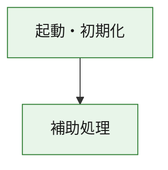
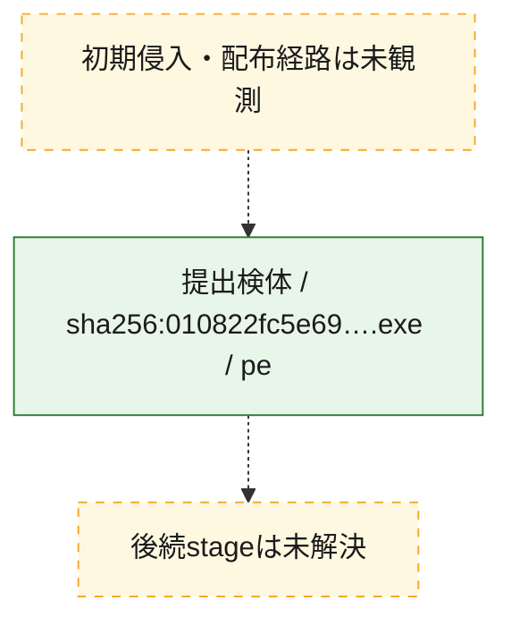
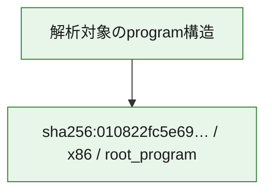

# 全体ロジック：010822fc5e692cb35b344dcfc357037c0a79e83ef240dd34a822064a6d534a08

代表関数の静的証跡から、起動・初期化の処理群を確認しました。

## 読み方

- phaseの掲載順は解析上の整理順です。observed_call_edgesがない段階間の実行順を断定しません。
- 図の実線は静的に観測した関係、点線と黄色のノードは未観測・未解決の関係を示します。
- 図は静的な要約であり、動的実行を再現するものではありません。
- 詳細な関数解説とfingerprintは[STATIC-LOGIC.md](STATIC-LOGIC.md)を参照してください。

## 静的可視化

### 実行フロー

### 感染チェーン

### モジュール関係

## 処理段階

### 1. 起動・初期化

entry pointから初期化と後続処理への移行を確認します。
確度: `confirmed_static_function_evidence`

- `010822fc5e692cb35b344dcfc357037c0a79e83ef240dd34a822064a6d534a08:ghidra:180001010` — 初期化と主要処理への分岐を行う入口関数です。 状態: `succeeded`、選定理由: `entry_point`, `meaningful_symbol_name`, `reviewed_call_centrality:22`, `role:entrypoint`, `small_program_complete_context`

### 2. 補助処理

主要処理を支える一般内部関数またはlibrary処理を確認します。
確度: `confirmed_static_function_evidence`

- `010822fc5e692cb35b344dcfc357037c0a79e83ef240dd34a822064a6d534a08:ghidra:180001240` — 検体内部の一般処理を実装する関数です。 状態: `succeeded`、選定理由: `context_representative`, `reviewed_call_centrality:2`, `small_program_complete_context`
- `010822fc5e692cb35b344dcfc357037c0a79e83ef240dd34a822064a6d534a08:ghidra:180001350` — 検体内部の一般処理を実装する関数です。 状態: `succeeded`、選定理由: `context_representative`, `reviewed_call_centrality:25`, `small_program_complete_context`
- `010822fc5e692cb35b344dcfc357037c0a79e83ef240dd34a822064a6d534a08:ghidra:180003780` — 検体内部の一般処理を実装する関数です。 状態: `succeeded`、選定理由: `context_representative`, `reviewed_call_centrality:2`, `small_program_complete_context`
- `010822fc5e692cb35b344dcfc357037c0a79e83ef240dd34a822064a6d534a08:ghidra:1800038e0` — 検体内部の一般処理を実装する関数です。 状態: `succeeded`、選定理由: `context_representative`, `reviewed_call_centrality:2`, `small_program_complete_context`

## 観測したcall関係

- `010822fc5e692cb35b344dcfc357037c0a79e83ef240dd34a822064a6d534a08:ghidra:180001010` → `010822fc5e692cb35b344dcfc357037c0a79e83ef240dd34a822064a6d534a08:ghidra:180001240` （`startup` → `support`）
- `010822fc5e692cb35b344dcfc357037c0a79e83ef240dd34a822064a6d534a08:ghidra:180001010` → `010822fc5e692cb35b344dcfc357037c0a79e83ef240dd34a822064a6d534a08:ghidra:180001350` （`startup` → `support`）
- `010822fc5e692cb35b344dcfc357037c0a79e83ef240dd34a822064a6d534a08:ghidra:180001350` → `010822fc5e692cb35b344dcfc357037c0a79e83ef240dd34a822064a6d534a08:ghidra:180001240` （`support` → `support`）
- `010822fc5e692cb35b344dcfc357037c0a79e83ef240dd34a822064a6d534a08:ghidra:180001350` → `010822fc5e692cb35b344dcfc357037c0a79e83ef240dd34a822064a6d534a08:ghidra:180003780` （`support` → `support`）
- `010822fc5e692cb35b344dcfc357037c0a79e83ef240dd34a822064a6d534a08:ghidra:180001350` → `010822fc5e692cb35b344dcfc357037c0a79e83ef240dd34a822064a6d534a08:ghidra:1800038e0` （`support` → `support`）
- `010822fc5e692cb35b344dcfc357037c0a79e83ef240dd34a822064a6d534a08:ghidra:180003780` → `010822fc5e692cb35b344dcfc357037c0a79e83ef240dd34a822064a6d534a08:ghidra:1800038e0` （`support` → `support`）
- `ghidra-function:09f71653bd6ae27b5e643c30` → `ghidra-external:1b538957a4ffdaf37b1f3804` （`unclassified` → `unclassified`）
- `ghidra-function:09f71653bd6ae27b5e643c30` → `ghidra-external:341f0ae29155d234d741430d` （`unclassified` → `unclassified`）
- `ghidra-function:09f71653bd6ae27b5e643c30` → `ghidra-external:36137997f0713d8d65275ae4` （`unclassified` → `unclassified`）
- `ghidra-function:09f71653bd6ae27b5e643c30` → `ghidra-external:48fc3034eaae88e0d0cb5b55` （`unclassified` → `unclassified`）
- `ghidra-function:09f71653bd6ae27b5e643c30` → `ghidra-external:52ad5f5ce55307d2c1accc5d` （`unclassified` → `unclassified`）
- `ghidra-function:09f71653bd6ae27b5e643c30` → `ghidra-external:537d464e7ba40067f38fa0ea` （`unclassified` → `unclassified`）
- `ghidra-function:09f71653bd6ae27b5e643c30` → `ghidra-external:545d4f7be4751423c8b922a7` （`unclassified` → `unclassified`）
- `ghidra-function:09f71653bd6ae27b5e643c30` → `ghidra-external:5476af7e6c6597dddc9334b3` （`unclassified` → `unclassified`）
- `ghidra-function:09f71653bd6ae27b5e643c30` → `ghidra-external:620046d02d2b7d1961b39414` （`unclassified` → `unclassified`）
- `ghidra-function:09f71653bd6ae27b5e643c30` → `ghidra-external:67393f969b1a659d60471158` （`unclassified` → `unclassified`）
- `ghidra-function:09f71653bd6ae27b5e643c30` → `ghidra-external:68eb68cb5a91991f526f972d` （`unclassified` → `unclassified`）
- `ghidra-function:09f71653bd6ae27b5e643c30` → `ghidra-external:7309b063649dfd4ece87e618` （`unclassified` → `unclassified`）
- `ghidra-function:09f71653bd6ae27b5e643c30` → `ghidra-external:7dc4a1beee2935ce208e6fad` （`unclassified` → `unclassified`）
- `ghidra-function:09f71653bd6ae27b5e643c30` → `ghidra-external:7ebebd7a10bdffbb53f59b55` （`unclassified` → `unclassified`）
- `ghidra-function:09f71653bd6ae27b5e643c30` → `ghidra-external:83a10ce6455fe36376937b57` （`unclassified` → `unclassified`）
- `ghidra-function:09f71653bd6ae27b5e643c30` → `ghidra-external:90dfb5e9cab2aa5c8c6b9a27` （`unclassified` → `unclassified`）
- `ghidra-function:09f71653bd6ae27b5e643c30` → `ghidra-external:94716e85905aef0bd6647532` （`unclassified` → `unclassified`）
- `ghidra-function:09f71653bd6ae27b5e643c30` → `ghidra-external:9c7423194706edc3fdf040c4` （`unclassified` → `unclassified`）
- `ghidra-function:09f71653bd6ae27b5e643c30` → `ghidra-external:ae0b809800a1c815c7936067` （`unclassified` → `unclassified`）
- `ghidra-function:09f71653bd6ae27b5e643c30` → `ghidra-external:c44bd9ea8ee80e6623209cb2` （`unclassified` → `unclassified`）
- `ghidra-function:09f71653bd6ae27b5e643c30` → `ghidra-external:e38a3d0629b9a40498b103cc` （`unclassified` → `unclassified`）
- `ghidra-function:09f71653bd6ae27b5e643c30` → `ghidra-function:a01be01dfc86233c1d8a998f` （`unclassified` → `unclassified`）
- `ghidra-function:09f71653bd6ae27b5e643c30` → `ghidra-function:adfdcc13a2a9072aa5810185` （`unclassified` → `unclassified`）
- `ghidra-function:09f71653bd6ae27b5e643c30` → `ghidra-function:e445e5566b8f0ea6cf2b7fbc` （`unclassified` → `unclassified`）
- `ghidra-function:18feeea773e8bfc23f4ec8b8` → `ghidra-function:07e4d1fc97fe861bee1a9cf0` （`unclassified` → `unclassified`）
- `ghidra-function:18feeea773e8bfc23f4ec8b8` → `ghidra-function:09f71653bd6ae27b5e643c30` （`unclassified` → `unclassified`）
- `ghidra-function:18feeea773e8bfc23f4ec8b8` → `ghidra-function:197577badde90a0019e70ce5` （`unclassified` → `unclassified`）
- `ghidra-function:18feeea773e8bfc23f4ec8b8` → `ghidra-function:1fb5c3c0b0bb8b418ee05d5f` （`unclassified` → `unclassified`）
- `ghidra-function:18feeea773e8bfc23f4ec8b8` → `ghidra-function:7aaaa59231a2dcea0da499f3` （`unclassified` → `unclassified`）
- `ghidra-function:18feeea773e8bfc23f4ec8b8` → `ghidra-function:897c547e1bee2971b527056e` （`unclassified` → `unclassified`）
- `ghidra-function:18feeea773e8bfc23f4ec8b8` → `ghidra-function:a99dc2132dba04a5c1a696d2` （`unclassified` → `unclassified`）
- `ghidra-function:18feeea773e8bfc23f4ec8b8` → `ghidra-function:aaf70d8209fc9d78506024fa` （`unclassified` → `unclassified`）
- `ghidra-function:18feeea773e8bfc23f4ec8b8` → `ghidra-function:adfdcc13a2a9072aa5810185` （`unclassified` → `unclassified`）
- `ghidra-function:18feeea773e8bfc23f4ec8b8` → `ghidra-function:b4397de8d675b7a8cb8b2fbc` （`unclassified` → `unclassified`）
- `ghidra-function:18feeea773e8bfc23f4ec8b8` → `ghidra-function:f24913f2f57761927aa7c385` （`unclassified` → `unclassified`）
- `ghidra-function:18feeea773e8bfc23f4ec8b8` → `ghidra-function:fd68427e4f03c7b137dc1298` （`unclassified` → `unclassified`）
- `ghidra-function:e445e5566b8f0ea6cf2b7fbc` → `ghidra-function:a01be01dfc86233c1d8a998f` （`unclassified` → `unclassified`）

## 解析範囲と制約

- 選定外関数は全体inventoryへ残しますが、関数本体の個別解説対象にはしていません。
- indirect call、難読化、packer、VM、壊れたcontrol flowによりcall関係が欠落する場合があります。
- 文書は静的解析に基づき、検体実行や外部通信による動的確認は行っていません。
