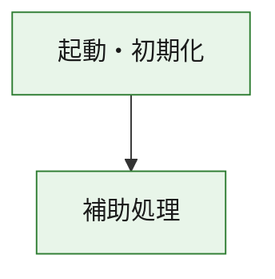
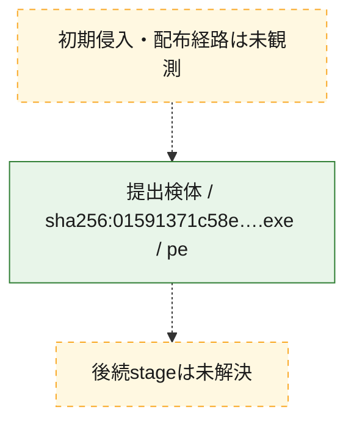
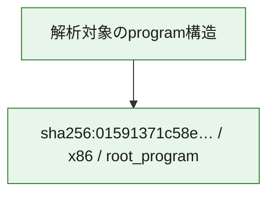

# 全体ロジック：01591371c58e4c1df95f91cf5e5639c3adb7cf2df9656c673a830c835bce26ba

代表関数の静的証跡から、起動・初期化の処理群を確認しました。

## 読み方

- phaseの掲載順は解析上の整理順です。observed_call_edgesがない段階間の実行順を断定しません。
- 図の実線は静的に観測した関係、点線と黄色のノードは未観測・未解決の関係を示します。
- 図は静的な要約であり、動的実行を再現するものではありません。
- 詳細な関数解説とfingerprintは[STATIC-LOGIC.md](STATIC-LOGIC.md)を参照してください。

## 静的可視化

### 実行フロー

### 感染チェーン

### モジュール関係

## 処理段階

### 1. 起動・初期化

entry pointから初期化と後続処理への移行を確認します。
確度: `confirmed_static_function_evidence`

- `01591371c58e4c1df95f91cf5e5639c3adb7cf2df9656c673a830c835bce26ba:ghidra:180001010` — 初期化と主要処理への分岐を行う入口関数です。 状態: `succeeded`、選定理由: `entry_point`, `meaningful_symbol_name`, `reviewed_call_centrality:22`, `role:entrypoint`, `small_program_complete_context`

### 2. 補助処理

主要処理を支える一般内部関数またはlibrary処理を確認します。
確度: `confirmed_static_function_evidence`

- `01591371c58e4c1df95f91cf5e5639c3adb7cf2df9656c673a830c835bce26ba:ghidra:180001240` — 検体内部の一般処理を実装する関数です。 状態: `succeeded`、選定理由: `context_representative`, `reviewed_call_centrality:2`, `small_program_complete_context`
- `01591371c58e4c1df95f91cf5e5639c3adb7cf2df9656c673a830c835bce26ba:ghidra:180001350` — 検体内部の一般処理を実装する関数です。 状態: `succeeded`、選定理由: `context_representative`, `reviewed_call_centrality:25`, `small_program_complete_context`
- `01591371c58e4c1df95f91cf5e5639c3adb7cf2df9656c673a830c835bce26ba:ghidra:180003780` — 検体内部の一般処理を実装する関数です。 状態: `succeeded`、選定理由: `context_representative`, `reviewed_call_centrality:2`, `small_program_complete_context`
- `01591371c58e4c1df95f91cf5e5639c3adb7cf2df9656c673a830c835bce26ba:ghidra:1800038e0` — 検体内部の一般処理を実装する関数です。 状態: `succeeded`、選定理由: `context_representative`, `reviewed_call_centrality:2`, `small_program_complete_context`

## 観測したcall関係

- `01591371c58e4c1df95f91cf5e5639c3adb7cf2df9656c673a830c835bce26ba:ghidra:180001010` → `01591371c58e4c1df95f91cf5e5639c3adb7cf2df9656c673a830c835bce26ba:ghidra:180001240` （`startup` → `support`）
- `01591371c58e4c1df95f91cf5e5639c3adb7cf2df9656c673a830c835bce26ba:ghidra:180001010` → `01591371c58e4c1df95f91cf5e5639c3adb7cf2df9656c673a830c835bce26ba:ghidra:180001350` （`startup` → `support`）
- `01591371c58e4c1df95f91cf5e5639c3adb7cf2df9656c673a830c835bce26ba:ghidra:180001350` → `01591371c58e4c1df95f91cf5e5639c3adb7cf2df9656c673a830c835bce26ba:ghidra:180001240` （`support` → `support`）
- `01591371c58e4c1df95f91cf5e5639c3adb7cf2df9656c673a830c835bce26ba:ghidra:180001350` → `01591371c58e4c1df95f91cf5e5639c3adb7cf2df9656c673a830c835bce26ba:ghidra:180003780` （`support` → `support`）
- `01591371c58e4c1df95f91cf5e5639c3adb7cf2df9656c673a830c835bce26ba:ghidra:180001350` → `01591371c58e4c1df95f91cf5e5639c3adb7cf2df9656c673a830c835bce26ba:ghidra:1800038e0` （`support` → `support`）
- `01591371c58e4c1df95f91cf5e5639c3adb7cf2df9656c673a830c835bce26ba:ghidra:180003780` → `01591371c58e4c1df95f91cf5e5639c3adb7cf2df9656c673a830c835bce26ba:ghidra:1800038e0` （`support` → `support`）
- `ghidra-function:09cd31b73e0233b0f4d2b7b0` → `ghidra-external:032efbe0c8eea0c2cb057484` （`unclassified` → `unclassified`）
- `ghidra-function:09cd31b73e0233b0f4d2b7b0` → `ghidra-external:2d9bc91d736e1478dd244d3a` （`unclassified` → `unclassified`）
- `ghidra-function:09cd31b73e0233b0f4d2b7b0` → `ghidra-external:2eeae15a87f61d4d5d40c813` （`unclassified` → `unclassified`）
- `ghidra-function:09cd31b73e0233b0f4d2b7b0` → `ghidra-external:3408f0fdb656ee805305f060` （`unclassified` → `unclassified`）
- `ghidra-function:09cd31b73e0233b0f4d2b7b0` → `ghidra-external:34d3c299e8cce95d259409a6` （`unclassified` → `unclassified`）
- `ghidra-function:09cd31b73e0233b0f4d2b7b0` → `ghidra-external:38c82e1ae62e37eda10b3d19` （`unclassified` → `unclassified`）
- `ghidra-function:09cd31b73e0233b0f4d2b7b0` → `ghidra-external:43486b282fe1dd72c86ed947` （`unclassified` → `unclassified`）
- `ghidra-function:09cd31b73e0233b0f4d2b7b0` → `ghidra-external:46367f2987c04e0d1cf76443` （`unclassified` → `unclassified`）
- `ghidra-function:09cd31b73e0233b0f4d2b7b0` → `ghidra-external:4741d8d133cf434a851f358b` （`unclassified` → `unclassified`）
- `ghidra-function:09cd31b73e0233b0f4d2b7b0` → `ghidra-external:6d1672663818c860cac851ef` （`unclassified` → `unclassified`）
- `ghidra-function:09cd31b73e0233b0f4d2b7b0` → `ghidra-external:6ee80d3a5f6b0360398290c2` （`unclassified` → `unclassified`）
- `ghidra-function:09cd31b73e0233b0f4d2b7b0` → `ghidra-external:6fe6731b19fb10cd4bc235cc` （`unclassified` → `unclassified`）
- `ghidra-function:09cd31b73e0233b0f4d2b7b0` → `ghidra-external:91598401897d2a217213fb19` （`unclassified` → `unclassified`）
- `ghidra-function:09cd31b73e0233b0f4d2b7b0` → `ghidra-external:9fcaf456ceea65ca4bb024cc` （`unclassified` → `unclassified`）
- `ghidra-function:09cd31b73e0233b0f4d2b7b0` → `ghidra-external:a36e980d8a75ebdf1859e14f` （`unclassified` → `unclassified`）
- `ghidra-function:09cd31b73e0233b0f4d2b7b0` → `ghidra-external:a815e8cc751df796f8e51033` （`unclassified` → `unclassified`）
- `ghidra-function:09cd31b73e0233b0f4d2b7b0` → `ghidra-external:aa9a2ddfb182a85c0e6b8186` （`unclassified` → `unclassified`）
- `ghidra-function:09cd31b73e0233b0f4d2b7b0` → `ghidra-external:bdbddc96161c39e312cfd5f0` （`unclassified` → `unclassified`）
- `ghidra-function:09cd31b73e0233b0f4d2b7b0` → `ghidra-external:ebdcb93068b943e6d55634da` （`unclassified` → `unclassified`）
- `ghidra-function:09cd31b73e0233b0f4d2b7b0` → `ghidra-external:f022cb3310571d33a38add5c` （`unclassified` → `unclassified`）
- `ghidra-function:09cd31b73e0233b0f4d2b7b0` → `ghidra-external:fee307a047eb85fe73a08fb0` （`unclassified` → `unclassified`）
- `ghidra-function:09cd31b73e0233b0f4d2b7b0` → `ghidra-function:3f34f2fb82ba6562f8b98072` （`unclassified` → `unclassified`）
- `ghidra-function:09cd31b73e0233b0f4d2b7b0` → `ghidra-function:42ad5389560bbe4f126771d6` （`unclassified` → `unclassified`）
- `ghidra-function:09cd31b73e0233b0f4d2b7b0` → `ghidra-function:e34770baf7f994e33919d360` （`unclassified` → `unclassified`）
- `ghidra-function:0a9e058eda4e6575eee37d20` → `ghidra-function:09cd31b73e0233b0f4d2b7b0` （`unclassified` → `unclassified`）
- `ghidra-function:0a9e058eda4e6575eee37d20` → `ghidra-function:0ab63f159b39c3612cabad41` （`unclassified` → `unclassified`）
- `ghidra-function:0a9e058eda4e6575eee37d20` → `ghidra-function:1a8407a54ab3d60800cd127c` （`unclassified` → `unclassified`）
- `ghidra-function:0a9e058eda4e6575eee37d20` → `ghidra-function:3950f06bae1d8aa89b9d63bc` （`unclassified` → `unclassified`）
- `ghidra-function:0a9e058eda4e6575eee37d20` → `ghidra-function:3f34f2fb82ba6562f8b98072` （`unclassified` → `unclassified`）
- `ghidra-function:0a9e058eda4e6575eee37d20` → `ghidra-function:4bf4bf6fb88e095045b86b17` （`unclassified` → `unclassified`）
- `ghidra-function:0a9e058eda4e6575eee37d20` → `ghidra-function:50c29fc1e6d0b287bd6305d0` （`unclassified` → `unclassified`）
- `ghidra-function:0a9e058eda4e6575eee37d20` → `ghidra-function:95d2e9b9df31426de16a7bd5` （`unclassified` → `unclassified`）
- `ghidra-function:0a9e058eda4e6575eee37d20` → `ghidra-function:a67cf390663d3892b6c05451` （`unclassified` → `unclassified`）
- `ghidra-function:0a9e058eda4e6575eee37d20` → `ghidra-function:c5498bff6af963f74c099727` （`unclassified` → `unclassified`）
- `ghidra-function:0a9e058eda4e6575eee37d20` → `ghidra-function:ed0d796a5f15a68efb996f42` （`unclassified` → `unclassified`）
- `ghidra-function:0a9e058eda4e6575eee37d20` → `ghidra-function:facd880f3cac8ded59796529` （`unclassified` → `unclassified`）
- `ghidra-function:e34770baf7f994e33919d360` → `ghidra-function:42ad5389560bbe4f126771d6` （`unclassified` → `unclassified`）

## 解析範囲と制約

- 選定外関数は全体inventoryへ残しますが、関数本体の個別解説対象にはしていません。
- indirect call、難読化、packer、VM、壊れたcontrol flowによりcall関係が欠落する場合があります。
- 文書は静的解析に基づき、検体実行や外部通信による動的確認は行っていません。
