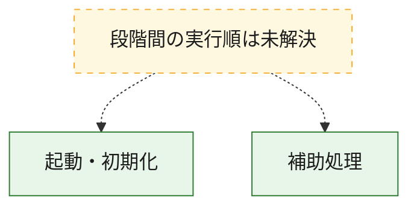
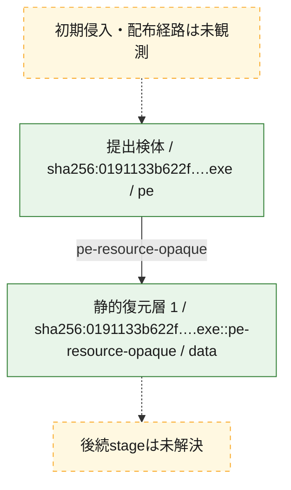
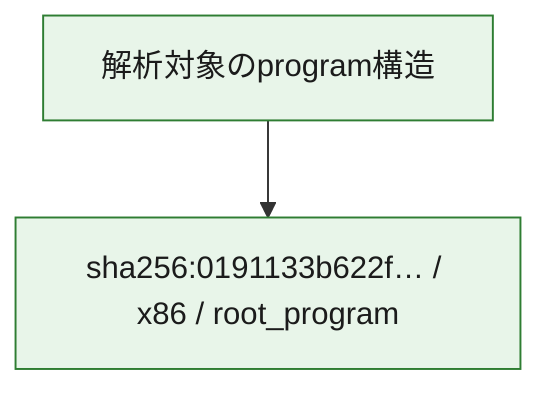

# 全体ロジック：0191133b622f9729ebd313976e44e311a9c17e5fd9f8600ba3c9dea0f649a809

代表関数の静的証跡から、起動・初期化の処理群を確認しました。

## 読み方

- phaseの掲載順は解析上の整理順です。observed_call_edgesがない段階間の実行順を断定しません。
- 図の実線は静的に観測した関係、点線と黄色のノードは未観測・未解決の関係を示します。
- 図は静的な要約であり、動的実行を再現するものではありません。
- 詳細な関数解説とfingerprintは[STATIC-LOGIC.md](STATIC-LOGIC.md)を参照してください。

## 静的可視化

### 実行フロー

### 感染チェーン

### モジュール関係

## 処理段階

### 1. 起動・初期化

entry pointから初期化と後続処理への移行を確認します。
確度: `confirmed_static_function_evidence`

- `0191133b622f9729ebd313976e44e311a9c17e5fd9f8600ba3c9dea0f649a809:ghidra:14003b490` — 初期化と主要処理への分岐を行う入口関数です。 状態: `succeeded`、選定理由: `entry_point`, `meaningful_symbol_name`, `reviewed_call_centrality:21`, `role:entrypoint`

### 2. 補助処理

主要処理を支える一般内部関数またはlibrary処理を確認します。
確度: `confirmed_static_function_evidence_with_limits`

- `0191133b622f9729ebd313976e44e311a9c17e5fd9f8600ba3c9dea0f649a809:ghidra:140001000` — 検体内部の一般処理を実装する関数です。 状態: `succeeded`、選定理由: `context_representative`, `reviewed_call_centrality:2`
- `0191133b622f9729ebd313976e44e311a9c17e5fd9f8600ba3c9dea0f649a809:ghidra:1400010a0` — 検体内部の一般処理を実装する関数です。 状態: `succeeded`、選定理由: `context_representative`
- `0191133b622f9729ebd313976e44e311a9c17e5fd9f8600ba3c9dea0f649a809:ghidra:140001140` — 検体内部の一般処理を実装する関数です。 状態: `succeeded`、選定理由: `context_representative`, `reviewed_call_centrality:2`
- `0191133b622f9729ebd313976e44e311a9c17e5fd9f8600ba3c9dea0f649a809:ghidra:140001250` — 検体内部の一般処理を実装する関数です。 状態: `succeeded`、選定理由: `context_representative`
- `0191133b622f9729ebd313976e44e311a9c17e5fd9f8600ba3c9dea0f649a809:ghidra:140001380` — 検体内部の一般処理を実装する関数です。 状態: `succeeded`、選定理由: `context_representative`
- `0191133b622f9729ebd313976e44e311a9c17e5fd9f8600ba3c9dea0f649a809:ghidra:140001a90` — 検体内部の一般処理を実装する関数です。 状態: `succeeded`、選定理由: `context_representative`
- `0191133b622f9729ebd313976e44e311a9c17e5fd9f8600ba3c9dea0f649a809:ghidra:140001bc0` — 検体内部の一般処理を実装する関数です。 状態: `succeeded`、選定理由: `context_representative`, `reviewed_call_centrality:1`
- `0191133b622f9729ebd313976e44e311a9c17e5fd9f8600ba3c9dea0f649a809:ghidra:140001cb0` — 検体内部の一般処理を実装する関数です。 状態: `succeeded`、選定理由: `context_representative`, `reviewed_call_centrality:2`
- `0191133b622f9729ebd313976e44e311a9c17e5fd9f8600ba3c9dea0f649a809:ghidra:140001d70` — 検体内部の一般処理を実装する関数です。 状態: `succeeded`、選定理由: `context_representative`
- `0191133b622f9729ebd313976e44e311a9c17e5fd9f8600ba3c9dea0f649a809:ghidra:140001fb0` — 検体内部の一般処理を実装する関数です。 状態: `succeeded`、選定理由: `context_representative`
- `0191133b622f9729ebd313976e44e311a9c17e5fd9f8600ba3c9dea0f649a809:ghidra:1400028a0` — 検体内部の一般処理を実装する関数です。 状態: `succeeded`、選定理由: `context_representative`
- `0191133b622f9729ebd313976e44e311a9c17e5fd9f8600ba3c9dea0f649a809:ghidra:140002960` — 検体内部の一般処理を実装する関数です。 状態: `limited_bad_instruction_or_flow`、選定理由: `context_representative`, `reviewed_call_centrality:1`
- `0191133b622f9729ebd313976e44e311a9c17e5fd9f8600ba3c9dea0f649a809:ghidra:140005400` — 検体内部の一般処理を実装する関数です。 状態: `limited_bad_instruction_or_flow`、選定理由: `context_representative`
- `0191133b622f9729ebd313976e44e311a9c17e5fd9f8600ba3c9dea0f649a809:ghidra:140006b30` — 検体内部の一般処理を実装する関数です。 状態: `succeeded`、選定理由: `context_representative`
- `0191133b622f9729ebd313976e44e311a9c17e5fd9f8600ba3c9dea0f649a809:ghidra:140006bd0` — 検体内部の一般処理を実装する関数です。 状態: `succeeded`、選定理由: `context_representative`
- `0191133b622f9729ebd313976e44e311a9c17e5fd9f8600ba3c9dea0f649a809:ghidra:140006dc0` — 検体内部の一般処理を実装する関数です。 状態: `succeeded`、選定理由: `context_representative`, `reviewed_call_centrality:2`
- `0191133b622f9729ebd313976e44e311a9c17e5fd9f8600ba3c9dea0f649a809:ghidra:140006f00` — 検体内部の一般処理を実装する関数です。 状態: `succeeded`、選定理由: `context_representative`, `reviewed_call_centrality:3`
- `0191133b622f9729ebd313976e44e311a9c17e5fd9f8600ba3c9dea0f649a809:ghidra:140007c10` — 検体内部の一般処理を実装する関数です。 状態: `succeeded`、選定理由: `context_representative`, `reviewed_call_centrality:3`
- `0191133b622f9729ebd313976e44e311a9c17e5fd9f8600ba3c9dea0f649a809:ghidra:140008800` — 検体内部の一般処理を実装する関数です。 状態: `succeeded`、選定理由: `context_representative`
- `0191133b622f9729ebd313976e44e311a9c17e5fd9f8600ba3c9dea0f649a809:ghidra:140008b60` — 検体内部の一般処理を実装する関数です。 状態: `succeeded`、選定理由: `context_representative`, `reviewed_call_centrality:2`
- `0191133b622f9729ebd313976e44e311a9c17e5fd9f8600ba3c9dea0f649a809:ghidra:140008ca0` — 検体内部の一般処理を実装する関数です。 状態: `succeeded`、選定理由: `context_representative`, `reviewed_call_centrality:2`
- `0191133b622f9729ebd313976e44e311a9c17e5fd9f8600ba3c9dea0f649a809:ghidra:140008d90` — 検体内部の一般処理を実装する関数です。 状態: `succeeded`、選定理由: `context_representative`
- `0191133b622f9729ebd313976e44e311a9c17e5fd9f8600ba3c9dea0f649a809:ghidra:140009210` — 検体内部の一般処理を実装する関数です。 状態: `succeeded`、選定理由: `context_representative`, `reviewed_call_centrality:2`
- `0191133b622f9729ebd313976e44e311a9c17e5fd9f8600ba3c9dea0f649a809:ghidra:140009390` — 検体内部の一般処理を実装する関数です。 状態: `succeeded`、選定理由: `context_representative`, `reviewed_call_centrality:2`
- `0191133b622f9729ebd313976e44e311a9c17e5fd9f8600ba3c9dea0f649a809:ghidra:140009d20` — 検体内部の一般処理を実装する関数です。 状態: `limited_bad_instruction_or_flow`、選定理由: `context_representative`, `reviewed_call_centrality:1`
- `0191133b622f9729ebd313976e44e311a9c17e5fd9f8600ba3c9dea0f649a809:ghidra:14000a7a0` — 検体内部の一般処理を実装する関数です。 状態: `succeeded`、選定理由: `context_representative`, `reviewed_call_centrality:4`
- `0191133b622f9729ebd313976e44e311a9c17e5fd9f8600ba3c9dea0f649a809:ghidra:14000b720` — 検体内部の一般処理を実装する関数です。 状態: `succeeded`、選定理由: `context_representative`, `reviewed_call_centrality:1`
- `0191133b622f9729ebd313976e44e311a9c17e5fd9f8600ba3c9dea0f649a809:ghidra:14000bbd0` — 検体内部の一般処理を実装する関数です。 状態: `succeeded`、選定理由: `context_representative`
- `0191133b622f9729ebd313976e44e311a9c17e5fd9f8600ba3c9dea0f649a809:ghidra:14000c050` — 検体内部の一般処理を実装する関数です。 状態: `limited_bad_instruction_or_flow`、選定理由: `context_representative`
- `0191133b622f9729ebd313976e44e311a9c17e5fd9f8600ba3c9dea0f649a809:ghidra:14000c140` — 検体内部の一般処理を実装する関数です。 状態: `succeeded`、選定理由: `context_representative`
- `0191133b622f9729ebd313976e44e311a9c17e5fd9f8600ba3c9dea0f649a809:ghidra:14003b830` — 検体内部の一般処理を実装する関数です。 状態: `succeeded`、選定理由: `meaningful_symbol_name`

## 観測したcall関係

- 代表関数間で直接解決できた呼出関係はありません。

## 解析範囲と制約

- 選定外関数は全体inventoryへ残しますが、関数本体の個別解説対象にはしていません。
- indirect call、難読化、packer、VM、壊れたcontrol flowによりcall関係が欠落する場合があります。
- 文書は静的解析に基づき、検体実行や外部通信による動的確認は行っていません。
