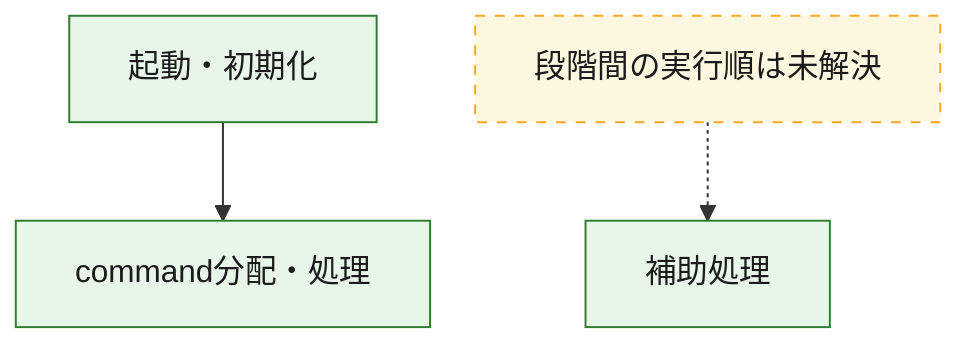
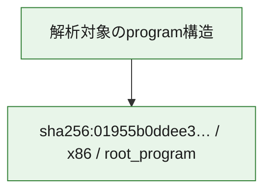

# 全体ロジック：01955b0ddee35a11084209f9ffb29cd343bf1bdff6a5f3b26be644fd8233629a

代表関数の静的証跡から、起動・初期化、command分配・処理の処理群を確認しました。

## 読み方

- phaseの掲載順は解析上の整理順です。observed_call_edgesがない段階間の実行順を断定しません。
- 図の実線は静的に観測した関係、点線と黄色のノードは未観測・未解決の関係を示します。
- 図は静的な要約であり、動的実行を再現するものではありません。
- 詳細な関数解説とfingerprintは[STATIC-LOGIC.md](STATIC-LOGIC.md)を参照してください。

## 静的可視化

### 実行フロー

### 感染チェーン

```mermaid
flowchart TD
  chain_initial["初期侵入・配布経路は未観測"]
  chain_01["提出検体 / sha256:01955b0ddee3….exe / pe"]
  chain_02["静的復元層 1 / sha256:01955b0ddee3….exe::pe-resource-opaque / data"]
  chain_03["静的復元層 1 / sha256:01955b0ddee3….exe::pe-resource-script / script"]
  chain_04["静的復元層 1 / sha256:01955b0ddee3….exe::pe-resource-script / script"]
  chain_05["静的復元層 1 / sha256:01955b0ddee3….exe::pe-resource-script / script"]
  chain_06["静的復元層 1 / sha256:01955b0ddee3….exe::pe-resource-script / script"]
  chain_07["静的復元層 1 / sha256:01955b0ddee3….exe::pe-resource-script / script"]
  chain_08["静的復元層 1 / sha256:01955b0ddee3….exe::pe-resource-script / script"]
  chain_09["静的復元層 1 / sha256:01955b0ddee3….exe::pe-resource-script / script"]
  chain_10["静的復元層 1 / sha256:01955b0ddee3….exe::pe-resource-script / script"]
  chain_11["静的復元層 1 / sha256:01955b0ddee3….exe::pe-resource-script / script"]
  chain_12["静的復元層 1 / sha256:01955b0ddee3….exe::pe-resource-script / script"]
  chain_13["静的復元層 1 / sha256:01955b0ddee3….exe::pe-resource-script / script"]
  chain_14["静的復元層 1 / sha256:01955b0ddee3….exe::pe-resource-script / script"]
  chain_15["静的復元層 1 / sha256:01955b0ddee3….exe::pe-resource-script / script"]
  chain_16["静的復元層 1 / sha256:01955b0ddee3….exe::pe-resource-script / script"]
  chain_01 -->|pe-resource-opaque| chain_02
  chain_01 -->|pe-resource-script| chain_03
  chain_01 -->|pe-resource-script| chain_04
  chain_01 -->|pe-resource-script| chain_05
  chain_01 -->|pe-resource-script| chain_06
  chain_01 -->|pe-resource-script| chain_07
  chain_01 -->|pe-resource-script| chain_08
  chain_01 -->|pe-resource-script| chain_09
  chain_01 -->|pe-resource-script| chain_10
  chain_01 -->|pe-resource-script| chain_11
  chain_01 -->|pe-resource-script| chain_12
  chain_01 -->|pe-resource-script| chain_13
  chain_01 -->|pe-resource-script| chain_14
  chain_01 -->|pe-resource-script| chain_15
  chain_01 -->|pe-resource-script| chain_16
  chain_initial -.-> chain_01
  chain_more["その他5層はstatic-layers.jsonを参照"]
  chain_02 -.-> chain_more
  chain_03 -.-> chain_more
  chain_04 -.-> chain_more
  chain_05 -.-> chain_more
  chain_06 -.-> chain_more
  chain_07 -.-> chain_more
  chain_08 -.-> chain_more
  chain_09 -.-> chain_more
  chain_10 -.-> chain_more
  chain_11 -.-> chain_more
  chain_12 -.-> chain_more
  chain_13 -.-> chain_more
  chain_14 -.-> chain_more
  chain_15 -.-> chain_more
  chain_16 -.-> chain_more
  class chain_more unresolved
  class chain_01,chain_02,chain_03,chain_04,chain_05,chain_06,chain_07,chain_08,chain_09,chain_10,chain_11,chain_12,chain_13,chain_14,chain_15,chain_16 confirmed
  class chain_initial unresolved
  classDef confirmed fill:#e8f5e9,stroke:#2e7d32,color:#1b1b1b
  classDef unresolved fill:#fff8e1,stroke:#f9a825,color:#1b1b1b,stroke-dasharray:5 5
```

### モジュール関係

## 処理段階

### 1. 起動・初期化

entry pointから初期化と後続処理への移行を確認します。
確度: `confirmed_static_function_evidence`

- `01955b0ddee35a11084209f9ffb29cd343bf1bdff6a5f3b26be644fd8233629a:ghidra:14128c9b0` — 初期化と主要処理への分岐を行う入口関数です。 状態: `succeeded`、選定理由: `entry_point`, `meaningful_symbol_name`, `reviewed_call_centrality:22`, `role:entrypoint`

### 2. command分配・処理

受信commandやtaskの解釈、分配、個別handlerへの移行を確認します。
確度: `confirmed_static_function_evidence_with_limits`

- `01955b0ddee35a11084209f9ffb29cd343bf1bdff6a5f3b26be644fd8233629a:ghidra:14129db60` — commandの解釈、分配、または個別処理を担当する関数です。 状態: `limited_bad_instruction_or_flow`、選定理由: `meaningful_symbol_name`, `reviewed_call_centrality:1`, `role:command_dispatch_or_handler`

### 3. 補助処理

主要処理を支える一般内部関数またはlibrary処理を確認します。
確度: `confirmed_static_function_evidence_with_limits`

- `01955b0ddee35a11084209f9ffb29cd343bf1bdff6a5f3b26be644fd8233629a:ghidra:140a51000` — 検体内部の一般処理を実装する関数です。 状態: `succeeded`、選定理由: `context_representative`, `reviewed_call_centrality:23`
- `01955b0ddee35a11084209f9ffb29cd343bf1bdff6a5f3b26be644fd8233629a:ghidra:140a51390` — 検体内部の一般処理を実装する関数です。 状態: `succeeded`、選定理由: `context_representative`, `reviewed_call_centrality:3`
- `01955b0ddee35a11084209f9ffb29cd343bf1bdff6a5f3b26be644fd8233629a:ghidra:140a514a0` — 検体内部の一般処理を実装する関数です。 状態: `succeeded`、選定理由: `context_representative`, `reviewed_call_centrality:1`
- `01955b0ddee35a11084209f9ffb29cd343bf1bdff6a5f3b26be644fd8233629a:ghidra:140a51550` — 検体内部の一般処理を実装する関数です。 状態: `succeeded`、選定理由: `context_representative`, `reviewed_call_centrality:1`
- `01955b0ddee35a11084209f9ffb29cd343bf1bdff6a5f3b26be644fd8233629a:ghidra:140a515e0` — 検体内部の一般処理を実装する関数です。 状態: `succeeded`、選定理由: `context_representative`, `reviewed_call_centrality:5`
- `01955b0ddee35a11084209f9ffb29cd343bf1bdff6a5f3b26be644fd8233629a:ghidra:140a51670` — 検体内部の一般処理を実装する関数です。 状態: `succeeded`、選定理由: `context_representative`, `reviewed_call_centrality:8`
- `01955b0ddee35a11084209f9ffb29cd343bf1bdff6a5f3b26be644fd8233629a:ghidra:140a51770` — 検体内部の一般処理を実装する関数です。 状態: `succeeded`、選定理由: `context_representative`, `reviewed_call_centrality:6`
- `01955b0ddee35a11084209f9ffb29cd343bf1bdff6a5f3b26be644fd8233629a:ghidra:140a519d0` — 検体内部の一般処理を実装する関数です。 状態: `succeeded`、選定理由: `context_representative`, `reviewed_call_centrality:1`
- `01955b0ddee35a11084209f9ffb29cd343bf1bdff6a5f3b26be644fd8233629a:ghidra:140a51a00` — 検体内部の一般処理を実装する関数です。 状態: `succeeded`、選定理由: `context_representative`, `reviewed_call_centrality:1`
- `01955b0ddee35a11084209f9ffb29cd343bf1bdff6a5f3b26be644fd8233629a:ghidra:140a51a90` — 検体内部の一般処理を実装する関数です。 状態: `succeeded`、選定理由: `context_representative`, `reviewed_call_centrality:1`
- `01955b0ddee35a11084209f9ffb29cd343bf1bdff6a5f3b26be644fd8233629a:ghidra:140a51ad0` — 検体内部の一般処理を実装する関数です。 状態: `limited_bad_instruction_or_flow`、選定理由: `context_representative`, `reviewed_call_centrality:3`
- `01955b0ddee35a11084209f9ffb29cd343bf1bdff6a5f3b26be644fd8233629a:ghidra:140a51b80` — 検体内部の一般処理を実装する関数です。 状態: `limited_bad_instruction_or_flow`、選定理由: `context_representative`, `reviewed_call_centrality:3`
- `01955b0ddee35a11084209f9ffb29cd343bf1bdff6a5f3b26be644fd8233629a:ghidra:140a51c40` — 検体内部の一般処理を実装する関数です。 状態: `succeeded`、選定理由: `context_representative`, `reviewed_call_centrality:5`
- `01955b0ddee35a11084209f9ffb29cd343bf1bdff6a5f3b26be644fd8233629a:ghidra:140a51d00` — 検体内部の一般処理を実装する関数です。 状態: `succeeded`、選定理由: `context_representative`, `reviewed_call_centrality:4`
- `01955b0ddee35a11084209f9ffb29cd343bf1bdff6a5f3b26be644fd8233629a:ghidra:140a51d90` — 検体内部の一般処理を実装する関数です。 状態: `succeeded`、選定理由: `context_representative`, `reviewed_call_centrality:1`
- `01955b0ddee35a11084209f9ffb29cd343bf1bdff6a5f3b26be644fd8233629a:ghidra:140a51dc0` — 検体内部の一般処理を実装する関数です。 状態: `succeeded`、選定理由: `context_representative`, `reviewed_call_centrality:1`
- `01955b0ddee35a11084209f9ffb29cd343bf1bdff6a5f3b26be644fd8233629a:ghidra:140a51e00` — 検体内部の一般処理を実装する関数です。 状態: `succeeded`、選定理由: `context_representative`, `reviewed_call_centrality:1`
- `01955b0ddee35a11084209f9ffb29cd343bf1bdff6a5f3b26be644fd8233629a:ghidra:140a51e70` — 検体内部の一般処理を実装する関数です。 状態: `succeeded`、選定理由: `context_representative`, `reviewed_call_centrality:1`
- `01955b0ddee35a11084209f9ffb29cd343bf1bdff6a5f3b26be644fd8233629a:ghidra:140a51ec0` — 検体内部の一般処理を実装する関数です。 状態: `succeeded`、選定理由: `context_representative`, `reviewed_call_centrality:1`
- `01955b0ddee35a11084209f9ffb29cd343bf1bdff6a5f3b26be644fd8233629a:ghidra:140a51f00` — 検体内部の一般処理を実装する関数です。 状態: `succeeded`、選定理由: `context_representative`, `reviewed_call_centrality:2`
- `01955b0ddee35a11084209f9ffb29cd343bf1bdff6a5f3b26be644fd8233629a:ghidra:140a51f60` — 検体内部の一般処理を実装する関数です。 状態: `succeeded`、選定理由: `context_representative`, `reviewed_call_centrality:2`
- `01955b0ddee35a11084209f9ffb29cd343bf1bdff6a5f3b26be644fd8233629a:ghidra:140a52040` — 検体内部の一般処理を実装する関数です。 状態: `succeeded`、選定理由: `context_representative`, `reviewed_call_centrality:2`
- `01955b0ddee35a11084209f9ffb29cd343bf1bdff6a5f3b26be644fd8233629a:ghidra:140a520f0` — 検体内部の一般処理を実装する関数です。 状態: `succeeded`、選定理由: `context_representative`, `reviewed_call_centrality:2`
- `01955b0ddee35a11084209f9ffb29cd343bf1bdff6a5f3b26be644fd8233629a:ghidra:140a52140` — 検体内部の一般処理を実装する関数です。 状態: `succeeded`、選定理由: `context_representative`, `reviewed_call_centrality:5`
- `01955b0ddee35a11084209f9ffb29cd343bf1bdff6a5f3b26be644fd8233629a:ghidra:140a530e0` — 検体内部の一般処理を実装する関数です。 状態: `succeeded`、選定理由: `context_representative`, `reviewed_call_centrality:5`
- `01955b0ddee35a11084209f9ffb29cd343bf1bdff6a5f3b26be644fd8233629a:ghidra:140a53440` — 検体内部の一般処理を実装する関数です。 状態: `succeeded`、選定理由: `context_representative`, `reviewed_call_centrality:3`
- `01955b0ddee35a11084209f9ffb29cd343bf1bdff6a5f3b26be644fd8233629a:ghidra:140a53830` — 検体内部の一般処理を実装する関数です。 状態: `succeeded`、選定理由: `context_representative`, `reviewed_call_centrality:2`
- `01955b0ddee35a11084209f9ffb29cd343bf1bdff6a5f3b26be644fd8233629a:ghidra:140a53c90` — 検体内部の一般処理を実装する関数です。 状態: `succeeded`、選定理由: `context_representative`, `reviewed_call_centrality:2`
- `01955b0ddee35a11084209f9ffb29cd343bf1bdff6a5f3b26be644fd8233629a:ghidra:140a540b0` — 検体内部の一般処理を実装する関数です。 状態: `succeeded`、選定理由: `context_representative`, `reviewed_call_centrality:8`
- `01955b0ddee35a11084209f9ffb29cd343bf1bdff6a5f3b26be644fd8233629a:ghidra:14128ed30` — 検体内部の一般処理を実装する関数です。 状態: `succeeded`、選定理由: `meaningful_symbol_name`

## 観測したcall関係

- `01955b0ddee35a11084209f9ffb29cd343bf1bdff6a5f3b26be644fd8233629a:ghidra:140a51d90` → `01955b0ddee35a11084209f9ffb29cd343bf1bdff6a5f3b26be644fd8233629a:ghidra:140a51000` （`support` → `support`）
- `01955b0ddee35a11084209f9ffb29cd343bf1bdff6a5f3b26be644fd8233629a:ghidra:140a53440` → `01955b0ddee35a11084209f9ffb29cd343bf1bdff6a5f3b26be644fd8233629a:ghidra:140a53830` （`support` → `support`）
- `01955b0ddee35a11084209f9ffb29cd343bf1bdff6a5f3b26be644fd8233629a:ghidra:140a53440` → `01955b0ddee35a11084209f9ffb29cd343bf1bdff6a5f3b26be644fd8233629a:ghidra:140a53c90` （`support` → `support`）
- `01955b0ddee35a11084209f9ffb29cd343bf1bdff6a5f3b26be644fd8233629a:ghidra:140a540b0` → `01955b0ddee35a11084209f9ffb29cd343bf1bdff6a5f3b26be644fd8233629a:ghidra:140a530e0` （`support` → `support`）
- `01955b0ddee35a11084209f9ffb29cd343bf1bdff6a5f3b26be644fd8233629a:ghidra:14128c9b0` → `01955b0ddee35a11084209f9ffb29cd343bf1bdff6a5f3b26be644fd8233629a:ghidra:14129db60` （`startup` → `dispatch`）
- `ghidra-function:06026c4833f665f5ad3581d7` → `ghidra-external:034f22e4048f167977a2256b` （`unclassified` → `unclassified`）
- `ghidra-function:06026c4833f665f5ad3581d7` → `ghidra-external:8cca6196078effef3ae1efcd` （`unclassified` → `unclassified`）
- `ghidra-function:16b80f280802c6b0acd013bb` → `ghidra-external:666753e6a9a6e5df21858d38` （`unclassified` → `unclassified`）
- `ghidra-function:16b9d3f1a95fc48f2a71ddb7` → `ghidra-external:666753e6a9a6e5df21858d38` （`unclassified` → `unclassified`）
- `ghidra-function:1a9a19598ae5be80966b170c` → `ghidra-function:0d7bde6277069ddf53031dcc` （`unclassified` → `unclassified`）
- `ghidra-function:1a9a19598ae5be80966b170c` → `ghidra-function:56c413dff01ed77885de72e9` （`unclassified` → `unclassified`）
- `ghidra-function:1a9a19598ae5be80966b170c` → `ghidra-function:a17f556e4a8f6489c02a24c5` （`unclassified` → `unclassified`）
- `ghidra-function:1a9a19598ae5be80966b170c` → `ghidra-function:db9720e37c9abfa89dbc18c5` （`unclassified` → `unclassified`）
- `ghidra-function:256c0310281db7483a5905d9` → `ghidra-external:034f22e4048f167977a2256b` （`unclassified` → `unclassified`）
- `ghidra-function:256c0310281db7483a5905d9` → `ghidra-function:11faa06dfc15b32f34efe8a6` （`unclassified` → `unclassified`）
- `ghidra-function:256c0310281db7483a5905d9` → `ghidra-function:30b1edc0a32d3c3777710dc5` （`unclassified` → `unclassified`）
- `ghidra-function:256c0310281db7483a5905d9` → `ghidra-function:370963fb57f6a1855615f324` （`unclassified` → `unclassified`）
- `ghidra-function:256c0310281db7483a5905d9` → `ghidra-function:64eb7497fb51802792a3be21` （`unclassified` → `unclassified`）
- `ghidra-function:256c0310281db7483a5905d9` → `ghidra-function:d76d4b46b5ba813681642382` （`unclassified` → `unclassified`）
- `ghidra-function:259f81684c591fe2d486212b` → `ghidra-external:034f22e4048f167977a2256b` （`unclassified` → `unclassified`）
- `ghidra-function:259f81684c591fe2d486212b` → `ghidra-function:30b1edc0a32d3c3777710dc5` （`unclassified` → `unclassified`）
- `ghidra-function:259f81684c591fe2d486212b` → `ghidra-function:64eb7497fb51802792a3be21` （`unclassified` → `unclassified`）
- `ghidra-function:259f81684c591fe2d486212b` → `ghidra-function:d76d4b46b5ba813681642382` （`unclassified` → `unclassified`）
- `ghidra-function:259f81684c591fe2d486212b` → `ghidra-function:db9720e37c9abfa89dbc18c5` （`unclassified` → `unclassified`）
- `ghidra-function:2a432febf3e61259d40c70cb` → `ghidra-external:034f22e4048f167977a2256b` （`unclassified` → `unclassified`）
- `ghidra-function:2a432febf3e61259d40c70cb` → `ghidra-external:8cca6196078effef3ae1efcd` （`unclassified` → `unclassified`）
- `ghidra-function:30535c7f43e101b87ffe75e0` → `ghidra-function:d0f93dee784386fd653b59ff` （`unclassified` → `unclassified`）
- `ghidra-function:3eb090a21eb19fdfd7c4909e` → `ghidra-function:56c413dff01ed77885de72e9` （`unclassified` → `unclassified`）
- `ghidra-function:4ed968f9958fa5ac2547084d` → `ghidra-external:034f22e4048f167977a2256b` （`unclassified` → `unclassified`）
- `ghidra-function:4ed968f9958fa5ac2547084d` → `ghidra-external:536f4942eab1951e3d24649d` （`unclassified` → `unclassified`）
- `ghidra-function:4ed968f9958fa5ac2547084d` → `ghidra-external:63a34304781146350d82b200` （`unclassified` → `unclassified`）
- `ghidra-function:4ed968f9958fa5ac2547084d` → `ghidra-external:7201c7c6129d8ecfe96eb640` （`unclassified` → `unclassified`）
- `ghidra-function:4ed968f9958fa5ac2547084d` → `ghidra-external:881a7933ae0b1c77965f43b5` （`unclassified` → `unclassified`）
- `ghidra-function:4ed968f9958fa5ac2547084d` → `ghidra-external:ba0435c2dfcfa20f7b1075fa` （`unclassified` → `unclassified`）
- `ghidra-function:4ed968f9958fa5ac2547084d` → `ghidra-external:c49758ea39764119d6e1410f` （`unclassified` → `unclassified`）
- `ghidra-function:4ed968f9958fa5ac2547084d` → `ghidra-function:01cabd3351b5543fd37cb80f` （`unclassified` → `unclassified`）
- `ghidra-function:4ed968f9958fa5ac2547084d` → `ghidra-function:074166360b0741573aab0800` （`unclassified` → `unclassified`）
- `ghidra-function:4ed968f9958fa5ac2547084d` → `ghidra-function:0ac199ab417c769a385d88be` （`unclassified` → `unclassified`）
- `ghidra-function:4ed968f9958fa5ac2547084d` → `ghidra-function:2d42d8cd79110d07564d9124` （`unclassified` → `unclassified`）
- `ghidra-function:4ed968f9958fa5ac2547084d` → `ghidra-function:443060623e169370dd14f4b8` （`unclassified` → `unclassified`）
- `ghidra-function:4ed968f9958fa5ac2547084d` → `ghidra-function:723f4a2c77ca9ac4926713c3` （`unclassified` → `unclassified`）
- `ghidra-function:4ed968f9958fa5ac2547084d` → `ghidra-function:866b5abd3ead2fdd7829be31` （`unclassified` → `unclassified`）
- `ghidra-function:4ed968f9958fa5ac2547084d` → `ghidra-function:885b841e31a539de8b2f9cd1` （`unclassified` → `unclassified`）
- `ghidra-function:4ed968f9958fa5ac2547084d` → `ghidra-function:ab9e930957973d6cb59f1c29` （`unclassified` → `unclassified`）
- `ghidra-function:4ed968f9958fa5ac2547084d` → `ghidra-function:acc6370833ec25d8322a9c94` （`unclassified` → `unclassified`）
- `ghidra-function:4ed968f9958fa5ac2547084d` → `ghidra-function:b7ce3c7fa7b751f6fbda3cd6` （`unclassified` → `unclassified`）
- `ghidra-function:4ed968f9958fa5ac2547084d` → `ghidra-function:c1751002846ce40ca3895897` （`unclassified` → `unclassified`）
- `ghidra-function:4ed968f9958fa5ac2547084d` → `ghidra-function:c8a265176bc5a2beb60bcc5e` （`unclassified` → `unclassified`）
- `ghidra-function:4ed968f9958fa5ac2547084d` → `ghidra-function:d0b848551a16a0860d0acee6` （`unclassified` → `unclassified`）
- `ghidra-function:4ed968f9958fa5ac2547084d` → `ghidra-function:eb3bae443ffe537259045e42` （`unclassified` → `unclassified`）
- `ghidra-function:59067a62f8291f1658e17f34` → `ghidra-external:1f338f999f3abe57fd99609d` （`unclassified` → `unclassified`）
- `ghidra-function:59067a62f8291f1658e17f34` → `ghidra-external:3e76b98a2665421127e09664` （`unclassified` → `unclassified`）
- `ghidra-function:59067a62f8291f1658e17f34` → `ghidra-external:80a6922b32a3df2630da9250` （`unclassified` → `unclassified`）
- `ghidra-function:59067a62f8291f1658e17f34` → `ghidra-external:8f3b17c5c8f137911d4df739` （`unclassified` → `unclassified`）
- `ghidra-function:59067a62f8291f1658e17f34` → `ghidra-external:dd8bb63285b816f8192b1652` （`unclassified` → `unclassified`）
- `ghidra-function:59067a62f8291f1658e17f34` → `ghidra-function:56c413dff01ed77885de72e9` （`unclassified` → `unclassified`）
- `ghidra-function:59067a62f8291f1658e17f34` → `ghidra-function:6f163c83052a565f36be19fb` （`unclassified` → `unclassified`）
- `ghidra-function:59067a62f8291f1658e17f34` → `ghidra-function:ac21203cfe3fa274c9e5a7a1` （`unclassified` → `unclassified`）
- `ghidra-function:5d2c3c7d8892545aecd2aa68` → `ghidra-function:57007b58f522f5cee659d36d` （`unclassified` → `unclassified`）
- `ghidra-function:5f50c52ce65b1ec2f9c72832` → `ghidra-function:370963fb57f6a1855615f324` （`unclassified` → `unclassified`）
- `ghidra-function:671c1829e653f3d5df82b16f` → `ghidra-function:57007b58f522f5cee659d36d` （`unclassified` → `unclassified`）
- `ghidra-function:71f9551b816020f3438d7cbe` → `ghidra-external:666753e6a9a6e5df21858d38` （`unclassified` → `unclassified`）
- `ghidra-function:71f9551b816020f3438d7cbe` → `ghidra-function:16b80f280802c6b0acd013bb` （`unclassified` → `unclassified`）
- `ghidra-function:71f9551b816020f3438d7cbe` → `ghidra-function:16b9d3f1a95fc48f2a71ddb7` （`unclassified` → `unclassified`）
- `ghidra-function:7298ec4b158aa21320ddf853` → `ghidra-function:56c413dff01ed77885de72e9` （`unclassified` → `unclassified`）
- `ghidra-function:76c5b14f82c2ec5b9b8d7cdd` → `ghidra-external:785cd765072652b791aed9f4` （`unclassified` → `unclassified`）
- `ghidra-function:76c5b14f82c2ec5b9b8d7cdd` → `ghidra-external:84a410cda435db5ad43b26ce` （`unclassified` → `unclassified`）
- `ghidra-function:76c5b14f82c2ec5b9b8d7cdd` → `ghidra-external:f5eb6483a67e5d5b7c596fdb` （`unclassified` → `unclassified`）
- `ghidra-function:7ef1371e5db3e1397cb5035c` → `ghidra-function:065fbffaff34c6ec4d735039` （`unclassified` → `unclassified`）
- `ghidra-function:7ef1371e5db3e1397cb5035c` → `ghidra-function:47bdb15def9fd3a79df2478f` （`unclassified` → `unclassified`）
- `ghidra-function:7ef1371e5db3e1397cb5035c` → `ghidra-function:56c413dff01ed77885de72e9` （`unclassified` → `unclassified`）
- `ghidra-function:7ef1371e5db3e1397cb5035c` → `ghidra-function:6f163c83052a565f36be19fb` （`unclassified` → `unclassified`）
- `ghidra-function:7ef1371e5db3e1397cb5035c` → `ghidra-function:8fd68ee75cc1b33ed064b03e` （`unclassified` → `unclassified`）
- `ghidra-function:8a5d2502903e5f539c2a9308` → `ghidra-function:f8eecc3908f666b25ef74c7e` （`unclassified` → `unclassified`）
- `ghidra-function:91820f3a7f5c5c645af51f7c` → `ghidra-external:034f22e4048f167977a2256b` （`unclassified` → `unclassified`）
- `ghidra-function:91820f3a7f5c5c645af51f7c` → `ghidra-external:8cca6196078effef3ae1efcd` （`unclassified` → `unclassified`）
- `ghidra-function:9f46dadf4b15944008850475` → `ghidra-external:1af91d877970a1fe39466001` （`unclassified` → `unclassified`）
- `ghidra-function:9f46dadf4b15944008850475` → `ghidra-external:6fa359b8052986e44e40d043` （`unclassified` → `unclassified`）
- `ghidra-function:9f46dadf4b15944008850475` → `ghidra-external:be658aa14eedec5b13f6c2a8` （`unclassified` → `unclassified`）
- `ghidra-function:9f46dadf4b15944008850475` → `ghidra-function:56c413dff01ed77885de72e9` （`unclassified` → `unclassified`）
- `ghidra-function:9f46dadf4b15944008850475` → `ghidra-function:6412cf2a6e97328996036572` （`unclassified` → `unclassified`）
- `ghidra-function:a9e17d32e9fa502832fa6c2f` → `ghidra-function:db9720e37c9abfa89dbc18c5` （`unclassified` → `unclassified`）
- `ghidra-function:b32eed0f0d1bc5541cbcb363` → `ghidra-external:785cd765072652b791aed9f4` （`unclassified` → `unclassified`）
- `ghidra-function:b32eed0f0d1bc5541cbcb363` → `ghidra-external:84a410cda435db5ad43b26ce` （`unclassified` → `unclassified`）
- `ghidra-function:b32eed0f0d1bc5541cbcb363` → `ghidra-external:f5eb6483a67e5d5b7c596fdb` （`unclassified` → `unclassified`）
- `ghidra-function:be724de23e51ef57f5aa8c64` → `ghidra-function:57007b58f522f5cee659d36d` （`unclassified` → `unclassified`）
- `ghidra-function:c3b45a6600eeed8964f8eb75` → `ghidra-function:370963fb57f6a1855615f324` （`unclassified` → `unclassified`）
- `ghidra-function:ca0ccc149870e190d4de714f` → `ghidra-function:56c413dff01ed77885de72e9` （`unclassified` → `unclassified`）
- `ghidra-function:ca0ccc149870e190d4de714f` → `ghidra-function:6f163c83052a565f36be19fb` （`unclassified` → `unclassified`）
- `ghidra-function:ca0ccc149870e190d4de714f` → `ghidra-function:ac21203cfe3fa274c9e5a7a1` （`unclassified` → `unclassified`）
- `ghidra-function:da3e3487ba69a27477fc8979` → `ghidra-external:034f22e4048f167977a2256b` （`unclassified` → `unclassified`）
- `ghidra-function:da3e3487ba69a27477fc8979` → `ghidra-function:30b1edc0a32d3c3777710dc5` （`unclassified` → `unclassified`）
- `ghidra-function:da3e3487ba69a27477fc8979` → `ghidra-function:370963fb57f6a1855615f324` （`unclassified` → `unclassified`）
- `ghidra-function:da3e3487ba69a27477fc8979` → `ghidra-function:76fb03fe0ecc94231eed58f9` （`unclassified` → `unclassified`）
- `ghidra-function:e34c3876cb03ff325b74ef72` → `ghidra-external:6fa359b8052986e44e40d043` （`unclassified` → `unclassified`）
- `ghidra-function:e34c3876cb03ff325b74ef72` → `ghidra-external:be658aa14eedec5b13f6c2a8` （`unclassified` → `unclassified`）
- `ghidra-function:e34c3876cb03ff325b74ef72` → `ghidra-external:cdb309df3e579b64ca639004` （`unclassified` → `unclassified`）
- `ghidra-function:e34c3876cb03ff325b74ef72` → `ghidra-function:1a9a19598ae5be80966b170c` （`unclassified` → `unclassified`）
- `ghidra-function:e34c3876cb03ff325b74ef72` → `ghidra-function:56c413dff01ed77885de72e9` （`unclassified` → `unclassified`）
- `ghidra-function:e34c3876cb03ff325b74ef72` → `ghidra-function:5fbd209ea1cb68bafab7370c` （`unclassified` → `unclassified`）
- `ghidra-function:e34c3876cb03ff325b74ef72` → `ghidra-function:a17f556e4a8f6489c02a24c5` （`unclassified` → `unclassified`）
- `ghidra-function:e34c3876cb03ff325b74ef72` → `ghidra-function:db9720e37c9abfa89dbc18c5` （`unclassified` → `unclassified`）
- `ghidra-function:f3cb23b2c5742cbda11af54b` → `ghidra-external:8cca6196078effef3ae1efcd` （`unclassified` → `unclassified`）
- `ghidra-function:f3cb23b2c5742cbda11af54b` → `ghidra-function:5a51ec8651f8019dc8780253` （`unclassified` → `unclassified`）
- `ghidra-function:f8eecc3908f666b25ef74c7e` → `ghidra-external:1612ae1e8d93e48e9a448528` （`unclassified` → `unclassified`）
- `ghidra-function:f8eecc3908f666b25ef74c7e` → `ghidra-external:cdb309df3e579b64ca639004` （`unclassified` → `unclassified`）
- `ghidra-function:f8eecc3908f666b25ef74c7e` → `ghidra-function:0ac2215cc63d8741a78cb7ea` （`unclassified` → `unclassified`）
- `ghidra-function:f8eecc3908f666b25ef74c7e` → `ghidra-function:2d8feb602f224a70ae464777` （`unclassified` → `unclassified`）
- `ghidra-function:f8eecc3908f666b25ef74c7e` → `ghidra-function:3f69d7baa1f54031deb8b5ac` （`unclassified` → `unclassified`）
- `ghidra-function:f8eecc3908f666b25ef74c7e` → `ghidra-function:56c413dff01ed77885de72e9` （`unclassified` → `unclassified`）
- `ghidra-function:f8eecc3908f666b25ef74c7e` → `ghidra-function:6ad0f98fa3407d341d07f19e` （`unclassified` → `unclassified`）
- `ghidra-function:f8eecc3908f666b25ef74c7e` → `ghidra-function:792c11e85c701a2b0924646b` （`unclassified` → `unclassified`）
- `ghidra-function:f8eecc3908f666b25ef74c7e` → `ghidra-function:839cf4cf04a7322a3f83d968` （`unclassified` → `unclassified`）
- `ghidra-function:f8eecc3908f666b25ef74c7e` → `ghidra-function:99145f34e1ff7b4d5ab56bc0` （`unclassified` → `unclassified`）
- `ghidra-function:f8eecc3908f666b25ef74c7e` → `ghidra-function:cf492ff118177b69839e545c` （`unclassified` → `unclassified`）
- `ghidra-function:f8eecc3908f666b25ef74c7e` → `ghidra-function:db9720e37c9abfa89dbc18c5` （`unclassified` → `unclassified`）
- `ghidra-function:f8eecc3908f666b25ef74c7e` → `ghidra-function:e6fc271c6db1d0b43256c992` （`unclassified` → `unclassified`）

## 解析範囲と制約

- 選定外関数は全体inventoryへ残しますが、関数本体の個別解説対象にはしていません。
- indirect call、難読化、packer、VM、壊れたcontrol flowによりcall関係が欠落する場合があります。
- 文書は静的解析に基づき、検体実行や外部通信による動的確認は行っていません。
