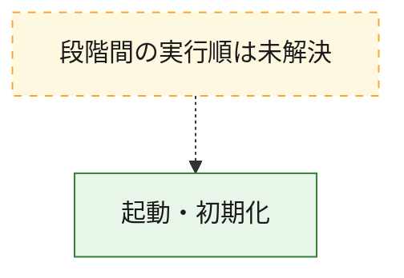
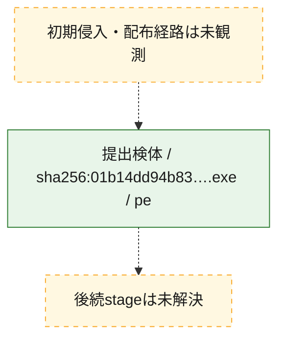
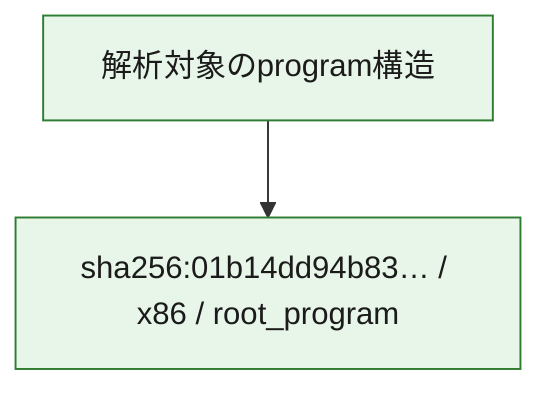

# 全体ロジック：01b14dd94b830351164ba0ca558b5534e0741b1631b6603d20096776dea34841

代表関数の静的証跡から、起動・初期化の処理群を確認しました。

## 読み方

- phaseの掲載順は解析上の整理順です。observed_call_edgesがない段階間の実行順を断定しません。
- 図の実線は静的に観測した関係、点線と黄色のノードは未観測・未解決の関係を示します。
- 図は静的な要約であり、動的実行を再現するものではありません。
- 詳細な関数解説とfingerprintは[STATIC-LOGIC.md](STATIC-LOGIC.md)を参照してください。

## 静的可視化

### 実行フロー

### 感染チェーン

### モジュール関係

## 処理段階

### 1. 起動・初期化

entry pointから初期化と後続処理への移行を確認します。
確度: `confirmed_static_function_evidence`

- `01b14dd94b830351164ba0ca558b5534e0741b1631b6603d20096776dea34841:ghidra:0041181c` — 初期化と主要処理への分岐を行う入口関数です。 状態: `succeeded`、選定理由: `entry_point`, `large_function:instructions=149`, `meaningful_symbol_name`, `reviewed_call_centrality:18`, `role:entrypoint`, `small_program_complete_context`

## 観測したcall関係

- `ghidra-function:38f084e8c3d06533450d5787` → `ghidra-external:1a0053b30812972415919996` （`unclassified` → `unclassified`）
- `ghidra-function:38f084e8c3d06533450d5787` → `ghidra-external:2a0be2367f720a566f2aaa21` （`unclassified` → `unclassified`）
- `ghidra-function:38f084e8c3d06533450d5787` → `ghidra-external:354925232221d6d700b17871` （`unclassified` → `unclassified`）
- `ghidra-function:38f084e8c3d06533450d5787` → `ghidra-external:373040a45e552691709f0ce2` （`unclassified` → `unclassified`）
- `ghidra-function:38f084e8c3d06533450d5787` → `ghidra-external:3da732fbcb912828fbe36503` （`unclassified` → `unclassified`）
- `ghidra-function:38f084e8c3d06533450d5787` → `ghidra-external:54ad1dd81d4362c1980e29d4` （`unclassified` → `unclassified`）
- `ghidra-function:38f084e8c3d06533450d5787` → `ghidra-external:574a5b862293ec108ba3b341` （`unclassified` → `unclassified`）
- `ghidra-function:38f084e8c3d06533450d5787` → `ghidra-external:6cfda18d1e245e5a23c7e897` （`unclassified` → `unclassified`）
- `ghidra-function:38f084e8c3d06533450d5787` → `ghidra-external:81f304db82a10859ad87a3c2` （`unclassified` → `unclassified`）
- `ghidra-function:38f084e8c3d06533450d5787` → `ghidra-external:8740997f8bcfd4f1ba74d313` （`unclassified` → `unclassified`）
- `ghidra-function:38f084e8c3d06533450d5787` → `ghidra-external:a4fbd995b2ff7a7a310fcb9c` （`unclassified` → `unclassified`）
- `ghidra-function:38f084e8c3d06533450d5787` → `ghidra-external:a86035b5a222ba015e577ced` （`unclassified` → `unclassified`）
- `ghidra-function:38f084e8c3d06533450d5787` → `ghidra-external:aa8cb251c22674411b39b2b5` （`unclassified` → `unclassified`）
- `ghidra-function:38f084e8c3d06533450d5787` → `ghidra-external:cad6d86d1f46c335b1376f22` （`unclassified` → `unclassified`）
- `ghidra-function:38f084e8c3d06533450d5787` → `ghidra-external:cd3d47d50e0ad4482f8a66b9` （`unclassified` → `unclassified`）
- `ghidra-function:38f084e8c3d06533450d5787` → `ghidra-external:d3aa3ba75915eba46709ea95` （`unclassified` → `unclassified`）
- `ghidra-function:38f084e8c3d06533450d5787` → `ghidra-external:dce254366e860dced916704c` （`unclassified` → `unclassified`）
- `ghidra-function:38f084e8c3d06533450d5787` → `ghidra-external:e2550a9a8ba959cd4b4cd82a` （`unclassified` → `unclassified`）

## 解析範囲と制約

- 選定外関数は全体inventoryへ残しますが、関数本体の個別解説対象にはしていません。
- indirect call、難読化、packer、VM、壊れたcontrol flowによりcall関係が欠落する場合があります。
- 文書は静的解析に基づき、検体実行や外部通信による動的確認は行っていません。
