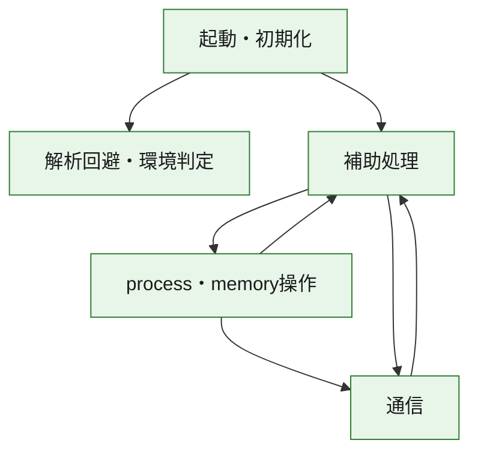
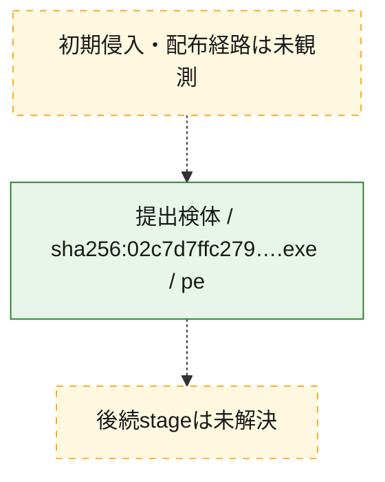
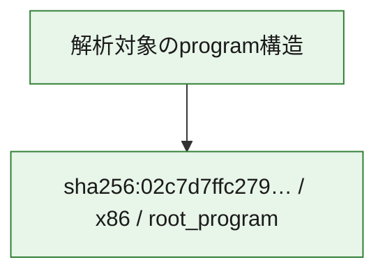

# 全体ロジック：02c7d7ffc279d2d791fac163ce8252bfb9f4fff406266fb69a4d381ab6e315e4

代表関数の静的証跡から、起動・初期化、解析回避・環境判定、process・memory操作、通信の処理群を確認しました。

## 読み方

- phaseの掲載順は解析上の整理順です。observed_call_edgesがない段階間の実行順を断定しません。
- 図の実線は静的に観測した関係、点線と黄色のノードは未観測・未解決の関係を示します。
- 図は静的な要約であり、動的実行を再現するものではありません。
- 詳細な関数解説とfingerprintは[STATIC-LOGIC.md](STATIC-LOGIC.md)を参照してください。

## 静的可視化

### 実行フロー

### 感染チェーン

### モジュール関係

## 処理段階

### 1. 起動・初期化

entry pointから初期化と後続処理への移行を確認します。
確度: `confirmed_static_function_evidence`

- `02c7d7ffc279d2d791fac163ce8252bfb9f4fff406266fb69a4d381ab6e315e4:ghidra:00402b07` — 初期化と主要処理への分岐を行う入口関数です。 状態: `succeeded`、選定理由: `call_graph_centrality:in=0,out=2`, `entry_point`, `meaningful_symbol_name`, `reviewed_call_centrality:2`, `role:entrypoint`, `small_program_complete_context`

### 2. 解析回避・環境判定

debugger、sandbox、仮想環境、時間差などの判定を確認します。
確度: `confirmed_static_function_evidence`

- `02c7d7ffc279d2d791fac163ce8252bfb9f4fff406266fb69a4d381ab6e315e4:ghidra:00402e88` — debugger、仮想環境、sandbox、または時間差の確認に関係する関数です。 状態: `succeeded`、選定理由: `call_graph_centrality:in=1,out=5`, `reviewed_call_centrality:11`, `reviewed_call_centrality:6`, `role:anti_analysis`, `small_program_complete_context`

### 3. process・memory操作

process、thread、module、memory操作と実行移行を確認します。
確度: `confirmed_static_function_evidence`

- `02c7d7ffc279d2d791fac163ce8252bfb9f4fff406266fb69a4d381ab6e315e4:ghidra:00402430` — process、thread、module、またはmemory操作に関係する関数です。 状態: `succeeded`、選定理由: `call_graph_centrality:in=0,out=17`, `large_function:instructions=155`, `reviewed_call_centrality:17`, `reviewed_call_centrality:26`, `role:process_or_memory_operation`, `small_program_complete_context`
- `02c7d7ffc279d2d791fac163ce8252bfb9f4fff406266fb69a4d381ab6e315e4:ghidra:00402690` — process、thread、module、またはmemory操作に関係する関数です。 状態: `succeeded`、選定理由: `call_graph_centrality:in=1,out=12`, `large_function:instructions=68`, `reviewed_call_centrality:14`, `reviewed_call_centrality:23`, `role:process_or_memory_operation`, `small_program_complete_context`

### 4. 通信

通信初期化、endpoint処理、送受信の役割を確認します。
確度: `confirmed_static_function_evidence`

- `02c7d7ffc279d2d791fac163ce8252bfb9f4fff406266fb69a4d381ab6e315e4:ghidra:004010d0` — 通信初期化、送受信、またはendpoint処理に関係する関数です。 状態: `succeeded`、選定理由: `call_graph_centrality:in=1,out=4`, `reviewed_call_centrality:5`, `reviewed_call_centrality:6`, `role:network_communication`, `small_program_complete_context`
- `02c7d7ffc279d2d791fac163ce8252bfb9f4fff406266fb69a4d381ab6e315e4:ghidra:00401150` — 通信初期化、送受信、またはendpoint処理に関係する関数です。 状態: `succeeded`、選定理由: `call_graph_centrality:in=1,out=2`, `reviewed_call_centrality:3`, `reviewed_call_centrality:5`, `role:network_communication`, `small_program_complete_context`
- `02c7d7ffc279d2d791fac163ce8252bfb9f4fff406266fb69a4d381ab6e315e4:ghidra:00401190` — 通信初期化、送受信、またはendpoint処理に関係する関数です。 状態: `succeeded`、選定理由: `call_graph_centrality:in=1,out=2`, `reviewed_call_centrality:4`, `role:network_communication`, `small_program_complete_context`
- `02c7d7ffc279d2d791fac163ce8252bfb9f4fff406266fb69a4d381ab6e315e4:ghidra:00401470` — 通信初期化、送受信、またはendpoint処理に関係する関数です。 状態: `succeeded`、選定理由: `call_graph_centrality:in=2,out=2`, `reviewed_call_centrality:4`, `reviewed_call_centrality:6`, `role:network_communication`, `small_program_complete_context`
- `02c7d7ffc279d2d791fac163ce8252bfb9f4fff406266fb69a4d381ab6e315e4:ghidra:00401710` — 通信初期化、送受信、またはendpoint処理に関係する関数です。 状態: `succeeded`、選定理由: `call_graph_centrality:in=1,out=4`, `reviewed_call_centrality:5`, `reviewed_call_centrality:8`, `role:network_communication`, `small_program_complete_context`
- `02c7d7ffc279d2d791fac163ce8252bfb9f4fff406266fb69a4d381ab6e315e4:ghidra:00401790` — 通信初期化、送受信、またはendpoint処理に関係する関数です。 状態: `succeeded`、選定理由: `call_graph_centrality:in=1,out=4`, `reviewed_call_centrality:6`, `role:network_communication`, `small_program_complete_context`
- `02c7d7ffc279d2d791fac163ce8252bfb9f4fff406266fb69a4d381ab6e315e4:ghidra:00401800` — 通信初期化、送受信、またはendpoint処理に関係する関数です。 状態: `succeeded`、選定理由: `call_graph_centrality:in=1,out=7`, `large_function:instructions=71`, `reviewed_call_centrality:13`, `reviewed_call_centrality:8`, `role:network_communication`, `small_program_complete_context`
- `02c7d7ffc279d2d791fac163ce8252bfb9f4fff406266fb69a4d381ab6e315e4:ghidra:00401900` — 通信初期化、送受信、またはendpoint処理に関係する関数です。 状態: `succeeded`、選定理由: `call_graph_centrality:in=1,out=8`, `large_function:instructions=86`, `reviewed_call_centrality:16`, `reviewed_call_centrality:9`, `role:network_communication`, `small_program_complete_context`
- `02c7d7ffc279d2d791fac163ce8252bfb9f4fff406266fb69a4d381ab6e315e4:ghidra:00401a10` — 通信初期化、送受信、またはendpoint処理に関係する関数です。 状態: `succeeded`、選定理由: `call_graph_centrality:in=1,out=20`, `large_function:instructions=595`, `reviewed_call_centrality:28`, `reviewed_call_centrality:29`, `role:network_communication`, `small_program_complete_context`

### 5. 補助処理

主要処理を支える一般内部関数またはlibrary処理を確認します。
確度: `confirmed_static_function_evidence`

- `02c7d7ffc279d2d791fac163ce8252bfb9f4fff406266fb69a4d381ab6e315e4:ghidra:00401000` — 検体内部の一般処理を実装する関数です。 状態: `succeeded`、選定理由: `call_graph_centrality:in=1,out=1`, `reviewed_call_centrality:2`, `small_program_complete_context`
- `02c7d7ffc279d2d791fac163ce8252bfb9f4fff406266fb69a4d381ab6e315e4:ghidra:00401030` — 検体内部の一般処理を実装する関数です。 状態: `succeeded`、選定理由: `call_graph_centrality:in=1,out=1`, `reviewed_call_centrality:2`, `small_program_complete_context`
- `02c7d7ffc279d2d791fac163ce8252bfb9f4fff406266fb69a4d381ab6e315e4:ghidra:004011f0` — 検体内部の一般処理を実装する関数です。 状態: `succeeded`、選定理由: `call_graph_centrality:in=1,out=1`, `reviewed_call_centrality:2`, `reviewed_call_centrality:3`, `small_program_complete_context`
- `02c7d7ffc279d2d791fac163ce8252bfb9f4fff406266fb69a4d381ab6e315e4:ghidra:00401260` — 検体内部の一般処理を実装する関数です。 状態: `succeeded`、選定理由: `call_graph_centrality:in=1,out=1`, `large_function:instructions=65`, `reviewed_call_centrality:3`, `small_program_complete_context`
- `02c7d7ffc279d2d791fac163ce8252bfb9f4fff406266fb69a4d381ab6e315e4:ghidra:00401350` — 検体内部の一般処理を実装する関数です。 状態: `succeeded`、選定理由: `call_graph_centrality:in=1,out=4`, `reviewed_call_centrality:5`, `reviewed_call_centrality:6`, `small_program_complete_context`
- `02c7d7ffc279d2d791fac163ce8252bfb9f4fff406266fb69a4d381ab6e315e4:ghidra:004013c0` — 検体内部の一般処理を実装する関数です。 状態: `succeeded`、選定理由: `call_graph_centrality:in=1,out=1`, `reviewed_call_centrality:2`, `small_program_complete_context`
- `02c7d7ffc279d2d791fac163ce8252bfb9f4fff406266fb69a4d381ab6e315e4:ghidra:00401430` — 検体内部の一般処理を実装する関数です。 状態: `succeeded`、選定理由: `call_graph_centrality:in=2,out=0`, `reviewed_call_centrality:2`, `small_program_complete_context`
- `02c7d7ffc279d2d791fac163ce8252bfb9f4fff406266fb69a4d381ab6e315e4:ghidra:004014c0` — 検体内部の一般処理を実装する関数です。 状態: `succeeded`、選定理由: `call_graph_centrality:in=1,out=5`, `large_function:instructions=156`, `reviewed_call_centrality:11`, `reviewed_call_centrality:6`, `small_program_complete_context`
- `02c7d7ffc279d2d791fac163ce8252bfb9f4fff406266fb69a4d381ab6e315e4:ghidra:004018e0` — 検体内部の一般処理を実装する関数です。 状態: `succeeded`、選定理由: `call_graph_centrality:in=2,out=1`, `reviewed_call_centrality:3`, `small_program_complete_context`
- `02c7d7ffc279d2d791fac163ce8252bfb9f4fff406266fb69a4d381ab6e315e4:ghidra:004022e0` — 検体内部の一般処理を実装する関数です。 状態: `succeeded`、選定理由: `call_graph_centrality:in=1,out=1`, `reviewed_call_centrality:2`, `small_program_complete_context`
- `02c7d7ffc279d2d791fac163ce8252bfb9f4fff406266fb69a4d381ab6e315e4:ghidra:00402300` — 検体内部の一般処理を実装する関数です。 状態: `succeeded`、選定理由: `call_graph_centrality:in=0,out=12`, `large_function:instructions=77`, `reviewed_call_centrality:12`, `reviewed_call_centrality:14`, `small_program_complete_context`
- `02c7d7ffc279d2d791fac163ce8252bfb9f4fff406266fb69a4d381ab6e315e4:ghidra:00402847` — 検体内部の一般処理を実装する関数です。 状態: `succeeded`、選定理由: `call_graph_centrality:in=1,out=14`, `large_function:instructions=136`, `reviewed_call_centrality:15`, `reviewed_call_centrality:22`, `small_program_complete_context`
- `02c7d7ffc279d2d791fac163ce8252bfb9f4fff406266fb69a4d381ab6e315e4:ghidra:00402c80` — 検体内部の一般処理を実装する関数です。 状態: `succeeded`、選定理由: `call_graph_centrality:in=1,out=0`, `reviewed_call_centrality:1`, `small_program_complete_context`
- `02c7d7ffc279d2d791fac163ce8252bfb9f4fff406266fb69a4d381ab6e315e4:ghidra:00402cc0` — 検体内部の一般処理を実装する関数です。 状態: `succeeded`、選定理由: `call_graph_centrality:in=1,out=0`, `reviewed_call_centrality:1`, `small_program_complete_context`
- `02c7d7ffc279d2d791fac163ce8252bfb9f4fff406266fb69a4d381ab6e315e4:ghidra:00402d10` — 検体内部の一般処理を実装する関数です。 状態: `succeeded`、選定理由: `call_graph_centrality:in=1,out=2`, `reviewed_call_centrality:3`, `reviewed_call_centrality:4`, `small_program_complete_context`
- `02c7d7ffc279d2d791fac163ce8252bfb9f4fff406266fb69a4d381ab6e315e4:ghidra:00402ddc` — 検体内部の一般処理を実装する関数です。 状態: `succeeded`、選定理由: `call_graph_centrality:in=1,out=0`, `reviewed_call_centrality:1`, `small_program_complete_context`
- `02c7d7ffc279d2d791fac163ce8252bfb9f4fff406266fb69a4d381ab6e315e4:ghidra:00402e21` — compiler生成処理または汎用library処理とみられる関数です。 状態: `succeeded`、選定理由: `call_graph_centrality:in=1,out=0`, `meaningful_symbol_name`, `reviewed_call_centrality:1`, `small_program_complete_context`
- `02c7d7ffc279d2d791fac163ce8252bfb9f4fff406266fb69a4d381ab6e315e4:ghidra:00402e35` — 検体内部の一般処理を実装する関数です。 状態: `succeeded`、選定理由: `call_graph_centrality:in=0,out=1`, `reviewed_call_centrality:1`, `small_program_complete_context`

## 観測したcall関係

- `02c7d7ffc279d2d791fac163ce8252bfb9f4fff406266fb69a4d381ab6e315e4:ghidra:004010d0` → `02c7d7ffc279d2d791fac163ce8252bfb9f4fff406266fb69a4d381ab6e315e4:ghidra:00401470` （`communication` → `communication`）
- `02c7d7ffc279d2d791fac163ce8252bfb9f4fff406266fb69a4d381ab6e315e4:ghidra:00401190` → `02c7d7ffc279d2d791fac163ce8252bfb9f4fff406266fb69a4d381ab6e315e4:ghidra:00401260` （`communication` → `support`）
- `02c7d7ffc279d2d791fac163ce8252bfb9f4fff406266fb69a4d381ab6e315e4:ghidra:00401710` → `02c7d7ffc279d2d791fac163ce8252bfb9f4fff406266fb69a4d381ab6e315e4:ghidra:00401470` （`communication` → `communication`）
- `02c7d7ffc279d2d791fac163ce8252bfb9f4fff406266fb69a4d381ab6e315e4:ghidra:00401790` → `02c7d7ffc279d2d791fac163ce8252bfb9f4fff406266fb69a4d381ab6e315e4:ghidra:00401710` （`communication` → `communication`）
- `02c7d7ffc279d2d791fac163ce8252bfb9f4fff406266fb69a4d381ab6e315e4:ghidra:00401800` → `02c7d7ffc279d2d791fac163ce8252bfb9f4fff406266fb69a4d381ab6e315e4:ghidra:00401430` （`communication` → `support`）
- `02c7d7ffc279d2d791fac163ce8252bfb9f4fff406266fb69a4d381ab6e315e4:ghidra:00401800` → `02c7d7ffc279d2d791fac163ce8252bfb9f4fff406266fb69a4d381ab6e315e4:ghidra:004018e0` （`communication` → `support`）
- `02c7d7ffc279d2d791fac163ce8252bfb9f4fff406266fb69a4d381ab6e315e4:ghidra:00401a10` → `02c7d7ffc279d2d791fac163ce8252bfb9f4fff406266fb69a4d381ab6e315e4:ghidra:004010d0` （`communication` → `communication`）
- `02c7d7ffc279d2d791fac163ce8252bfb9f4fff406266fb69a4d381ab6e315e4:ghidra:00401a10` → `02c7d7ffc279d2d791fac163ce8252bfb9f4fff406266fb69a4d381ab6e315e4:ghidra:00401150` （`communication` → `communication`）
- `02c7d7ffc279d2d791fac163ce8252bfb9f4fff406266fb69a4d381ab6e315e4:ghidra:00401a10` → `02c7d7ffc279d2d791fac163ce8252bfb9f4fff406266fb69a4d381ab6e315e4:ghidra:00401190` （`communication` → `communication`）
- `02c7d7ffc279d2d791fac163ce8252bfb9f4fff406266fb69a4d381ab6e315e4:ghidra:00401a10` → `02c7d7ffc279d2d791fac163ce8252bfb9f4fff406266fb69a4d381ab6e315e4:ghidra:004011f0` （`communication` → `support`）
- `02c7d7ffc279d2d791fac163ce8252bfb9f4fff406266fb69a4d381ab6e315e4:ghidra:00401a10` → `02c7d7ffc279d2d791fac163ce8252bfb9f4fff406266fb69a4d381ab6e315e4:ghidra:00401350` （`communication` → `support`）
- `02c7d7ffc279d2d791fac163ce8252bfb9f4fff406266fb69a4d381ab6e315e4:ghidra:00401a10` → `02c7d7ffc279d2d791fac163ce8252bfb9f4fff406266fb69a4d381ab6e315e4:ghidra:004013c0` （`communication` → `support`）
- `02c7d7ffc279d2d791fac163ce8252bfb9f4fff406266fb69a4d381ab6e315e4:ghidra:00401a10` → `02c7d7ffc279d2d791fac163ce8252bfb9f4fff406266fb69a4d381ab6e315e4:ghidra:004014c0` （`communication` → `support`）
- `02c7d7ffc279d2d791fac163ce8252bfb9f4fff406266fb69a4d381ab6e315e4:ghidra:00401a10` → `02c7d7ffc279d2d791fac163ce8252bfb9f4fff406266fb69a4d381ab6e315e4:ghidra:004022e0` （`communication` → `support`）
- `02c7d7ffc279d2d791fac163ce8252bfb9f4fff406266fb69a4d381ab6e315e4:ghidra:00402300` → `02c7d7ffc279d2d791fac163ce8252bfb9f4fff406266fb69a4d381ab6e315e4:ghidra:00401430` （`support` → `support`）
- `02c7d7ffc279d2d791fac163ce8252bfb9f4fff406266fb69a4d381ab6e315e4:ghidra:00402300` → `02c7d7ffc279d2d791fac163ce8252bfb9f4fff406266fb69a4d381ab6e315e4:ghidra:004018e0` （`support` → `support`）
- `02c7d7ffc279d2d791fac163ce8252bfb9f4fff406266fb69a4d381ab6e315e4:ghidra:00402300` → `02c7d7ffc279d2d791fac163ce8252bfb9f4fff406266fb69a4d381ab6e315e4:ghidra:00401a10` （`support` → `communication`）
- `02c7d7ffc279d2d791fac163ce8252bfb9f4fff406266fb69a4d381ab6e315e4:ghidra:00402430` → `02c7d7ffc279d2d791fac163ce8252bfb9f4fff406266fb69a4d381ab6e315e4:ghidra:00401000` （`execution` → `support`）
- `02c7d7ffc279d2d791fac163ce8252bfb9f4fff406266fb69a4d381ab6e315e4:ghidra:00402430` → `02c7d7ffc279d2d791fac163ce8252bfb9f4fff406266fb69a4d381ab6e315e4:ghidra:00401800` （`execution` → `communication`）
- `02c7d7ffc279d2d791fac163ce8252bfb9f4fff406266fb69a4d381ab6e315e4:ghidra:00402430` → `02c7d7ffc279d2d791fac163ce8252bfb9f4fff406266fb69a4d381ab6e315e4:ghidra:00401900` （`execution` → `communication`）
- `02c7d7ffc279d2d791fac163ce8252bfb9f4fff406266fb69a4d381ab6e315e4:ghidra:00402690` → `02c7d7ffc279d2d791fac163ce8252bfb9f4fff406266fb69a4d381ab6e315e4:ghidra:00401030` （`execution` → `support`）
- `02c7d7ffc279d2d791fac163ce8252bfb9f4fff406266fb69a4d381ab6e315e4:ghidra:00402690` → `02c7d7ffc279d2d791fac163ce8252bfb9f4fff406266fb69a4d381ab6e315e4:ghidra:00401790` （`execution` → `communication`）
- `02c7d7ffc279d2d791fac163ce8252bfb9f4fff406266fb69a4d381ab6e315e4:ghidra:00402847` → `02c7d7ffc279d2d791fac163ce8252bfb9f4fff406266fb69a4d381ab6e315e4:ghidra:00402690` （`support` → `execution`）
- `02c7d7ffc279d2d791fac163ce8252bfb9f4fff406266fb69a4d381ab6e315e4:ghidra:00402847` → `02c7d7ffc279d2d791fac163ce8252bfb9f4fff406266fb69a4d381ab6e315e4:ghidra:00402d10` （`support` → `support`）
- `02c7d7ffc279d2d791fac163ce8252bfb9f4fff406266fb69a4d381ab6e315e4:ghidra:00402847` → `02c7d7ffc279d2d791fac163ce8252bfb9f4fff406266fb69a4d381ab6e315e4:ghidra:00402ddc` （`support` → `support`）
- `02c7d7ffc279d2d791fac163ce8252bfb9f4fff406266fb69a4d381ab6e315e4:ghidra:00402847` → `02c7d7ffc279d2d791fac163ce8252bfb9f4fff406266fb69a4d381ab6e315e4:ghidra:00402e21` （`support` → `support`）
- `02c7d7ffc279d2d791fac163ce8252bfb9f4fff406266fb69a4d381ab6e315e4:ghidra:00402b07` → `02c7d7ffc279d2d791fac163ce8252bfb9f4fff406266fb69a4d381ab6e315e4:ghidra:00402847` （`startup` → `support`）
- `02c7d7ffc279d2d791fac163ce8252bfb9f4fff406266fb69a4d381ab6e315e4:ghidra:00402b07` → `02c7d7ffc279d2d791fac163ce8252bfb9f4fff406266fb69a4d381ab6e315e4:ghidra:00402e88` （`startup` → `evasion`）
- `02c7d7ffc279d2d791fac163ce8252bfb9f4fff406266fb69a4d381ab6e315e4:ghidra:00402d10` → `02c7d7ffc279d2d791fac163ce8252bfb9f4fff406266fb69a4d381ab6e315e4:ghidra:00402c80` （`support` → `support`）
- `02c7d7ffc279d2d791fac163ce8252bfb9f4fff406266fb69a4d381ab6e315e4:ghidra:00402d10` → `02c7d7ffc279d2d791fac163ce8252bfb9f4fff406266fb69a4d381ab6e315e4:ghidra:00402cc0` （`support` → `support`）
- `ghidra-function:006d6d40cba847a1a558098c` → `ghidra-function:1bd4b2ba8a396b0fe29a8ec2` （`unclassified` → `unclassified`）
- `ghidra-function:006d6d40cba847a1a558098c` → `ghidra-function:257b0646b55f59a199b51d2e` （`unclassified` → `unclassified`）
- `ghidra-function:006d6d40cba847a1a558098c` → `ghidra-function:45b6927c92eecb1a2ddb6296` （`unclassified` → `unclassified`）
- `ghidra-function:006d6d40cba847a1a558098c` → `ghidra-function:4813a2b1d494fff22be4ab87` （`unclassified` → `unclassified`）
- `ghidra-function:006d6d40cba847a1a558098c` → `ghidra-function:87194c95d74f52c8a0bbc129` （`unclassified` → `unclassified`）
- `ghidra-function:006d6d40cba847a1a558098c` → `ghidra-function:a87a02c527e4d8a6184dad10` （`unclassified` → `unclassified`）
- `ghidra-function:006d6d40cba847a1a558098c` → `ghidra-function:c17d26d8efb80d127042d5ec` （`unclassified` → `unclassified`）
- `ghidra-function:1bf4343602c6570901bd9e9a` → `ghidra-function:006d6d40cba847a1a558098c` （`unclassified` → `unclassified`）
- `ghidra-function:1bf4343602c6570901bd9e9a` → `ghidra-function:0153b3dc5c37779db0cb0f1a` （`unclassified` → `unclassified`）
- `ghidra-function:1bf4343602c6570901bd9e9a` → `ghidra-function:14aacf234543b158efe7f394` （`unclassified` → `unclassified`）
- `ghidra-function:1bf4343602c6570901bd9e9a` → `ghidra-function:46ce094037a53677c96442c4` （`unclassified` → `unclassified`）
- `ghidra-function:1bf4343602c6570901bd9e9a` → `ghidra-function:581027b180fb3303b6c2ef46` （`unclassified` → `unclassified`）
- `ghidra-function:1bf4343602c6570901bd9e9a` → `ghidra-function:584b2b269f8d6f5d5ef592cf` （`unclassified` → `unclassified`）
- `ghidra-function:1bf4343602c6570901bd9e9a` → `ghidra-function:5989dfb2c15e9cf99cdc1680` （`unclassified` → `unclassified`）
- `ghidra-function:1bf4343602c6570901bd9e9a` → `ghidra-function:5bd2b466a53762f85f4c77f6` （`unclassified` → `unclassified`）
- `ghidra-function:1bf4343602c6570901bd9e9a` → `ghidra-function:5fa4fe6357986f9963bed75f` （`unclassified` → `unclassified`）
- `ghidra-function:1bf4343602c6570901bd9e9a` → `ghidra-function:8c521febc421befe41a56b9b` （`unclassified` → `unclassified`）
- `ghidra-function:1bf4343602c6570901bd9e9a` → `ghidra-function:a13afb5ac95908749d713246` （`unclassified` → `unclassified`）
- `ghidra-function:1bf4343602c6570901bd9e9a` → `ghidra-function:a3e7d958324d8ca4f63ae2d5` （`unclassified` → `unclassified`）
- `ghidra-function:1bf4343602c6570901bd9e9a` → `ghidra-function:a9b27b4a020b4506fd175cca` （`unclassified` → `unclassified`）
- `ghidra-function:1bf4343602c6570901bd9e9a` → `ghidra-function:b567bbfa6a54f75e0df87207` （`unclassified` → `unclassified`）
- `ghidra-function:1bf4343602c6570901bd9e9a` → `ghidra-function:ba44ded6f13eb0ae84835f8c` （`unclassified` → `unclassified`）
- `ghidra-function:1bf4343602c6570901bd9e9a` → `ghidra-function:c29362b3afbd6b0f4981cde0` （`unclassified` → `unclassified`）
- `ghidra-function:1bf4343602c6570901bd9e9a` → `ghidra-function:f90cbc07e447858b685747cf` （`unclassified` → `unclassified`）
- `ghidra-function:1cb88227dd7496ea7e2419c0` → `ghidra-function:cd35328967fee321b509462b` （`unclassified` → `unclassified`）
- `ghidra-function:1cb88227dd7496ea7e2419c0` → `ghidra-function:f22ff641e91d49fdf330b7b7` （`unclassified` → `unclassified`）
- `ghidra-function:257b0646b55f59a199b51d2e` → `ghidra-function:27ce6f78b36f400678bbf7bf` （`unclassified` → `unclassified`）
- `ghidra-function:258dc3487aaa2779ecfdac40` → `ghidra-function:4b4e730123da0d37d6569e7e` （`unclassified` → `unclassified`）
- `ghidra-function:258dc3487aaa2779ecfdac40` → `ghidra-function:6443aed5f4efc78506a784fe` （`unclassified` → `unclassified`）
- `ghidra-function:269f8ecbe4c98545021e6425` → `ghidra-external:d804cfaf09caaf393958366b` （`unclassified` → `unclassified`）
- `ghidra-function:269f8ecbe4c98545021e6425` → `ghidra-function:55ff16e8f9fa6174a348f2b4` （`unclassified` → `unclassified`）
- `ghidra-function:269f8ecbe4c98545021e6425` → `ghidra-function:a32c9f5250d0fc11b751cc28` （`unclassified` → `unclassified`）
- `ghidra-function:394d3314b25eda9c3c7741f9` → `ghidra-function:6cba44efaff5c1c0fce7230b` （`unclassified` → `unclassified`）
- `ghidra-function:3c5cf10266620230489ed72a` → `ghidra-function:584b2b269f8d6f5d5ef592cf` （`unclassified` → `unclassified`）
- `ghidra-function:51e836887cf51452799c1318` → `ghidra-external:d804cfaf09caaf393958366b` （`unclassified` → `unclassified`）
- `ghidra-function:51e836887cf51452799c1318` → `ghidra-function:71860c414b78361c39f12031` （`unclassified` → `unclassified`）
- `ghidra-function:51e836887cf51452799c1318` → `ghidra-function:f49d5aa9a447dd9e4babab5e` （`unclassified` → `unclassified`）
- `ghidra-function:5f21753dd1cbfa6834ca8cac` → `ghidra-function:41fd05ea5a3a2fdca9ad1a9b` （`unclassified` → `unclassified`）
- `ghidra-function:68a376dea9881d649fdd8b19` → `ghidra-function:258dc3487aaa2779ecfdac40` （`unclassified` → `unclassified`）
- `ghidra-function:68a376dea9881d649fdd8b19` → `ghidra-function:791081a37484d8608e18cce6` （`unclassified` → `unclassified`）
- `ghidra-function:68a376dea9881d649fdd8b19` → `ghidra-function:8234a2f660c9047d57a6da7c` （`unclassified` → `unclassified`）
- `ghidra-function:68a376dea9881d649fdd8b19` → `ghidra-function:be1b134298b752f05f8e8a8b` （`unclassified` → `unclassified`）
- `ghidra-function:6da528f34223e1429317ba11` → `ghidra-external:b9d7fb3fa5cb1b6a4c60d998` （`unclassified` → `unclassified`）
- `ghidra-function:6da528f34223e1429317ba11` → `ghidra-function:0153b3dc5c37779db0cb0f1a` （`unclassified` → `unclassified`）
- `ghidra-function:6da528f34223e1429317ba11` → `ghidra-function:1ce970648eb27decdd37701b` （`unclassified` → `unclassified`）
- `ghidra-function:6da528f34223e1429317ba11` → `ghidra-function:36c25022b824a0597780fc82` （`unclassified` → `unclassified`）
- `ghidra-function:6da528f34223e1429317ba11` → `ghidra-function:4813a2b1d494fff22be4ab87` （`unclassified` → `unclassified`）
- `ghidra-function:6da528f34223e1429317ba11` → `ghidra-function:581027b180fb3303b6c2ef46` （`unclassified` → `unclassified`）
- `ghidra-function:6da528f34223e1429317ba11` → `ghidra-function:5bd2b466a53762f85f4c77f6` （`unclassified` → `unclassified`）
- `ghidra-function:6da528f34223e1429317ba11` → `ghidra-function:5f21753dd1cbfa6834ca8cac` （`unclassified` → `unclassified`）
- `ghidra-function:6da528f34223e1429317ba11` → `ghidra-function:a13afb5ac95908749d713246` （`unclassified` → `unclassified`）
- `ghidra-function:6da528f34223e1429317ba11` → `ghidra-function:c6538cdff7d65e1b18e67b93` （`unclassified` → `unclassified`）
- `ghidra-function:6da528f34223e1429317ba11` → `ghidra-function:efc49bb25e4be9d77c88d847` （`unclassified` → `unclassified`）
- `ghidra-function:6da528f34223e1429317ba11` → `ghidra-function:f7934aceb1ead6ed814fd2bf` （`unclassified` → `unclassified`）
- `ghidra-function:6da528f34223e1429317ba11` → `ghidra-function:f90cbc07e447858b685747cf` （`unclassified` → `unclassified`）
- `ghidra-function:8a4f64f23158c9131a7f20a1` → `ghidra-function:4813a2b1d494fff22be4ab87` （`unclassified` → `unclassified`）
- `ghidra-function:8a4f64f23158c9131a7f20a1` → `ghidra-function:4e48777e3b2948287f5ec182` （`unclassified` → `unclassified`）
- `ghidra-function:8a4f64f23158c9131a7f20a1` → `ghidra-function:69ec4eb5e8eeb935a41a0219` （`unclassified` → `unclassified`）
- `ghidra-function:8a4f64f23158c9131a7f20a1` → `ghidra-function:b494ac8cd7669ce2c0a7edc0` （`unclassified` → `unclassified`）
- `ghidra-function:8a4f64f23158c9131a7f20a1` → `ghidra-function:ec511b6d36c81bdcad21bf37` （`unclassified` → `unclassified`）
- `ghidra-function:97fa26e6d087c772e7b42ca4` → `ghidra-external:6dbf87a15bd9eef53a9b743e` （`unclassified` → `unclassified`）
- `ghidra-function:97fa26e6d087c772e7b42ca4` → `ghidra-external:794db22e1720c79617f9ff75` （`unclassified` → `unclassified`）
- `ghidra-function:97fa26e6d087c772e7b42ca4` → `ghidra-external:d804cfaf09caaf393958366b` （`unclassified` → `unclassified`）
- `ghidra-function:97fa26e6d087c772e7b42ca4` → `ghidra-external:daa0d98eb2ce792fa8e50e61` （`unclassified` → `unclassified`）
- `ghidra-function:97fa26e6d087c772e7b42ca4` → `ghidra-external:dbf40ac230631f27a2f36ddb` （`unclassified` → `unclassified`）
- `ghidra-function:97fa26e6d087c772e7b42ca4` → `ghidra-external:dc2a153bf3929e1d026d6f45` （`unclassified` → `unclassified`）
- `ghidra-function:97fa26e6d087c772e7b42ca4` → `ghidra-external:e12d2be1758f2bfb8120db9e` （`unclassified` → `unclassified`）
- `ghidra-function:97fa26e6d087c772e7b42ca4` → `ghidra-function:0f00e88ed7755b314ad1e941` （`unclassified` → `unclassified`）
- `ghidra-function:97fa26e6d087c772e7b42ca4` → `ghidra-function:269f8ecbe4c98545021e6425` （`unclassified` → `unclassified`）
- `ghidra-function:97fa26e6d087c772e7b42ca4` → `ghidra-function:394d3314b25eda9c3c7741f9` （`unclassified` → `unclassified`）
- `ghidra-function:97fa26e6d087c772e7b42ca4` → `ghidra-function:3c5cf10266620230489ed72a` （`unclassified` → `unclassified`）
- `ghidra-function:97fa26e6d087c772e7b42ca4` → `ghidra-function:4359e23b189b729a48f5f0c8` （`unclassified` → `unclassified`）
- `ghidra-function:97fa26e6d087c772e7b42ca4` → `ghidra-function:4813a2b1d494fff22be4ab87` （`unclassified` → `unclassified`）
- `ghidra-function:97fa26e6d087c772e7b42ca4` → `ghidra-function:4bdcb00cb71804c77e6b64a7` （`unclassified` → `unclassified`）
- `ghidra-function:97fa26e6d087c772e7b42ca4` → `ghidra-function:52ed455db7a583d192c7d79a` （`unclassified` → `unclassified`）
- `ghidra-function:97fa26e6d087c772e7b42ca4` → `ghidra-function:581027b180fb3303b6c2ef46` （`unclassified` → `unclassified`）
- `ghidra-function:97fa26e6d087c772e7b42ca4` → `ghidra-function:584b2b269f8d6f5d5ef592cf` （`unclassified` → `unclassified`）
- `ghidra-function:97fa26e6d087c772e7b42ca4` → `ghidra-function:6371ae923277dc6b94322e54` （`unclassified` → `unclassified`）
- `ghidra-function:97fa26e6d087c772e7b42ca4` → `ghidra-function:68a376dea9881d649fdd8b19` （`unclassified` → `unclassified`）
- `ghidra-function:97fa26e6d087c772e7b42ca4` → `ghidra-function:8a4f64f23158c9131a7f20a1` （`unclassified` → `unclassified`）
- `ghidra-function:97fa26e6d087c772e7b42ca4` → `ghidra-function:b0d7e7d0f4c30547c7324db4` （`unclassified` → `unclassified`）
- `ghidra-function:97fa26e6d087c772e7b42ca4` → `ghidra-function:b567bbfa6a54f75e0df87207` （`unclassified` → `unclassified`）
- `ghidra-function:97fa26e6d087c772e7b42ca4` → `ghidra-function:cef83e258bc47ec09d1ea8ce` （`unclassified` → `unclassified`）
- `ghidra-function:97fa26e6d087c772e7b42ca4` → `ghidra-function:cf668cea60ba04e512a4de9a` （`unclassified` → `unclassified`）
- `ghidra-function:97fa26e6d087c772e7b42ca4` → `ghidra-function:eb01df6715eb574dba6f56dc` （`unclassified` → `unclassified`）
- `ghidra-function:97fa26e6d087c772e7b42ca4` → `ghidra-function:f2f828297d32c5fd98239345` （`unclassified` → `unclassified`）
- `ghidra-function:97fa26e6d087c772e7b42ca4` → `ghidra-function:fc8c8db156957cb7fa455137` （`unclassified` → `unclassified`）
- `ghidra-function:9ff9e09fa1b849ee35805698` → `ghidra-function:8b73560c383f331a49b4026a` （`unclassified` → `unclassified`）
- `ghidra-function:a32c9f5250d0fc11b751cc28` → `ghidra-external:b9d7fb3fa5cb1b6a4c60d998` （`unclassified` → `unclassified`）
- `ghidra-function:a32c9f5250d0fc11b751cc28` → `ghidra-function:0bb09f41f629a5b1724b6e35` （`unclassified` → `unclassified`）
- `ghidra-function:a3e7d958324d8ca4f63ae2d5` → `ghidra-function:130f0f163dbf389fc6271e88` （`unclassified` → `unclassified`）
- `ghidra-function:a3e7d958324d8ca4f63ae2d5` → `ghidra-function:271e1654c36768e2eeb3c1c0` （`unclassified` → `unclassified`）
- `ghidra-function:a3e7d958324d8ca4f63ae2d5` → `ghidra-function:462d71e2dc86f91f4f0cdad1` （`unclassified` → `unclassified`）
- `ghidra-function:a3e7d958324d8ca4f63ae2d5` → `ghidra-function:6371ae923277dc6b94322e54` （`unclassified` → `unclassified`）
- `ghidra-function:a3e7d958324d8ca4f63ae2d5` → `ghidra-function:a87a02c527e4d8a6184dad10` （`unclassified` → `unclassified`）
- `ghidra-function:a3e7d958324d8ca4f63ae2d5` → `ghidra-function:aa3a4feb8b785df6a5200414` （`unclassified` → `unclassified`）
- `ghidra-function:a3e7d958324d8ca4f63ae2d5` → `ghidra-function:c17d26d8efb80d127042d5ec` （`unclassified` → `unclassified`）
- `ghidra-function:a3e7d958324d8ca4f63ae2d5` → `ghidra-function:c70a63b1a6b14e710b6dc855` （`unclassified` → `unclassified`）
- `ghidra-function:a78b9f0cea870900bc9f8efd` → `ghidra-function:258dc3487aaa2779ecfdac40` （`unclassified` → `unclassified`）
- `ghidra-function:a78b9f0cea870900bc9f8efd` → `ghidra-function:4bdcb00cb71804c77e6b64a7` （`unclassified` → `unclassified`）
- `ghidra-function:a78b9f0cea870900bc9f8efd` → `ghidra-function:be1b134298b752f05f8e8a8b` （`unclassified` → `unclassified`）
- `ghidra-function:a78b9f0cea870900bc9f8efd` → `ghidra-function:f2f828297d32c5fd98239345` （`unclassified` → `unclassified`）
- `ghidra-function:b0d7e7d0f4c30547c7324db4` → `ghidra-function:0bd1dad55cb24e76beae3416` （`unclassified` → `unclassified`）
- `ghidra-function:b0d7e7d0f4c30547c7324db4` → `ghidra-function:4a8e561bfa95639fc7c53d44` （`unclassified` → `unclassified`）
- `ghidra-function:ba44ded6f13eb0ae84835f8c` → `ghidra-function:584b2b269f8d6f5d5ef592cf` （`unclassified` → `unclassified`）
- `ghidra-function:c6538cdff7d65e1b18e67b93` → `ghidra-external:d804cfaf09caaf393958366b` （`unclassified` → `unclassified`）
- `ghidra-function:c6538cdff7d65e1b18e67b93` → `ghidra-function:4359e23b189b729a48f5f0c8` （`unclassified` → `unclassified`）
- `ghidra-function:c6538cdff7d65e1b18e67b93` → `ghidra-function:791081a37484d8608e18cce6` （`unclassified` → `unclassified`）
- `ghidra-function:c6538cdff7d65e1b18e67b93` → `ghidra-function:8234a2f660c9047d57a6da7c` （`unclassified` → `unclassified`）
- `ghidra-function:c6538cdff7d65e1b18e67b93` → `ghidra-function:a78b9f0cea870900bc9f8efd` （`unclassified` → `unclassified`）
- `ghidra-function:c7f1cf506b2462f4aae3b988` → `ghidra-function:231513ef4dde159f37c48913` （`unclassified` → `unclassified`）
- `ghidra-function:c7f1cf506b2462f4aae3b988` → `ghidra-function:257b0646b55f59a199b51d2e` （`unclassified` → `unclassified`）
- `ghidra-function:c7f1cf506b2462f4aae3b988` → `ghidra-function:45b6927c92eecb1a2ddb6296` （`unclassified` → `unclassified`）
- `ghidra-function:c7f1cf506b2462f4aae3b988` → `ghidra-function:46ce094037a53677c96442c4` （`unclassified` → `unclassified`）
- `ghidra-function:c7f1cf506b2462f4aae3b988` → `ghidra-function:550324a0fcb2690c0ee846ba` （`unclassified` → `unclassified`）
- `ghidra-function:c7f1cf506b2462f4aae3b988` → `ghidra-function:584b2b269f8d6f5d5ef592cf` （`unclassified` → `unclassified`）
- `ghidra-function:c7f1cf506b2462f4aae3b988` → `ghidra-function:5989dfb2c15e9cf99cdc1680` （`unclassified` → `unclassified`）
- `ghidra-function:c7f1cf506b2462f4aae3b988` → `ghidra-function:5fa4fe6357986f9963bed75f` （`unclassified` → `unclassified`）
- `ghidra-function:c7f1cf506b2462f4aae3b988` → `ghidra-function:97fa26e6d087c772e7b42ca4` （`unclassified` → `unclassified`）
- `ghidra-function:c7f1cf506b2462f4aae3b988` → `ghidra-function:b567bbfa6a54f75e0df87207` （`unclassified` → `unclassified`）
- `ghidra-function:c7f1cf506b2462f4aae3b988` → `ghidra-function:d19575667a9a3028b1e47139` （`unclassified` → `unclassified`）
- `ghidra-function:c7f1cf506b2462f4aae3b988` → `ghidra-function:f7121cf6ff40be26d8caa9b9` （`unclassified` → `unclassified`）
- `ghidra-function:cd35328967fee321b509462b` → `ghidra-function:2b6a1b4d6e1080f6a81ca9be` （`unclassified` → `unclassified`）
- `ghidra-function:cd35328967fee321b509462b` → `ghidra-function:3b11e344d4f5a991dc6e1c11` （`unclassified` → `unclassified`）
- `ghidra-function:cd35328967fee321b509462b` → `ghidra-function:5fa4fe6357986f9963bed75f` （`unclassified` → `unclassified`）
- `ghidra-function:cd35328967fee321b509462b` → `ghidra-function:90cb0152fbcc839fd9c40465` （`unclassified` → `unclassified`）
- `ghidra-function:cd35328967fee321b509462b` → `ghidra-function:c81beac58552d658fad22682` （`unclassified` → `unclassified`）
- `ghidra-function:cef83e258bc47ec09d1ea8ce` → `ghidra-function:19cdcf82a60dbca06e874a66` （`unclassified` → `unclassified`）
- `ghidra-function:cef83e258bc47ec09d1ea8ce` → `ghidra-function:584b2b269f8d6f5d5ef592cf` （`unclassified` → `unclassified`）
- `ghidra-function:cef83e258bc47ec09d1ea8ce` → `ghidra-function:5989dfb2c15e9cf99cdc1680` （`unclassified` → `unclassified`）
- `ghidra-function:cef83e258bc47ec09d1ea8ce` → `ghidra-function:5fa4fe6357986f9963bed75f` （`unclassified` → `unclassified`）
- `ghidra-function:eb01df6715eb574dba6f56dc` → `ghidra-function:26614c2893b848f6039287d1` （`unclassified` → `unclassified`）
- `ghidra-function:f22ff641e91d49fdf330b7b7` → `ghidra-function:16144c4b0cdf3be4a2bb205b` （`unclassified` → `unclassified`）
- `ghidra-function:f22ff641e91d49fdf330b7b7` → `ghidra-function:37d763ef628808fe959b7d0b` （`unclassified` → `unclassified`）
- `ghidra-function:f22ff641e91d49fdf330b7b7` → `ghidra-function:430babd15d82e433db1b4850` （`unclassified` → `unclassified`）
- `ghidra-function:f22ff641e91d49fdf330b7b7` → `ghidra-function:436df314c30c088d3b2ffbe6` （`unclassified` → `unclassified`）
- `ghidra-function:f22ff641e91d49fdf330b7b7` → `ghidra-function:505b3170aad35148a189413b` （`unclassified` → `unclassified`）
- `ghidra-function:f22ff641e91d49fdf330b7b7` → `ghidra-function:51e836887cf51452799c1318` （`unclassified` → `unclassified`）
- `ghidra-function:f22ff641e91d49fdf330b7b7` → `ghidra-function:581027b180fb3303b6c2ef46` （`unclassified` → `unclassified`）
- `ghidra-function:f22ff641e91d49fdf330b7b7` → `ghidra-function:6da528f34223e1429317ba11` （`unclassified` → `unclassified`）
- `ghidra-function:f22ff641e91d49fdf330b7b7` → `ghidra-function:749a2cabb3dbf9bac1fa1496` （`unclassified` → `unclassified`）
- `ghidra-function:f22ff641e91d49fdf330b7b7` → `ghidra-function:79ba18d24e57326657111740` （`unclassified` → `unclassified`）
- `ghidra-function:f22ff641e91d49fdf330b7b7` → `ghidra-function:8cd686f571b77542c1e4634c` （`unclassified` → `unclassified`）
- `ghidra-function:f22ff641e91d49fdf330b7b7` → `ghidra-function:a969817818b1f592f9475ad2` （`unclassified` → `unclassified`）
- `ghidra-function:f22ff641e91d49fdf330b7b7` → `ghidra-function:bae24b85641b97bce80ba173` （`unclassified` → `unclassified`）
- `ghidra-function:f22ff641e91d49fdf330b7b7` → `ghidra-function:df477c5ab3d1b361c1dab86e` （`unclassified` → `unclassified`）

## 解析範囲と制約

- 選定外関数は全体inventoryへ残しますが、関数本体の個別解説対象にはしていません。
- indirect call、難読化、packer、VM、壊れたcontrol flowによりcall関係が欠落する場合があります。
- 文書は静的解析に基づき、検体実行や外部通信による動的確認は行っていません。
