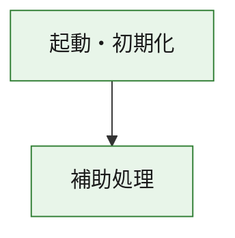
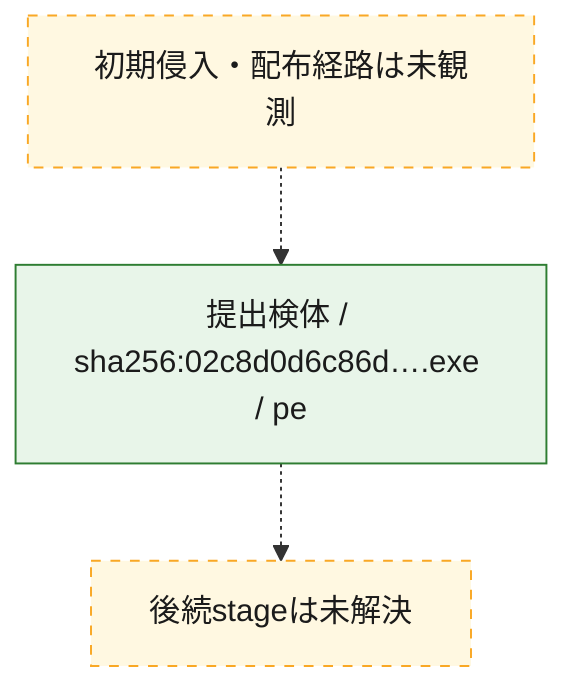
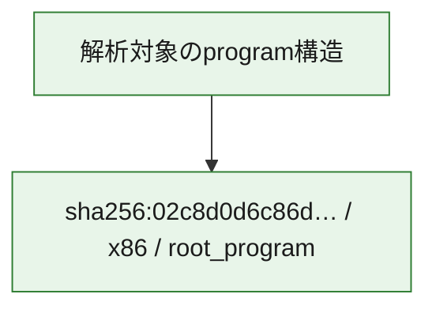

# 全体ロジック：02c8d0d6c86dee667f96e9689399926ac21f316ccae9fde28b825284a766fb4a

代表関数の静的証跡から、起動・初期化の処理群を確認しました。

## 読み方

- phaseの掲載順は解析上の整理順です。observed_call_edgesがない段階間の実行順を断定しません。
- 図の実線は静的に観測した関係、点線と黄色のノードは未観測・未解決の関係を示します。
- 図は静的な要約であり、動的実行を再現するものではありません。
- 詳細な関数解説とfingerprintは[STATIC-LOGIC.md](STATIC-LOGIC.md)を参照してください。

## 静的可視化

### 実行フロー

### 感染チェーン

### モジュール関係

## 処理段階

### 1. 起動・初期化

entry pointから初期化と後続処理への移行を確認します。
確度: `confirmed_static_function_evidence`

- `02c8d0d6c86dee667f96e9689399926ac21f316ccae9fde28b825284a766fb4a:ghidra:180001010` — 初期化と主要処理への分岐を行う入口関数です。 状態: `succeeded`、選定理由: `entry_point`, `meaningful_symbol_name`, `reviewed_call_centrality:22`, `role:entrypoint`, `small_program_complete_context`

### 2. 補助処理

主要処理を支える一般内部関数またはlibrary処理を確認します。
確度: `confirmed_static_function_evidence`

- `02c8d0d6c86dee667f96e9689399926ac21f316ccae9fde28b825284a766fb4a:ghidra:180001240` — 検体内部の一般処理を実装する関数です。 状態: `succeeded`、選定理由: `context_representative`, `reviewed_call_centrality:2`, `small_program_complete_context`
- `02c8d0d6c86dee667f96e9689399926ac21f316ccae9fde28b825284a766fb4a:ghidra:180001350` — 検体内部の一般処理を実装する関数です。 状態: `succeeded`、選定理由: `context_representative`, `reviewed_call_centrality:25`, `small_program_complete_context`
- `02c8d0d6c86dee667f96e9689399926ac21f316ccae9fde28b825284a766fb4a:ghidra:180003780` — 検体内部の一般処理を実装する関数です。 状態: `succeeded`、選定理由: `context_representative`, `reviewed_call_centrality:2`, `small_program_complete_context`
- `02c8d0d6c86dee667f96e9689399926ac21f316ccae9fde28b825284a766fb4a:ghidra:1800038e0` — 検体内部の一般処理を実装する関数です。 状態: `succeeded`、選定理由: `context_representative`, `reviewed_call_centrality:2`, `small_program_complete_context`

## 観測したcall関係

- `02c8d0d6c86dee667f96e9689399926ac21f316ccae9fde28b825284a766fb4a:ghidra:180001010` → `02c8d0d6c86dee667f96e9689399926ac21f316ccae9fde28b825284a766fb4a:ghidra:180001240` （`startup` → `support`）
- `02c8d0d6c86dee667f96e9689399926ac21f316ccae9fde28b825284a766fb4a:ghidra:180001010` → `02c8d0d6c86dee667f96e9689399926ac21f316ccae9fde28b825284a766fb4a:ghidra:180001350` （`startup` → `support`）
- `02c8d0d6c86dee667f96e9689399926ac21f316ccae9fde28b825284a766fb4a:ghidra:180001350` → `02c8d0d6c86dee667f96e9689399926ac21f316ccae9fde28b825284a766fb4a:ghidra:180001240` （`support` → `support`）
- `02c8d0d6c86dee667f96e9689399926ac21f316ccae9fde28b825284a766fb4a:ghidra:180001350` → `02c8d0d6c86dee667f96e9689399926ac21f316ccae9fde28b825284a766fb4a:ghidra:180003780` （`support` → `support`）
- `02c8d0d6c86dee667f96e9689399926ac21f316ccae9fde28b825284a766fb4a:ghidra:180001350` → `02c8d0d6c86dee667f96e9689399926ac21f316ccae9fde28b825284a766fb4a:ghidra:1800038e0` （`support` → `support`）
- `02c8d0d6c86dee667f96e9689399926ac21f316ccae9fde28b825284a766fb4a:ghidra:180003780` → `02c8d0d6c86dee667f96e9689399926ac21f316ccae9fde28b825284a766fb4a:ghidra:1800038e0` （`support` → `support`）
- `ghidra-function:0c589d2a03adb912cb6f992f` → `ghidra-external:024ab25cc076b960a688220f` （`unclassified` → `unclassified`）
- `ghidra-function:0c589d2a03adb912cb6f992f` → `ghidra-external:05a963815ae0ea656c8a2f15` （`unclassified` → `unclassified`）
- `ghidra-function:0c589d2a03adb912cb6f992f` → `ghidra-external:17cbcdf410d9219c37f3e693` （`unclassified` → `unclassified`）
- `ghidra-function:0c589d2a03adb912cb6f992f` → `ghidra-external:1f4ca1153cf299d674d313d7` （`unclassified` → `unclassified`）
- `ghidra-function:0c589d2a03adb912cb6f992f` → `ghidra-external:2acd998b1f249fd50883906a` （`unclassified` → `unclassified`）
- `ghidra-function:0c589d2a03adb912cb6f992f` → `ghidra-external:37693477df0e196d1748eab9` （`unclassified` → `unclassified`）
- `ghidra-function:0c589d2a03adb912cb6f992f` → `ghidra-external:6d2058cc085947fb49cc792f` （`unclassified` → `unclassified`）
- `ghidra-function:0c589d2a03adb912cb6f992f` → `ghidra-external:7f39f108ec697116154bd2fc` （`unclassified` → `unclassified`）
- `ghidra-function:0c589d2a03adb912cb6f992f` → `ghidra-external:8ed02e2b665d94e3a30c852c` （`unclassified` → `unclassified`）
- `ghidra-function:0c589d2a03adb912cb6f992f` → `ghidra-external:90a7e99303e22a04f7cb053d` （`unclassified` → `unclassified`）
- `ghidra-function:0c589d2a03adb912cb6f992f` → `ghidra-external:a5bf7c7dad3bef009a1780d7` （`unclassified` → `unclassified`）
- `ghidra-function:0c589d2a03adb912cb6f992f` → `ghidra-external:b19241b0c4b23eacf31dd8ce` （`unclassified` → `unclassified`）
- `ghidra-function:0c589d2a03adb912cb6f992f` → `ghidra-external:b7e18f360e8409f0445cd766` （`unclassified` → `unclassified`）
- `ghidra-function:0c589d2a03adb912cb6f992f` → `ghidra-external:c0e8031f1fbb4f50d732a4db` （`unclassified` → `unclassified`）
- `ghidra-function:0c589d2a03adb912cb6f992f` → `ghidra-external:d50428ec4da2ce2f5b748239` （`unclassified` → `unclassified`）
- `ghidra-function:0c589d2a03adb912cb6f992f` → `ghidra-external:db1864a69638b813a5edeecd` （`unclassified` → `unclassified`）
- `ghidra-function:0c589d2a03adb912cb6f992f` → `ghidra-external:dc059d523bf965b35895ac32` （`unclassified` → `unclassified`）
- `ghidra-function:0c589d2a03adb912cb6f992f` → `ghidra-external:e18dfdee14984f99d189f506` （`unclassified` → `unclassified`）
- `ghidra-function:0c589d2a03adb912cb6f992f` → `ghidra-external:e600d53e89b4e183c8a0882d` （`unclassified` → `unclassified`）
- `ghidra-function:0c589d2a03adb912cb6f992f` → `ghidra-external:eee6e98bb6ede2e4c2c4854e` （`unclassified` → `unclassified`）
- `ghidra-function:0c589d2a03adb912cb6f992f` → `ghidra-external:f88e5bf8f8c61d4cd2843f8b` （`unclassified` → `unclassified`）
- `ghidra-function:0c589d2a03adb912cb6f992f` → `ghidra-function:53c98a5cd56b6dc75b7ee279` （`unclassified` → `unclassified`）
- `ghidra-function:0c589d2a03adb912cb6f992f` → `ghidra-function:872017ee193266cdd4607aa4` （`unclassified` → `unclassified`）
- `ghidra-function:0c589d2a03adb912cb6f992f` → `ghidra-function:91faa9ac78113b58b418f67e` （`unclassified` → `unclassified`）
- `ghidra-function:872017ee193266cdd4607aa4` → `ghidra-function:53c98a5cd56b6dc75b7ee279` （`unclassified` → `unclassified`）
- `ghidra-function:c94f7161e5929611db6ae08c` → `ghidra-function:0c589d2a03adb912cb6f992f` （`unclassified` → `unclassified`）
- `ghidra-function:c94f7161e5929611db6ae08c` → `ghidra-function:0dbd9f00a82ce50722e0d19e` （`unclassified` → `unclassified`）
- `ghidra-function:c94f7161e5929611db6ae08c` → `ghidra-function:0f5c58343b40e4cdd9e16af4` （`unclassified` → `unclassified`）
- `ghidra-function:c94f7161e5929611db6ae08c` → `ghidra-function:106f2c3eae14c627a2e7f19a` （`unclassified` → `unclassified`）
- `ghidra-function:c94f7161e5929611db6ae08c` → `ghidra-function:324f19d9ae1e856a281ed02e` （`unclassified` → `unclassified`）
- `ghidra-function:c94f7161e5929611db6ae08c` → `ghidra-function:401b95a91b3ef62d51af2b11` （`unclassified` → `unclassified`）
- `ghidra-function:c94f7161e5929611db6ae08c` → `ghidra-function:58dbd589cd8de166c9007e80` （`unclassified` → `unclassified`）
- `ghidra-function:c94f7161e5929611db6ae08c` → `ghidra-function:7ad0752e27345973ef2ef598` （`unclassified` → `unclassified`）
- `ghidra-function:c94f7161e5929611db6ae08c` → `ghidra-function:8643f2bf00b1a265f630fe9a` （`unclassified` → `unclassified`）
- `ghidra-function:c94f7161e5929611db6ae08c` → `ghidra-function:88771ea8d789fd4488c8eb69` （`unclassified` → `unclassified`）
- `ghidra-function:c94f7161e5929611db6ae08c` → `ghidra-function:91faa9ac78113b58b418f67e` （`unclassified` → `unclassified`）
- `ghidra-function:c94f7161e5929611db6ae08c` → `ghidra-function:b3441b974c69b2877ba4693c` （`unclassified` → `unclassified`）

## 解析範囲と制約

- 選定外関数は全体inventoryへ残しますが、関数本体の個別解説対象にはしていません。
- indirect call、難読化、packer、VM、壊れたcontrol flowによりcall関係が欠落する場合があります。
- 文書は静的解析に基づき、検体実行や外部通信による動的確認は行っていません。
