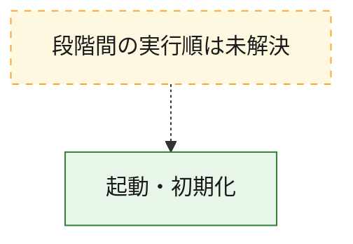
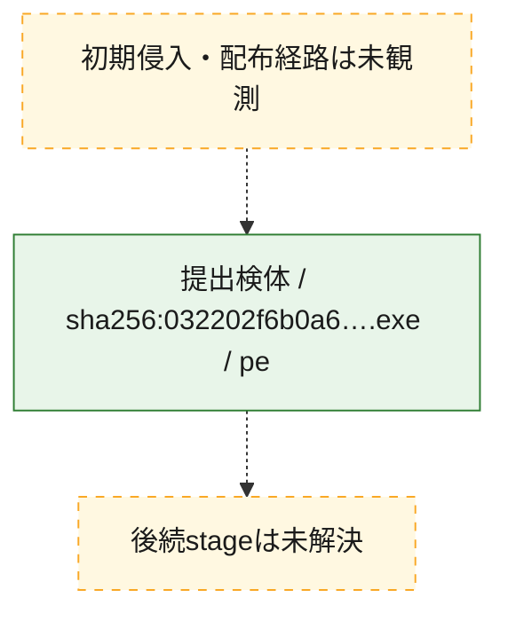
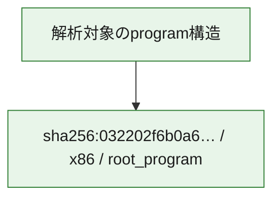

# 全体ロジック：032202f6b0a6110698938e6497b867c86455a4e0251907b78c5f52ed1affc707

代表関数の静的証跡から、起動・初期化の処理群を確認しました。

## 読み方

- phaseの掲載順は解析上の整理順です。observed_call_edgesがない段階間の実行順を断定しません。
- 図の実線は静的に観測した関係、点線と黄色のノードは未観測・未解決の関係を示します。
- 図は静的な要約であり、動的実行を再現するものではありません。
- 詳細な関数解説とfingerprintは[STATIC-LOGIC.md](STATIC-LOGIC.md)を参照してください。

## 静的可視化

### 実行フロー

### 感染チェーン

### モジュール関係

## 処理段階

### 1. 起動・初期化

entry pointから初期化と後続処理への移行を確認します。
確度: `confirmed_static_function_evidence`

- `032202f6b0a6110698938e6497b867c86455a4e0251907b78c5f52ed1affc707:ghidra:140679058` — 初期化と主要処理への分岐を行う入口関数です。 状態: `succeeded`、選定理由: `entry_point`, `large_function:instructions=158`, `meaningful_symbol_name`, `reviewed_call_centrality:3`, `role:entrypoint`, `small_program_complete_context`

## 観測したcall関係

- `ghidra-function:5003ec2af4c45061e121435e` → `ghidra-external:360456ce0f23b1e74870be95` （`unclassified` → `unclassified`）
- `ghidra-function:5003ec2af4c45061e121435e` → `ghidra-external:4beee597d44be4dc16aa31b4` （`unclassified` → `unclassified`）
- `ghidra-function:5003ec2af4c45061e121435e` → `ghidra-external:a800e9bb22c66b6b4feaef25` （`unclassified` → `unclassified`）

## 解析範囲と制約

- 選定外関数は全体inventoryへ残しますが、関数本体の個別解説対象にはしていません。
- indirect call、難読化、packer、VM、壊れたcontrol flowによりcall関係が欠落する場合があります。
- 文書は静的解析に基づき、検体実行や外部通信による動的確認は行っていません。
