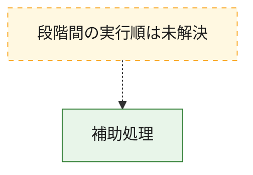
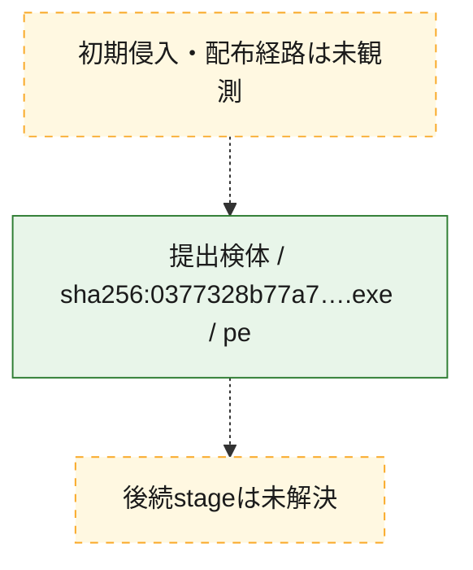
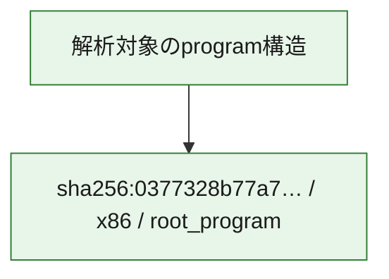

# 全体ロジック：0377328b77a71491581e34aad9f57b6d581681c614846157c0cc0de7859ce6f7

代表関数から主要なmalware処理段階を自動分類できませんでした。

## 読み方

- phaseの掲載順は解析上の整理順です。observed_call_edgesがない段階間の実行順を断定しません。
- 図の実線は静的に観測した関係、点線と黄色のノードは未観測・未解決の関係を示します。
- 図は静的な要約であり、動的実行を再現するものではありません。
- 詳細な関数解説とfingerprintは[STATIC-LOGIC.md](STATIC-LOGIC.md)を参照してください。

## 静的可視化

### 実行フロー

### 感染チェーン

### モジュール関係

## 処理段階

### 1. 補助処理

主要処理を支える一般内部関数またはlibrary処理を確認します。
確度: `confirmed_static_function_evidence`

- `0377328b77a71491581e34aad9f57b6d581681c614846157c0cc0de7859ce6f7:ghidra:140001008` — 検体内部の一般処理を実装する関数です。 状態: `succeeded`、選定理由: `context_representative`, `reviewed_call_centrality:4`, `small_program_complete_context`
- `0377328b77a71491581e34aad9f57b6d581681c614846157c0cc0de7859ce6f7:ghidra:140001724` — 検体内部の一般処理を実装する関数です。 状態: `succeeded`、選定理由: `context_representative`, `reviewed_call_centrality:1`, `small_program_complete_context`

## 観測したcall関係

- `0377328b77a71491581e34aad9f57b6d581681c614846157c0cc0de7859ce6f7:ghidra:140001008` → `0377328b77a71491581e34aad9f57b6d581681c614846157c0cc0de7859ce6f7:ghidra:140001724` （`support` → `support`）
- `ghidra-function:30d9eff957cdf4f7d41588ff` → `ghidra-external:a3a1bcfc53f8835888c46fbc` （`unclassified` → `unclassified`）
- `ghidra-function:30d9eff957cdf4f7d41588ff` → `ghidra-function:262143421565d16eb6aaa445` （`unclassified` → `unclassified`）
- `ghidra-function:30d9eff957cdf4f7d41588ff` → `ghidra-function:4d9b5e9968629f6d5ffbe444` （`unclassified` → `unclassified`）

## 解析範囲と制約

- 選定外関数は全体inventoryへ残しますが、関数本体の個別解説対象にはしていません。
- indirect call、難読化、packer、VM、壊れたcontrol flowによりcall関係が欠落する場合があります。
- 文書は静的解析に基づき、検体実行や外部通信による動的確認は行っていません。
