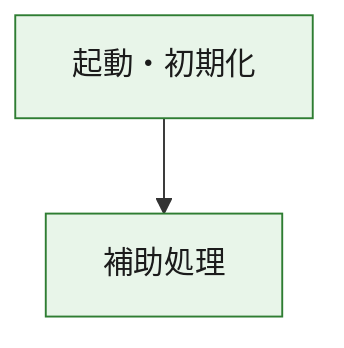
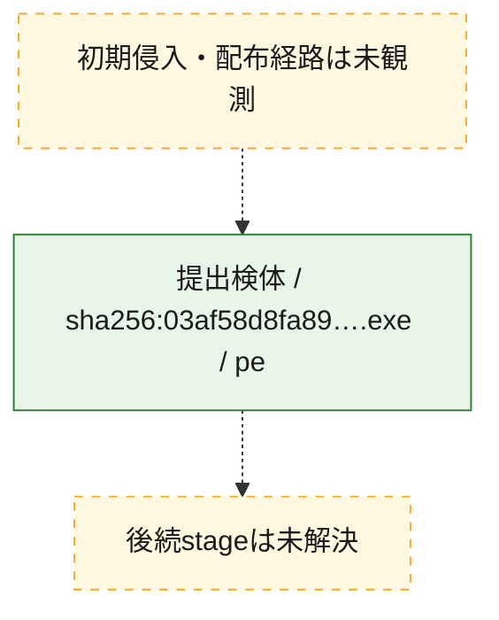
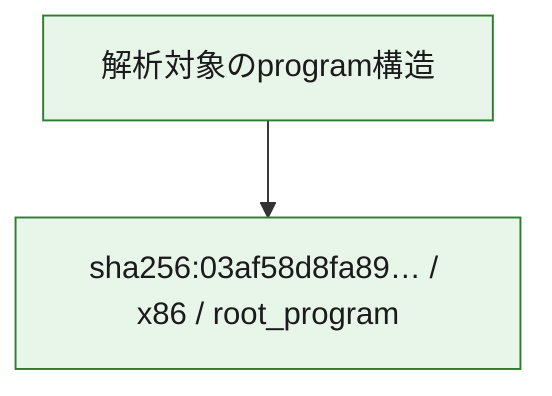

# 全体ロジック：03af58d8fa89b3c89c5a7b6aa37888788165383d5ef8e76968154fd0256a306f

代表関数の静的証跡から、起動・初期化の処理群を確認しました。

## 読み方

- phaseの掲載順は解析上の整理順です。observed_call_edgesがない段階間の実行順を断定しません。
- 図の実線は静的に観測した関係、点線と黄色のノードは未観測・未解決の関係を示します。
- 図は静的な要約であり、動的実行を再現するものではありません。
- 詳細な関数解説とfingerprintは[STATIC-LOGIC.md](STATIC-LOGIC.md)を参照してください。

## 静的可視化

### 実行フロー

### 感染チェーン

### モジュール関係

## 処理段階

### 1. 起動・初期化

entry pointから初期化と後続処理への移行を確認します。
確度: `confirmed_static_function_evidence`

- `03af58d8fa89b3c89c5a7b6aa37888788165383d5ef8e76968154fd0256a306f:ghidra:180001010` — 初期化と主要処理への分岐を行う入口関数です。 状態: `succeeded`、選定理由: `entry_point`, `meaningful_symbol_name`, `reviewed_call_centrality:22`, `role:entrypoint`, `small_program_complete_context`

### 2. 補助処理

主要処理を支える一般内部関数またはlibrary処理を確認します。
確度: `confirmed_static_function_evidence`

- `03af58d8fa89b3c89c5a7b6aa37888788165383d5ef8e76968154fd0256a306f:ghidra:180001240` — 検体内部の一般処理を実装する関数です。 状態: `succeeded`、選定理由: `context_representative`, `reviewed_call_centrality:2`, `small_program_complete_context`
- `03af58d8fa89b3c89c5a7b6aa37888788165383d5ef8e76968154fd0256a306f:ghidra:180001350` — 検体内部の一般処理を実装する関数です。 状態: `succeeded`、選定理由: `context_representative`, `reviewed_call_centrality:25`, `small_program_complete_context`
- `03af58d8fa89b3c89c5a7b6aa37888788165383d5ef8e76968154fd0256a306f:ghidra:180003780` — 検体内部の一般処理を実装する関数です。 状態: `succeeded`、選定理由: `context_representative`, `reviewed_call_centrality:2`, `small_program_complete_context`
- `03af58d8fa89b3c89c5a7b6aa37888788165383d5ef8e76968154fd0256a306f:ghidra:1800038e0` — 検体内部の一般処理を実装する関数です。 状態: `succeeded`、選定理由: `context_representative`, `reviewed_call_centrality:2`, `small_program_complete_context`

## 観測したcall関係

- `03af58d8fa89b3c89c5a7b6aa37888788165383d5ef8e76968154fd0256a306f:ghidra:180001010` → `03af58d8fa89b3c89c5a7b6aa37888788165383d5ef8e76968154fd0256a306f:ghidra:180001240` （`startup` → `support`）
- `03af58d8fa89b3c89c5a7b6aa37888788165383d5ef8e76968154fd0256a306f:ghidra:180001010` → `03af58d8fa89b3c89c5a7b6aa37888788165383d5ef8e76968154fd0256a306f:ghidra:180001350` （`startup` → `support`）
- `03af58d8fa89b3c89c5a7b6aa37888788165383d5ef8e76968154fd0256a306f:ghidra:180001350` → `03af58d8fa89b3c89c5a7b6aa37888788165383d5ef8e76968154fd0256a306f:ghidra:180001240` （`support` → `support`）
- `03af58d8fa89b3c89c5a7b6aa37888788165383d5ef8e76968154fd0256a306f:ghidra:180001350` → `03af58d8fa89b3c89c5a7b6aa37888788165383d5ef8e76968154fd0256a306f:ghidra:180003780` （`support` → `support`）
- `03af58d8fa89b3c89c5a7b6aa37888788165383d5ef8e76968154fd0256a306f:ghidra:180001350` → `03af58d8fa89b3c89c5a7b6aa37888788165383d5ef8e76968154fd0256a306f:ghidra:1800038e0` （`support` → `support`）
- `03af58d8fa89b3c89c5a7b6aa37888788165383d5ef8e76968154fd0256a306f:ghidra:180003780` → `03af58d8fa89b3c89c5a7b6aa37888788165383d5ef8e76968154fd0256a306f:ghidra:1800038e0` （`support` → `support`）
- `ghidra-function:00c4529a7301ff56caea45b6` → `ghidra-function:0546f894d29ec9d5de4ccf9f` （`unclassified` → `unclassified`）
- `ghidra-function:00c4529a7301ff56caea45b6` → `ghidra-function:0d78df010c3024c1e1cc87ec` （`unclassified` → `unclassified`）
- `ghidra-function:00c4529a7301ff56caea45b6` → `ghidra-function:11ce4876bd4fc6cf2640ef9b` （`unclassified` → `unclassified`）
- `ghidra-function:00c4529a7301ff56caea45b6` → `ghidra-function:1daa380c117d5f2901b0057e` （`unclassified` → `unclassified`）
- `ghidra-function:00c4529a7301ff56caea45b6` → `ghidra-function:6ce55602c08cfa8b3a803850` （`unclassified` → `unclassified`）
- `ghidra-function:00c4529a7301ff56caea45b6` → `ghidra-function:715d4d60fd751dc4403d5909` （`unclassified` → `unclassified`）
- `ghidra-function:00c4529a7301ff56caea45b6` → `ghidra-function:7231820af11ff599f91a9e09` （`unclassified` → `unclassified`）
- `ghidra-function:00c4529a7301ff56caea45b6` → `ghidra-function:a517a32b670705477250ec46` （`unclassified` → `unclassified`）
- `ghidra-function:00c4529a7301ff56caea45b6` → `ghidra-function:a73f8fe872f2a2f9d88427cb` （`unclassified` → `unclassified`）
- `ghidra-function:00c4529a7301ff56caea45b6` → `ghidra-function:ba079b66b975e916691af03f` （`unclassified` → `unclassified`）
- `ghidra-function:00c4529a7301ff56caea45b6` → `ghidra-function:c7916f38ed7242f891d3c1c8` （`unclassified` → `unclassified`）
- `ghidra-function:00c4529a7301ff56caea45b6` → `ghidra-function:d9b4463a192daf59df04ddcf` （`unclassified` → `unclassified`）
- `ghidra-function:545facc5c6aef60558f4b4b2` → `ghidra-function:79a76e277c8fcb11b43c42ce` （`unclassified` → `unclassified`）
- `ghidra-function:a73f8fe872f2a2f9d88427cb` → `ghidra-external:060227c39be6dafd884350da` （`unclassified` → `unclassified`）
- `ghidra-function:a73f8fe872f2a2f9d88427cb` → `ghidra-external:0e032297d7d4d7234f182aa8` （`unclassified` → `unclassified`）
- `ghidra-function:a73f8fe872f2a2f9d88427cb` → `ghidra-external:141f57585e01801a06e6daf1` （`unclassified` → `unclassified`）
- `ghidra-function:a73f8fe872f2a2f9d88427cb` → `ghidra-external:2bcca51c0a5d34183d8b008a` （`unclassified` → `unclassified`）
- `ghidra-function:a73f8fe872f2a2f9d88427cb` → `ghidra-external:2ef83c7ab03e9e1b5400cd52` （`unclassified` → `unclassified`）
- `ghidra-function:a73f8fe872f2a2f9d88427cb` → `ghidra-external:53e32f3490256df0704d6ad4` （`unclassified` → `unclassified`）
- `ghidra-function:a73f8fe872f2a2f9d88427cb` → `ghidra-external:6465774c880f100491deb729` （`unclassified` → `unclassified`）
- `ghidra-function:a73f8fe872f2a2f9d88427cb` → `ghidra-external:67912b67b0167a9230bdcf2d` （`unclassified` → `unclassified`）
- `ghidra-function:a73f8fe872f2a2f9d88427cb` → `ghidra-external:6ba6f4941afac09872275762` （`unclassified` → `unclassified`）
- `ghidra-function:a73f8fe872f2a2f9d88427cb` → `ghidra-external:6da17196eb4cf060db2936c1` （`unclassified` → `unclassified`）
- `ghidra-function:a73f8fe872f2a2f9d88427cb` → `ghidra-external:71f65853c45716bd1f370ac9` （`unclassified` → `unclassified`）
- `ghidra-function:a73f8fe872f2a2f9d88427cb` → `ghidra-external:a76b900cd5a4d0c79f7db6bd` （`unclassified` → `unclassified`）
- `ghidra-function:a73f8fe872f2a2f9d88427cb` → `ghidra-external:aa96e1025de444fd91aec986` （`unclassified` → `unclassified`）
- `ghidra-function:a73f8fe872f2a2f9d88427cb` → `ghidra-external:b102d5d0545626b5d5f8bd45` （`unclassified` → `unclassified`）
- `ghidra-function:a73f8fe872f2a2f9d88427cb` → `ghidra-external:b4a6ee7d4ed6814479768513` （`unclassified` → `unclassified`）
- `ghidra-function:a73f8fe872f2a2f9d88427cb` → `ghidra-external:bb059e0a6165e6daf38edfd4` （`unclassified` → `unclassified`）
- `ghidra-function:a73f8fe872f2a2f9d88427cb` → `ghidra-external:bc5c6a5f6a8ed2142e9d233f` （`unclassified` → `unclassified`）
- `ghidra-function:a73f8fe872f2a2f9d88427cb` → `ghidra-external:cb0c31dee65af0a33d2ccfc1` （`unclassified` → `unclassified`）
- `ghidra-function:a73f8fe872f2a2f9d88427cb` → `ghidra-external:ef0f144851db174d9d10ce16` （`unclassified` → `unclassified`）
- `ghidra-function:a73f8fe872f2a2f9d88427cb` → `ghidra-external:f0b7aeccff007644e0749327` （`unclassified` → `unclassified`）
- `ghidra-function:a73f8fe872f2a2f9d88427cb` → `ghidra-external:f3f604c3a0c7a139222508ce` （`unclassified` → `unclassified`）
- `ghidra-function:a73f8fe872f2a2f9d88427cb` → `ghidra-function:545facc5c6aef60558f4b4b2` （`unclassified` → `unclassified`）
- `ghidra-function:a73f8fe872f2a2f9d88427cb` → `ghidra-function:6ce55602c08cfa8b3a803850` （`unclassified` → `unclassified`）
- `ghidra-function:a73f8fe872f2a2f9d88427cb` → `ghidra-function:79a76e277c8fcb11b43c42ce` （`unclassified` → `unclassified`）

## 解析範囲と制約

- 選定外関数は全体inventoryへ残しますが、関数本体の個別解説対象にはしていません。
- indirect call、難読化、packer、VM、壊れたcontrol flowによりcall関係が欠落する場合があります。
- 文書は静的解析に基づき、検体実行や外部通信による動的確認は行っていません。
