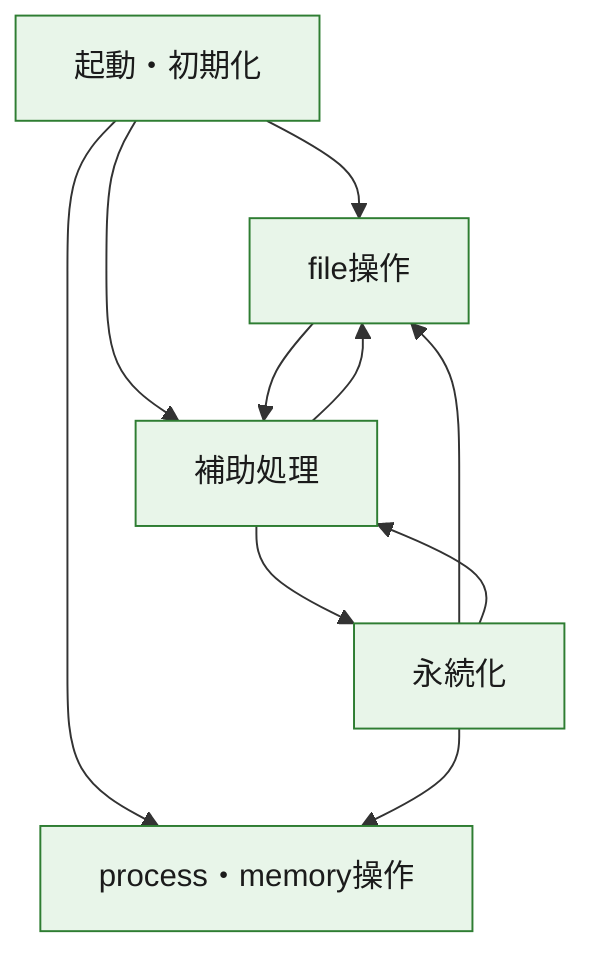
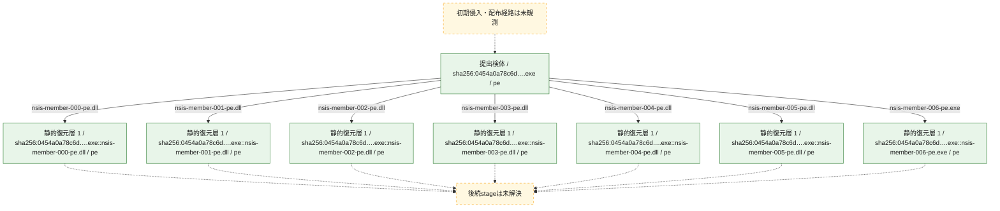
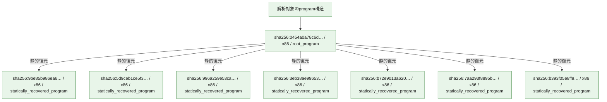

# 全体ロジック：0454a0a78c6d3952a2c7c206c3d767b565636733061eab0bca35a67cf68fd818

代表関数の静的証跡から、起動・初期化、永続化、process・memory操作、file操作の処理群を確認しました。

## 読み方

- phaseの掲載順は解析上の整理順です。observed_call_edgesがない段階間の実行順を断定しません。
- 図の実線は静的に観測した関係、点線と黄色のノードは未観測・未解決の関係を示します。
- 図は静的な要約であり、動的実行を再現するものではありません。
- 詳細な関数解説とfingerprintは[STATIC-LOGIC.md](STATIC-LOGIC.md)を参照してください。

## 静的可視化

### 実行フロー

### 感染チェーン

### モジュール関係

## 処理段階

### 1. 起動・初期化

entry pointから初期化と後続処理への移行を確認します。
確度: `confirmed_static_function_evidence`

- `9be85b986ea66a6997dde658abe82b3147ed2a1a3dcb784bb5176f41d22815a6:ghidra:100012ff` — 初期化と主要処理への分岐を行う入口関数です。 状態: `succeeded`、選定理由: `entry_point`, `meaningful_symbol_name`, `role:entrypoint`, `small_program_complete_context`
- `5d9ceb1ce5f35aea5f9e5a0c0edeeec04dfefe0c77890c80c70e98209b58b962:ghidra:10001087` — 初期化と主要処理への分岐を行う入口関数です。 状態: `succeeded`、選定理由: `entry_point`, `meaningful_symbol_name`, `role:entrypoint`, `small_program_complete_context`
- `996a259e53ca18b89ec36d038c40148957c978c0fd600a268497d4c92f882a93:ghidra:10002170` — 初期化と主要処理への分岐を行う入口関数です。 状態: `succeeded`、選定理由: `call_graph_centrality:in=0,out=1`, `entry_point`, `meaningful_symbol_name`, `reviewed_call_centrality:1`, `role:entrypoint`, `small_program_complete_context`
- `3eb38ae99653a7dbc724132ee240f6e5c4af4bfe7c01d31d23faf373f9f2eaca:ghidra:10002993` — 初期化と主要処理への分岐を行う入口関数です。 状態: `succeeded`、選定理由: `call_graph_centrality:in=0,out=1`, `entry_point`, `meaningful_symbol_name`, `reviewed_call_centrality:1`, `reviewed_call_centrality:2`, `role:entrypoint`, `small_program_complete_context`
- `b72e9013a6204e9f01076dc38dabbf30870d44dfc66962adbf73619d4331601e:ghidra:1000eab9` — 初期化と主要処理への分岐を行う入口関数です。 状態: `succeeded`、選定理由: `call_graph_centrality:in=0,out=1`, `entry_point`, `meaningful_symbol_name`, `reviewed_call_centrality:1`, `reviewed_call_centrality:5`, `role:entrypoint`, `small_program_complete_context`
- `7aa293f8895bace0295d5d1a947f41e5796c008245cd96f2476a01bf29a47c5a:ghidra:0040338f` — 初期化と主要処理への分岐を行う入口関数です。 状態: `succeeded`、選定理由: `call_graph_centrality:in=0,out=15`, `entry_point`, `large_function:instructions=410`, `meaningful_symbol_name`, `reviewed_call_centrality:29`, `reviewed_call_centrality:67`, `role:entrypoint`, `small_program_complete_context`
- `0454a0a78c6d3952a2c7c206c3d767b565636733061eab0bca35a67cf68fd818:ghidra:0040338f` — 初期化と主要処理への分岐を行う入口関数です。 状態: `succeeded`、選定理由: `call_graph_centrality:in=0,out=18`, `entry_point`, `large_function:instructions=410`, `meaningful_symbol_name`, `reviewed_call_centrality:18`, `reviewed_call_centrality:68`, `role:entrypoint`

### 2. 永続化

自動起動や永続化に関係する設定変更を確認します。
確度: `confirmed_static_function_evidence_with_limits`

- `0454a0a78c6d3952a2c7c206c3d767b565636733061eab0bca35a67cf68fd818:ghidra:00401434` — 自動起動または永続化に関係する処理を含む関数です。 状態: `failed`、選定理由: `call_graph_centrality:in=1,out=0`, `entry_reachable_call_depth:3`, `large_function:instructions=1908`, `reviewed_call_centrality:1`, `reviewed_call_centrality:168`, `role:persistence`

### 3. process・memory操作

process、thread、module、memory操作と実行移行を確認します。
確度: `confirmed_static_function_evidence`

- `0454a0a78c6d3952a2c7c206c3d767b565636733061eab0bca35a67cf68fd818:ghidra:004058a3` — process、thread、module、またはmemory操作に関係する関数です。 状態: `succeeded`、選定理由: `call_graph_centrality:in=1,out=0`, `entry_reachable_call_depth:1`, `reviewed_call_centrality:1`, `reviewed_call_centrality:6`, `role:process_or_memory_operation`

### 4. file操作

fileやdirectoryの作成、読書き、削除を確認します。
確度: `confirmed_static_function_evidence`

- `0454a0a78c6d3952a2c7c206c3d767b565636733061eab0bca35a67cf68fd818:ghidra:004059cc` — fileまたはdirectoryの読書き・管理に関係する関数です。 状態: `succeeded`、選定理由: `call_graph_centrality:in=2,out=11`, `entry_reachable_call_depth:2`, `large_function:instructions=148`, `reviewed_call_centrality:13`, `reviewed_call_centrality:24`, `role:file_operation`

### 5. 補助処理

主要処理を支える一般内部関数またはlibrary処理を確認します。
確度: `confirmed_static_function_evidence`

- `996a259e53ca18b89ec36d038c40148957c978c0fd600a268497d4c92f882a93:ghidra:10001fd0` — 検体内部の一般処理を実装する関数です。 状態: `succeeded`、選定理由: `call_graph_centrality:in=1,out=5`, `entry_reachable_call_depth:1`, `large_function:instructions=75`, `reviewed_call_centrality:11`, `reviewed_call_centrality:6`, `small_program_complete_context`
- `b72e9013a6204e9f01076dc38dabbf30870d44dfc66962adbf73619d4331601e:ghidra:10005968` — 検体内部の一般処理を実装する関数です。 状態: `succeeded`、選定理由: `call_graph_centrality:in=1,out=0`, `entry_reachable_call_depth:1`, `reviewed_call_centrality:1`, `reviewed_call_centrality:5`, `small_program_complete_context`
- `b393f05e8ff919ef071181050e1873c9a776e1a0ae8329aefff7007d0cadf592:ghidra:100248ac` — compiler生成処理または汎用library処理とみられる関数です。 状態: `succeeded`、選定理由: `meaningful_symbol_name`, `small_program_complete_context`
- `0454a0a78c6d3952a2c7c206c3d767b565636733061eab0bca35a67cf68fd818:ghidra:00401389` — 検体内部の一般処理を実装する関数です。 状態: `succeeded`、選定理由: `call_graph_centrality:in=2,out=2`, `entry_reachable_call_depth:2`, `reviewed_call_centrality:4`, `reviewed_call_centrality:9`
- `0454a0a78c6d3952a2c7c206c3d767b565636733061eab0bca35a67cf68fd818:ghidra:0040140b` — 検体内部の一般処理を実装する関数です。 状態: `succeeded`、選定理由: `call_graph_centrality:in=2,out=1`, `entry_reachable_call_depth:1`, `reviewed_call_centrality:3`
- `0454a0a78c6d3952a2c7c206c3d767b565636733061eab0bca35a67cf68fd818:ghidra:00402edd` — 検体内部の一般処理を実装する関数です。 状態: `succeeded`、選定理由: `call_graph_centrality:in=1,out=9`, `entry_reachable_call_depth:1`, `large_function:instructions=182`, `reviewed_call_centrality:10`, `reviewed_call_centrality:20`
- `0454a0a78c6d3952a2c7c206c3d767b565636733061eab0bca35a67cf68fd818:ghidra:00403116` — 検体内部の一般処理を実装する関数です。 状態: `succeeded`、選定理由: `call_graph_centrality:in=1,out=5`, `entry_reachable_call_depth:2`, `large_function:instructions=166`, `reviewed_call_centrality:13`, `reviewed_call_centrality:6`
- `0454a0a78c6d3952a2c7c206c3d767b565636733061eab0bca35a67cf68fd818:ghidra:0040335e` — 検体内部の一般処理を実装する関数です。 状態: `succeeded`、選定理由: `call_graph_centrality:in=1,out=5`, `entry_reachable_call_depth:1`, `reviewed_call_centrality:6`
- `0454a0a78c6d3952a2c7c206c3d767b565636733061eab0bca35a67cf68fd818:ghidra:004038d0` — 検体内部の一般処理を実装する関数です。 状態: `succeeded`、選定理由: `call_graph_centrality:in=1,out=2`, `entry_reachable_call_depth:1`, `reviewed_call_centrality:3`, `reviewed_call_centrality:5`
- `0454a0a78c6d3952a2c7c206c3d767b565636733061eab0bca35a67cf68fd818:ghidra:004039aa` — 検体内部の一般処理を実装する関数です。 状態: `succeeded`、選定理由: `call_graph_centrality:in=1,out=16`, `entry_reachable_call_depth:1`, `large_function:instructions=215`, `reviewed_call_centrality:17`, `reviewed_call_centrality:36`
- `0454a0a78c6d3952a2c7c206c3d767b565636733061eab0bca35a67cf68fd818:ghidra:00403c80` — 検体内部の一般処理を実装する関数です。 状態: `succeeded`、選定理由: `call_graph_centrality:in=1,out=4`, `entry_reachable_call_depth:2`, `large_function:instructions=66`, `reviewed_call_centrality:5`
- `0454a0a78c6d3952a2c7c206c3d767b565636733061eab0bca35a67cf68fd818:ghidra:004053f5` — 検体内部の一般処理を実装する関数です。 状態: `succeeded`、選定理由: `call_graph_centrality:in=1,out=2`, `entry_reachable_call_depth:2`, `reviewed_call_centrality:3`, `reviewed_call_centrality:7`
- `0454a0a78c6d3952a2c7c206c3d767b565636733061eab0bca35a67cf68fd818:ghidra:004057f1` — 検体内部の一般処理を実装する関数です。 状態: `succeeded`、選定理由: `call_graph_centrality:in=1,out=0`, `entry_reachable_call_depth:1`, `reviewed_call_centrality:1`, `reviewed_call_centrality:8`
- `0454a0a78c6d3952a2c7c206c3d767b565636733061eab0bca35a67cf68fd818:ghidra:0040586e` — 検体内部の一般処理を実装する関数です。 状態: `succeeded`、選定理由: `call_graph_centrality:in=2,out=0`, `entry_reachable_call_depth:1`, `reviewed_call_centrality:2`, `reviewed_call_centrality:7`
- `0454a0a78c6d3952a2c7c206c3d767b565636733061eab0bca35a67cf68fd818:ghidra:0040588b` — 検体内部の一般処理を実装する関数です。 状態: `succeeded`、選定理由: `call_graph_centrality:in=1,out=1`, `entry_reachable_call_depth:1`, `reviewed_call_centrality:2`, `reviewed_call_centrality:3`
- `0454a0a78c6d3952a2c7c206c3d767b565636733061eab0bca35a67cf68fd818:ghidra:00405920` — 検体内部の一般処理を実装する関数です。 状態: `succeeded`、選定理由: `call_graph_centrality:in=1,out=0`, `entry_reachable_call_depth:1`, `reviewed_call_centrality:1`, `reviewed_call_centrality:4`
- `0454a0a78c6d3952a2c7c206c3d767b565636733061eab0bca35a67cf68fd818:ghidra:00405b8f` — 検体内部の一般処理を実装する関数です。 状態: `succeeded`、選定理由: `call_graph_centrality:in=4,out=2`, `entry_reachable_call_depth:2`, `reviewed_call_centrality:6`, `reviewed_call_centrality:9`
- `0454a0a78c6d3952a2c7c206c3d767b565636733061eab0bca35a67cf68fd818:ghidra:00405bbc` — 検体内部の一般処理を実装する関数です。 状態: `succeeded`、選定理由: `call_graph_centrality:in=4,out=0`, `entry_reachable_call_depth:1`, `reviewed_call_centrality:4`, `reviewed_call_centrality:7`
- `0454a0a78c6d3952a2c7c206c3d767b565636733061eab0bca35a67cf68fd818:ghidra:00405bdb` — 検体内部の一般処理を実装する関数です。 状態: `succeeded`、選定理由: `call_graph_centrality:in=4,out=1`, `entry_reachable_call_depth:2`, `reviewed_call_centrality:5`, `reviewed_call_centrality:7`
- `0454a0a78c6d3952a2c7c206c3d767b565636733061eab0bca35a67cf68fd818:ghidra:00405c97` — 検体内部の一般処理を実装する関数です。 状態: `succeeded`、選定理由: `call_graph_centrality:in=3,out=7`, `entry_reachable_call_depth:1`, `reviewed_call_centrality:10`, `reviewed_call_centrality:12`
- `0454a0a78c6d3952a2c7c206c3d767b565636733061eab0bca35a67cf68fd818:ghidra:00405d6b` — 検体内部の一般処理を実装する関数です。 状態: `succeeded`、選定理由: `call_graph_centrality:in=4,out=0`, `entry_reachable_call_depth:2`, `reviewed_call_centrality:4`, `reviewed_call_centrality:6`
- `0454a0a78c6d3952a2c7c206c3d767b565636733061eab0bca35a67cf68fd818:ghidra:00405f06` — 検体内部の一般処理を実装する関数です。 状態: `succeeded`、選定理由: `call_graph_centrality:in=1,out=6`, `entry_reachable_call_depth:2`, `large_function:instructions=130`, `reviewed_call_centrality:23`, `reviewed_call_centrality:7`
- `0454a0a78c6d3952a2c7c206c3d767b565636733061eab0bca35a67cf68fd818:ghidra:00406080` — 検体内部の一般処理を実装する関数です。 状態: `succeeded`、選定理由: `call_graph_centrality:in=2,out=1`, `entry_reachable_call_depth:1`, `reviewed_call_centrality:3`, `reviewed_call_centrality:6`
- `0454a0a78c6d3952a2c7c206c3d767b565636733061eab0bca35a67cf68fd818:ghidra:00406188` — 検体内部の一般処理を実装する関数です。 状態: `succeeded`、選定理由: `call_graph_centrality:in=2,out=1`, `entry_reachable_call_depth:2`, `reviewed_call_centrality:3`, `reviewed_call_centrality:7`
- `0454a0a78c6d3952a2c7c206c3d767b565636733061eab0bca35a67cf68fd818:ghidra:00406201` — 検体内部の一般処理を実装する関数です。 状態: `succeeded`、選定理由: `call_graph_centrality:in=3,out=0`, `entry_reachable_call_depth:2`, `reviewed_call_centrality:3`, `reviewed_call_centrality:6`
- `0454a0a78c6d3952a2c7c206c3d767b565636733061eab0bca35a67cf68fd818:ghidra:004062ba` — 検体内部の一般処理を実装する関数です。 状態: `succeeded`、選定理由: `call_graph_centrality:in=6,out=0`, `entry_reachable_call_depth:1`, `reviewed_call_centrality:6`, `reviewed_call_centrality:9`
- `0454a0a78c6d3952a2c7c206c3d767b565636733061eab0bca35a67cf68fd818:ghidra:004062dc` — 検体内部の一般処理を実装する関数です。 状態: `succeeded`、選定理由: `call_graph_centrality:in=7,out=7`, `entry_reachable_call_depth:1`, `large_function:instructions=209`, `reviewed_call_centrality:14`, `reviewed_call_centrality:25`
- `0454a0a78c6d3952a2c7c206c3d767b565636733061eab0bca35a67cf68fd818:ghidra:0040654e` — 検体内部の一般処理を実装する関数です。 状態: `succeeded`、選定理由: `call_graph_centrality:in=3,out=3`, `entry_reachable_call_depth:2`, `large_function:instructions=69`, `reviewed_call_centrality:11`, `reviewed_call_centrality:6`
- `0454a0a78c6d3952a2c7c206c3d767b565636733061eab0bca35a67cf68fd818:ghidra:00406624` — 検体内部の一般処理を実装する関数です。 状態: `succeeded`、選定理由: `call_graph_centrality:in=3,out=0`, `entry_reachable_call_depth:1`, `reviewed_call_centrality:3`, `reviewed_call_centrality:9`
- `0454a0a78c6d3952a2c7c206c3d767b565636733061eab0bca35a67cf68fd818:ghidra:00406694` — 検体内部の一般処理を実装する関数です。 状態: `succeeded`、選定理由: `call_graph_centrality:in=3,out=1`, `entry_reachable_call_depth:1`, `reviewed_call_centrality:4`, `reviewed_call_centrality:9`
- `0454a0a78c6d3952a2c7c206c3d767b565636733061eab0bca35a67cf68fd818:ghidra:004067f5` — 検体内部の一般処理を実装する関数です。 状態: `succeeded`、選定理由: `call_graph_centrality:in=1,out=1`, `entry_reachable_call_depth:3`, `large_function:instructions=817`, `reviewed_call_centrality:2`, `reviewed_call_centrality:4`

## 観測したcall関係

- `0454a0a78c6d3952a2c7c206c3d767b565636733061eab0bca35a67cf68fd818:ghidra:00401389` → `0454a0a78c6d3952a2c7c206c3d767b565636733061eab0bca35a67cf68fd818:ghidra:00401434` （`support` → `persistence`）
- `0454a0a78c6d3952a2c7c206c3d767b565636733061eab0bca35a67cf68fd818:ghidra:0040140b` → `0454a0a78c6d3952a2c7c206c3d767b565636733061eab0bca35a67cf68fd818:ghidra:00401389` （`support` → `support`）
- `0454a0a78c6d3952a2c7c206c3d767b565636733061eab0bca35a67cf68fd818:ghidra:00401434` → `0454a0a78c6d3952a2c7c206c3d767b565636733061eab0bca35a67cf68fd818:ghidra:00401389` （`persistence` → `support`）
- `0454a0a78c6d3952a2c7c206c3d767b565636733061eab0bca35a67cf68fd818:ghidra:00401434` → `0454a0a78c6d3952a2c7c206c3d767b565636733061eab0bca35a67cf68fd818:ghidra:00403116` （`persistence` → `support`）
- `0454a0a78c6d3952a2c7c206c3d767b565636733061eab0bca35a67cf68fd818:ghidra:00401434` → `0454a0a78c6d3952a2c7c206c3d767b565636733061eab0bca35a67cf68fd818:ghidra:004057f1` （`persistence` → `support`）
- `0454a0a78c6d3952a2c7c206c3d767b565636733061eab0bca35a67cf68fd818:ghidra:00401434` → `0454a0a78c6d3952a2c7c206c3d767b565636733061eab0bca35a67cf68fd818:ghidra:0040586e` （`persistence` → `support`）
- `0454a0a78c6d3952a2c7c206c3d767b565636733061eab0bca35a67cf68fd818:ghidra:00401434` → `0454a0a78c6d3952a2c7c206c3d767b565636733061eab0bca35a67cf68fd818:ghidra:0040588b` （`persistence` → `support`）
- `0454a0a78c6d3952a2c7c206c3d767b565636733061eab0bca35a67cf68fd818:ghidra:00401434` → `0454a0a78c6d3952a2c7c206c3d767b565636733061eab0bca35a67cf68fd818:ghidra:004058a3` （`persistence` → `execution`）
- `0454a0a78c6d3952a2c7c206c3d767b565636733061eab0bca35a67cf68fd818:ghidra:00401434` → `0454a0a78c6d3952a2c7c206c3d767b565636733061eab0bca35a67cf68fd818:ghidra:00405920` （`persistence` → `support`）
- `0454a0a78c6d3952a2c7c206c3d767b565636733061eab0bca35a67cf68fd818:ghidra:00401434` → `0454a0a78c6d3952a2c7c206c3d767b565636733061eab0bca35a67cf68fd818:ghidra:004059cc` （`persistence` → `file_activity`）
- `0454a0a78c6d3952a2c7c206c3d767b565636733061eab0bca35a67cf68fd818:ghidra:00401434` → `0454a0a78c6d3952a2c7c206c3d767b565636733061eab0bca35a67cf68fd818:ghidra:00405b8f` （`persistence` → `support`）
- `0454a0a78c6d3952a2c7c206c3d767b565636733061eab0bca35a67cf68fd818:ghidra:00401434` → `0454a0a78c6d3952a2c7c206c3d767b565636733061eab0bca35a67cf68fd818:ghidra:00405bbc` （`persistence` → `support`）
- `0454a0a78c6d3952a2c7c206c3d767b565636733061eab0bca35a67cf68fd818:ghidra:00401434` → `0454a0a78c6d3952a2c7c206c3d767b565636733061eab0bca35a67cf68fd818:ghidra:00405d6b` （`persistence` → `support`）
- `0454a0a78c6d3952a2c7c206c3d767b565636733061eab0bca35a67cf68fd818:ghidra:00401434` → `0454a0a78c6d3952a2c7c206c3d767b565636733061eab0bca35a67cf68fd818:ghidra:00406080` （`persistence` → `support`）
- `0454a0a78c6d3952a2c7c206c3d767b565636733061eab0bca35a67cf68fd818:ghidra:00401434` → `0454a0a78c6d3952a2c7c206c3d767b565636733061eab0bca35a67cf68fd818:ghidra:00406201` （`persistence` → `support`）
- `0454a0a78c6d3952a2c7c206c3d767b565636733061eab0bca35a67cf68fd818:ghidra:00401434` → `0454a0a78c6d3952a2c7c206c3d767b565636733061eab0bca35a67cf68fd818:ghidra:004062ba` （`persistence` → `support`）
- `0454a0a78c6d3952a2c7c206c3d767b565636733061eab0bca35a67cf68fd818:ghidra:00401434` → `0454a0a78c6d3952a2c7c206c3d767b565636733061eab0bca35a67cf68fd818:ghidra:004062dc` （`persistence` → `support`）
- `0454a0a78c6d3952a2c7c206c3d767b565636733061eab0bca35a67cf68fd818:ghidra:00401434` → `0454a0a78c6d3952a2c7c206c3d767b565636733061eab0bca35a67cf68fd818:ghidra:0040654e` （`persistence` → `support`）
- `0454a0a78c6d3952a2c7c206c3d767b565636733061eab0bca35a67cf68fd818:ghidra:00401434` → `0454a0a78c6d3952a2c7c206c3d767b565636733061eab0bca35a67cf68fd818:ghidra:00406694` （`persistence` → `support`）
- `0454a0a78c6d3952a2c7c206c3d767b565636733061eab0bca35a67cf68fd818:ghidra:00402edd` → `0454a0a78c6d3952a2c7c206c3d767b565636733061eab0bca35a67cf68fd818:ghidra:00403116` （`support` → `support`）
- `0454a0a78c6d3952a2c7c206c3d767b565636733061eab0bca35a67cf68fd818:ghidra:00402edd` → `0454a0a78c6d3952a2c7c206c3d767b565636733061eab0bca35a67cf68fd818:ghidra:00405bdb` （`support` → `support`）
- `0454a0a78c6d3952a2c7c206c3d767b565636733061eab0bca35a67cf68fd818:ghidra:00402edd` → `0454a0a78c6d3952a2c7c206c3d767b565636733061eab0bca35a67cf68fd818:ghidra:00405d6b` （`support` → `support`）
- `0454a0a78c6d3952a2c7c206c3d767b565636733061eab0bca35a67cf68fd818:ghidra:00402edd` → `0454a0a78c6d3952a2c7c206c3d767b565636733061eab0bca35a67cf68fd818:ghidra:004062ba` （`support` → `support`）
- `0454a0a78c6d3952a2c7c206c3d767b565636733061eab0bca35a67cf68fd818:ghidra:00403116` → `0454a0a78c6d3952a2c7c206c3d767b565636733061eab0bca35a67cf68fd818:ghidra:004067f5` （`support` → `support`）
- `0454a0a78c6d3952a2c7c206c3d767b565636733061eab0bca35a67cf68fd818:ghidra:0040335e` → `0454a0a78c6d3952a2c7c206c3d767b565636733061eab0bca35a67cf68fd818:ghidra:0040586e` （`support` → `support`）
- `0454a0a78c6d3952a2c7c206c3d767b565636733061eab0bca35a67cf68fd818:ghidra:0040335e` → `0454a0a78c6d3952a2c7c206c3d767b565636733061eab0bca35a67cf68fd818:ghidra:00405b8f` （`support` → `support`）
- `0454a0a78c6d3952a2c7c206c3d767b565636733061eab0bca35a67cf68fd818:ghidra:0040335e` → `0454a0a78c6d3952a2c7c206c3d767b565636733061eab0bca35a67cf68fd818:ghidra:0040654e` （`support` → `support`）
- `0454a0a78c6d3952a2c7c206c3d767b565636733061eab0bca35a67cf68fd818:ghidra:0040338f` → `0454a0a78c6d3952a2c7c206c3d767b565636733061eab0bca35a67cf68fd818:ghidra:0040140b` （`startup` → `support`）
- `0454a0a78c6d3952a2c7c206c3d767b565636733061eab0bca35a67cf68fd818:ghidra:0040338f` → `0454a0a78c6d3952a2c7c206c3d767b565636733061eab0bca35a67cf68fd818:ghidra:00402edd` （`startup` → `support`）
- `0454a0a78c6d3952a2c7c206c3d767b565636733061eab0bca35a67cf68fd818:ghidra:0040338f` → `0454a0a78c6d3952a2c7c206c3d767b565636733061eab0bca35a67cf68fd818:ghidra:0040335e` （`startup` → `support`）
- `0454a0a78c6d3952a2c7c206c3d767b565636733061eab0bca35a67cf68fd818:ghidra:0040338f` → `0454a0a78c6d3952a2c7c206c3d767b565636733061eab0bca35a67cf68fd818:ghidra:004038d0` （`startup` → `support`）
- `0454a0a78c6d3952a2c7c206c3d767b565636733061eab0bca35a67cf68fd818:ghidra:0040338f` → `0454a0a78c6d3952a2c7c206c3d767b565636733061eab0bca35a67cf68fd818:ghidra:004039aa` （`startup` → `support`）
- `0454a0a78c6d3952a2c7c206c3d767b565636733061eab0bca35a67cf68fd818:ghidra:0040338f` → `0454a0a78c6d3952a2c7c206c3d767b565636733061eab0bca35a67cf68fd818:ghidra:004057f1` （`startup` → `support`）
- `0454a0a78c6d3952a2c7c206c3d767b565636733061eab0bca35a67cf68fd818:ghidra:0040338f` → `0454a0a78c6d3952a2c7c206c3d767b565636733061eab0bca35a67cf68fd818:ghidra:0040586e` （`startup` → `support`）
- `0454a0a78c6d3952a2c7c206c3d767b565636733061eab0bca35a67cf68fd818:ghidra:0040338f` → `0454a0a78c6d3952a2c7c206c3d767b565636733061eab0bca35a67cf68fd818:ghidra:0040588b` （`startup` → `support`）
- `0454a0a78c6d3952a2c7c206c3d767b565636733061eab0bca35a67cf68fd818:ghidra:0040338f` → `0454a0a78c6d3952a2c7c206c3d767b565636733061eab0bca35a67cf68fd818:ghidra:004058a3` （`startup` → `execution`）
- `0454a0a78c6d3952a2c7c206c3d767b565636733061eab0bca35a67cf68fd818:ghidra:0040338f` → `0454a0a78c6d3952a2c7c206c3d767b565636733061eab0bca35a67cf68fd818:ghidra:00405920` （`startup` → `support`）
- `0454a0a78c6d3952a2c7c206c3d767b565636733061eab0bca35a67cf68fd818:ghidra:0040338f` → `0454a0a78c6d3952a2c7c206c3d767b565636733061eab0bca35a67cf68fd818:ghidra:004059cc` （`startup` → `file_activity`）
- `0454a0a78c6d3952a2c7c206c3d767b565636733061eab0bca35a67cf68fd818:ghidra:0040338f` → `0454a0a78c6d3952a2c7c206c3d767b565636733061eab0bca35a67cf68fd818:ghidra:00405bbc` （`startup` → `support`）
- `0454a0a78c6d3952a2c7c206c3d767b565636733061eab0bca35a67cf68fd818:ghidra:0040338f` → `0454a0a78c6d3952a2c7c206c3d767b565636733061eab0bca35a67cf68fd818:ghidra:00405c97` （`startup` → `support`）
- `0454a0a78c6d3952a2c7c206c3d767b565636733061eab0bca35a67cf68fd818:ghidra:0040338f` → `0454a0a78c6d3952a2c7c206c3d767b565636733061eab0bca35a67cf68fd818:ghidra:00406080` （`startup` → `support`）
- `0454a0a78c6d3952a2c7c206c3d767b565636733061eab0bca35a67cf68fd818:ghidra:0040338f` → `0454a0a78c6d3952a2c7c206c3d767b565636733061eab0bca35a67cf68fd818:ghidra:004062ba` （`startup` → `support`）
- `0454a0a78c6d3952a2c7c206c3d767b565636733061eab0bca35a67cf68fd818:ghidra:0040338f` → `0454a0a78c6d3952a2c7c206c3d767b565636733061eab0bca35a67cf68fd818:ghidra:004062dc` （`startup` → `support`）
- `0454a0a78c6d3952a2c7c206c3d767b565636733061eab0bca35a67cf68fd818:ghidra:0040338f` → `0454a0a78c6d3952a2c7c206c3d767b565636733061eab0bca35a67cf68fd818:ghidra:00406624` （`startup` → `support`）
- `0454a0a78c6d3952a2c7c206c3d767b565636733061eab0bca35a67cf68fd818:ghidra:0040338f` → `0454a0a78c6d3952a2c7c206c3d767b565636733061eab0bca35a67cf68fd818:ghidra:00406694` （`startup` → `support`）
- `0454a0a78c6d3952a2c7c206c3d767b565636733061eab0bca35a67cf68fd818:ghidra:004038d0` → `0454a0a78c6d3952a2c7c206c3d767b565636733061eab0bca35a67cf68fd818:ghidra:004059cc` （`support` → `file_activity`）
- `0454a0a78c6d3952a2c7c206c3d767b565636733061eab0bca35a67cf68fd818:ghidra:004039aa` → `0454a0a78c6d3952a2c7c206c3d767b565636733061eab0bca35a67cf68fd818:ghidra:0040140b` （`support` → `support`）
- `0454a0a78c6d3952a2c7c206c3d767b565636733061eab0bca35a67cf68fd818:ghidra:004039aa` → `0454a0a78c6d3952a2c7c206c3d767b565636733061eab0bca35a67cf68fd818:ghidra:00403c80` （`support` → `support`）
- `0454a0a78c6d3952a2c7c206c3d767b565636733061eab0bca35a67cf68fd818:ghidra:004039aa` → `0454a0a78c6d3952a2c7c206c3d767b565636733061eab0bca35a67cf68fd818:ghidra:004053f5` （`support` → `support`）
- `0454a0a78c6d3952a2c7c206c3d767b565636733061eab0bca35a67cf68fd818:ghidra:004039aa` → `0454a0a78c6d3952a2c7c206c3d767b565636733061eab0bca35a67cf68fd818:ghidra:00405b8f` （`support` → `support`）
- `0454a0a78c6d3952a2c7c206c3d767b565636733061eab0bca35a67cf68fd818:ghidra:004039aa` → `0454a0a78c6d3952a2c7c206c3d767b565636733061eab0bca35a67cf68fd818:ghidra:00405bbc` （`support` → `support`）
- `0454a0a78c6d3952a2c7c206c3d767b565636733061eab0bca35a67cf68fd818:ghidra:004039aa` → `0454a0a78c6d3952a2c7c206c3d767b565636733061eab0bca35a67cf68fd818:ghidra:00405bdb` （`support` → `support`）
- `0454a0a78c6d3952a2c7c206c3d767b565636733061eab0bca35a67cf68fd818:ghidra:004039aa` → `0454a0a78c6d3952a2c7c206c3d767b565636733061eab0bca35a67cf68fd818:ghidra:00405c97` （`support` → `support`）
- `0454a0a78c6d3952a2c7c206c3d767b565636733061eab0bca35a67cf68fd818:ghidra:004039aa` → `0454a0a78c6d3952a2c7c206c3d767b565636733061eab0bca35a67cf68fd818:ghidra:00406188` （`support` → `support`）
- `0454a0a78c6d3952a2c7c206c3d767b565636733061eab0bca35a67cf68fd818:ghidra:004039aa` → `0454a0a78c6d3952a2c7c206c3d767b565636733061eab0bca35a67cf68fd818:ghidra:00406201` （`support` → `support`）
- `0454a0a78c6d3952a2c7c206c3d767b565636733061eab0bca35a67cf68fd818:ghidra:004039aa` → `0454a0a78c6d3952a2c7c206c3d767b565636733061eab0bca35a67cf68fd818:ghidra:004062ba` （`support` → `support`）
- `0454a0a78c6d3952a2c7c206c3d767b565636733061eab0bca35a67cf68fd818:ghidra:004039aa` → `0454a0a78c6d3952a2c7c206c3d767b565636733061eab0bca35a67cf68fd818:ghidra:004062dc` （`support` → `support`）
- `0454a0a78c6d3952a2c7c206c3d767b565636733061eab0bca35a67cf68fd818:ghidra:004039aa` → `0454a0a78c6d3952a2c7c206c3d767b565636733061eab0bca35a67cf68fd818:ghidra:00406624` （`support` → `support`）
- `0454a0a78c6d3952a2c7c206c3d767b565636733061eab0bca35a67cf68fd818:ghidra:004039aa` → `0454a0a78c6d3952a2c7c206c3d767b565636733061eab0bca35a67cf68fd818:ghidra:00406694` （`support` → `support`）
- `0454a0a78c6d3952a2c7c206c3d767b565636733061eab0bca35a67cf68fd818:ghidra:00403c80` → `0454a0a78c6d3952a2c7c206c3d767b565636733061eab0bca35a67cf68fd818:ghidra:00406201` （`support` → `support`）
- `0454a0a78c6d3952a2c7c206c3d767b565636733061eab0bca35a67cf68fd818:ghidra:00403c80` → `0454a0a78c6d3952a2c7c206c3d767b565636733061eab0bca35a67cf68fd818:ghidra:004062dc` （`support` → `support`）
- `0454a0a78c6d3952a2c7c206c3d767b565636733061eab0bca35a67cf68fd818:ghidra:004053f5` → `0454a0a78c6d3952a2c7c206c3d767b565636733061eab0bca35a67cf68fd818:ghidra:00401389` （`support` → `support`）
- `0454a0a78c6d3952a2c7c206c3d767b565636733061eab0bca35a67cf68fd818:ghidra:0040588b` → `0454a0a78c6d3952a2c7c206c3d767b565636733061eab0bca35a67cf68fd818:ghidra:00406694` （`support` → `support`）
- `0454a0a78c6d3952a2c7c206c3d767b565636733061eab0bca35a67cf68fd818:ghidra:004059cc` → `0454a0a78c6d3952a2c7c206c3d767b565636733061eab0bca35a67cf68fd818:ghidra:00405b8f` （`file_activity` → `support`）
- `0454a0a78c6d3952a2c7c206c3d767b565636733061eab0bca35a67cf68fd818:ghidra:004059cc` → `0454a0a78c6d3952a2c7c206c3d767b565636733061eab0bca35a67cf68fd818:ghidra:00405bdb` （`file_activity` → `support`）
- `0454a0a78c6d3952a2c7c206c3d767b565636733061eab0bca35a67cf68fd818:ghidra:004059cc` → `0454a0a78c6d3952a2c7c206c3d767b565636733061eab0bca35a67cf68fd818:ghidra:00405c97` （`file_activity` → `support`）
- `0454a0a78c6d3952a2c7c206c3d767b565636733061eab0bca35a67cf68fd818:ghidra:004059cc` → `0454a0a78c6d3952a2c7c206c3d767b565636733061eab0bca35a67cf68fd818:ghidra:00406080` （`file_activity` → `support`）
- `0454a0a78c6d3952a2c7c206c3d767b565636733061eab0bca35a67cf68fd818:ghidra:004059cc` → `0454a0a78c6d3952a2c7c206c3d767b565636733061eab0bca35a67cf68fd818:ghidra:004062ba` （`file_activity` → `support`）
- `0454a0a78c6d3952a2c7c206c3d767b565636733061eab0bca35a67cf68fd818:ghidra:00405c97` → `0454a0a78c6d3952a2c7c206c3d767b565636733061eab0bca35a67cf68fd818:ghidra:00405b8f` （`support` → `support`）
- `0454a0a78c6d3952a2c7c206c3d767b565636733061eab0bca35a67cf68fd818:ghidra:00405c97` → `0454a0a78c6d3952a2c7c206c3d767b565636733061eab0bca35a67cf68fd818:ghidra:00405bdb` （`support` → `support`）
- `0454a0a78c6d3952a2c7c206c3d767b565636733061eab0bca35a67cf68fd818:ghidra:00405c97` → `0454a0a78c6d3952a2c7c206c3d767b565636733061eab0bca35a67cf68fd818:ghidra:004062ba` （`support` → `support`）
- `0454a0a78c6d3952a2c7c206c3d767b565636733061eab0bca35a67cf68fd818:ghidra:00405c97` → `0454a0a78c6d3952a2c7c206c3d767b565636733061eab0bca35a67cf68fd818:ghidra:0040654e` （`support` → `support`）
- `0454a0a78c6d3952a2c7c206c3d767b565636733061eab0bca35a67cf68fd818:ghidra:00405f06` → `0454a0a78c6d3952a2c7c206c3d767b565636733061eab0bca35a67cf68fd818:ghidra:00405d6b` （`support` → `support`）
- `0454a0a78c6d3952a2c7c206c3d767b565636733061eab0bca35a67cf68fd818:ghidra:00405f06` → `0454a0a78c6d3952a2c7c206c3d767b565636733061eab0bca35a67cf68fd818:ghidra:004062dc` （`support` → `support`）
- `0454a0a78c6d3952a2c7c206c3d767b565636733061eab0bca35a67cf68fd818:ghidra:00406080` → `0454a0a78c6d3952a2c7c206c3d767b565636733061eab0bca35a67cf68fd818:ghidra:00405f06` （`support` → `support`）
- `0454a0a78c6d3952a2c7c206c3d767b565636733061eab0bca35a67cf68fd818:ghidra:004062dc` → `0454a0a78c6d3952a2c7c206c3d767b565636733061eab0bca35a67cf68fd818:ghidra:00406188` （`support` → `support`）
- `0454a0a78c6d3952a2c7c206c3d767b565636733061eab0bca35a67cf68fd818:ghidra:004062dc` → `0454a0a78c6d3952a2c7c206c3d767b565636733061eab0bca35a67cf68fd818:ghidra:00406201` （`support` → `support`）
- `0454a0a78c6d3952a2c7c206c3d767b565636733061eab0bca35a67cf68fd818:ghidra:004062dc` → `0454a0a78c6d3952a2c7c206c3d767b565636733061eab0bca35a67cf68fd818:ghidra:004062ba` （`support` → `support`）
- `0454a0a78c6d3952a2c7c206c3d767b565636733061eab0bca35a67cf68fd818:ghidra:004062dc` → `0454a0a78c6d3952a2c7c206c3d767b565636733061eab0bca35a67cf68fd818:ghidra:0040654e` （`support` → `support`）
- `0454a0a78c6d3952a2c7c206c3d767b565636733061eab0bca35a67cf68fd818:ghidra:0040654e` → `0454a0a78c6d3952a2c7c206c3d767b565636733061eab0bca35a67cf68fd818:ghidra:00405bbc` （`support` → `support`）
- `0454a0a78c6d3952a2c7c206c3d767b565636733061eab0bca35a67cf68fd818:ghidra:0040654e` → `0454a0a78c6d3952a2c7c206c3d767b565636733061eab0bca35a67cf68fd818:ghidra:00405d6b` （`support` → `support`）
- `0454a0a78c6d3952a2c7c206c3d767b565636733061eab0bca35a67cf68fd818:ghidra:00406694` → `0454a0a78c6d3952a2c7c206c3d767b565636733061eab0bca35a67cf68fd818:ghidra:00406624` （`support` → `support`）
- `0454a0a78c6d3952a2c7c206c3d767b565636733061eab0bca35a67cf68fd818:ghidra:004067f5` → `0454a0a78c6d3952a2c7c206c3d767b565636733061eab0bca35a67cf68fd818:ghidra:00405d6b` （`support` → `support`）
- `7aa293f8895bace0295d5d1a947f41e5796c008245cd96f2476a01bf29a47c5a:ghidra:0040338f` → `0454a0a78c6d3952a2c7c206c3d767b565636733061eab0bca35a67cf68fd818:ghidra:0040140b` （`startup` → `support`）
- `7aa293f8895bace0295d5d1a947f41e5796c008245cd96f2476a01bf29a47c5a:ghidra:0040338f` → `0454a0a78c6d3952a2c7c206c3d767b565636733061eab0bca35a67cf68fd818:ghidra:00402edd` （`startup` → `support`）
- `7aa293f8895bace0295d5d1a947f41e5796c008245cd96f2476a01bf29a47c5a:ghidra:0040338f` → `0454a0a78c6d3952a2c7c206c3d767b565636733061eab0bca35a67cf68fd818:ghidra:0040335e` （`startup` → `support`）
- `7aa293f8895bace0295d5d1a947f41e5796c008245cd96f2476a01bf29a47c5a:ghidra:0040338f` → `0454a0a78c6d3952a2c7c206c3d767b565636733061eab0bca35a67cf68fd818:ghidra:004038d0` （`startup` → `support`）
- `7aa293f8895bace0295d5d1a947f41e5796c008245cd96f2476a01bf29a47c5a:ghidra:0040338f` → `0454a0a78c6d3952a2c7c206c3d767b565636733061eab0bca35a67cf68fd818:ghidra:004039aa` （`startup` → `support`）
- `7aa293f8895bace0295d5d1a947f41e5796c008245cd96f2476a01bf29a47c5a:ghidra:0040338f` → `0454a0a78c6d3952a2c7c206c3d767b565636733061eab0bca35a67cf68fd818:ghidra:004057f1` （`startup` → `support`）
- `7aa293f8895bace0295d5d1a947f41e5796c008245cd96f2476a01bf29a47c5a:ghidra:0040338f` → `0454a0a78c6d3952a2c7c206c3d767b565636733061eab0bca35a67cf68fd818:ghidra:0040586e` （`startup` → `support`）
- `7aa293f8895bace0295d5d1a947f41e5796c008245cd96f2476a01bf29a47c5a:ghidra:0040338f` → `0454a0a78c6d3952a2c7c206c3d767b565636733061eab0bca35a67cf68fd818:ghidra:0040588b` （`startup` → `support`）
- `7aa293f8895bace0295d5d1a947f41e5796c008245cd96f2476a01bf29a47c5a:ghidra:0040338f` → `0454a0a78c6d3952a2c7c206c3d767b565636733061eab0bca35a67cf68fd818:ghidra:004058a3` （`startup` → `execution`）
- `7aa293f8895bace0295d5d1a947f41e5796c008245cd96f2476a01bf29a47c5a:ghidra:0040338f` → `0454a0a78c6d3952a2c7c206c3d767b565636733061eab0bca35a67cf68fd818:ghidra:00405920` （`startup` → `support`）
- `7aa293f8895bace0295d5d1a947f41e5796c008245cd96f2476a01bf29a47c5a:ghidra:0040338f` → `0454a0a78c6d3952a2c7c206c3d767b565636733061eab0bca35a67cf68fd818:ghidra:004059cc` （`startup` → `file_activity`）
- `7aa293f8895bace0295d5d1a947f41e5796c008245cd96f2476a01bf29a47c5a:ghidra:0040338f` → `0454a0a78c6d3952a2c7c206c3d767b565636733061eab0bca35a67cf68fd818:ghidra:00405bbc` （`startup` → `support`）
- `7aa293f8895bace0295d5d1a947f41e5796c008245cd96f2476a01bf29a47c5a:ghidra:0040338f` → `0454a0a78c6d3952a2c7c206c3d767b565636733061eab0bca35a67cf68fd818:ghidra:00405c97` （`startup` → `support`）
- `7aa293f8895bace0295d5d1a947f41e5796c008245cd96f2476a01bf29a47c5a:ghidra:0040338f` → `0454a0a78c6d3952a2c7c206c3d767b565636733061eab0bca35a67cf68fd818:ghidra:00406080` （`startup` → `support`）
- `7aa293f8895bace0295d5d1a947f41e5796c008245cd96f2476a01bf29a47c5a:ghidra:0040338f` → `0454a0a78c6d3952a2c7c206c3d767b565636733061eab0bca35a67cf68fd818:ghidra:004062ba` （`startup` → `support`）
- `7aa293f8895bace0295d5d1a947f41e5796c008245cd96f2476a01bf29a47c5a:ghidra:0040338f` → `0454a0a78c6d3952a2c7c206c3d767b565636733061eab0bca35a67cf68fd818:ghidra:004062dc` （`startup` → `support`）
- `7aa293f8895bace0295d5d1a947f41e5796c008245cd96f2476a01bf29a47c5a:ghidra:0040338f` → `0454a0a78c6d3952a2c7c206c3d767b565636733061eab0bca35a67cf68fd818:ghidra:00406624` （`startup` → `support`）
- `7aa293f8895bace0295d5d1a947f41e5796c008245cd96f2476a01bf29a47c5a:ghidra:0040338f` → `0454a0a78c6d3952a2c7c206c3d767b565636733061eab0bca35a67cf68fd818:ghidra:00406694` （`startup` → `support`）
- `996a259e53ca18b89ec36d038c40148957c978c0fd600a268497d4c92f882a93:ghidra:10002170` → `996a259e53ca18b89ec36d038c40148957c978c0fd600a268497d4c92f882a93:ghidra:10001fd0` （`startup` → `support`）
- `b72e9013a6204e9f01076dc38dabbf30870d44dfc66962adbf73619d4331601e:ghidra:1000eab9` → `b72e9013a6204e9f01076dc38dabbf30870d44dfc66962adbf73619d4331601e:ghidra:10005968` （`startup` → `support`）
- `ghidra-function:0365eead5789de2e05eda906` → `ghidra-function:219c9f8eecd9815c02d8d13c` （`unclassified` → `unclassified`）
- `ghidra-function:0365eead5789de2e05eda906` → `ghidra-function:32bb10043e563096af5aa133` （`unclassified` → `unclassified`）
- `ghidra-function:0365eead5789de2e05eda906` → `ghidra-function:61169b2660339b4882d8bbdd` （`unclassified` → `unclassified`）
- `ghidra-function:0365eead5789de2e05eda906` → `ghidra-function:741328493bddd475d87c8c70` （`unclassified` → `unclassified`）
- `ghidra-function:0365eead5789de2e05eda906` → `ghidra-function:83ddcef4bf8f8ede8983b660` （`unclassified` → `unclassified`）
- `ghidra-function:0365eead5789de2e05eda906` → `ghidra-function:c08b41d61c866ce372066f9f` （`unclassified` → `unclassified`）
- `ghidra-function:0365eead5789de2e05eda906` → `ghidra-function:c477deee5bb9163d4fd28724` （`unclassified` → `unclassified`）
- `ghidra-function:049b1a6af8e8a1ab400c5049` → `ghidra-function:5a623d3be56b08be0dd64550` （`unclassified` → `unclassified`）
- `ghidra-function:0cfad8bc13f76b2808bbeb4c` → `ghidra-function:86a71ec22e626f9eac8d9b2d` （`unclassified` → `unclassified`）
- `ghidra-function:0cfad8bc13f76b2808bbeb4c` → `ghidra-function:87c1ba795ef083ea432f6b8f` （`unclassified` → `unclassified`）
- `ghidra-function:0cfad8bc13f76b2808bbeb4c` → `ghidra-function:a72f5798bf766fea1a407f4b` （`unclassified` → `unclassified`）
- `ghidra-function:118c33c90742b77e75f21122` → `ghidra-external:ee935d061abbd09863420323` （`unclassified` → `unclassified`）
- `ghidra-function:118c33c90742b77e75f21122` → `ghidra-function:4c73522c3e286ad8f97d1c3a` （`unclassified` → `unclassified`）
- `ghidra-function:118c33c90742b77e75f21122` → `ghidra-function:7c157ff61bc759d659fa995e` （`unclassified` → `unclassified`）
- `ghidra-function:15bf4b8333a94eb1ec94e01b` → `ghidra-function:521f7757dc06e9ac7daf3153` （`unclassified` → `unclassified`）
- `ghidra-function:15bf4b8333a94eb1ec94e01b` → `ghidra-function:5cbf7c2fd94f653e2675d3c9` （`unclassified` → `unclassified`）
- `ghidra-function:15bf4b8333a94eb1ec94e01b` → `ghidra-function:bdac6c24ced033378b347ad8` （`unclassified` → `unclassified`）
- `ghidra-function:15bf4b8333a94eb1ec94e01b` → `ghidra-function:c252521f9a4c4e9f08fb3d3d` （`unclassified` → `unclassified`）
- `ghidra-function:185441c4620cd2c888b425a3` → `ghidra-function:4e3ef1d821138929b0b984f3` （`unclassified` → `unclassified`）
- `ghidra-function:21b6d550f1d53e6c975540bd` → `ghidra-function:4276058166cc418df59b2e4a` （`unclassified` → `unclassified`）
- `ghidra-function:21b6d550f1d53e6c975540bd` → `ghidra-function:64162408cd58e94b4a7ce4fb` （`unclassified` → `unclassified`）
- `ghidra-function:21b6d550f1d53e6c975540bd` → `ghidra-function:6ddb2ce6b6b1d31fef44511a` （`unclassified` → `unclassified`）
- `ghidra-function:21b6d550f1d53e6c975540bd` → `ghidra-function:7ec054085a80f481d648ca0b` （`unclassified` → `unclassified`）
- `ghidra-function:21b6d550f1d53e6c975540bd` → `ghidra-function:9fc7b9dbd3ebf0ec57f8a176` （`unclassified` → `unclassified`）
- `ghidra-function:21b6d550f1d53e6c975540bd` → `ghidra-function:d24212e9007747667b9755f2` （`unclassified` → `unclassified`）
- `ghidra-function:21b6d550f1d53e6c975540bd` → `ghidra-function:e2d82ee2c4c843b1a342096b` （`unclassified` → `unclassified`）
- `ghidra-function:21b6d550f1d53e6c975540bd` → `ghidra-function:e5cfc38d3dd64ccbe9ed97aa` （`unclassified` → `unclassified`）
- `ghidra-function:2c94bb0abbce4a088e440df8` → `ghidra-function:49e897a76f29018deb47f893` （`unclassified` → `unclassified`）
- `ghidra-function:2c94bb0abbce4a088e440df8` → `ghidra-function:6ddb2ce6b6b1d31fef44511a` （`unclassified` → `unclassified`）
- `ghidra-function:2c94bb0abbce4a088e440df8` → `ghidra-function:75617a170895d2e384e6ccd7` （`unclassified` → `unclassified`）
- `ghidra-function:2c94bb0abbce4a088e440df8` → `ghidra-function:af4474c323e5605c5cc7a654` （`unclassified` → `unclassified`）
- `ghidra-function:2c94bb0abbce4a088e440df8` → `ghidra-function:e5cfc38d3dd64ccbe9ed97aa` （`unclassified` → `unclassified`）
- `ghidra-function:2e3c5de0f7890acd546f1505` → `ghidra-external:15e085fe003381405c73c474` （`unclassified` → `unclassified`）
- `ghidra-function:2e3c5de0f7890acd546f1505` → `ghidra-external:214a836337ebfa7a9b20e0e6` （`unclassified` → `unclassified`）
- `ghidra-function:2e3c5de0f7890acd546f1505` → `ghidra-external:2765cb8d0f225e69a3fc2ee4` （`unclassified` → `unclassified`）
- `ghidra-function:2e3c5de0f7890acd546f1505` → `ghidra-external:2deb291049cdcbe2f064bae1` （`unclassified` → `unclassified`）
- `ghidra-function:2e3c5de0f7890acd546f1505` → `ghidra-external:33a3a70374c274ba7a16ac14` （`unclassified` → `unclassified`）
- `ghidra-function:2e3c5de0f7890acd546f1505` → `ghidra-external:41058117c14ccda72b8c28e6` （`unclassified` → `unclassified`）
- `ghidra-function:2e3c5de0f7890acd546f1505` → `ghidra-external:4cd98b5d3af5a2e8191250c1` （`unclassified` → `unclassified`）
- `ghidra-function:2e3c5de0f7890acd546f1505` → `ghidra-external:5a5031d46404a083c164e227` （`unclassified` → `unclassified`）
- `ghidra-function:2e3c5de0f7890acd546f1505` → `ghidra-external:5f253ca644b69fbcbe49b146` （`unclassified` → `unclassified`）
- `ghidra-function:2e3c5de0f7890acd546f1505` → `ghidra-external:64f38d9bac8bfae6ddef760f` （`unclassified` → `unclassified`）
- `ghidra-function:2e3c5de0f7890acd546f1505` → `ghidra-external:9f406a890a1367618cf102b5` （`unclassified` → `unclassified`）
- `ghidra-function:2e3c5de0f7890acd546f1505` → `ghidra-external:a7a59f8457db69632667e682` （`unclassified` → `unclassified`）
- `ghidra-function:2e3c5de0f7890acd546f1505` → `ghidra-external:af5c77947fe5ada545af6fe0` （`unclassified` → `unclassified`）
- `ghidra-function:2e3c5de0f7890acd546f1505` → `ghidra-external:b8bb55163e549f6a6ee10b09` （`unclassified` → `unclassified`）
- `ghidra-function:2e3c5de0f7890acd546f1505` → `ghidra-external:d6284a1c8df56755c6f8e3d0` （`unclassified` → `unclassified`）
- `ghidra-function:2e3c5de0f7890acd546f1505` → `ghidra-external:d9eebb8b669ae21b6ff4ebfc` （`unclassified` → `unclassified`）
- `ghidra-function:2e3c5de0f7890acd546f1505` → `ghidra-external:e145ed251a6236796bd41a54` （`unclassified` → `unclassified`）
- `ghidra-function:2e3c5de0f7890acd546f1505` → `ghidra-external:ed712f5f430229a0e6d20d62` （`unclassified` → `unclassified`）
- `ghidra-function:2e3c5de0f7890acd546f1505` → `ghidra-external:ef047c9f3860a2253493edc5` （`unclassified` → `unclassified`）
- `ghidra-function:2e3c5de0f7890acd546f1505` → `ghidra-external:f89ecf32a5381df978d6220a` （`unclassified` → `unclassified`）
- `ghidra-function:2e3c5de0f7890acd546f1505` → `ghidra-function:0365eead5789de2e05eda906` （`unclassified` → `unclassified`）
- `ghidra-function:2e3c5de0f7890acd546f1505` → `ghidra-function:03f0e1c2e751402fb5c4afd0` （`unclassified` → `unclassified`）
- `ghidra-function:2e3c5de0f7890acd546f1505` → `ghidra-function:07d829a9c50287c3604ae630` （`unclassified` → `unclassified`）
- `ghidra-function:2e3c5de0f7890acd546f1505` → `ghidra-function:1c98ada3765ca54834ab4bf7` （`unclassified` → `unclassified`）
- `ghidra-function:2e3c5de0f7890acd546f1505` → `ghidra-function:25ca6bc91b01a329985942de` （`unclassified` → `unclassified`）
- `ghidra-function:2e3c5de0f7890acd546f1505` → `ghidra-function:32331606320e512009bf3d54` （`unclassified` → `unclassified`）
- `ghidra-function:2e3c5de0f7890acd546f1505` → `ghidra-function:39b9625dc6f0035eba0bac3a` （`unclassified` → `unclassified`）
- `ghidra-function:2e3c5de0f7890acd546f1505` → `ghidra-function:3b50d1c50bc7cbd95e07cd00` （`unclassified` → `unclassified`）
- `ghidra-function:2e3c5de0f7890acd546f1505` → `ghidra-function:45da0c560cab3bf0c764fec2` （`unclassified` → `unclassified`）
- `ghidra-function:2e3c5de0f7890acd546f1505` → `ghidra-function:4f40d0088d94be05e09c4b24` （`unclassified` → `unclassified`）
- `ghidra-function:2e3c5de0f7890acd546f1505` → `ghidra-function:526357ff303d94ef1620391c` （`unclassified` → `unclassified`）
- `ghidra-function:2e3c5de0f7890acd546f1505` → `ghidra-function:61169b2660339b4882d8bbdd` （`unclassified` → `unclassified`）
- `ghidra-function:2e3c5de0f7890acd546f1505` → `ghidra-function:612900770554ea7cc4541f94` （`unclassified` → `unclassified`）
- `ghidra-function:2e3c5de0f7890acd546f1505` → `ghidra-function:65e291ed797f5eb962eb8807` （`unclassified` → `unclassified`）
- `ghidra-function:2e3c5de0f7890acd546f1505` → `ghidra-function:6cdc844b730f6828da23f586` （`unclassified` → `unclassified`）
- `ghidra-function:2e3c5de0f7890acd546f1505` → `ghidra-function:71850447b02c07dfc66b1396` （`unclassified` → `unclassified`）
- `ghidra-function:2e3c5de0f7890acd546f1505` → `ghidra-function:72ca0e18245148fffec36704` （`unclassified` → `unclassified`）
- `ghidra-function:2e3c5de0f7890acd546f1505` → `ghidra-function:7ad81f83bb9f96aaf4b7031b` （`unclassified` → `unclassified`）
- `ghidra-function:2e3c5de0f7890acd546f1505` → `ghidra-function:81df8cfb8a6753ab80c04004` （`unclassified` → `unclassified`）
- `ghidra-function:2e3c5de0f7890acd546f1505` → `ghidra-function:89398e808142d2a42dee390c` （`unclassified` → `unclassified`）
- `ghidra-function:2e3c5de0f7890acd546f1505` → `ghidra-function:9af7f7e42f193dd060f594de` （`unclassified` → `unclassified`）
- `ghidra-function:2e3c5de0f7890acd546f1505` → `ghidra-function:9d0b7ef37c005337eb1a5447` （`unclassified` → `unclassified`）
- `ghidra-function:2e3c5de0f7890acd546f1505` → `ghidra-function:9d1f4ae8939bf377f2a476b6` （`unclassified` → `unclassified`）
- `ghidra-function:2e3c5de0f7890acd546f1505` → `ghidra-function:a9de201063dbdba3d5235088` （`unclassified` → `unclassified`）
- `ghidra-function:2e3c5de0f7890acd546f1505` → `ghidra-function:aff7b3404de2e3d70b8998be` （`unclassified` → `unclassified`）
- `ghidra-function:2e3c5de0f7890acd546f1505` → `ghidra-function:b27502a1c305427378b50d3e` （`unclassified` → `unclassified`）
- `ghidra-function:2e3c5de0f7890acd546f1505` → `ghidra-function:b7d50df06b65c2658f25a76c` （`unclassified` → `unclassified`）
- `ghidra-function:2e3c5de0f7890acd546f1505` → `ghidra-function:bb8b5f9539b46fc92677f018` （`unclassified` → `unclassified`）
- `ghidra-function:2e3c5de0f7890acd546f1505` → `ghidra-function:c322c889cf97ca9b8ad5e824` （`unclassified` → `unclassified`）
- `ghidra-function:2e3c5de0f7890acd546f1505` → `ghidra-function:cb769b8ca361ae53992286b1` （`unclassified` → `unclassified`）
- `ghidra-function:2e3c5de0f7890acd546f1505` → `ghidra-function:cd4fddba1a928e0b9917fc54` （`unclassified` → `unclassified`）
- `ghidra-function:2e3c5de0f7890acd546f1505` → `ghidra-function:d20d92d6b09f4513be3b36db` （`unclassified` → `unclassified`）
- `ghidra-function:2e3c5de0f7890acd546f1505` → `ghidra-function:dd2d228b8d4a92e2f66232cf` （`unclassified` → `unclassified`）
- `ghidra-function:2e3c5de0f7890acd546f1505` → `ghidra-function:ddc9cd78fdc2b4af3ac0a4e6` （`unclassified` → `unclassified`）
- `ghidra-function:2e3c5de0f7890acd546f1505` → `ghidra-function:e3dd88f37c34101a093d1db9` （`unclassified` → `unclassified`）
- `ghidra-function:2e3c5de0f7890acd546f1505` → `ghidra-function:e466362775ea792a9ade1def` （`unclassified` → `unclassified`）
- `ghidra-function:2e3c5de0f7890acd546f1505` → `ghidra-function:ef07bff5f660fa31328af6a7` （`unclassified` → `unclassified`）
- `ghidra-function:2e3c5de0f7890acd546f1505` → `ghidra-function:ffed94b4023d83573ed407a2` （`unclassified` → `unclassified`）
- `ghidra-function:32db161d3ac6267e7bab6933` → `ghidra-function:e56d004ba86356f15bdecfa5` （`unclassified` → `unclassified`）
- `ghidra-function:3c077624cbf8d9f5848d6090` → `ghidra-function:15bf4b8333a94eb1ec94e01b` （`unclassified` → `unclassified`）
- `ghidra-function:3c077624cbf8d9f5848d6090` → `ghidra-function:4c29fa915920c6ea7efe9813` （`unclassified` → `unclassified`）
- `ghidra-function:3c077624cbf8d9f5848d6090` → `ghidra-function:782c5086d8688ba5397042ce` （`unclassified` → `unclassified`）
- `ghidra-function:3c077624cbf8d9f5848d6090` → `ghidra-function:aa7dcf5b2f6e356031656915` （`unclassified` → `unclassified`）
- `ghidra-function:3f16b33a9fcb7eec3083681a` → `ghidra-function:1ceb30010f857e26de6faa49` （`unclassified` → `unclassified`）
- `ghidra-function:3f16b33a9fcb7eec3083681a` → `ghidra-function:a16443fdc4e1c10fed354691` （`unclassified` → `unclassified`）
- 残り376件は`static-logic.json`に記録しています。

## 解析範囲と制約

- 選定外関数は全体inventoryへ残しますが、関数本体の個別解説対象にはしていません。
- indirect call、難読化、packer、VM、壊れたcontrol flowによりcall関係が欠落する場合があります。
- 文書は静的解析に基づき、検体実行や外部通信による動的確認は行っていません。
