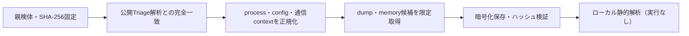

# Triage公開解析・後段取得証跡

## 完全ハッシュ一致

- [260924-ym7y3s1cjf](https://tria.ge/260924-ym7y3s1cjf): ファミリー候補 `未確定`、評価score `10`
- [260912-l8e4zatfjh](https://tria.ge/260912-l8e4zatfjh): ファミリー候補 `未確定`、評価score `10`

## プロセス・通信

- 観測process: `047d89c7260f3bca6d605f4bbc15b610402de82984e7e9478db9113721cf0369.exe, 2026-09-11_54632adb3b85ce8d08354d083a775703_akira_cobalt-strike_glassworm_rusty-stealer_satacom.exe, cmd.exe, net.exe, net1.exe, taskkill.exe, vssadmin.exe, vssvc.exe`
- raw commandは保存せず、command SHA-256と処理patternだけをJSONへ保持します。
- sandbox background trafficは`context_only`であり、C2へ自動昇格しません。

- 取得できませんでした。

## 後段取得物

- 取得できませんでした。

## 判定境界

Triage由来のfamily、process、config、通信は外部sandbox証跡です。Config extractorが返したendpointはC2候補として扱いますが、静的設定復元またはprocess帰属とprotocol応答が揃うまでは確認済みC2とはしません。取得成果物と検体は実行していません。
