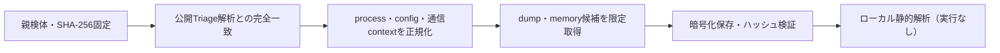

# Triage公開解析・後段取得証跡

## 完全ハッシュ一致

- [260819-twtetsgb76](https://tria.ge/260819-twtetsgb76): ファミリー候補 `未確定`、評価score `None`

## プロセス・通信

- 観測process: `取得できず`
- raw commandは保存せず、command SHA-256と処理patternだけをJSONへ保持します。
- sandbox background trafficは`context_only`であり、C2へ自動昇格しません。

- 取得できませんでした。

## 後段取得物

- `642e01932863a157b0a855b5e11afed5d09f9bcd89ea6e0ae6e913705ce10901` / `memory_image` / 4096 bytes / 親と同一: `false` / 静的解析: `partial`
- `068a92a12ec380601b8b9b0e59ec3fdd1a9bc7cd9ae3803924ac958490fc656a` / `memory_image` / 16777216 bytes / 親と同一: `false` / 静的解析: `partial`
- `5144352a9eabc87976de8131e247ac3acdd0bd1a2499269c9a11a76ed38a5039` / `memory_image` / 4096 bytes / 親と同一: `false` / 静的解析: `partial`
- `d23bb1f873fc6c6b1a32c42f49467bff99e08e6f7a5edef048a3af705fe75609` / `memory_image` / 4096 bytes / 親と同一: `false` / 静的解析: `partial`
- `7e51ab123e2d739ab00c28849b57fe82f1a2d8319f1f464e8c756fc4cae83ddf` / `memory_image` / 4096 bytes / 親と同一: `false` / 静的解析: `partial`
- `b8df4d0bbbcb28a9dd467b6bc1f7723ea7e79b13035ecfe990b167a30bf7c172` / `memory_image` / 4096 bytes / 親と同一: `false` / 静的解析: `partial`
- `39a4904010a44afc7de67cb856f47cd2fd706ccc674559a9b6530e83310145a9` / `memory_image` / 3043328 bytes / 親と同一: `false` / 静的解析: `partial`
- `fa87354cb80206db389f358300db25cfc68a0dbfd2cefca14bb41c83dad3c815` / `memory_image` / 4096 bytes / 親と同一: `false` / 静的解析: `partial`
- `e7ca7bd4a0bf82e9d02977335195cb0b38b75a02a888407ae3ab90150efab693` / `memory_image` / 253952 bytes / 親と同一: `false` / 静的解析: `partial`
- `7f73513d7459544616a7df03c747e698c3a774ed8e177970f8e31f20b55fcbf8` / `memory_image` / 253952 bytes / 親と同一: `false` / 静的解析: `partial`
- `c6ab38baff6e4a8c19be915ff374786f65c2ba9b1e036eca4e13fde2f44ca6c1` / `memory_image` / 253952 bytes / 親と同一: `false` / 静的解析: `partial`
- `a1729543f8f6a2a687d25c7b6e277da713bebe5de4f36d28de09b935635e76a6` / `memory_image` / 253952 bytes / 親と同一: `false` / 静的解析: `partial`
- `14d5d5b9d4be24cc5edd6489dac044e0c11c61cbf18cd28cc509606ec34f3e6a` / `memory_image` / 270336 bytes / 親と同一: `false` / 静的解析: `partial`
- `5c964288d183c5907d2de163615455eb983c2804fd1009590b8a54d57056526c` / `memory_image` / 270336 bytes / 親と同一: `false` / 静的解析: `partial`
- `9ac30ea7b4fe363217708fac08bf9b59b82765be0a25c43ebaa20277b9577b10` / `memory_image` / 270336 bytes / 親と同一: `false` / 静的解析: `partial`
- `37c475e80cbd52f8fbfc25e49e601992a71c8b0fd2769b7a45c6bb74bc229572` / `memory_image` / 253952 bytes / 親と同一: `false` / 静的解析: `partial`
- `309532f63b44564ac571cf9401d2f175724cae704d7006f54ed7acd49ab7f814` / `memory_image` / 253952 bytes / 親と同一: `false` / 静的解析: `partial`
- `75707ae33f2018a2c6d05e927982d9ddeba9b725150d762e57f43c386c192cec` / `memory_image` / 253952 bytes / 親と同一: `false` / 静的解析: `partial`
- `d20b4c4b782934a20e67edbce0e727a5dc37f33bb25bcc2a7a152fd958129c97` / `memory_image` / 253952 bytes / 親と同一: `false` / 静的解析: `partial`
- `67bd72fec18dea62ae48238551b21991d8ffc785fbb91e8c2d56e151791f7516` / `memory_image` / 253952 bytes / 親と同一: `false` / 静的解析: `partial`
- `1f958986fd34d411e2cc0d5bcdad6020abdf09d89e9e3e1708df50acf9ce9fa1` / `memory_image` / 253952 bytes / 親と同一: `false` / 静的解析: `partial`
- `4ba6fc0879914f153401f89955b66cb9d0da2b4e54a6031026f3fd4ee22bfe65` / `memory_image` / 253952 bytes / 親と同一: `false` / 静的解析: `partial`
- `95c900893993e021260d3141a1838182cec047e4346f81e9b109ab431281baee` / `memory_image` / 253952 bytes / 親と同一: `false` / 静的解析: `partial`
- `2a8f4181712421f90a2c28c97be61f8efd003b817a481df087467e3933128721` / `memory_image` / 253952 bytes / 親と同一: `false` / 静的解析: `partial`
- `aeea7601b6590ec77fe3fb90e04b51f43422c3cd5164a15da9a6e6ec5fccf16f` / `memory_image` / 253952 bytes / 親と同一: `false` / 静的解析: `partial`
- `93b6a7e935acaa848791487398b663813991c02ebd07dfc97312119688d19518` / `memory_image` / 253952 bytes / 親と同一: `false` / 静的解析: `partial`
- `5b8098c66dbe2116ef5a83ec212ad76a76ec5edaf0963276c1e95c7e80508a49` / `memory_image` / 253952 bytes / 親と同一: `false` / 静的解析: `partial`
- `7f5d142e9b413e5863f2babfa965a4dc88b5f054a11c3eaeb104cdea85002690` / `memory_image` / 253952 bytes / 親と同一: `false` / 静的解析: `partial`
- `0cba5a9ece194680b8951382e33a5ac27c2b3257787207a19f3b7fb57eee9684` / `memory_image` / 253952 bytes / 親と同一: `false` / 静的解析: `partial`
- `6ea5fb566aa73201573a46382c4ef629e83598dab57284e1ded4a774521b3b18` / `memory_image` / 253952 bytes / 親と同一: `false` / 静的解析: `partial`
- `24dd0c3a1b97bb9d2fa6c0a32f98635310933e1ded6d107e528ea92203c2b0b3` / `memory_image` / 253952 bytes / 親と同一: `false` / 静的解析: `partial`
- `540a864d66ae3de41447c8225be59b4b02f5ea3064a70c6d72f3c0ff6367d4a7` / `memory_image` / 253952 bytes / 親と同一: `false` / 静的解析: `partial`
- `166cf3a71669883db53ae3282898b55478b083c6970bec4da8094c1b3f7e5848` / `memory_image` / 253952 bytes / 親と同一: `false` / 静的解析: `partial`
- `599e0dd4575bd994f48b716d70bcaf6c1b2ebbdb249ff9a4e55e921fcee5ac24` / `memory_image` / 253952 bytes / 親と同一: `false` / 静的解析: `partial`
- `f49e19f99d1c09633a40649706555be12dafbd160c50439440319ad81a0a0351` / `memory_image` / 3043328 bytes / 親と同一: `false` / 静的解析: `partial`
- `31ed07fba78a22cdd3affbc836fd0f1075d851c717cd5b4741a19bc78f3626bb` / `memory_image` / 3043328 bytes / 親と同一: `false` / 静的解析: `partial`
- `2bd0fe84bd90a8aff7deaec8e68bb87cc72b0a539bd0d4a6fbae222f1d6b2f35` / `memory_image` / 4096 bytes / 親と同一: `false` / 静的解析: `partial`
- `ed2b1c86ea68c00d57c6b4ea002ebe61803776aa64c18e10ed3575bce69c5ec7` / `memory_image` / 4096 bytes / 親と同一: `false` / 静的解析: `partial`
- `284faf83774a702dc57502b6ce6fc54e37dfb2eaa01e6feaafb90fa96b717604` / `memory_image` / 4096 bytes / 親と同一: `false` / 静的解析: `partial`
- `722efaa7b90364b6681d47fa99b0f217c0b17d3e8d1a1e357fb39ddc81a9f2de` / `memory_image` / 4096 bytes / 親と同一: `false` / 静的解析: `partial`
- `30a67ea7c8070619d100a4001c53bb1f42f065eb3beef5aaa296c17d1a320087` / `memory_image` / 4096 bytes / 親と同一: `false` / 静的解析: `partial`
- `ca27b46cfcf1f5f7c7ea9668beab32ff35e85c481393e0e23f24cca55faa6849` / `memory_image` / 4096 bytes / 親と同一: `false` / 静的解析: `partial`
- `0977c2c2f12ce5c11dbe1541cb2ea145fa063de173ac0bc226bf01700c9b1b4e` / `memory_image` / 16777216 bytes / 親と同一: `false` / 静的解析: `partial`
- `8263adfb1acee3ce21cae9a32e199930752b918d363883974bf742df7086d25a` / `memory_image` / 253952 bytes / 親と同一: `false` / 静的解析: `partial`

## 判定境界

Triage由来のfamily、process、config、通信は外部sandbox証跡です。Config extractorが返したendpointはC2候補として扱いますが、静的設定復元またはprocess帰属とprotocol応答が揃うまでは確認済みC2とはしません。取得成果物と検体は実行していません。
