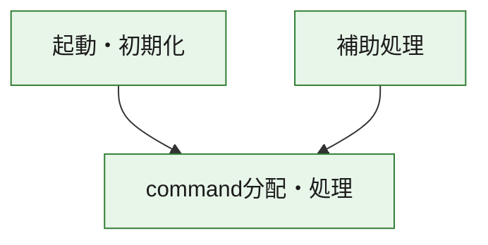
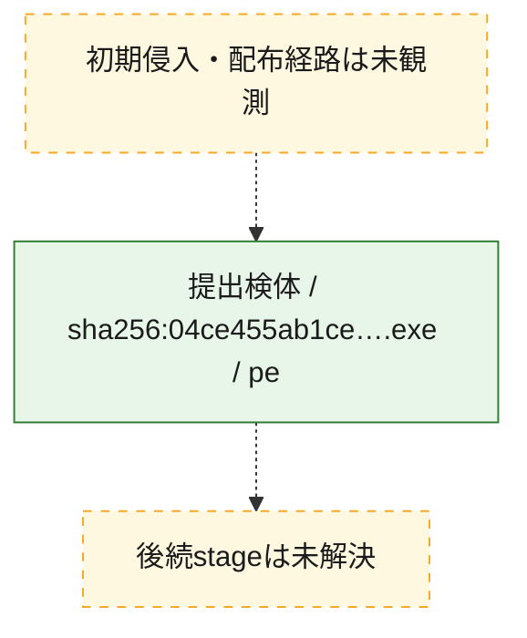
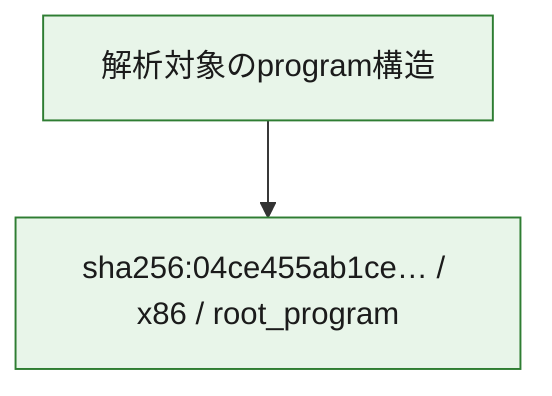

# 全体ロジック：04ce455ab1ce258073d3261e137201cdabd87444011fe4a487c4e92d80594e22

代表関数の静的証跡から、起動・初期化、command分配・処理の処理群を確認しました。

## 読み方

- phaseの掲載順は解析上の整理順です。observed_call_edgesがない段階間の実行順を断定しません。
- 図の実線は静的に観測した関係、点線と黄色のノードは未観測・未解決の関係を示します。
- 図は静的な要約であり、動的実行を再現するものではありません。
- 詳細な関数解説とfingerprintは[STATIC-LOGIC.md](STATIC-LOGIC.md)を参照してください。

## 静的可視化

### 実行フロー

### 感染チェーン

### モジュール関係

## 処理段階

### 1. 起動・初期化

entry pointから初期化と後続処理への移行を確認します。
確度: `confirmed_static_function_evidence`

- `04ce455ab1ce258073d3261e137201cdabd87444011fe4a487c4e92d80594e22:ghidra:1400957b0` — 初期化と主要処理への分岐を行う入口関数です。 状態: `succeeded`、選定理由: `entry_point`, `meaningful_symbol_name`, `reviewed_call_centrality:22`, `role:entrypoint`

### 2. command分配・処理

受信commandやtaskの解釈、分配、個別handlerへの移行を確認します。
確度: `confirmed_static_function_evidence_with_limits`

- `04ce455ab1ce258073d3261e137201cdabd87444011fe4a487c4e92d80594e22:ghidra:140099de0` — commandの解釈、分配、または個別処理を担当する関数です。 状態: `limited_bad_instruction_or_flow`、選定理由: `meaningful_symbol_name`, `reviewed_call_centrality:2`, `role:command_dispatch_or_handler`

### 3. 補助処理

主要処理を支える一般内部関数またはlibrary処理を確認します。
確度: `confirmed_static_function_evidence`

- `04ce455ab1ce258073d3261e137201cdabd87444011fe4a487c4e92d80594e22:ghidra:140001020` — 検体内部の一般処理を実装する関数です。 状態: `succeeded`、選定理由: `context_representative`
- `04ce455ab1ce258073d3261e137201cdabd87444011fe4a487c4e92d80594e22:ghidra:140001030` — 検体内部の一般処理を実装する関数です。 状態: `succeeded`、選定理由: `context_representative`
- `04ce455ab1ce258073d3261e137201cdabd87444011fe4a487c4e92d80594e22:ghidra:140001040` — 検体内部の一般処理を実装する関数です。 状態: `succeeded`、選定理由: `context_representative`
- `04ce455ab1ce258073d3261e137201cdabd87444011fe4a487c4e92d80594e22:ghidra:140001080` — 検体内部の一般処理を実装する関数です。 状態: `succeeded`、選定理由: `context_representative`
- `04ce455ab1ce258073d3261e137201cdabd87444011fe4a487c4e92d80594e22:ghidra:1400010c0` — 検体内部の一般処理を実装する関数です。 状態: `succeeded`、選定理由: `context_representative`
- `04ce455ab1ce258073d3261e137201cdabd87444011fe4a487c4e92d80594e22:ghidra:140001130` — 検体内部の一般処理を実装する関数です。 状態: `succeeded`、選定理由: `context_representative`
- `04ce455ab1ce258073d3261e137201cdabd87444011fe4a487c4e92d80594e22:ghidra:140001190` — 検体内部の一般処理を実装する関数です。 状態: `succeeded`、選定理由: `context_representative`
- `04ce455ab1ce258073d3261e137201cdabd87444011fe4a487c4e92d80594e22:ghidra:140001210` — 検体内部の一般処理を実装する関数です。 状態: `succeeded`、選定理由: `context_representative`
- `04ce455ab1ce258073d3261e137201cdabd87444011fe4a487c4e92d80594e22:ghidra:140001250` — 検体内部の一般処理を実装する関数です。 状態: `succeeded`、選定理由: `context_representative`, `reviewed_call_centrality:2`
- `04ce455ab1ce258073d3261e137201cdabd87444011fe4a487c4e92d80594e22:ghidra:1400012b0` — 検体内部の一般処理を実装する関数です。 状態: `succeeded`、選定理由: `context_representative`, `reviewed_call_centrality:1`
- `04ce455ab1ce258073d3261e137201cdabd87444011fe4a487c4e92d80594e22:ghidra:1400012d0` — 検体内部の一般処理を実装する関数です。 状態: `succeeded`、選定理由: `context_representative`, `reviewed_call_centrality:1`
- `04ce455ab1ce258073d3261e137201cdabd87444011fe4a487c4e92d80594e22:ghidra:1400012f0` — 検体内部の一般処理を実装する関数です。 状態: `succeeded`、選定理由: `context_representative`, `reviewed_call_centrality:25`
- `04ce455ab1ce258073d3261e137201cdabd87444011fe4a487c4e92d80594e22:ghidra:1400014f0` — 検体内部の一般処理を実装する関数です。 状態: `succeeded`、選定理由: `context_representative`, `reviewed_call_centrality:1`
- `04ce455ab1ce258073d3261e137201cdabd87444011fe4a487c4e92d80594e22:ghidra:140001530` — 検体内部の一般処理を実装する関数です。 状態: `succeeded`、選定理由: `context_representative`, `reviewed_call_centrality:1`
- `04ce455ab1ce258073d3261e137201cdabd87444011fe4a487c4e92d80594e22:ghidra:140001570` — 検体内部の一般処理を実装する関数です。 状態: `succeeded`、選定理由: `context_representative`, `reviewed_call_centrality:1`
- `04ce455ab1ce258073d3261e137201cdabd87444011fe4a487c4e92d80594e22:ghidra:1400015b0` — 検体内部の一般処理を実装する関数です。 状態: `succeeded`、選定理由: `context_representative`, `reviewed_call_centrality:1`
- `04ce455ab1ce258073d3261e137201cdabd87444011fe4a487c4e92d80594e22:ghidra:1400015f0` — 検体内部の一般処理を実装する関数です。 状態: `succeeded`、選定理由: `context_representative`, `reviewed_call_centrality:1`
- `04ce455ab1ce258073d3261e137201cdabd87444011fe4a487c4e92d80594e22:ghidra:140001630` — 検体内部の一般処理を実装する関数です。 状態: `succeeded`、選定理由: `context_representative`, `reviewed_call_centrality:1`
- `04ce455ab1ce258073d3261e137201cdabd87444011fe4a487c4e92d80594e22:ghidra:140001670` — 検体内部の一般処理を実装する関数です。 状態: `succeeded`、選定理由: `context_representative`, `reviewed_call_centrality:1`
- `04ce455ab1ce258073d3261e137201cdabd87444011fe4a487c4e92d80594e22:ghidra:1400016b0` — 検体内部の一般処理を実装する関数です。 状態: `succeeded`、選定理由: `context_representative`, `reviewed_call_centrality:1`
- `04ce455ab1ce258073d3261e137201cdabd87444011fe4a487c4e92d80594e22:ghidra:1400016f0` — 検体内部の一般処理を実装する関数です。 状態: `succeeded`、選定理由: `context_representative`, `reviewed_call_centrality:1`
- `04ce455ab1ce258073d3261e137201cdabd87444011fe4a487c4e92d80594e22:ghidra:140001730` — 検体内部の一般処理を実装する関数です。 状態: `succeeded`、選定理由: `context_representative`, `reviewed_call_centrality:1`
- `04ce455ab1ce258073d3261e137201cdabd87444011fe4a487c4e92d80594e22:ghidra:140001770` — 検体内部の一般処理を実装する関数です。 状態: `succeeded`、選定理由: `context_representative`, `reviewed_call_centrality:1`
- `04ce455ab1ce258073d3261e137201cdabd87444011fe4a487c4e92d80594e22:ghidra:1400017b0` — 検体内部の一般処理を実装する関数です。 状態: `succeeded`、選定理由: `context_representative`, `reviewed_call_centrality:1`
- `04ce455ab1ce258073d3261e137201cdabd87444011fe4a487c4e92d80594e22:ghidra:1400017f0` — 検体内部の一般処理を実装する関数です。 状態: `succeeded`、選定理由: `context_representative`, `reviewed_call_centrality:1`
- `04ce455ab1ce258073d3261e137201cdabd87444011fe4a487c4e92d80594e22:ghidra:140001830` — 検体内部の一般処理を実装する関数です。 状態: `succeeded`、選定理由: `context_representative`
- `04ce455ab1ce258073d3261e137201cdabd87444011fe4a487c4e92d80594e22:ghidra:140001840` — 検体内部の一般処理を実装する関数です。 状態: `succeeded`、選定理由: `context_representative`, `reviewed_call_centrality:2`
- `04ce455ab1ce258073d3261e137201cdabd87444011fe4a487c4e92d80594e22:ghidra:140001880` — 検体内部の一般処理を実装する関数です。 状態: `succeeded`、選定理由: `context_representative`, `reviewed_call_centrality:1`
- `04ce455ab1ce258073d3261e137201cdabd87444011fe4a487c4e92d80594e22:ghidra:14004c380` — 検体内部の一般処理を実装する関数です。 状態: `succeeded`、選定理由: `meaningful_symbol_name`
- `04ce455ab1ce258073d3261e137201cdabd87444011fe4a487c4e92d80594e22:ghidra:140095a00` — compiler生成処理または汎用library処理とみられる関数です。 状態: `succeeded`、選定理由: `entry_point`, `meaningful_symbol_name`, `reviewed_call_centrality:1`

## 観測したcall関係

- `04ce455ab1ce258073d3261e137201cdabd87444011fe4a487c4e92d80594e22:ghidra:1400012f0` → `04ce455ab1ce258073d3261e137201cdabd87444011fe4a487c4e92d80594e22:ghidra:1400012b0` （`support` → `support`）
- `04ce455ab1ce258073d3261e137201cdabd87444011fe4a487c4e92d80594e22:ghidra:1400012f0` → `04ce455ab1ce258073d3261e137201cdabd87444011fe4a487c4e92d80594e22:ghidra:1400012d0` （`support` → `support`）
- `04ce455ab1ce258073d3261e137201cdabd87444011fe4a487c4e92d80594e22:ghidra:1400014f0` → `04ce455ab1ce258073d3261e137201cdabd87444011fe4a487c4e92d80594e22:ghidra:1400012f0` （`support` → `support`）
- `04ce455ab1ce258073d3261e137201cdabd87444011fe4a487c4e92d80594e22:ghidra:140001530` → `04ce455ab1ce258073d3261e137201cdabd87444011fe4a487c4e92d80594e22:ghidra:1400012f0` （`support` → `support`）
- `04ce455ab1ce258073d3261e137201cdabd87444011fe4a487c4e92d80594e22:ghidra:140001570` → `04ce455ab1ce258073d3261e137201cdabd87444011fe4a487c4e92d80594e22:ghidra:1400012f0` （`support` → `support`）
- `04ce455ab1ce258073d3261e137201cdabd87444011fe4a487c4e92d80594e22:ghidra:1400015b0` → `04ce455ab1ce258073d3261e137201cdabd87444011fe4a487c4e92d80594e22:ghidra:1400012f0` （`support` → `support`）
- `04ce455ab1ce258073d3261e137201cdabd87444011fe4a487c4e92d80594e22:ghidra:1400015f0` → `04ce455ab1ce258073d3261e137201cdabd87444011fe4a487c4e92d80594e22:ghidra:1400012f0` （`support` → `support`）
- `04ce455ab1ce258073d3261e137201cdabd87444011fe4a487c4e92d80594e22:ghidra:140001630` → `04ce455ab1ce258073d3261e137201cdabd87444011fe4a487c4e92d80594e22:ghidra:1400012f0` （`support` → `support`）
- `04ce455ab1ce258073d3261e137201cdabd87444011fe4a487c4e92d80594e22:ghidra:140001670` → `04ce455ab1ce258073d3261e137201cdabd87444011fe4a487c4e92d80594e22:ghidra:1400012f0` （`support` → `support`）
- `04ce455ab1ce258073d3261e137201cdabd87444011fe4a487c4e92d80594e22:ghidra:1400016b0` → `04ce455ab1ce258073d3261e137201cdabd87444011fe4a487c4e92d80594e22:ghidra:1400012f0` （`support` → `support`）
- `04ce455ab1ce258073d3261e137201cdabd87444011fe4a487c4e92d80594e22:ghidra:1400016f0` → `04ce455ab1ce258073d3261e137201cdabd87444011fe4a487c4e92d80594e22:ghidra:1400012f0` （`support` → `support`）
- `04ce455ab1ce258073d3261e137201cdabd87444011fe4a487c4e92d80594e22:ghidra:140001730` → `04ce455ab1ce258073d3261e137201cdabd87444011fe4a487c4e92d80594e22:ghidra:1400012f0` （`support` → `support`）
- `04ce455ab1ce258073d3261e137201cdabd87444011fe4a487c4e92d80594e22:ghidra:140001770` → `04ce455ab1ce258073d3261e137201cdabd87444011fe4a487c4e92d80594e22:ghidra:1400012f0` （`support` → `support`）
- `04ce455ab1ce258073d3261e137201cdabd87444011fe4a487c4e92d80594e22:ghidra:1400017b0` → `04ce455ab1ce258073d3261e137201cdabd87444011fe4a487c4e92d80594e22:ghidra:1400012f0` （`support` → `support`）
- `04ce455ab1ce258073d3261e137201cdabd87444011fe4a487c4e92d80594e22:ghidra:1400017f0` → `04ce455ab1ce258073d3261e137201cdabd87444011fe4a487c4e92d80594e22:ghidra:1400012f0` （`support` → `support`）
- `04ce455ab1ce258073d3261e137201cdabd87444011fe4a487c4e92d80594e22:ghidra:1400957b0` → `04ce455ab1ce258073d3261e137201cdabd87444011fe4a487c4e92d80594e22:ghidra:140099de0` （`startup` → `dispatch`）
- `04ce455ab1ce258073d3261e137201cdabd87444011fe4a487c4e92d80594e22:ghidra:140095a00` → `04ce455ab1ce258073d3261e137201cdabd87444011fe4a487c4e92d80594e22:ghidra:140099de0` （`support` → `dispatch`）
- `ghidra-function:076472527547e8f64b9b5846` → `ghidra-function:4fa552e2fcd57c7c3a27d6c2` （`unclassified` → `unclassified`）
- `ghidra-function:25d415e7fb0c5b1efed974ed` → `ghidra-function:4fa552e2fcd57c7c3a27d6c2` （`unclassified` → `unclassified`）
- `ghidra-function:28982ac04846791c316be045` → `ghidra-function:4fa552e2fcd57c7c3a27d6c2` （`unclassified` → `unclassified`）
- `ghidra-function:342b82b81dedb16f728e3275` → `ghidra-function:a3571a8af203ab03fc4e3fb0` （`unclassified` → `unclassified`）
- `ghidra-function:4b088e1e6ebe494e925b6a7f` → `ghidra-function:4fa552e2fcd57c7c3a27d6c2` （`unclassified` → `unclassified`）
- `ghidra-function:4fa552e2fcd57c7c3a27d6c2` → `ghidra-external:00e0235c84eab9d6868b157a` （`unclassified` → `unclassified`）
- `ghidra-function:4fa552e2fcd57c7c3a27d6c2` → `ghidra-external:0e8d346e223501e3bcfddb35` （`unclassified` → `unclassified`）
- `ghidra-function:4fa552e2fcd57c7c3a27d6c2` → `ghidra-external:49fc5937092b0fa8be72b7dc` （`unclassified` → `unclassified`）
- `ghidra-function:4fa552e2fcd57c7c3a27d6c2` → `ghidra-external:d1e59b405e22496176bbfb00` （`unclassified` → `unclassified`）
- `ghidra-function:4fa552e2fcd57c7c3a27d6c2` → `ghidra-function:518b7c20c1973669e11c7c79` （`unclassified` → `unclassified`）
- `ghidra-function:4fa552e2fcd57c7c3a27d6c2` → `ghidra-function:5ddfc7e6c291e38c76da568a` （`unclassified` → `unclassified`）
- `ghidra-function:4fa552e2fcd57c7c3a27d6c2` → `ghidra-function:7f66412d1b5ee46b768d41dc` （`unclassified` → `unclassified`）
- `ghidra-function:4fa552e2fcd57c7c3a27d6c2` → `ghidra-function:8081b7732ca9c4cc4f052dc5` （`unclassified` → `unclassified`）
- `ghidra-function:4fa552e2fcd57c7c3a27d6c2` → `ghidra-function:923bae543e1c6485fdb275f1` （`unclassified` → `unclassified`）
- `ghidra-function:4fa552e2fcd57c7c3a27d6c2` → `ghidra-function:95c09155d2d519e504faef37` （`unclassified` → `unclassified`）
- `ghidra-function:4fa552e2fcd57c7c3a27d6c2` → `ghidra-function:9fdaf100f57c0d2ae958081d` （`unclassified` → `unclassified`）
- `ghidra-function:4fa552e2fcd57c7c3a27d6c2` → `ghidra-function:fa7e0ea428ab87255b5d135a` （`unclassified` → `unclassified`）
- `ghidra-function:5d83f73a7b2d268273175169` → `ghidra-external:5132e159079b83e9b73d0dae` （`unclassified` → `unclassified`）
- `ghidra-function:5d83f73a7b2d268273175169` → `ghidra-external:7f14602f9e2fc7c2166f5d99` （`unclassified` → `unclassified`）
- `ghidra-function:6a09b2d65d54d9097cea5148` → `ghidra-function:4fa552e2fcd57c7c3a27d6c2` （`unclassified` → `unclassified`）
- `ghidra-function:7f3dec55ce23e4b506924746` → `ghidra-external:00e0235c84eab9d6868b157a` （`unclassified` → `unclassified`）
- `ghidra-function:7f3dec55ce23e4b506924746` → `ghidra-function:9fdaf100f57c0d2ae958081d` （`unclassified` → `unclassified`）
- `ghidra-function:8e886e666966b5e332930808` → `ghidra-function:4fa552e2fcd57c7c3a27d6c2` （`unclassified` → `unclassified`）
- `ghidra-function:969e50dfa73d82d9701c0f43` → `ghidra-function:4fa552e2fcd57c7c3a27d6c2` （`unclassified` → `unclassified`）
- `ghidra-function:9b7d09ccc9fb78af84cbdfd0` → `ghidra-function:4fa552e2fcd57c7c3a27d6c2` （`unclassified` → `unclassified`）
- `ghidra-function:b6cad6ccad86cf35517da6f7` → `ghidra-function:4fa552e2fcd57c7c3a27d6c2` （`unclassified` → `unclassified`）
- `ghidra-function:bbd2b784cca20d444804e9ac` → `ghidra-function:4fa552e2fcd57c7c3a27d6c2` （`unclassified` → `unclassified`）
- `ghidra-function:bdf7b493b920c853a30e423c` → `ghidra-function:4fa552e2fcd57c7c3a27d6c2` （`unclassified` → `unclassified`）
- `ghidra-function:da00f52d6f03cea0b310b869` → `ghidra-function:4fa552e2fcd57c7c3a27d6c2` （`unclassified` → `unclassified`）
- `ghidra-function:e30b7ee9a23ddeeeb603578f` → `ghidra-external:00e0235c84eab9d6868b157a` （`unclassified` → `unclassified`）
- `ghidra-function:e30b7ee9a23ddeeeb603578f` → `ghidra-external:17c256180eb65a5065029365` （`unclassified` → `unclassified`）
- `ghidra-function:e30b7ee9a23ddeeeb603578f` → `ghidra-external:25581cd8998197207e0ef8e3` （`unclassified` → `unclassified`）
- `ghidra-function:e30b7ee9a23ddeeeb603578f` → `ghidra-external:3b91c24ac0c2976a46dce6d0` （`unclassified` → `unclassified`）
- `ghidra-function:e30b7ee9a23ddeeeb603578f` → `ghidra-external:3d6d983cf50ecf26f63fa95b` （`unclassified` → `unclassified`）
- `ghidra-function:e30b7ee9a23ddeeeb603578f` → `ghidra-external:4c92a4e7ac0623a64cd41577` （`unclassified` → `unclassified`）
- `ghidra-function:e30b7ee9a23ddeeeb603578f` → `ghidra-external:65ebb7eb0f451aa800fcccb6` （`unclassified` → `unclassified`）
- `ghidra-function:e30b7ee9a23ddeeeb603578f` → `ghidra-external:75e0aa2ef4e6cded9e540028` （`unclassified` → `unclassified`）
- `ghidra-function:e30b7ee9a23ddeeeb603578f` → `ghidra-external:8f93df32ac4df7eb3bf7765d` （`unclassified` → `unclassified`）
- `ghidra-function:e30b7ee9a23ddeeeb603578f` → `ghidra-external:d19770a3e870ba8c93242150` （`unclassified` → `unclassified`）
- `ghidra-function:e30b7ee9a23ddeeeb603578f` → `ghidra-external:ed9f7b44311a9afa30ba95e2` （`unclassified` → `unclassified`）
- `ghidra-function:e30b7ee9a23ddeeeb603578f` → `ghidra-external:f7b74b7bad91883ff7a95e46` （`unclassified` → `unclassified`）
- `ghidra-function:e30b7ee9a23ddeeeb603578f` → `ghidra-external:fae7fe740bdc08ca9eb5ef07` （`unclassified` → `unclassified`）
- `ghidra-function:e30b7ee9a23ddeeeb603578f` → `ghidra-function:08b6590edd4c3e153efb2881` （`unclassified` → `unclassified`）
- `ghidra-function:e30b7ee9a23ddeeeb603578f` → `ghidra-function:1c049398dec3e77107564d3d` （`unclassified` → `unclassified`）
- `ghidra-function:e30b7ee9a23ddeeeb603578f` → `ghidra-function:22e6a395e3eb863f391c0134` （`unclassified` → `unclassified`）
- `ghidra-function:e30b7ee9a23ddeeeb603578f` → `ghidra-function:39d4d6c260d1875368dae21b` （`unclassified` → `unclassified`）
- `ghidra-function:e30b7ee9a23ddeeeb603578f` → `ghidra-function:87072397f1803aa18d524b53` （`unclassified` → `unclassified`）
- `ghidra-function:e30b7ee9a23ddeeeb603578f` → `ghidra-function:8823df06c3a8ede1eecda4f1` （`unclassified` → `unclassified`）
- `ghidra-function:e30b7ee9a23ddeeeb603578f` → `ghidra-function:af5a70ecc44a2eb1de3c51ee` （`unclassified` → `unclassified`）
- `ghidra-function:e30b7ee9a23ddeeeb603578f` → `ghidra-function:d3a7fe3aac45c07888460757` （`unclassified` → `unclassified`）
- `ghidra-function:e30b7ee9a23ddeeeb603578f` → `ghidra-function:efa2de9cbc5320d379a05ecb` （`unclassified` → `unclassified`）
- `ghidra-function:ea6faf4c009e2384267ff9d7` → `ghidra-function:8823df06c3a8ede1eecda4f1` （`unclassified` → `unclassified`）
- `ghidra-function:f28263671015edd9219d89b8` → `ghidra-function:4fa552e2fcd57c7c3a27d6c2` （`unclassified` → `unclassified`）

## 解析範囲と制約

- 選定外関数は全体inventoryへ残しますが、関数本体の個別解説対象にはしていません。
- indirect call、難読化、packer、VM、壊れたcontrol flowによりcall関係が欠落する場合があります。
- 文書は静的解析に基づき、検体実行や外部通信による動的確認は行っていません。
