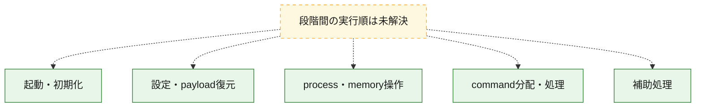
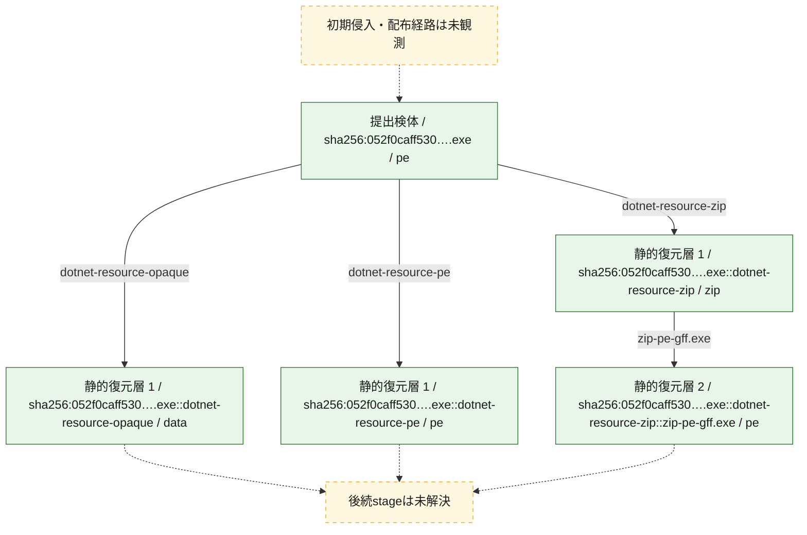
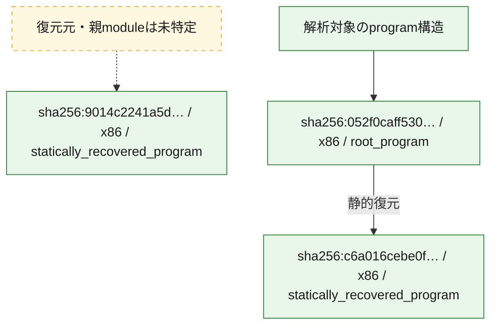

# 全体ロジック：052f0caff530a67f9a17df5795806d9b01a551f309e434cd4eb92fba8e024051

代表関数の静的証跡から、起動・初期化、設定・payload復元、process・memory操作、command分配・処理の処理群を確認しました。

## 読み方

- phaseの掲載順は解析上の整理順です。observed_call_edgesがない段階間の実行順を断定しません。
- 図の実線は静的に観測した関係、点線と黄色のノードは未観測・未解決の関係を示します。
- 図は静的な要約であり、動的実行を再現するものではありません。
- 詳細な関数解説とfingerprintは[STATIC-LOGIC.md](STATIC-LOGIC.md)を参照してください。

## 静的可視化

### 実行フロー

### 感染チェーン

### モジュール関係

## 処理段階

### 1. 起動・初期化

entry pointから初期化と後続処理への移行を確認します。
確度: `confirmed_static_function_evidence`

- `9014c2241a5d252713c753102385537d83ff67cebaa80131b8addd7d3ec7c381:cil:0x06000088` — 初期化と主要処理への分岐を行う入口関数です。 状態: `succeeded`、選定理由: `entry_point`, `reviewed_call_centrality:6`
- `9014c2241a5d252713c753102385537d83ff67cebaa80131b8addd7d3ec7c381:cil:0x06000089` — 初期化と主要処理への分岐を行う入口関数です。 状態: `succeeded`、選定理由: `entry_point`, `reviewed_call_centrality:6`
- `9014c2241a5d252713c753102385537d83ff67cebaa80131b8addd7d3ec7c381:cil:0x0600008b` — 初期化と主要処理への分岐を行う入口関数です。 状態: `succeeded`、選定理由: `entry_point`, `reviewed_call_centrality:2`
- `9014c2241a5d252713c753102385537d83ff67cebaa80131b8addd7d3ec7c381:cil:0x0600008c` — 初期化と主要処理への分岐を行う入口関数です。 状態: `succeeded`、選定理由: `entry_point`, `large_function:instructions=556`, `reviewed_call_centrality:80`
- `9014c2241a5d252713c753102385537d83ff67cebaa80131b8addd7d3ec7c381:cil:0x0600008d` — 初期化と主要処理への分岐を行う入口関数です。 状態: `succeeded`、選定理由: `entry_point`, `reviewed_call_centrality:2`
- `052f0caff530a67f9a17df5795806d9b01a551f309e434cd4eb92fba8e024051:cil:0x06000088` — 初期化と主要処理への分岐を行う入口関数です。 状態: `succeeded`、選定理由: `entry_point`, `reviewed_call_centrality:6`
- `052f0caff530a67f9a17df5795806d9b01a551f309e434cd4eb92fba8e024051:cil:0x06000089` — 初期化と主要処理への分岐を行う入口関数です。 状態: `succeeded`、選定理由: `entry_point`, `reviewed_call_centrality:6`
- `052f0caff530a67f9a17df5795806d9b01a551f309e434cd4eb92fba8e024051:cil:0x0600008b` — 初期化と主要処理への分岐を行う入口関数です。 状態: `succeeded`、選定理由: `entry_point`, `reviewed_call_centrality:2`
- `052f0caff530a67f9a17df5795806d9b01a551f309e434cd4eb92fba8e024051:cil:0x0600008f` — 初期化と主要処理への分岐を行う入口関数です。 状態: `succeeded`、選定理由: `entry_point`

### 2. 設定・payload復元

設定、resource、payload、暗号化データの復元・変換を確認します。
確度: `confirmed_static_function_evidence`

- `9014c2241a5d252713c753102385537d83ff67cebaa80131b8addd7d3ec7c381:cil:0x06000006` — 暗号、hash、encoding、または復号処理に関係する関数です。 状態: `succeeded`、選定理由: `reviewed_call_centrality:4`, `role:cryptographic_transform`
- `9014c2241a5d252713c753102385537d83ff67cebaa80131b8addd7d3ec7c381:cil:0x0600005f` — 暗号、hash、encoding、または復号処理に関係する関数です。 状態: `succeeded`、選定理由: `reviewed_call_centrality:8`, `role:cryptographic_transform`
- `9014c2241a5d252713c753102385537d83ff67cebaa80131b8addd7d3ec7c381:cil:0x06000095` — 設定、resource、payloadなどの解析・変換を行う関数です。 状態: `succeeded`、選定理由: `reviewed_call_centrality:6`, `role:config_or_data_transform`
- `052f0caff530a67f9a17df5795806d9b01a551f309e434cd4eb92fba8e024051:cil:0x0600005f` — 暗号、hash、encoding、または復号処理に関係する関数です。 状態: `succeeded`、選定理由: `reviewed_call_centrality:8`, `role:cryptographic_transform`
- `052f0caff530a67f9a17df5795806d9b01a551f309e434cd4eb92fba8e024051:cil:0x06000095` — 設定、resource、payloadなどの解析・変換を行う関数です。 状態: `succeeded`、選定理由: `reviewed_call_centrality:6`, `role:config_or_data_transform`

### 3. process・memory操作

process、thread、module、memory操作と実行移行を確認します。
確度: `confirmed_static_function_evidence`

- `052f0caff530a67f9a17df5795806d9b01a551f309e434cd4eb92fba8e024051:cil:0x06000138` — process、thread、module、またはmemory操作に関係する関数です。 状態: `succeeded`、選定理由: `reviewed_call_centrality:24`, `role:process_or_memory_operation`

### 4. command分配・処理

受信commandやtaskの解釈、分配、個別handlerへの移行を確認します。
確度: `confirmed_static_function_evidence`

- `9014c2241a5d252713c753102385537d83ff67cebaa80131b8addd7d3ec7c381:cil:0x0600011f` — commandの解釈、分配、または個別処理を担当する関数です。 状態: `succeeded`、選定理由: `reviewed_call_centrality:6`, `role:command_dispatch_or_handler`
- `9014c2241a5d252713c753102385537d83ff67cebaa80131b8addd7d3ec7c381:cil:0x060001d9` — commandの解釈、分配、または個別処理を担当する関数です。 状態: `succeeded`、選定理由: `reviewed_call_centrality:4`, `role:command_dispatch_or_handler`
- `9014c2241a5d252713c753102385537d83ff67cebaa80131b8addd7d3ec7c381:cil:0x060001e0` — commandの解釈、分配、または個別処理を担当する関数です。 状態: `succeeded`、選定理由: `reviewed_call_centrality:6`, `role:command_dispatch_or_handler`
- `9014c2241a5d252713c753102385537d83ff67cebaa80131b8addd7d3ec7c381:cil:0x060001e2` — commandの解釈、分配、または個別処理を担当する関数です。 状態: `succeeded`、選定理由: `reviewed_call_centrality:4`, `role:command_dispatch_or_handler`
- `9014c2241a5d252713c753102385537d83ff67cebaa80131b8addd7d3ec7c381:cil:0x060001e9` — commandの解釈、分配、または個別処理を担当する関数です。 状態: `succeeded`、選定理由: `reviewed_call_centrality:6`, `role:command_dispatch_or_handler`
- `9014c2241a5d252713c753102385537d83ff67cebaa80131b8addd7d3ec7c381:cil:0x060001f2` — commandの解釈、分配、または個別処理を担当する関数です。 状態: `succeeded`、選定理由: `reviewed_call_centrality:6`, `role:command_dispatch_or_handler`
- `9014c2241a5d252713c753102385537d83ff67cebaa80131b8addd7d3ec7c381:cil:0x060001fb` — commandの解釈、分配、または個別処理を担当する関数です。 状態: `succeeded`、選定理由: `reviewed_call_centrality:6`, `role:command_dispatch_or_handler`
- `9014c2241a5d252713c753102385537d83ff67cebaa80131b8addd7d3ec7c381:cil:0x06000239` — commandの解釈、分配、または個別処理を担当する関数です。 状態: `succeeded`、選定理由: `reviewed_call_centrality:6`, `role:command_dispatch_or_handler`
- `9014c2241a5d252713c753102385537d83ff67cebaa80131b8addd7d3ec7c381:cil:0x0600023a` — commandの解釈、分配、または個別処理を担当する関数です。 状態: `succeeded`、選定理由: `reviewed_call_centrality:6`, `role:command_dispatch_or_handler`
- `9014c2241a5d252713c753102385537d83ff67cebaa80131b8addd7d3ec7c381:cil:0x0600023b` — commandの解釈、分配、または個別処理を担当する関数です。 状態: `succeeded`、選定理由: `reviewed_call_centrality:6`, `role:command_dispatch_or_handler`
- `9014c2241a5d252713c753102385537d83ff67cebaa80131b8addd7d3ec7c381:cil:0x06000241` — commandの解釈、分配、または個別処理を担当する関数です。 状態: `succeeded`、選定理由: `reviewed_call_centrality:6`, `role:command_dispatch_or_handler`
- `9014c2241a5d252713c753102385537d83ff67cebaa80131b8addd7d3ec7c381:cil:0x06000242` — commandの解釈、分配、または個別処理を担当する関数です。 状態: `succeeded`、選定理由: `reviewed_call_centrality:6`, `role:command_dispatch_or_handler`
- `9014c2241a5d252713c753102385537d83ff67cebaa80131b8addd7d3ec7c381:cil:0x06000243` — commandの解釈、分配、または個別処理を担当する関数です。 状態: `succeeded`、選定理由: `reviewed_call_centrality:6`, `role:command_dispatch_or_handler`
- `9014c2241a5d252713c753102385537d83ff67cebaa80131b8addd7d3ec7c381:cil:0x06000244` — commandの解釈、分配、または個別処理を担当する関数です。 状態: `succeeded`、選定理由: `reviewed_call_centrality:6`, `role:command_dispatch_or_handler`
- `9014c2241a5d252713c753102385537d83ff67cebaa80131b8addd7d3ec7c381:cil:0x0600024a` — commandの解釈、分配、または個別処理を担当する関数です。 状態: `succeeded`、選定理由: `reviewed_call_centrality:6`, `role:command_dispatch_or_handler`
- `9014c2241a5d252713c753102385537d83ff67cebaa80131b8addd7d3ec7c381:cil:0x060002d6` — commandの解釈、分配、または個別処理を担当する関数です。 状態: `succeeded`、選定理由: `reviewed_call_centrality:8`, `role:command_dispatch_or_handler`
- `9014c2241a5d252713c753102385537d83ff67cebaa80131b8addd7d3ec7c381:cil:0x060002dc` — commandの解釈、分配、または個別処理を担当する関数です。 状態: `succeeded`、選定理由: `reviewed_call_centrality:8`, `role:command_dispatch_or_handler`
- `9014c2241a5d252713c753102385537d83ff67cebaa80131b8addd7d3ec7c381:cil:0x060002e2` — commandの解釈、分配、または個別処理を担当する関数です。 状態: `succeeded`、選定理由: `reviewed_call_centrality:12`, `role:command_dispatch_or_handler`
- `9014c2241a5d252713c753102385537d83ff67cebaa80131b8addd7d3ec7c381:cil:0x060002e8` — commandの解釈、分配、または個別処理を担当する関数です。 状態: `succeeded`、選定理由: `reviewed_call_centrality:12`, `role:command_dispatch_or_handler`
- `9014c2241a5d252713c753102385537d83ff67cebaa80131b8addd7d3ec7c381:cil:0x0600065a` — commandの解釈、分配、または個別処理を担当する関数です。 状態: `succeeded`、選定理由: `reviewed_call_centrality:8`, `role:command_dispatch_or_handler`
- `9014c2241a5d252713c753102385537d83ff67cebaa80131b8addd7d3ec7c381:cil:0x06000660` — commandの解釈、分配、または個別処理を担当する関数です。 状態: `succeeded`、選定理由: `reviewed_call_centrality:16`, `role:command_dispatch_or_handler`
- `9014c2241a5d252713c753102385537d83ff67cebaa80131b8addd7d3ec7c381:cil:0x06000a3d` — commandの解釈、分配、または個別処理を担当する関数です。 状態: `succeeded`、選定理由: `reviewed_call_centrality:10`, `role:command_dispatch_or_handler`
- `052f0caff530a67f9a17df5795806d9b01a551f309e434cd4eb92fba8e024051:cil:0x0600011f` — commandの解釈、分配、または個別処理を担当する関数です。 状態: `succeeded`、選定理由: `reviewed_call_centrality:6`, `role:command_dispatch_or_handler`
- `052f0caff530a67f9a17df5795806d9b01a551f309e434cd4eb92fba8e024051:cil:0x060001f8` — commandの解釈、分配、または個別処理を担当する関数です。 状態: `succeeded`、選定理由: `reviewed_call_centrality:4`, `role:command_dispatch_or_handler`
- `052f0caff530a67f9a17df5795806d9b01a551f309e434cd4eb92fba8e024051:cil:0x060001ff` — commandの解釈、分配、または個別処理を担当する関数です。 状態: `succeeded`、選定理由: `reviewed_call_centrality:6`, `role:command_dispatch_or_handler`
- `052f0caff530a67f9a17df5795806d9b01a551f309e434cd4eb92fba8e024051:cil:0x06000201` — commandの解釈、分配、または個別処理を担当する関数です。 状態: `succeeded`、選定理由: `reviewed_call_centrality:4`, `role:command_dispatch_or_handler`
- `052f0caff530a67f9a17df5795806d9b01a551f309e434cd4eb92fba8e024051:cil:0x06000208` — commandの解釈、分配、または個別処理を担当する関数です。 状態: `succeeded`、選定理由: `reviewed_call_centrality:6`, `role:command_dispatch_or_handler`
- `052f0caff530a67f9a17df5795806d9b01a551f309e434cd4eb92fba8e024051:cil:0x0600020a` — commandの解釈、分配、または個別処理を担当する関数です。 状態: `succeeded`、選定理由: `reviewed_call_centrality:4`, `role:command_dispatch_or_handler`
- `052f0caff530a67f9a17df5795806d9b01a551f309e434cd4eb92fba8e024051:cil:0x06000211` — commandの解釈、分配、または個別処理を担当する関数です。 状態: `succeeded`、選定理由: `reviewed_call_centrality:6`, `role:command_dispatch_or_handler`
- `052f0caff530a67f9a17df5795806d9b01a551f309e434cd4eb92fba8e024051:cil:0x0600021a` — commandの解釈、分配、または個別処理を担当する関数です。 状態: `succeeded`、選定理由: `reviewed_call_centrality:6`, `role:command_dispatch_or_handler`
- `052f0caff530a67f9a17df5795806d9b01a551f309e434cd4eb92fba8e024051:cil:0x06000258` — commandの解釈、分配、または個別処理を担当する関数です。 状態: `succeeded`、選定理由: `reviewed_call_centrality:6`, `role:command_dispatch_or_handler`
- `052f0caff530a67f9a17df5795806d9b01a551f309e434cd4eb92fba8e024051:cil:0x06000259` — commandの解釈、分配、または個別処理を担当する関数です。 状態: `succeeded`、選定理由: `reviewed_call_centrality:6`, `role:command_dispatch_or_handler`
- `052f0caff530a67f9a17df5795806d9b01a551f309e434cd4eb92fba8e024051:cil:0x0600025a` — commandの解釈、分配、または個別処理を担当する関数です。 状態: `succeeded`、選定理由: `reviewed_call_centrality:6`, `role:command_dispatch_or_handler`
- `052f0caff530a67f9a17df5795806d9b01a551f309e434cd4eb92fba8e024051:cil:0x06000260` — commandの解釈、分配、または個別処理を担当する関数です。 状態: `succeeded`、選定理由: `reviewed_call_centrality:6`, `role:command_dispatch_or_handler`
- `052f0caff530a67f9a17df5795806d9b01a551f309e434cd4eb92fba8e024051:cil:0x06000261` — commandの解釈、分配、または個別処理を担当する関数です。 状態: `succeeded`、選定理由: `reviewed_call_centrality:6`, `role:command_dispatch_or_handler`
- `052f0caff530a67f9a17df5795806d9b01a551f309e434cd4eb92fba8e024051:cil:0x06000262` — commandの解釈、分配、または個別処理を担当する関数です。 状態: `succeeded`、選定理由: `reviewed_call_centrality:6`, `role:command_dispatch_or_handler`
- `052f0caff530a67f9a17df5795806d9b01a551f309e434cd4eb92fba8e024051:cil:0x06000263` — commandの解釈、分配、または個別処理を担当する関数です。 状態: `succeeded`、選定理由: `reviewed_call_centrality:6`, `role:command_dispatch_or_handler`
- `052f0caff530a67f9a17df5795806d9b01a551f309e434cd4eb92fba8e024051:cil:0x06000269` — commandの解釈、分配、または個別処理を担当する関数です。 状態: `succeeded`、選定理由: `reviewed_call_centrality:6`, `role:command_dispatch_or_handler`
- `052f0caff530a67f9a17df5795806d9b01a551f309e434cd4eb92fba8e024051:cil:0x060002f5` — commandの解釈、分配、または個別処理を担当する関数です。 状態: `succeeded`、選定理由: `reviewed_call_centrality:10`, `role:command_dispatch_or_handler`
- `052f0caff530a67f9a17df5795806d9b01a551f309e434cd4eb92fba8e024051:cil:0x060002fb` — commandの解釈、分配、または個別処理を担当する関数です。 状態: `succeeded`、選定理由: `reviewed_call_centrality:10`, `role:command_dispatch_or_handler`
- `052f0caff530a67f9a17df5795806d9b01a551f309e434cd4eb92fba8e024051:cil:0x06000301` — commandの解釈、分配、または個別処理を担当する関数です。 状態: `succeeded`、選定理由: `reviewed_call_centrality:14`, `role:command_dispatch_or_handler`
- `052f0caff530a67f9a17df5795806d9b01a551f309e434cd4eb92fba8e024051:cil:0x06000307` — commandの解釈、分配、または個別処理を担当する関数です。 状態: `succeeded`、選定理由: `reviewed_call_centrality:14`, `role:command_dispatch_or_handler`
- `052f0caff530a67f9a17df5795806d9b01a551f309e434cd4eb92fba8e024051:cil:0x06000679` — commandの解釈、分配、または個別処理を担当する関数です。 状態: `succeeded`、選定理由: `reviewed_call_centrality:10`, `role:command_dispatch_or_handler`
- `052f0caff530a67f9a17df5795806d9b01a551f309e434cd4eb92fba8e024051:cil:0x0600067f` — commandの解釈、分配、または個別処理を担当する関数です。 状態: `succeeded`、選定理由: `reviewed_call_centrality:18`, `role:command_dispatch_or_handler`
- `052f0caff530a67f9a17df5795806d9b01a551f309e434cd4eb92fba8e024051:cil:0x06000a5c` — commandの解釈、分配、または個別処理を担当する関数です。 状態: `succeeded`、選定理由: `reviewed_call_centrality:12`, `role:command_dispatch_or_handler`

### 5. 補助処理

主要処理を支える一般内部関数またはlibrary処理を確認します。
確度: `confirmed_static_function_evidence`

- `c6a016cebe0feaf4a6b4535f4e2872ede46a83a51696e02da13e772d462d44dd:cil:0x06000002` — compiler生成処理または汎用library処理とみられる関数です。 状態: `succeeded`、選定理由: `large_function:instructions=68`, `reviewed_call_centrality:12`
- `c6a016cebe0feaf4a6b4535f4e2872ede46a83a51696e02da13e772d462d44dd:cil:0x06000004` — 検体内部の一般処理を実装する関数です。 状態: `succeeded`、選定理由: `large_function:instructions=406`, `reviewed_call_centrality:6`
- `c6a016cebe0feaf4a6b4535f4e2872ede46a83a51696e02da13e772d462d44dd:cil:0x0600000b` — 検体内部の一般処理を実装する関数です。 状態: `succeeded`、選定理由: `large_function:instructions=202`, `reviewed_call_centrality:4`
- `c6a016cebe0feaf4a6b4535f4e2872ede46a83a51696e02da13e772d462d44dd:cil:0x0600000c` — 検体内部の一般処理を実装する関数です。 状態: `succeeded`、選定理由: `large_function:instructions=198`, `reviewed_call_centrality:4`
- `c6a016cebe0feaf4a6b4535f4e2872ede46a83a51696e02da13e772d462d44dd:cil:0x06000010` — 検体内部の一般処理を実装する関数です。 状態: `succeeded`、選定理由: `large_function:instructions=88`, `reviewed_call_centrality:6`
- `c6a016cebe0feaf4a6b4535f4e2872ede46a83a51696e02da13e772d462d44dd:cil:0x06000013` — 検体内部の一般処理を実装する関数です。 状態: `succeeded`、選定理由: `large_function:instructions=332`, `reviewed_call_centrality:10`
- `c6a016cebe0feaf4a6b4535f4e2872ede46a83a51696e02da13e772d462d44dd:cil:0x06000014` — 検体内部の一般処理を実装する関数です。 状態: `succeeded`、選定理由: `large_function:instructions=238`, `reviewed_call_centrality:12`
- `c6a016cebe0feaf4a6b4535f4e2872ede46a83a51696e02da13e772d462d44dd:cil:0x06000015` — 検体内部の一般処理を実装する関数です。 状態: `succeeded`、選定理由: `large_function:instructions=105`, `reviewed_call_centrality:10`
- `c6a016cebe0feaf4a6b4535f4e2872ede46a83a51696e02da13e772d462d44dd:cil:0x06000016` — 検体内部の一般処理を実装する関数です。 状態: `succeeded`、選定理由: `large_function:instructions=112`, `reviewed_call_centrality:8`
- `c6a016cebe0feaf4a6b4535f4e2872ede46a83a51696e02da13e772d462d44dd:cil:0x06000017` — 検体内部の一般処理を実装する関数です。 状態: `succeeded`、選定理由: `large_function:instructions=139`, `reviewed_call_centrality:4`
- `c6a016cebe0feaf4a6b4535f4e2872ede46a83a51696e02da13e772d462d44dd:cil:0x06000018` — compiler生成処理または汎用library処理とみられる関数です。 状態: `succeeded`、選定理由: `reviewed_call_centrality:8`
- `c6a016cebe0feaf4a6b4535f4e2872ede46a83a51696e02da13e772d462d44dd:cil:0x0600001b` — 検体内部の一般処理を実装する関数です。 状態: `succeeded`、選定理由: `reviewed_call_centrality:8`
- `c6a016cebe0feaf4a6b4535f4e2872ede46a83a51696e02da13e772d462d44dd:cil:0x0600001d` — 検体内部の一般処理を実装する関数です。 状態: `succeeded`、選定理由: `reviewed_call_centrality:6`
- `c6a016cebe0feaf4a6b4535f4e2872ede46a83a51696e02da13e772d462d44dd:cil:0x0600001e` — compiler生成処理または汎用library処理とみられる関数です。 状態: `succeeded`、選定理由: `reviewed_call_centrality:12`
- `c6a016cebe0feaf4a6b4535f4e2872ede46a83a51696e02da13e772d462d44dd:cil:0x06000025` — compiler生成処理または汎用library処理とみられる関数です。 状態: `succeeded`、選定理由: `reviewed_call_centrality:12`
- `c6a016cebe0feaf4a6b4535f4e2872ede46a83a51696e02da13e772d462d44dd:cil:0x06000027` — 検体内部の一般処理を実装する関数です。 状態: `succeeded`、選定理由: `large_function:instructions=114`, `reviewed_call_centrality:6`
- `c6a016cebe0feaf4a6b4535f4e2872ede46a83a51696e02da13e772d462d44dd:cil:0x0600002e` — 検体内部の一般処理を実装する関数です。 状態: `succeeded`、選定理由: `large_function:instructions=378`, `reviewed_call_centrality:12`
- `c6a016cebe0feaf4a6b4535f4e2872ede46a83a51696e02da13e772d462d44dd:cil:0x0600002f` — compiler生成処理または汎用library処理とみられる関数です。 状態: `succeeded`、選定理由: `reviewed_call_centrality:10`
- `c6a016cebe0feaf4a6b4535f4e2872ede46a83a51696e02da13e772d462d44dd:cil:0x06000032` — 検体内部の一般処理を実装する関数です。 状態: `succeeded`、選定理由: `large_function:instructions=265`, `reviewed_call_centrality:48`
- `c6a016cebe0feaf4a6b4535f4e2872ede46a83a51696e02da13e772d462d44dd:cil:0x06000033` — compiler生成処理または汎用library処理とみられる関数です。 状態: `succeeded`、選定理由: `reviewed_call_centrality:10`
- `c6a016cebe0feaf4a6b4535f4e2872ede46a83a51696e02da13e772d462d44dd:cil:0x06000035` — 検体内部の一般処理を実装する関数です。 状態: `succeeded`、選定理由: `large_function:instructions=210`, `reviewed_call_centrality:32`
- `c6a016cebe0feaf4a6b4535f4e2872ede46a83a51696e02da13e772d462d44dd:cil:0x06000036` — compiler生成処理または汎用library処理とみられる関数です。 状態: `succeeded`、選定理由: `reviewed_call_centrality:10`
- `c6a016cebe0feaf4a6b4535f4e2872ede46a83a51696e02da13e772d462d44dd:cil:0x06000038` — 検体内部の一般処理を実装する関数です。 状態: `succeeded`、選定理由: `large_function:instructions=221`, `reviewed_call_centrality:34`
- `c6a016cebe0feaf4a6b4535f4e2872ede46a83a51696e02da13e772d462d44dd:cil:0x06000039` — compiler生成処理または汎用library処理とみられる関数です。 状態: `succeeded`、選定理由: `large_function:instructions=110`, `reviewed_call_centrality:34`
- `c6a016cebe0feaf4a6b4535f4e2872ede46a83a51696e02da13e772d462d44dd:cil:0x0600003b` — 検体内部の一般処理を実装する関数です。 状態: `succeeded`、選定理由: `large_function:instructions=155`, `reviewed_call_centrality:46`
- `c6a016cebe0feaf4a6b4535f4e2872ede46a83a51696e02da13e772d462d44dd:cil:0x0600003c` — 検体内部の一般処理を実装する関数です。 状態: `succeeded`、選定理由: `reviewed_call_centrality:12`
- `c6a016cebe0feaf4a6b4535f4e2872ede46a83a51696e02da13e772d462d44dd:cil:0x0600003d` — 検体内部の一般処理を実装する関数です。 状態: `succeeded`、選定理由: `reviewed_call_centrality:22`
- `c6a016cebe0feaf4a6b4535f4e2872ede46a83a51696e02da13e772d462d44dd:cil:0x0600003e` — 検体内部の一般処理を実装する関数です。 状態: `succeeded`、選定理由: `large_function:instructions=103`, `reviewed_call_centrality:16`
- `c6a016cebe0feaf4a6b4535f4e2872ede46a83a51696e02da13e772d462d44dd:cil:0x06000040` — 検体内部の一般処理を実装する関数です。 状態: `succeeded`、選定理由: `large_function:instructions=103`, `reviewed_call_centrality:16`
- `c6a016cebe0feaf4a6b4535f4e2872ede46a83a51696e02da13e772d462d44dd:cil:0x06000041` — compiler生成処理または汎用library処理とみられる関数です。 状態: `succeeded`、選定理由: `large_function:instructions=86`, `reviewed_call_centrality:16`
- `c6a016cebe0feaf4a6b4535f4e2872ede46a83a51696e02da13e772d462d44dd:cil:0x06000042` — compiler生成処理または汎用library処理とみられる関数です。 状態: `succeeded`、選定理由: `reviewed_call_centrality:12`
- `c6a016cebe0feaf4a6b4535f4e2872ede46a83a51696e02da13e772d462d44dd:cil:0x06000044` — 検体内部の一般処理を実装する関数です。 状態: `succeeded`、選定理由: `large_function:instructions=400`, `reviewed_call_centrality:42`
- `9014c2241a5d252713c753102385537d83ff67cebaa80131b8addd7d3ec7c381:cil:0x060001a7` — compiler生成処理または汎用library処理とみられる関数です。 状態: `succeeded`、選定理由: `reviewed_call_centrality:26`
- `9014c2241a5d252713c753102385537d83ff67cebaa80131b8addd7d3ec7c381:cil:0x06000970` — 検体内部の一般処理を実装する関数です。 状態: `succeeded`、選定理由: `large_function:instructions=346`, `reviewed_call_centrality:50`
- `052f0caff530a67f9a17df5795806d9b01a551f309e434cd4eb92fba8e024051:cil:0x0600008c` — 検体内部の一般処理を実装する関数です。 状態: `succeeded`、選定理由: `large_function:instructions=570`, `reviewed_call_centrality:82`
- `052f0caff530a67f9a17df5795806d9b01a551f309e434cd4eb92fba8e024051:cil:0x060001c6` — compiler生成処理または汎用library処理とみられる関数です。 状態: `succeeded`、選定理由: `reviewed_call_centrality:26`

## 観測したcall関係

- 代表関数間で直接解決できた呼出関係はありません。

## 解析範囲と制約

- 選定外関数は全体inventoryへ残しますが、関数本体の個別解説対象にはしていません。
- indirect call、難読化、packer、VM、壊れたcontrol flowによりcall関係が欠落する場合があります。
- 文書は静的解析に基づき、検体実行や外部通信による動的確認は行っていません。
