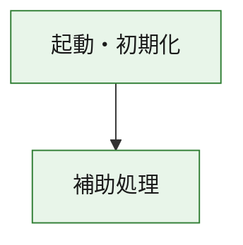
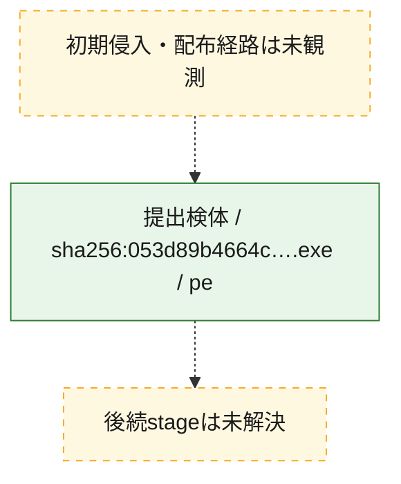
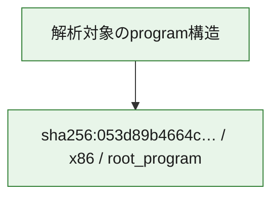

# 全体ロジック：053d89b4664cfd8b4e1314bcdbb8a429813f888416fca7bfecdef246588cf40f

代表関数の静的証跡から、起動・初期化の処理群を確認しました。

## 読み方

- phaseの掲載順は解析上の整理順です。observed_call_edgesがない段階間の実行順を断定しません。
- 図の実線は静的に観測した関係、点線と黄色のノードは未観測・未解決の関係を示します。
- 図は静的な要約であり、動的実行を再現するものではありません。
- 詳細な関数解説とfingerprintは[STATIC-LOGIC.md](STATIC-LOGIC.md)を参照してください。

## 静的可視化

### 実行フロー

### 感染チェーン

### モジュール関係

## 処理段階

### 1. 起動・初期化

entry pointから初期化と後続処理への移行を確認します。
確度: `confirmed_static_function_evidence`

- `053d89b4664cfd8b4e1314bcdbb8a429813f888416fca7bfecdef246588cf40f:ghidra:180001010` — 初期化と主要処理への分岐を行う入口関数です。 状態: `succeeded`、選定理由: `entry_point`, `meaningful_symbol_name`, `reviewed_call_centrality:22`, `role:entrypoint`, `small_program_complete_context`

### 2. 補助処理

主要処理を支える一般内部関数またはlibrary処理を確認します。
確度: `confirmed_static_function_evidence`

- `053d89b4664cfd8b4e1314bcdbb8a429813f888416fca7bfecdef246588cf40f:ghidra:180001240` — 検体内部の一般処理を実装する関数です。 状態: `succeeded`、選定理由: `context_representative`, `reviewed_call_centrality:2`, `small_program_complete_context`
- `053d89b4664cfd8b4e1314bcdbb8a429813f888416fca7bfecdef246588cf40f:ghidra:180001350` — 検体内部の一般処理を実装する関数です。 状態: `succeeded`、選定理由: `context_representative`, `reviewed_call_centrality:25`, `small_program_complete_context`
- `053d89b4664cfd8b4e1314bcdbb8a429813f888416fca7bfecdef246588cf40f:ghidra:180003780` — 検体内部の一般処理を実装する関数です。 状態: `succeeded`、選定理由: `context_representative`, `reviewed_call_centrality:2`, `small_program_complete_context`
- `053d89b4664cfd8b4e1314bcdbb8a429813f888416fca7bfecdef246588cf40f:ghidra:1800038e0` — 検体内部の一般処理を実装する関数です。 状態: `succeeded`、選定理由: `context_representative`, `reviewed_call_centrality:2`, `small_program_complete_context`

## 観測したcall関係

- `053d89b4664cfd8b4e1314bcdbb8a429813f888416fca7bfecdef246588cf40f:ghidra:180001010` → `053d89b4664cfd8b4e1314bcdbb8a429813f888416fca7bfecdef246588cf40f:ghidra:180001240` （`startup` → `support`）
- `053d89b4664cfd8b4e1314bcdbb8a429813f888416fca7bfecdef246588cf40f:ghidra:180001010` → `053d89b4664cfd8b4e1314bcdbb8a429813f888416fca7bfecdef246588cf40f:ghidra:180001350` （`startup` → `support`）
- `053d89b4664cfd8b4e1314bcdbb8a429813f888416fca7bfecdef246588cf40f:ghidra:180001350` → `053d89b4664cfd8b4e1314bcdbb8a429813f888416fca7bfecdef246588cf40f:ghidra:180001240` （`support` → `support`）
- `053d89b4664cfd8b4e1314bcdbb8a429813f888416fca7bfecdef246588cf40f:ghidra:180001350` → `053d89b4664cfd8b4e1314bcdbb8a429813f888416fca7bfecdef246588cf40f:ghidra:180003780` （`support` → `support`）
- `053d89b4664cfd8b4e1314bcdbb8a429813f888416fca7bfecdef246588cf40f:ghidra:180001350` → `053d89b4664cfd8b4e1314bcdbb8a429813f888416fca7bfecdef246588cf40f:ghidra:1800038e0` （`support` → `support`）
- `053d89b4664cfd8b4e1314bcdbb8a429813f888416fca7bfecdef246588cf40f:ghidra:180003780` → `053d89b4664cfd8b4e1314bcdbb8a429813f888416fca7bfecdef246588cf40f:ghidra:1800038e0` （`support` → `support`）
- `ghidra-function:2ead722c96a60a04950e6cb7` → `ghidra-function:ded792edf8caffc2d014eb7a` （`unclassified` → `unclassified`）
- `ghidra-function:525aaa52e1d41860791bdfc5` → `ghidra-function:078369f3dbcfb0b97db4ce40` （`unclassified` → `unclassified`）
- `ghidra-function:525aaa52e1d41860791bdfc5` → `ghidra-function:0c6d6060bc9b3ac17dec490e` （`unclassified` → `unclassified`）
- `ghidra-function:525aaa52e1d41860791bdfc5` → `ghidra-function:1e7cf2c5f68d7cc899030f45` （`unclassified` → `unclassified`）
- `ghidra-function:525aaa52e1d41860791bdfc5` → `ghidra-function:3f2b100e48f2c5779d8c2a8f` （`unclassified` → `unclassified`）
- `ghidra-function:525aaa52e1d41860791bdfc5` → `ghidra-function:3fe928b94361f238d908b1c3` （`unclassified` → `unclassified`）
- `ghidra-function:525aaa52e1d41860791bdfc5` → `ghidra-function:4f3877c427d1ad777ad1cd3c` （`unclassified` → `unclassified`）
- `ghidra-function:525aaa52e1d41860791bdfc5` → `ghidra-function:566fc5fc25087690867dbc7e` （`unclassified` → `unclassified`）
- `ghidra-function:525aaa52e1d41860791bdfc5` → `ghidra-function:7b364ec90922d78c83df9aa4` （`unclassified` → `unclassified`）
- `ghidra-function:525aaa52e1d41860791bdfc5` → `ghidra-function:88c7779270c00496e5db403b` （`unclassified` → `unclassified`）
- `ghidra-function:525aaa52e1d41860791bdfc5` → `ghidra-function:8cdd09c3fc096e363e86d26a` （`unclassified` → `unclassified`）
- `ghidra-function:525aaa52e1d41860791bdfc5` → `ghidra-function:b8fbb1404577932d4c40b105` （`unclassified` → `unclassified`）
- `ghidra-function:525aaa52e1d41860791bdfc5` → `ghidra-function:f88443bc5242d61f2cb9a25b` （`unclassified` → `unclassified`）
- `ghidra-function:7b364ec90922d78c83df9aa4` → `ghidra-external:0219ee4f124d7bad1e9d508b` （`unclassified` → `unclassified`）
- `ghidra-function:7b364ec90922d78c83df9aa4` → `ghidra-external:0adcb1c84ee2bf8fad8b6c6a` （`unclassified` → `unclassified`）
- `ghidra-function:7b364ec90922d78c83df9aa4` → `ghidra-external:0d04b2b3ca0499a44ec2ff5f` （`unclassified` → `unclassified`）
- `ghidra-function:7b364ec90922d78c83df9aa4` → `ghidra-external:0ec39f45e19cc0c8619849fc` （`unclassified` → `unclassified`）
- `ghidra-function:7b364ec90922d78c83df9aa4` → `ghidra-external:1f985fa921785f9594a467ee` （`unclassified` → `unclassified`）
- `ghidra-function:7b364ec90922d78c83df9aa4` → `ghidra-external:38611a799e7d1ee958b0c170` （`unclassified` → `unclassified`）
- `ghidra-function:7b364ec90922d78c83df9aa4` → `ghidra-external:3e4f00550515245fa5e61117` （`unclassified` → `unclassified`）
- `ghidra-function:7b364ec90922d78c83df9aa4` → `ghidra-external:6da7c442c79108655582821a` （`unclassified` → `unclassified`）
- `ghidra-function:7b364ec90922d78c83df9aa4` → `ghidra-external:70bda338b5a3331b02739f7b` （`unclassified` → `unclassified`）
- `ghidra-function:7b364ec90922d78c83df9aa4` → `ghidra-external:77ce356a5d0f938f650ca665` （`unclassified` → `unclassified`）
- `ghidra-function:7b364ec90922d78c83df9aa4` → `ghidra-external:8a4970968c0f96d3f70e43ca` （`unclassified` → `unclassified`）
- `ghidra-function:7b364ec90922d78c83df9aa4` → `ghidra-external:8e65a66c6aefbe024bb36e7f` （`unclassified` → `unclassified`）
- `ghidra-function:7b364ec90922d78c83df9aa4` → `ghidra-external:95cc3cedf35bb6f1b1a15b66` （`unclassified` → `unclassified`）
- `ghidra-function:7b364ec90922d78c83df9aa4` → `ghidra-external:96ce88ab97049636ae6cb465` （`unclassified` → `unclassified`）
- `ghidra-function:7b364ec90922d78c83df9aa4` → `ghidra-external:c9b0a5e7a8ecbccff9994c7c` （`unclassified` → `unclassified`）
- `ghidra-function:7b364ec90922d78c83df9aa4` → `ghidra-external:ccac41a5a891e33611ecf001` （`unclassified` → `unclassified`）
- `ghidra-function:7b364ec90922d78c83df9aa4` → `ghidra-external:d175f5c00977eabd043171db` （`unclassified` → `unclassified`）
- `ghidra-function:7b364ec90922d78c83df9aa4` → `ghidra-external:d617fa610629ae633d06fd60` （`unclassified` → `unclassified`）
- `ghidra-function:7b364ec90922d78c83df9aa4` → `ghidra-external:e57c07d34bc2927578e82ead` （`unclassified` → `unclassified`）
- `ghidra-function:7b364ec90922d78c83df9aa4` → `ghidra-external:e66b7c483a3223b496c2dbe0` （`unclassified` → `unclassified`）
- `ghidra-function:7b364ec90922d78c83df9aa4` → `ghidra-external:f09f8e36accafbc4fa56b324` （`unclassified` → `unclassified`）
- `ghidra-function:7b364ec90922d78c83df9aa4` → `ghidra-function:2ead722c96a60a04950e6cb7` （`unclassified` → `unclassified`）
- `ghidra-function:7b364ec90922d78c83df9aa4` → `ghidra-function:3f2b100e48f2c5779d8c2a8f` （`unclassified` → `unclassified`）
- `ghidra-function:7b364ec90922d78c83df9aa4` → `ghidra-function:ded792edf8caffc2d014eb7a` （`unclassified` → `unclassified`）

## 解析範囲と制約

- 選定外関数は全体inventoryへ残しますが、関数本体の個別解説対象にはしていません。
- indirect call、難読化、packer、VM、壊れたcontrol flowによりcall関係が欠落する場合があります。
- 文書は静的解析に基づき、検体実行や外部通信による動的確認は行っていません。
