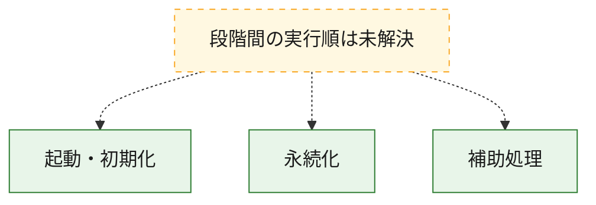
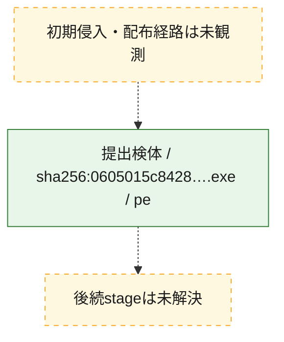
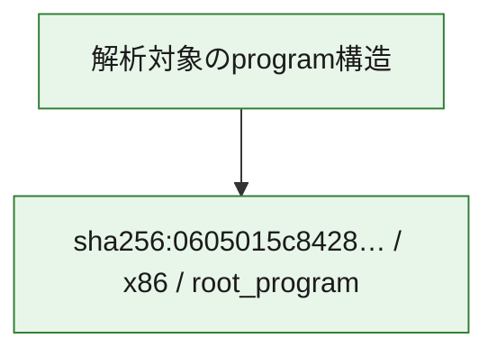

# 全体ロジック：0605015c8428fb4efc98e0abd8af027c7a01f2e87471dbc7e4389a3c6e5844c4

代表関数の静的証跡から、起動・初期化、永続化の処理群を確認しました。

## 読み方

- phaseの掲載順は解析上の整理順です。observed_call_edgesがない段階間の実行順を断定しません。
- 図の実線は静的に観測した関係、点線と黄色のノードは未観測・未解決の関係を示します。
- 図は静的な要約であり、動的実行を再現するものではありません。
- 詳細な関数解説とfingerprintは[STATIC-LOGIC.md](STATIC-LOGIC.md)を参照してください。

## 静的可視化

### 実行フロー

### 感染チェーン

### モジュール関係

## 処理段階

### 1. 起動・初期化

entry pointから初期化と後続処理への移行を確認します。
確度: `confirmed_static_function_evidence`

- `0605015c8428fb4efc98e0abd8af027c7a01f2e87471dbc7e4389a3c6e5844c4:ghidra:004014c0` — 初期化と主要処理への分岐を行う入口関数です。 状態: `succeeded`、選定理由: `entry_point`, `meaningful_symbol_name`, `reviewed_call_centrality:2`, `role:entrypoint`

### 2. 永続化

自動起動や永続化に関係する設定変更を確認します。
確度: `confirmed_static_function_evidence`

- `0605015c8428fb4efc98e0abd8af027c7a01f2e87471dbc7e4389a3c6e5844c4:ghidra:00401180` — 自動起動または永続化に関係する処理を含む関数です。 状態: `succeeded`、選定理由: `context_representative`, `reviewed_call_centrality:26`, `role:persistence`

### 3. 補助処理

主要処理を支える一般内部関数またはlibrary処理を確認します。
確度: `confirmed_static_function_evidence_with_limits`

- `0605015c8428fb4efc98e0abd8af027c7a01f2e87471dbc7e4389a3c6e5844c4:ghidra:00401000` — 検体内部の一般処理を実装する関数です。 状態: `succeeded`、選定理由: `context_representative`
- `0605015c8428fb4efc98e0abd8af027c7a01f2e87471dbc7e4389a3c6e5844c4:ghidra:00401010` — 検体内部の一般処理を実装する関数です。 状態: `succeeded`、選定理由: `context_representative`, `reviewed_call_centrality:5`
- `0605015c8428fb4efc98e0abd8af027c7a01f2e87471dbc7e4389a3c6e5844c4:ghidra:00401130` — 検体内部の一般処理を実装する関数です。 状態: `succeeded`、選定理由: `context_representative`, `reviewed_call_centrality:1`
- `0605015c8428fb4efc98e0abd8af027c7a01f2e87471dbc7e4389a3c6e5844c4:ghidra:004014f0` — 検体内部の一般処理を実装する関数です。 状態: `succeeded`、選定理由: `context_representative`, `reviewed_call_centrality:2`
- `0605015c8428fb4efc98e0abd8af027c7a01f2e87471dbc7e4389a3c6e5844c4:ghidra:00401520` — 検体内部の一般処理を実装する関数です。 状態: `succeeded`、選定理由: `context_representative`, `reviewed_call_centrality:1`
- `0605015c8428fb4efc98e0abd8af027c7a01f2e87471dbc7e4389a3c6e5844c4:ghidra:00401540` — 検体内部の一般処理を実装する関数です。 状態: `succeeded`、選定理由: `context_representative`, `reviewed_call_centrality:1`
- `0605015c8428fb4efc98e0abd8af027c7a01f2e87471dbc7e4389a3c6e5844c4:ghidra:00401550` — 検体内部の一般処理を実装する関数です。 状態: `succeeded`、選定理由: `context_representative`
- `0605015c8428fb4efc98e0abd8af027c7a01f2e87471dbc7e4389a3c6e5844c4:ghidra:0040156f` — 検体内部の一般処理を実装する関数です。 状態: `succeeded`、選定理由: `context_representative`
- `0605015c8428fb4efc98e0abd8af027c7a01f2e87471dbc7e4389a3c6e5844c4:ghidra:0040157a` — 検体内部の一般処理を実装する関数です。 状態: `limited_bad_instruction_or_flow`、選定理由: `context_representative`, `reviewed_call_centrality:4`
- `0605015c8428fb4efc98e0abd8af027c7a01f2e87471dbc7e4389a3c6e5844c4:ghidra:00401594` — 検体内部の一般処理を実装する関数です。 状態: `succeeded`、選定理由: `context_representative`, `reviewed_call_centrality:1`
- `0605015c8428fb4efc98e0abd8af027c7a01f2e87471dbc7e4389a3c6e5844c4:ghidra:004015c3` — 検体内部の一般処理を実装する関数です。 状態: `succeeded`、選定理由: `context_representative`, `reviewed_call_centrality:2`
- `0605015c8428fb4efc98e0abd8af027c7a01f2e87471dbc7e4389a3c6e5844c4:ghidra:004015f8` — 検体内部の一般処理を実装する関数です。 状態: `succeeded`、選定理由: `context_representative`, `reviewed_call_centrality:2`
- `0605015c8428fb4efc98e0abd8af027c7a01f2e87471dbc7e4389a3c6e5844c4:ghidra:00401640` — 検体内部の一般処理を実装する関数です。 状態: `limited_bad_instruction_or_flow`、選定理由: `context_representative`, `reviewed_call_centrality:2`
- `0605015c8428fb4efc98e0abd8af027c7a01f2e87471dbc7e4389a3c6e5844c4:ghidra:0040166d` — 検体内部の一般処理を実装する関数です。 状態: `succeeded`、選定理由: `context_representative`, `reviewed_call_centrality:1`
- `0605015c8428fb4efc98e0abd8af027c7a01f2e87471dbc7e4389a3c6e5844c4:ghidra:004016a9` — 検体内部の一般処理を実装する関数です。 状態: `limited_bad_instruction_or_flow`、選定理由: `context_representative`, `reviewed_call_centrality:5`
- `0605015c8428fb4efc98e0abd8af027c7a01f2e87471dbc7e4389a3c6e5844c4:ghidra:004016dc` — 検体内部の一般処理を実装する関数です。 状態: `limited_bad_instruction_or_flow`、選定理由: `context_representative`, `reviewed_call_centrality:3`
- `0605015c8428fb4efc98e0abd8af027c7a01f2e87471dbc7e4389a3c6e5844c4:ghidra:00401718` — 検体内部の一般処理を実装する関数です。 状態: `succeeded`、選定理由: `context_representative`, `reviewed_call_centrality:5`
- `0605015c8428fb4efc98e0abd8af027c7a01f2e87471dbc7e4389a3c6e5844c4:ghidra:00401877` — 検体内部の一般処理を実装する関数です。 状態: `succeeded`、選定理由: `context_representative`, `reviewed_call_centrality:7`
- `0605015c8428fb4efc98e0abd8af027c7a01f2e87471dbc7e4389a3c6e5844c4:ghidra:00401d76` — 検体内部の一般処理を実装する関数です。 状態: `succeeded`、選定理由: `context_representative`, `reviewed_call_centrality:9`
- `0605015c8428fb4efc98e0abd8af027c7a01f2e87471dbc7e4389a3c6e5844c4:ghidra:00401f6d` — 検体内部の一般処理を実装する関数です。 状態: `succeeded`、選定理由: `context_representative`, `reviewed_call_centrality:2`
- `0605015c8428fb4efc98e0abd8af027c7a01f2e87471dbc7e4389a3c6e5844c4:ghidra:0040205c` — 検体内部の一般処理を実装する関数です。 状態: `succeeded`、選定理由: `context_representative`, `reviewed_call_centrality:2`
- `0605015c8428fb4efc98e0abd8af027c7a01f2e87471dbc7e4389a3c6e5844c4:ghidra:00402068` — 検体内部の一般処理を実装する関数です。 状態: `succeeded`、選定理由: `context_representative`, `reviewed_call_centrality:3`
- `0605015c8428fb4efc98e0abd8af027c7a01f2e87471dbc7e4389a3c6e5844c4:ghidra:004020fb` — 検体内部の一般処理を実装する関数です。 状態: `succeeded`、選定理由: `context_representative`, `reviewed_call_centrality:1`
- `0605015c8428fb4efc98e0abd8af027c7a01f2e87471dbc7e4389a3c6e5844c4:ghidra:0040210e` — 検体内部の一般処理を実装する関数です。 状態: `succeeded`、選定理由: `context_representative`, `reviewed_call_centrality:1`
- `0605015c8428fb4efc98e0abd8af027c7a01f2e87471dbc7e4389a3c6e5844c4:ghidra:00402121` — 検体内部の一般処理を実装する関数です。 状態: `succeeded`、選定理由: `context_representative`
- `0605015c8428fb4efc98e0abd8af027c7a01f2e87471dbc7e4389a3c6e5844c4:ghidra:0040213c` — 検体内部の一般処理を実装する関数です。 状態: `succeeded`、選定理由: `context_representative`, `reviewed_call_centrality:1`
- `0605015c8428fb4efc98e0abd8af027c7a01f2e87471dbc7e4389a3c6e5844c4:ghidra:004021a7` — 検体内部の一般処理を実装する関数です。 状態: `succeeded`、選定理由: `context_representative`
- `0605015c8428fb4efc98e0abd8af027c7a01f2e87471dbc7e4389a3c6e5844c4:ghidra:004021f0` — 検体内部の一般処理を実装する関数です。 状態: `limited_bad_instruction_or_flow`、選定理由: `context_representative`, `reviewed_call_centrality:2`
- `0605015c8428fb4efc98e0abd8af027c7a01f2e87471dbc7e4389a3c6e5844c4:ghidra:00402223` — 検体内部の一般処理を実装する関数です。 状態: `succeeded`、選定理由: `context_representative`
- `0605015c8428fb4efc98e0abd8af027c7a01f2e87471dbc7e4389a3c6e5844c4:ghidra:0040226c` — 検体内部の一般処理を実装する関数です。 状態: `succeeded`、選定理由: `context_representative`, `reviewed_call_centrality:1`

## 観測したcall関係

- 代表関数間で直接解決できた呼出関係はありません。

## 解析範囲と制約

- 選定外関数は全体inventoryへ残しますが、関数本体の個別解説対象にはしていません。
- indirect call、難読化、packer、VM、壊れたcontrol flowによりcall関係が欠落する場合があります。
- 文書は静的解析に基づき、検体実行や外部通信による動的確認は行っていません。
