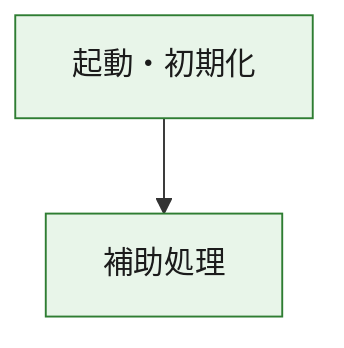
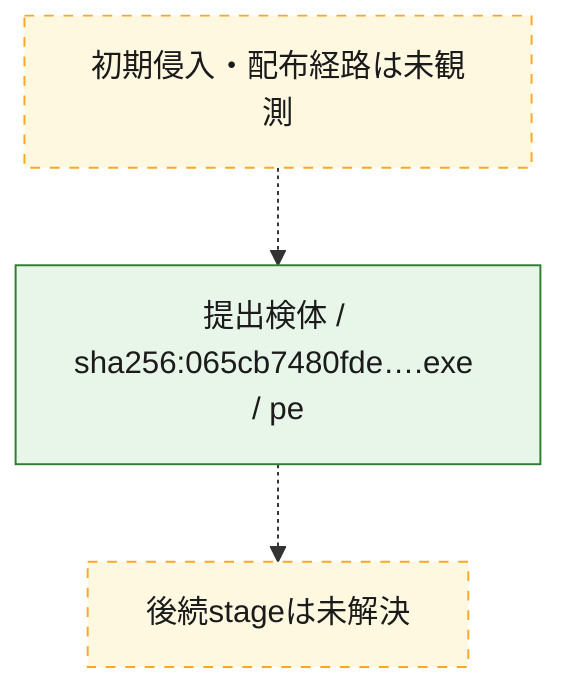
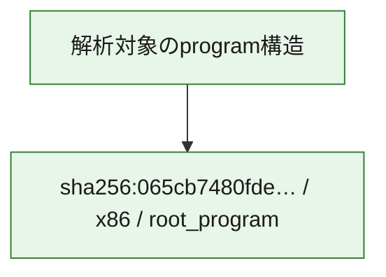

# 全体ロジック：065cb7480fdecd37d37c4ec2ab0b4e7a9d5c97c33f913d08093270e6e4dd2578

代表関数の静的証跡から、起動・初期化の処理群を確認しました。

## 読み方

- phaseの掲載順は解析上の整理順です。observed_call_edgesがない段階間の実行順を断定しません。
- 図の実線は静的に観測した関係、点線と黄色のノードは未観測・未解決の関係を示します。
- 図は静的な要約であり、動的実行を再現するものではありません。
- 詳細な関数解説とfingerprintは[STATIC-LOGIC.md](STATIC-LOGIC.md)を参照してください。

## 静的可視化

### 実行フロー

### 感染チェーン

### モジュール関係

## 処理段階

### 1. 起動・初期化

entry pointから初期化と後続処理への移行を確認します。
確度: `confirmed_static_function_evidence`

- `065cb7480fdecd37d37c4ec2ab0b4e7a9d5c97c33f913d08093270e6e4dd2578:ghidra:180001010` — 初期化と主要処理への分岐を行う入口関数です。 状態: `succeeded`、選定理由: `entry_point`, `meaningful_symbol_name`, `reviewed_call_centrality:22`, `role:entrypoint`, `small_program_complete_context`

### 2. 補助処理

主要処理を支える一般内部関数またはlibrary処理を確認します。
確度: `confirmed_static_function_evidence`

- `065cb7480fdecd37d37c4ec2ab0b4e7a9d5c97c33f913d08093270e6e4dd2578:ghidra:180001240` — 検体内部の一般処理を実装する関数です。 状態: `succeeded`、選定理由: `context_representative`, `reviewed_call_centrality:2`, `small_program_complete_context`
- `065cb7480fdecd37d37c4ec2ab0b4e7a9d5c97c33f913d08093270e6e4dd2578:ghidra:180001350` — 検体内部の一般処理を実装する関数です。 状態: `succeeded`、選定理由: `context_representative`, `reviewed_call_centrality:25`, `small_program_complete_context`
- `065cb7480fdecd37d37c4ec2ab0b4e7a9d5c97c33f913d08093270e6e4dd2578:ghidra:180003780` — 検体内部の一般処理を実装する関数です。 状態: `succeeded`、選定理由: `context_representative`, `reviewed_call_centrality:2`, `small_program_complete_context`
- `065cb7480fdecd37d37c4ec2ab0b4e7a9d5c97c33f913d08093270e6e4dd2578:ghidra:1800038e0` — 検体内部の一般処理を実装する関数です。 状態: `succeeded`、選定理由: `context_representative`, `reviewed_call_centrality:2`, `small_program_complete_context`

## 観測したcall関係

- `065cb7480fdecd37d37c4ec2ab0b4e7a9d5c97c33f913d08093270e6e4dd2578:ghidra:180001010` → `065cb7480fdecd37d37c4ec2ab0b4e7a9d5c97c33f913d08093270e6e4dd2578:ghidra:180001240` （`startup` → `support`）
- `065cb7480fdecd37d37c4ec2ab0b4e7a9d5c97c33f913d08093270e6e4dd2578:ghidra:180001010` → `065cb7480fdecd37d37c4ec2ab0b4e7a9d5c97c33f913d08093270e6e4dd2578:ghidra:180001350` （`startup` → `support`）
- `065cb7480fdecd37d37c4ec2ab0b4e7a9d5c97c33f913d08093270e6e4dd2578:ghidra:180001350` → `065cb7480fdecd37d37c4ec2ab0b4e7a9d5c97c33f913d08093270e6e4dd2578:ghidra:180001240` （`support` → `support`）
- `065cb7480fdecd37d37c4ec2ab0b4e7a9d5c97c33f913d08093270e6e4dd2578:ghidra:180001350` → `065cb7480fdecd37d37c4ec2ab0b4e7a9d5c97c33f913d08093270e6e4dd2578:ghidra:180003780` （`support` → `support`）
- `065cb7480fdecd37d37c4ec2ab0b4e7a9d5c97c33f913d08093270e6e4dd2578:ghidra:180001350` → `065cb7480fdecd37d37c4ec2ab0b4e7a9d5c97c33f913d08093270e6e4dd2578:ghidra:1800038e0` （`support` → `support`）
- `065cb7480fdecd37d37c4ec2ab0b4e7a9d5c97c33f913d08093270e6e4dd2578:ghidra:180003780` → `065cb7480fdecd37d37c4ec2ab0b4e7a9d5c97c33f913d08093270e6e4dd2578:ghidra:1800038e0` （`support` → `support`）
- `ghidra-function:138b81bbee7744a290528cec` → `ghidra-external:08a7d79c3f30c03dcc8296e9` （`unclassified` → `unclassified`）
- `ghidra-function:138b81bbee7744a290528cec` → `ghidra-external:0cefd5a081173eb7c7932710` （`unclassified` → `unclassified`）
- `ghidra-function:138b81bbee7744a290528cec` → `ghidra-external:1129448b011fc0915703d58d` （`unclassified` → `unclassified`）
- `ghidra-function:138b81bbee7744a290528cec` → `ghidra-external:1beee6b629b15fa1f55749e2` （`unclassified` → `unclassified`）
- `ghidra-function:138b81bbee7744a290528cec` → `ghidra-external:3aedb59094fb3d79a4408eab` （`unclassified` → `unclassified`）
- `ghidra-function:138b81bbee7744a290528cec` → `ghidra-external:48f1bbaa8e831871b84e7b1b` （`unclassified` → `unclassified`）
- `ghidra-function:138b81bbee7744a290528cec` → `ghidra-external:4fa2965392eab6bbe94e4127` （`unclassified` → `unclassified`）
- `ghidra-function:138b81bbee7744a290528cec` → `ghidra-external:67ad6a1ceb29b3b7496fdb87` （`unclassified` → `unclassified`）
- `ghidra-function:138b81bbee7744a290528cec` → `ghidra-external:70ab9df6b5e09aae1a6b6c93` （`unclassified` → `unclassified`）
- `ghidra-function:138b81bbee7744a290528cec` → `ghidra-external:7d4a7742e64b420cf581a75a` （`unclassified` → `unclassified`）
- `ghidra-function:138b81bbee7744a290528cec` → `ghidra-external:8671af0753f2442ae65794b5` （`unclassified` → `unclassified`）
- `ghidra-function:138b81bbee7744a290528cec` → `ghidra-external:a183dbf7031647975cfd85e9` （`unclassified` → `unclassified`）
- `ghidra-function:138b81bbee7744a290528cec` → `ghidra-external:a4f81ce950858d528010b66d` （`unclassified` → `unclassified`）
- `ghidra-function:138b81bbee7744a290528cec` → `ghidra-external:aff302bf0bec9e879b134a22` （`unclassified` → `unclassified`）
- `ghidra-function:138b81bbee7744a290528cec` → `ghidra-external:b1e418dce897828a2b61f3d2` （`unclassified` → `unclassified`）
- `ghidra-function:138b81bbee7744a290528cec` → `ghidra-external:b794821154037232c5ecc392` （`unclassified` → `unclassified`）
- `ghidra-function:138b81bbee7744a290528cec` → `ghidra-external:c2cc309a48c8defa02f3147e` （`unclassified` → `unclassified`）
- `ghidra-function:138b81bbee7744a290528cec` → `ghidra-external:da4f4f865d7c6346acb9bd95` （`unclassified` → `unclassified`）
- `ghidra-function:138b81bbee7744a290528cec` → `ghidra-external:e2a2680a7f25dd174f3632d0` （`unclassified` → `unclassified`）
- `ghidra-function:138b81bbee7744a290528cec` → `ghidra-external:ed56064814c29ff656539fbc` （`unclassified` → `unclassified`）
- `ghidra-function:138b81bbee7744a290528cec` → `ghidra-external:fd3a1bfcd746969fa48b9930` （`unclassified` → `unclassified`）
- `ghidra-function:138b81bbee7744a290528cec` → `ghidra-function:3cf231521188c536789007a1` （`unclassified` → `unclassified`）
- `ghidra-function:138b81bbee7744a290528cec` → `ghidra-function:ae67b90c25fcf87fb02cafac` （`unclassified` → `unclassified`）
- `ghidra-function:138b81bbee7744a290528cec` → `ghidra-function:bf0034c2ed45b7b68c7f7c81` （`unclassified` → `unclassified`）
- `ghidra-function:3cf231521188c536789007a1` → `ghidra-function:ae67b90c25fcf87fb02cafac` （`unclassified` → `unclassified`）
- `ghidra-function:e75ad358fb9b47208d5ff811` → `ghidra-function:138b81bbee7744a290528cec` （`unclassified` → `unclassified`）
- `ghidra-function:e75ad358fb9b47208d5ff811` → `ghidra-function:15ba23be68d1eff2bb8e53d9` （`unclassified` → `unclassified`）
- `ghidra-function:e75ad358fb9b47208d5ff811` → `ghidra-function:341ba60c382f913a1e68adac` （`unclassified` → `unclassified`）
- `ghidra-function:e75ad358fb9b47208d5ff811` → `ghidra-function:50ddbfea416c94fbbddf5c98` （`unclassified` → `unclassified`）
- `ghidra-function:e75ad358fb9b47208d5ff811` → `ghidra-function:66f742547f86d9cc63bf6382` （`unclassified` → `unclassified`）
- `ghidra-function:e75ad358fb9b47208d5ff811` → `ghidra-function:697cb8fdedf31d6306e385d8` （`unclassified` → `unclassified`）
- `ghidra-function:e75ad358fb9b47208d5ff811` → `ghidra-function:7e905d9ad5be894be6c22b5a` （`unclassified` → `unclassified`）
- `ghidra-function:e75ad358fb9b47208d5ff811` → `ghidra-function:9187976a0281475f82647c87` （`unclassified` → `unclassified`）
- `ghidra-function:e75ad358fb9b47208d5ff811` → `ghidra-function:bf0034c2ed45b7b68c7f7c81` （`unclassified` → `unclassified`）
- `ghidra-function:e75ad358fb9b47208d5ff811` → `ghidra-function:d634dd298884159c882f9b72` （`unclassified` → `unclassified`）
- `ghidra-function:e75ad358fb9b47208d5ff811` → `ghidra-function:d9b6a8f628d78499c8628bc6` （`unclassified` → `unclassified`）
- `ghidra-function:e75ad358fb9b47208d5ff811` → `ghidra-function:fedc9f61a71a67ff3c42278c` （`unclassified` → `unclassified`）

## 解析範囲と制約

- 選定外関数は全体inventoryへ残しますが、関数本体の個別解説対象にはしていません。
- indirect call、難読化、packer、VM、壊れたcontrol flowによりcall関係が欠落する場合があります。
- 文書は静的解析に基づき、検体実行や外部通信による動的確認は行っていません。
