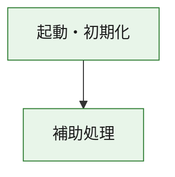
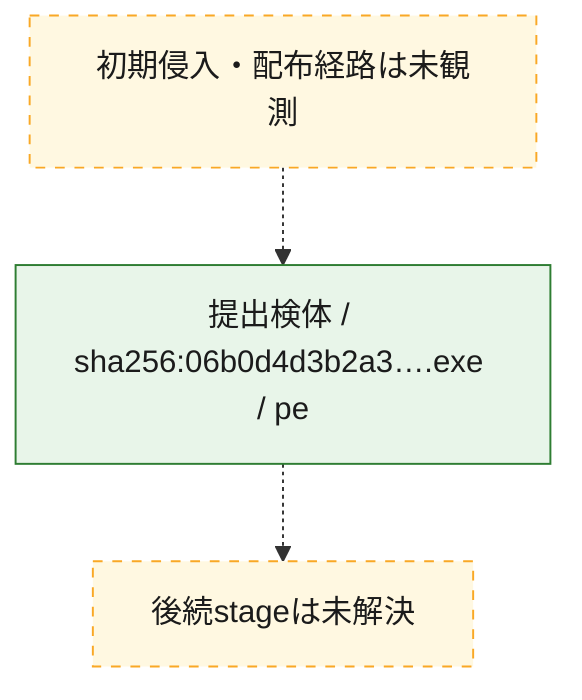
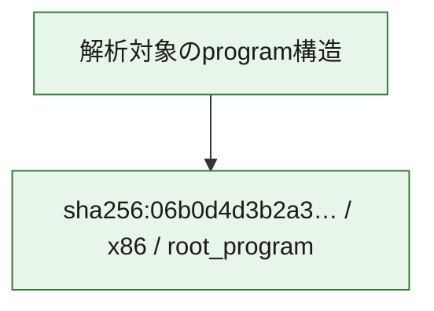

# 全体ロジック：06b0d4d3b2a35c796253278adae6489fc41234295d245f79cb69a0ccf155925d

代表関数の静的証跡から、起動・初期化の処理群を確認しました。

## 読み方

- phaseの掲載順は解析上の整理順です。observed_call_edgesがない段階間の実行順を断定しません。
- 図の実線は静的に観測した関係、点線と黄色のノードは未観測・未解決の関係を示します。
- 図は静的な要約であり、動的実行を再現するものではありません。
- 詳細な関数解説とfingerprintは[STATIC-LOGIC.md](STATIC-LOGIC.md)を参照してください。

## 静的可視化

### 実行フロー

### 感染チェーン

### モジュール関係

## 処理段階

### 1. 起動・初期化

entry pointから初期化と後続処理への移行を確認します。
確度: `confirmed_static_function_evidence`

- `06b0d4d3b2a35c796253278adae6489fc41234295d245f79cb69a0ccf155925d:ghidra:180001010` — 初期化と主要処理への分岐を行う入口関数です。 状態: `succeeded`、選定理由: `entry_point`, `meaningful_symbol_name`, `reviewed_call_centrality:22`, `role:entrypoint`, `small_program_complete_context`

### 2. 補助処理

主要処理を支える一般内部関数またはlibrary処理を確認します。
確度: `confirmed_static_function_evidence`

- `06b0d4d3b2a35c796253278adae6489fc41234295d245f79cb69a0ccf155925d:ghidra:180001240` — 検体内部の一般処理を実装する関数です。 状態: `succeeded`、選定理由: `context_representative`, `reviewed_call_centrality:2`, `small_program_complete_context`
- `06b0d4d3b2a35c796253278adae6489fc41234295d245f79cb69a0ccf155925d:ghidra:180001350` — 検体内部の一般処理を実装する関数です。 状態: `succeeded`、選定理由: `context_representative`, `reviewed_call_centrality:25`, `small_program_complete_context`
- `06b0d4d3b2a35c796253278adae6489fc41234295d245f79cb69a0ccf155925d:ghidra:180003780` — 検体内部の一般処理を実装する関数です。 状態: `succeeded`、選定理由: `context_representative`, `reviewed_call_centrality:2`, `small_program_complete_context`
- `06b0d4d3b2a35c796253278adae6489fc41234295d245f79cb69a0ccf155925d:ghidra:1800038e0` — 検体内部の一般処理を実装する関数です。 状態: `succeeded`、選定理由: `context_representative`, `reviewed_call_centrality:2`, `small_program_complete_context`

## 観測したcall関係

- `06b0d4d3b2a35c796253278adae6489fc41234295d245f79cb69a0ccf155925d:ghidra:180001010` → `06b0d4d3b2a35c796253278adae6489fc41234295d245f79cb69a0ccf155925d:ghidra:180001240` （`startup` → `support`）
- `06b0d4d3b2a35c796253278adae6489fc41234295d245f79cb69a0ccf155925d:ghidra:180001010` → `06b0d4d3b2a35c796253278adae6489fc41234295d245f79cb69a0ccf155925d:ghidra:180001350` （`startup` → `support`）
- `06b0d4d3b2a35c796253278adae6489fc41234295d245f79cb69a0ccf155925d:ghidra:180001350` → `06b0d4d3b2a35c796253278adae6489fc41234295d245f79cb69a0ccf155925d:ghidra:180001240` （`support` → `support`）
- `06b0d4d3b2a35c796253278adae6489fc41234295d245f79cb69a0ccf155925d:ghidra:180001350` → `06b0d4d3b2a35c796253278adae6489fc41234295d245f79cb69a0ccf155925d:ghidra:180003780` （`support` → `support`）
- `06b0d4d3b2a35c796253278adae6489fc41234295d245f79cb69a0ccf155925d:ghidra:180001350` → `06b0d4d3b2a35c796253278adae6489fc41234295d245f79cb69a0ccf155925d:ghidra:1800038e0` （`support` → `support`）
- `06b0d4d3b2a35c796253278adae6489fc41234295d245f79cb69a0ccf155925d:ghidra:180003780` → `06b0d4d3b2a35c796253278adae6489fc41234295d245f79cb69a0ccf155925d:ghidra:1800038e0` （`support` → `support`）
- `ghidra-function:20e6fd2b361490020a05e63e` → `ghidra-function:011b437df40276d96f736858` （`unclassified` → `unclassified`）
- `ghidra-function:20e6fd2b361490020a05e63e` → `ghidra-function:1485ec4ffce2aa490169456f` （`unclassified` → `unclassified`）
- `ghidra-function:20e6fd2b361490020a05e63e` → `ghidra-function:1d04031e648942905ac972e4` （`unclassified` → `unclassified`）
- `ghidra-function:20e6fd2b361490020a05e63e` → `ghidra-function:234f76c6ed79b4492980965a` （`unclassified` → `unclassified`）
- `ghidra-function:20e6fd2b361490020a05e63e` → `ghidra-function:280e625694644f3b901574a6` （`unclassified` → `unclassified`）
- `ghidra-function:20e6fd2b361490020a05e63e` → `ghidra-function:4b140f55fe661bdf2b0c03e7` （`unclassified` → `unclassified`）
- `ghidra-function:20e6fd2b361490020a05e63e` → `ghidra-function:566309f11c88eebca0e98c4f` （`unclassified` → `unclassified`）
- `ghidra-function:20e6fd2b361490020a05e63e` → `ghidra-function:804c57f63cfe1b64360b8668` （`unclassified` → `unclassified`）
- `ghidra-function:20e6fd2b361490020a05e63e` → `ghidra-function:b81f228743f419eb2c8782ab` （`unclassified` → `unclassified`）
- `ghidra-function:20e6fd2b361490020a05e63e` → `ghidra-function:cd5808d3c70c536fc99bd983` （`unclassified` → `unclassified`）
- `ghidra-function:20e6fd2b361490020a05e63e` → `ghidra-function:dcc726750b78a21cb264af32` （`unclassified` → `unclassified`）
- `ghidra-function:20e6fd2b361490020a05e63e` → `ghidra-function:f80d29780e97fed9b5ca728b` （`unclassified` → `unclassified`）
- `ghidra-function:804c57f63cfe1b64360b8668` → `ghidra-external:03789ddf39f516f51bad78e0` （`unclassified` → `unclassified`）
- `ghidra-function:804c57f63cfe1b64360b8668` → `ghidra-external:107055bfded22e5f43a83c4f` （`unclassified` → `unclassified`）
- `ghidra-function:804c57f63cfe1b64360b8668` → `ghidra-external:18482253e325dc966775466a` （`unclassified` → `unclassified`）
- `ghidra-function:804c57f63cfe1b64360b8668` → `ghidra-external:2400ff820210fb0329b01100` （`unclassified` → `unclassified`）
- `ghidra-function:804c57f63cfe1b64360b8668` → `ghidra-external:275f7427faebb51fc17e5fbf` （`unclassified` → `unclassified`）
- `ghidra-function:804c57f63cfe1b64360b8668` → `ghidra-external:35bd66a0de845c600099c24e` （`unclassified` → `unclassified`）
- `ghidra-function:804c57f63cfe1b64360b8668` → `ghidra-external:35cf61bd8708972bf6b5da17` （`unclassified` → `unclassified`）
- `ghidra-function:804c57f63cfe1b64360b8668` → `ghidra-external:4dea1b0d5a021ec46bb944af` （`unclassified` → `unclassified`）
- `ghidra-function:804c57f63cfe1b64360b8668` → `ghidra-external:53a9ca06feab68c51259c114` （`unclassified` → `unclassified`）
- `ghidra-function:804c57f63cfe1b64360b8668` → `ghidra-external:541743ace159f2582a70bc29` （`unclassified` → `unclassified`）
- `ghidra-function:804c57f63cfe1b64360b8668` → `ghidra-external:56c942166487340792bb68ef` （`unclassified` → `unclassified`）
- `ghidra-function:804c57f63cfe1b64360b8668` → `ghidra-external:581f18bb1d8b2f7c46a95a70` （`unclassified` → `unclassified`）
- `ghidra-function:804c57f63cfe1b64360b8668` → `ghidra-external:5972f3083a3b0fdd1d52a913` （`unclassified` → `unclassified`）
- `ghidra-function:804c57f63cfe1b64360b8668` → `ghidra-external:7c01900e0e0142ce871d5639` （`unclassified` → `unclassified`）
- `ghidra-function:804c57f63cfe1b64360b8668` → `ghidra-external:8e672d3478bdf925a1497c29` （`unclassified` → `unclassified`）
- `ghidra-function:804c57f63cfe1b64360b8668` → `ghidra-external:9719c5e42188d17410a5f1ed` （`unclassified` → `unclassified`）
- `ghidra-function:804c57f63cfe1b64360b8668` → `ghidra-external:b3b2a341e9a021723b430c0b` （`unclassified` → `unclassified`）
- `ghidra-function:804c57f63cfe1b64360b8668` → `ghidra-external:b791e1e091da6d1c8a77a62e` （`unclassified` → `unclassified`）
- `ghidra-function:804c57f63cfe1b64360b8668` → `ghidra-external:bd5a8280db05c2caea6a9eb8` （`unclassified` → `unclassified`）
- `ghidra-function:804c57f63cfe1b64360b8668` → `ghidra-external:c2cc3ed3c44b3ecc8b6e74b5` （`unclassified` → `unclassified`）
- `ghidra-function:804c57f63cfe1b64360b8668` → `ghidra-external:ff651daa50fe288e31f9c3ad` （`unclassified` → `unclassified`）
- `ghidra-function:804c57f63cfe1b64360b8668` → `ghidra-function:3eafcdd5402f756839b73d05` （`unclassified` → `unclassified`）
- `ghidra-function:804c57f63cfe1b64360b8668` → `ghidra-function:4b140f55fe661bdf2b0c03e7` （`unclassified` → `unclassified`）
- `ghidra-function:804c57f63cfe1b64360b8668` → `ghidra-function:98a1858c0ecb0570f093e287` （`unclassified` → `unclassified`）
- `ghidra-function:98a1858c0ecb0570f093e287` → `ghidra-function:3eafcdd5402f756839b73d05` （`unclassified` → `unclassified`）

## 解析範囲と制約

- 選定外関数は全体inventoryへ残しますが、関数本体の個別解説対象にはしていません。
- indirect call、難読化、packer、VM、壊れたcontrol flowによりcall関係が欠落する場合があります。
- 文書は静的解析に基づき、検体実行や外部通信による動的確認は行っていません。
