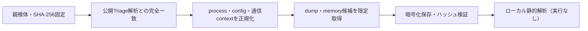

# Triage公開解析・後段取得証跡

## 完全ハッシュ一致

- [260821-2awl3asxfv](https://tria.ge/260821-2awl3asxfv): ファミリー候補 `未確定`、評価score `None`

## プロセス・通信

- 観測process: `取得できず`
- raw commandは保存せず、command SHA-256と処理patternだけをJSONへ保持します。
- sandbox background trafficは`context_only`であり、C2へ自動昇格しません。

- 取得できませんでした。

## 後段取得物

- `81f799f754e34a8ab0cde74855c626398dc706ace3a3d45d1425de134501aa1a` / `memory_image` / 901120 bytes / 親と同一: `false` / 静的解析: `partial`
- `499bd49802306acb4c733a06c4db12cb806ab509ce8995292d47ce4cbc717c2e` / `memory_image` / 1880064 bytes / 親と同一: `false` / 静的解析: `partial`
- `331d388b17dd0d1c9af349ea428f412341acc19f73aeb08f2e237b4a6c651f80` / `memory_image` / 1880064 bytes / 親と同一: `false` / 静的解析: `partial`
- `21436ebeb5b9d2019e292793704a0ada840ff8543b3e2dff6208d150c1309368` / `memory_image` / 1880064 bytes / 親と同一: `false` / 静的解析: `partial`
- `79a32543b0e2cd06ded42f759d2f8bdc377f26234881820bc9bbb30d49b1d8a1` / `memory_image` / 901120 bytes / 親と同一: `false` / 静的解析: `partial`
- `b0a088b9ddea18395f575f276400538d5f31b5497aad39865edb30836e8d09b1` / `memory_image` / 1880064 bytes / 親と同一: `false` / 静的解析: `partial`
- `42b024fa36215cff53bb57a51f0e63030d5e7d2d1b99dc81ddd5065d03a64529` / `memory_image` / 2834432 bytes / 親と同一: `false` / 静的解析: `partial`
- `1f7642731d6feb4affdec7bf192d919aa2c5167752fd0664e1c319788c8a9c22` / `memory_image` / 1880064 bytes / 親と同一: `false` / 静的解析: `partial`
- `7bfefe53527a3490d763904d9d4b4b287d0ce6da12e37363518cf2e7b56cb171` / `memory_image` / 1880064 bytes / 親と同一: `false` / 静的解析: `partial`
- `d5864aa3a2233138919fffd8edca62cc21bd279c612fe9ae23213ad7796ab0c7` / `memory_image` / 2834432 bytes / 親と同一: `false` / 静的解析: `partial`

## 判定境界

Triage由来のfamily、process、config、通信は外部sandbox証跡です。Config extractorが返したendpointはC2候補として扱いますが、静的設定復元またはprocess帰属とprotocol応答が揃うまでは確認済みC2とはしません。取得成果物と検体は実行していません。
