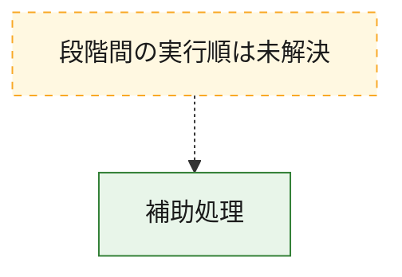
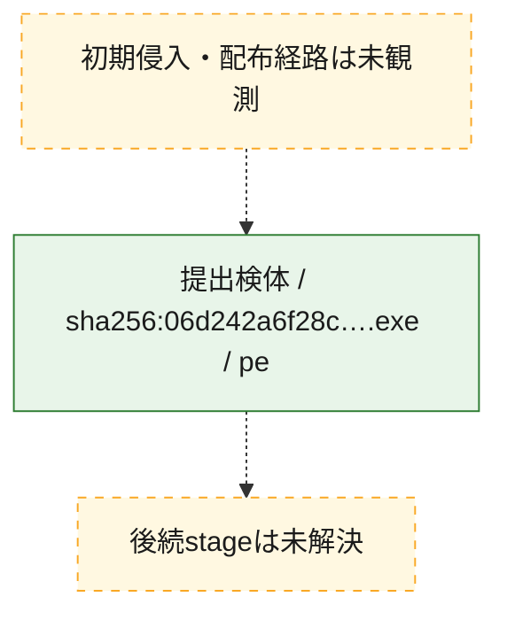
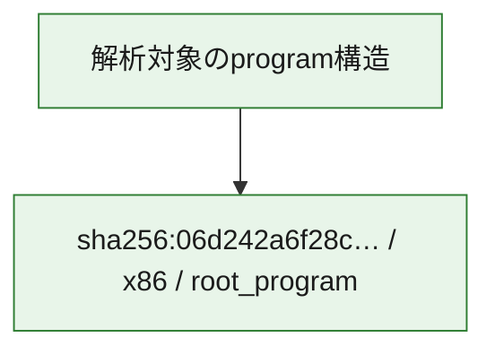

# 全体ロジック：06d242a6f28c23fd708289cd8d40ec6d1fec310559d9f4c13b4ad4703cd99c31

代表関数から主要なmalware処理段階を自動分類できませんでした。

## 読み方

- phaseの掲載順は解析上の整理順です。observed_call_edgesがない段階間の実行順を断定しません。
- 図の実線は静的に観測した関係、点線と黄色のノードは未観測・未解決の関係を示します。
- 図は静的な要約であり、動的実行を再現するものではありません。
- 詳細な関数解説とfingerprintは[STATIC-LOGIC.md](STATIC-LOGIC.md)を参照してください。

## 静的可視化

### 実行フロー

### 感染チェーン

### モジュール関係

## 処理段階

### 1. 補助処理

主要処理を支える一般内部関数またはlibrary処理を確認します。
確度: `confirmed_static_function_evidence_with_limits`

- `06d242a6f28c23fd708289cd8d40ec6d1fec310559d9f4c13b4ad4703cd99c31:ghidra:1400034b0` — 検体内部の一般処理を実装する関数です。 状態: `limited_bad_instruction_or_flow`、選定理由: `context_representative`, `reviewed_call_centrality:1`
- `06d242a6f28c23fd708289cd8d40ec6d1fec310559d9f4c13b4ad4703cd99c31:ghidra:1400034d4` — 検体内部の一般処理を実装する関数です。 状態: `limited_bad_instruction_or_flow`、選定理由: `context_representative`, `reviewed_call_centrality:1`
- `06d242a6f28c23fd708289cd8d40ec6d1fec310559d9f4c13b4ad4703cd99c31:ghidra:1400034f0` — 検体内部の一般処理を実装する関数です。 状態: `limited_bad_instruction_or_flow`、選定理由: `context_representative`, `reviewed_call_centrality:1`
- `06d242a6f28c23fd708289cd8d40ec6d1fec310559d9f4c13b4ad4703cd99c31:ghidra:1400035c0` — 検体内部の一般処理を実装する関数です。 状態: `limited_bad_instruction_or_flow`、選定理由: `context_representative`, `reviewed_call_centrality:1`
- `06d242a6f28c23fd708289cd8d40ec6d1fec310559d9f4c13b4ad4703cd99c31:ghidra:140003690` — 検体内部の一般処理を実装する関数です。 状態: `limited_bad_instruction_or_flow`、選定理由: `context_representative`, `reviewed_call_centrality:1`
- `06d242a6f28c23fd708289cd8d40ec6d1fec310559d9f4c13b4ad4703cd99c31:ghidra:1400038b8` — 検体内部の一般処理を実装する関数です。 状態: `limited_bad_instruction_or_flow`、選定理由: `context_representative`, `reviewed_call_centrality:1`
- `06d242a6f28c23fd708289cd8d40ec6d1fec310559d9f4c13b4ad4703cd99c31:ghidra:140003970` — 検体内部の一般処理を実装する関数です。 状態: `limited_bad_instruction_or_flow`、選定理由: `context_representative`, `reviewed_call_centrality:1`
- `06d242a6f28c23fd708289cd8d40ec6d1fec310559d9f4c13b4ad4703cd99c31:ghidra:140003a28` — 検体内部の一般処理を実装する関数です。 状態: `limited_bad_instruction_or_flow`、選定理由: `context_representative`, `reviewed_call_centrality:1`
- `06d242a6f28c23fd708289cd8d40ec6d1fec310559d9f4c13b4ad4703cd99c31:ghidra:140003ae0` — 検体内部の一般処理を実装する関数です。 状態: `limited_bad_instruction_or_flow`、選定理由: `context_representative`, `reviewed_call_centrality:1`
- `06d242a6f28c23fd708289cd8d40ec6d1fec310559d9f4c13b4ad4703cd99c31:ghidra:140003b9c` — 検体内部の一般処理を実装する関数です。 状態: `limited_bad_instruction_or_flow`、選定理由: `context_representative`, `reviewed_call_centrality:1`
- `06d242a6f28c23fd708289cd8d40ec6d1fec310559d9f4c13b4ad4703cd99c31:ghidra:140003c54` — 検体内部の一般処理を実装する関数です。 状態: `limited_bad_instruction_or_flow`、選定理由: `context_representative`, `reviewed_call_centrality:1`
- `06d242a6f28c23fd708289cd8d40ec6d1fec310559d9f4c13b4ad4703cd99c31:ghidra:140003cfc` — 検体内部の一般処理を実装する関数です。 状態: `limited_bad_instruction_or_flow`、選定理由: `context_representative`, `reviewed_call_centrality:1`
- `06d242a6f28c23fd708289cd8d40ec6d1fec310559d9f4c13b4ad4703cd99c31:ghidra:140003db4` — 検体内部の一般処理を実装する関数です。 状態: `limited_bad_instruction_or_flow`、選定理由: `context_representative`, `reviewed_call_centrality:1`
- `06d242a6f28c23fd708289cd8d40ec6d1fec310559d9f4c13b4ad4703cd99c31:ghidra:140003e6c` — 検体内部の一般処理を実装する関数です。 状態: `limited_bad_instruction_or_flow`、選定理由: `context_representative`, `reviewed_call_centrality:1`
- `06d242a6f28c23fd708289cd8d40ec6d1fec310559d9f4c13b4ad4703cd99c31:ghidra:140003ea0` — 検体内部の一般処理を実装する関数です。 状態: `limited_bad_instruction_or_flow`、選定理由: `context_representative`, `reviewed_call_centrality:1`
- `06d242a6f28c23fd708289cd8d40ec6d1fec310559d9f4c13b4ad4703cd99c31:ghidra:140003ed4` — 検体内部の一般処理を実装する関数です。 状態: `limited_bad_instruction_or_flow`、選定理由: `context_representative`, `reviewed_call_centrality:1`
- `06d242a6f28c23fd708289cd8d40ec6d1fec310559d9f4c13b4ad4703cd99c31:ghidra:140004798` — 検体内部の一般処理を実装する関数です。 状態: `limited_bad_instruction_or_flow`、選定理由: `context_representative`, `reviewed_call_centrality:1`
- `06d242a6f28c23fd708289cd8d40ec6d1fec310559d9f4c13b4ad4703cd99c31:ghidra:1400047b8` — 検体内部の一般処理を実装する関数です。 状態: `limited_bad_instruction_or_flow`、選定理由: `context_representative`, `reviewed_call_centrality:1`
- `06d242a6f28c23fd708289cd8d40ec6d1fec310559d9f4c13b4ad4703cd99c31:ghidra:140004824` — 検体内部の一般処理を実装する関数です。 状態: `limited_bad_instruction_or_flow`、選定理由: `context_representative`, `reviewed_call_centrality:1`
- `06d242a6f28c23fd708289cd8d40ec6d1fec310559d9f4c13b4ad4703cd99c31:ghidra:140004844` — 検体内部の一般処理を実装する関数です。 状態: `limited_bad_instruction_or_flow`、選定理由: `context_representative`, `reviewed_call_centrality:1`
- `06d242a6f28c23fd708289cd8d40ec6d1fec310559d9f4c13b4ad4703cd99c31:ghidra:140004880` — 検体内部の一般処理を実装する関数です。 状態: `limited_bad_instruction_or_flow`、選定理由: `context_representative`, `reviewed_call_centrality:1`
- `06d242a6f28c23fd708289cd8d40ec6d1fec310559d9f4c13b4ad4703cd99c31:ghidra:1400048bc` — 検体内部の一般処理を実装する関数です。 状態: `limited_bad_instruction_or_flow`、選定理由: `context_representative`, `reviewed_call_centrality:1`
- `06d242a6f28c23fd708289cd8d40ec6d1fec310559d9f4c13b4ad4703cd99c31:ghidra:140004908` — 検体内部の一般処理を実装する関数です。 状態: `limited_bad_instruction_or_flow`、選定理由: `context_representative`, `reviewed_call_centrality:1`
- `06d242a6f28c23fd708289cd8d40ec6d1fec310559d9f4c13b4ad4703cd99c31:ghidra:140004954` — 検体内部の一般処理を実装する関数です。 状態: `limited_bad_instruction_or_flow`、選定理由: `context_representative`, `reviewed_call_centrality:1`
- `06d242a6f28c23fd708289cd8d40ec6d1fec310559d9f4c13b4ad4703cd99c31:ghidra:140004a40` — 検体内部の一般処理を実装する関数です。 状態: `limited_bad_instruction_or_flow`、選定理由: `context_representative`, `reviewed_call_centrality:1`
- `06d242a6f28c23fd708289cd8d40ec6d1fec310559d9f4c13b4ad4703cd99c31:ghidra:140005a80` — 検体内部の一般処理を実装する関数です。 状態: `limited_bad_instruction_or_flow`、選定理由: `context_representative`, `reviewed_call_centrality:1`
- `06d242a6f28c23fd708289cd8d40ec6d1fec310559d9f4c13b4ad4703cd99c31:ghidra:140005b1c` — 検体内部の一般処理を実装する関数です。 状態: `limited_bad_instruction_or_flow`、選定理由: `context_representative`, `reviewed_call_centrality:1`
- `06d242a6f28c23fd708289cd8d40ec6d1fec310559d9f4c13b4ad4703cd99c31:ghidra:140005c24` — 検体内部の一般処理を実装する関数です。 状態: `limited_bad_instruction_or_flow`、選定理由: `context_representative`, `reviewed_call_centrality:1`
- `06d242a6f28c23fd708289cd8d40ec6d1fec310559d9f4c13b4ad4703cd99c31:ghidra:140005cb0` — 検体内部の一般処理を実装する関数です。 状態: `limited_bad_instruction_or_flow`、選定理由: `context_representative`, `reviewed_call_centrality:1`
- `06d242a6f28c23fd708289cd8d40ec6d1fec310559d9f4c13b4ad4703cd99c31:ghidra:140005d0c` — 検体内部の一般処理を実装する関数です。 状態: `limited_bad_instruction_or_flow`、選定理由: `context_representative`, `reviewed_call_centrality:1`
- `06d242a6f28c23fd708289cd8d40ec6d1fec310559d9f4c13b4ad4703cd99c31:ghidra:140005d6c` — 検体内部の一般処理を実装する関数です。 状態: `limited_bad_instruction_or_flow`、選定理由: `context_representative`, `reviewed_call_centrality:1`
- `06d242a6f28c23fd708289cd8d40ec6d1fec310559d9f4c13b4ad4703cd99c31:ghidra:140005dcc` — 検体内部の一般処理を実装する関数です。 状態: `limited_bad_instruction_or_flow`、選定理由: `context_representative`, `reviewed_call_centrality:1`

## 観測したcall関係

- `ghidra-function:06a5b953c6ca173a9a524992` → `ghidra-external:697f4dbef7781392e22054d8` （`unclassified` → `unclassified`）
- `ghidra-function:082c8e95906789a7064e3a40` → `ghidra-external:697f4dbef7781392e22054d8` （`unclassified` → `unclassified`）
- `ghidra-function:0c36dae5b37a89ac8e561113` → `ghidra-external:697f4dbef7781392e22054d8` （`unclassified` → `unclassified`）
- `ghidra-function:0fa379dbb9ddb805e460b967` → `ghidra-external:697f4dbef7781392e22054d8` （`unclassified` → `unclassified`）
- `ghidra-function:1445a8e07f871885b7895eaf` → `ghidra-external:697f4dbef7781392e22054d8` （`unclassified` → `unclassified`）
- `ghidra-function:145bd6cfa235324f6b65d806` → `ghidra-external:697f4dbef7781392e22054d8` （`unclassified` → `unclassified`）
- `ghidra-function:186d68a10c77e629d349e7fa` → `ghidra-external:697f4dbef7781392e22054d8` （`unclassified` → `unclassified`）
- `ghidra-function:3cf63c3fdc97398f8a9f5c19` → `ghidra-external:697f4dbef7781392e22054d8` （`unclassified` → `unclassified`）
- `ghidra-function:3e99219e32c82be592c81adb` → `ghidra-external:697f4dbef7781392e22054d8` （`unclassified` → `unclassified`）
- `ghidra-function:45dfaecc810bbf5358c63a6b` → `ghidra-external:697f4dbef7781392e22054d8` （`unclassified` → `unclassified`）
- `ghidra-function:4bb8cad47901863ae5a2a4f6` → `ghidra-external:697f4dbef7781392e22054d8` （`unclassified` → `unclassified`）
- `ghidra-function:4ec978eff09ff4a231bdf41e` → `ghidra-external:697f4dbef7781392e22054d8` （`unclassified` → `unclassified`）
- `ghidra-function:57046bb5a7f38256c06a234f` → `ghidra-external:697f4dbef7781392e22054d8` （`unclassified` → `unclassified`）
- `ghidra-function:58f094facc62827c1d2f63ca` → `ghidra-external:697f4dbef7781392e22054d8` （`unclassified` → `unclassified`）
- `ghidra-function:5bd9e09914b9578854c5e487` → `ghidra-external:697f4dbef7781392e22054d8` （`unclassified` → `unclassified`）
- `ghidra-function:5e400ad33851aa66edb8034d` → `ghidra-external:697f4dbef7781392e22054d8` （`unclassified` → `unclassified`）
- `ghidra-function:66dbf9a1b301c901e763ece5` → `ghidra-external:697f4dbef7781392e22054d8` （`unclassified` → `unclassified`）
- `ghidra-function:6ceadb0ea6bf3f75c9a3828e` → `ghidra-external:697f4dbef7781392e22054d8` （`unclassified` → `unclassified`）
- `ghidra-function:7488fed3d3d86c4614692ded` → `ghidra-external:697f4dbef7781392e22054d8` （`unclassified` → `unclassified`）
- `ghidra-function:8ba19f37b7df7e7c19a79af1` → `ghidra-external:697f4dbef7781392e22054d8` （`unclassified` → `unclassified`）
- `ghidra-function:8d19edaf13e2305d25278414` → `ghidra-external:697f4dbef7781392e22054d8` （`unclassified` → `unclassified`）
- `ghidra-function:8da21b50484785aa46f089bc` → `ghidra-external:697f4dbef7781392e22054d8` （`unclassified` → `unclassified`）
- `ghidra-function:91843363d13590b3c9ce0941` → `ghidra-external:697f4dbef7781392e22054d8` （`unclassified` → `unclassified`）
- `ghidra-function:98dffd281ee5e24ea3235f0c` → `ghidra-external:697f4dbef7781392e22054d8` （`unclassified` → `unclassified`）
- `ghidra-function:9e72eeafe63e535253274153` → `ghidra-external:697f4dbef7781392e22054d8` （`unclassified` → `unclassified`）
- `ghidra-function:ae6a62e4772eae00b1a3555c` → `ghidra-external:697f4dbef7781392e22054d8` （`unclassified` → `unclassified`）
- `ghidra-function:b8495f139d66155d841740aa` → `ghidra-external:697f4dbef7781392e22054d8` （`unclassified` → `unclassified`）
- `ghidra-function:c63fa5a736e326ba32a80669` → `ghidra-external:697f4dbef7781392e22054d8` （`unclassified` → `unclassified`）
- `ghidra-function:cdc99bf191762aeb988be153` → `ghidra-external:697f4dbef7781392e22054d8` （`unclassified` → `unclassified`）
- `ghidra-function:cf724d7b50f2a420a11998fa` → `ghidra-external:697f4dbef7781392e22054d8` （`unclassified` → `unclassified`）
- `ghidra-function:eeceaab4518196d4788e349b` → `ghidra-external:697f4dbef7781392e22054d8` （`unclassified` → `unclassified`）
- `ghidra-function:f67903705c09f3e007895b9f` → `ghidra-external:697f4dbef7781392e22054d8` （`unclassified` → `unclassified`）

## 解析範囲と制約

- 選定外関数は全体inventoryへ残しますが、関数本体の個別解説対象にはしていません。
- indirect call、難読化、packer、VM、壊れたcontrol flowによりcall関係が欠落する場合があります。
- 文書は静的解析に基づき、検体実行や外部通信による動的確認は行っていません。
