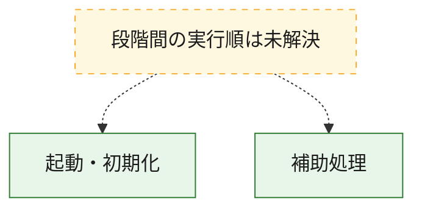
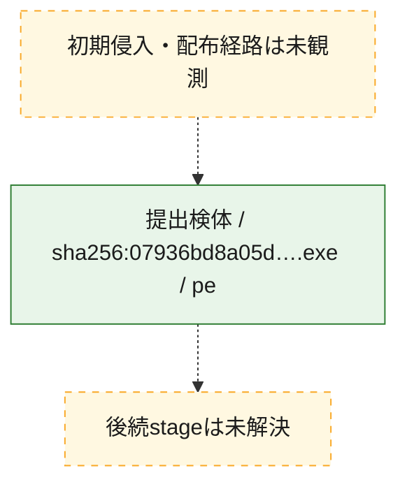
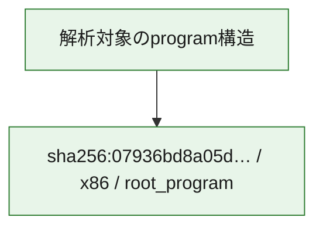

# 全体ロジック：07936bd8a05d6db787bfa5f8b10c1335ef708f660dcd2b1eee715c9b66283e80

代表関数の静的証跡から、起動・初期化の処理群を確認しました。

## 読み方

- phaseの掲載順は解析上の整理順です。observed_call_edgesがない段階間の実行順を断定しません。
- 図の実線は静的に観測した関係、点線と黄色のノードは未観測・未解決の関係を示します。
- 図は静的な要約であり、動的実行を再現するものではありません。
- 詳細な関数解説とfingerprintは[STATIC-LOGIC.md](STATIC-LOGIC.md)を参照してください。

## 静的可視化

### 実行フロー

### 感染チェーン

### モジュール関係

## 処理段階

### 1. 起動・初期化

entry pointから初期化と後続処理への移行を確認します。
確度: `confirmed_static_function_evidence`

- `07936bd8a05d6db787bfa5f8b10c1335ef708f660dcd2b1eee715c9b66283e80:ghidra:1400a23c7` — 初期化と主要処理への分岐を行う入口関数です。 状態: `succeeded`、選定理由: `entry_point`, `meaningful_symbol_name`, `reviewed_call_centrality:6`, `role:entrypoint`, `small_program_complete_context`

### 2. 補助処理

主要処理を支える一般内部関数またはlibrary処理を確認します。
確度: `confirmed_static_function_evidence_with_limits`

- `07936bd8a05d6db787bfa5f8b10c1335ef708f660dcd2b1eee715c9b66283e80:ghidra:140001001` — 検体内部の一般処理を実装する関数です。 状態: `succeeded`、選定理由: `context_representative`, `reviewed_call_centrality:6`, `small_program_complete_context`
- `07936bd8a05d6db787bfa5f8b10c1335ef708f660dcd2b1eee715c9b66283e80:ghidra:140001b34` — 検体内部の一般処理を実装する関数です。 状態: `succeeded`、選定理由: `context_representative`, `reviewed_call_centrality:4`, `small_program_complete_context`
- `07936bd8a05d6db787bfa5f8b10c1335ef708f660dcd2b1eee715c9b66283e80:ghidra:1400037a7` — 検体内部の一般処理を実装する関数です。 状態: `succeeded`、選定理由: `context_representative`, `small_program_complete_context`
- `07936bd8a05d6db787bfa5f8b10c1335ef708f660dcd2b1eee715c9b66283e80:ghidra:140004f27` — 検体内部の一般処理を実装する関数です。 状態: `succeeded`、選定理由: `context_representative`, `reviewed_call_centrality:4`, `small_program_complete_context`
- `07936bd8a05d6db787bfa5f8b10c1335ef708f660dcd2b1eee715c9b66283e80:ghidra:1400068e3` — 検体内部の一般処理を実装する関数です。 状態: `succeeded`、選定理由: `context_representative`, `reviewed_call_centrality:1`, `small_program_complete_context`
- `07936bd8a05d6db787bfa5f8b10c1335ef708f660dcd2b1eee715c9b66283e80:ghidra:140008ea6` — 検体内部の一般処理を実装する関数です。 状態: `succeeded`、選定理由: `context_representative`, `reviewed_call_centrality:2`, `small_program_complete_context`
- `07936bd8a05d6db787bfa5f8b10c1335ef708f660dcd2b1eee715c9b66283e80:ghidra:14000cf27` — 検体内部の一般処理を実装する関数です。 状態: `succeeded`、選定理由: `context_representative`, `small_program_complete_context`
- `07936bd8a05d6db787bfa5f8b10c1335ef708f660dcd2b1eee715c9b66283e80:ghidra:14000e3c1` — 検体内部の一般処理を実装する関数です。 状態: `succeeded`、選定理由: `context_representative`, `reviewed_call_centrality:5`, `small_program_complete_context`
- `07936bd8a05d6db787bfa5f8b10c1335ef708f660dcd2b1eee715c9b66283e80:ghidra:14001414e` — 検体内部の一般処理を実装する関数です。 状態: `succeeded`、選定理由: `context_representative`, `reviewed_call_centrality:6`, `small_program_complete_context`
- `07936bd8a05d6db787bfa5f8b10c1335ef708f660dcd2b1eee715c9b66283e80:ghidra:14002362b` — 検体内部の一般処理を実装する関数です。 状態: `succeeded`、選定理由: `context_representative`, `small_program_complete_context`
- `07936bd8a05d6db787bfa5f8b10c1335ef708f660dcd2b1eee715c9b66283e80:ghidra:140023c64` — 検体内部の一般処理を実装する関数です。 状態: `succeeded`、選定理由: `context_representative`, `reviewed_call_centrality:2`, `small_program_complete_context`
- `07936bd8a05d6db787bfa5f8b10c1335ef708f660dcd2b1eee715c9b66283e80:ghidra:140024a27` — 検体内部の一般処理を実装する関数です。 状態: `failed`、選定理由: `context_representative`, `small_program_complete_context`
- `07936bd8a05d6db787bfa5f8b10c1335ef708f660dcd2b1eee715c9b66283e80:ghidra:140039835` — 検体内部の一般処理を実装する関数です。 状態: `succeeded`、選定理由: `context_representative`, `reviewed_call_centrality:10`, `small_program_complete_context`
- `07936bd8a05d6db787bfa5f8b10c1335ef708f660dcd2b1eee715c9b66283e80:ghidra:140047546` — 検体内部の一般処理を実装する関数です。 状態: `succeeded`、選定理由: `context_representative`, `reviewed_call_centrality:8`, `small_program_complete_context`
- `07936bd8a05d6db787bfa5f8b10c1335ef708f660dcd2b1eee715c9b66283e80:ghidra:14004fe69` — 検体内部の一般処理を実装する関数です。 状態: `succeeded`、選定理由: `context_representative`, `reviewed_call_centrality:4`, `small_program_complete_context`
- `07936bd8a05d6db787bfa5f8b10c1335ef708f660dcd2b1eee715c9b66283e80:ghidra:14006478f` — 検体内部の一般処理を実装する関数です。 状態: `failed`、選定理由: `context_representative`, `small_program_complete_context`
- `07936bd8a05d6db787bfa5f8b10c1335ef708f660dcd2b1eee715c9b66283e80:ghidra:1400ad709` — 検体内部の一般処理を実装する関数です。 状態: `succeeded`、選定理由: `context_representative`, `reviewed_call_centrality:7`, `small_program_complete_context`
- `07936bd8a05d6db787bfa5f8b10c1335ef708f660dcd2b1eee715c9b66283e80:ghidra:1400b235c` — 検体内部の一般処理を実装する関数です。 状態: `succeeded`、選定理由: `context_representative`, `reviewed_call_centrality:5`, `small_program_complete_context`
- `07936bd8a05d6db787bfa5f8b10c1335ef708f660dcd2b1eee715c9b66283e80:ghidra:1400b5a91` — 検体内部の一般処理を実装する関数です。 状態: `succeeded`、選定理由: `context_representative`, `reviewed_call_centrality:4`, `small_program_complete_context`
- `07936bd8a05d6db787bfa5f8b10c1335ef708f660dcd2b1eee715c9b66283e80:ghidra:1400b9ddc` — 検体内部の一般処理を実装する関数です。 状態: `succeeded`、選定理由: `context_representative`, `reviewed_call_centrality:4`, `small_program_complete_context`
- `07936bd8a05d6db787bfa5f8b10c1335ef708f660dcd2b1eee715c9b66283e80:ghidra:1400bd5d0` — 検体内部の一般処理を実装する関数です。 状態: `succeeded`、選定理由: `context_representative`, `small_program_complete_context`
- `07936bd8a05d6db787bfa5f8b10c1335ef708f660dcd2b1eee715c9b66283e80:ghidra:1400bd6e0` — 検体内部の一般処理を実装する関数です。 状態: `succeeded`、選定理由: `context_representative`, `small_program_complete_context`
- `07936bd8a05d6db787bfa5f8b10c1335ef708f660dcd2b1eee715c9b66283e80:ghidra:1400bd8a0` — 検体内部の一般処理を実装する関数です。 状態: `succeeded`、選定理由: `context_representative`, `small_program_complete_context`
- `07936bd8a05d6db787bfa5f8b10c1335ef708f660dcd2b1eee715c9b66283e80:ghidra:1400bd990` — 検体内部の一般処理を実装する関数です。 状態: `succeeded`、選定理由: `context_representative`, `reviewed_call_centrality:1`, `small_program_complete_context`
- `07936bd8a05d6db787bfa5f8b10c1335ef708f660dcd2b1eee715c9b66283e80:ghidra:1400bde10` — 検体内部の一般処理を実装する関数です。 状態: `succeeded`、選定理由: `context_representative`, `small_program_complete_context`
- `07936bd8a05d6db787bfa5f8b10c1335ef708f660dcd2b1eee715c9b66283e80:ghidra:1400be0f0` — 検体内部の一般処理を実装する関数です。 状態: `succeeded`、選定理由: `context_representative`, `small_program_complete_context`
- `07936bd8a05d6db787bfa5f8b10c1335ef708f660dcd2b1eee715c9b66283e80:ghidra:1400becb0` — 検体内部の一般処理を実装する関数です。 状態: `succeeded`、選定理由: `context_representative`, `reviewed_call_centrality:1`, `small_program_complete_context`
- `07936bd8a05d6db787bfa5f8b10c1335ef708f660dcd2b1eee715c9b66283e80:ghidra:1400bf4c0` — 検体内部の一般処理を実装する関数です。 状態: `succeeded`、選定理由: `context_representative`, `small_program_complete_context`

## 観測したcall関係

- `07936bd8a05d6db787bfa5f8b10c1335ef708f660dcd2b1eee715c9b66283e80:ghidra:14000e3c1` → `07936bd8a05d6db787bfa5f8b10c1335ef708f660dcd2b1eee715c9b66283e80:ghidra:140001001` （`support` → `support`）
- `07936bd8a05d6db787bfa5f8b10c1335ef708f660dcd2b1eee715c9b66283e80:ghidra:140039835` → `07936bd8a05d6db787bfa5f8b10c1335ef708f660dcd2b1eee715c9b66283e80:ghidra:140001001` （`support` → `support`）
- `ghidra-function:02f8d6decd46fb05104c747e` → `ghidra-external:7ffaea757dc2988a7474c2df` （`unclassified` → `unclassified`）
- `ghidra-function:02f8d6decd46fb05104c747e` → `ghidra-external:e4a09149f90effb4305fa1d5` （`unclassified` → `unclassified`）
- `ghidra-function:02f8d6decd46fb05104c747e` → `ghidra-function:ecdc9f06d599bb9793281548` （`unclassified` → `unclassified`）
- `ghidra-function:168aba18ae1e8fe3cc84fb92` → `ghidra-external:267f24942eaa4de6743a5330` （`unclassified` → `unclassified`）
- `ghidra-function:168aba18ae1e8fe3cc84fb92` → `ghidra-external:7ffaea757dc2988a7474c2df` （`unclassified` → `unclassified`）
- `ghidra-function:168aba18ae1e8fe3cc84fb92` → `ghidra-external:9635745bc19051de6cef3e19` （`unclassified` → `unclassified`）
- `ghidra-function:168aba18ae1e8fe3cc84fb92` → `ghidra-external:e4a09149f90effb4305fa1d5` （`unclassified` → `unclassified`）
- `ghidra-function:168aba18ae1e8fe3cc84fb92` → `ghidra-function:28591e9b164bb807d9e83a9a` （`unclassified` → `unclassified`）
- `ghidra-function:26f80f07264f65531626e5c0` → `ghidra-external:7ffaea757dc2988a7474c2df` （`unclassified` → `unclassified`）
- `ghidra-function:26f80f07264f65531626e5c0` → `ghidra-external:9635745bc19051de6cef3e19` （`unclassified` → `unclassified`）
- `ghidra-function:26f80f07264f65531626e5c0` → `ghidra-external:e4a09149f90effb4305fa1d5` （`unclassified` → `unclassified`）
- `ghidra-function:26f80f07264f65531626e5c0` → `ghidra-function:0f63cdd2452ca74c4418cc99` （`unclassified` → `unclassified`）
- `ghidra-function:26f80f07264f65531626e5c0` → `ghidra-function:31c98e8fbf5609bc6c9bb615` （`unclassified` → `unclassified`）
- `ghidra-function:28591e9b164bb807d9e83a9a` → `ghidra-external:7ffaea757dc2988a7474c2df` （`unclassified` → `unclassified`）
- `ghidra-function:28591e9b164bb807d9e83a9a` → `ghidra-external:9635745bc19051de6cef3e19` （`unclassified` → `unclassified`）
- `ghidra-function:28591e9b164bb807d9e83a9a` → `ghidra-external:c1af433e0b90e3c393472a27` （`unclassified` → `unclassified`）
- `ghidra-function:28591e9b164bb807d9e83a9a` → `ghidra-external:e4a09149f90effb4305fa1d5` （`unclassified` → `unclassified`）
- `ghidra-function:33888bd62f2754f95d55dbdc` → `ghidra-external:267f24942eaa4de6743a5330` （`unclassified` → `unclassified`）
- `ghidra-function:33888bd62f2754f95d55dbdc` → `ghidra-external:7ffaea757dc2988a7474c2df` （`unclassified` → `unclassified`）
- `ghidra-function:33888bd62f2754f95d55dbdc` → `ghidra-external:9635745bc19051de6cef3e19` （`unclassified` → `unclassified`）
- `ghidra-function:33888bd62f2754f95d55dbdc` → `ghidra-external:c1af433e0b90e3c393472a27` （`unclassified` → `unclassified`）
- `ghidra-function:33888bd62f2754f95d55dbdc` → `ghidra-external:daf278ac03544ef412e4d912` （`unclassified` → `unclassified`）
- `ghidra-function:33888bd62f2754f95d55dbdc` → `ghidra-external:e4a09149f90effb4305fa1d5` （`unclassified` → `unclassified`）
- `ghidra-function:3cfeec4953928e5a47b291d8` → `ghidra-external:5a8e0e4a768b70d4b4a6738a` （`unclassified` → `unclassified`）
- `ghidra-function:5f3bbd3e8b991263a3b3f036` → `ghidra-external:267f24942eaa4de6743a5330` （`unclassified` → `unclassified`）
- `ghidra-function:5f3bbd3e8b991263a3b3f036` → `ghidra-external:7ffaea757dc2988a7474c2df` （`unclassified` → `unclassified`）
- `ghidra-function:5f3bbd3e8b991263a3b3f036` → `ghidra-external:9635745bc19051de6cef3e19` （`unclassified` → `unclassified`）
- `ghidra-function:5f3bbd3e8b991263a3b3f036` → `ghidra-external:e4a09149f90effb4305fa1d5` （`unclassified` → `unclassified`）
- `ghidra-function:5f3bbd3e8b991263a3b3f036` → `ghidra-function:01a6ec0495892f53f9751ee1` （`unclassified` → `unclassified`）
- `ghidra-function:6f51a74c5e617cd0313dea5c` → `ghidra-external:267f24942eaa4de6743a5330` （`unclassified` → `unclassified`）
- `ghidra-function:6f51a74c5e617cd0313dea5c` → `ghidra-external:7ffaea757dc2988a7474c2df` （`unclassified` → `unclassified`）
- `ghidra-function:6f51a74c5e617cd0313dea5c` → `ghidra-external:9635745bc19051de6cef3e19` （`unclassified` → `unclassified`）
- `ghidra-function:6f51a74c5e617cd0313dea5c` → `ghidra-external:c1af433e0b90e3c393472a27` （`unclassified` → `unclassified`）
- `ghidra-function:6f51a74c5e617cd0313dea5c` → `ghidra-external:e4a09149f90effb4305fa1d5` （`unclassified` → `unclassified`）
- `ghidra-function:70f14c7db778aa2d77b06100` → `ghidra-external:7ffaea757dc2988a7474c2df` （`unclassified` → `unclassified`）
- `ghidra-function:70f14c7db778aa2d77b06100` → `ghidra-external:9635745bc19051de6cef3e19` （`unclassified` → `unclassified`）
- `ghidra-function:70f14c7db778aa2d77b06100` → `ghidra-external:c1af433e0b90e3c393472a27` （`unclassified` → `unclassified`）
- `ghidra-function:70f14c7db778aa2d77b06100` → `ghidra-external:e4a09149f90effb4305fa1d5` （`unclassified` → `unclassified`）
- `ghidra-function:8104f71c59fddfdeee609c3e` → `ghidra-external:7ffaea757dc2988a7474c2df` （`unclassified` → `unclassified`）
- `ghidra-function:8104f71c59fddfdeee609c3e` → `ghidra-external:e4a09149f90effb4305fa1d5` （`unclassified` → `unclassified`）
- `ghidra-function:889d16ad2ed47859f3e71a05` → `ghidra-external:7ffaea757dc2988a7474c2df` （`unclassified` → `unclassified`）
- `ghidra-function:889d16ad2ed47859f3e71a05` → `ghidra-external:9635745bc19051de6cef3e19` （`unclassified` → `unclassified`）
- `ghidra-function:889d16ad2ed47859f3e71a05` → `ghidra-external:c1af433e0b90e3c393472a27` （`unclassified` → `unclassified`）
- `ghidra-function:889d16ad2ed47859f3e71a05` → `ghidra-external:e4a09149f90effb4305fa1d5` （`unclassified` → `unclassified`）
- `ghidra-function:a55d658939ddfd59fd5b72a1` → `ghidra-external:5a8e0e4a768b70d4b4a6738a` （`unclassified` → `unclassified`）
- `ghidra-function:a88e6716106e0d666ef2c215` → `ghidra-external:7ffaea757dc2988a7474c2df` （`unclassified` → `unclassified`）
- `ghidra-function:a88e6716106e0d666ef2c215` → `ghidra-external:9635745bc19051de6cef3e19` （`unclassified` → `unclassified`）
- `ghidra-function:a88e6716106e0d666ef2c215` → `ghidra-external:c1af433e0b90e3c393472a27` （`unclassified` → `unclassified`）
- `ghidra-function:a88e6716106e0d666ef2c215` → `ghidra-external:e4a09149f90effb4305fa1d5` （`unclassified` → `unclassified`）
- `ghidra-function:a88e6716106e0d666ef2c215` → `ghidra-function:1ea0ef7bc3dbf099addd54ed` （`unclassified` → `unclassified`）
- `ghidra-function:a88e6716106e0d666ef2c215` → `ghidra-function:ff3d6bb86c6a096a8e97bee1` （`unclassified` → `unclassified`）
- `ghidra-function:ca8b281c10f6d72ef4585a4c` → `ghidra-external:7ffaea757dc2988a7474c2df` （`unclassified` → `unclassified`）
- `ghidra-function:ca8b281c10f6d72ef4585a4c` → `ghidra-external:9635745bc19051de6cef3e19` （`unclassified` → `unclassified`）
- `ghidra-function:ca8b281c10f6d72ef4585a4c` → `ghidra-external:c1af433e0b90e3c393472a27` （`unclassified` → `unclassified`）
- `ghidra-function:ca8b281c10f6d72ef4585a4c` → `ghidra-external:e4a09149f90effb4305fa1d5` （`unclassified` → `unclassified`）
- `ghidra-function:df30f5f07d7f129f14614318` → `ghidra-external:267f24942eaa4de6743a5330` （`unclassified` → `unclassified`）
- `ghidra-function:df30f5f07d7f129f14614318` → `ghidra-external:7ffaea757dc2988a7474c2df` （`unclassified` → `unclassified`）
- `ghidra-function:df30f5f07d7f129f14614318` → `ghidra-external:9635745bc19051de6cef3e19` （`unclassified` → `unclassified`）
- `ghidra-function:df30f5f07d7f129f14614318` → `ghidra-external:e4a09149f90effb4305fa1d5` （`unclassified` → `unclassified`）
- `ghidra-function:e72bd930800f1f34af5af852` → `ghidra-external:7ffaea757dc2988a7474c2df` （`unclassified` → `unclassified`）
- `ghidra-function:f3fcf0eb5c99e97e26322a1a` → `ghidra-external:267f24942eaa4de6743a5330` （`unclassified` → `unclassified`）
- `ghidra-function:f3fcf0eb5c99e97e26322a1a` → `ghidra-external:7ffaea757dc2988a7474c2df` （`unclassified` → `unclassified`）
- `ghidra-function:fad797ef917fef92c11e37d1` → `ghidra-external:313441ad8b33dd1ed04a3b3d` （`unclassified` → `unclassified`）
- `ghidra-function:fad797ef917fef92c11e37d1` → `ghidra-external:5ba7b973c82b2334bf5c89bf` （`unclassified` → `unclassified`）
- `ghidra-function:fad797ef917fef92c11e37d1` → `ghidra-external:7ffaea757dc2988a7474c2df` （`unclassified` → `unclassified`）
- `ghidra-function:fad797ef917fef92c11e37d1` → `ghidra-external:9635745bc19051de6cef3e19` （`unclassified` → `unclassified`）
- `ghidra-function:fad797ef917fef92c11e37d1` → `ghidra-external:e4a09149f90effb4305fa1d5` （`unclassified` → `unclassified`）
- `ghidra-function:fad797ef917fef92c11e37d1` → `ghidra-function:28591e9b164bb807d9e83a9a` （`unclassified` → `unclassified`）
- `ghidra-function:fad797ef917fef92c11e37d1` → `ghidra-function:825a807edf65465c35dd3651` （`unclassified` → `unclassified`）
- `ghidra-function:fad797ef917fef92c11e37d1` → `ghidra-function:93728fc7b2d7b091fa9a7cba` （`unclassified` → `unclassified`）

## 解析範囲と制約

- 選定外関数は全体inventoryへ残しますが、関数本体の個別解説対象にはしていません。
- indirect call、難読化、packer、VM、壊れたcontrol flowによりcall関係が欠落する場合があります。
- 文書は静的解析に基づき、検体実行や外部通信による動的確認は行っていません。
