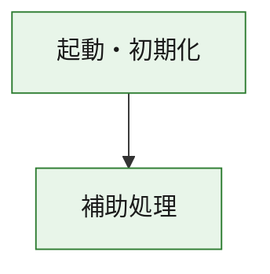
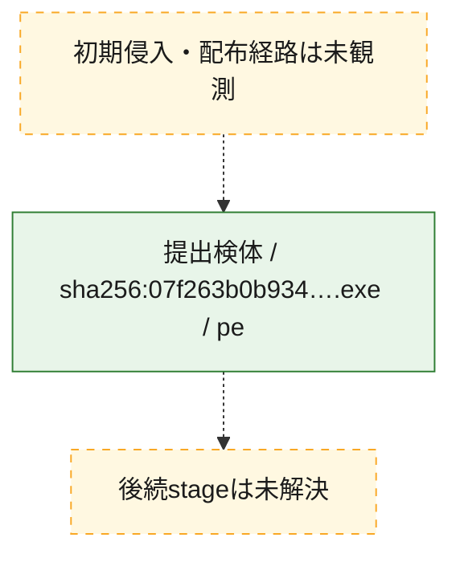
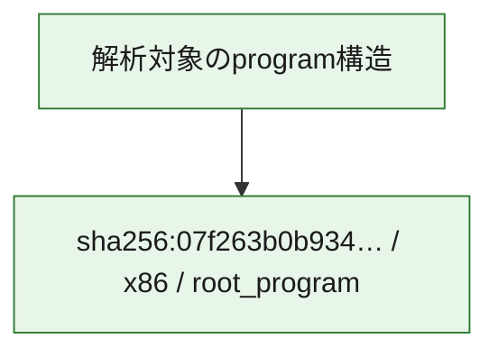

# 全体ロジック：07f263b0b93461f778a0e22ae977be22d8d64b88619aa48af018aed984875a6e

代表関数の静的証跡から、起動・初期化の処理群を確認しました。

## 読み方

- phaseの掲載順は解析上の整理順です。observed_call_edgesがない段階間の実行順を断定しません。
- 図の実線は静的に観測した関係、点線と黄色のノードは未観測・未解決の関係を示します。
- 図は静的な要約であり、動的実行を再現するものではありません。
- 詳細な関数解説とfingerprintは[STATIC-LOGIC.md](STATIC-LOGIC.md)を参照してください。

## 静的可視化

### 実行フロー

### 感染チェーン

### モジュール関係

## 処理段階

### 1. 起動・初期化

entry pointから初期化と後続処理への移行を確認します。
確度: `confirmed_static_function_evidence`

- `07f263b0b93461f778a0e22ae977be22d8d64b88619aa48af018aed984875a6e:ghidra:180001010` — 初期化と主要処理への分岐を行う入口関数です。 状態: `succeeded`、選定理由: `entry_point`, `meaningful_symbol_name`, `reviewed_call_centrality:22`, `role:entrypoint`, `small_program_complete_context`

### 2. 補助処理

主要処理を支える一般内部関数またはlibrary処理を確認します。
確度: `confirmed_static_function_evidence`

- `07f263b0b93461f778a0e22ae977be22d8d64b88619aa48af018aed984875a6e:ghidra:180001240` — 検体内部の一般処理を実装する関数です。 状態: `succeeded`、選定理由: `context_representative`, `reviewed_call_centrality:2`, `small_program_complete_context`
- `07f263b0b93461f778a0e22ae977be22d8d64b88619aa48af018aed984875a6e:ghidra:180001350` — 検体内部の一般処理を実装する関数です。 状態: `succeeded`、選定理由: `context_representative`, `reviewed_call_centrality:25`, `small_program_complete_context`
- `07f263b0b93461f778a0e22ae977be22d8d64b88619aa48af018aed984875a6e:ghidra:180003780` — 検体内部の一般処理を実装する関数です。 状態: `succeeded`、選定理由: `context_representative`, `reviewed_call_centrality:2`, `small_program_complete_context`
- `07f263b0b93461f778a0e22ae977be22d8d64b88619aa48af018aed984875a6e:ghidra:1800038e0` — 検体内部の一般処理を実装する関数です。 状態: `succeeded`、選定理由: `context_representative`, `reviewed_call_centrality:2`, `small_program_complete_context`

## 観測したcall関係

- `07f263b0b93461f778a0e22ae977be22d8d64b88619aa48af018aed984875a6e:ghidra:180001010` → `07f263b0b93461f778a0e22ae977be22d8d64b88619aa48af018aed984875a6e:ghidra:180001240` （`startup` → `support`）
- `07f263b0b93461f778a0e22ae977be22d8d64b88619aa48af018aed984875a6e:ghidra:180001010` → `07f263b0b93461f778a0e22ae977be22d8d64b88619aa48af018aed984875a6e:ghidra:180001350` （`startup` → `support`）
- `07f263b0b93461f778a0e22ae977be22d8d64b88619aa48af018aed984875a6e:ghidra:180001350` → `07f263b0b93461f778a0e22ae977be22d8d64b88619aa48af018aed984875a6e:ghidra:180001240` （`support` → `support`）
- `07f263b0b93461f778a0e22ae977be22d8d64b88619aa48af018aed984875a6e:ghidra:180001350` → `07f263b0b93461f778a0e22ae977be22d8d64b88619aa48af018aed984875a6e:ghidra:180003780` （`support` → `support`）
- `07f263b0b93461f778a0e22ae977be22d8d64b88619aa48af018aed984875a6e:ghidra:180001350` → `07f263b0b93461f778a0e22ae977be22d8d64b88619aa48af018aed984875a6e:ghidra:1800038e0` （`support` → `support`）
- `07f263b0b93461f778a0e22ae977be22d8d64b88619aa48af018aed984875a6e:ghidra:180003780` → `07f263b0b93461f778a0e22ae977be22d8d64b88619aa48af018aed984875a6e:ghidra:1800038e0` （`support` → `support`）
- `ghidra-function:58fbc8c58206cd4429be483b` → `ghidra-external:236d033178de7c532d99f983` （`unclassified` → `unclassified`）
- `ghidra-function:58fbc8c58206cd4429be483b` → `ghidra-external:2704feaad3530b1006446adc` （`unclassified` → `unclassified`）
- `ghidra-function:58fbc8c58206cd4429be483b` → `ghidra-external:2d9e7584980eaa7ddc185166` （`unclassified` → `unclassified`）
- `ghidra-function:58fbc8c58206cd4429be483b` → `ghidra-external:348d90bb8dbe9fca5ec593ba` （`unclassified` → `unclassified`）
- `ghidra-function:58fbc8c58206cd4429be483b` → `ghidra-external:35bd4a34768276791c2b4985` （`unclassified` → `unclassified`）
- `ghidra-function:58fbc8c58206cd4429be483b` → `ghidra-external:41ce9804ae9822c894567e16` （`unclassified` → `unclassified`）
- `ghidra-function:58fbc8c58206cd4429be483b` → `ghidra-external:549e7f7d4d9c0447561d0978` （`unclassified` → `unclassified`）
- `ghidra-function:58fbc8c58206cd4429be483b` → `ghidra-external:5c1919547d2ffdf3d7496cd4` （`unclassified` → `unclassified`）
- `ghidra-function:58fbc8c58206cd4429be483b` → `ghidra-external:78ea9fa497151aabd4a11bf3` （`unclassified` → `unclassified`）
- `ghidra-function:58fbc8c58206cd4429be483b` → `ghidra-external:a8983bd08ad6eee5257c147f` （`unclassified` → `unclassified`）
- `ghidra-function:58fbc8c58206cd4429be483b` → `ghidra-external:b2db8f990a7971d985eea31b` （`unclassified` → `unclassified`）
- `ghidra-function:58fbc8c58206cd4429be483b` → `ghidra-external:b819a0027dca27ecb055ab3e` （`unclassified` → `unclassified`）
- `ghidra-function:58fbc8c58206cd4429be483b` → `ghidra-external:c580ec082d4e3057ddb0d659` （`unclassified` → `unclassified`）
- `ghidra-function:58fbc8c58206cd4429be483b` → `ghidra-external:c64357aa201f337d1f845db0` （`unclassified` → `unclassified`）
- `ghidra-function:58fbc8c58206cd4429be483b` → `ghidra-external:cf795d81b1f16d6e30eb18bf` （`unclassified` → `unclassified`）
- `ghidra-function:58fbc8c58206cd4429be483b` → `ghidra-external:cfd1b77b6d40b9a33cd7bb73` （`unclassified` → `unclassified`）
- `ghidra-function:58fbc8c58206cd4429be483b` → `ghidra-external:dca51a9f4435838b46ef66df` （`unclassified` → `unclassified`）
- `ghidra-function:58fbc8c58206cd4429be483b` → `ghidra-external:e06468d15d54813b29dc6e9b` （`unclassified` → `unclassified`）
- `ghidra-function:58fbc8c58206cd4429be483b` → `ghidra-external:e1dde649e619f35832ab39a5` （`unclassified` → `unclassified`）
- `ghidra-function:58fbc8c58206cd4429be483b` → `ghidra-external:e2a320c7cf3affc8cc4926a5` （`unclassified` → `unclassified`）
- `ghidra-function:58fbc8c58206cd4429be483b` → `ghidra-external:e7da22a72198041b7b22a60a` （`unclassified` → `unclassified`）
- `ghidra-function:58fbc8c58206cd4429be483b` → `ghidra-function:a3f275950f656788f2eca6d6` （`unclassified` → `unclassified`）
- `ghidra-function:58fbc8c58206cd4429be483b` → `ghidra-function:c24628c5a6923f203140e8be` （`unclassified` → `unclassified`）
- `ghidra-function:58fbc8c58206cd4429be483b` → `ghidra-function:fa770ed070c4d0a231f801a1` （`unclassified` → `unclassified`）
- `ghidra-function:5e04bd6ea175ab80f44eb8e5` → `ghidra-function:09d9eb7eda92525d09122b8c` （`unclassified` → `unclassified`）
- `ghidra-function:5e04bd6ea175ab80f44eb8e5` → `ghidra-function:1cd1b5511c3ba346390c0db8` （`unclassified` → `unclassified`）
- `ghidra-function:5e04bd6ea175ab80f44eb8e5` → `ghidra-function:32d6944daeb3edc41aefa944` （`unclassified` → `unclassified`）
- `ghidra-function:5e04bd6ea175ab80f44eb8e5` → `ghidra-function:34591c84d8a4ad4917c15bdc` （`unclassified` → `unclassified`）
- `ghidra-function:5e04bd6ea175ab80f44eb8e5` → `ghidra-function:58fbc8c58206cd4429be483b` （`unclassified` → `unclassified`）
- `ghidra-function:5e04bd6ea175ab80f44eb8e5` → `ghidra-function:6d3ee03546139e036ca9c1d6` （`unclassified` → `unclassified`）
- `ghidra-function:5e04bd6ea175ab80f44eb8e5` → `ghidra-function:78634a83a7e86431abd7f7c4` （`unclassified` → `unclassified`）
- `ghidra-function:5e04bd6ea175ab80f44eb8e5` → `ghidra-function:955a425cd71648d9c0dfbb9b` （`unclassified` → `unclassified`）
- `ghidra-function:5e04bd6ea175ab80f44eb8e5` → `ghidra-function:b4e5f12778b933c8df38c948` （`unclassified` → `unclassified`）
- `ghidra-function:5e04bd6ea175ab80f44eb8e5` → `ghidra-function:bf739b3d45e70441a5343627` （`unclassified` → `unclassified`）
- `ghidra-function:5e04bd6ea175ab80f44eb8e5` → `ghidra-function:c24628c5a6923f203140e8be` （`unclassified` → `unclassified`）
- `ghidra-function:5e04bd6ea175ab80f44eb8e5` → `ghidra-function:cdc7a0aa7c15290c20059eec` （`unclassified` → `unclassified`）
- `ghidra-function:a3f275950f656788f2eca6d6` → `ghidra-function:fa770ed070c4d0a231f801a1` （`unclassified` → `unclassified`）

## 解析範囲と制約

- 選定外関数は全体inventoryへ残しますが、関数本体の個別解説対象にはしていません。
- indirect call、難読化、packer、VM、壊れたcontrol flowによりcall関係が欠落する場合があります。
- 文書は静的解析に基づき、検体実行や外部通信による動的確認は行っていません。
