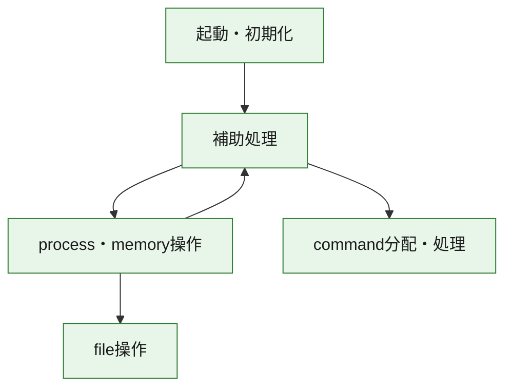
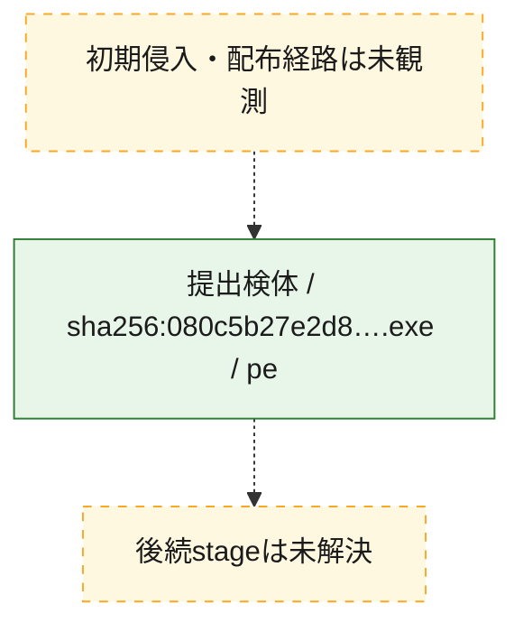
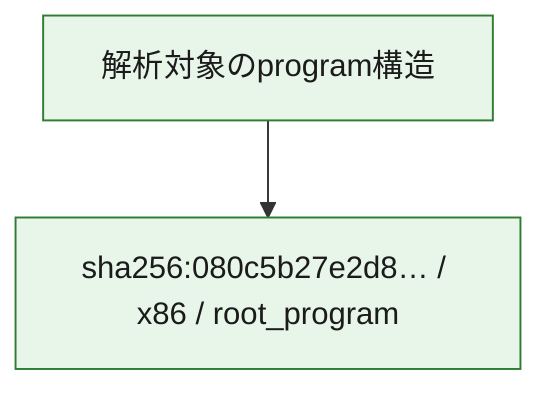

# 全体ロジック：080c5b27e2d8a2b13d5cda93ee502b767bc43e787df95899ace6f27ed9c1dd22

代表関数の静的証跡から、起動・初期化、process・memory操作、command分配・処理、file操作の処理群を確認しました。

## 読み方

- phaseの掲載順は解析上の整理順です。observed_call_edgesがない段階間の実行順を断定しません。
- 図の実線は静的に観測した関係、点線と黄色のノードは未観測・未解決の関係を示します。
- 図は静的な要約であり、動的実行を再現するものではありません。
- 詳細な関数解説とfingerprintは[STATIC-LOGIC.md](STATIC-LOGIC.md)を参照してください。

## 静的可視化

### 実行フロー

### 感染チェーン

### モジュール関係

## 処理段階

### 1. 起動・初期化

entry pointから初期化と後続処理への移行を確認します。
確度: `confirmed_static_function_evidence`

- `080c5b27e2d8a2b13d5cda93ee502b767bc43e787df95899ace6f27ed9c1dd22:ghidra:140001000` — 初期化と主要処理への分岐を行う入口関数です。 状態: `succeeded`、選定理由: `entry_point`, `meaningful_symbol_name`, `reviewed_call_centrality:1`, `role:entrypoint`, `small_program_complete_context`

### 2. process・memory操作

process、thread、module、memory操作と実行移行を確認します。
確度: `confirmed_static_function_evidence`

- `080c5b27e2d8a2b13d5cda93ee502b767bc43e787df95899ace6f27ed9c1dd22:ghidra:1400013e0` — process、thread、module、またはmemory操作に関係する関数です。 状態: `succeeded`、選定理由: `context_representative`, `reviewed_call_centrality:50`, `role:process_or_memory_operation`, `small_program_complete_context`
- `080c5b27e2d8a2b13d5cda93ee502b767bc43e787df95899ace6f27ed9c1dd22:ghidra:140002290` — process、thread、module、またはmemory操作に関係する関数です。 状態: `succeeded`、選定理由: `context_representative`, `reviewed_call_centrality:8`, `role:process_or_memory_operation`, `small_program_complete_context`
- `080c5b27e2d8a2b13d5cda93ee502b767bc43e787df95899ace6f27ed9c1dd22:ghidra:140003b30` — process、thread、module、またはmemory操作に関係する関数です。 状態: `succeeded`、選定理由: `context_representative`, `reviewed_call_centrality:11`, `role:process_or_memory_operation`, `small_program_complete_context`

### 3. command分配・処理

受信commandやtaskの解釈、分配、個別handlerへの移行を確認します。
確度: `confirmed_static_function_evidence_with_limits`

- `080c5b27e2d8a2b13d5cda93ee502b767bc43e787df95899ace6f27ed9c1dd22:ghidra:1400045e0` — commandの解釈、分配、または個別処理を担当する関数です。 状態: `limited_bad_instruction_or_flow`、選定理由: `meaningful_symbol_name`, `reviewed_call_centrality:7`, `role:command_dispatch_or_handler`, `small_program_complete_context`

### 4. file操作

fileやdirectoryの作成、読書き、削除を確認します。
確度: `confirmed_static_function_evidence`

- `080c5b27e2d8a2b13d5cda93ee502b767bc43e787df95899ace6f27ed9c1dd22:ghidra:1400021a0` — fileまたはdirectoryの読書き・管理に関係する関数です。 状態: `succeeded`、選定理由: `context_representative`, `reviewed_call_centrality:11`, `role:file_operation`, `small_program_complete_context`

### 5. 補助処理

主要処理を支える一般内部関数またはlibrary処理を確認します。
確度: `confirmed_static_function_evidence_with_limits`

- `080c5b27e2d8a2b13d5cda93ee502b767bc43e787df95899ace6f27ed9c1dd22:ghidra:140001020` — 検体内部の一般処理を実装する関数です。 状態: `succeeded`、選定理由: `context_representative`, `reviewed_call_centrality:32`, `small_program_complete_context`
- `080c5b27e2d8a2b13d5cda93ee502b767bc43e787df95899ace6f27ed9c1dd22:ghidra:1400013a0` — 検体内部の一般処理を実装する関数です。 状態: `succeeded`、選定理由: `context_representative`, `reviewed_call_centrality:1`, `small_program_complete_context`
- `080c5b27e2d8a2b13d5cda93ee502b767bc43e787df95899ace6f27ed9c1dd22:ghidra:140001f20` — 検体内部の一般処理を実装する関数です。 状態: `succeeded`、選定理由: `context_representative`, `reviewed_call_centrality:2`, `small_program_complete_context`
- `080c5b27e2d8a2b13d5cda93ee502b767bc43e787df95899ace6f27ed9c1dd22:ghidra:140002140` — 検体内部の一般処理を実装する関数です。 状態: `succeeded`、選定理由: `context_representative`, `reviewed_call_centrality:3`, `small_program_complete_context`
- `080c5b27e2d8a2b13d5cda93ee502b767bc43e787df95899ace6f27ed9c1dd22:ghidra:140002320` — 検体内部の一般処理を実装する関数です。 状態: `succeeded`、選定理由: `context_representative`, `reviewed_call_centrality:1`, `small_program_complete_context`
- `080c5b27e2d8a2b13d5cda93ee502b767bc43e787df95899ace6f27ed9c1dd22:ghidra:140002380` — 検体内部の一般処理を実装する関数です。 状態: `succeeded`、選定理由: `context_representative`, `reviewed_call_centrality:11`, `small_program_complete_context`
- `080c5b27e2d8a2b13d5cda93ee502b767bc43e787df95899ace6f27ed9c1dd22:ghidra:1400033f0` — compiler生成処理または汎用library処理とみられる関数です。 状態: `succeeded`、選定理由: `entry_point`, `meaningful_symbol_name`, `reviewed_call_centrality:3`, `small_program_complete_context`
- `080c5b27e2d8a2b13d5cda93ee502b767bc43e787df95899ace6f27ed9c1dd22:ghidra:140003490` — 検体内部の一般処理を実装する関数です。 状態: `succeeded`、選定理由: `context_representative`, `reviewed_call_centrality:1`, `small_program_complete_context`
- `080c5b27e2d8a2b13d5cda93ee502b767bc43e787df95899ace6f27ed9c1dd22:ghidra:1400034e0` — 検体内部の一般処理を実装する関数です。 状態: `limited_bad_instruction_or_flow`、選定理由: `context_representative`, `reviewed_call_centrality:3`, `small_program_complete_context`
- `080c5b27e2d8a2b13d5cda93ee502b767bc43e787df95899ace6f27ed9c1dd22:ghidra:140003550` — 検体内部の一般処理を実装する関数です。 状態: `limited_bad_instruction_or_flow`、選定理由: `context_representative`, `reviewed_call_centrality:5`, `small_program_complete_context`
- `080c5b27e2d8a2b13d5cda93ee502b767bc43e787df95899ace6f27ed9c1dd22:ghidra:1400035e0` — 検体内部の一般処理を実装する関数です。 状態: `limited_bad_instruction_or_flow`、選定理由: `context_representative`, `reviewed_call_centrality:3`, `small_program_complete_context`
- `080c5b27e2d8a2b13d5cda93ee502b767bc43e787df95899ace6f27ed9c1dd22:ghidra:140003740` — 検体内部の一般処理を実装する関数です。 状態: `succeeded`、選定理由: `context_representative`, `reviewed_call_centrality:1`, `small_program_complete_context`
- `080c5b27e2d8a2b13d5cda93ee502b767bc43e787df95899ace6f27ed9c1dd22:ghidra:1400037b0` — 検体内部の一般処理を実装する関数です。 状態: `succeeded`、選定理由: `context_representative`, `reviewed_call_centrality:2`, `small_program_complete_context`
- `080c5b27e2d8a2b13d5cda93ee502b767bc43e787df95899ace6f27ed9c1dd22:ghidra:140003820` — 検体内部の一般処理を実装する関数です。 状態: `succeeded`、選定理由: `context_representative`, `reviewed_call_centrality:4`, `small_program_complete_context`
- `080c5b27e2d8a2b13d5cda93ee502b767bc43e787df95899ace6f27ed9c1dd22:ghidra:140003cd0` — 検体内部の一般処理を実装する関数です。 状態: `succeeded`、選定理由: `context_representative`, `reviewed_call_centrality:6`, `small_program_complete_context`
- `080c5b27e2d8a2b13d5cda93ee502b767bc43e787df95899ace6f27ed9c1dd22:ghidra:140003d40` — 検体内部の一般処理を実装する関数です。 状態: `succeeded`、選定理由: `context_representative`, `reviewed_call_centrality:8`, `small_program_complete_context`
- `080c5b27e2d8a2b13d5cda93ee502b767bc43e787df95899ace6f27ed9c1dd22:ghidra:140003e20` — 検体内部の一般処理を実装する関数です。 状態: `succeeded`、選定理由: `meaningful_symbol_name`, `small_program_complete_context`
- `080c5b27e2d8a2b13d5cda93ee502b767bc43e787df95899ace6f27ed9c1dd22:ghidra:140003e30` — 検体内部の一般処理を実装する関数です。 状態: `succeeded`、選定理由: `context_representative`, `reviewed_call_centrality:7`, `small_program_complete_context`
- `080c5b27e2d8a2b13d5cda93ee502b767bc43e787df95899ace6f27ed9c1dd22:ghidra:140003ec0` — 検体内部の一般処理を実装する関数です。 状態: `succeeded`、選定理由: `context_representative`, `reviewed_call_centrality:5`, `small_program_complete_context`
- `080c5b27e2d8a2b13d5cda93ee502b767bc43e787df95899ace6f27ed9c1dd22:ghidra:140003ef0` — 検体内部の一般処理を実装する関数です。 状態: `succeeded`、選定理由: `context_representative`, `reviewed_call_centrality:5`, `small_program_complete_context`
- `080c5b27e2d8a2b13d5cda93ee502b767bc43e787df95899ace6f27ed9c1dd22:ghidra:140003f60` — 検体内部の一般処理を実装する関数です。 状態: `succeeded`、選定理由: `context_representative`, `reviewed_call_centrality:5`, `small_program_complete_context`
- `080c5b27e2d8a2b13d5cda93ee502b767bc43e787df95899ace6f27ed9c1dd22:ghidra:140003ff0` — 検体内部の一般処理を実装する関数です。 状態: `succeeded`、選定理由: `context_representative`, `reviewed_call_centrality:15`, `small_program_complete_context`
- `080c5b27e2d8a2b13d5cda93ee502b767bc43e787df95899ace6f27ed9c1dd22:ghidra:140004190` — 検体内部の一般処理を実装する関数です。 状態: `succeeded`、選定理由: `context_representative`, `reviewed_call_centrality:5`, `small_program_complete_context`
- `080c5b27e2d8a2b13d5cda93ee502b767bc43e787df95899ace6f27ed9c1dd22:ghidra:140004250` — 検体内部の一般処理を実装する関数です。 状態: `succeeded`、選定理由: `context_representative`, `reviewed_call_centrality:2`, `small_program_complete_context`
- `080c5b27e2d8a2b13d5cda93ee502b767bc43e787df95899ace6f27ed9c1dd22:ghidra:1400044b0` — 検体内部の一般処理を実装する関数です。 状態: `succeeded`、選定理由: `context_representative`, `reviewed_call_centrality:1`, `small_program_complete_context`
- `080c5b27e2d8a2b13d5cda93ee502b767bc43e787df95899ace6f27ed9c1dd22:ghidra:1400045a0` — 検体内部の一般処理を実装する関数です。 状態: `succeeded`、選定理由: `context_representative`, `reviewed_call_centrality:3`, `small_program_complete_context`

## 観測したcall関係

- `080c5b27e2d8a2b13d5cda93ee502b767bc43e787df95899ace6f27ed9c1dd22:ghidra:140001000` → `080c5b27e2d8a2b13d5cda93ee502b767bc43e787df95899ace6f27ed9c1dd22:ghidra:140001020` （`startup` → `support`）
- `080c5b27e2d8a2b13d5cda93ee502b767bc43e787df95899ace6f27ed9c1dd22:ghidra:140001020` → `080c5b27e2d8a2b13d5cda93ee502b767bc43e787df95899ace6f27ed9c1dd22:ghidra:140003550` （`support` → `support`）
- `080c5b27e2d8a2b13d5cda93ee502b767bc43e787df95899ace6f27ed9c1dd22:ghidra:140001020` → `080c5b27e2d8a2b13d5cda93ee502b767bc43e787df95899ace6f27ed9c1dd22:ghidra:140003820` （`support` → `support`）
- `080c5b27e2d8a2b13d5cda93ee502b767bc43e787df95899ace6f27ed9c1dd22:ghidra:140001020` → `080c5b27e2d8a2b13d5cda93ee502b767bc43e787df95899ace6f27ed9c1dd22:ghidra:140003d40` （`support` → `support`）
- `080c5b27e2d8a2b13d5cda93ee502b767bc43e787df95899ace6f27ed9c1dd22:ghidra:140001020` → `080c5b27e2d8a2b13d5cda93ee502b767bc43e787df95899ace6f27ed9c1dd22:ghidra:140003e30` （`support` → `support`）
- `080c5b27e2d8a2b13d5cda93ee502b767bc43e787df95899ace6f27ed9c1dd22:ghidra:140001020` → `080c5b27e2d8a2b13d5cda93ee502b767bc43e787df95899ace6f27ed9c1dd22:ghidra:140003ec0` （`support` → `support`）
- `080c5b27e2d8a2b13d5cda93ee502b767bc43e787df95899ace6f27ed9c1dd22:ghidra:140001020` → `080c5b27e2d8a2b13d5cda93ee502b767bc43e787df95899ace6f27ed9c1dd22:ghidra:1400045e0` （`support` → `dispatch`）
- `080c5b27e2d8a2b13d5cda93ee502b767bc43e787df95899ace6f27ed9c1dd22:ghidra:1400013a0` → `080c5b27e2d8a2b13d5cda93ee502b767bc43e787df95899ace6f27ed9c1dd22:ghidra:140001020` （`support` → `support`）
- `080c5b27e2d8a2b13d5cda93ee502b767bc43e787df95899ace6f27ed9c1dd22:ghidra:1400013e0` → `080c5b27e2d8a2b13d5cda93ee502b767bc43e787df95899ace6f27ed9c1dd22:ghidra:140001f20` （`execution` → `support`）
- `080c5b27e2d8a2b13d5cda93ee502b767bc43e787df95899ace6f27ed9c1dd22:ghidra:1400013e0` → `080c5b27e2d8a2b13d5cda93ee502b767bc43e787df95899ace6f27ed9c1dd22:ghidra:140002140` （`execution` → `support`）
- `080c5b27e2d8a2b13d5cda93ee502b767bc43e787df95899ace6f27ed9c1dd22:ghidra:1400013e0` → `080c5b27e2d8a2b13d5cda93ee502b767bc43e787df95899ace6f27ed9c1dd22:ghidra:1400021a0` （`execution` → `file_activity`）
- `080c5b27e2d8a2b13d5cda93ee502b767bc43e787df95899ace6f27ed9c1dd22:ghidra:140001f20` → `080c5b27e2d8a2b13d5cda93ee502b767bc43e787df95899ace6f27ed9c1dd22:ghidra:140002290` （`support` → `execution`）
- `080c5b27e2d8a2b13d5cda93ee502b767bc43e787df95899ace6f27ed9c1dd22:ghidra:140002290` → `080c5b27e2d8a2b13d5cda93ee502b767bc43e787df95899ace6f27ed9c1dd22:ghidra:140002320` （`execution` → `support`）
- `080c5b27e2d8a2b13d5cda93ee502b767bc43e787df95899ace6f27ed9c1dd22:ghidra:140003490` → `080c5b27e2d8a2b13d5cda93ee502b767bc43e787df95899ace6f27ed9c1dd22:ghidra:1400045e0` （`support` → `dispatch`）
- `080c5b27e2d8a2b13d5cda93ee502b767bc43e787df95899ace6f27ed9c1dd22:ghidra:1400034e0` → `080c5b27e2d8a2b13d5cda93ee502b767bc43e787df95899ace6f27ed9c1dd22:ghidra:1400045e0` （`support` → `dispatch`）
- `080c5b27e2d8a2b13d5cda93ee502b767bc43e787df95899ace6f27ed9c1dd22:ghidra:140003550` → `080c5b27e2d8a2b13d5cda93ee502b767bc43e787df95899ace6f27ed9c1dd22:ghidra:1400045e0` （`support` → `dispatch`）
- `080c5b27e2d8a2b13d5cda93ee502b767bc43e787df95899ace6f27ed9c1dd22:ghidra:1400035e0` → `080c5b27e2d8a2b13d5cda93ee502b767bc43e787df95899ace6f27ed9c1dd22:ghidra:1400045e0` （`support` → `dispatch`）
- `080c5b27e2d8a2b13d5cda93ee502b767bc43e787df95899ace6f27ed9c1dd22:ghidra:140003740` → `080c5b27e2d8a2b13d5cda93ee502b767bc43e787df95899ace6f27ed9c1dd22:ghidra:1400045e0` （`support` → `dispatch`）
- `080c5b27e2d8a2b13d5cda93ee502b767bc43e787df95899ace6f27ed9c1dd22:ghidra:1400037b0` → `080c5b27e2d8a2b13d5cda93ee502b767bc43e787df95899ace6f27ed9c1dd22:ghidra:140004190` （`support` → `support`）
- `080c5b27e2d8a2b13d5cda93ee502b767bc43e787df95899ace6f27ed9c1dd22:ghidra:140003b30` → `080c5b27e2d8a2b13d5cda93ee502b767bc43e787df95899ace6f27ed9c1dd22:ghidra:140003cd0` （`execution` → `support`）
- `080c5b27e2d8a2b13d5cda93ee502b767bc43e787df95899ace6f27ed9c1dd22:ghidra:140003cd0` → `080c5b27e2d8a2b13d5cda93ee502b767bc43e787df95899ace6f27ed9c1dd22:ghidra:140004190` （`support` → `support`）
- `080c5b27e2d8a2b13d5cda93ee502b767bc43e787df95899ace6f27ed9c1dd22:ghidra:140003cd0` → `080c5b27e2d8a2b13d5cda93ee502b767bc43e787df95899ace6f27ed9c1dd22:ghidra:1400045a0` （`support` → `support`）
- `080c5b27e2d8a2b13d5cda93ee502b767bc43e787df95899ace6f27ed9c1dd22:ghidra:140003d40` → `080c5b27e2d8a2b13d5cda93ee502b767bc43e787df95899ace6f27ed9c1dd22:ghidra:1400013e0` （`support` → `execution`）
- `080c5b27e2d8a2b13d5cda93ee502b767bc43e787df95899ace6f27ed9c1dd22:ghidra:140003d40` → `080c5b27e2d8a2b13d5cda93ee502b767bc43e787df95899ace6f27ed9c1dd22:ghidra:140003550` （`support` → `support`）
- `080c5b27e2d8a2b13d5cda93ee502b767bc43e787df95899ace6f27ed9c1dd22:ghidra:140003ec0` → `080c5b27e2d8a2b13d5cda93ee502b767bc43e787df95899ace6f27ed9c1dd22:ghidra:140004190` （`support` → `support`）
- `080c5b27e2d8a2b13d5cda93ee502b767bc43e787df95899ace6f27ed9c1dd22:ghidra:140003ff0` → `080c5b27e2d8a2b13d5cda93ee502b767bc43e787df95899ace6f27ed9c1dd22:ghidra:1400045e0` （`support` → `dispatch`）
- `ghidra-function:1f34f120526bcf73b3e4e47e` → `ghidra-external:7703223c5d9e64c3c84357b4` （`unclassified` → `unclassified`）
- `ghidra-function:1f34f120526bcf73b3e4e47e` → `ghidra-external:d40c19708015be3e2ed74762` （`unclassified` → `unclassified`）
- `ghidra-function:1f34f120526bcf73b3e4e47e` → `ghidra-external:d88d524c94c1f3b90cf6dddf` （`unclassified` → `unclassified`）
- `ghidra-function:21eee32c690999b19e2bef1d` → `ghidra-external:2b52e67766e28ea43f9862d4` （`unclassified` → `unclassified`）
- `ghidra-function:21eee32c690999b19e2bef1d` → `ghidra-external:8f748dcec3e202a6ef9d868e` （`unclassified` → `unclassified`）
- `ghidra-function:21eee32c690999b19e2bef1d` → `ghidra-external:ed4fca36c8e3728b26a603e1` （`unclassified` → `unclassified`）
- `ghidra-function:21eee32c690999b19e2bef1d` → `ghidra-function:305bbcb01c4d537a1a8cc2e4` （`unclassified` → `unclassified`）
- `ghidra-function:223d66274d66f1417c4116aa` → `ghidra-external:00faf4544288a71cd7288bd3` （`unclassified` → `unclassified`）
- `ghidra-function:223d66274d66f1417c4116aa` → `ghidra-external:4e99f2cb49765880603cc08c` （`unclassified` → `unclassified`）
- `ghidra-function:223d66274d66f1417c4116aa` → `ghidra-external:6750da2cc25c877b7a3092e9` （`unclassified` → `unclassified`）
- `ghidra-function:223d66274d66f1417c4116aa` → `ghidra-external:863be9371872e5d947b741b6` （`unclassified` → `unclassified`）
- `ghidra-function:223d66274d66f1417c4116aa` → `ghidra-external:f755790dd5d2df6dadd0c559` （`unclassified` → `unclassified`）
- `ghidra-function:223d66274d66f1417c4116aa` → `ghidra-external:ff7a1618aebdc32fdd165118` （`unclassified` → `unclassified`）
- `ghidra-function:305bbcb01c4d537a1a8cc2e4` → `ghidra-external:69c4e9c354da4c3bdaeedb53` （`unclassified` → `unclassified`）
- `ghidra-function:305bbcb01c4d537a1a8cc2e4` → `ghidra-external:90da5c8668e81d8825bb2a2a` （`unclassified` → `unclassified`）
- `ghidra-function:322b6a60d29926706bef1593` → `ghidra-external:762c32dda2f3e7e4b239f8a6` （`unclassified` → `unclassified`）
- `ghidra-function:322b6a60d29926706bef1593` → `ghidra-function:592b20ae59c615c053bd06d9` （`unclassified` → `unclassified`）
- `ghidra-function:322b6a60d29926706bef1593` → `ghidra-function:9d1e43eb31acd4a572f6ae36` （`unclassified` → `unclassified`）
- `ghidra-function:425e866243f926e6701c21d2` → `ghidra-external:e4c09ebdf396a84e750a2392` （`unclassified` → `unclassified`）
- `ghidra-function:425e866243f926e6701c21d2` → `ghidra-function:592b20ae59c615c053bd06d9` （`unclassified` → `unclassified`）
- `ghidra-function:425e866243f926e6701c21d2` → `ghidra-function:9d1e43eb31acd4a572f6ae36` （`unclassified` → `unclassified`）
- `ghidra-function:4a85c9b510c7142051040c7c` → `ghidra-function:4893769cf279f4826258d30f` （`unclassified` → `unclassified`）
- `ghidra-function:4a85c9b510c7142051040c7c` → `ghidra-function:634cb02613ecb95bd319b46e` （`unclassified` → `unclassified`）
- `ghidra-function:4a85c9b510c7142051040c7c` → `ghidra-function:6e084180837896d0a69fcaf3` （`unclassified` → `unclassified`）
- `ghidra-function:4a85c9b510c7142051040c7c` → `ghidra-function:a417ab3dac91c47fe180a665` （`unclassified` → `unclassified`）
- `ghidra-function:4a85c9b510c7142051040c7c` → `ghidra-function:c64970724d44c676bade5ca3` （`unclassified` → `unclassified`）
- `ghidra-function:4ff3a12a90610da279e482ce` → `ghidra-external:0a83f44cc6f56c48432864b3` （`unclassified` → `unclassified`）
- `ghidra-function:4ff3a12a90610da279e482ce` → `ghidra-external:2b52e67766e28ea43f9862d4` （`unclassified` → `unclassified`）
- `ghidra-function:4ff3a12a90610da279e482ce` → `ghidra-external:8f748dcec3e202a6ef9d868e` （`unclassified` → `unclassified`）
- `ghidra-function:4ff3a12a90610da279e482ce` → `ghidra-function:305bbcb01c4d537a1a8cc2e4` （`unclassified` → `unclassified`）
- `ghidra-function:4ff3a12a90610da279e482ce` → `ghidra-function:fed7cb531b44a3f7ec3b8ad1` （`unclassified` → `unclassified`）
- `ghidra-function:5b057906c56e0e96bc283c3d` → `ghidra-external:2b52e67766e28ea43f9862d4` （`unclassified` → `unclassified`）
- `ghidra-function:5b057906c56e0e96bc283c3d` → `ghidra-external:84ed69e6c1467c835fa2499c` （`unclassified` → `unclassified`）
- `ghidra-function:5b057906c56e0e96bc283c3d` → `ghidra-external:b1d740ed6d86b8ee1820dfb7` （`unclassified` → `unclassified`）
- `ghidra-function:5b057906c56e0e96bc283c3d` → `ghidra-external:ee04852f5c642e548d2c68c5` （`unclassified` → `unclassified`）
- `ghidra-function:5b057906c56e0e96bc283c3d` → `ghidra-function:1297ceb0bc91f63f1b8524ff` （`unclassified` → `unclassified`）
- `ghidra-function:5b057906c56e0e96bc283c3d` → `ghidra-function:4893769cf279f4826258d30f` （`unclassified` → `unclassified`）
- `ghidra-function:5b057906c56e0e96bc283c3d` → `ghidra-function:4ff3a12a90610da279e482ce` （`unclassified` → `unclassified`）
- `ghidra-function:5b057906c56e0e96bc283c3d` → `ghidra-function:995b8a132183b5c2caf89e10` （`unclassified` → `unclassified`）
- `ghidra-function:74d3f1a852ed351afeed225c` → `ghidra-function:0239897bc6e4c8f207c0f9a8` （`unclassified` → `unclassified`）
- `ghidra-function:750053cb975a3da0bb117eb6` → `ghidra-external:12550eef3c7cf870c88b3a0e` （`unclassified` → `unclassified`）
- `ghidra-function:750053cb975a3da0bb117eb6` → `ghidra-external:192e64f34faff14572fd62b6` （`unclassified` → `unclassified`）
- `ghidra-function:750053cb975a3da0bb117eb6` → `ghidra-external:28e4ac25ac7fca9c906c7973` （`unclassified` → `unclassified`）
- `ghidra-function:750053cb975a3da0bb117eb6` → `ghidra-external:2b52e67766e28ea43f9862d4` （`unclassified` → `unclassified`）
- `ghidra-function:750053cb975a3da0bb117eb6` → `ghidra-external:333a0da09e1c0ca3536cc1b7` （`unclassified` → `unclassified`）
- `ghidra-function:750053cb975a3da0bb117eb6` → `ghidra-external:558ef23d3779cc89968e0c25` （`unclassified` → `unclassified`）
- `ghidra-function:750053cb975a3da0bb117eb6` → `ghidra-external:657b634c29ad2386785ab1a5` （`unclassified` → `unclassified`）
- `ghidra-function:750053cb975a3da0bb117eb6` → `ghidra-external:6841a1e4e7206a30db5a7de3` （`unclassified` → `unclassified`）
- `ghidra-function:750053cb975a3da0bb117eb6` → `ghidra-external:6ca82c19759b98212b9f0d3c` （`unclassified` → `unclassified`）
- `ghidra-function:750053cb975a3da0bb117eb6` → `ghidra-external:83ece5badd000d5a01199a24` （`unclassified` → `unclassified`）
- `ghidra-function:750053cb975a3da0bb117eb6` → `ghidra-external:a0990bf94794433f38dca80e` （`unclassified` → `unclassified`）
- `ghidra-function:750053cb975a3da0bb117eb6` → `ghidra-external:b55646e99923b5488e807579` （`unclassified` → `unclassified`）
- `ghidra-function:750053cb975a3da0bb117eb6` → `ghidra-external:b89e703ca8660ae84f53acc6` （`unclassified` → `unclassified`）
- `ghidra-function:750053cb975a3da0bb117eb6` → `ghidra-external:ca74c2c45a5aa170d55ba522` （`unclassified` → `unclassified`）
- `ghidra-function:750053cb975a3da0bb117eb6` → `ghidra-external:cb3f56ae0454cd66b1d1d32d` （`unclassified` → `unclassified`）
- `ghidra-function:750053cb975a3da0bb117eb6` → `ghidra-external:d88d524c94c1f3b90cf6dddf` （`unclassified` → `unclassified`）
- `ghidra-function:750053cb975a3da0bb117eb6` → `ghidra-external:dc0793ae508a55fc97724f98` （`unclassified` → `unclassified`）
- `ghidra-function:750053cb975a3da0bb117eb6` → `ghidra-external:dee8f53f8a4dba6d861967f2` （`unclassified` → `unclassified`）
- `ghidra-function:750053cb975a3da0bb117eb6` → `ghidra-external:e8ee3092ba623b401897e81c` （`unclassified` → `unclassified`）
- `ghidra-function:750053cb975a3da0bb117eb6` → `ghidra-external:ee04852f5c642e548d2c68c5` （`unclassified` → `unclassified`）
- `ghidra-function:750053cb975a3da0bb117eb6` → `ghidra-function:0239897bc6e4c8f207c0f9a8` （`unclassified` → `unclassified`）
- `ghidra-function:750053cb975a3da0bb117eb6` → `ghidra-function:0d623a6bf47587190143c816` （`unclassified` → `unclassified`）
- `ghidra-function:750053cb975a3da0bb117eb6` → `ghidra-function:1f34f120526bcf73b3e4e47e` （`unclassified` → `unclassified`）
- `ghidra-function:750053cb975a3da0bb117eb6` → `ghidra-function:21eee32c690999b19e2bef1d` （`unclassified` → `unclassified`）
- `ghidra-function:750053cb975a3da0bb117eb6` → `ghidra-function:223d66274d66f1417c4116aa` （`unclassified` → `unclassified`）
- `ghidra-function:750053cb975a3da0bb117eb6` → `ghidra-function:7a0247de5dc787bd80cc171f` （`unclassified` → `unclassified`）
- `ghidra-function:750053cb975a3da0bb117eb6` → `ghidra-function:8331382cabf5c1337bb79c14` （`unclassified` → `unclassified`）
- `ghidra-function:750053cb975a3da0bb117eb6` → `ghidra-function:c64970724d44c676bade5ca3` （`unclassified` → `unclassified`）
- `ghidra-function:7774dc16c3f4b6c19deadd89` → `ghidra-external:8f748dcec3e202a6ef9d868e` （`unclassified` → `unclassified`）
- `ghidra-function:7774dc16c3f4b6c19deadd89` → `ghidra-function:305bbcb01c4d537a1a8cc2e4` （`unclassified` → `unclassified`）
- `ghidra-function:7a0247de5dc787bd80cc171f` → `ghidra-external:db32f56d68d9ce93f936a328` （`unclassified` → `unclassified`）
- `ghidra-function:7a0247de5dc787bd80cc171f` → `ghidra-function:2a1ba7402612eee85d799919` （`unclassified` → `unclassified`）
- `ghidra-function:7a0247de5dc787bd80cc171f` → `ghidra-function:7cb981fb7929cd92121a8137` （`unclassified` → `unclassified`）
- `ghidra-function:7a0247de5dc787bd80cc171f` → `ghidra-function:8331382cabf5c1337bb79c14` （`unclassified` → `unclassified`）
- `ghidra-function:7a0247de5dc787bd80cc171f` → `ghidra-function:a94b2463c89b43df804254ed` （`unclassified` → `unclassified`）
- `ghidra-function:7cb981fb7929cd92121a8137` → `ghidra-external:0ae1fc82f5ca0dfe92a370a5` （`unclassified` → `unclassified`）
- `ghidra-function:7cb981fb7929cd92121a8137` → `ghidra-external:10ead7fa4fc61c86f7449478` （`unclassified` → `unclassified`）
- `ghidra-function:7cb981fb7929cd92121a8137` → `ghidra-external:12f4d220ebb707cee5cf0078` （`unclassified` → `unclassified`）
- `ghidra-function:7cb981fb7929cd92121a8137` → `ghidra-external:2cd194dc490a06cce6d28bac` （`unclassified` → `unclassified`）
- `ghidra-function:7cb981fb7929cd92121a8137` → `ghidra-external:30ea6f36edc322a8fb2cf6de` （`unclassified` → `unclassified`）
- `ghidra-function:7cb981fb7929cd92121a8137` → `ghidra-external:42316453518e5b8249fb369a` （`unclassified` → `unclassified`）
- `ghidra-function:7cb981fb7929cd92121a8137` → `ghidra-external:679c4be72925e2d719ae8e40` （`unclassified` → `unclassified`）
- `ghidra-function:7cb981fb7929cd92121a8137` → `ghidra-external:78e556ddc109268b82464d1b` （`unclassified` → `unclassified`）
- `ghidra-function:7cb981fb7929cd92121a8137` → `ghidra-external:a3ba6df776e4ee73c9073c4b` （`unclassified` → `unclassified`）
- `ghidra-function:7cb981fb7929cd92121a8137` → `ghidra-external:ca74c2c45a5aa170d55ba522` （`unclassified` → `unclassified`）
- `ghidra-function:7cb981fb7929cd92121a8137` → `ghidra-external:e4c09ebdf396a84e750a2392` （`unclassified` → `unclassified`）
- `ghidra-function:7cb981fb7929cd92121a8137` → `ghidra-external:ee04852f5c642e548d2c68c5` （`unclassified` → `unclassified`）
- `ghidra-function:7cb981fb7929cd92121a8137` → `ghidra-function:00c5d4da68a3c6e5cb653172` （`unclassified` → `unclassified`）
- `ghidra-function:7cb981fb7929cd92121a8137` → `ghidra-function:06a3d5eac290dd8dab30eaf4` （`unclassified` → `unclassified`）
- `ghidra-function:7cb981fb7929cd92121a8137` → `ghidra-function:0e61c19287b34706b2790d29` （`unclassified` → `unclassified`）
- `ghidra-function:7cb981fb7929cd92121a8137` → `ghidra-function:158fc39c4f0f920fef24f98a` （`unclassified` → `unclassified`）
- `ghidra-function:7cb981fb7929cd92121a8137` → `ghidra-function:27eaacc18b64b5ca649315bf` （`unclassified` → `unclassified`）
- `ghidra-function:7cb981fb7929cd92121a8137` → `ghidra-function:43afdf2bbf467b23f49ead67` （`unclassified` → `unclassified`）
- `ghidra-function:7cb981fb7929cd92121a8137` → `ghidra-function:492c44d76b969323e59f04f1` （`unclassified` → `unclassified`）
- `ghidra-function:7cb981fb7929cd92121a8137` → `ghidra-function:4a85c9b510c7142051040c7c` （`unclassified` → `unclassified`）
- `ghidra-function:7cb981fb7929cd92121a8137` → `ghidra-function:570c4b5fc27a86b8b64aba84` （`unclassified` → `unclassified`）
- `ghidra-function:7cb981fb7929cd92121a8137` → `ghidra-function:5abfc1eea0aee3631193b620` （`unclassified` → `unclassified`）
- `ghidra-function:7cb981fb7929cd92121a8137` → `ghidra-function:5afe13960607c9913bd173b1` （`unclassified` → `unclassified`）
- `ghidra-function:7cb981fb7929cd92121a8137` → `ghidra-function:634cb02613ecb95bd319b46e` （`unclassified` → `unclassified`）
- `ghidra-function:7cb981fb7929cd92121a8137` → `ghidra-function:6cbc789e60fd4f65c7650245` （`unclassified` → `unclassified`）
- `ghidra-function:7cb981fb7929cd92121a8137` → `ghidra-function:6e084180837896d0a69fcaf3` （`unclassified` → `unclassified`）
- `ghidra-function:7cb981fb7929cd92121a8137` → `ghidra-function:83261a35381678bcb8fc276b` （`unclassified` → `unclassified`）
- `ghidra-function:7cb981fb7929cd92121a8137` → `ghidra-function:861256b1d5a8ff34aef83575` （`unclassified` → `unclassified`）
- `ghidra-function:7cb981fb7929cd92121a8137` → `ghidra-function:a417ab3dac91c47fe180a665` （`unclassified` → `unclassified`）
- `ghidra-function:7cb981fb7929cd92121a8137` → `ghidra-function:c64970724d44c676bade5ca3` （`unclassified` → `unclassified`）
- `ghidra-function:7cb981fb7929cd92121a8137` → `ghidra-function:e47a244c0af6cf50abebc9ae` （`unclassified` → `unclassified`）
- `ghidra-function:7cb981fb7929cd92121a8137` → `ghidra-function:ffc93238ee57503b7ec93132` （`unclassified` → `unclassified`）
- `ghidra-function:7eab861b5d545928ad7bb354` → `ghidra-external:d88d524c94c1f3b90cf6dddf` （`unclassified` → `unclassified`）
- `ghidra-function:83261a35381678bcb8fc276b` → `ghidra-function:f3465df49790a9b034f48908` （`unclassified` → `unclassified`）
- `ghidra-function:8331382cabf5c1337bb79c14` → `ghidra-function:0239897bc6e4c8f207c0f9a8` （`unclassified` → `unclassified`）
- `ghidra-function:8331382cabf5c1337bb79c14` → `ghidra-function:3dd4edd515f1355455044895` （`unclassified` → `unclassified`）
- `ghidra-function:90806f79d345764984ce569d` → `ghidra-external:b89e703ca8660ae84f53acc6` （`unclassified` → `unclassified`）
- `ghidra-function:90806f79d345764984ce569d` → `ghidra-external:e4c09ebdf396a84e750a2392` （`unclassified` → `unclassified`）
- `ghidra-function:90806f79d345764984ce569d` → `ghidra-function:0239897bc6e4c8f207c0f9a8` （`unclassified` → `unclassified`）
- `ghidra-function:90806f79d345764984ce569d` → `ghidra-function:329e69113cc93f065293eb99` （`unclassified` → `unclassified`）
- `ghidra-function:90806f79d345764984ce569d` → `ghidra-function:4893769cf279f4826258d30f` （`unclassified` → `unclassified`）
- `ghidra-function:90806f79d345764984ce569d` → `ghidra-function:592b20ae59c615c053bd06d9` （`unclassified` → `unclassified`）
- `ghidra-function:90806f79d345764984ce569d` → `ghidra-function:88b5f443f634cdb378dc067a` （`unclassified` → `unclassified`）
- `ghidra-function:90806f79d345764984ce569d` → `ghidra-function:9d1e43eb31acd4a572f6ae36` （`unclassified` → `unclassified`）
- `ghidra-function:90806f79d345764984ce569d` → `ghidra-function:d6584f06b79974fa59cf1fc7` （`unclassified` → `unclassified`）
- `ghidra-function:910f4aa693441273e395bf97` → `ghidra-external:6900912031adaaaea1d449f5` （`unclassified` → `unclassified`）
- `ghidra-function:910f4aa693441273e395bf97` → `ghidra-external:dc0793ae508a55fc97724f98` （`unclassified` → `unclassified`）
- `ghidra-function:98f77b12cba2489a9b776271` → `ghidra-function:0239897bc6e4c8f207c0f9a8` （`unclassified` → `unclassified`）
- `ghidra-function:aa7fb0705230344c4a6d948e` → `ghidra-function:0239897bc6e4c8f207c0f9a8` （`unclassified` → `unclassified`）
- `ghidra-function:aa7fb0705230344c4a6d948e` → `ghidra-function:3dd4edd515f1355455044895` （`unclassified` → `unclassified`）
- `ghidra-function:ac471dea8ea03a63ae9c0e4e` → `ghidra-external:dc0793ae508a55fc97724f98` （`unclassified` → `unclassified`）
- `ghidra-function:ac471dea8ea03a63ae9c0e4e` → `ghidra-function:22e28b3b1ec517a1a42b8c8a` （`unclassified` → `unclassified`）
- `ghidra-function:ac471dea8ea03a63ae9c0e4e` → `ghidra-function:570c4b5fc27a86b8b64aba84` （`unclassified` → `unclassified`）
- `ghidra-function:ac471dea8ea03a63ae9c0e4e` → `ghidra-function:62b4427c7c7893e9bcb06750` （`unclassified` → `unclassified`）
- `ghidra-function:ac471dea8ea03a63ae9c0e4e` → `ghidra-function:90c6d99855d1167aea98d924` （`unclassified` → `unclassified`）
- `ghidra-function:ac471dea8ea03a63ae9c0e4e` → `ghidra-function:b1471ce9e6602e29a6da2494` （`unclassified` → `unclassified`）
- `ghidra-function:c0afe4878f4ca42c971ad48f` → `ghidra-function:750053cb975a3da0bb117eb6` （`unclassified` → `unclassified`）
- `ghidra-function:dbfc189f471088f37595356f` → `ghidra-external:d88d524c94c1f3b90cf6dddf` （`unclassified` → `unclassified`）
- `ghidra-function:dbfc189f471088f37595356f` → `ghidra-function:88b5f443f634cdb378dc067a` （`unclassified` → `unclassified`）
- `ghidra-function:ec31b9574b71031a5cacacc1` → `ghidra-function:750053cb975a3da0bb117eb6` （`unclassified` → `unclassified`）
- `ghidra-function:f1ab0d349153e746a8867816` → `ghidra-external:379fcc6fdc4bec19adfd2c11` （`unclassified` → `unclassified`）
- `ghidra-function:f1ab0d349153e746a8867816` → `ghidra-external:b89e703ca8660ae84f53acc6` （`unclassified` → `unclassified`）
- `ghidra-function:f1ab0d349153e746a8867816` → `ghidra-function:0239897bc6e4c8f207c0f9a8` （`unclassified` → `unclassified`）
- `ghidra-function:f3465df49790a9b034f48908` → `ghidra-function:087bde21e25b717950342377` （`unclassified` → `unclassified`）
- `ghidra-function:f3465df49790a9b034f48908` → `ghidra-function:19ed70107c2b6d963a44f297` （`unclassified` → `unclassified`）
- `ghidra-function:f3465df49790a9b034f48908` → `ghidra-function:4c6dc322843528f0decfcd08` （`unclassified` → `unclassified`）
- `ghidra-function:f3465df49790a9b034f48908` → `ghidra-function:6672ac748e6690fb976ac541` （`unclassified` → `unclassified`）
- `ghidra-function:fed7cb531b44a3f7ec3b8ad1` → `ghidra-external:69c4e9c354da4c3bdaeedb53` （`unclassified` → `unclassified`）
- `ghidra-function:fed7cb531b44a3f7ec3b8ad1` → `ghidra-external:90da5c8668e81d8825bb2a2a` （`unclassified` → `unclassified`）
- `ghidra-function:ffc93238ee57503b7ec93132` → `ghidra-external:4e7a85b33fc7a5be4fc886fa` （`unclassified` → `unclassified`）
- `ghidra-function:ffc93238ee57503b7ec93132` → `ghidra-external:90da5c8668e81d8825bb2a2a` （`unclassified` → `unclassified`）

## 解析範囲と制約

- 選定外関数は全体inventoryへ残しますが、関数本体の個別解説対象にはしていません。
- indirect call、難読化、packer、VM、壊れたcontrol flowによりcall関係が欠落する場合があります。
- 文書は静的解析に基づき、検体実行や外部通信による動的確認は行っていません。
