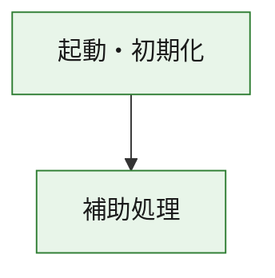
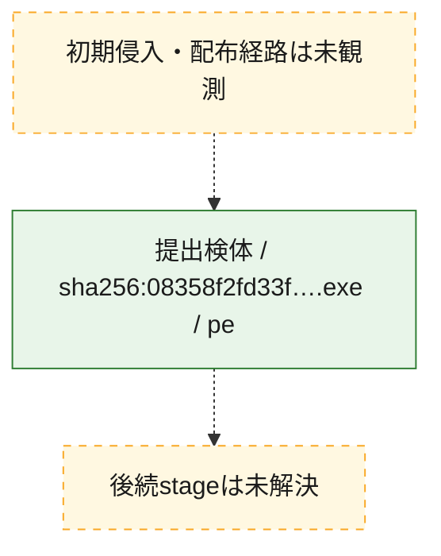
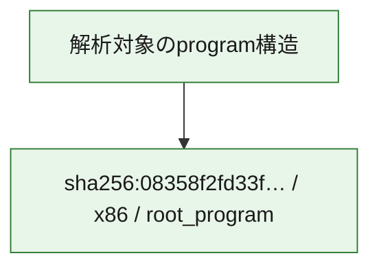

# 全体ロジック：08358f2fd33f4422125109ef3ecbc89f74829fbbb206f6e645b62c5f43362043

代表関数の静的証跡から、起動・初期化の処理群を確認しました。

## 読み方

- phaseの掲載順は解析上の整理順です。observed_call_edgesがない段階間の実行順を断定しません。
- 図の実線は静的に観測した関係、点線と黄色のノードは未観測・未解決の関係を示します。
- 図は静的な要約であり、動的実行を再現するものではありません。
- 詳細な関数解説とfingerprintは[STATIC-LOGIC.md](STATIC-LOGIC.md)を参照してください。

## 静的可視化

### 実行フロー

### 感染チェーン

### モジュール関係

## 処理段階

### 1. 起動・初期化

entry pointから初期化と後続処理への移行を確認します。
確度: `confirmed_static_function_evidence`

- `08358f2fd33f4422125109ef3ecbc89f74829fbbb206f6e645b62c5f43362043:ghidra:180001010` — 初期化と主要処理への分岐を行う入口関数です。 状態: `succeeded`、選定理由: `entry_point`, `meaningful_symbol_name`, `reviewed_call_centrality:22`, `role:entrypoint`, `small_program_complete_context`

### 2. 補助処理

主要処理を支える一般内部関数またはlibrary処理を確認します。
確度: `confirmed_static_function_evidence`

- `08358f2fd33f4422125109ef3ecbc89f74829fbbb206f6e645b62c5f43362043:ghidra:180001240` — 検体内部の一般処理を実装する関数です。 状態: `succeeded`、選定理由: `context_representative`, `reviewed_call_centrality:2`, `small_program_complete_context`
- `08358f2fd33f4422125109ef3ecbc89f74829fbbb206f6e645b62c5f43362043:ghidra:180001350` — 検体内部の一般処理を実装する関数です。 状態: `succeeded`、選定理由: `context_representative`, `reviewed_call_centrality:25`, `small_program_complete_context`
- `08358f2fd33f4422125109ef3ecbc89f74829fbbb206f6e645b62c5f43362043:ghidra:180003780` — 検体内部の一般処理を実装する関数です。 状態: `succeeded`、選定理由: `context_representative`, `reviewed_call_centrality:2`, `small_program_complete_context`
- `08358f2fd33f4422125109ef3ecbc89f74829fbbb206f6e645b62c5f43362043:ghidra:1800038e0` — 検体内部の一般処理を実装する関数です。 状態: `succeeded`、選定理由: `context_representative`, `reviewed_call_centrality:2`, `small_program_complete_context`

## 観測したcall関係

- `08358f2fd33f4422125109ef3ecbc89f74829fbbb206f6e645b62c5f43362043:ghidra:180001010` → `08358f2fd33f4422125109ef3ecbc89f74829fbbb206f6e645b62c5f43362043:ghidra:180001240` （`startup` → `support`）
- `08358f2fd33f4422125109ef3ecbc89f74829fbbb206f6e645b62c5f43362043:ghidra:180001010` → `08358f2fd33f4422125109ef3ecbc89f74829fbbb206f6e645b62c5f43362043:ghidra:180001350` （`startup` → `support`）
- `08358f2fd33f4422125109ef3ecbc89f74829fbbb206f6e645b62c5f43362043:ghidra:180001350` → `08358f2fd33f4422125109ef3ecbc89f74829fbbb206f6e645b62c5f43362043:ghidra:180001240` （`support` → `support`）
- `08358f2fd33f4422125109ef3ecbc89f74829fbbb206f6e645b62c5f43362043:ghidra:180001350` → `08358f2fd33f4422125109ef3ecbc89f74829fbbb206f6e645b62c5f43362043:ghidra:180003780` （`support` → `support`）
- `08358f2fd33f4422125109ef3ecbc89f74829fbbb206f6e645b62c5f43362043:ghidra:180001350` → `08358f2fd33f4422125109ef3ecbc89f74829fbbb206f6e645b62c5f43362043:ghidra:1800038e0` （`support` → `support`）
- `08358f2fd33f4422125109ef3ecbc89f74829fbbb206f6e645b62c5f43362043:ghidra:180003780` → `08358f2fd33f4422125109ef3ecbc89f74829fbbb206f6e645b62c5f43362043:ghidra:1800038e0` （`support` → `support`）
- `ghidra-function:246902e9034042e13a4aff7e` → `ghidra-function:123c4d4d7cee76f681e2514b` （`unclassified` → `unclassified`）
- `ghidra-function:246902e9034042e13a4aff7e` → `ghidra-function:24266999301a83ee1f3e2a90` （`unclassified` → `unclassified`）
- `ghidra-function:246902e9034042e13a4aff7e` → `ghidra-function:3e80153943f453dce4dd8f36` （`unclassified` → `unclassified`）
- `ghidra-function:246902e9034042e13a4aff7e` → `ghidra-function:41ad261b4fcdc960ff57ec75` （`unclassified` → `unclassified`）
- `ghidra-function:246902e9034042e13a4aff7e` → `ghidra-function:45628f12277624c1d93a5f5b` （`unclassified` → `unclassified`）
- `ghidra-function:246902e9034042e13a4aff7e` → `ghidra-function:6cddeb48d04b3380f0e9c025` （`unclassified` → `unclassified`）
- `ghidra-function:246902e9034042e13a4aff7e` → `ghidra-function:6fc188103aed8ffd045d6bfb` （`unclassified` → `unclassified`）
- `ghidra-function:246902e9034042e13a4aff7e` → `ghidra-function:80595a246f3de824109afb71` （`unclassified` → `unclassified`）
- `ghidra-function:246902e9034042e13a4aff7e` → `ghidra-function:9d1747bfbbaabd418072b24c` （`unclassified` → `unclassified`）
- `ghidra-function:246902e9034042e13a4aff7e` → `ghidra-function:b35edf811ea2fa32d2b1615f` （`unclassified` → `unclassified`）
- `ghidra-function:246902e9034042e13a4aff7e` → `ghidra-function:cecc948f8f3a3a2592bcf65e` （`unclassified` → `unclassified`）
- `ghidra-function:246902e9034042e13a4aff7e` → `ghidra-function:e633095baa9fbfa29b0eba77` （`unclassified` → `unclassified`）
- `ghidra-function:9d1747bfbbaabd418072b24c` → `ghidra-external:01c191538231ef7c4d7ca3c7` （`unclassified` → `unclassified`）
- `ghidra-function:9d1747bfbbaabd418072b24c` → `ghidra-external:0990469cf525e3e11e8c8d6f` （`unclassified` → `unclassified`）
- `ghidra-function:9d1747bfbbaabd418072b24c` → `ghidra-external:1feb96af6ce543e7e04d7e1a` （`unclassified` → `unclassified`）
- `ghidra-function:9d1747bfbbaabd418072b24c` → `ghidra-external:21c51ab09d2ec7d0a23f11c3` （`unclassified` → `unclassified`）
- `ghidra-function:9d1747bfbbaabd418072b24c` → `ghidra-external:30ee3edf49e75729b7e598f9` （`unclassified` → `unclassified`）
- `ghidra-function:9d1747bfbbaabd418072b24c` → `ghidra-external:3a0edbac73422c74d9b3cc77` （`unclassified` → `unclassified`）
- `ghidra-function:9d1747bfbbaabd418072b24c` → `ghidra-external:4ae99fcd683184abadf2f988` （`unclassified` → `unclassified`）
- `ghidra-function:9d1747bfbbaabd418072b24c` → `ghidra-external:82e2dc010498eb0e1bfcda14` （`unclassified` → `unclassified`）
- `ghidra-function:9d1747bfbbaabd418072b24c` → `ghidra-external:8654165d65f62ec6c60fe35b` （`unclassified` → `unclassified`）
- `ghidra-function:9d1747bfbbaabd418072b24c` → `ghidra-external:883ec69766e3f5ef10b11c17` （`unclassified` → `unclassified`）
- `ghidra-function:9d1747bfbbaabd418072b24c` → `ghidra-external:8ba3b83120354da2e768e4f1` （`unclassified` → `unclassified`）
- `ghidra-function:9d1747bfbbaabd418072b24c` → `ghidra-external:92704b21d0b9dd02f031e423` （`unclassified` → `unclassified`）
- `ghidra-function:9d1747bfbbaabd418072b24c` → `ghidra-external:97ff683de0fdc702b700dcbc` （`unclassified` → `unclassified`）
- `ghidra-function:9d1747bfbbaabd418072b24c` → `ghidra-external:a8d328df9bf657a5c7eddbf3` （`unclassified` → `unclassified`）
- `ghidra-function:9d1747bfbbaabd418072b24c` → `ghidra-external:aa6c28affbca7349bb6ad7bb` （`unclassified` → `unclassified`）
- `ghidra-function:9d1747bfbbaabd418072b24c` → `ghidra-external:ab07434df2b8fb3c6d4e2f50` （`unclassified` → `unclassified`）
- `ghidra-function:9d1747bfbbaabd418072b24c` → `ghidra-external:ace07aa819d95caf13421024` （`unclassified` → `unclassified`）
- `ghidra-function:9d1747bfbbaabd418072b24c` → `ghidra-external:bc373532d6929f40a4aa0e88` （`unclassified` → `unclassified`）
- `ghidra-function:9d1747bfbbaabd418072b24c` → `ghidra-external:bccf2b2b3cf94c8810d577cb` （`unclassified` → `unclassified`）
- `ghidra-function:9d1747bfbbaabd418072b24c` → `ghidra-external:f1eca32c2222e91304c2324d` （`unclassified` → `unclassified`）
- `ghidra-function:9d1747bfbbaabd418072b24c` → `ghidra-external:fe6b67476173c1a18f4ada92` （`unclassified` → `unclassified`）
- `ghidra-function:9d1747bfbbaabd418072b24c` → `ghidra-function:41ad261b4fcdc960ff57ec75` （`unclassified` → `unclassified`）
- `ghidra-function:9d1747bfbbaabd418072b24c` → `ghidra-function:91d6459bab83e9ff96c199e4` （`unclassified` → `unclassified`）
- `ghidra-function:9d1747bfbbaabd418072b24c` → `ghidra-function:c80439613b66e3108580a733` （`unclassified` → `unclassified`）
- `ghidra-function:c80439613b66e3108580a733` → `ghidra-function:91d6459bab83e9ff96c199e4` （`unclassified` → `unclassified`）

## 解析範囲と制約

- 選定外関数は全体inventoryへ残しますが、関数本体の個別解説対象にはしていません。
- indirect call、難読化、packer、VM、壊れたcontrol flowによりcall関係が欠落する場合があります。
- 文書は静的解析に基づき、検体実行や外部通信による動的確認は行っていません。
