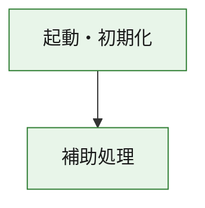
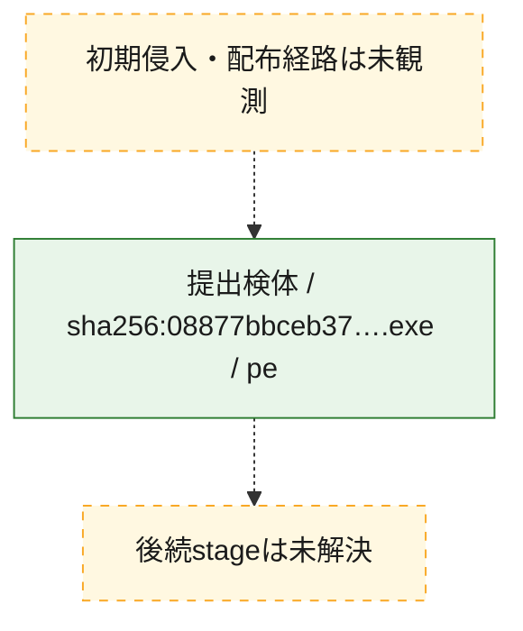
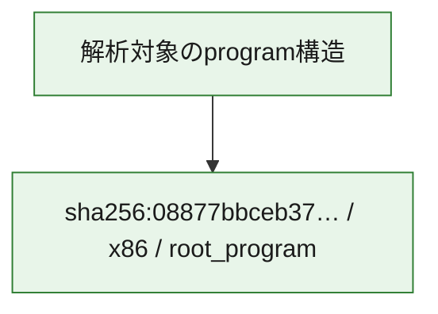

# 全体ロジック：08877bbceb3707d89a0a1945ab86b46d35cc4418a667e07e3405fe8031c49e58

代表関数の静的証跡から、起動・初期化の処理群を確認しました。

## 読み方

- phaseの掲載順は解析上の整理順です。observed_call_edgesがない段階間の実行順を断定しません。
- 図の実線は静的に観測した関係、点線と黄色のノードは未観測・未解決の関係を示します。
- 図は静的な要約であり、動的実行を再現するものではありません。
- 詳細な関数解説とfingerprintは[STATIC-LOGIC.md](STATIC-LOGIC.md)を参照してください。

## 静的可視化

### 実行フロー

### 感染チェーン

### モジュール関係

## 処理段階

### 1. 起動・初期化

entry pointから初期化と後続処理への移行を確認します。
確度: `confirmed_static_function_evidence`

- `08877bbceb3707d89a0a1945ab86b46d35cc4418a667e07e3405fe8031c49e58:ghidra:180001010` — 初期化と主要処理への分岐を行う入口関数です。 状態: `succeeded`、選定理由: `entry_point`, `meaningful_symbol_name`, `reviewed_call_centrality:22`, `role:entrypoint`, `small_program_complete_context`

### 2. 補助処理

主要処理を支える一般内部関数またはlibrary処理を確認します。
確度: `confirmed_static_function_evidence`

- `08877bbceb3707d89a0a1945ab86b46d35cc4418a667e07e3405fe8031c49e58:ghidra:180001240` — 検体内部の一般処理を実装する関数です。 状態: `succeeded`、選定理由: `context_representative`, `reviewed_call_centrality:2`, `small_program_complete_context`
- `08877bbceb3707d89a0a1945ab86b46d35cc4418a667e07e3405fe8031c49e58:ghidra:180001350` — 検体内部の一般処理を実装する関数です。 状態: `succeeded`、選定理由: `context_representative`, `reviewed_call_centrality:25`, `small_program_complete_context`
- `08877bbceb3707d89a0a1945ab86b46d35cc4418a667e07e3405fe8031c49e58:ghidra:180003780` — 検体内部の一般処理を実装する関数です。 状態: `succeeded`、選定理由: `context_representative`, `reviewed_call_centrality:2`, `small_program_complete_context`
- `08877bbceb3707d89a0a1945ab86b46d35cc4418a667e07e3405fe8031c49e58:ghidra:1800038e0` — 検体内部の一般処理を実装する関数です。 状態: `succeeded`、選定理由: `context_representative`, `reviewed_call_centrality:2`, `small_program_complete_context`

## 観測したcall関係

- `08877bbceb3707d89a0a1945ab86b46d35cc4418a667e07e3405fe8031c49e58:ghidra:180001010` → `08877bbceb3707d89a0a1945ab86b46d35cc4418a667e07e3405fe8031c49e58:ghidra:180001240` （`startup` → `support`）
- `08877bbceb3707d89a0a1945ab86b46d35cc4418a667e07e3405fe8031c49e58:ghidra:180001010` → `08877bbceb3707d89a0a1945ab86b46d35cc4418a667e07e3405fe8031c49e58:ghidra:180001350` （`startup` → `support`）
- `08877bbceb3707d89a0a1945ab86b46d35cc4418a667e07e3405fe8031c49e58:ghidra:180001350` → `08877bbceb3707d89a0a1945ab86b46d35cc4418a667e07e3405fe8031c49e58:ghidra:180001240` （`support` → `support`）
- `08877bbceb3707d89a0a1945ab86b46d35cc4418a667e07e3405fe8031c49e58:ghidra:180001350` → `08877bbceb3707d89a0a1945ab86b46d35cc4418a667e07e3405fe8031c49e58:ghidra:180003780` （`support` → `support`）
- `08877bbceb3707d89a0a1945ab86b46d35cc4418a667e07e3405fe8031c49e58:ghidra:180001350` → `08877bbceb3707d89a0a1945ab86b46d35cc4418a667e07e3405fe8031c49e58:ghidra:1800038e0` （`support` → `support`）
- `08877bbceb3707d89a0a1945ab86b46d35cc4418a667e07e3405fe8031c49e58:ghidra:180003780` → `08877bbceb3707d89a0a1945ab86b46d35cc4418a667e07e3405fe8031c49e58:ghidra:1800038e0` （`support` → `support`）
- `ghidra-function:1eadf3096b37fb30950aa720` → `ghidra-function:0d578d133de71b3e57aade42` （`unclassified` → `unclassified`）
- `ghidra-function:1eadf3096b37fb30950aa720` → `ghidra-function:1b64e87741e41e45e3c8d246` （`unclassified` → `unclassified`）
- `ghidra-function:1eadf3096b37fb30950aa720` → `ghidra-function:4d1f490e251200b0838f7c94` （`unclassified` → `unclassified`）
- `ghidra-function:1eadf3096b37fb30950aa720` → `ghidra-function:5aea08614273b9bc0d72ec2d` （`unclassified` → `unclassified`）
- `ghidra-function:1eadf3096b37fb30950aa720` → `ghidra-function:5bebfab58217c0d45de41fa2` （`unclassified` → `unclassified`）
- `ghidra-function:1eadf3096b37fb30950aa720` → `ghidra-function:6576205355173b14e94195ba` （`unclassified` → `unclassified`）
- `ghidra-function:1eadf3096b37fb30950aa720` → `ghidra-function:6a20becf7bdf290bc2680af4` （`unclassified` → `unclassified`）
- `ghidra-function:1eadf3096b37fb30950aa720` → `ghidra-function:725250c08548b1669c42a7c6` （`unclassified` → `unclassified`）
- `ghidra-function:1eadf3096b37fb30950aa720` → `ghidra-function:729ec1c1f58f450dd532f05e` （`unclassified` → `unclassified`）
- `ghidra-function:1eadf3096b37fb30950aa720` → `ghidra-function:73990b9c245474db0ef4781c` （`unclassified` → `unclassified`）
- `ghidra-function:1eadf3096b37fb30950aa720` → `ghidra-function:b996493e691c43dcaad87dee` （`unclassified` → `unclassified`）
- `ghidra-function:1eadf3096b37fb30950aa720` → `ghidra-function:ecb2a8c4f3b0220b9608ca57` （`unclassified` → `unclassified`）
- `ghidra-function:4d1f490e251200b0838f7c94` → `ghidra-external:0ed232ab40f2a9b63c7fe676` （`unclassified` → `unclassified`）
- `ghidra-function:4d1f490e251200b0838f7c94` → `ghidra-external:2dd47cc20e049853b0b0e883` （`unclassified` → `unclassified`）
- `ghidra-function:4d1f490e251200b0838f7c94` → `ghidra-external:3257ce89f8f2ea766217f184` （`unclassified` → `unclassified`）
- `ghidra-function:4d1f490e251200b0838f7c94` → `ghidra-external:37800ab117b9b1577a4f1fa7` （`unclassified` → `unclassified`）
- `ghidra-function:4d1f490e251200b0838f7c94` → `ghidra-external:4a1c31be2a8b982aac633a86` （`unclassified` → `unclassified`）
- `ghidra-function:4d1f490e251200b0838f7c94` → `ghidra-external:52bac0e93ba3e4b307465290` （`unclassified` → `unclassified`）
- `ghidra-function:4d1f490e251200b0838f7c94` → `ghidra-external:6ec98203f03ac80850853c9f` （`unclassified` → `unclassified`）
- `ghidra-function:4d1f490e251200b0838f7c94` → `ghidra-external:7043c149886148ce5e9d62bd` （`unclassified` → `unclassified`）
- `ghidra-function:4d1f490e251200b0838f7c94` → `ghidra-external:7141067187c8321b290187ab` （`unclassified` → `unclassified`）
- `ghidra-function:4d1f490e251200b0838f7c94` → `ghidra-external:7810c3eb69a87061e65945f0` （`unclassified` → `unclassified`）
- `ghidra-function:4d1f490e251200b0838f7c94` → `ghidra-external:8873a89d75c4c54ee557bba7` （`unclassified` → `unclassified`）
- `ghidra-function:4d1f490e251200b0838f7c94` → `ghidra-external:901bef7cd4aca53c60b9caff` （`unclassified` → `unclassified`）
- `ghidra-function:4d1f490e251200b0838f7c94` → `ghidra-external:9175ab584f352dc284011d78` （`unclassified` → `unclassified`）
- `ghidra-function:4d1f490e251200b0838f7c94` → `ghidra-external:9197e34cff38f5a3a94d9bb1` （`unclassified` → `unclassified`）
- `ghidra-function:4d1f490e251200b0838f7c94` → `ghidra-external:ad8ace0f79d16fb975f991c2` （`unclassified` → `unclassified`）
- `ghidra-function:4d1f490e251200b0838f7c94` → `ghidra-external:d28bee704ab1bccc6e002f62` （`unclassified` → `unclassified`）
- `ghidra-function:4d1f490e251200b0838f7c94` → `ghidra-external:d36a69f60fe81a1ea3819da2` （`unclassified` → `unclassified`）
- `ghidra-function:4d1f490e251200b0838f7c94` → `ghidra-external:d433ea27b319e5330fe97435` （`unclassified` → `unclassified`）
- `ghidra-function:4d1f490e251200b0838f7c94` → `ghidra-external:e7b2cf51dfa88dd79215a34b` （`unclassified` → `unclassified`）
- `ghidra-function:4d1f490e251200b0838f7c94` → `ghidra-external:eb90238e5bad84f3a4c87a6b` （`unclassified` → `unclassified`）
- `ghidra-function:4d1f490e251200b0838f7c94` → `ghidra-external:ee5f7ee4244201a0d4d44f9e` （`unclassified` → `unclassified`）
- `ghidra-function:4d1f490e251200b0838f7c94` → `ghidra-function:09e51491595006cc11fbbaa4` （`unclassified` → `unclassified`）
- `ghidra-function:4d1f490e251200b0838f7c94` → `ghidra-function:5bebfab58217c0d45de41fa2` （`unclassified` → `unclassified`）
- `ghidra-function:4d1f490e251200b0838f7c94` → `ghidra-function:caee716194923ee6ba2980e9` （`unclassified` → `unclassified`）
- `ghidra-function:caee716194923ee6ba2980e9` → `ghidra-function:09e51491595006cc11fbbaa4` （`unclassified` → `unclassified`）

## 解析範囲と制約

- 選定外関数は全体inventoryへ残しますが、関数本体の個別解説対象にはしていません。
- indirect call、難読化、packer、VM、壊れたcontrol flowによりcall関係が欠落する場合があります。
- 文書は静的解析に基づき、検体実行や外部通信による動的確認は行っていません。
