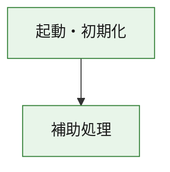
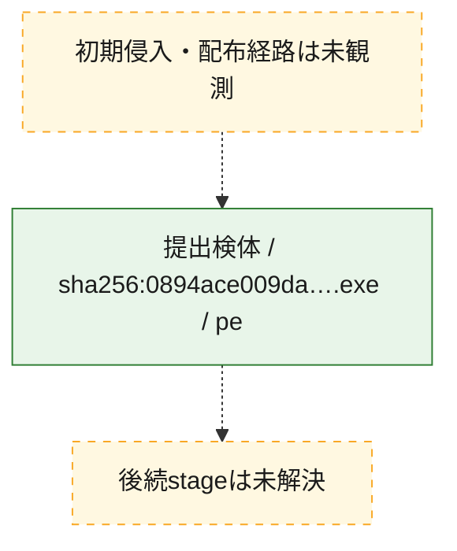
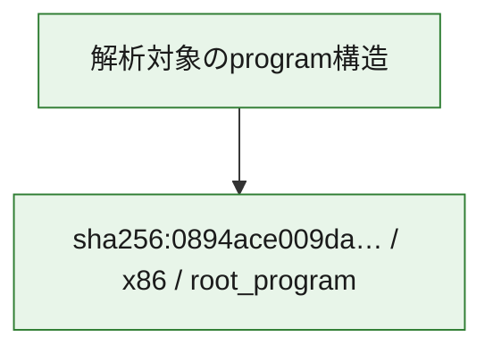

# 全体ロジック：0894ace009dacf2a931bb25e152b43247bcc444052c4e9ae28e0fcf875b3b909

代表関数の静的証跡から、起動・初期化の処理群を確認しました。

## 読み方

- phaseの掲載順は解析上の整理順です。observed_call_edgesがない段階間の実行順を断定しません。
- 図の実線は静的に観測した関係、点線と黄色のノードは未観測・未解決の関係を示します。
- 図は静的な要約であり、動的実行を再現するものではありません。
- 詳細な関数解説とfingerprintは[STATIC-LOGIC.md](STATIC-LOGIC.md)を参照してください。

## 静的可視化

### 実行フロー

### 感染チェーン

### モジュール関係

## 処理段階

### 1. 起動・初期化

entry pointから初期化と後続処理への移行を確認します。
確度: `confirmed_static_function_evidence`

- `0894ace009dacf2a931bb25e152b43247bcc444052c4e9ae28e0fcf875b3b909:ghidra:180001010` — 初期化と主要処理への分岐を行う入口関数です。 状態: `succeeded`、選定理由: `entry_point`, `meaningful_symbol_name`, `reviewed_call_centrality:22`, `role:entrypoint`, `small_program_complete_context`

### 2. 補助処理

主要処理を支える一般内部関数またはlibrary処理を確認します。
確度: `confirmed_static_function_evidence`

- `0894ace009dacf2a931bb25e152b43247bcc444052c4e9ae28e0fcf875b3b909:ghidra:180001240` — 検体内部の一般処理を実装する関数です。 状態: `succeeded`、選定理由: `context_representative`, `reviewed_call_centrality:2`, `small_program_complete_context`
- `0894ace009dacf2a931bb25e152b43247bcc444052c4e9ae28e0fcf875b3b909:ghidra:180001350` — 検体内部の一般処理を実装する関数です。 状態: `succeeded`、選定理由: `context_representative`, `reviewed_call_centrality:25`, `small_program_complete_context`
- `0894ace009dacf2a931bb25e152b43247bcc444052c4e9ae28e0fcf875b3b909:ghidra:180003780` — 検体内部の一般処理を実装する関数です。 状態: `succeeded`、選定理由: `context_representative`, `reviewed_call_centrality:2`, `small_program_complete_context`
- `0894ace009dacf2a931bb25e152b43247bcc444052c4e9ae28e0fcf875b3b909:ghidra:1800038e0` — 検体内部の一般処理を実装する関数です。 状態: `succeeded`、選定理由: `context_representative`, `reviewed_call_centrality:2`, `small_program_complete_context`

## 観測したcall関係

- `0894ace009dacf2a931bb25e152b43247bcc444052c4e9ae28e0fcf875b3b909:ghidra:180001010` → `0894ace009dacf2a931bb25e152b43247bcc444052c4e9ae28e0fcf875b3b909:ghidra:180001240` （`startup` → `support`）
- `0894ace009dacf2a931bb25e152b43247bcc444052c4e9ae28e0fcf875b3b909:ghidra:180001010` → `0894ace009dacf2a931bb25e152b43247bcc444052c4e9ae28e0fcf875b3b909:ghidra:180001350` （`startup` → `support`）
- `0894ace009dacf2a931bb25e152b43247bcc444052c4e9ae28e0fcf875b3b909:ghidra:180001350` → `0894ace009dacf2a931bb25e152b43247bcc444052c4e9ae28e0fcf875b3b909:ghidra:180001240` （`support` → `support`）
- `0894ace009dacf2a931bb25e152b43247bcc444052c4e9ae28e0fcf875b3b909:ghidra:180001350` → `0894ace009dacf2a931bb25e152b43247bcc444052c4e9ae28e0fcf875b3b909:ghidra:180003780` （`support` → `support`）
- `0894ace009dacf2a931bb25e152b43247bcc444052c4e9ae28e0fcf875b3b909:ghidra:180001350` → `0894ace009dacf2a931bb25e152b43247bcc444052c4e9ae28e0fcf875b3b909:ghidra:1800038e0` （`support` → `support`）
- `0894ace009dacf2a931bb25e152b43247bcc444052c4e9ae28e0fcf875b3b909:ghidra:180003780` → `0894ace009dacf2a931bb25e152b43247bcc444052c4e9ae28e0fcf875b3b909:ghidra:1800038e0` （`support` → `support`）
- `ghidra-function:815c4ed033f44b27017698a1` → `ghidra-function:dca081774df10b659255bbea` （`unclassified` → `unclassified`）
- `ghidra-function:e61c83238fc339fe9d17d05b` → `ghidra-external:09f88ad2c11c4d6e2ffe356d` （`unclassified` → `unclassified`）
- `ghidra-function:e61c83238fc339fe9d17d05b` → `ghidra-external:1c56a24d1056766678402979` （`unclassified` → `unclassified`）
- `ghidra-function:e61c83238fc339fe9d17d05b` → `ghidra-external:369cda257e68e602e958c5bc` （`unclassified` → `unclassified`）
- `ghidra-function:e61c83238fc339fe9d17d05b` → `ghidra-external:36ed8270b9b7c12f52bf53ac` （`unclassified` → `unclassified`）
- `ghidra-function:e61c83238fc339fe9d17d05b` → `ghidra-external:3dca67541c733ebdfc1aef51` （`unclassified` → `unclassified`）
- `ghidra-function:e61c83238fc339fe9d17d05b` → `ghidra-external:4b997b389d55fb1973daffaf` （`unclassified` → `unclassified`）
- `ghidra-function:e61c83238fc339fe9d17d05b` → `ghidra-external:4c639535c621d1aa79cdb66c` （`unclassified` → `unclassified`）
- `ghidra-function:e61c83238fc339fe9d17d05b` → `ghidra-external:53cf8c9d7f62db9e1e02b67a` （`unclassified` → `unclassified`）
- `ghidra-function:e61c83238fc339fe9d17d05b` → `ghidra-external:6afef420eeb178f05705a28c` （`unclassified` → `unclassified`）
- `ghidra-function:e61c83238fc339fe9d17d05b` → `ghidra-external:6b821d7fc33e8d495b65c55e` （`unclassified` → `unclassified`）
- `ghidra-function:e61c83238fc339fe9d17d05b` → `ghidra-external:6fef46dbf5d5e8aa31fac0b4` （`unclassified` → `unclassified`）
- `ghidra-function:e61c83238fc339fe9d17d05b` → `ghidra-external:8d38282a3221ca37572e6c5c` （`unclassified` → `unclassified`）
- `ghidra-function:e61c83238fc339fe9d17d05b` → `ghidra-external:8d99accac3f2bf1d64f53e55` （`unclassified` → `unclassified`）
- `ghidra-function:e61c83238fc339fe9d17d05b` → `ghidra-external:95b519e6b05fcaedf414aa03` （`unclassified` → `unclassified`）
- `ghidra-function:e61c83238fc339fe9d17d05b` → `ghidra-external:981d972d99d147eac5a43255` （`unclassified` → `unclassified`）
- `ghidra-function:e61c83238fc339fe9d17d05b` → `ghidra-external:990098dc70107fe546a722e1` （`unclassified` → `unclassified`）
- `ghidra-function:e61c83238fc339fe9d17d05b` → `ghidra-external:a9e377272c197d7a6003a874` （`unclassified` → `unclassified`）
- `ghidra-function:e61c83238fc339fe9d17d05b` → `ghidra-external:b0d1a9c8cc364eca6bb4c89e` （`unclassified` → `unclassified`）
- `ghidra-function:e61c83238fc339fe9d17d05b` → `ghidra-external:bad73d4136af5c48f2f53cad` （`unclassified` → `unclassified`）
- `ghidra-function:e61c83238fc339fe9d17d05b` → `ghidra-external:d05e3e106ea20f5ddc4b99c6` （`unclassified` → `unclassified`）
- `ghidra-function:e61c83238fc339fe9d17d05b` → `ghidra-external:f121c5e6881501783f39664f` （`unclassified` → `unclassified`）
- `ghidra-function:e61c83238fc339fe9d17d05b` → `ghidra-function:79c5f79c8e7b3f0da3246aea` （`unclassified` → `unclassified`）
- `ghidra-function:e61c83238fc339fe9d17d05b` → `ghidra-function:815c4ed033f44b27017698a1` （`unclassified` → `unclassified`）
- `ghidra-function:e61c83238fc339fe9d17d05b` → `ghidra-function:dca081774df10b659255bbea` （`unclassified` → `unclassified`）
- `ghidra-function:fb278b0dc7806e22a3203b81` → `ghidra-function:00aeaa1d67472d4822d8ba04` （`unclassified` → `unclassified`）
- `ghidra-function:fb278b0dc7806e22a3203b81` → `ghidra-function:3110c0c923ca31da5c85c26b` （`unclassified` → `unclassified`）
- `ghidra-function:fb278b0dc7806e22a3203b81` → `ghidra-function:3e0ee245d6ab8cf3a4ad1929` （`unclassified` → `unclassified`）
- `ghidra-function:fb278b0dc7806e22a3203b81` → `ghidra-function:79c5f79c8e7b3f0da3246aea` （`unclassified` → `unclassified`）
- `ghidra-function:fb278b0dc7806e22a3203b81` → `ghidra-function:8de9e77588a779d7bce3153c` （`unclassified` → `unclassified`）
- `ghidra-function:fb278b0dc7806e22a3203b81` → `ghidra-function:9a1b3fdede56c7e459701605` （`unclassified` → `unclassified`）
- `ghidra-function:fb278b0dc7806e22a3203b81` → `ghidra-function:9ac825eb0b1e9397bd2913d7` （`unclassified` → `unclassified`）
- `ghidra-function:fb278b0dc7806e22a3203b81` → `ghidra-function:a63deeeb06f612d5d954d4ef` （`unclassified` → `unclassified`）
- `ghidra-function:fb278b0dc7806e22a3203b81` → `ghidra-function:c8a615024dc221fe5cbbb670` （`unclassified` → `unclassified`）
- `ghidra-function:fb278b0dc7806e22a3203b81` → `ghidra-function:e61c83238fc339fe9d17d05b` （`unclassified` → `unclassified`）
- `ghidra-function:fb278b0dc7806e22a3203b81` → `ghidra-function:f87394294351de9aaa290a76` （`unclassified` → `unclassified`）
- `ghidra-function:fb278b0dc7806e22a3203b81` → `ghidra-function:feff74d2c493477948062ffb` （`unclassified` → `unclassified`）

## 解析範囲と制約

- 選定外関数は全体inventoryへ残しますが、関数本体の個別解説対象にはしていません。
- indirect call、難読化、packer、VM、壊れたcontrol flowによりcall関係が欠落する場合があります。
- 文書は静的解析に基づき、検体実行や外部通信による動的確認は行っていません。
