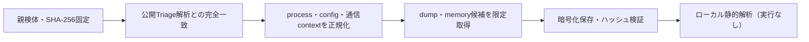

# Triage公開解析・後段取得証跡

## 完全ハッシュ一致

- [260915-rgvy1aybke](https://tria.ge/260915-rgvy1aybke): ファミリー候補 `dcrat`、評価score `10`

## プロセス・通信

- 観測process: `031E2CA44B863FA57D03EE69B3CF6260.exe, Idle.exe, SearchApp.exe, backgroundTaskHost.exe, cmd.exe, csrss.exe, schtasks.exe, services.exe, upfc.exe, w32tm.exe`
- raw commandは保存せず、command SHA-256と処理patternだけをJSONへ保持します。
- sandbox background trafficは`context_only`であり、C2へ自動昇格しません。

- 取得できませんでした。

## 後段取得物

- `35a16c7c1a8ce0706c29c7991b7e1f5df9c6d99f17ebb248770fc4e59997f61c` / `memory_image` / 876544 bytes / 親と同一: `false` / 静的解析: `partial`
- `60a5148a3ce7c97b4778ab5b62e960eb0e1e7ed999dd64097f82c1f065bd82af` / `memory_image` / 65536 bytes / 親と同一: `false` / 静的解析: `partial`
- `fb2b140aed7fa4b87025abd8d98243653498f7a7c8a1db3c1533d722dad43885` / `memory_image` / 65536 bytes / 親と同一: `false` / 静的解析: `partial`
- `bc0633ccd1469a6082711cb402f8f43e05869ff046931f3031871a883260a9a6` / `memory_image` / 4096 bytes / 親と同一: `false` / 静的解析: `partial`
- `d1f95f3ac588296f0c09802c43ae9e373c93fed0e98365a0b29b68a1b8003884` / `memory_image` / 10108928 bytes / 親と同一: `false` / 静的解析: `未実施`
- `b0aed04395097d4c307cb53771e4b32a95cb4ac321dfd927f08392fbcf7feba6` / `memory_image` / 10108928 bytes / 親と同一: `false` / 静的解析: `未実施`
- `82441b5545d2dc14b0086b30ed002a0449c6824fb12edda986a60dd5b2116ea9` / `memory_image` / 10108928 bytes / 親と同一: `false` / 静的解析: `未実施`
- `1744d83e94f41cf7e4ef28ad1374a4fd2f58f2781ed1689d53153c02b57e5a43` / `memory_image` / 10108928 bytes / 親と同一: `false` / 静的解析: `未実施`
- `bb4054fffd795079e69b959d1c1d0a20c5ef2f607a662ccef14051bfe2794ff8` / `memory_image` / 10108928 bytes / 親と同一: `false` / 静的解析: `未実施`
- `a0463ba0998384d1cfded9b5cde3305250c550881ab25590e10419c5652e29fc` / `memory_image` / 10108928 bytes / 親と同一: `false` / 静的解析: `未実施`
- `7629a81549001aca280d96f06292509be19b092c91ce8bc8d083c8ba9bf4e683` / `memory_image` / 10108928 bytes / 親と同一: `false` / 静的解析: `未実施`
- `7c2a822f2d36d1f7694f5067be6c5eb3b3094456bbfe9a68598d163cd776487a` / `memory_image` / 10108928 bytes / 親と同一: `false` / 静的解析: `未実施`
- `bbd35d73da04e5ddaf23cb7fcda5ef17734093e0e4050327abeb2e090217348e` / `memory_image` / 10108928 bytes / 親と同一: `false` / 静的解析: `未実施`
- `ca4fc5df0f96f497f47c90fbf2ef8110035df9f49a54441b05ec3110d5a0c4a2` / `memory_image` / 10108928 bytes / 親と同一: `false` / 静的解析: `未実施`
- `662170243d272c9d2083cc2d3a6afbec6e6782670fb1c4a25470c412911698ac` / `memory_image` / 10108928 bytes / 親と同一: `false` / 静的解析: `未実施`
- `e97ce82b315bc12f281dd16589de018ff34520846be252b511ec930e6f312e29` / `memory_image` / 10108928 bytes / 親と同一: `false` / 静的解析: `未実施`
- `0eb63ab4086637476b7d90a462a5ac638faaf88b0791ac959a60e8d40af65df6` / `memory_image` / 10108928 bytes / 親と同一: `false` / 静的解析: `partial`
- `c6eac2e1182543a8c99f775aadc7a026964331e0b3460e1e72880b4948143701` / `memory_image` / 10108928 bytes / 親と同一: `false` / 静的解析: `未実施`

## 判定境界

Triage由来のfamily、process、config、通信は外部sandbox証跡です。Config extractorが返したendpointはC2候補として扱いますが、静的設定復元またはprocess帰属とprotocol応答が揃うまでは確認済みC2とはしません。取得成果物と検体は実行していません。
