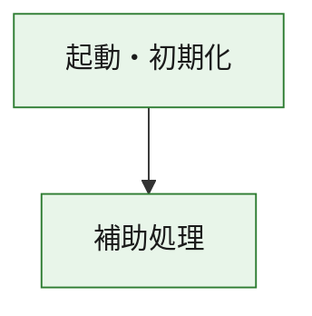
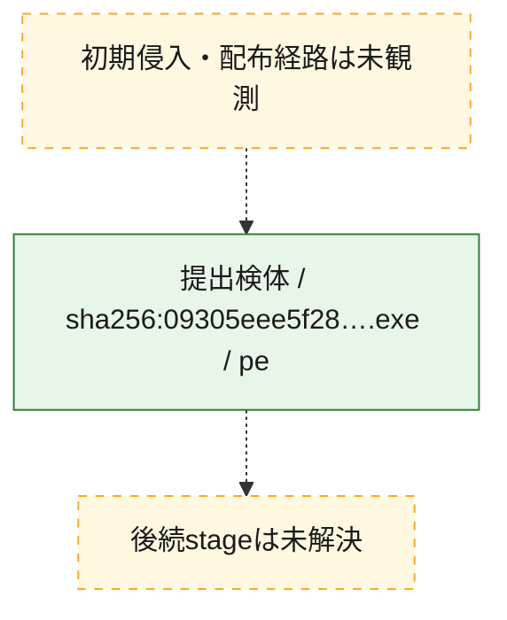
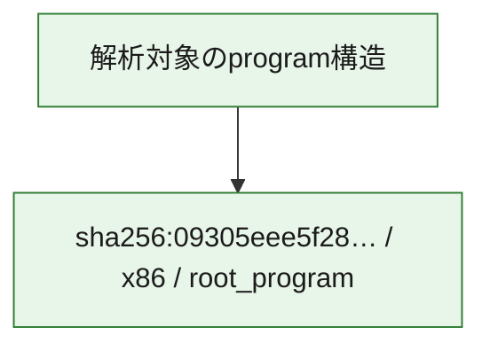

# 全体ロジック：09305eee5f2848ad66711d6e20a766bfd532d3f69ec5f9f7912f368d97f2659d

代表関数の静的証跡から、起動・初期化の処理群を確認しました。

## 読み方

- phaseの掲載順は解析上の整理順です。observed_call_edgesがない段階間の実行順を断定しません。
- 図の実線は静的に観測した関係、点線と黄色のノードは未観測・未解決の関係を示します。
- 図は静的な要約であり、動的実行を再現するものではありません。
- 詳細な関数解説とfingerprintは[STATIC-LOGIC.md](STATIC-LOGIC.md)を参照してください。

## 静的可視化

### 実行フロー

### 感染チェーン

### モジュール関係

## 処理段階

### 1. 起動・初期化

entry pointから初期化と後続処理への移行を確認します。
確度: `confirmed_static_function_evidence`

- `09305eee5f2848ad66711d6e20a766bfd532d3f69ec5f9f7912f368d97f2659d:ghidra:180001010` — 初期化と主要処理への分岐を行う入口関数です。 状態: `succeeded`、選定理由: `entry_point`, `meaningful_symbol_name`, `reviewed_call_centrality:22`, `role:entrypoint`, `small_program_complete_context`

### 2. 補助処理

主要処理を支える一般内部関数またはlibrary処理を確認します。
確度: `confirmed_static_function_evidence`

- `09305eee5f2848ad66711d6e20a766bfd532d3f69ec5f9f7912f368d97f2659d:ghidra:180001240` — 検体内部の一般処理を実装する関数です。 状態: `succeeded`、選定理由: `context_representative`, `reviewed_call_centrality:2`, `small_program_complete_context`
- `09305eee5f2848ad66711d6e20a766bfd532d3f69ec5f9f7912f368d97f2659d:ghidra:180001350` — 検体内部の一般処理を実装する関数です。 状態: `succeeded`、選定理由: `context_representative`, `reviewed_call_centrality:25`, `small_program_complete_context`
- `09305eee5f2848ad66711d6e20a766bfd532d3f69ec5f9f7912f368d97f2659d:ghidra:180003780` — 検体内部の一般処理を実装する関数です。 状態: `succeeded`、選定理由: `context_representative`, `reviewed_call_centrality:2`, `small_program_complete_context`
- `09305eee5f2848ad66711d6e20a766bfd532d3f69ec5f9f7912f368d97f2659d:ghidra:1800038e0` — 検体内部の一般処理を実装する関数です。 状態: `succeeded`、選定理由: `context_representative`, `reviewed_call_centrality:2`, `small_program_complete_context`

## 観測したcall関係

- `09305eee5f2848ad66711d6e20a766bfd532d3f69ec5f9f7912f368d97f2659d:ghidra:180001010` → `09305eee5f2848ad66711d6e20a766bfd532d3f69ec5f9f7912f368d97f2659d:ghidra:180001240` （`startup` → `support`）
- `09305eee5f2848ad66711d6e20a766bfd532d3f69ec5f9f7912f368d97f2659d:ghidra:180001010` → `09305eee5f2848ad66711d6e20a766bfd532d3f69ec5f9f7912f368d97f2659d:ghidra:180001350` （`startup` → `support`）
- `09305eee5f2848ad66711d6e20a766bfd532d3f69ec5f9f7912f368d97f2659d:ghidra:180001350` → `09305eee5f2848ad66711d6e20a766bfd532d3f69ec5f9f7912f368d97f2659d:ghidra:180001240` （`support` → `support`）
- `09305eee5f2848ad66711d6e20a766bfd532d3f69ec5f9f7912f368d97f2659d:ghidra:180001350` → `09305eee5f2848ad66711d6e20a766bfd532d3f69ec5f9f7912f368d97f2659d:ghidra:180003780` （`support` → `support`）
- `09305eee5f2848ad66711d6e20a766bfd532d3f69ec5f9f7912f368d97f2659d:ghidra:180001350` → `09305eee5f2848ad66711d6e20a766bfd532d3f69ec5f9f7912f368d97f2659d:ghidra:1800038e0` （`support` → `support`）
- `09305eee5f2848ad66711d6e20a766bfd532d3f69ec5f9f7912f368d97f2659d:ghidra:180003780` → `09305eee5f2848ad66711d6e20a766bfd532d3f69ec5f9f7912f368d97f2659d:ghidra:1800038e0` （`support` → `support`）
- `ghidra-function:1914c54e9cd893e7341495d9` → `ghidra-function:03bb8631c4fbd8618cf5bc00` （`unclassified` → `unclassified`）
- `ghidra-function:1914c54e9cd893e7341495d9` → `ghidra-function:235227c667f4ca809884d4b9` （`unclassified` → `unclassified`）
- `ghidra-function:1914c54e9cd893e7341495d9` → `ghidra-function:33503ac0f3d4c1249250c8b5` （`unclassified` → `unclassified`）
- `ghidra-function:1914c54e9cd893e7341495d9` → `ghidra-function:36091f0763ac53232dba85e9` （`unclassified` → `unclassified`）
- `ghidra-function:1914c54e9cd893e7341495d9` → `ghidra-function:7226916a6dc05d12ca3a9d16` （`unclassified` → `unclassified`）
- `ghidra-function:1914c54e9cd893e7341495d9` → `ghidra-function:787899c5bedda0e4be0c4fd9` （`unclassified` → `unclassified`）
- `ghidra-function:1914c54e9cd893e7341495d9` → `ghidra-function:8a0ffecd9a18a8a4f8b89b41` （`unclassified` → `unclassified`）
- `ghidra-function:1914c54e9cd893e7341495d9` → `ghidra-function:94ad599123feaea01c555559` （`unclassified` → `unclassified`）
- `ghidra-function:1914c54e9cd893e7341495d9` → `ghidra-function:a974147b2acee0bda30d0e16` （`unclassified` → `unclassified`）
- `ghidra-function:1914c54e9cd893e7341495d9` → `ghidra-function:c3b6f23895884e16b6fbde88` （`unclassified` → `unclassified`）
- `ghidra-function:1914c54e9cd893e7341495d9` → `ghidra-function:d98fe364ac9be84c7c8dda74` （`unclassified` → `unclassified`）
- `ghidra-function:1914c54e9cd893e7341495d9` → `ghidra-function:fee061564a1f95e77d0f9a99` （`unclassified` → `unclassified`）
- `ghidra-function:ba665e57bab3ba12d23f66d7` → `ghidra-function:e76b7b912bddc772c3a8560f` （`unclassified` → `unclassified`）
- `ghidra-function:fee061564a1f95e77d0f9a99` → `ghidra-external:0035ddd34fe552da1296c188` （`unclassified` → `unclassified`）
- `ghidra-function:fee061564a1f95e77d0f9a99` → `ghidra-external:11f975e14163951d5cbae279` （`unclassified` → `unclassified`）
- `ghidra-function:fee061564a1f95e77d0f9a99` → `ghidra-external:16b41d6d6e3d711947d3d7a2` （`unclassified` → `unclassified`）
- `ghidra-function:fee061564a1f95e77d0f9a99` → `ghidra-external:2651f59738e49da607c9d40c` （`unclassified` → `unclassified`）
- `ghidra-function:fee061564a1f95e77d0f9a99` → `ghidra-external:2ad259fb502e50da74867f07` （`unclassified` → `unclassified`）
- `ghidra-function:fee061564a1f95e77d0f9a99` → `ghidra-external:3eed26ba528ad1e08ccf8aa1` （`unclassified` → `unclassified`）
- `ghidra-function:fee061564a1f95e77d0f9a99` → `ghidra-external:4a5daa80c5e74cdbdee07d5e` （`unclassified` → `unclassified`）
- `ghidra-function:fee061564a1f95e77d0f9a99` → `ghidra-external:58b8096b545b8b7d1fdef59e` （`unclassified` → `unclassified`）
- `ghidra-function:fee061564a1f95e77d0f9a99` → `ghidra-external:77f1daffbdb79c6eae685746` （`unclassified` → `unclassified`）
- `ghidra-function:fee061564a1f95e77d0f9a99` → `ghidra-external:845768cf0e2ddc835df05413` （`unclassified` → `unclassified`）
- `ghidra-function:fee061564a1f95e77d0f9a99` → `ghidra-external:86b454767345a299092e1dd6` （`unclassified` → `unclassified`）
- `ghidra-function:fee061564a1f95e77d0f9a99` → `ghidra-external:8b75b8746be52460a5c1ff6d` （`unclassified` → `unclassified`）
- `ghidra-function:fee061564a1f95e77d0f9a99` → `ghidra-external:8bc68f4a21ba8e4eed75ff6a` （`unclassified` → `unclassified`）
- `ghidra-function:fee061564a1f95e77d0f9a99` → `ghidra-external:8ce5ade5b5260b97207c533a` （`unclassified` → `unclassified`）
- `ghidra-function:fee061564a1f95e77d0f9a99` → `ghidra-external:8fb3421fe62c9dbfe3a54e8a` （`unclassified` → `unclassified`）
- `ghidra-function:fee061564a1f95e77d0f9a99` → `ghidra-external:958137f5ffd839c116089cc8` （`unclassified` → `unclassified`）
- `ghidra-function:fee061564a1f95e77d0f9a99` → `ghidra-external:9a6d6167c93e8fc271973852` （`unclassified` → `unclassified`）
- `ghidra-function:fee061564a1f95e77d0f9a99` → `ghidra-external:9c18c4e69277a688610fc767` （`unclassified` → `unclassified`）
- `ghidra-function:fee061564a1f95e77d0f9a99` → `ghidra-external:d13a81f41cdbe13ac7344cb6` （`unclassified` → `unclassified`）
- `ghidra-function:fee061564a1f95e77d0f9a99` → `ghidra-external:e844294b4c5eab8eafdf78c5` （`unclassified` → `unclassified`）
- `ghidra-function:fee061564a1f95e77d0f9a99` → `ghidra-external:ff6248eda98db1f7a0705d3e` （`unclassified` → `unclassified`）
- `ghidra-function:fee061564a1f95e77d0f9a99` → `ghidra-function:7226916a6dc05d12ca3a9d16` （`unclassified` → `unclassified`）
- `ghidra-function:fee061564a1f95e77d0f9a99` → `ghidra-function:ba665e57bab3ba12d23f66d7` （`unclassified` → `unclassified`）
- `ghidra-function:fee061564a1f95e77d0f9a99` → `ghidra-function:e76b7b912bddc772c3a8560f` （`unclassified` → `unclassified`）

## 解析範囲と制約

- 選定外関数は全体inventoryへ残しますが、関数本体の個別解説対象にはしていません。
- indirect call、難読化、packer、VM、壊れたcontrol flowによりcall関係が欠落する場合があります。
- 文書は静的解析に基づき、検体実行や外部通信による動的確認は行っていません。
