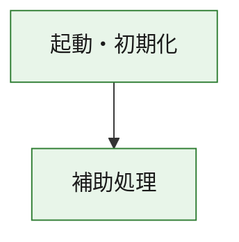
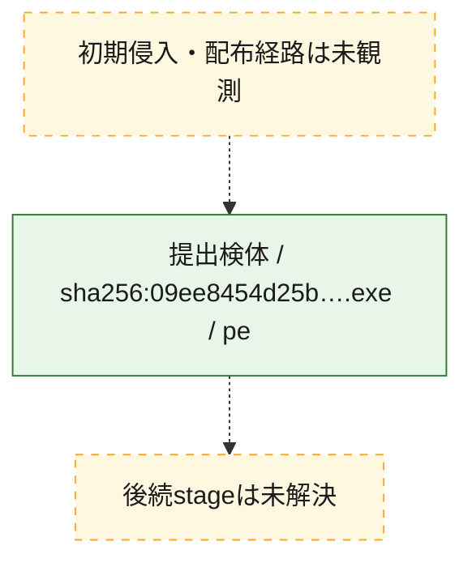
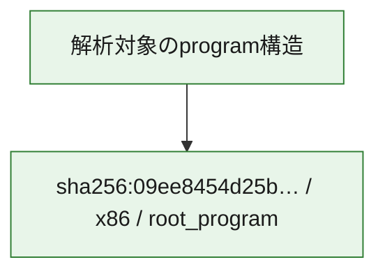

# 全体ロジック：09ee8454d25becc292fb33b33c85554df1ff4d70d780c210633682c904e52fb1

代表関数の静的証跡から、起動・初期化の処理群を確認しました。

## 読み方

- phaseの掲載順は解析上の整理順です。observed_call_edgesがない段階間の実行順を断定しません。
- 図の実線は静的に観測した関係、点線と黄色のノードは未観測・未解決の関係を示します。
- 図は静的な要約であり、動的実行を再現するものではありません。
- 詳細な関数解説とfingerprintは[STATIC-LOGIC.md](STATIC-LOGIC.md)を参照してください。

## 静的可視化

### 実行フロー

### 感染チェーン

### モジュール関係

## 処理段階

### 1. 起動・初期化

entry pointから初期化と後続処理への移行を確認します。
確度: `confirmed_static_function_evidence`

- `09ee8454d25becc292fb33b33c85554df1ff4d70d780c210633682c904e52fb1:ghidra:180001010` — 初期化と主要処理への分岐を行う入口関数です。 状態: `succeeded`、選定理由: `entry_point`, `meaningful_symbol_name`, `reviewed_call_centrality:22`, `role:entrypoint`, `small_program_complete_context`

### 2. 補助処理

主要処理を支える一般内部関数またはlibrary処理を確認します。
確度: `confirmed_static_function_evidence`

- `09ee8454d25becc292fb33b33c85554df1ff4d70d780c210633682c904e52fb1:ghidra:180001240` — 検体内部の一般処理を実装する関数です。 状態: `succeeded`、選定理由: `context_representative`, `reviewed_call_centrality:2`, `small_program_complete_context`
- `09ee8454d25becc292fb33b33c85554df1ff4d70d780c210633682c904e52fb1:ghidra:180001350` — 検体内部の一般処理を実装する関数です。 状態: `succeeded`、選定理由: `context_representative`, `reviewed_call_centrality:25`, `small_program_complete_context`
- `09ee8454d25becc292fb33b33c85554df1ff4d70d780c210633682c904e52fb1:ghidra:180003780` — 検体内部の一般処理を実装する関数です。 状態: `succeeded`、選定理由: `context_representative`, `reviewed_call_centrality:2`, `small_program_complete_context`
- `09ee8454d25becc292fb33b33c85554df1ff4d70d780c210633682c904e52fb1:ghidra:1800038e0` — 検体内部の一般処理を実装する関数です。 状態: `succeeded`、選定理由: `context_representative`, `reviewed_call_centrality:2`, `small_program_complete_context`

## 観測したcall関係

- `09ee8454d25becc292fb33b33c85554df1ff4d70d780c210633682c904e52fb1:ghidra:180001010` → `09ee8454d25becc292fb33b33c85554df1ff4d70d780c210633682c904e52fb1:ghidra:180001240` （`startup` → `support`）
- `09ee8454d25becc292fb33b33c85554df1ff4d70d780c210633682c904e52fb1:ghidra:180001010` → `09ee8454d25becc292fb33b33c85554df1ff4d70d780c210633682c904e52fb1:ghidra:180001350` （`startup` → `support`）
- `09ee8454d25becc292fb33b33c85554df1ff4d70d780c210633682c904e52fb1:ghidra:180001350` → `09ee8454d25becc292fb33b33c85554df1ff4d70d780c210633682c904e52fb1:ghidra:180001240` （`support` → `support`）
- `09ee8454d25becc292fb33b33c85554df1ff4d70d780c210633682c904e52fb1:ghidra:180001350` → `09ee8454d25becc292fb33b33c85554df1ff4d70d780c210633682c904e52fb1:ghidra:180003780` （`support` → `support`）
- `09ee8454d25becc292fb33b33c85554df1ff4d70d780c210633682c904e52fb1:ghidra:180001350` → `09ee8454d25becc292fb33b33c85554df1ff4d70d780c210633682c904e52fb1:ghidra:1800038e0` （`support` → `support`）
- `09ee8454d25becc292fb33b33c85554df1ff4d70d780c210633682c904e52fb1:ghidra:180003780` → `09ee8454d25becc292fb33b33c85554df1ff4d70d780c210633682c904e52fb1:ghidra:1800038e0` （`support` → `support`）
- `ghidra-function:56c2aa3bace5dfc28a13f859` → `ghidra-external:05a6a1b5d4b6e75760853500` （`unclassified` → `unclassified`）
- `ghidra-function:56c2aa3bace5dfc28a13f859` → `ghidra-external:129c362647cce0d63c9362af` （`unclassified` → `unclassified`）
- `ghidra-function:56c2aa3bace5dfc28a13f859` → `ghidra-external:1871c22ed6c60a4bbf769eec` （`unclassified` → `unclassified`）
- `ghidra-function:56c2aa3bace5dfc28a13f859` → `ghidra-external:1c2d7ec27516ad9bc6072b61` （`unclassified` → `unclassified`）
- `ghidra-function:56c2aa3bace5dfc28a13f859` → `ghidra-external:270bf127f81181a927726ef5` （`unclassified` → `unclassified`）
- `ghidra-function:56c2aa3bace5dfc28a13f859` → `ghidra-external:2c45742df5875f8bbbafc540` （`unclassified` → `unclassified`）
- `ghidra-function:56c2aa3bace5dfc28a13f859` → `ghidra-external:57f955d03c66b74fa56f0c38` （`unclassified` → `unclassified`）
- `ghidra-function:56c2aa3bace5dfc28a13f859` → `ghidra-external:619f580e47b31294ac3fb5ac` （`unclassified` → `unclassified`）
- `ghidra-function:56c2aa3bace5dfc28a13f859` → `ghidra-external:a065b664aa718dd7d78b3aae` （`unclassified` → `unclassified`）
- `ghidra-function:56c2aa3bace5dfc28a13f859` → `ghidra-external:b3373e37a16710ce916baaa5` （`unclassified` → `unclassified`）
- `ghidra-function:56c2aa3bace5dfc28a13f859` → `ghidra-external:b706fd6531e65f74a3899b83` （`unclassified` → `unclassified`）
- `ghidra-function:56c2aa3bace5dfc28a13f859` → `ghidra-external:be713c35e9eb8265825a56a5` （`unclassified` → `unclassified`）
- `ghidra-function:56c2aa3bace5dfc28a13f859` → `ghidra-external:c8e23c6bc94264f1f6963a78` （`unclassified` → `unclassified`）
- `ghidra-function:56c2aa3bace5dfc28a13f859` → `ghidra-external:ca4a06607369b6d419db229d` （`unclassified` → `unclassified`）
- `ghidra-function:56c2aa3bace5dfc28a13f859` → `ghidra-external:cca1c3be5ea9b3fe798e3b7b` （`unclassified` → `unclassified`）
- `ghidra-function:56c2aa3bace5dfc28a13f859` → `ghidra-external:d16773159d62e3446ad02ce5` （`unclassified` → `unclassified`）
- `ghidra-function:56c2aa3bace5dfc28a13f859` → `ghidra-external:d5dd107e4d3462ba6f5fb7a5` （`unclassified` → `unclassified`）
- `ghidra-function:56c2aa3bace5dfc28a13f859` → `ghidra-external:de684eccd3e07d4b6f209687` （`unclassified` → `unclassified`）
- `ghidra-function:56c2aa3bace5dfc28a13f859` → `ghidra-external:decaf159d7d957670e85b3a6` （`unclassified` → `unclassified`）
- `ghidra-function:56c2aa3bace5dfc28a13f859` → `ghidra-external:e8eb11149f9490e8b79e65e8` （`unclassified` → `unclassified`）
- `ghidra-function:56c2aa3bace5dfc28a13f859` → `ghidra-external:f8ef841c0ce369b351a4a77f` （`unclassified` → `unclassified`）
- `ghidra-function:56c2aa3bace5dfc28a13f859` → `ghidra-function:233888eeece4a4a04148594d` （`unclassified` → `unclassified`）
- `ghidra-function:56c2aa3bace5dfc28a13f859` → `ghidra-function:6e631d07fde7b26724470eb2` （`unclassified` → `unclassified`）
- `ghidra-function:56c2aa3bace5dfc28a13f859` → `ghidra-function:897a60bd02181303fbf94ba9` （`unclassified` → `unclassified`）
- `ghidra-function:6e631d07fde7b26724470eb2` → `ghidra-function:897a60bd02181303fbf94ba9` （`unclassified` → `unclassified`）
- `ghidra-function:8b12dd8d726056cc89612dbe` → `ghidra-function:0a1202a579d62ccd72c4a6e6` （`unclassified` → `unclassified`）
- `ghidra-function:8b12dd8d726056cc89612dbe` → `ghidra-function:233888eeece4a4a04148594d` （`unclassified` → `unclassified`）
- `ghidra-function:8b12dd8d726056cc89612dbe` → `ghidra-function:56c2aa3bace5dfc28a13f859` （`unclassified` → `unclassified`）
- `ghidra-function:8b12dd8d726056cc89612dbe` → `ghidra-function:6e7757998c869721abb82874` （`unclassified` → `unclassified`）
- `ghidra-function:8b12dd8d726056cc89612dbe` → `ghidra-function:7f96ce8eef52c0440eefa2e9` （`unclassified` → `unclassified`）
- `ghidra-function:8b12dd8d726056cc89612dbe` → `ghidra-function:9830d0ea270dd72e0fe5e3e6` （`unclassified` → `unclassified`）
- `ghidra-function:8b12dd8d726056cc89612dbe` → `ghidra-function:b3c37e701a388da2ab1f3258` （`unclassified` → `unclassified`）
- `ghidra-function:8b12dd8d726056cc89612dbe` → `ghidra-function:c59e59704aa2358f24a0ceba` （`unclassified` → `unclassified`）
- `ghidra-function:8b12dd8d726056cc89612dbe` → `ghidra-function:c85babb8959593f0d36a01bb` （`unclassified` → `unclassified`）
- `ghidra-function:8b12dd8d726056cc89612dbe` → `ghidra-function:d6a4361552360c664cdf3055` （`unclassified` → `unclassified`）
- `ghidra-function:8b12dd8d726056cc89612dbe` → `ghidra-function:fd2ee6259ff1680811652c6e` （`unclassified` → `unclassified`）
- `ghidra-function:8b12dd8d726056cc89612dbe` → `ghidra-function:ff7f40f734fff9369f047150` （`unclassified` → `unclassified`）

## 解析範囲と制約

- 選定外関数は全体inventoryへ残しますが、関数本体の個別解説対象にはしていません。
- indirect call、難読化、packer、VM、壊れたcontrol flowによりcall関係が欠落する場合があります。
- 文書は静的解析に基づき、検体実行や外部通信による動的確認は行っていません。
