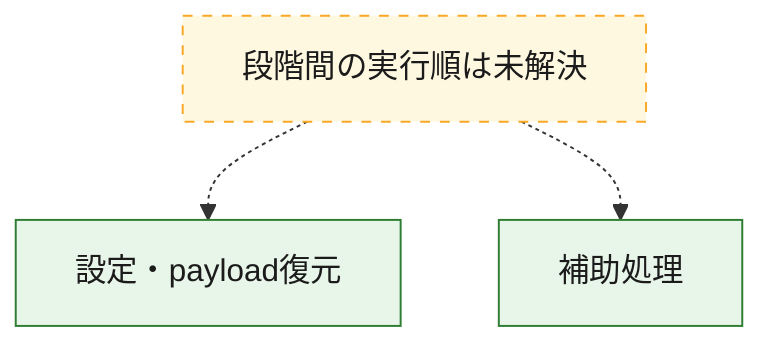
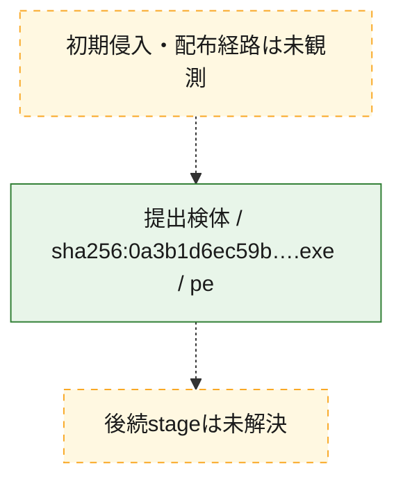
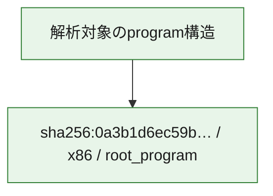

# 全体ロジック：0a3b1d6ec59becdc48c2f5096a85bbf49334d3011370de5aaf926e1eb4e7b5f9

代表関数の静的証跡から、設定・payload復元の処理群を確認しました。

## 読み方

- phaseの掲載順は解析上の整理順です。observed_call_edgesがない段階間の実行順を断定しません。
- 図の実線は静的に観測した関係、点線と黄色のノードは未観測・未解決の関係を示します。
- 図は静的な要約であり、動的実行を再現するものではありません。
- 詳細な関数解説とfingerprintは[STATIC-LOGIC.md](STATIC-LOGIC.md)を参照してください。

## 静的可視化

### 実行フロー

### 感染チェーン

### モジュール関係

## 処理段階

### 1. 設定・payload復元

設定、resource、payload、暗号化データの復元・変換を確認します。
確度: `confirmed_static_function_evidence`

- `0a3b1d6ec59becdc48c2f5096a85bbf49334d3011370de5aaf926e1eb4e7b5f9:ghidra:180013e60` — 暗号、hash、encoding、または復号処理に関係する関数です。 状態: `succeeded`、選定理由: `entry_point`, `meaningful_symbol_name`, `reviewed_call_centrality:2`, `role:cryptographic_transform`
- `0a3b1d6ec59becdc48c2f5096a85bbf49334d3011370de5aaf926e1eb4e7b5f9:ghidra:180014080` — 暗号、hash、encoding、または復号処理に関係する関数です。 状態: `succeeded`、選定理由: `entry_point`, `meaningful_symbol_name`, `reviewed_call_centrality:2`, `role:cryptographic_transform`

### 2. 補助処理

主要処理を支える一般内部関数またはlibrary処理を確認します。
確度: `confirmed_static_function_evidence`

- `0a3b1d6ec59becdc48c2f5096a85bbf49334d3011370de5aaf926e1eb4e7b5f9:ghidra:180013e80` — 検体内部の一般処理を実装する関数です。 状態: `succeeded`、選定理由: `entry_point`, `meaningful_symbol_name`, `reviewed_call_centrality:2`
- `0a3b1d6ec59becdc48c2f5096a85bbf49334d3011370de5aaf926e1eb4e7b5f9:ghidra:180013ea0` — 検体内部の一般処理を実装する関数です。 状態: `succeeded`、選定理由: `entry_point`, `meaningful_symbol_name`, `reviewed_call_centrality:2`
- `0a3b1d6ec59becdc48c2f5096a85bbf49334d3011370de5aaf926e1eb4e7b5f9:ghidra:180013ec0` — 検体内部の一般処理を実装する関数です。 状態: `succeeded`、選定理由: `entry_point`, `meaningful_symbol_name`, `reviewed_call_centrality:2`
- `0a3b1d6ec59becdc48c2f5096a85bbf49334d3011370de5aaf926e1eb4e7b5f9:ghidra:180013ee0` — 検体内部の一般処理を実装する関数です。 状態: `succeeded`、選定理由: `entry_point`, `meaningful_symbol_name`, `reviewed_call_centrality:2`
- `0a3b1d6ec59becdc48c2f5096a85bbf49334d3011370de5aaf926e1eb4e7b5f9:ghidra:180013f00` — 検体内部の一般処理を実装する関数です。 状態: `succeeded`、選定理由: `entry_point`, `meaningful_symbol_name`, `reviewed_call_centrality:2`
- `0a3b1d6ec59becdc48c2f5096a85bbf49334d3011370de5aaf926e1eb4e7b5f9:ghidra:180013f20` — 検体内部の一般処理を実装する関数です。 状態: `succeeded`、選定理由: `entry_point`, `meaningful_symbol_name`, `reviewed_call_centrality:2`
- `0a3b1d6ec59becdc48c2f5096a85bbf49334d3011370de5aaf926e1eb4e7b5f9:ghidra:180013f40` — 検体内部の一般処理を実装する関数です。 状態: `succeeded`、選定理由: `entry_point`, `meaningful_symbol_name`, `reviewed_call_centrality:2`
- `0a3b1d6ec59becdc48c2f5096a85bbf49334d3011370de5aaf926e1eb4e7b5f9:ghidra:180013f60` — 検体内部の一般処理を実装する関数です。 状態: `succeeded`、選定理由: `entry_point`, `meaningful_symbol_name`, `reviewed_call_centrality:2`
- `0a3b1d6ec59becdc48c2f5096a85bbf49334d3011370de5aaf926e1eb4e7b5f9:ghidra:180013f80` — 検体内部の一般処理を実装する関数です。 状態: `succeeded`、選定理由: `entry_point`, `meaningful_symbol_name`, `reviewed_call_centrality:2`
- `0a3b1d6ec59becdc48c2f5096a85bbf49334d3011370de5aaf926e1eb4e7b5f9:ghidra:180013fa0` — 検体内部の一般処理を実装する関数です。 状態: `succeeded`、選定理由: `entry_point`, `meaningful_symbol_name`, `reviewed_call_centrality:2`
- `0a3b1d6ec59becdc48c2f5096a85bbf49334d3011370de5aaf926e1eb4e7b5f9:ghidra:180013fc0` — 検体内部の一般処理を実装する関数です。 状態: `succeeded`、選定理由: `entry_point`, `meaningful_symbol_name`, `reviewed_call_centrality:2`
- `0a3b1d6ec59becdc48c2f5096a85bbf49334d3011370de5aaf926e1eb4e7b5f9:ghidra:180013fe0` — 検体内部の一般処理を実装する関数です。 状態: `succeeded`、選定理由: `entry_point`, `meaningful_symbol_name`, `reviewed_call_centrality:3`
- `0a3b1d6ec59becdc48c2f5096a85bbf49334d3011370de5aaf926e1eb4e7b5f9:ghidra:180014000` — 検体内部の一般処理を実装する関数です。 状態: `succeeded`、選定理由: `entry_point`, `meaningful_symbol_name`, `reviewed_call_centrality:2`
- `0a3b1d6ec59becdc48c2f5096a85bbf49334d3011370de5aaf926e1eb4e7b5f9:ghidra:180014020` — 検体内部の一般処理を実装する関数です。 状態: `succeeded`、選定理由: `entry_point`, `meaningful_symbol_name`, `reviewed_call_centrality:2`
- `0a3b1d6ec59becdc48c2f5096a85bbf49334d3011370de5aaf926e1eb4e7b5f9:ghidra:180014040` — 検体内部の一般処理を実装する関数です。 状態: `succeeded`、選定理由: `entry_point`, `meaningful_symbol_name`, `reviewed_call_centrality:2`
- `0a3b1d6ec59becdc48c2f5096a85bbf49334d3011370de5aaf926e1eb4e7b5f9:ghidra:180014060` — 検体内部の一般処理を実装する関数です。 状態: `succeeded`、選定理由: `entry_point`, `meaningful_symbol_name`, `reviewed_call_centrality:2`
- `0a3b1d6ec59becdc48c2f5096a85bbf49334d3011370de5aaf926e1eb4e7b5f9:ghidra:1800140a0` — 検体内部の一般処理を実装する関数です。 状態: `succeeded`、選定理由: `entry_point`, `meaningful_symbol_name`, `reviewed_call_centrality:2`
- `0a3b1d6ec59becdc48c2f5096a85bbf49334d3011370de5aaf926e1eb4e7b5f9:ghidra:1800140c0` — 検体内部の一般処理を実装する関数です。 状態: `succeeded`、選定理由: `entry_point`, `meaningful_symbol_name`, `reviewed_call_centrality:3`
- `0a3b1d6ec59becdc48c2f5096a85bbf49334d3011370de5aaf926e1eb4e7b5f9:ghidra:1800140e0` — 検体内部の一般処理を実装する関数です。 状態: `succeeded`、選定理由: `entry_point`, `meaningful_symbol_name`, `reviewed_call_centrality:2`
- `0a3b1d6ec59becdc48c2f5096a85bbf49334d3011370de5aaf926e1eb4e7b5f9:ghidra:180014100` — 検体内部の一般処理を実装する関数です。 状態: `succeeded`、選定理由: `entry_point`, `meaningful_symbol_name`, `reviewed_call_centrality:3`
- `0a3b1d6ec59becdc48c2f5096a85bbf49334d3011370de5aaf926e1eb4e7b5f9:ghidra:180014120` — 検体内部の一般処理を実装する関数です。 状態: `succeeded`、選定理由: `entry_point`, `meaningful_symbol_name`, `reviewed_call_centrality:2`
- `0a3b1d6ec59becdc48c2f5096a85bbf49334d3011370de5aaf926e1eb4e7b5f9:ghidra:180014140` — 検体内部の一般処理を実装する関数です。 状態: `succeeded`、選定理由: `entry_point`, `meaningful_symbol_name`, `reviewed_call_centrality:3`
- `0a3b1d6ec59becdc48c2f5096a85bbf49334d3011370de5aaf926e1eb4e7b5f9:ghidra:180014160` — 検体内部の一般処理を実装する関数です。 状態: `succeeded`、選定理由: `entry_point`, `meaningful_symbol_name`, `reviewed_call_centrality:2`
- `0a3b1d6ec59becdc48c2f5096a85bbf49334d3011370de5aaf926e1eb4e7b5f9:ghidra:180014180` — 検体内部の一般処理を実装する関数です。 状態: `succeeded`、選定理由: `entry_point`, `meaningful_symbol_name`, `reviewed_call_centrality:2`
- `0a3b1d6ec59becdc48c2f5096a85bbf49334d3011370de5aaf926e1eb4e7b5f9:ghidra:1800141a0` — 検体内部の一般処理を実装する関数です。 状態: `succeeded`、選定理由: `entry_point`, `meaningful_symbol_name`, `reviewed_call_centrality:2`
- `0a3b1d6ec59becdc48c2f5096a85bbf49334d3011370de5aaf926e1eb4e7b5f9:ghidra:1800141c0` — 検体内部の一般処理を実装する関数です。 状態: `succeeded`、選定理由: `entry_point`, `meaningful_symbol_name`, `reviewed_call_centrality:2`
- `0a3b1d6ec59becdc48c2f5096a85bbf49334d3011370de5aaf926e1eb4e7b5f9:ghidra:1800141e0` — 検体内部の一般処理を実装する関数です。 状態: `succeeded`、選定理由: `entry_point`, `meaningful_symbol_name`, `reviewed_call_centrality:2`
- `0a3b1d6ec59becdc48c2f5096a85bbf49334d3011370de5aaf926e1eb4e7b5f9:ghidra:180014200` — 検体内部の一般処理を実装する関数です。 状態: `succeeded`、選定理由: `entry_point`, `meaningful_symbol_name`, `reviewed_call_centrality:2`
- `0a3b1d6ec59becdc48c2f5096a85bbf49334d3011370de5aaf926e1eb4e7b5f9:ghidra:180014220` — 検体内部の一般処理を実装する関数です。 状態: `succeeded`、選定理由: `entry_point`, `meaningful_symbol_name`, `reviewed_call_centrality:2`
- `0a3b1d6ec59becdc48c2f5096a85bbf49334d3011370de5aaf926e1eb4e7b5f9:ghidra:180014240` — 検体内部の一般処理を実装する関数です。 状態: `succeeded`、選定理由: `entry_point`, `meaningful_symbol_name`, `reviewed_call_centrality:2`

## 観測したcall関係

- 代表関数間で直接解決できた呼出関係はありません。

## 解析範囲と制約

- 選定外関数は全体inventoryへ残しますが、関数本体の個別解説対象にはしていません。
- indirect call、難読化、packer、VM、壊れたcontrol flowによりcall関係が欠落する場合があります。
- 文書は静的解析に基づき、検体実行や外部通信による動的確認は行っていません。
