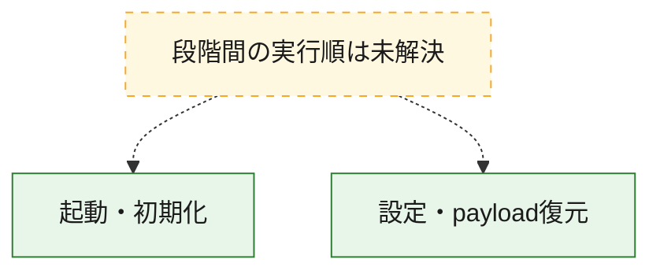
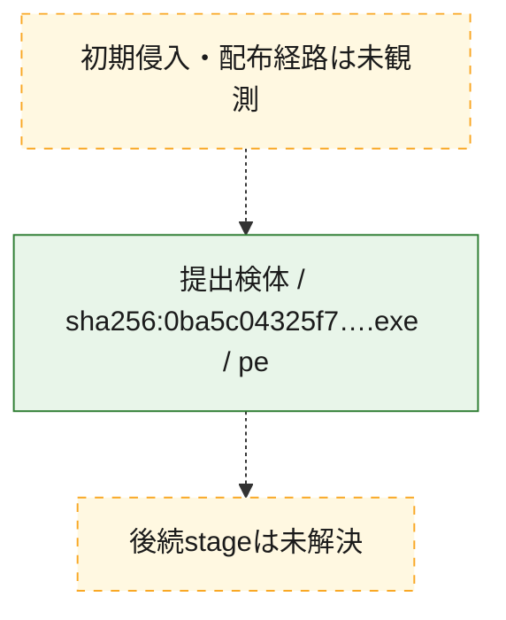
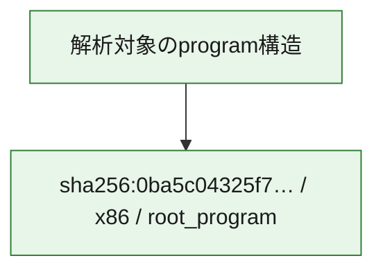

# 全体ロジック：0ba5c04325f7af25a2f6bf4c588dff798d481b0a799b10faac9d4daed7c09c5e

代表関数の静的証跡から、起動・初期化、設定・payload復元の処理群を確認しました。

## 読み方

- phaseの掲載順は解析上の整理順です。observed_call_edgesがない段階間の実行順を断定しません。
- 図の実線は静的に観測した関係、点線と黄色のノードは未観測・未解決の関係を示します。
- 図は静的な要約であり、動的実行を再現するものではありません。
- 詳細な関数解説とfingerprintは[STATIC-LOGIC.md](STATIC-LOGIC.md)を参照してください。

## 静的可視化

### 実行フロー

### 感染チェーン

### モジュール関係

## 処理段階

### 1. 起動・初期化

entry pointから初期化と後続処理への移行を確認します。
確度: `confirmed_static_function_evidence`

- `0ba5c04325f7af25a2f6bf4c588dff798d481b0a799b10faac9d4daed7c09c5e:cil:0x06000001` — 初期化と主要処理への分岐を行う入口関数です。 状態: `succeeded`、選定理由: `entry_point`, `reviewed_call_centrality:16`, `small_program_complete_context`

### 2. 設定・payload復元

設定、resource、payload、暗号化データの復元・変換を確認します。
確度: `confirmed_static_function_evidence`

- `0ba5c04325f7af25a2f6bf4c588dff798d481b0a799b10faac9d4daed7c09c5e:cil:0x06000002` — 設定、resource、payloadなどの解析・変換を行う関数です。 状態: `succeeded`、選定理由: `reviewed_call_centrality:10`, `role:config_or_data_transform`, `small_program_complete_context`
- `0ba5c04325f7af25a2f6bf4c588dff798d481b0a799b10faac9d4daed7c09c5e:cil:0x06000003` — 設定、resource、payloadなどの解析・変換を行う関数です。 状態: `succeeded`、選定理由: `large_function:instructions=82`, `reviewed_call_centrality:16`, `role:config_or_data_transform`, `small_program_complete_context`
- `0ba5c04325f7af25a2f6bf4c588dff798d481b0a799b10faac9d4daed7c09c5e:cil:0x06000004` — 設定、resource、payloadなどの解析・変換を行う関数です。 状態: `succeeded`、選定理由: `reviewed_call_centrality:2`, `role:config_or_data_transform`, `small_program_complete_context`

## 観測したcall関係

- 代表関数間で直接解決できた呼出関係はありません。

## 解析範囲と制約

- 選定外関数は全体inventoryへ残しますが、関数本体の個別解説対象にはしていません。
- indirect call、難読化、packer、VM、壊れたcontrol flowによりcall関係が欠落する場合があります。
- 文書は静的解析に基づき、検体実行や外部通信による動的確認は行っていません。
