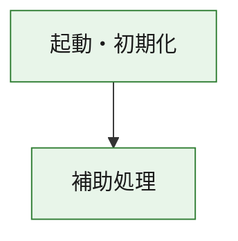
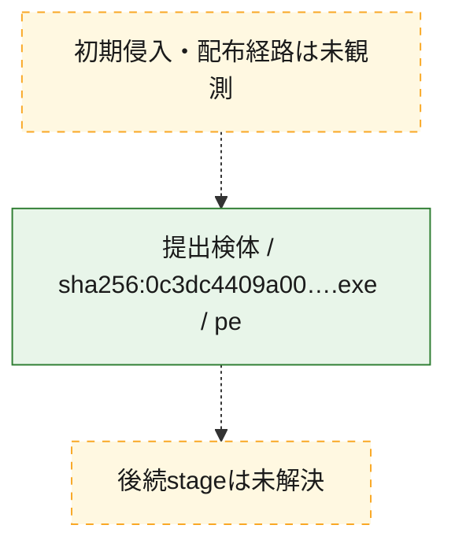
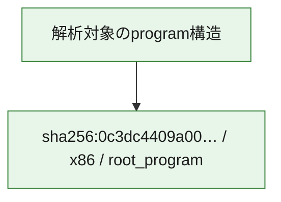

# 全体ロジック：0c3dc4409a00ea240ed1a884e27cb7d38cc30524b7d7c1319121916cfa6a1d73

代表関数の静的証跡から、起動・初期化の処理群を確認しました。

## 読み方

- phaseの掲載順は解析上の整理順です。observed_call_edgesがない段階間の実行順を断定しません。
- 図の実線は静的に観測した関係、点線と黄色のノードは未観測・未解決の関係を示します。
- 図は静的な要約であり、動的実行を再現するものではありません。
- 詳細な関数解説とfingerprintは[STATIC-LOGIC.md](STATIC-LOGIC.md)を参照してください。

## 静的可視化

### 実行フロー

### 感染チェーン

### モジュール関係

## 処理段階

### 1. 起動・初期化

entry pointから初期化と後続処理への移行を確認します。
確度: `confirmed_static_function_evidence`

- `0c3dc4409a00ea240ed1a884e27cb7d38cc30524b7d7c1319121916cfa6a1d73:ghidra:180001010` — 初期化と主要処理への分岐を行う入口関数です。 状態: `succeeded`、選定理由: `entry_point`, `meaningful_symbol_name`, `reviewed_call_centrality:22`, `role:entrypoint`, `small_program_complete_context`

### 2. 補助処理

主要処理を支える一般内部関数またはlibrary処理を確認します。
確度: `confirmed_static_function_evidence`

- `0c3dc4409a00ea240ed1a884e27cb7d38cc30524b7d7c1319121916cfa6a1d73:ghidra:180001240` — 検体内部の一般処理を実装する関数です。 状態: `succeeded`、選定理由: `context_representative`, `reviewed_call_centrality:2`, `small_program_complete_context`
- `0c3dc4409a00ea240ed1a884e27cb7d38cc30524b7d7c1319121916cfa6a1d73:ghidra:180001350` — 検体内部の一般処理を実装する関数です。 状態: `succeeded`、選定理由: `context_representative`, `reviewed_call_centrality:25`, `small_program_complete_context`
- `0c3dc4409a00ea240ed1a884e27cb7d38cc30524b7d7c1319121916cfa6a1d73:ghidra:180003780` — 検体内部の一般処理を実装する関数です。 状態: `succeeded`、選定理由: `context_representative`, `reviewed_call_centrality:2`, `small_program_complete_context`
- `0c3dc4409a00ea240ed1a884e27cb7d38cc30524b7d7c1319121916cfa6a1d73:ghidra:1800038e0` — 検体内部の一般処理を実装する関数です。 状態: `succeeded`、選定理由: `context_representative`, `reviewed_call_centrality:2`, `small_program_complete_context`

## 観測したcall関係

- `0c3dc4409a00ea240ed1a884e27cb7d38cc30524b7d7c1319121916cfa6a1d73:ghidra:180001010` → `0c3dc4409a00ea240ed1a884e27cb7d38cc30524b7d7c1319121916cfa6a1d73:ghidra:180001240` （`startup` → `support`）
- `0c3dc4409a00ea240ed1a884e27cb7d38cc30524b7d7c1319121916cfa6a1d73:ghidra:180001010` → `0c3dc4409a00ea240ed1a884e27cb7d38cc30524b7d7c1319121916cfa6a1d73:ghidra:180001350` （`startup` → `support`）
- `0c3dc4409a00ea240ed1a884e27cb7d38cc30524b7d7c1319121916cfa6a1d73:ghidra:180001350` → `0c3dc4409a00ea240ed1a884e27cb7d38cc30524b7d7c1319121916cfa6a1d73:ghidra:180001240` （`support` → `support`）
- `0c3dc4409a00ea240ed1a884e27cb7d38cc30524b7d7c1319121916cfa6a1d73:ghidra:180001350` → `0c3dc4409a00ea240ed1a884e27cb7d38cc30524b7d7c1319121916cfa6a1d73:ghidra:180003780` （`support` → `support`）
- `0c3dc4409a00ea240ed1a884e27cb7d38cc30524b7d7c1319121916cfa6a1d73:ghidra:180001350` → `0c3dc4409a00ea240ed1a884e27cb7d38cc30524b7d7c1319121916cfa6a1d73:ghidra:1800038e0` （`support` → `support`）
- `0c3dc4409a00ea240ed1a884e27cb7d38cc30524b7d7c1319121916cfa6a1d73:ghidra:180003780` → `0c3dc4409a00ea240ed1a884e27cb7d38cc30524b7d7c1319121916cfa6a1d73:ghidra:1800038e0` （`support` → `support`）
- `ghidra-function:1919576e0d3901b20dd0235f` → `ghidra-function:0c54af9d5232d54eb1925680` （`unclassified` → `unclassified`）
- `ghidra-function:1919576e0d3901b20dd0235f` → `ghidra-function:0cd84abef2a1329e1d55b698` （`unclassified` → `unclassified`）
- `ghidra-function:1919576e0d3901b20dd0235f` → `ghidra-function:1e3fa8866bfea4e5ee244768` （`unclassified` → `unclassified`）
- `ghidra-function:1919576e0d3901b20dd0235f` → `ghidra-function:3fcf1c9c9cea4221500f0284` （`unclassified` → `unclassified`）
- `ghidra-function:1919576e0d3901b20dd0235f` → `ghidra-function:570a7a69c2e033eaec511660` （`unclassified` → `unclassified`）
- `ghidra-function:1919576e0d3901b20dd0235f` → `ghidra-function:8a3d79dfc128e8ae0e495731` （`unclassified` → `unclassified`）
- `ghidra-function:1919576e0d3901b20dd0235f` → `ghidra-function:8b7c0b81297a6efccdae5ef3` （`unclassified` → `unclassified`）
- `ghidra-function:1919576e0d3901b20dd0235f` → `ghidra-function:971cf65b24e7c5cea43c2f95` （`unclassified` → `unclassified`）
- `ghidra-function:1919576e0d3901b20dd0235f` → `ghidra-function:a1ea1e985cc9103ed9f06b2e` （`unclassified` → `unclassified`）
- `ghidra-function:1919576e0d3901b20dd0235f` → `ghidra-function:aea6989152e7586cb05c61c9` （`unclassified` → `unclassified`）
- `ghidra-function:1919576e0d3901b20dd0235f` → `ghidra-function:c8260f75c7649db5ff663273` （`unclassified` → `unclassified`）
- `ghidra-function:1919576e0d3901b20dd0235f` → `ghidra-function:daadfbf0ecf73d513cf0452f` （`unclassified` → `unclassified`）
- `ghidra-function:9c2e884c14b866447f9da03b` → `ghidra-function:7f0d49d25c39c4b36ffd360a` （`unclassified` → `unclassified`）
- `ghidra-function:daadfbf0ecf73d513cf0452f` → `ghidra-external:219f2b9a060d40d2d69d6cfb` （`unclassified` → `unclassified`）
- `ghidra-function:daadfbf0ecf73d513cf0452f` → `ghidra-external:2a4cce2cf4a6c0c56a3050c0` （`unclassified` → `unclassified`）
- `ghidra-function:daadfbf0ecf73d513cf0452f` → `ghidra-external:3047bcb3ad246ac8bca3819e` （`unclassified` → `unclassified`）
- `ghidra-function:daadfbf0ecf73d513cf0452f` → `ghidra-external:32d90202b440d7f1f9f81b4e` （`unclassified` → `unclassified`）
- `ghidra-function:daadfbf0ecf73d513cf0452f` → `ghidra-external:39a6eed81c80d312822b3d45` （`unclassified` → `unclassified`）
- `ghidra-function:daadfbf0ecf73d513cf0452f` → `ghidra-external:47fde6357c419d278ffb530b` （`unclassified` → `unclassified`）
- `ghidra-function:daadfbf0ecf73d513cf0452f` → `ghidra-external:5866ffe314402a808fc69a14` （`unclassified` → `unclassified`）
- `ghidra-function:daadfbf0ecf73d513cf0452f` → `ghidra-external:5cecafce4ccc416301f1c093` （`unclassified` → `unclassified`）
- `ghidra-function:daadfbf0ecf73d513cf0452f` → `ghidra-external:8d7184b50585184d0d20bbeb` （`unclassified` → `unclassified`）
- `ghidra-function:daadfbf0ecf73d513cf0452f` → `ghidra-external:a2d5ae14b1d0216fd0db8cb1` （`unclassified` → `unclassified`）
- `ghidra-function:daadfbf0ecf73d513cf0452f` → `ghidra-external:a7136a3c50f61d31185c6bb9` （`unclassified` → `unclassified`）
- `ghidra-function:daadfbf0ecf73d513cf0452f` → `ghidra-external:a771e5b7423dfeab5e0c91e1` （`unclassified` → `unclassified`）
- `ghidra-function:daadfbf0ecf73d513cf0452f` → `ghidra-external:aa0d281cebbf0f766c18eef4` （`unclassified` → `unclassified`）
- `ghidra-function:daadfbf0ecf73d513cf0452f` → `ghidra-external:aec7b2a893bf4af9cbcc881a` （`unclassified` → `unclassified`）
- `ghidra-function:daadfbf0ecf73d513cf0452f` → `ghidra-external:b3d9fba4e4b829bd62ca5586` （`unclassified` → `unclassified`）
- `ghidra-function:daadfbf0ecf73d513cf0452f` → `ghidra-external:c05371230ff8ba88d7f8c853` （`unclassified` → `unclassified`）
- `ghidra-function:daadfbf0ecf73d513cf0452f` → `ghidra-external:c6ed9a1d1533b477bd366df7` （`unclassified` → `unclassified`）
- `ghidra-function:daadfbf0ecf73d513cf0452f` → `ghidra-external:de1844ae82b2cc1ae8c53145` （`unclassified` → `unclassified`）
- `ghidra-function:daadfbf0ecf73d513cf0452f` → `ghidra-external:ebb762a6b0fd0e64c1a68527` （`unclassified` → `unclassified`）
- `ghidra-function:daadfbf0ecf73d513cf0452f` → `ghidra-external:ef1270ffb30f4663c9419a2b` （`unclassified` → `unclassified`）
- `ghidra-function:daadfbf0ecf73d513cf0452f` → `ghidra-external:fda7208cf9d925fec66ed36e` （`unclassified` → `unclassified`）
- `ghidra-function:daadfbf0ecf73d513cf0452f` → `ghidra-function:0cd84abef2a1329e1d55b698` （`unclassified` → `unclassified`）
- `ghidra-function:daadfbf0ecf73d513cf0452f` → `ghidra-function:7f0d49d25c39c4b36ffd360a` （`unclassified` → `unclassified`）
- `ghidra-function:daadfbf0ecf73d513cf0452f` → `ghidra-function:9c2e884c14b866447f9da03b` （`unclassified` → `unclassified`）

## 解析範囲と制約

- 選定外関数は全体inventoryへ残しますが、関数本体の個別解説対象にはしていません。
- indirect call、難読化、packer、VM、壊れたcontrol flowによりcall関係が欠落する場合があります。
- 文書は静的解析に基づき、検体実行や外部通信による動的確認は行っていません。
