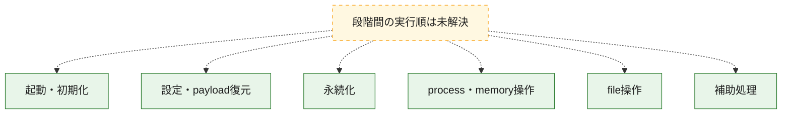
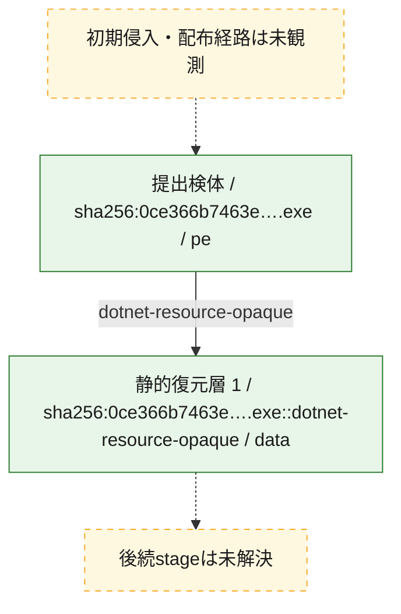
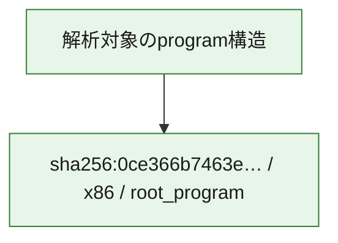

# 全体ロジック：0ce366b7463e6b3c9d389d1c799c9b64219e71112f13568e5e16efbfbebf9da9

代表関数の静的証跡から、起動・初期化、設定・payload復元、永続化、process・memory操作、file操作の処理群を確認しました。

## 読み方

- phaseの掲載順は解析上の整理順です。observed_call_edgesがない段階間の実行順を断定しません。
- 図の実線は静的に観測した関係、点線と黄色のノードは未観測・未解決の関係を示します。
- 図は静的な要約であり、動的実行を再現するものではありません。
- 詳細な関数解説とfingerprintは[STATIC-LOGIC.md](STATIC-LOGIC.md)を参照してください。

## 静的可視化

### 実行フロー

### 感染チェーン

### モジュール関係

## 処理段階

### 1. 起動・初期化

entry pointから初期化と後続処理への移行を確認します。
確度: `confirmed_static_function_evidence`

- `0ce366b7463e6b3c9d389d1c799c9b64219e71112f13568e5e16efbfbebf9da9:cil:0x06000013` — 初期化と主要処理への分岐を行う入口関数です。 状態: `succeeded`、選定理由: `entry_point`, `reviewed_call_centrality:10`, `small_program_complete_context`

### 2. 設定・payload復元

設定、resource、payload、暗号化データの復元・変換を確認します。
確度: `confirmed_static_function_evidence`

- `0ce366b7463e6b3c9d389d1c799c9b64219e71112f13568e5e16efbfbebf9da9:cil:0x06000009` — 暗号、hash、encoding、または復号処理に関係する関数です。 状態: `succeeded`、選定理由: `reviewed_call_centrality:2`, `role:cryptographic_transform`, `small_program_complete_context`
- `0ce366b7463e6b3c9d389d1c799c9b64219e71112f13568e5e16efbfbebf9da9:cil:0x06000014` — 設定、resource、payloadなどの解析・変換を行う関数です。 状態: `succeeded`、選定理由: `large_function:instructions=177`, `reviewed_call_centrality:38`, `role:config_or_data_transform`, `small_program_complete_context`
- `0ce366b7463e6b3c9d389d1c799c9b64219e71112f13568e5e16efbfbebf9da9:cil:0x06000017` — 設定、resource、payloadなどの解析・変換を行う関数です。 状態: `succeeded`、選定理由: `reviewed_call_centrality:8`, `role:config_or_data_transform`, `small_program_complete_context`

### 3. 永続化

自動起動や永続化に関係する設定変更を確認します。
確度: `confirmed_static_function_evidence`

- `0ce366b7463e6b3c9d389d1c799c9b64219e71112f13568e5e16efbfbebf9da9:cil:0x06000001` — 自動起動または永続化に関係する処理を含む関数です。 状態: `succeeded`、選定理由: `reviewed_call_centrality:2`, `role:persistence`, `small_program_complete_context`
- `0ce366b7463e6b3c9d389d1c799c9b64219e71112f13568e5e16efbfbebf9da9:cil:0x06000007` — 自動起動または永続化に関係する処理を含む関数です。 状態: `succeeded`、選定理由: `reviewed_call_centrality:2`, `role:persistence`, `small_program_complete_context`
- `0ce366b7463e6b3c9d389d1c799c9b64219e71112f13568e5e16efbfbebf9da9:cil:0x06000008` — 自動起動または永続化に関係する処理を含む関数です。 状態: `succeeded`、選定理由: `reviewed_call_centrality:4`, `role:persistence`, `small_program_complete_context`
- `0ce366b7463e6b3c9d389d1c799c9b64219e71112f13568e5e16efbfbebf9da9:cil:0x0600000a` — 自動起動または永続化に関係する処理を含む関数です。 状態: `succeeded`、選定理由: `reviewed_call_centrality:2`, `role:persistence`, `small_program_complete_context`
- `0ce366b7463e6b3c9d389d1c799c9b64219e71112f13568e5e16efbfbebf9da9:cil:0x0600000b` — 自動起動または永続化に関係する処理を含む関数です。 状態: `succeeded`、選定理由: `reviewed_call_centrality:2`, `role:persistence`, `small_program_complete_context`
- `0ce366b7463e6b3c9d389d1c799c9b64219e71112f13568e5e16efbfbebf9da9:cil:0x0600000c` — 自動起動または永続化に関係する処理を含む関数です。 状態: `succeeded`、選定理由: `reviewed_call_centrality:2`, `role:persistence`, `small_program_complete_context`
- `0ce366b7463e6b3c9d389d1c799c9b64219e71112f13568e5e16efbfbebf9da9:cil:0x0600000d` — 自動起動または永続化に関係する処理を含む関数です。 状態: `succeeded`、選定理由: `role:persistence`, `small_program_complete_context`
- `0ce366b7463e6b3c9d389d1c799c9b64219e71112f13568e5e16efbfbebf9da9:cil:0x0600000e` — 自動起動または永続化に関係する処理を含む関数です。 状態: `succeeded`、選定理由: `reviewed_call_centrality:2`, `role:persistence`, `small_program_complete_context`
- `0ce366b7463e6b3c9d389d1c799c9b64219e71112f13568e5e16efbfbebf9da9:cil:0x06000016` — 自動起動または永続化に関係する処理を含む関数です。 状態: `succeeded`、選定理由: `large_function:instructions=165`, `reviewed_call_centrality:20`, `role:persistence`, `small_program_complete_context`

### 4. process・memory操作

process、thread、module、memory操作と実行移行を確認します。
確度: `confirmed_static_function_evidence`

- `0ce366b7463e6b3c9d389d1c799c9b64219e71112f13568e5e16efbfbebf9da9:cil:0x0600000f` — process、thread、module、またはmemory操作に関係する関数です。 状態: `succeeded`、選定理由: `reviewed_call_centrality:2`, `role:process_or_memory_operation`, `small_program_complete_context`
- `0ce366b7463e6b3c9d389d1c799c9b64219e71112f13568e5e16efbfbebf9da9:cil:0x06000010` — process、thread、module、またはmemory操作に関係する関数です。 状態: `succeeded`、選定理由: `reviewed_call_centrality:2`, `role:process_or_memory_operation`, `small_program_complete_context`
- `0ce366b7463e6b3c9d389d1c799c9b64219e71112f13568e5e16efbfbebf9da9:cil:0x06000015` — process、thread、module、またはmemory操作に関係する関数です。 状態: `succeeded`、選定理由: `reviewed_call_centrality:2`, `role:process_or_memory_operation`, `small_program_complete_context`

### 5. file操作

fileやdirectoryの作成、読書き、削除を確認します。
確度: `confirmed_static_function_evidence`

- `0ce366b7463e6b3c9d389d1c799c9b64219e71112f13568e5e16efbfbebf9da9:cil:0x06000018` — fileまたはdirectoryの読書き・管理に関係する関数です。 状態: `succeeded`、選定理由: `reviewed_call_centrality:10`, `role:file_operation`, `small_program_complete_context`

### 6. 補助処理

主要処理を支える一般内部関数またはlibrary処理を確認します。
確度: `confirmed_static_function_evidence`

- `0ce366b7463e6b3c9d389d1c799c9b64219e71112f13568e5e16efbfbebf9da9:cil:0x06000002` — 検体内部の一般処理を実装する関数です。 状態: `succeeded`、選定理由: `reviewed_call_centrality:2`, `small_program_complete_context`
- `0ce366b7463e6b3c9d389d1c799c9b64219e71112f13568e5e16efbfbebf9da9:cil:0x06000003` — 検体内部の一般処理を実装する関数です。 状態: `succeeded`、選定理由: `reviewed_call_centrality:2`, `small_program_complete_context`
- `0ce366b7463e6b3c9d389d1c799c9b64219e71112f13568e5e16efbfbebf9da9:cil:0x06000004` — 検体内部の一般処理を実装する関数です。 状態: `succeeded`、選定理由: `reviewed_call_centrality:2`, `small_program_complete_context`
- `0ce366b7463e6b3c9d389d1c799c9b64219e71112f13568e5e16efbfbebf9da9:cil:0x06000005` — 検体内部の一般処理を実装する関数です。 状態: `succeeded`、選定理由: `reviewed_call_centrality:2`, `small_program_complete_context`
- `0ce366b7463e6b3c9d389d1c799c9b64219e71112f13568e5e16efbfbebf9da9:cil:0x06000006` — 検体内部の一般処理を実装する関数です。 状態: `succeeded`、選定理由: `reviewed_call_centrality:2`, `small_program_complete_context`
- `0ce366b7463e6b3c9d389d1c799c9b64219e71112f13568e5e16efbfbebf9da9:cil:0x06000011` — 検体内部の一般処理を実装する関数です。 状態: `succeeded`、選定理由: `reviewed_call_centrality:2`, `small_program_complete_context`
- `0ce366b7463e6b3c9d389d1c799c9b64219e71112f13568e5e16efbfbebf9da9:cil:0x06000012` — 検体内部の一般処理を実装する関数です。 状態: `succeeded`、選定理由: `reviewed_call_centrality:2`, `small_program_complete_context`

## 観測したcall関係

- 代表関数間で直接解決できた呼出関係はありません。

## 解析範囲と制約

- 選定外関数は全体inventoryへ残しますが、関数本体の個別解説対象にはしていません。
- indirect call、難読化、packer、VM、壊れたcontrol flowによりcall関係が欠落する場合があります。
- 文書は静的解析に基づき、検体実行や外部通信による動的確認は行っていません。
