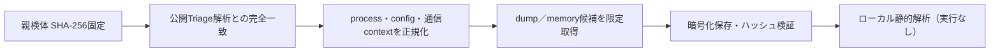

# Triage公開解析・後段取得証跡

## 完全ハッシュ一致

- [260803-3pkzjsdk8s](https://tria.ge/260803-3pkzjsdk8s): ファミリー候補 `needle_stealer, phorphiex, xmrig`、評価score `10`

## プロセス・通信

- 観測process: `1227431410.exe, 170179420.exe, 2165223155.exe, 2168220999.exe, 2223540970.exe, 254719183.exe, 2681440330.exe, 2710419796.exe, 2873730409.exe, 2913219613.exe, 2971216695.exe, 3197331390.exe, 330209102.exe, 4174330021.exe, cmd.exe, dwm.exe, file.exe, sc.exe, sysfrodolv.exe, sysmgnrsv.exe, syswinprdrvc.exe, taskkill.exe`
- raw commandは保存せず、command SHA-256と処理patternだけをJSONへ保持しています。
- sandbox background trafficは`context_only`であり、C2へ自動昇格しません。

- `http://130.12.180.135:3000/api/v2`（sandbox config候補）
- `http://178.16.54.109/ot/`（sandbox config候補）
- `http://178.16.54.109/spm/`（sandbox config候補）
- `http://178.16.54.109/spmm/`（sandbox config候補）
- `http://178.16.54.109/spmmm/`（sandbox config候補）
- `http://178.16.54.109/us/`（sandbox config候補）

## 二段目成果物

- `d00a0806b145423c459a4df53471965dc36f82ec5d5a5d4d108e0a7a1ce09d7b` / `dumped_file` / 18432 bytes / 親と同一: `false` / 静的解析: `partial`
- `ed1d3f69fbbd5576c2ed8dba45ba22c4f6884eb311d4f6e389203846d512ec11` / `dumped_file` / 8744960 bytes / 親と同一: `false` / 静的解析: `partial`

## 判定境界

Triage由来のfamily、process、config、通信は外部sandbox証跡です。config extractorが返したendpointはC2候補として扱えますが、
静的設定復元またはprocess帰属とprotocol応答が揃うまでは確認済みC2とはしません。取得成果物と検体は実行していません。
