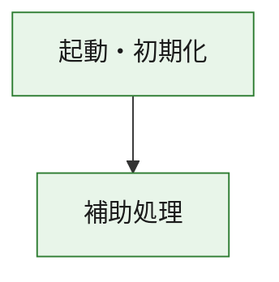
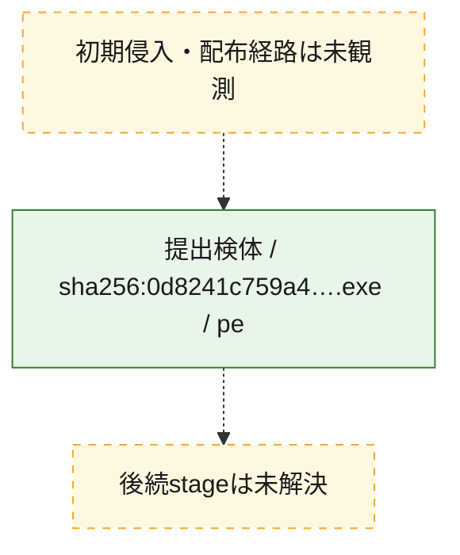
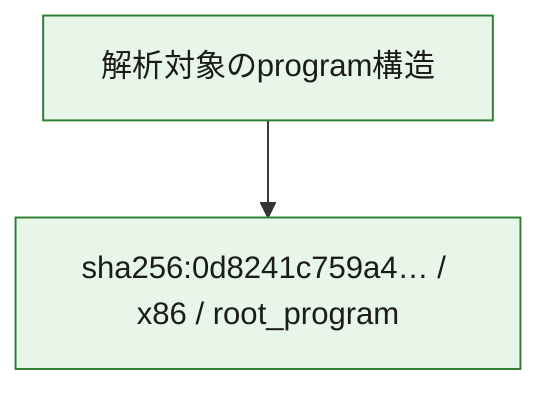

# 全体ロジック：0d8241c759a488ab6ec72afd33c884a1be707ff2b1f30dedbd4a5c97a268695b

代表関数の静的証跡から、起動・初期化の処理群を確認しました。

## 読み方

- phaseの掲載順は解析上の整理順です。observed_call_edgesがない段階間の実行順を断定しません。
- 図の実線は静的に観測した関係、点線と黄色のノードは未観測・未解決の関係を示します。
- 図は静的な要約であり、動的実行を再現するものではありません。
- 詳細な関数解説とfingerprintは[STATIC-LOGIC.md](STATIC-LOGIC.md)を参照してください。

## 静的可視化

### 実行フロー

### 感染チェーン

### モジュール関係

## 処理段階

### 1. 起動・初期化

entry pointから初期化と後続処理への移行を確認します。
確度: `confirmed_static_function_evidence`

- `0d8241c759a488ab6ec72afd33c884a1be707ff2b1f30dedbd4a5c97a268695b:ghidra:180001010` — 初期化と主要処理への分岐を行う入口関数です。 状態: `succeeded`、選定理由: `entry_point`, `meaningful_symbol_name`, `reviewed_call_centrality:22`, `role:entrypoint`, `small_program_complete_context`

### 2. 補助処理

主要処理を支える一般内部関数またはlibrary処理を確認します。
確度: `confirmed_static_function_evidence`

- `0d8241c759a488ab6ec72afd33c884a1be707ff2b1f30dedbd4a5c97a268695b:ghidra:180001240` — 検体内部の一般処理を実装する関数です。 状態: `succeeded`、選定理由: `context_representative`, `reviewed_call_centrality:2`, `small_program_complete_context`
- `0d8241c759a488ab6ec72afd33c884a1be707ff2b1f30dedbd4a5c97a268695b:ghidra:180001350` — 検体内部の一般処理を実装する関数です。 状態: `succeeded`、選定理由: `context_representative`, `reviewed_call_centrality:25`, `small_program_complete_context`
- `0d8241c759a488ab6ec72afd33c884a1be707ff2b1f30dedbd4a5c97a268695b:ghidra:180003780` — 検体内部の一般処理を実装する関数です。 状態: `succeeded`、選定理由: `context_representative`, `reviewed_call_centrality:2`, `small_program_complete_context`
- `0d8241c759a488ab6ec72afd33c884a1be707ff2b1f30dedbd4a5c97a268695b:ghidra:1800038e0` — 検体内部の一般処理を実装する関数です。 状態: `succeeded`、選定理由: `context_representative`, `reviewed_call_centrality:2`, `small_program_complete_context`

## 観測したcall関係

- `0d8241c759a488ab6ec72afd33c884a1be707ff2b1f30dedbd4a5c97a268695b:ghidra:180001010` → `0d8241c759a488ab6ec72afd33c884a1be707ff2b1f30dedbd4a5c97a268695b:ghidra:180001240` （`startup` → `support`）
- `0d8241c759a488ab6ec72afd33c884a1be707ff2b1f30dedbd4a5c97a268695b:ghidra:180001010` → `0d8241c759a488ab6ec72afd33c884a1be707ff2b1f30dedbd4a5c97a268695b:ghidra:180001350` （`startup` → `support`）
- `0d8241c759a488ab6ec72afd33c884a1be707ff2b1f30dedbd4a5c97a268695b:ghidra:180001350` → `0d8241c759a488ab6ec72afd33c884a1be707ff2b1f30dedbd4a5c97a268695b:ghidra:180001240` （`support` → `support`）
- `0d8241c759a488ab6ec72afd33c884a1be707ff2b1f30dedbd4a5c97a268695b:ghidra:180001350` → `0d8241c759a488ab6ec72afd33c884a1be707ff2b1f30dedbd4a5c97a268695b:ghidra:180003780` （`support` → `support`）
- `0d8241c759a488ab6ec72afd33c884a1be707ff2b1f30dedbd4a5c97a268695b:ghidra:180001350` → `0d8241c759a488ab6ec72afd33c884a1be707ff2b1f30dedbd4a5c97a268695b:ghidra:1800038e0` （`support` → `support`）
- `0d8241c759a488ab6ec72afd33c884a1be707ff2b1f30dedbd4a5c97a268695b:ghidra:180003780` → `0d8241c759a488ab6ec72afd33c884a1be707ff2b1f30dedbd4a5c97a268695b:ghidra:1800038e0` （`support` → `support`）
- `ghidra-function:351b5d13dabdf68498b66553` → `ghidra-function:2e9896d913d28a29c9ddf938` （`unclassified` → `unclassified`）
- `ghidra-function:351b5d13dabdf68498b66553` → `ghidra-function:3ce9452cac0e45a0424475a4` （`unclassified` → `unclassified`）
- `ghidra-function:351b5d13dabdf68498b66553` → `ghidra-function:3f936283d9721165f65ecf9f` （`unclassified` → `unclassified`）
- `ghidra-function:351b5d13dabdf68498b66553` → `ghidra-function:4855a9b1dca44077153f8fe7` （`unclassified` → `unclassified`）
- `ghidra-function:351b5d13dabdf68498b66553` → `ghidra-function:702103533aeac2e23ae96e62` （`unclassified` → `unclassified`）
- `ghidra-function:351b5d13dabdf68498b66553` → `ghidra-function:7132d44380b55d19af53e70d` （`unclassified` → `unclassified`）
- `ghidra-function:351b5d13dabdf68498b66553` → `ghidra-function:88e486df874c4b89899738a4` （`unclassified` → `unclassified`）
- `ghidra-function:351b5d13dabdf68498b66553` → `ghidra-function:91dd9a1c62f41fd777929487` （`unclassified` → `unclassified`）
- `ghidra-function:351b5d13dabdf68498b66553` → `ghidra-function:93829af0e454a2ae7505923a` （`unclassified` → `unclassified`）
- `ghidra-function:351b5d13dabdf68498b66553` → `ghidra-function:d8577667122a4e5c33970882` （`unclassified` → `unclassified`）
- `ghidra-function:351b5d13dabdf68498b66553` → `ghidra-function:f158d6a0126eb339775a64c3` （`unclassified` → `unclassified`）
- `ghidra-function:351b5d13dabdf68498b66553` → `ghidra-function:fbb07f6fbfa5df3bb7abd58d` （`unclassified` → `unclassified`）
- `ghidra-function:7132d44380b55d19af53e70d` → `ghidra-external:04674f963532e04e09ace96f` （`unclassified` → `unclassified`）
- `ghidra-function:7132d44380b55d19af53e70d` → `ghidra-external:075db752110fdeb7b5a604e8` （`unclassified` → `unclassified`）
- `ghidra-function:7132d44380b55d19af53e70d` → `ghidra-external:19f60fd89852d32f67c7ae8f` （`unclassified` → `unclassified`）
- `ghidra-function:7132d44380b55d19af53e70d` → `ghidra-external:2d273445dcdeb6023d2464bd` （`unclassified` → `unclassified`）
- `ghidra-function:7132d44380b55d19af53e70d` → `ghidra-external:301a25436bc3b88ceb85c4cf` （`unclassified` → `unclassified`）
- `ghidra-function:7132d44380b55d19af53e70d` → `ghidra-external:39883b77d60dcf29b3992ce3` （`unclassified` → `unclassified`）
- `ghidra-function:7132d44380b55d19af53e70d` → `ghidra-external:4dafc709f0ef4b0a0406ae48` （`unclassified` → `unclassified`）
- `ghidra-function:7132d44380b55d19af53e70d` → `ghidra-external:54bd922667b2cd42d91c0d91` （`unclassified` → `unclassified`）
- `ghidra-function:7132d44380b55d19af53e70d` → `ghidra-external:5f8549442c31bb5f2146b4fc` （`unclassified` → `unclassified`）
- `ghidra-function:7132d44380b55d19af53e70d` → `ghidra-external:5fd2edbcef5efc49196e0b5a` （`unclassified` → `unclassified`）
- `ghidra-function:7132d44380b55d19af53e70d` → `ghidra-external:62485b61ff166ba5359d7252` （`unclassified` → `unclassified`）
- `ghidra-function:7132d44380b55d19af53e70d` → `ghidra-external:84c1c3ed3cd703320207037e` （`unclassified` → `unclassified`）
- `ghidra-function:7132d44380b55d19af53e70d` → `ghidra-external:872df8a18f2279d80e1da97f` （`unclassified` → `unclassified`）
- `ghidra-function:7132d44380b55d19af53e70d` → `ghidra-external:9dcf43325f1dcf9cd933fb1d` （`unclassified` → `unclassified`）
- `ghidra-function:7132d44380b55d19af53e70d` → `ghidra-external:a325fbd307db9ed36bdba172` （`unclassified` → `unclassified`）
- `ghidra-function:7132d44380b55d19af53e70d` → `ghidra-external:a38607ee6d97549712456987` （`unclassified` → `unclassified`）
- `ghidra-function:7132d44380b55d19af53e70d` → `ghidra-external:b59aea6efc81d797b042437b` （`unclassified` → `unclassified`）
- `ghidra-function:7132d44380b55d19af53e70d` → `ghidra-external:e5cc3418d38b8f2ff3959569` （`unclassified` → `unclassified`）
- `ghidra-function:7132d44380b55d19af53e70d` → `ghidra-external:e7c442f8d0fd87c793ab44d2` （`unclassified` → `unclassified`）
- `ghidra-function:7132d44380b55d19af53e70d` → `ghidra-external:ede1a43a19d5797853816dab` （`unclassified` → `unclassified`）
- `ghidra-function:7132d44380b55d19af53e70d` → `ghidra-external:f525a33478e1306df19dde1d` （`unclassified` → `unclassified`）
- `ghidra-function:7132d44380b55d19af53e70d` → `ghidra-function:3ce9452cac0e45a0424475a4` （`unclassified` → `unclassified`）
- `ghidra-function:7132d44380b55d19af53e70d` → `ghidra-function:aad14f9b18ad4465cf199c92` （`unclassified` → `unclassified`）
- `ghidra-function:7132d44380b55d19af53e70d` → `ghidra-function:c0c97eeeddac95515b2f9339` （`unclassified` → `unclassified`）
- `ghidra-function:c0c97eeeddac95515b2f9339` → `ghidra-function:aad14f9b18ad4465cf199c92` （`unclassified` → `unclassified`）

## 解析範囲と制約

- 選定外関数は全体inventoryへ残しますが、関数本体の個別解説対象にはしていません。
- indirect call、難読化、packer、VM、壊れたcontrol flowによりcall関係が欠落する場合があります。
- 文書は静的解析に基づき、検体実行や外部通信による動的確認は行っていません。
