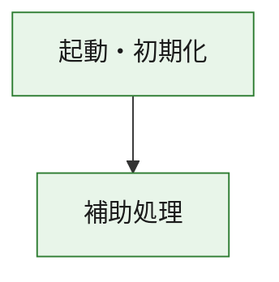
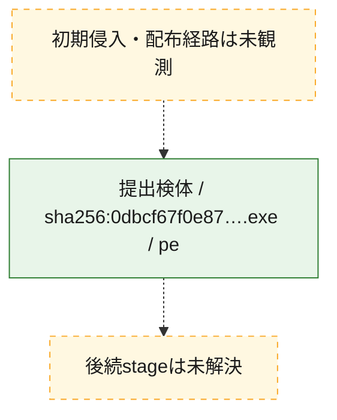
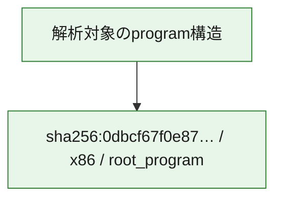

# 全体ロジック：0dbcf67f0e8736ef381c9fa3114b3276244c4c9c74028bc69647b342d6f65193

代表関数の静的証跡から、起動・初期化の処理群を確認しました。

## 読み方

- phaseの掲載順は解析上の整理順です。observed_call_edgesがない段階間の実行順を断定しません。
- 図の実線は静的に観測した関係、点線と黄色のノードは未観測・未解決の関係を示します。
- 図は静的な要約であり、動的実行を再現するものではありません。
- 詳細な関数解説とfingerprintは[STATIC-LOGIC.md](STATIC-LOGIC.md)を参照してください。

## 静的可視化

### 実行フロー

### 感染チェーン

### モジュール関係

## 処理段階

### 1. 起動・初期化

entry pointから初期化と後続処理への移行を確認します。
確度: `confirmed_static_function_evidence`

- `0dbcf67f0e8736ef381c9fa3114b3276244c4c9c74028bc69647b342d6f65193:ghidra:180001010` — 初期化と主要処理への分岐を行う入口関数です。 状態: `succeeded`、選定理由: `entry_point`, `meaningful_symbol_name`, `reviewed_call_centrality:22`, `role:entrypoint`, `small_program_complete_context`

### 2. 補助処理

主要処理を支える一般内部関数またはlibrary処理を確認します。
確度: `confirmed_static_function_evidence`

- `0dbcf67f0e8736ef381c9fa3114b3276244c4c9c74028bc69647b342d6f65193:ghidra:180001240` — 検体内部の一般処理を実装する関数です。 状態: `succeeded`、選定理由: `context_representative`, `reviewed_call_centrality:2`, `small_program_complete_context`
- `0dbcf67f0e8736ef381c9fa3114b3276244c4c9c74028bc69647b342d6f65193:ghidra:180001350` — 検体内部の一般処理を実装する関数です。 状態: `succeeded`、選定理由: `context_representative`, `reviewed_call_centrality:25`, `small_program_complete_context`
- `0dbcf67f0e8736ef381c9fa3114b3276244c4c9c74028bc69647b342d6f65193:ghidra:180003780` — 検体内部の一般処理を実装する関数です。 状態: `succeeded`、選定理由: `context_representative`, `reviewed_call_centrality:2`, `small_program_complete_context`
- `0dbcf67f0e8736ef381c9fa3114b3276244c4c9c74028bc69647b342d6f65193:ghidra:1800038e0` — 検体内部の一般処理を実装する関数です。 状態: `succeeded`、選定理由: `context_representative`, `reviewed_call_centrality:2`, `small_program_complete_context`

## 観測したcall関係

- `0dbcf67f0e8736ef381c9fa3114b3276244c4c9c74028bc69647b342d6f65193:ghidra:180001010` → `0dbcf67f0e8736ef381c9fa3114b3276244c4c9c74028bc69647b342d6f65193:ghidra:180001240` （`startup` → `support`）
- `0dbcf67f0e8736ef381c9fa3114b3276244c4c9c74028bc69647b342d6f65193:ghidra:180001010` → `0dbcf67f0e8736ef381c9fa3114b3276244c4c9c74028bc69647b342d6f65193:ghidra:180001350` （`startup` → `support`）
- `0dbcf67f0e8736ef381c9fa3114b3276244c4c9c74028bc69647b342d6f65193:ghidra:180001350` → `0dbcf67f0e8736ef381c9fa3114b3276244c4c9c74028bc69647b342d6f65193:ghidra:180001240` （`support` → `support`）
- `0dbcf67f0e8736ef381c9fa3114b3276244c4c9c74028bc69647b342d6f65193:ghidra:180001350` → `0dbcf67f0e8736ef381c9fa3114b3276244c4c9c74028bc69647b342d6f65193:ghidra:180003780` （`support` → `support`）
- `0dbcf67f0e8736ef381c9fa3114b3276244c4c9c74028bc69647b342d6f65193:ghidra:180001350` → `0dbcf67f0e8736ef381c9fa3114b3276244c4c9c74028bc69647b342d6f65193:ghidra:1800038e0` （`support` → `support`）
- `0dbcf67f0e8736ef381c9fa3114b3276244c4c9c74028bc69647b342d6f65193:ghidra:180003780` → `0dbcf67f0e8736ef381c9fa3114b3276244c4c9c74028bc69647b342d6f65193:ghidra:1800038e0` （`support` → `support`）
- `ghidra-function:4e49df2c0c294c87c00ba009` → `ghidra-external:0a70bd80c90c4218a3d5a14f` （`unclassified` → `unclassified`）
- `ghidra-function:4e49df2c0c294c87c00ba009` → `ghidra-external:0bb21999fc8302ad8d5bfdd7` （`unclassified` → `unclassified`）
- `ghidra-function:4e49df2c0c294c87c00ba009` → `ghidra-external:1edb39a69077350489494cc5` （`unclassified` → `unclassified`）
- `ghidra-function:4e49df2c0c294c87c00ba009` → `ghidra-external:2630798948bbc4a84014247a` （`unclassified` → `unclassified`）
- `ghidra-function:4e49df2c0c294c87c00ba009` → `ghidra-external:26d1a8288b422614484f8c85` （`unclassified` → `unclassified`）
- `ghidra-function:4e49df2c0c294c87c00ba009` → `ghidra-external:417ea4a7d41397ebdc9f3b4f` （`unclassified` → `unclassified`）
- `ghidra-function:4e49df2c0c294c87c00ba009` → `ghidra-external:5a97e9f1c2a8f3dbb676d689` （`unclassified` → `unclassified`）
- `ghidra-function:4e49df2c0c294c87c00ba009` → `ghidra-external:7a591218dedc8d76f16a4a42` （`unclassified` → `unclassified`）
- `ghidra-function:4e49df2c0c294c87c00ba009` → `ghidra-external:7d9d75a1eef6814fcbd939df` （`unclassified` → `unclassified`）
- `ghidra-function:4e49df2c0c294c87c00ba009` → `ghidra-external:82bea7afafbbe6de4b1ce3bd` （`unclassified` → `unclassified`）
- `ghidra-function:4e49df2c0c294c87c00ba009` → `ghidra-external:832cd7ccd13d17f92002381c` （`unclassified` → `unclassified`）
- `ghidra-function:4e49df2c0c294c87c00ba009` → `ghidra-external:84ca40f54311c0634c2c6099` （`unclassified` → `unclassified`）
- `ghidra-function:4e49df2c0c294c87c00ba009` → `ghidra-external:915d6d858582084f5da05eaf` （`unclassified` → `unclassified`）
- `ghidra-function:4e49df2c0c294c87c00ba009` → `ghidra-external:97942c21077c986ef109affa` （`unclassified` → `unclassified`）
- `ghidra-function:4e49df2c0c294c87c00ba009` → `ghidra-external:98c44146f9a17e23fdc0454b` （`unclassified` → `unclassified`）
- `ghidra-function:4e49df2c0c294c87c00ba009` → `ghidra-external:9bd5ce09f0519b24b77596ac` （`unclassified` → `unclassified`）
- `ghidra-function:4e49df2c0c294c87c00ba009` → `ghidra-external:a969f555b74e6c82970a2e26` （`unclassified` → `unclassified`）
- `ghidra-function:4e49df2c0c294c87c00ba009` → `ghidra-external:c3ccb0b0758c774cb6c8b6ce` （`unclassified` → `unclassified`）
- `ghidra-function:4e49df2c0c294c87c00ba009` → `ghidra-external:cfab76d782f232933500f90e` （`unclassified` → `unclassified`）
- `ghidra-function:4e49df2c0c294c87c00ba009` → `ghidra-external:e2e9af061e6d4019e690aaa7` （`unclassified` → `unclassified`）
- `ghidra-function:4e49df2c0c294c87c00ba009` → `ghidra-external:e2fba67425f74595f0fa9f81` （`unclassified` → `unclassified`）
- `ghidra-function:4e49df2c0c294c87c00ba009` → `ghidra-function:89402e48555a3b1d54de0bb0` （`unclassified` → `unclassified`）
- `ghidra-function:4e49df2c0c294c87c00ba009` → `ghidra-function:b177edb14110db208464e05d` （`unclassified` → `unclassified`）
- `ghidra-function:4e49df2c0c294c87c00ba009` → `ghidra-function:b3535ec852bb9f0dd30a5a23` （`unclassified` → `unclassified`）
- `ghidra-function:89402e48555a3b1d54de0bb0` → `ghidra-function:b177edb14110db208464e05d` （`unclassified` → `unclassified`）
- `ghidra-function:fe913cb04e4e7c228b31f372` → `ghidra-function:28cdd06893037c9ac29c12f8` （`unclassified` → `unclassified`）
- `ghidra-function:fe913cb04e4e7c228b31f372` → `ghidra-function:344171e760825d76807d9d7c` （`unclassified` → `unclassified`）
- `ghidra-function:fe913cb04e4e7c228b31f372` → `ghidra-function:4e49df2c0c294c87c00ba009` （`unclassified` → `unclassified`）
- `ghidra-function:fe913cb04e4e7c228b31f372` → `ghidra-function:56205b4d93d12cdbfd48a756` （`unclassified` → `unclassified`）
- `ghidra-function:fe913cb04e4e7c228b31f372` → `ghidra-function:84b96efed8c6855579394393` （`unclassified` → `unclassified`）
- `ghidra-function:fe913cb04e4e7c228b31f372` → `ghidra-function:859f2e7375278bbe406318ee` （`unclassified` → `unclassified`）
- `ghidra-function:fe913cb04e4e7c228b31f372` → `ghidra-function:95984588116cd0715a6995b5` （`unclassified` → `unclassified`）
- `ghidra-function:fe913cb04e4e7c228b31f372` → `ghidra-function:99d12a1f1fc0ab2825d4d9f0` （`unclassified` → `unclassified`）
- `ghidra-function:fe913cb04e4e7c228b31f372` → `ghidra-function:b3535ec852bb9f0dd30a5a23` （`unclassified` → `unclassified`）
- `ghidra-function:fe913cb04e4e7c228b31f372` → `ghidra-function:b966ae0b9254ddbc08300efc` （`unclassified` → `unclassified`）
- `ghidra-function:fe913cb04e4e7c228b31f372` → `ghidra-function:d705e7921b991771a4750008` （`unclassified` → `unclassified`）
- `ghidra-function:fe913cb04e4e7c228b31f372` → `ghidra-function:ecacbe12a1682562e763c400` （`unclassified` → `unclassified`）

## 解析範囲と制約

- 選定外関数は全体inventoryへ残しますが、関数本体の個別解説対象にはしていません。
- indirect call、難読化、packer、VM、壊れたcontrol flowによりcall関係が欠落する場合があります。
- 文書は静的解析に基づき、検体実行や外部通信による動的確認は行っていません。
