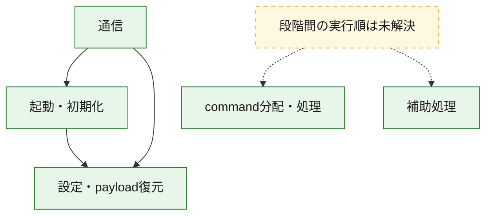
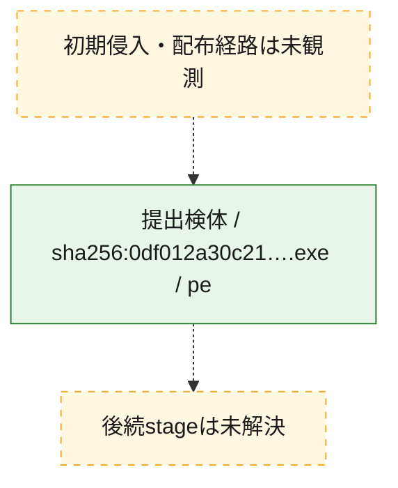
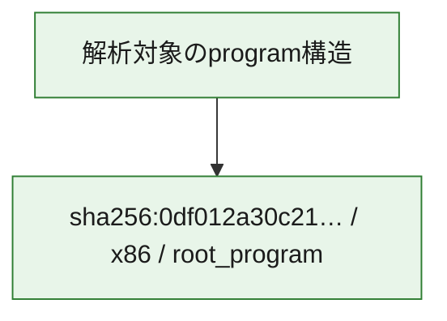

# 全体ロジック：0df012a30c21ca91c41a31ca3a5622d31e890aababc112d96e48552f23775a14

代表関数の静的証跡から、起動・初期化、設定・payload復元、通信、command分配・処理の処理群を確認しました。

## 読み方

- phaseの掲載順は解析上の整理順です。observed_call_edgesがない段階間の実行順を断定しません。
- 図の実線は静的に観測した関係、点線と黄色のノードは未観測・未解決の関係を示します。
- 図は静的な要約であり、動的実行を再現するものではありません。
- 詳細な関数解説とfingerprintは[STATIC-LOGIC.md](STATIC-LOGIC.md)を参照してください。

## 静的可視化

### 実行フロー

### 感染チェーン

### モジュール関係

## 処理段階

### 1. 起動・初期化

entry pointから初期化と後続処理への移行を確認します。
確度: `confirmed_static_function_evidence`

- `0df012a30c21ca91c41a31ca3a5622d31e890aababc112d96e48552f23775a14:ghidra:140009d17` — 初期化と主要処理への分岐を行う入口関数です。 状態: `succeeded`、選定理由: `entry_point`, `meaningful_symbol_name`, `reviewed_call_centrality:7`, `role:entrypoint`
- `0df012a30c21ca91c41a31ca3a5622d31e890aababc112d96e48552f23775a14:ghidra:1400100c4` — 初期化と主要処理への分岐を行う入口関数です。 状態: `succeeded`、選定理由: `entry_point`, `meaningful_symbol_name`, `probable_go_main_user_code`, `reviewed_call_centrality:23`, `role:entrypoint`

### 2. 設定・payload復元

設定、resource、payload、暗号化データの復元・変換を確認します。
確度: `confirmed_static_function_evidence`

- `0df012a30c21ca91c41a31ca3a5622d31e890aababc112d96e48552f23775a14:ghidra:1400016e1` — 設定、resource、payloadなどの解析・変換を行う関数です。 状態: `succeeded`、選定理由: `meaningful_symbol_name`, `reviewed_call_centrality:1`, `role:config_or_data_transform`
- `0df012a30c21ca91c41a31ca3a5622d31e890aababc112d96e48552f23775a14:ghidra:140001c94` — 設定、resource、payloadなどの解析・変換を行う関数です。 状態: `succeeded`、選定理由: `meaningful_symbol_name`, `reviewed_call_centrality:1`, `role:config_or_data_transform`
- `0df012a30c21ca91c41a31ca3a5622d31e890aababc112d96e48552f23775a14:ghidra:1400022ae` — 暗号、hash、encoding、または復号処理に関係する関数です。 状態: `succeeded`、選定理由: `meaningful_symbol_name`, `reviewed_call_centrality:4`, `role:cryptographic_transform`
- `0df012a30c21ca91c41a31ca3a5622d31e890aababc112d96e48552f23775a14:ghidra:140002ecc` — 暗号、hash、encoding、または復号処理に関係する関数です。 状態: `succeeded`、選定理由: `meaningful_symbol_name`, `reviewed_call_centrality:4`, `role:cryptographic_transform`
- `0df012a30c21ca91c41a31ca3a5622d31e890aababc112d96e48552f23775a14:ghidra:140002fb6` — 暗号、hash、encoding、または復号処理に関係する関数です。 状態: `succeeded`、選定理由: `meaningful_symbol_name`, `reviewed_call_centrality:12`, `role:cryptographic_transform`
- `0df012a30c21ca91c41a31ca3a5622d31e890aababc112d96e48552f23775a14:ghidra:1400031e9` — 設定、resource、payloadなどの解析・変換を行う関数です。 状態: `succeeded`、選定理由: `meaningful_symbol_name`, `reviewed_call_centrality:13`, `role:config_or_data_transform`
- `0df012a30c21ca91c41a31ca3a5622d31e890aababc112d96e48552f23775a14:ghidra:140003c95` — 設定、resource、payloadなどの解析・変換を行う関数です。 状態: `succeeded`、選定理由: `meaningful_symbol_name`, `reviewed_call_centrality:1`, `role:config_or_data_transform`
- `0df012a30c21ca91c41a31ca3a5622d31e890aababc112d96e48552f23775a14:ghidra:140005261` — 設定、resource、payloadなどの解析・変換を行う関数です。 状態: `succeeded`、選定理由: `meaningful_symbol_name`, `reviewed_call_centrality:2`, `role:config_or_data_transform`
- `0df012a30c21ca91c41a31ca3a5622d31e890aababc112d96e48552f23775a14:ghidra:140005dfb` — 暗号、hash、encoding、または復号処理に関係する関数です。 状態: `succeeded`、選定理由: `meaningful_symbol_name`, `reviewed_call_centrality:2`, `role:cryptographic_transform`
- `0df012a30c21ca91c41a31ca3a5622d31e890aababc112d96e48552f23775a14:ghidra:140005f7d` — 設定、resource、payloadなどの解析・変換を行う関数です。 状態: `succeeded`、選定理由: `meaningful_symbol_name`, `reviewed_call_centrality:12`, `role:config_or_data_transform`
- `0df012a30c21ca91c41a31ca3a5622d31e890aababc112d96e48552f23775a14:ghidra:1400064c3` — 設定、resource、payloadなどの解析・変換を行う関数です。 状態: `succeeded`、選定理由: `meaningful_symbol_name`, `reviewed_call_centrality:9`, `role:config_or_data_transform`
- `0df012a30c21ca91c41a31ca3a5622d31e890aababc112d96e48552f23775a14:ghidra:140008467` — 設定、resource、payloadなどの解析・変換を行う関数です。 状態: `succeeded`、選定理由: `meaningful_symbol_name`, `reviewed_call_centrality:1`, `role:config_or_data_transform`
- `0df012a30c21ca91c41a31ca3a5622d31e890aababc112d96e48552f23775a14:ghidra:14000a8ca` — 設定、resource、payloadなどの解析・変換を行う関数です。 状態: `succeeded`、選定理由: `meaningful_symbol_name`, `reviewed_call_centrality:7`, `role:config_or_data_transform`

### 3. 通信

通信初期化、endpoint処理、送受信の役割を確認します。
確度: `confirmed_static_function_evidence`

- `0df012a30c21ca91c41a31ca3a5622d31e890aababc112d96e48552f23775a14:ghidra:140005b93` — 通信初期化、送受信、またはendpoint処理に関係する関数です。 状態: `succeeded`、選定理由: `meaningful_symbol_name`, `reviewed_call_centrality:3`, `role:network_communication`
- `0df012a30c21ca91c41a31ca3a5622d31e890aababc112d96e48552f23775a14:ghidra:140006a82` — 通信初期化、送受信、またはendpoint処理に関係する関数です。 状態: `succeeded`、選定理由: `meaningful_symbol_name`, `reviewed_call_centrality:3`, `role:network_communication`
- `0df012a30c21ca91c41a31ca3a5622d31e890aababc112d96e48552f23775a14:ghidra:14000782e` — 通信初期化、送受信、またはendpoint処理に関係する関数です。 状態: `succeeded`、選定理由: `meaningful_symbol_name`, `reviewed_call_centrality:3`, `role:network_communication`
- `0df012a30c21ca91c41a31ca3a5622d31e890aababc112d96e48552f23775a14:ghidra:140009259` — 通信初期化、送受信、またはendpoint処理に関係する関数です。 状態: `succeeded`、選定理由: `meaningful_symbol_name`, `reviewed_call_centrality:20`, `role:network_communication`
- `0df012a30c21ca91c41a31ca3a5622d31e890aababc112d96e48552f23775a14:ghidra:140009499` — 通信初期化、送受信、またはendpoint処理に関係する関数です。 状態: `succeeded`、選定理由: `meaningful_symbol_name`, `reviewed_call_centrality:5`, `role:network_communication`
- `0df012a30c21ca91c41a31ca3a5622d31e890aababc112d96e48552f23775a14:ghidra:1400097f6` — 通信初期化、送受信、またはendpoint処理に関係する関数です。 状態: `succeeded`、選定理由: `meaningful_symbol_name`, `reviewed_call_centrality:3`, `role:network_communication`
- `0df012a30c21ca91c41a31ca3a5622d31e890aababc112d96e48552f23775a14:ghidra:140009855` — 通信初期化、送受信、またはendpoint処理に関係する関数です。 状態: `succeeded`、選定理由: `meaningful_symbol_name`, `reviewed_call_centrality:4`, `role:network_communication`
- `0df012a30c21ca91c41a31ca3a5622d31e890aababc112d96e48552f23775a14:ghidra:140009991` — 通信初期化、送受信、またはendpoint処理に関係する関数です。 状態: `succeeded`、選定理由: `meaningful_symbol_name`, `reviewed_call_centrality:9`, `role:network_communication`
- `0df012a30c21ca91c41a31ca3a5622d31e890aababc112d96e48552f23775a14:ghidra:14000a105` — 通信初期化、送受信、またはendpoint処理に関係する関数です。 状態: `succeeded`、選定理由: `meaningful_symbol_name`, `reviewed_call_centrality:3`, `role:network_communication`
- `0df012a30c21ca91c41a31ca3a5622d31e890aababc112d96e48552f23775a14:ghidra:14000a1f9` — 通信初期化、送受信、またはendpoint処理に関係する関数です。 状態: `succeeded`、選定理由: `meaningful_symbol_name`, `reviewed_call_centrality:15`, `role:network_communication`
- `0df012a30c21ca91c41a31ca3a5622d31e890aababc112d96e48552f23775a14:ghidra:14000b767` — 通信初期化、送受信、またはendpoint処理に関係する関数です。 状態: `succeeded`、選定理由: `meaningful_symbol_name`, `reviewed_call_centrality:11`, `role:network_communication`

### 4. command分配・処理

受信commandやtaskの解釈、分配、個別handlerへの移行を確認します。
確度: `confirmed_static_function_evidence`

- `0df012a30c21ca91c41a31ca3a5622d31e890aababc112d96e48552f23775a14:ghidra:14000b0a9` — commandの解釈、分配、または個別処理を担当する関数です。 状態: `succeeded`、選定理由: `meaningful_symbol_name`, `reviewed_call_centrality:5`, `role:command_dispatch_or_handler`
- `0df012a30c21ca91c41a31ca3a5622d31e890aababc112d96e48552f23775a14:ghidra:14000b924` — commandの解釈、分配、または個別処理を担当する関数です。 状態: `succeeded`、選定理由: `meaningful_symbol_name`, `reviewed_call_centrality:5`, `role:command_dispatch_or_handler`
- `0df012a30c21ca91c41a31ca3a5622d31e890aababc112d96e48552f23775a14:ghidra:14000bd2b` — commandの解釈、分配、または個別処理を担当する関数です。 状態: `succeeded`、選定理由: `meaningful_symbol_name`, `reviewed_call_centrality:7`, `role:command_dispatch_or_handler`

### 5. 補助処理

主要処理を支える一般内部関数またはlibrary処理を確認します。
確度: `confirmed_static_function_evidence`

- `0df012a30c21ca91c41a31ca3a5622d31e890aababc112d96e48552f23775a14:ghidra:140001410` — 検体内部の一般処理を実装する関数です。 状態: `succeeded`、選定理由: `entry_point`, `meaningful_symbol_name`, `reviewed_call_centrality:1`
- `0df012a30c21ca91c41a31ca3a5622d31e890aababc112d96e48552f23775a14:ghidra:140010860` — compiler生成処理または汎用library処理とみられる関数です。 状態: `succeeded`、選定理由: `entry_point`, `meaningful_symbol_name`, `reviewed_call_centrality:1`
- `0df012a30c21ca91c41a31ca3a5622d31e890aababc112d96e48552f23775a14:ghidra:140010890` — compiler生成処理または汎用library処理とみられる関数です。 状態: `succeeded`、選定理由: `entry_point`, `meaningful_symbol_name`, `reviewed_call_centrality:2`

## 観測したcall関係

- `0df012a30c21ca91c41a31ca3a5622d31e890aababc112d96e48552f23775a14:ghidra:140002fb6` → `0df012a30c21ca91c41a31ca3a5622d31e890aababc112d96e48552f23775a14:ghidra:140002ecc` （`configuration` → `configuration`）
- `0df012a30c21ca91c41a31ca3a5622d31e890aababc112d96e48552f23775a14:ghidra:1400031e9` → `0df012a30c21ca91c41a31ca3a5622d31e890aababc112d96e48552f23775a14:ghidra:140002ecc` （`configuration` → `configuration`）
- `0df012a30c21ca91c41a31ca3a5622d31e890aababc112d96e48552f23775a14:ghidra:140005dfb` → `0df012a30c21ca91c41a31ca3a5622d31e890aababc112d96e48552f23775a14:ghidra:1400022ae` （`configuration` → `configuration`）
- `0df012a30c21ca91c41a31ca3a5622d31e890aababc112d96e48552f23775a14:ghidra:1400064c3` → `0df012a30c21ca91c41a31ca3a5622d31e890aababc112d96e48552f23775a14:ghidra:1400031e9` （`configuration` → `configuration`）
- `0df012a30c21ca91c41a31ca3a5622d31e890aababc112d96e48552f23775a14:ghidra:1400064c3` → `0df012a30c21ca91c41a31ca3a5622d31e890aababc112d96e48552f23775a14:ghidra:140005f7d` （`configuration` → `configuration`）
- `0df012a30c21ca91c41a31ca3a5622d31e890aababc112d96e48552f23775a14:ghidra:140006a82` → `0df012a30c21ca91c41a31ca3a5622d31e890aababc112d96e48552f23775a14:ghidra:140005b93` （`communication` → `communication`）
- `0df012a30c21ca91c41a31ca3a5622d31e890aababc112d96e48552f23775a14:ghidra:140009499` → `0df012a30c21ca91c41a31ca3a5622d31e890aababc112d96e48552f23775a14:ghidra:140009259` （`communication` → `communication`）
- `0df012a30c21ca91c41a31ca3a5622d31e890aababc112d96e48552f23775a14:ghidra:140009991` → `0df012a30c21ca91c41a31ca3a5622d31e890aababc112d96e48552f23775a14:ghidra:140002fb6` （`communication` → `configuration`）
- `0df012a30c21ca91c41a31ca3a5622d31e890aababc112d96e48552f23775a14:ghidra:140009991` → `0df012a30c21ca91c41a31ca3a5622d31e890aababc112d96e48552f23775a14:ghidra:1400097f6` （`communication` → `communication`）
- `0df012a30c21ca91c41a31ca3a5622d31e890aababc112d96e48552f23775a14:ghidra:14000a1f9` → `0df012a30c21ca91c41a31ca3a5622d31e890aababc112d96e48552f23775a14:ghidra:140009d17` （`communication` → `startup`）
- `0df012a30c21ca91c41a31ca3a5622d31e890aababc112d96e48552f23775a14:ghidra:14000a1f9` → `0df012a30c21ca91c41a31ca3a5622d31e890aababc112d96e48552f23775a14:ghidra:14000a105` （`communication` → `communication`）
- `0df012a30c21ca91c41a31ca3a5622d31e890aababc112d96e48552f23775a14:ghidra:14000b767` → `0df012a30c21ca91c41a31ca3a5622d31e890aababc112d96e48552f23775a14:ghidra:14000a1f9` （`communication` → `communication`）
- `0df012a30c21ca91c41a31ca3a5622d31e890aababc112d96e48552f23775a14:ghidra:1400100c4` → `0df012a30c21ca91c41a31ca3a5622d31e890aababc112d96e48552f23775a14:ghidra:1400064c3` （`startup` → `configuration`）
- `ghidra-function:0e0154577af0a0a23ea2ad47` → `ghidra-function:27b8e885f8a6b9ff4c29d6bb` （`unclassified` → `unclassified`）
- `ghidra-function:0e0154577af0a0a23ea2ad47` → `ghidra-function:52bdc6e639a2573651d9825c` （`unclassified` → `unclassified`）
- `ghidra-function:0e0154577af0a0a23ea2ad47` → `ghidra-function:5d1f60c094814ab5ac182c2d` （`unclassified` → `unclassified`）
- `ghidra-function:0e0154577af0a0a23ea2ad47` → `ghidra-function:71aa084697f7d53c42149e6a` （`unclassified` → `unclassified`）
- `ghidra-function:0e0154577af0a0a23ea2ad47` → `ghidra-function:9cd46a0370095b52a318368e` （`unclassified` → `unclassified`）
- `ghidra-function:0e0154577af0a0a23ea2ad47` → `ghidra-function:a5dbfa0faa224c690a737b67` （`unclassified` → `unclassified`）
- `ghidra-function:0e0154577af0a0a23ea2ad47` → `ghidra-function:c27f23dd735531fd4118c781` （`unclassified` → `unclassified`）
- `ghidra-function:0e0154577af0a0a23ea2ad47` → `ghidra-function:d5def8ca5766c74b37affb8d` （`unclassified` → `unclassified`）
- `ghidra-function:0e0154577af0a0a23ea2ad47` → `ghidra-function:d9afb99f9e003078d0feb193` （`unclassified` → `unclassified`）
- `ghidra-function:0e0154577af0a0a23ea2ad47` → `ghidra-function:f4ebb262b4ed0cc4481b7bd6` （`unclassified` → `unclassified`）
- `ghidra-function:0e0154577af0a0a23ea2ad47` → `ghidra-function:f7f843089b6426ff7f894705` （`unclassified` → `unclassified`）
- `ghidra-function:1523eccfae540449ecfa1349` → `ghidra-external:8490ab3aed3eea0f690bee8b` （`unclassified` → `unclassified`）
- `ghidra-function:1523eccfae540449ecfa1349` → `ghidra-external:b03a71c358a521cdf735ee0c` （`unclassified` → `unclassified`）
- `ghidra-function:17093be56512471484530ae7` → `ghidra-external:0faadeec13fe9b63036b4a23` （`unclassified` → `unclassified`）
- `ghidra-function:17093be56512471484530ae7` → `ghidra-external:2bfc916dcd30eccedc40f6de` （`unclassified` → `unclassified`）
- `ghidra-function:17093be56512471484530ae7` → `ghidra-external:5b405f495ed322fe9f3cc371` （`unclassified` → `unclassified`）
- `ghidra-function:17093be56512471484530ae7` → `ghidra-external:eadcd73c41d14d194480b157` （`unclassified` → `unclassified`）
- `ghidra-function:17093be56512471484530ae7` → `ghidra-function:934260af9fa21be216d46002` （`unclassified` → `unclassified`）
- `ghidra-function:17093be56512471484530ae7` → `ghidra-function:a39e7a406506b6de5e383fb6` （`unclassified` → `unclassified`）
- `ghidra-function:19755f7c8df417c69001a4a2` → `ghidra-external:172ec2beff852826b11bec7a` （`unclassified` → `unclassified`）
- `ghidra-function:19755f7c8df417c69001a4a2` → `ghidra-external:91de3edfd688ef8f4ed5f084` （`unclassified` → `unclassified`）
- `ghidra-function:19755f7c8df417c69001a4a2` → `ghidra-external:afc8ffdc82f05c5d0ad751ff` （`unclassified` → `unclassified`）
- `ghidra-function:19755f7c8df417c69001a4a2` → `ghidra-external:f0e00352ebed44d7554bb6c5` （`unclassified` → `unclassified`）
- `ghidra-function:19755f7c8df417c69001a4a2` → `ghidra-function:04bd6a168cb81fc6c851a8de` （`unclassified` → `unclassified`）
- `ghidra-function:19755f7c8df417c69001a4a2` → `ghidra-function:0c7ed105d0b86d8c16b26c5f` （`unclassified` → `unclassified`）
- `ghidra-function:19755f7c8df417c69001a4a2` → `ghidra-function:14878d0a478bafa401189959` （`unclassified` → `unclassified`）
- `ghidra-function:19755f7c8df417c69001a4a2` → `ghidra-function:62028007e5b503689650ebde` （`unclassified` → `unclassified`）
- `ghidra-function:19755f7c8df417c69001a4a2` → `ghidra-function:65555ec62fd72f2bf9872ef2` （`unclassified` → `unclassified`）
- `ghidra-function:19755f7c8df417c69001a4a2` → `ghidra-function:6dad521de95b474028880d74` （`unclassified` → `unclassified`）
- `ghidra-function:19755f7c8df417c69001a4a2` → `ghidra-function:76997b2aadc98f44a91a8458` （`unclassified` → `unclassified`）
- `ghidra-function:19755f7c8df417c69001a4a2` → `ghidra-function:8368e73dd0ad1091ae91e0f5` （`unclassified` → `unclassified`）
- `ghidra-function:19755f7c8df417c69001a4a2` → `ghidra-function:9ec572295976b6584a28fd8b` （`unclassified` → `unclassified`）
- `ghidra-function:19755f7c8df417c69001a4a2` → `ghidra-function:a1aed192b3f6639e10f3bb60` （`unclassified` → `unclassified`）
- `ghidra-function:19755f7c8df417c69001a4a2` → `ghidra-function:a5dbfa0faa224c690a737b67` （`unclassified` → `unclassified`）
- `ghidra-function:19755f7c8df417c69001a4a2` → `ghidra-function:a8acc4b92f53d7cc18c6b70f` （`unclassified` → `unclassified`）
- `ghidra-function:19755f7c8df417c69001a4a2` → `ghidra-function:afc8a6302387530c72951f8a` （`unclassified` → `unclassified`）
- `ghidra-function:19755f7c8df417c69001a4a2` → `ghidra-function:bb22863ee9f83bfd3fb96f50` （`unclassified` → `unclassified`）
- `ghidra-function:19755f7c8df417c69001a4a2` → `ghidra-function:f0ea42d1ec1a95701b86b25f` （`unclassified` → `unclassified`）
- `ghidra-function:19755f7c8df417c69001a4a2` → `ghidra-function:fc4a55276df06ddb431330e1` （`unclassified` → `unclassified`）
- `ghidra-function:284482f5b348d77919a7e201` → `ghidra-external:4e9498249e57abc8bb6bcead` （`unclassified` → `unclassified`）
- `ghidra-function:284482f5b348d77919a7e201` → `ghidra-function:689489412021e34371fa83f9` （`unclassified` → `unclassified`）
- `ghidra-function:29126d5bcef1689c37110979` → `ghidra-function:1b9953952335971432053caa` （`unclassified` → `unclassified`）
- `ghidra-function:29126d5bcef1689c37110979` → `ghidra-function:70b82b898caadebb48f3b4b4` （`unclassified` → `unclassified`）
- `ghidra-function:32f4ed80808692556ac9fd26` → `ghidra-function:1d5bdfa09e55a76009e3fc05` （`unclassified` → `unclassified`）
- `ghidra-function:33dc4df42e76462cb99c087d` → `ghidra-external:4cbc05fd9a08a50c76e1ce3a` （`unclassified` → `unclassified`）
- `ghidra-function:33dc4df42e76462cb99c087d` → `ghidra-external:78b35eb030c048bc1fc916df` （`unclassified` → `unclassified`）
- `ghidra-function:33dc4df42e76462cb99c087d` → `ghidra-external:9c809fd62b6645eb990c5bcc` （`unclassified` → `unclassified`）
- `ghidra-function:33dc4df42e76462cb99c087d` → `ghidra-external:b4073bb68ead2ecbc88ce825` （`unclassified` → `unclassified`）
- `ghidra-function:33dc4df42e76462cb99c087d` → `ghidra-external:bc40fde29358ca97aa4ef911` （`unclassified` → `unclassified`）
- `ghidra-function:33dc4df42e76462cb99c087d` → `ghidra-function:099e3134e620fdc6f30d4799` （`unclassified` → `unclassified`）
- `ghidra-function:33dc4df42e76462cb99c087d` → `ghidra-function:0c7ed105d0b86d8c16b26c5f` （`unclassified` → `unclassified`）
- `ghidra-function:33dc4df42e76462cb99c087d` → `ghidra-function:22ded7b1a716e301be51078a` （`unclassified` → `unclassified`）
- `ghidra-function:33dc4df42e76462cb99c087d` → `ghidra-function:5266d2edc4cf7bbea02db2a4` （`unclassified` → `unclassified`）
- `ghidra-function:33dc4df42e76462cb99c087d` → `ghidra-function:6217bee728ed8029fd768932` （`unclassified` → `unclassified`）
- `ghidra-function:33dc4df42e76462cb99c087d` → `ghidra-function:c59d82efa71a69ed328c95ef` （`unclassified` → `unclassified`）
- `ghidra-function:3928de9dbefc9612b31bc2cf` → `ghidra-external:b03a71c358a521cdf735ee0c` （`unclassified` → `unclassified`）
- `ghidra-function:3928de9dbefc9612b31bc2cf` → `ghidra-function:1446e4bfec83fc530dc26295` （`unclassified` → `unclassified`）
- `ghidra-function:3928de9dbefc9612b31bc2cf` → `ghidra-function:33dc4df42e76462cb99c087d` （`unclassified` → `unclassified`）
- `ghidra-function:3928de9dbefc9612b31bc2cf` → `ghidra-function:9cd46a0370095b52a318368e` （`unclassified` → `unclassified`）
- `ghidra-function:3928de9dbefc9612b31bc2cf` → `ghidra-function:a0f78b048034fafc9cbe3cb3` （`unclassified` → `unclassified`）
- `ghidra-function:3928de9dbefc9612b31bc2cf` → `ghidra-function:a5dbfa0faa224c690a737b67` （`unclassified` → `unclassified`）
- `ghidra-function:3928de9dbefc9612b31bc2cf` → `ghidra-function:c700f0f414ef6e3b9a9ed5ee` （`unclassified` → `unclassified`）
- `ghidra-function:3928de9dbefc9612b31bc2cf` → `ghidra-function:d9afb99f9e003078d0feb193` （`unclassified` → `unclassified`）
- `ghidra-function:3928de9dbefc9612b31bc2cf` → `ghidra-function:f7f843089b6426ff7f894705` （`unclassified` → `unclassified`）
- `ghidra-function:51319c1f070ea897d562ae06` → `ghidra-external:0faadeec13fe9b63036b4a23` （`unclassified` → `unclassified`）
- `ghidra-function:51319c1f070ea897d562ae06` → `ghidra-external:757becc895d42bd6622e37f6` （`unclassified` → `unclassified`）
- `ghidra-function:51319c1f070ea897d562ae06` → `ghidra-external:91de3edfd688ef8f4ed5f084` （`unclassified` → `unclassified`）
- `ghidra-function:51319c1f070ea897d562ae06` → `ghidra-external:afc8ffdc82f05c5d0ad751ff` （`unclassified` → `unclassified`）
- `ghidra-function:51319c1f070ea897d562ae06` → `ghidra-external:f0e00352ebed44d7554bb6c5` （`unclassified` → `unclassified`）
- `ghidra-function:51319c1f070ea897d562ae06` → `ghidra-function:2a0949b3d4432e1506543d82` （`unclassified` → `unclassified`）
- `ghidra-function:51319c1f070ea897d562ae06` → `ghidra-function:3fe24472f768500e3ca8d887` （`unclassified` → `unclassified`）
- `ghidra-function:51319c1f070ea897d562ae06` → `ghidra-function:7eea7986d6f61f24cba0a88a` （`unclassified` → `unclassified`）
- `ghidra-function:51319c1f070ea897d562ae06` → `ghidra-function:9be68861d38e4b346bd8df77` （`unclassified` → `unclassified`）
- `ghidra-function:51319c1f070ea897d562ae06` → `ghidra-function:ac932794f9c8d1afe6bba93a` （`unclassified` → `unclassified`）
- `ghidra-function:51319c1f070ea897d562ae06` → `ghidra-function:efb97f144e2a06e7864736ac` （`unclassified` → `unclassified`）
- `ghidra-function:52b68ec490caecbb6066d5d0` → `ghidra-external:1f4bae832ab15b72e4b34abe` （`unclassified` → `unclassified`）
- `ghidra-function:55fe4dbb25b9b63b8771a115` → `ghidra-external:019a5950bdcef27309a96d74` （`unclassified` → `unclassified`）
- `ghidra-function:55fe4dbb25b9b63b8771a115` → `ghidra-external:0faadeec13fe9b63036b4a23` （`unclassified` → `unclassified`）
- `ghidra-function:55fe4dbb25b9b63b8771a115` → `ghidra-external:1f4bae832ab15b72e4b34abe` （`unclassified` → `unclassified`）
- `ghidra-function:55fe4dbb25b9b63b8771a115` → `ghidra-external:3a43cb25f618c42dd11df5f8` （`unclassified` → `unclassified`）
- `ghidra-function:55fe4dbb25b9b63b8771a115` → `ghidra-external:46ca51c03d6b653f5404d22c` （`unclassified` → `unclassified`）
- `ghidra-function:55fe4dbb25b9b63b8771a115` → `ghidra-external:4f0071a5d2cba0869db61e3e` （`unclassified` → `unclassified`）
- `ghidra-function:55fe4dbb25b9b63b8771a115` → `ghidra-external:afc8ffdc82f05c5d0ad751ff` （`unclassified` → `unclassified`）
- `ghidra-function:560175a7fdbbd0c101f6712a` → `ghidra-external:0faadeec13fe9b63036b4a23` （`unclassified` → `unclassified`）
- `ghidra-function:560175a7fdbbd0c101f6712a` → `ghidra-external:757becc895d42bd6622e37f6` （`unclassified` → `unclassified`）
- `ghidra-function:560175a7fdbbd0c101f6712a` → `ghidra-function:7eea7986d6f61f24cba0a88a` （`unclassified` → `unclassified`）
- `ghidra-function:560175a7fdbbd0c101f6712a` → `ghidra-function:ac932794f9c8d1afe6bba93a` （`unclassified` → `unclassified`）
- `ghidra-function:560175a7fdbbd0c101f6712a` → `ghidra-function:efb97f144e2a06e7864736ac` （`unclassified` → `unclassified`）
- `ghidra-function:62028007e5b503689650ebde` → `ghidra-external:8490ab3aed3eea0f690bee8b` （`unclassified` → `unclassified`）
- `ghidra-function:62028007e5b503689650ebde` → `ghidra-external:afc8ffdc82f05c5d0ad751ff` （`unclassified` → `unclassified`）
- `ghidra-function:62028007e5b503689650ebde` → `ghidra-external:b03a71c358a521cdf735ee0c` （`unclassified` → `unclassified`）
- `ghidra-function:62028007e5b503689650ebde` → `ghidra-function:4671cf47cb93595b4faa2a97` （`unclassified` → `unclassified`）
- `ghidra-function:62028007e5b503689650ebde` → `ghidra-function:51319c1f070ea897d562ae06` （`unclassified` → `unclassified`）
- `ghidra-function:62028007e5b503689650ebde` → `ghidra-function:9e03ab5ff007e7a717281cdb` （`unclassified` → `unclassified`）
- `ghidra-function:62028007e5b503689650ebde` → `ghidra-function:ec20d83cefc599794cd094bf` （`unclassified` → `unclassified`）
- `ghidra-function:6217bee728ed8029fd768932` → `ghidra-function:099e3134e620fdc6f30d4799` （`unclassified` → `unclassified`）
- `ghidra-function:6217bee728ed8029fd768932` → `ghidra-function:5266d2edc4cf7bbea02db2a4` （`unclassified` → `unclassified`）
- `ghidra-function:70b82b898caadebb48f3b4b4` → `ghidra-function:bc534e204603580b9d6ebd5a` （`unclassified` → `unclassified`）
- `ghidra-function:70b82b898caadebb48f3b4b4` → `ghidra-function:dbca9cb6430b63070a6da617` （`unclassified` → `unclassified`）
- `ghidra-function:70b82b898caadebb48f3b4b4` → `ghidra-function:f0546e14be3a1d1209d586ea` （`unclassified` → `unclassified`）
- `ghidra-function:71aa084697f7d53c42149e6a` → `ghidra-external:0faadeec13fe9b63036b4a23` （`unclassified` → `unclassified`）
- `ghidra-function:71aa084697f7d53c42149e6a` → `ghidra-external:4cbc05fd9a08a50c76e1ce3a` （`unclassified` → `unclassified`）
- `ghidra-function:71aa084697f7d53c42149e6a` → `ghidra-external:64368e7074bc4e423228ba14` （`unclassified` → `unclassified`）
- `ghidra-function:71aa084697f7d53c42149e6a` → `ghidra-external:82455b592c6b0c92daefd3e4` （`unclassified` → `unclassified`）
- `ghidra-function:71aa084697f7d53c42149e6a` → `ghidra-external:afc8ffdc82f05c5d0ad751ff` （`unclassified` → `unclassified`）
- `ghidra-function:71aa084697f7d53c42149e6a` → `ghidra-external:b03a71c358a521cdf735ee0c` （`unclassified` → `unclassified`）
- `ghidra-function:71aa084697f7d53c42149e6a` → `ghidra-external:b905ec88a422a47d011db1ad` （`unclassified` → `unclassified`）
- `ghidra-function:71aa084697f7d53c42149e6a` → `ghidra-external:ccd2b60cc9a93d9a631b76db` （`unclassified` → `unclassified`）
- `ghidra-function:71aa084697f7d53c42149e6a` → `ghidra-function:1523eccfae540449ecfa1349` （`unclassified` → `unclassified`）
- `ghidra-function:71aa084697f7d53c42149e6a` → `ghidra-function:17093be56512471484530ae7` （`unclassified` → `unclassified`）
- `ghidra-function:71aa084697f7d53c42149e6a` → `ghidra-function:1b9ff7e29e76bfd4efbb9e1b` （`unclassified` → `unclassified`）
- `ghidra-function:71aa084697f7d53c42149e6a` → `ghidra-function:8ff8b2856c768f1473a8df8a` （`unclassified` → `unclassified`）
- `ghidra-function:71aa084697f7d53c42149e6a` → `ghidra-function:ec20d83cefc599794cd094bf` （`unclassified` → `unclassified`）
- `ghidra-function:75a029188603bd77ca30c61c` → `ghidra-external:91de3edfd688ef8f4ed5f084` （`unclassified` → `unclassified`）
- `ghidra-function:75a029188603bd77ca30c61c` → `ghidra-function:4b7e16b937b68080444c5283` （`unclassified` → `unclassified`）
- `ghidra-function:75a029188603bd77ca30c61c` → `ghidra-function:8bd26419b53817b8f6ccefe4` （`unclassified` → `unclassified`）
- `ghidra-function:8bd26419b53817b8f6ccefe4` → `ghidra-function:6e250c8a7908409495ca3ad1` （`unclassified` → `unclassified`）
- `ghidra-function:8bd26419b53817b8f6ccefe4` → `ghidra-function:d786716e81cb4a19da3170ae` （`unclassified` → `unclassified`）
- `ghidra-function:9e03ab5ff007e7a717281cdb` → `ghidra-external:0faadeec13fe9b63036b4a23` （`unclassified` → `unclassified`）
- `ghidra-function:9e03ab5ff007e7a717281cdb` → `ghidra-external:4cbc05fd9a08a50c76e1ce3a` （`unclassified` → `unclassified`）
- `ghidra-function:9e03ab5ff007e7a717281cdb` → `ghidra-external:78b35eb030c048bc1fc916df` （`unclassified` → `unclassified`）
- `ghidra-function:9e03ab5ff007e7a717281cdb` → `ghidra-external:9c809fd62b6645eb990c5bcc` （`unclassified` → `unclassified`）
- `ghidra-function:9e03ab5ff007e7a717281cdb` → `ghidra-external:b4073bb68ead2ecbc88ce825` （`unclassified` → `unclassified`）
- `ghidra-function:9e03ab5ff007e7a717281cdb` → `ghidra-external:bc40fde29358ca97aa4ef911` （`unclassified` → `unclassified`）
- `ghidra-function:9e03ab5ff007e7a717281cdb` → `ghidra-external:e41e3ac2b064db482b56f43a` （`unclassified` → `unclassified`）
- `ghidra-function:9e03ab5ff007e7a717281cdb` → `ghidra-function:099e3134e620fdc6f30d4799` （`unclassified` → `unclassified`）
- `ghidra-function:9e03ab5ff007e7a717281cdb` → `ghidra-function:22ded7b1a716e301be51078a` （`unclassified` → `unclassified`）
- `ghidra-function:9e03ab5ff007e7a717281cdb` → `ghidra-function:5266d2edc4cf7bbea02db2a4` （`unclassified` → `unclassified`）
- `ghidra-function:9e03ab5ff007e7a717281cdb` → `ghidra-function:6217bee728ed8029fd768932` （`unclassified` → `unclassified`）
- `ghidra-function:9e03ab5ff007e7a717281cdb` → `ghidra-function:c59d82efa71a69ed328c95ef` （`unclassified` → `unclassified`）
- `ghidra-function:9ebe1c60e89cc75dfe176122` → `ghidra-function:5f257c895c81878003c6001e` （`unclassified` → `unclassified`）
- `ghidra-function:a0283131fddf088cc59966ca` → `ghidra-external:0faadeec13fe9b63036b4a23` （`unclassified` → `unclassified`）
- `ghidra-function:a0283131fddf088cc59966ca` → `ghidra-external:5b405f495ed322fe9f3cc371` （`unclassified` → `unclassified`）
- `ghidra-function:a0efc85e7cc1adbb6f8ef819` → `ghidra-external:afc8ffdc82f05c5d0ad751ff` （`unclassified` → `unclassified`）
- `ghidra-function:a0efc85e7cc1adbb6f8ef819` → `ghidra-function:4671cf47cb93595b4faa2a97` （`unclassified` → `unclassified`）
- `ghidra-function:a0efc85e7cc1adbb6f8ef819` → `ghidra-function:ec20d83cefc599794cd094bf` （`unclassified` → `unclassified`）
- `ghidra-function:a0efc85e7cc1adbb6f8ef819` → `ghidra-function:f2380fe1048336881b2f7c1b` （`unclassified` → `unclassified`）
- `ghidra-function:a0f78b048034fafc9cbe3cb3` → `ghidra-external:c0ea0f77b2dd412bee811d2a` （`unclassified` → `unclassified`）
- `ghidra-function:a0f78b048034fafc9cbe3cb3` → `ghidra-function:7afbcbd34b13589682ddd16a` （`unclassified` → `unclassified`）
- `ghidra-function:a56ce6d94e4d325761092790` → `ghidra-external:0faadeec13fe9b63036b4a23` （`unclassified` → `unclassified`）
- `ghidra-function:a56ce6d94e4d325761092790` → `ghidra-external:4cbc05fd9a08a50c76e1ce3a` （`unclassified` → `unclassified`）
- `ghidra-function:a56ce6d94e4d325761092790` → `ghidra-function:7c543bff59bdb89b1cb6165e` （`unclassified` → `unclassified`）
- `ghidra-function:b6e7747468fdbea666b13750` → `ghidra-function:3a283ecb39b5d0059f9ee10b` （`unclassified` → `unclassified`）
- `ghidra-function:c14df295a46d938628fb17a0` → `ghidra-function:53b68480dfe38f868932dd05` （`unclassified` → `unclassified`）
- `ghidra-function:c6d6884827a955a5ece76c1f` → `ghidra-external:4cbc05fd9a08a50c76e1ce3a` （`unclassified` → `unclassified`）
- `ghidra-function:c6d6884827a955a5ece76c1f` → `ghidra-external:82d2fec590156d600f7eb4a4` （`unclassified` → `unclassified`）
- `ghidra-function:c6d6884827a955a5ece76c1f` → `ghidra-external:b03a71c358a521cdf735ee0c` （`unclassified` → `unclassified`）
- `ghidra-function:c6d6884827a955a5ece76c1f` → `ghidra-function:0a7cb05468cedae9b8279701` （`unclassified` → `unclassified`）
- `ghidra-function:cfab91ee4127ba072c2b6c95` → `ghidra-function:10b2ea327c57c07c48870076` （`unclassified` → `unclassified`）
- `ghidra-function:cfab91ee4127ba072c2b6c95` → `ghidra-function:52bdc6e639a2573651d9825c` （`unclassified` → `unclassified`）
- `ghidra-function:cfab91ee4127ba072c2b6c95` → `ghidra-function:5d1f60c094814ab5ac182c2d` （`unclassified` → `unclassified`）
- `ghidra-function:cfab91ee4127ba072c2b6c95` → `ghidra-function:9cd46a0370095b52a318368e` （`unclassified` → `unclassified`）
- `ghidra-function:cfab91ee4127ba072c2b6c95` → `ghidra-function:a5dbfa0faa224c690a737b67` （`unclassified` → `unclassified`）
- `ghidra-function:cfab91ee4127ba072c2b6c95` → `ghidra-function:d9afb99f9e003078d0feb193` （`unclassified` → `unclassified`）
- `ghidra-function:cfab91ee4127ba072c2b6c95` → `ghidra-function:f7f843089b6426ff7f894705` （`unclassified` → `unclassified`）
- `ghidra-function:d41469981bb199db59f92aa5` → `ghidra-function:689489412021e34371fa83f9` （`unclassified` → `unclassified`）
- `ghidra-function:f2380fe1048336881b2f7c1b` → `ghidra-external:3a43cb25f618c42dd11df5f8` （`unclassified` → `unclassified`）
- `ghidra-function:f2380fe1048336881b2f7c1b` → `ghidra-external:46ca51c03d6b653f5404d22c` （`unclassified` → `unclassified`）
- `ghidra-function:f2380fe1048336881b2f7c1b` → `ghidra-external:65c0855e80593fc3b2c9a953` （`unclassified` → `unclassified`）
- `ghidra-function:f2380fe1048336881b2f7c1b` → `ghidra-external:8490ab3aed3eea0f690bee8b` （`unclassified` → `unclassified`）
- `ghidra-function:f2380fe1048336881b2f7c1b` → `ghidra-external:afc8ffdc82f05c5d0ad751ff` （`unclassified` → `unclassified`）
- `ghidra-function:f2380fe1048336881b2f7c1b` → `ghidra-function:2a52e10f2d283eaf74ee24fc` （`unclassified` → `unclassified`）
- `ghidra-function:f2380fe1048336881b2f7c1b` → `ghidra-function:2b9db6a62b1ff3c0aca36f15` （`unclassified` → `unclassified`）
- `ghidra-function:f2380fe1048336881b2f7c1b` → `ghidra-function:9f61d630b456dca2e8fabdcf` （`unclassified` → `unclassified`）
- `ghidra-function:f2380fe1048336881b2f7c1b` → `ghidra-function:a8ce5234727de25c2fef8e4a` （`unclassified` → `unclassified`）
- `ghidra-function:f2380fe1048336881b2f7c1b` → `ghidra-function:b0df14843f9321e6547881fc` （`unclassified` → `unclassified`）
- `ghidra-function:f2380fe1048336881b2f7c1b` → `ghidra-function:c57fc863c874e77b5adf9a32` （`unclassified` → `unclassified`）
- `ghidra-function:f2380fe1048336881b2f7c1b` → `ghidra-function:e6c1a4907f6437737ba34267` （`unclassified` → `unclassified`）
- `ghidra-function:fc172a16cab539174170185d` → `ghidra-external:0faadeec13fe9b63036b4a23` （`unclassified` → `unclassified`）
- `ghidra-function:fc172a16cab539174170185d` → `ghidra-external:757becc895d42bd6622e37f6` （`unclassified` → `unclassified`）
- `ghidra-function:fc172a16cab539174170185d` → `ghidra-function:7eea7986d6f61f24cba0a88a` （`unclassified` → `unclassified`）
- `ghidra-function:fc172a16cab539174170185d` → `ghidra-function:9be68861d38e4b346bd8df77` （`unclassified` → `unclassified`）
- `ghidra-function:fc172a16cab539174170185d` → `ghidra-function:efb97f144e2a06e7864736ac` （`unclassified` → `unclassified`）

## 解析範囲と制約

- 選定外関数は全体inventoryへ残しますが、関数本体の個別解説対象にはしていません。
- indirect call、難読化、packer、VM、壊れたcontrol flowによりcall関係が欠落する場合があります。
- 文書は静的解析に基づき、検体実行や外部通信による動的確認は行っていません。
