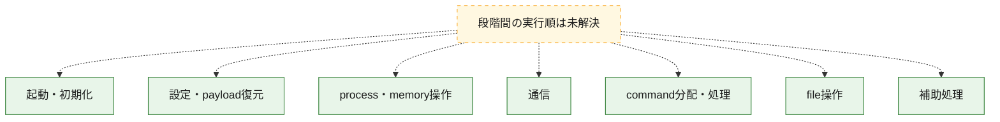
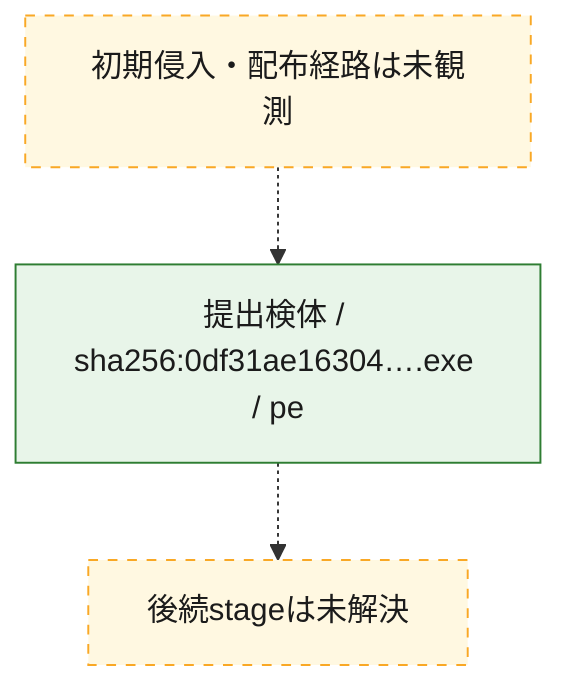
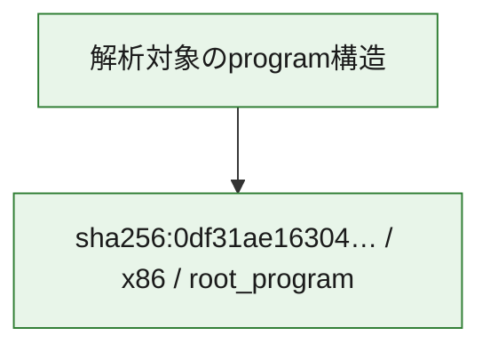

# 全体ロジック：0df31ae16304556ffb96e5c5be3b0f5508223d21e3313d77cdf4e799d80effd7

代表関数の静的証跡から、起動・初期化、設定・payload復元、process・memory操作、通信、command分配・処理、file操作の処理群を確認しました。

## 読み方

- phaseの掲載順は解析上の整理順です。observed_call_edgesがない段階間の実行順を断定しません。
- 図の実線は静的に観測した関係、点線と黄色のノードは未観測・未解決の関係を示します。
- 図は静的な要約であり、動的実行を再現するものではありません。
- 詳細な関数解説とfingerprintは[STATIC-LOGIC.md](STATIC-LOGIC.md)を参照してください。

## 静的可視化

### 実行フロー

### 感染チェーン

### モジュール関係

## 処理段階

### 1. 起動・初期化

entry pointから初期化と後続処理への移行を確認します。
確度: `confirmed_static_function_evidence_with_limits`

- `0df31ae16304556ffb96e5c5be3b0f5508223d21e3313d77cdf4e799d80effd7:ghidra:1400bbc80` — 初期化と主要処理への分岐を行う入口関数です。 状態: `succeeded`、選定理由: `entry_point`, `meaningful_symbol_name`, `probable_go_main_user_code`, `reviewed_call_centrality:5`, `role:entrypoint`
- `0df31ae16304556ffb96e5c5be3b0f5508223d21e3313d77cdf4e799d80effd7:ghidra:1400bbe40` — 初期化と主要処理への分岐を行う入口関数です。 状態: `succeeded`、選定理由: `entry_point`, `meaningful_symbol_name`, `probable_go_main_user_code`, `reviewed_call_centrality:16`, `role:entrypoint`
- `0df31ae16304556ffb96e5c5be3b0f5508223d21e3313d77cdf4e799d80effd7:ghidra:1400be5e0` — 初期化と主要処理への分岐を行う入口関数です。 状態: `succeeded`、選定理由: `entry_point`, `meaningful_symbol_name`, `probable_go_main_user_code`, `reviewed_call_centrality:17`, `role:entrypoint`
- `0df31ae16304556ffb96e5c5be3b0f5508223d21e3313d77cdf4e799d80effd7:ghidra:1400bf9e0` — 初期化と主要処理への分岐を行う入口関数です。 状態: `succeeded`、選定理由: `entry_point`, `meaningful_symbol_name`, `probable_go_main_user_code`, `reviewed_call_centrality:20`, `role:entrypoint`
- `0df31ae16304556ffb96e5c5be3b0f5508223d21e3313d77cdf4e799d80effd7:ghidra:1400c70e0` — 初期化と主要処理への分岐を行う入口関数です。 状態: `succeeded`、選定理由: `entry_point`, `meaningful_symbol_name`, `probable_go_main_user_code`, `reviewed_call_centrality:16`, `role:entrypoint`
- `0df31ae16304556ffb96e5c5be3b0f5508223d21e3313d77cdf4e799d80effd7:ghidra:1400cad00` — 初期化と主要処理への分岐を行う入口関数です。 状態: `succeeded`、選定理由: `entry_point`, `meaningful_symbol_name`, `probable_go_main_user_code`, `reviewed_call_centrality:16`, `role:entrypoint`
- `0df31ae16304556ffb96e5c5be3b0f5508223d21e3313d77cdf4e799d80effd7:ghidra:1400cfca0` — 初期化と主要処理への分岐を行う入口関数です。 状態: `succeeded`、選定理由: `entry_point`, `meaningful_symbol_name`, `probable_go_main_user_code`, `reviewed_call_centrality:18`, `role:entrypoint`
- `0df31ae16304556ffb96e5c5be3b0f5508223d21e3313d77cdf4e799d80effd7:ghidra:1400dd7e0` — 初期化と主要処理への分岐を行う入口関数です。 状態: `succeeded`、選定理由: `entry_point`, `meaningful_symbol_name`, `probable_go_main_user_code`, `reviewed_call_centrality:20`, `role:entrypoint`
- `0df31ae16304556ffb96e5c5be3b0f5508223d21e3313d77cdf4e799d80effd7:ghidra:1400e1560` — 初期化と主要処理への分岐を行う入口関数です。 状態: `succeeded`、選定理由: `entry_point`, `meaningful_symbol_name`, `probable_go_main_user_code`, `reviewed_call_centrality:22`, `role:entrypoint`
- `0df31ae16304556ffb96e5c5be3b0f5508223d21e3313d77cdf4e799d80effd7:ghidra:1400f6720` — 初期化と主要処理への分岐を行う入口関数です。 状態: `succeeded`、選定理由: `entry_point`, `meaningful_symbol_name`, `probable_go_main_user_code`, `reviewed_call_centrality:20`, `role:entrypoint`
- `0df31ae16304556ffb96e5c5be3b0f5508223d21e3313d77cdf4e799d80effd7:ghidra:14010e040` — 初期化と主要処理への分岐を行う入口関数です。 状態: `succeeded`、選定理由: `entry_point`, `meaningful_symbol_name`, `probable_go_main_user_code`, `reviewed_call_centrality:22`, `role:entrypoint`
- `0df31ae16304556ffb96e5c5be3b0f5508223d21e3313d77cdf4e799d80effd7:ghidra:140115880` — 初期化と主要処理への分岐を行う入口関数です。 状態: `succeeded`、選定理由: `entry_point`, `meaningful_symbol_name`, `probable_go_main_user_code`, `reviewed_call_centrality:22`, `role:entrypoint`
- `0df31ae16304556ffb96e5c5be3b0f5508223d21e3313d77cdf4e799d80effd7:ghidra:14011f6e0` — 初期化と主要処理への分岐を行う入口関数です。 状態: `succeeded`、選定理由: `entry_point`, `meaningful_symbol_name`, `probable_go_main_user_code`, `reviewed_call_centrality:17`, `role:entrypoint`
- `0df31ae16304556ffb96e5c5be3b0f5508223d21e3313d77cdf4e799d80effd7:ghidra:140121ec0` — 初期化と主要処理への分岐を行う入口関数です。 状態: `succeeded`、選定理由: `entry_point`, `meaningful_symbol_name`, `probable_go_main_user_code`, `reviewed_call_centrality:19`, `role:entrypoint`
- `0df31ae16304556ffb96e5c5be3b0f5508223d21e3313d77cdf4e799d80effd7:ghidra:140129540` — 初期化と主要処理への分岐を行う入口関数です。 状態: `succeeded`、選定理由: `entry_point`, `meaningful_symbol_name`, `probable_go_main_user_code`, `reviewed_call_centrality:19`, `role:entrypoint`
- `0df31ae16304556ffb96e5c5be3b0f5508223d21e3313d77cdf4e799d80effd7:ghidra:140132000` — 初期化と主要処理への分岐を行う入口関数です。 状態: `succeeded`、選定理由: `entry_point`, `meaningful_symbol_name`, `probable_go_main_user_code`, `reviewed_call_centrality:18`, `role:entrypoint`
- `0df31ae16304556ffb96e5c5be3b0f5508223d21e3313d77cdf4e799d80effd7:ghidra:140138440` — 初期化と主要処理への分岐を行う入口関数です。 状態: `succeeded`、選定理由: `entry_point`, `meaningful_symbol_name`, `probable_go_main_user_code`, `reviewed_call_centrality:17`, `role:entrypoint`
- `0df31ae16304556ffb96e5c5be3b0f5508223d21e3313d77cdf4e799d80effd7:ghidra:14013c0a0` — 初期化と主要処理への分岐を行う入口関数です。 状態: `failed`、選定理由: `entry_point`, `meaningful_symbol_name`, `probable_go_main_user_code`, `role:entrypoint`
- `0df31ae16304556ffb96e5c5be3b0f5508223d21e3313d77cdf4e799d80effd7:ghidra:140168f20` — 初期化と主要処理への分岐を行う入口関数です。 状態: `failed`、選定理由: `entry_point`, `meaningful_symbol_name`, `probable_go_main_user_code`, `role:entrypoint`
- `0df31ae16304556ffb96e5c5be3b0f5508223d21e3313d77cdf4e799d80effd7:ghidra:1401984e0` — 初期化と主要処理への分岐を行う入口関数です。 状態: `succeeded`、選定理由: `entry_point`, `meaningful_symbol_name`, `probable_go_main_user_code`, `reviewed_call_centrality:16`, `role:entrypoint`
- `0df31ae16304556ffb96e5c5be3b0f5508223d21e3313d77cdf4e799d80effd7:ghidra:14019e7c0` — 初期化と主要処理への分岐を行う入口関数です。 状態: `succeeded`、選定理由: `entry_point`, `meaningful_symbol_name`, `probable_go_main_user_code`, `reviewed_call_centrality:18`, `role:entrypoint`
- `0df31ae16304556ffb96e5c5be3b0f5508223d21e3313d77cdf4e799d80effd7:ghidra:1401a3720` — 初期化と主要処理への分岐を行う入口関数です。 状態: `succeeded`、選定理由: `entry_point`, `meaningful_symbol_name`, `probable_go_main_user_code`, `reviewed_call_centrality:19`, `role:entrypoint`
- `0df31ae16304556ffb96e5c5be3b0f5508223d21e3313d77cdf4e799d80effd7:ghidra:1401ac1c0` — 初期化と主要処理への分岐を行う入口関数です。 状態: `succeeded`、選定理由: `entry_point`, `meaningful_symbol_name`, `probable_go_main_user_code`, `reviewed_call_centrality:16`, `role:entrypoint`
- `0df31ae16304556ffb96e5c5be3b0f5508223d21e3313d77cdf4e799d80effd7:ghidra:1401b2480` — 初期化と主要処理への分岐を行う入口関数です。 状態: `succeeded`、選定理由: `entry_point`, `meaningful_symbol_name`, `probable_go_main_user_code`, `reviewed_call_centrality:16`, `role:entrypoint`

### 2. 設定・payload復元

設定、resource、payload、暗号化データの復元・変換を確認します。
確度: `confirmed_static_function_evidence`

- `0df31ae16304556ffb96e5c5be3b0f5508223d21e3313d77cdf4e799d80effd7:ghidra:140089400` — 設定、resource、payloadなどの解析・変換を行う関数です。 状態: `succeeded`、選定理由: `meaningful_symbol_name`, `reviewed_call_centrality:4`, `role:config_or_data_transform`
- `0df31ae16304556ffb96e5c5be3b0f5508223d21e3313d77cdf4e799d80effd7:ghidra:14008d380` — 暗号、hash、encoding、または復号処理に関係する関数です。 状態: `succeeded`、選定理由: `meaningful_symbol_name`, `reviewed_call_centrality:4`, `role:cryptographic_transform`

### 3. process・memory操作

process、thread、module、memory操作と実行移行を確認します。
確度: `confirmed_static_function_evidence`

- `0df31ae16304556ffb96e5c5be3b0f5508223d21e3313d77cdf4e799d80effd7:ghidra:14009db40` — process、thread、module、またはmemory操作に関係する関数です。 状態: `succeeded`、選定理由: `meaningful_symbol_name`, `reviewed_call_centrality:6`, `role:process_or_memory_operation`

### 4. 通信

通信初期化、endpoint処理、送受信の役割を確認します。
確度: `confirmed_static_function_evidence`

- `0df31ae16304556ffb96e5c5be3b0f5508223d21e3313d77cdf4e799d80effd7:ghidra:14009e880` — 通信初期化、送受信、またはendpoint処理に関係する関数です。 状態: `succeeded`、選定理由: `meaningful_symbol_name`, `reviewed_call_centrality:6`, `role:network_communication`

### 5. command分配・処理

受信commandやtaskの解釈、分配、個別handlerへの移行を確認します。
確度: `confirmed_static_function_evidence`

- `0df31ae16304556ffb96e5c5be3b0f5508223d21e3313d77cdf4e799d80effd7:ghidra:14009d680` — commandの解釈、分配、または個別処理を担当する関数です。 状態: `succeeded`、選定理由: `meaningful_symbol_name`, `reviewed_call_centrality:5`, `role:command_dispatch_or_handler`

### 6. file操作

fileやdirectoryの作成、読書き、削除を確認します。
確度: `confirmed_static_function_evidence`

- `0df31ae16304556ffb96e5c5be3b0f5508223d21e3313d77cdf4e799d80effd7:ghidra:14009de00` — fileまたはdirectoryの読書き・管理に関係する関数です。 状態: `succeeded`、選定理由: `meaningful_symbol_name`, `reviewed_call_centrality:6`, `role:file_operation`

### 7. 補助処理

主要処理を支える一般内部関数またはlibrary処理を確認します。
確度: `confirmed_static_function_evidence`

- `0df31ae16304556ffb96e5c5be3b0f5508223d21e3313d77cdf4e799d80effd7:ghidra:140001080` — compiler生成処理または汎用library処理とみられる関数です。 状態: `succeeded`、選定理由: `meaningful_symbol_name`, `reviewed_call_centrality:5`
- `0df31ae16304556ffb96e5c5be3b0f5508223d21e3313d77cdf4e799d80effd7:ghidra:140071d80` — 検体内部の一般処理を実装する関数です。 状態: `succeeded`、選定理由: `meaningful_symbol_name`, `reviewed_call_centrality:3`

## 観測したcall関係

- `ghidra-function:061596c1e67935864068e798` → `ghidra-external:02a6ce3ca1ae46f35ef8a78c` （`unclassified` → `unclassified`）
- `ghidra-function:061596c1e67935864068e798` → `ghidra-external:0bdaf977ca714e47965a12eb` （`unclassified` → `unclassified`）
- `ghidra-function:061596c1e67935864068e798` → `ghidra-external:1288531b76dee15461494b6e` （`unclassified` → `unclassified`）
- `ghidra-function:061596c1e67935864068e798` → `ghidra-external:1b061e9450178f3004520fcc` （`unclassified` → `unclassified`）
- `ghidra-function:061596c1e67935864068e798` → `ghidra-external:2dff4d7d9a673441d4909859` （`unclassified` → `unclassified`）
- `ghidra-function:061596c1e67935864068e798` → `ghidra-external:41dafb1f7f375594cdb56f1e` （`unclassified` → `unclassified`）
- `ghidra-function:061596c1e67935864068e798` → `ghidra-external:539483c149abe0ff985efd6a` （`unclassified` → `unclassified`）
- `ghidra-function:061596c1e67935864068e798` → `ghidra-external:65798bbf56d564c44cd57fa7` （`unclassified` → `unclassified`）
- `ghidra-function:061596c1e67935864068e798` → `ghidra-external:78978254958ed91f1a52a999` （`unclassified` → `unclassified`）
- `ghidra-function:061596c1e67935864068e798` → `ghidra-external:9b378a8d563085077c28627d` （`unclassified` → `unclassified`）
- `ghidra-function:061596c1e67935864068e798` → `ghidra-external:aa405ee1f294a806dbc51af8` （`unclassified` → `unclassified`）
- `ghidra-function:061596c1e67935864068e798` → `ghidra-external:cd56f517cc2b7febe6243484` （`unclassified` → `unclassified`）
- `ghidra-function:061596c1e67935864068e798` → `ghidra-external:cee82c165c45f77fc1523300` （`unclassified` → `unclassified`）
- `ghidra-function:061596c1e67935864068e798` → `ghidra-external:d62069d0b51e1032fd1aa609` （`unclassified` → `unclassified`）
- `ghidra-function:061596c1e67935864068e798` → `ghidra-external:d7bb284dccec28e47ade46dd` （`unclassified` → `unclassified`）
- `ghidra-function:061596c1e67935864068e798` → `ghidra-external:df13f4981e7361ebab0c56ad` （`unclassified` → `unclassified`）
- `ghidra-function:061596c1e67935864068e798` → `ghidra-external:f55eba522106feeda304f2ab` （`unclassified` → `unclassified`）
- `ghidra-function:061596c1e67935864068e798` → `ghidra-external:fc7c0fdb04af36acfbb695d5` （`unclassified` → `unclassified`）
- `ghidra-function:0630a6d50bc8e6903905146c` → `ghidra-external:1a5ef0d0973886dffb393295` （`unclassified` → `unclassified`）
- `ghidra-function:0630a6d50bc8e6903905146c` → `ghidra-external:3db275d07808274ec0ddb4fd` （`unclassified` → `unclassified`）
- `ghidra-function:0630a6d50bc8e6903905146c` → `ghidra-external:7907258a7a3033f714577aa8` （`unclassified` → `unclassified`）
- `ghidra-function:0630a6d50bc8e6903905146c` → `ghidra-external:d62069d0b51e1032fd1aa609` （`unclassified` → `unclassified`）
- `ghidra-function:0630a6d50bc8e6903905146c` → `ghidra-external:e205932cb436d8132b2cdb40` （`unclassified` → `unclassified`）
- `ghidra-function:1154d4af7e3a9b8491eb72fe` → `ghidra-external:02a6ce3ca1ae46f35ef8a78c` （`unclassified` → `unclassified`）
- `ghidra-function:1154d4af7e3a9b8491eb72fe` → `ghidra-external:0bdaf977ca714e47965a12eb` （`unclassified` → `unclassified`）
- `ghidra-function:1154d4af7e3a9b8491eb72fe` → `ghidra-external:1288531b76dee15461494b6e` （`unclassified` → `unclassified`）
- `ghidra-function:1154d4af7e3a9b8491eb72fe` → `ghidra-external:1b061e9450178f3004520fcc` （`unclassified` → `unclassified`）
- `ghidra-function:1154d4af7e3a9b8491eb72fe` → `ghidra-external:41dafb1f7f375594cdb56f1e` （`unclassified` → `unclassified`）
- `ghidra-function:1154d4af7e3a9b8491eb72fe` → `ghidra-external:539483c149abe0ff985efd6a` （`unclassified` → `unclassified`）
- `ghidra-function:1154d4af7e3a9b8491eb72fe` → `ghidra-external:65798bbf56d564c44cd57fa7` （`unclassified` → `unclassified`）
- `ghidra-function:1154d4af7e3a9b8491eb72fe` → `ghidra-external:78978254958ed91f1a52a999` （`unclassified` → `unclassified`）
- `ghidra-function:1154d4af7e3a9b8491eb72fe` → `ghidra-external:977242a3ffde48d2d31f498c` （`unclassified` → `unclassified`）
- `ghidra-function:1154d4af7e3a9b8491eb72fe` → `ghidra-external:9b378a8d563085077c28627d` （`unclassified` → `unclassified`）
- `ghidra-function:1154d4af7e3a9b8491eb72fe` → `ghidra-external:cd56f517cc2b7febe6243484` （`unclassified` → `unclassified`）
- `ghidra-function:1154d4af7e3a9b8491eb72fe` → `ghidra-external:cee82c165c45f77fc1523300` （`unclassified` → `unclassified`）
- `ghidra-function:1154d4af7e3a9b8491eb72fe` → `ghidra-external:d62069d0b51e1032fd1aa609` （`unclassified` → `unclassified`）
- `ghidra-function:1154d4af7e3a9b8491eb72fe` → `ghidra-external:d7bb284dccec28e47ade46dd` （`unclassified` → `unclassified`）
- `ghidra-function:1154d4af7e3a9b8491eb72fe` → `ghidra-external:f55eba522106feeda304f2ab` （`unclassified` → `unclassified`）
- `ghidra-function:1154d4af7e3a9b8491eb72fe` → `ghidra-external:fc7c0fdb04af36acfbb695d5` （`unclassified` → `unclassified`）
- `ghidra-function:13fc30623723448cdf010784` → `ghidra-external:02a6ce3ca1ae46f35ef8a78c` （`unclassified` → `unclassified`）
- `ghidra-function:13fc30623723448cdf010784` → `ghidra-external:0bdaf977ca714e47965a12eb` （`unclassified` → `unclassified`）
- `ghidra-function:13fc30623723448cdf010784` → `ghidra-external:1288531b76dee15461494b6e` （`unclassified` → `unclassified`）
- `ghidra-function:13fc30623723448cdf010784` → `ghidra-external:1b061e9450178f3004520fcc` （`unclassified` → `unclassified`）
- `ghidra-function:13fc30623723448cdf010784` → `ghidra-external:2dff4d7d9a673441d4909859` （`unclassified` → `unclassified`）
- `ghidra-function:13fc30623723448cdf010784` → `ghidra-external:41dafb1f7f375594cdb56f1e` （`unclassified` → `unclassified`）
- `ghidra-function:13fc30623723448cdf010784` → `ghidra-external:539483c149abe0ff985efd6a` （`unclassified` → `unclassified`）
- `ghidra-function:13fc30623723448cdf010784` → `ghidra-external:65798bbf56d564c44cd57fa7` （`unclassified` → `unclassified`）
- `ghidra-function:13fc30623723448cdf010784` → `ghidra-external:78978254958ed91f1a52a999` （`unclassified` → `unclassified`）
- `ghidra-function:13fc30623723448cdf010784` → `ghidra-external:977242a3ffde48d2d31f498c` （`unclassified` → `unclassified`）
- `ghidra-function:13fc30623723448cdf010784` → `ghidra-external:9b378a8d563085077c28627d` （`unclassified` → `unclassified`）
- `ghidra-function:13fc30623723448cdf010784` → `ghidra-external:cd56f517cc2b7febe6243484` （`unclassified` → `unclassified`）
- `ghidra-function:13fc30623723448cdf010784` → `ghidra-external:cee82c165c45f77fc1523300` （`unclassified` → `unclassified`）
- `ghidra-function:13fc30623723448cdf010784` → `ghidra-external:d62069d0b51e1032fd1aa609` （`unclassified` → `unclassified`）
- `ghidra-function:13fc30623723448cdf010784` → `ghidra-external:d7bb284dccec28e47ade46dd` （`unclassified` → `unclassified`）
- `ghidra-function:13fc30623723448cdf010784` → `ghidra-external:f55eba522106feeda304f2ab` （`unclassified` → `unclassified`）
- `ghidra-function:13fc30623723448cdf010784` → `ghidra-external:fc7c0fdb04af36acfbb695d5` （`unclassified` → `unclassified`）
- `ghidra-function:16102cbb0e6af955b4b2a362` → `ghidra-external:02a6ce3ca1ae46f35ef8a78c` （`unclassified` → `unclassified`）
- `ghidra-function:16102cbb0e6af955b4b2a362` → `ghidra-external:0bdaf977ca714e47965a12eb` （`unclassified` → `unclassified`）
- `ghidra-function:16102cbb0e6af955b4b2a362` → `ghidra-external:1288531b76dee15461494b6e` （`unclassified` → `unclassified`）
- `ghidra-function:16102cbb0e6af955b4b2a362` → `ghidra-external:15b0949e57fbc6e8977e4955` （`unclassified` → `unclassified`）
- `ghidra-function:16102cbb0e6af955b4b2a362` → `ghidra-external:1b061e9450178f3004520fcc` （`unclassified` → `unclassified`）
- `ghidra-function:16102cbb0e6af955b4b2a362` → `ghidra-external:41dafb1f7f375594cdb56f1e` （`unclassified` → `unclassified`）
- `ghidra-function:16102cbb0e6af955b4b2a362` → `ghidra-external:539483c149abe0ff985efd6a` （`unclassified` → `unclassified`）
- `ghidra-function:16102cbb0e6af955b4b2a362` → `ghidra-external:65798bbf56d564c44cd57fa7` （`unclassified` → `unclassified`）
- `ghidra-function:16102cbb0e6af955b4b2a362` → `ghidra-external:78978254958ed91f1a52a999` （`unclassified` → `unclassified`）
- `ghidra-function:16102cbb0e6af955b4b2a362` → `ghidra-external:889722db866e1c0db0ecc536` （`unclassified` → `unclassified`）
- `ghidra-function:16102cbb0e6af955b4b2a362` → `ghidra-external:9b378a8d563085077c28627d` （`unclassified` → `unclassified`）
- `ghidra-function:16102cbb0e6af955b4b2a362` → `ghidra-external:c32b18ecf6c84cc52640079f` （`unclassified` → `unclassified`）
- `ghidra-function:16102cbb0e6af955b4b2a362` → `ghidra-external:cd56f517cc2b7febe6243484` （`unclassified` → `unclassified`）
- `ghidra-function:16102cbb0e6af955b4b2a362` → `ghidra-external:cee82c165c45f77fc1523300` （`unclassified` → `unclassified`）
- `ghidra-function:16102cbb0e6af955b4b2a362` → `ghidra-external:d62069d0b51e1032fd1aa609` （`unclassified` → `unclassified`）
- `ghidra-function:16102cbb0e6af955b4b2a362` → `ghidra-external:d7bb284dccec28e47ade46dd` （`unclassified` → `unclassified`）
- `ghidra-function:16102cbb0e6af955b4b2a362` → `ghidra-external:f55eba522106feeda304f2ab` （`unclassified` → `unclassified`）
- `ghidra-function:16102cbb0e6af955b4b2a362` → `ghidra-external:fc7c0fdb04af36acfbb695d5` （`unclassified` → `unclassified`）
- `ghidra-function:2f8124e4e26251b33798126f` → `ghidra-external:1df59902aeb93cfa76b4ca19` （`unclassified` → `unclassified`）
- `ghidra-function:2f8124e4e26251b33798126f` → `ghidra-external:7ceb3163414f92e135abe81a` （`unclassified` → `unclassified`）
- `ghidra-function:2f8124e4e26251b33798126f` → `ghidra-external:d62069d0b51e1032fd1aa609` （`unclassified` → `unclassified`）
- `ghidra-function:2f8124e4e26251b33798126f` → `ghidra-external:e205932cb436d8132b2cdb40` （`unclassified` → `unclassified`）
- `ghidra-function:2f8124e4e26251b33798126f` → `ghidra-external:eb92df82207f8ab9fefa7ad3` （`unclassified` → `unclassified`）
- `ghidra-function:2f8124e4e26251b33798126f` → `ghidra-external:f4ffb28a7f0ccd4575210ece` （`unclassified` → `unclassified`）
- `ghidra-function:331dbe7161503e016ff8f4ae` → `ghidra-external:02a6ce3ca1ae46f35ef8a78c` （`unclassified` → `unclassified`）
- `ghidra-function:331dbe7161503e016ff8f4ae` → `ghidra-external:0bdaf977ca714e47965a12eb` （`unclassified` → `unclassified`）
- `ghidra-function:331dbe7161503e016ff8f4ae` → `ghidra-external:1288531b76dee15461494b6e` （`unclassified` → `unclassified`）
- `ghidra-function:331dbe7161503e016ff8f4ae` → `ghidra-external:1b061e9450178f3004520fcc` （`unclassified` → `unclassified`）
- `ghidra-function:331dbe7161503e016ff8f4ae` → `ghidra-external:38c0744119eeb74c57664dec` （`unclassified` → `unclassified`）
- `ghidra-function:331dbe7161503e016ff8f4ae` → `ghidra-external:41dafb1f7f375594cdb56f1e` （`unclassified` → `unclassified`）
- `ghidra-function:331dbe7161503e016ff8f4ae` → `ghidra-external:539483c149abe0ff985efd6a` （`unclassified` → `unclassified`）
- `ghidra-function:331dbe7161503e016ff8f4ae` → `ghidra-external:65798bbf56d564c44cd57fa7` （`unclassified` → `unclassified`）
- `ghidra-function:331dbe7161503e016ff8f4ae` → `ghidra-external:78978254958ed91f1a52a999` （`unclassified` → `unclassified`）
- `ghidra-function:331dbe7161503e016ff8f4ae` → `ghidra-external:9b378a8d563085077c28627d` （`unclassified` → `unclassified`）
- `ghidra-function:331dbe7161503e016ff8f4ae` → `ghidra-external:9f22acccab73c8fb37c0f969` （`unclassified` → `unclassified`）
- `ghidra-function:331dbe7161503e016ff8f4ae` → `ghidra-external:c32b18ecf6c84cc52640079f` （`unclassified` → `unclassified`）
- `ghidra-function:331dbe7161503e016ff8f4ae` → `ghidra-external:cd56f517cc2b7febe6243484` （`unclassified` → `unclassified`）
- `ghidra-function:331dbe7161503e016ff8f4ae` → `ghidra-external:cee82c165c45f77fc1523300` （`unclassified` → `unclassified`）
- `ghidra-function:331dbe7161503e016ff8f4ae` → `ghidra-external:d62069d0b51e1032fd1aa609` （`unclassified` → `unclassified`）
- `ghidra-function:331dbe7161503e016ff8f4ae` → `ghidra-external:d7bb284dccec28e47ade46dd` （`unclassified` → `unclassified`）
- `ghidra-function:331dbe7161503e016ff8f4ae` → `ghidra-external:ee7767a0d20496cc69132838` （`unclassified` → `unclassified`）
- `ghidra-function:331dbe7161503e016ff8f4ae` → `ghidra-external:f55eba522106feeda304f2ab` （`unclassified` → `unclassified`）
- `ghidra-function:331dbe7161503e016ff8f4ae` → `ghidra-external:fc7c0fdb04af36acfbb695d5` （`unclassified` → `unclassified`）
- `ghidra-function:42795887dec501f9b87cf0d1` → `ghidra-external:003c01b4d4b81bb13d86a07c` （`unclassified` → `unclassified`）
- `ghidra-function:42795887dec501f9b87cf0d1` → `ghidra-external:02a6ce3ca1ae46f35ef8a78c` （`unclassified` → `unclassified`）
- `ghidra-function:42795887dec501f9b87cf0d1` → `ghidra-external:0bdaf977ca714e47965a12eb` （`unclassified` → `unclassified`）
- `ghidra-function:42795887dec501f9b87cf0d1` → `ghidra-external:1288531b76dee15461494b6e` （`unclassified` → `unclassified`）
- `ghidra-function:42795887dec501f9b87cf0d1` → `ghidra-external:1b061e9450178f3004520fcc` （`unclassified` → `unclassified`）
- `ghidra-function:42795887dec501f9b87cf0d1` → `ghidra-external:38dcb7d062c175c24871c7d9` （`unclassified` → `unclassified`）
- `ghidra-function:42795887dec501f9b87cf0d1` → `ghidra-external:41dafb1f7f375594cdb56f1e` （`unclassified` → `unclassified`）
- `ghidra-function:42795887dec501f9b87cf0d1` → `ghidra-external:539483c149abe0ff985efd6a` （`unclassified` → `unclassified`）
- `ghidra-function:42795887dec501f9b87cf0d1` → `ghidra-external:65798bbf56d564c44cd57fa7` （`unclassified` → `unclassified`）
- `ghidra-function:42795887dec501f9b87cf0d1` → `ghidra-external:78978254958ed91f1a52a999` （`unclassified` → `unclassified`）
- `ghidra-function:42795887dec501f9b87cf0d1` → `ghidra-external:7c578100a3afcd0d5363da49` （`unclassified` → `unclassified`）
- `ghidra-function:42795887dec501f9b87cf0d1` → `ghidra-external:9b378a8d563085077c28627d` （`unclassified` → `unclassified`）
- `ghidra-function:42795887dec501f9b87cf0d1` → `ghidra-external:c835b8f1c1d9284c509a82a2` （`unclassified` → `unclassified`）
- `ghidra-function:42795887dec501f9b87cf0d1` → `ghidra-external:c944cdd35290df1edb7f142a` （`unclassified` → `unclassified`）
- `ghidra-function:42795887dec501f9b87cf0d1` → `ghidra-external:cd56f517cc2b7febe6243484` （`unclassified` → `unclassified`）
- `ghidra-function:42795887dec501f9b87cf0d1` → `ghidra-external:cee82c165c45f77fc1523300` （`unclassified` → `unclassified`）
- `ghidra-function:42795887dec501f9b87cf0d1` → `ghidra-external:d62069d0b51e1032fd1aa609` （`unclassified` → `unclassified`）
- `ghidra-function:42795887dec501f9b87cf0d1` → `ghidra-external:d7bb284dccec28e47ade46dd` （`unclassified` → `unclassified`）
- `ghidra-function:42795887dec501f9b87cf0d1` → `ghidra-external:f520d9e6345f073bcc537f45` （`unclassified` → `unclassified`）
- `ghidra-function:42795887dec501f9b87cf0d1` → `ghidra-external:f55eba522106feeda304f2ab` （`unclassified` → `unclassified`）
- `ghidra-function:42795887dec501f9b87cf0d1` → `ghidra-external:fa29a4008832d8e756ad5f1a` （`unclassified` → `unclassified`）
- `ghidra-function:42795887dec501f9b87cf0d1` → `ghidra-external:fc7c0fdb04af36acfbb695d5` （`unclassified` → `unclassified`）
- `ghidra-function:4d243d6a36705167fc2e69e9` → `ghidra-external:074d7e6b286712bb3c1bcd15` （`unclassified` → `unclassified`）
- `ghidra-function:4d243d6a36705167fc2e69e9` → `ghidra-external:7f7043e2f28d4aaf3042e3db` （`unclassified` → `unclassified`）
- `ghidra-function:4d243d6a36705167fc2e69e9` → `ghidra-external:b77cd8f339031cc2ee870a0d` （`unclassified` → `unclassified`）
- `ghidra-function:4d243d6a36705167fc2e69e9` → `ghidra-external:d560e9e5396b78561f54eb19` （`unclassified` → `unclassified`）
- `ghidra-function:4d243d6a36705167fc2e69e9` → `ghidra-external:d62069d0b51e1032fd1aa609` （`unclassified` → `unclassified`）
- `ghidra-function:4d243d6a36705167fc2e69e9` → `ghidra-external:d7bb284dccec28e47ade46dd` （`unclassified` → `unclassified`）
- `ghidra-function:564e7aed059ac6433a1e50c1` → `ghidra-external:02a6ce3ca1ae46f35ef8a78c` （`unclassified` → `unclassified`）
- `ghidra-function:564e7aed059ac6433a1e50c1` → `ghidra-external:0bdaf977ca714e47965a12eb` （`unclassified` → `unclassified`）
- `ghidra-function:564e7aed059ac6433a1e50c1` → `ghidra-external:1288531b76dee15461494b6e` （`unclassified` → `unclassified`）
- `ghidra-function:564e7aed059ac6433a1e50c1` → `ghidra-external:1b061e9450178f3004520fcc` （`unclassified` → `unclassified`）
- `ghidra-function:564e7aed059ac6433a1e50c1` → `ghidra-external:41dafb1f7f375594cdb56f1e` （`unclassified` → `unclassified`）
- `ghidra-function:564e7aed059ac6433a1e50c1` → `ghidra-external:539483c149abe0ff985efd6a` （`unclassified` → `unclassified`）
- `ghidra-function:564e7aed059ac6433a1e50c1` → `ghidra-external:65798bbf56d564c44cd57fa7` （`unclassified` → `unclassified`）
- `ghidra-function:564e7aed059ac6433a1e50c1` → `ghidra-external:78978254958ed91f1a52a999` （`unclassified` → `unclassified`）
- `ghidra-function:564e7aed059ac6433a1e50c1` → `ghidra-external:9b378a8d563085077c28627d` （`unclassified` → `unclassified`）
- `ghidra-function:564e7aed059ac6433a1e50c1` → `ghidra-external:cd56f517cc2b7febe6243484` （`unclassified` → `unclassified`）
- `ghidra-function:564e7aed059ac6433a1e50c1` → `ghidra-external:cee82c165c45f77fc1523300` （`unclassified` → `unclassified`）
- `ghidra-function:564e7aed059ac6433a1e50c1` → `ghidra-external:d62069d0b51e1032fd1aa609` （`unclassified` → `unclassified`）
- `ghidra-function:564e7aed059ac6433a1e50c1` → `ghidra-external:d7bb284dccec28e47ade46dd` （`unclassified` → `unclassified`）
- `ghidra-function:564e7aed059ac6433a1e50c1` → `ghidra-external:f5174fe040c70ad0af717d50` （`unclassified` → `unclassified`）
- `ghidra-function:564e7aed059ac6433a1e50c1` → `ghidra-external:f55eba522106feeda304f2ab` （`unclassified` → `unclassified`）
- `ghidra-function:564e7aed059ac6433a1e50c1` → `ghidra-external:fc7c0fdb04af36acfbb695d5` （`unclassified` → `unclassified`）
- `ghidra-function:56798bfeb052194993e9eb54` → `ghidra-external:02a6ce3ca1ae46f35ef8a78c` （`unclassified` → `unclassified`）
- `ghidra-function:56798bfeb052194993e9eb54` → `ghidra-external:0bdaf977ca714e47965a12eb` （`unclassified` → `unclassified`）
- `ghidra-function:56798bfeb052194993e9eb54` → `ghidra-external:1288531b76dee15461494b6e` （`unclassified` → `unclassified`）
- `ghidra-function:56798bfeb052194993e9eb54` → `ghidra-external:1b061e9450178f3004520fcc` （`unclassified` → `unclassified`）
- `ghidra-function:56798bfeb052194993e9eb54` → `ghidra-external:2681368f4ba0956be372c64e` （`unclassified` → `unclassified`）
- `ghidra-function:56798bfeb052194993e9eb54` → `ghidra-external:41dafb1f7f375594cdb56f1e` （`unclassified` → `unclassified`）
- `ghidra-function:56798bfeb052194993e9eb54` → `ghidra-external:539483c149abe0ff985efd6a` （`unclassified` → `unclassified`）
- `ghidra-function:56798bfeb052194993e9eb54` → `ghidra-external:589a356dae035d112072268e` （`unclassified` → `unclassified`）
- `ghidra-function:56798bfeb052194993e9eb54` → `ghidra-external:65798bbf56d564c44cd57fa7` （`unclassified` → `unclassified`）
- `ghidra-function:56798bfeb052194993e9eb54` → `ghidra-external:78978254958ed91f1a52a999` （`unclassified` → `unclassified`）
- `ghidra-function:56798bfeb052194993e9eb54` → `ghidra-external:81bb5440a35cde50a9e3bae1` （`unclassified` → `unclassified`）
- `ghidra-function:56798bfeb052194993e9eb54` → `ghidra-external:923c10a86338f88ca179128d` （`unclassified` → `unclassified`）
- `ghidra-function:56798bfeb052194993e9eb54` → `ghidra-external:9b378a8d563085077c28627d` （`unclassified` → `unclassified`）
- `ghidra-function:56798bfeb052194993e9eb54` → `ghidra-external:c944cdd35290df1edb7f142a` （`unclassified` → `unclassified`）
- `ghidra-function:56798bfeb052194993e9eb54` → `ghidra-external:cd56f517cc2b7febe6243484` （`unclassified` → `unclassified`）
- `ghidra-function:56798bfeb052194993e9eb54` → `ghidra-external:cee82c165c45f77fc1523300` （`unclassified` → `unclassified`）
- `ghidra-function:56798bfeb052194993e9eb54` → `ghidra-external:d62069d0b51e1032fd1aa609` （`unclassified` → `unclassified`）
- `ghidra-function:56798bfeb052194993e9eb54` → `ghidra-external:d7bb284dccec28e47ade46dd` （`unclassified` → `unclassified`）
- `ghidra-function:56798bfeb052194993e9eb54` → `ghidra-external:f55eba522106feeda304f2ab` （`unclassified` → `unclassified`）
- `ghidra-function:56798bfeb052194993e9eb54` → `ghidra-external:fc7c0fdb04af36acfbb695d5` （`unclassified` → `unclassified`）
- `ghidra-function:588cad4147a272d32ce3a48a` → `ghidra-external:02a6ce3ca1ae46f35ef8a78c` （`unclassified` → `unclassified`）
- `ghidra-function:588cad4147a272d32ce3a48a` → `ghidra-external:030ccabadb878405df54e034` （`unclassified` → `unclassified`）
- `ghidra-function:588cad4147a272d32ce3a48a` → `ghidra-external:0bdaf977ca714e47965a12eb` （`unclassified` → `unclassified`）
- `ghidra-function:588cad4147a272d32ce3a48a` → `ghidra-external:1288531b76dee15461494b6e` （`unclassified` → `unclassified`）
- `ghidra-function:588cad4147a272d32ce3a48a` → `ghidra-external:1b061e9450178f3004520fcc` （`unclassified` → `unclassified`）
- `ghidra-function:588cad4147a272d32ce3a48a` → `ghidra-external:2c7c89a7912089ca9ead7424` （`unclassified` → `unclassified`）
- `ghidra-function:588cad4147a272d32ce3a48a` → `ghidra-external:41dafb1f7f375594cdb56f1e` （`unclassified` → `unclassified`）
- `ghidra-function:588cad4147a272d32ce3a48a` → `ghidra-external:539483c149abe0ff985efd6a` （`unclassified` → `unclassified`）
- `ghidra-function:588cad4147a272d32ce3a48a` → `ghidra-external:5d0028b5a91e4fc7ba46dae0` （`unclassified` → `unclassified`）
- `ghidra-function:588cad4147a272d32ce3a48a` → `ghidra-external:65798bbf56d564c44cd57fa7` （`unclassified` → `unclassified`）
- `ghidra-function:588cad4147a272d32ce3a48a` → `ghidra-external:732931ca7d34a44501c15d9c` （`unclassified` → `unclassified`）
- `ghidra-function:588cad4147a272d32ce3a48a` → `ghidra-external:78978254958ed91f1a52a999` （`unclassified` → `unclassified`）
- `ghidra-function:588cad4147a272d32ce3a48a` → `ghidra-external:9b378a8d563085077c28627d` （`unclassified` → `unclassified`）
- `ghidra-function:588cad4147a272d32ce3a48a` → `ghidra-external:ad86d0bd927394001a4cedca` （`unclassified` → `unclassified`）
- `ghidra-function:588cad4147a272d32ce3a48a` → `ghidra-external:c835b8f1c1d9284c509a82a2` （`unclassified` → `unclassified`）
- `ghidra-function:588cad4147a272d32ce3a48a` → `ghidra-external:c8836b2e6498f81177d9acdf` （`unclassified` → `unclassified`）
- `ghidra-function:588cad4147a272d32ce3a48a` → `ghidra-external:cd56f517cc2b7febe6243484` （`unclassified` → `unclassified`）
- `ghidra-function:588cad4147a272d32ce3a48a` → `ghidra-external:cee82c165c45f77fc1523300` （`unclassified` → `unclassified`）
- `ghidra-function:588cad4147a272d32ce3a48a` → `ghidra-external:d62069d0b51e1032fd1aa609` （`unclassified` → `unclassified`）
- `ghidra-function:588cad4147a272d32ce3a48a` → `ghidra-external:d7bb284dccec28e47ade46dd` （`unclassified` → `unclassified`）
- `ghidra-function:588cad4147a272d32ce3a48a` → `ghidra-external:f55eba522106feeda304f2ab` （`unclassified` → `unclassified`）
- `ghidra-function:588cad4147a272d32ce3a48a` → `ghidra-external:fc7c0fdb04af36acfbb695d5` （`unclassified` → `unclassified`）
- `ghidra-function:594f720b92526464b416612a` → `ghidra-external:02a6ce3ca1ae46f35ef8a78c` （`unclassified` → `unclassified`）
- `ghidra-function:594f720b92526464b416612a` → `ghidra-external:074d7e6b286712bb3c1bcd15` （`unclassified` → `unclassified`）
- `ghidra-function:594f720b92526464b416612a` → `ghidra-external:0bdaf977ca714e47965a12eb` （`unclassified` → `unclassified`）
- `ghidra-function:594f720b92526464b416612a` → `ghidra-external:1288531b76dee15461494b6e` （`unclassified` → `unclassified`）
- `ghidra-function:594f720b92526464b416612a` → `ghidra-external:1b061e9450178f3004520fcc` （`unclassified` → `unclassified`）
- `ghidra-function:594f720b92526464b416612a` → `ghidra-external:24e25b6a5921c71c072882c2` （`unclassified` → `unclassified`）
- `ghidra-function:594f720b92526464b416612a` → `ghidra-external:41dafb1f7f375594cdb56f1e` （`unclassified` → `unclassified`）
- `ghidra-function:594f720b92526464b416612a` → `ghidra-external:539483c149abe0ff985efd6a` （`unclassified` → `unclassified`）
- `ghidra-function:594f720b92526464b416612a` → `ghidra-external:65798bbf56d564c44cd57fa7` （`unclassified` → `unclassified`）
- `ghidra-function:594f720b92526464b416612a` → `ghidra-external:78978254958ed91f1a52a999` （`unclassified` → `unclassified`）
- `ghidra-function:594f720b92526464b416612a` → `ghidra-external:9b378a8d563085077c28627d` （`unclassified` → `unclassified`）
- `ghidra-function:594f720b92526464b416612a` → `ghidra-external:bdc51fcd1e52f363e496f117` （`unclassified` → `unclassified`）
- `ghidra-function:594f720b92526464b416612a` → `ghidra-external:cd56f517cc2b7febe6243484` （`unclassified` → `unclassified`）
- `ghidra-function:594f720b92526464b416612a` → `ghidra-external:cee82c165c45f77fc1523300` （`unclassified` → `unclassified`）
- `ghidra-function:594f720b92526464b416612a` → `ghidra-external:d62069d0b51e1032fd1aa609` （`unclassified` → `unclassified`）
- 残り228件は`static-logic.json`に記録しています。

## 解析範囲と制約

- 選定外関数は全体inventoryへ残しますが、関数本体の個別解説対象にはしていません。
- indirect call、難読化、packer、VM、壊れたcontrol flowによりcall関係が欠落する場合があります。
- 文書は静的解析に基づき、検体実行や外部通信による動的確認は行っていません。
