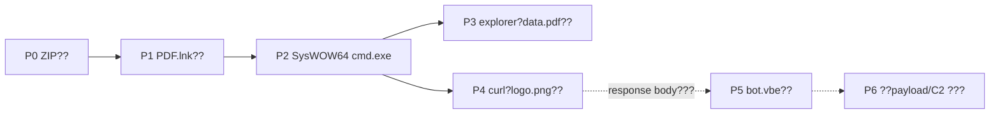
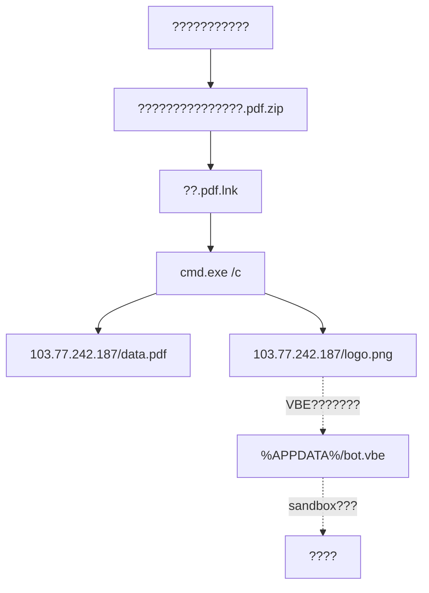
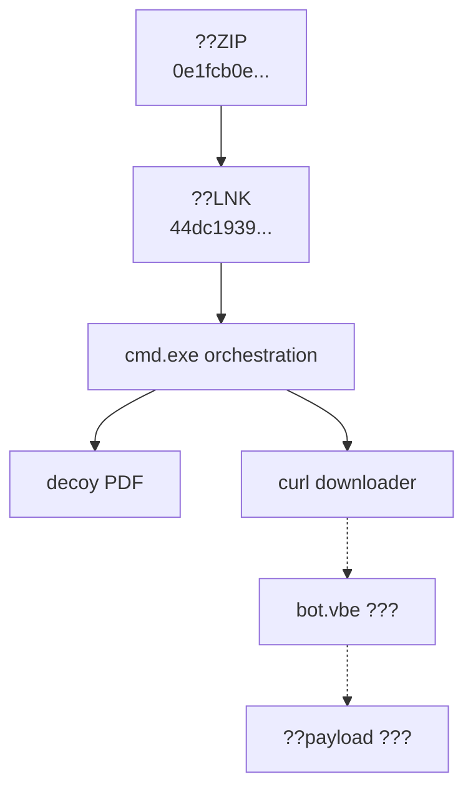

# ??????

?????????sandbox?????????command???????????????

## ?????

## ??????

## ???????

## ?????????

`SysWOW64\cmd.exe`?`mode 15,1`?`explorer`???decoy URL???`curl`????????`%APPDATA%\bot.vbe`??rename?VBE?????campaign??????????
