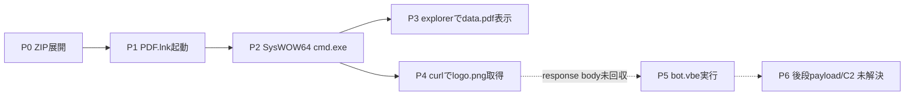
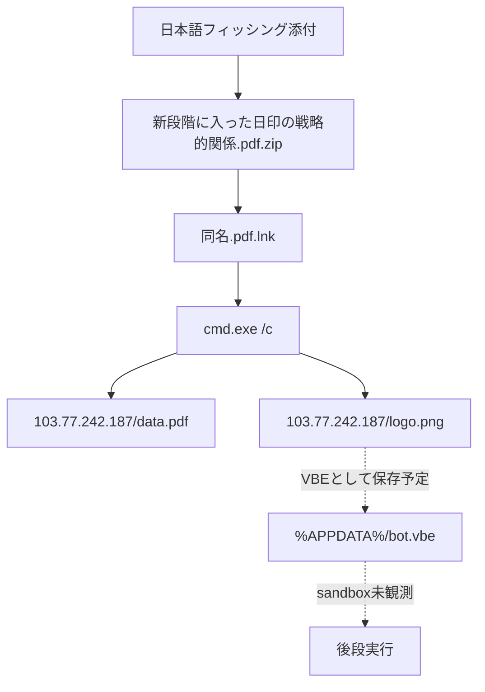
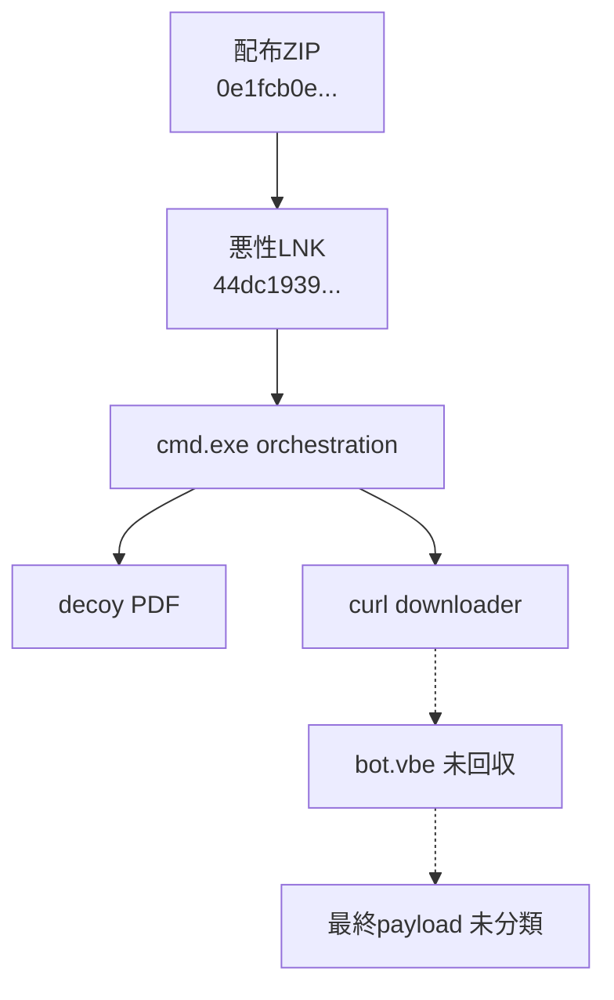

# 全体ロジック

実線は静的又は既存sandboxで確認済み、破線はcommand上の予定だが未観測の段階です。

## 実行フロー

## 感染チェーン

## モジュール関係

## 比較に使える固定点

`SysWOW64\cmd.exe`、`mode 15,1`、`explorer`によるdecoy URL表示、`curl`、画像拡張子から`%APPDATA%\bot.vbe`へのrename、VBE直接起動をcampaign類似性の軸とします。
