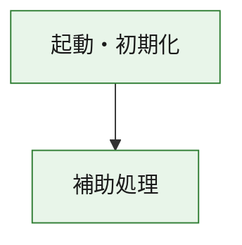
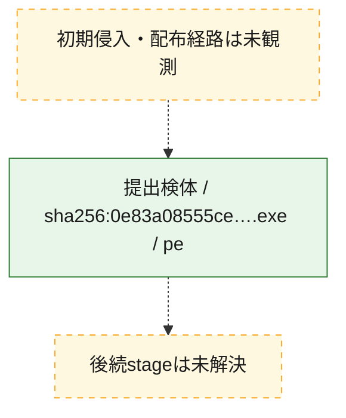
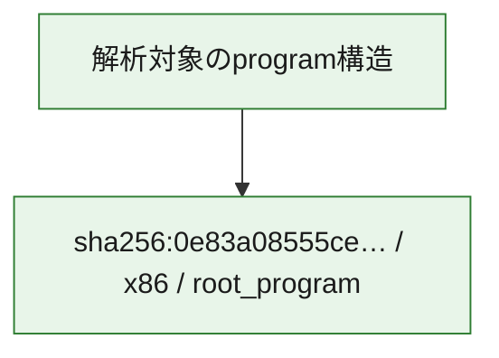

# 全体ロジック：0e83a08555ce1a8d4579c455b49b3af8bbfcbd54dfb6190a15a974f168b63826

代表関数の静的証跡から、起動・初期化の処理群を確認しました。

## 読み方

- phaseの掲載順は解析上の整理順です。observed_call_edgesがない段階間の実行順を断定しません。
- 図の実線は静的に観測した関係、点線と黄色のノードは未観測・未解決の関係を示します。
- 図は静的な要約であり、動的実行を再現するものではありません。
- 詳細な関数解説とfingerprintは[STATIC-LOGIC.md](STATIC-LOGIC.md)を参照してください。

## 静的可視化

### 実行フロー

### 感染チェーン

### モジュール関係

## 処理段階

### 1. 起動・初期化

entry pointから初期化と後続処理への移行を確認します。
確度: `confirmed_static_function_evidence`

- `0e83a08555ce1a8d4579c455b49b3af8bbfcbd54dfb6190a15a974f168b63826:ghidra:180001010` — 初期化と主要処理への分岐を行う入口関数です。 状態: `succeeded`、選定理由: `entry_point`, `meaningful_symbol_name`, `reviewed_call_centrality:22`, `role:entrypoint`, `small_program_complete_context`

### 2. 補助処理

主要処理を支える一般内部関数またはlibrary処理を確認します。
確度: `confirmed_static_function_evidence`

- `0e83a08555ce1a8d4579c455b49b3af8bbfcbd54dfb6190a15a974f168b63826:ghidra:180001240` — 検体内部の一般処理を実装する関数です。 状態: `succeeded`、選定理由: `context_representative`, `reviewed_call_centrality:2`, `small_program_complete_context`
- `0e83a08555ce1a8d4579c455b49b3af8bbfcbd54dfb6190a15a974f168b63826:ghidra:180001350` — 検体内部の一般処理を実装する関数です。 状態: `succeeded`、選定理由: `context_representative`, `reviewed_call_centrality:25`, `small_program_complete_context`
- `0e83a08555ce1a8d4579c455b49b3af8bbfcbd54dfb6190a15a974f168b63826:ghidra:180003780` — 検体内部の一般処理を実装する関数です。 状態: `succeeded`、選定理由: `context_representative`, `reviewed_call_centrality:2`, `small_program_complete_context`
- `0e83a08555ce1a8d4579c455b49b3af8bbfcbd54dfb6190a15a974f168b63826:ghidra:1800038e0` — 検体内部の一般処理を実装する関数です。 状態: `succeeded`、選定理由: `context_representative`, `reviewed_call_centrality:2`, `small_program_complete_context`

## 観測したcall関係

- `0e83a08555ce1a8d4579c455b49b3af8bbfcbd54dfb6190a15a974f168b63826:ghidra:180001010` → `0e83a08555ce1a8d4579c455b49b3af8bbfcbd54dfb6190a15a974f168b63826:ghidra:180001240` （`startup` → `support`）
- `0e83a08555ce1a8d4579c455b49b3af8bbfcbd54dfb6190a15a974f168b63826:ghidra:180001010` → `0e83a08555ce1a8d4579c455b49b3af8bbfcbd54dfb6190a15a974f168b63826:ghidra:180001350` （`startup` → `support`）
- `0e83a08555ce1a8d4579c455b49b3af8bbfcbd54dfb6190a15a974f168b63826:ghidra:180001350` → `0e83a08555ce1a8d4579c455b49b3af8bbfcbd54dfb6190a15a974f168b63826:ghidra:180001240` （`support` → `support`）
- `0e83a08555ce1a8d4579c455b49b3af8bbfcbd54dfb6190a15a974f168b63826:ghidra:180001350` → `0e83a08555ce1a8d4579c455b49b3af8bbfcbd54dfb6190a15a974f168b63826:ghidra:180003780` （`support` → `support`）
- `0e83a08555ce1a8d4579c455b49b3af8bbfcbd54dfb6190a15a974f168b63826:ghidra:180001350` → `0e83a08555ce1a8d4579c455b49b3af8bbfcbd54dfb6190a15a974f168b63826:ghidra:1800038e0` （`support` → `support`）
- `0e83a08555ce1a8d4579c455b49b3af8bbfcbd54dfb6190a15a974f168b63826:ghidra:180003780` → `0e83a08555ce1a8d4579c455b49b3af8bbfcbd54dfb6190a15a974f168b63826:ghidra:1800038e0` （`support` → `support`）
- `ghidra-function:29e4f4e603cbf901fe4c61f8` → `ghidra-external:06ff74d02edb5fec52e2330f` （`unclassified` → `unclassified`）
- `ghidra-function:29e4f4e603cbf901fe4c61f8` → `ghidra-external:07cfdcddb422ca4f6df3f581` （`unclassified` → `unclassified`）
- `ghidra-function:29e4f4e603cbf901fe4c61f8` → `ghidra-external:1fc4d94ab9eeb1bd601d18fb` （`unclassified` → `unclassified`）
- `ghidra-function:29e4f4e603cbf901fe4c61f8` → `ghidra-external:412581b7f9d5626552f32060` （`unclassified` → `unclassified`）
- `ghidra-function:29e4f4e603cbf901fe4c61f8` → `ghidra-external:443e558d4d4d565d6fe193d8` （`unclassified` → `unclassified`）
- `ghidra-function:29e4f4e603cbf901fe4c61f8` → `ghidra-external:5eda6a682e81ba4fe40b242b` （`unclassified` → `unclassified`）
- `ghidra-function:29e4f4e603cbf901fe4c61f8` → `ghidra-external:6ace7d9afa3e1f63a691188d` （`unclassified` → `unclassified`）
- `ghidra-function:29e4f4e603cbf901fe4c61f8` → `ghidra-external:750d90e9c273a0b3a06f1642` （`unclassified` → `unclassified`）
- `ghidra-function:29e4f4e603cbf901fe4c61f8` → `ghidra-external:780616710ddbd1e1e7545c3c` （`unclassified` → `unclassified`）
- `ghidra-function:29e4f4e603cbf901fe4c61f8` → `ghidra-external:870b1b87591740b169ed585c` （`unclassified` → `unclassified`）
- `ghidra-function:29e4f4e603cbf901fe4c61f8` → `ghidra-external:8741de430952581ce19cb331` （`unclassified` → `unclassified`）
- `ghidra-function:29e4f4e603cbf901fe4c61f8` → `ghidra-external:877ad304d59491822d6f664d` （`unclassified` → `unclassified`）
- `ghidra-function:29e4f4e603cbf901fe4c61f8` → `ghidra-external:93c797660ecf24d38c4dbac5` （`unclassified` → `unclassified`）
- `ghidra-function:29e4f4e603cbf901fe4c61f8` → `ghidra-external:a3abbd6b93015269a3280e14` （`unclassified` → `unclassified`）
- `ghidra-function:29e4f4e603cbf901fe4c61f8` → `ghidra-external:b1f173a893d0f7cb9c786a51` （`unclassified` → `unclassified`）
- `ghidra-function:29e4f4e603cbf901fe4c61f8` → `ghidra-external:c67b201824d3d6e60a0be644` （`unclassified` → `unclassified`）
- `ghidra-function:29e4f4e603cbf901fe4c61f8` → `ghidra-external:d32800ebccbd9c6efff35198` （`unclassified` → `unclassified`）
- `ghidra-function:29e4f4e603cbf901fe4c61f8` → `ghidra-external:e288a6db1129e30d0364fd8f` （`unclassified` → `unclassified`）
- `ghidra-function:29e4f4e603cbf901fe4c61f8` → `ghidra-external:f06056379dff44320d0c2c01` （`unclassified` → `unclassified`）
- `ghidra-function:29e4f4e603cbf901fe4c61f8` → `ghidra-external:f8718be824706d30c1611f4e` （`unclassified` → `unclassified`）
- `ghidra-function:29e4f4e603cbf901fe4c61f8` → `ghidra-external:fd078adfa8edfe3c4e04f8e1` （`unclassified` → `unclassified`）
- `ghidra-function:29e4f4e603cbf901fe4c61f8` → `ghidra-function:62effe7a9e21167b8774b030` （`unclassified` → `unclassified`）
- `ghidra-function:29e4f4e603cbf901fe4c61f8` → `ghidra-function:fc54c2505b10d216c021cadf` （`unclassified` → `unclassified`）
- `ghidra-function:29e4f4e603cbf901fe4c61f8` → `ghidra-function:fc6575847f2d8f359aff20cc` （`unclassified` → `unclassified`）
- `ghidra-function:b16d92cfddbbcef5e3cbc6e7` → `ghidra-function:0eeac106dc058c17b2c7d659` （`unclassified` → `unclassified`）
- `ghidra-function:b16d92cfddbbcef5e3cbc6e7` → `ghidra-function:24949fae3f3628d21c75e087` （`unclassified` → `unclassified`）
- `ghidra-function:b16d92cfddbbcef5e3cbc6e7` → `ghidra-function:29e4f4e603cbf901fe4c61f8` （`unclassified` → `unclassified`）
- `ghidra-function:b16d92cfddbbcef5e3cbc6e7` → `ghidra-function:3ea132d5becf87bac1ddf082` （`unclassified` → `unclassified`）
- `ghidra-function:b16d92cfddbbcef5e3cbc6e7` → `ghidra-function:40138d3190d7991bca7cc554` （`unclassified` → `unclassified`）
- `ghidra-function:b16d92cfddbbcef5e3cbc6e7` → `ghidra-function:61d5daa66c1c9ac35c68b53b` （`unclassified` → `unclassified`）
- `ghidra-function:b16d92cfddbbcef5e3cbc6e7` → `ghidra-function:65be831e95d176142d6e4718` （`unclassified` → `unclassified`）
- `ghidra-function:b16d92cfddbbcef5e3cbc6e7` → `ghidra-function:901c1c9b3e2ccf39ce968bc0` （`unclassified` → `unclassified`）
- `ghidra-function:b16d92cfddbbcef5e3cbc6e7` → `ghidra-function:b9242c45f75b84a95c14c171` （`unclassified` → `unclassified`）
- `ghidra-function:b16d92cfddbbcef5e3cbc6e7` → `ghidra-function:db95a5376cd9dcc263117443` （`unclassified` → `unclassified`）
- `ghidra-function:b16d92cfddbbcef5e3cbc6e7` → `ghidra-function:e5b7298057003092ca771727` （`unclassified` → `unclassified`）
- `ghidra-function:b16d92cfddbbcef5e3cbc6e7` → `ghidra-function:fc54c2505b10d216c021cadf` （`unclassified` → `unclassified`）
- `ghidra-function:fc6575847f2d8f359aff20cc` → `ghidra-function:62effe7a9e21167b8774b030` （`unclassified` → `unclassified`）

## 解析範囲と制約

- 選定外関数は全体inventoryへ残しますが、関数本体の個別解説対象にはしていません。
- indirect call、難読化、packer、VM、壊れたcontrol flowによりcall関係が欠落する場合があります。
- 文書は静的解析に基づき、検体実行や外部通信による動的確認は行っていません。
