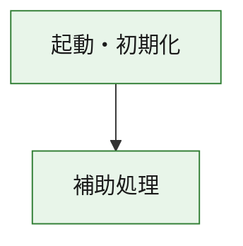
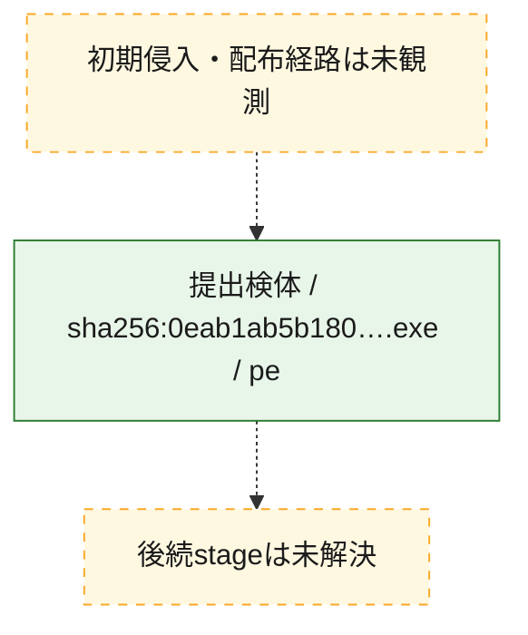
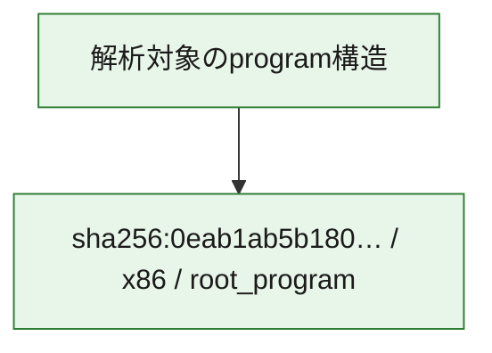

# 全体ロジック：0eab1ab5b180a14ac4f08178ee7da797cabc1ded19e53c64dd5ec89c8bc18e1d

代表関数の静的証跡から、起動・初期化の処理群を確認しました。

## 読み方

- phaseの掲載順は解析上の整理順です。observed_call_edgesがない段階間の実行順を断定しません。
- 図の実線は静的に観測した関係、点線と黄色のノードは未観測・未解決の関係を示します。
- 図は静的な要約であり、動的実行を再現するものではありません。
- 詳細な関数解説とfingerprintは[STATIC-LOGIC.md](STATIC-LOGIC.md)を参照してください。

## 静的可視化

### 実行フロー

### 感染チェーン

### モジュール関係

## 処理段階

### 1. 起動・初期化

entry pointから初期化と後続処理への移行を確認します。
確度: `confirmed_static_function_evidence`

- `0eab1ab5b180a14ac4f08178ee7da797cabc1ded19e53c64dd5ec89c8bc18e1d:ghidra:180001010` — 初期化と主要処理への分岐を行う入口関数です。 状態: `succeeded`、選定理由: `entry_point`, `meaningful_symbol_name`, `reviewed_call_centrality:22`, `role:entrypoint`, `small_program_complete_context`

### 2. 補助処理

主要処理を支える一般内部関数またはlibrary処理を確認します。
確度: `confirmed_static_function_evidence`

- `0eab1ab5b180a14ac4f08178ee7da797cabc1ded19e53c64dd5ec89c8bc18e1d:ghidra:180001240` — 検体内部の一般処理を実装する関数です。 状態: `succeeded`、選定理由: `context_representative`, `reviewed_call_centrality:2`, `small_program_complete_context`
- `0eab1ab5b180a14ac4f08178ee7da797cabc1ded19e53c64dd5ec89c8bc18e1d:ghidra:180001350` — 検体内部の一般処理を実装する関数です。 状態: `succeeded`、選定理由: `context_representative`, `reviewed_call_centrality:25`, `small_program_complete_context`
- `0eab1ab5b180a14ac4f08178ee7da797cabc1ded19e53c64dd5ec89c8bc18e1d:ghidra:180003780` — 検体内部の一般処理を実装する関数です。 状態: `succeeded`、選定理由: `context_representative`, `reviewed_call_centrality:2`, `small_program_complete_context`
- `0eab1ab5b180a14ac4f08178ee7da797cabc1ded19e53c64dd5ec89c8bc18e1d:ghidra:1800038e0` — 検体内部の一般処理を実装する関数です。 状態: `succeeded`、選定理由: `context_representative`, `reviewed_call_centrality:2`, `small_program_complete_context`

## 観測したcall関係

- `0eab1ab5b180a14ac4f08178ee7da797cabc1ded19e53c64dd5ec89c8bc18e1d:ghidra:180001010` → `0eab1ab5b180a14ac4f08178ee7da797cabc1ded19e53c64dd5ec89c8bc18e1d:ghidra:180001240` （`startup` → `support`）
- `0eab1ab5b180a14ac4f08178ee7da797cabc1ded19e53c64dd5ec89c8bc18e1d:ghidra:180001010` → `0eab1ab5b180a14ac4f08178ee7da797cabc1ded19e53c64dd5ec89c8bc18e1d:ghidra:180001350` （`startup` → `support`）
- `0eab1ab5b180a14ac4f08178ee7da797cabc1ded19e53c64dd5ec89c8bc18e1d:ghidra:180001350` → `0eab1ab5b180a14ac4f08178ee7da797cabc1ded19e53c64dd5ec89c8bc18e1d:ghidra:180001240` （`support` → `support`）
- `0eab1ab5b180a14ac4f08178ee7da797cabc1ded19e53c64dd5ec89c8bc18e1d:ghidra:180001350` → `0eab1ab5b180a14ac4f08178ee7da797cabc1ded19e53c64dd5ec89c8bc18e1d:ghidra:180003780` （`support` → `support`）
- `0eab1ab5b180a14ac4f08178ee7da797cabc1ded19e53c64dd5ec89c8bc18e1d:ghidra:180001350` → `0eab1ab5b180a14ac4f08178ee7da797cabc1ded19e53c64dd5ec89c8bc18e1d:ghidra:1800038e0` （`support` → `support`）
- `0eab1ab5b180a14ac4f08178ee7da797cabc1ded19e53c64dd5ec89c8bc18e1d:ghidra:180003780` → `0eab1ab5b180a14ac4f08178ee7da797cabc1ded19e53c64dd5ec89c8bc18e1d:ghidra:1800038e0` （`support` → `support`）
- `ghidra-function:40994d18fe6b5868dfca45a5` → `ghidra-function:0075801be7afeabee4f484f6` （`unclassified` → `unclassified`）
- `ghidra-function:40994d18fe6b5868dfca45a5` → `ghidra-function:019616421d4acc3c2924ab4a` （`unclassified` → `unclassified`）
- `ghidra-function:40994d18fe6b5868dfca45a5` → `ghidra-function:3d7136f1399e6ad424ddbf5e` （`unclassified` → `unclassified`）
- `ghidra-function:40994d18fe6b5868dfca45a5` → `ghidra-function:41228ca69260320201372e27` （`unclassified` → `unclassified`）
- `ghidra-function:40994d18fe6b5868dfca45a5` → `ghidra-function:52ef85693f078e6608b610fe` （`unclassified` → `unclassified`）
- `ghidra-function:40994d18fe6b5868dfca45a5` → `ghidra-function:55b6e06b854ad25bf1c1e5a2` （`unclassified` → `unclassified`）
- `ghidra-function:40994d18fe6b5868dfca45a5` → `ghidra-function:5c2306fa5fcc725b54202e65` （`unclassified` → `unclassified`）
- `ghidra-function:40994d18fe6b5868dfca45a5` → `ghidra-function:6b1e12b3c1698d19771772d6` （`unclassified` → `unclassified`）
- `ghidra-function:40994d18fe6b5868dfca45a5` → `ghidra-function:c747ba28345069efff143798` （`unclassified` → `unclassified`）
- `ghidra-function:40994d18fe6b5868dfca45a5` → `ghidra-function:ca56d01f22f79fb6dad44e8a` （`unclassified` → `unclassified`）
- `ghidra-function:40994d18fe6b5868dfca45a5` → `ghidra-function:d3adfc09facd7a9c66a78392` （`unclassified` → `unclassified`）
- `ghidra-function:40994d18fe6b5868dfca45a5` → `ghidra-function:d85bbb4b16bc39cddc6b59d5` （`unclassified` → `unclassified`）
- `ghidra-function:55b6e06b854ad25bf1c1e5a2` → `ghidra-external:04bdaaceb66e536b9ff00c9f` （`unclassified` → `unclassified`）
- `ghidra-function:55b6e06b854ad25bf1c1e5a2` → `ghidra-external:0a5a1c02c899e7ab2fdf783f` （`unclassified` → `unclassified`）
- `ghidra-function:55b6e06b854ad25bf1c1e5a2` → `ghidra-external:0e7755e11297fe2bc82bf7c1` （`unclassified` → `unclassified`）
- `ghidra-function:55b6e06b854ad25bf1c1e5a2` → `ghidra-external:1292e7a3882474b5fad0aeba` （`unclassified` → `unclassified`）
- `ghidra-function:55b6e06b854ad25bf1c1e5a2` → `ghidra-external:230a4be9ff91ccdc088674d3` （`unclassified` → `unclassified`）
- `ghidra-function:55b6e06b854ad25bf1c1e5a2` → `ghidra-external:33f51167b2de154309ebb1a2` （`unclassified` → `unclassified`）
- `ghidra-function:55b6e06b854ad25bf1c1e5a2` → `ghidra-external:35393f889f0276e41a1b9713` （`unclassified` → `unclassified`）
- `ghidra-function:55b6e06b854ad25bf1c1e5a2` → `ghidra-external:463015bdeb65df053aa07d48` （`unclassified` → `unclassified`）
- `ghidra-function:55b6e06b854ad25bf1c1e5a2` → `ghidra-external:680b147c75a490a5bfaf002d` （`unclassified` → `unclassified`）
- `ghidra-function:55b6e06b854ad25bf1c1e5a2` → `ghidra-external:6a25274a6ae194ba3dd2f50e` （`unclassified` → `unclassified`）
- `ghidra-function:55b6e06b854ad25bf1c1e5a2` → `ghidra-external:7a41ea40121d62aaf4593174` （`unclassified` → `unclassified`）
- `ghidra-function:55b6e06b854ad25bf1c1e5a2` → `ghidra-external:808ba812ee96aacf9103ec4c` （`unclassified` → `unclassified`）
- `ghidra-function:55b6e06b854ad25bf1c1e5a2` → `ghidra-external:90d106fb179b7393f572b6fb` （`unclassified` → `unclassified`）
- `ghidra-function:55b6e06b854ad25bf1c1e5a2` → `ghidra-external:91969bafa40335e915950ac7` （`unclassified` → `unclassified`）
- `ghidra-function:55b6e06b854ad25bf1c1e5a2` → `ghidra-external:9bce5081708aee900f21b180` （`unclassified` → `unclassified`）
- `ghidra-function:55b6e06b854ad25bf1c1e5a2` → `ghidra-external:bc70be2f7fe700b62d61eff0` （`unclassified` → `unclassified`）
- `ghidra-function:55b6e06b854ad25bf1c1e5a2` → `ghidra-external:d3556f32ea4f36f9ffab96c8` （`unclassified` → `unclassified`）
- `ghidra-function:55b6e06b854ad25bf1c1e5a2` → `ghidra-external:d40902809fae8dc38983c44b` （`unclassified` → `unclassified`）
- `ghidra-function:55b6e06b854ad25bf1c1e5a2` → `ghidra-external:db44ae7058e5c7e85811932c` （`unclassified` → `unclassified`）
- `ghidra-function:55b6e06b854ad25bf1c1e5a2` → `ghidra-external:e329588701b7ca35ab9866e8` （`unclassified` → `unclassified`）
- `ghidra-function:55b6e06b854ad25bf1c1e5a2` → `ghidra-external:fe0752ea35e72d1f5cdf3b23` （`unclassified` → `unclassified`）
- `ghidra-function:55b6e06b854ad25bf1c1e5a2` → `ghidra-function:c747ba28345069efff143798` （`unclassified` → `unclassified`）
- `ghidra-function:55b6e06b854ad25bf1c1e5a2` → `ghidra-function:eaf210374a6bc6623a955036` （`unclassified` → `unclassified`）
- `ghidra-function:55b6e06b854ad25bf1c1e5a2` → `ghidra-function:fc57f1c583ac17723aa7c019` （`unclassified` → `unclassified`）
- `ghidra-function:eaf210374a6bc6623a955036` → `ghidra-function:fc57f1c583ac17723aa7c019` （`unclassified` → `unclassified`）

## 解析範囲と制約

- 選定外関数は全体inventoryへ残しますが、関数本体の個別解説対象にはしていません。
- indirect call、難読化、packer、VM、壊れたcontrol flowによりcall関係が欠落する場合があります。
- 文書は静的解析に基づき、検体実行や外部通信による動的確認は行っていません。
